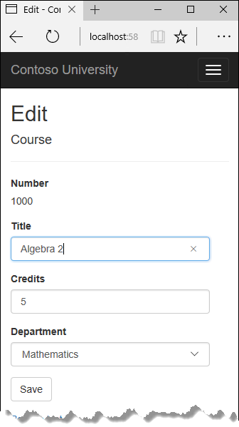
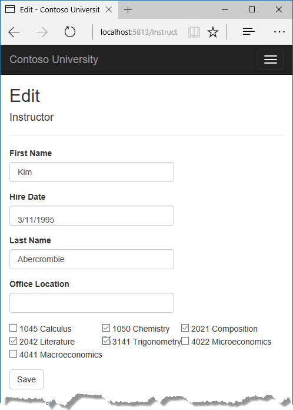
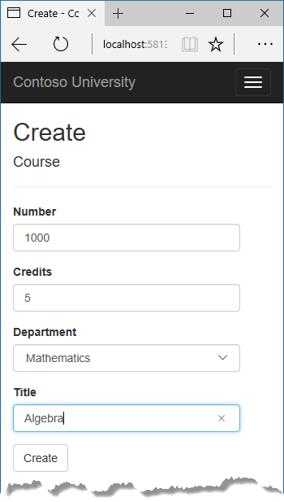
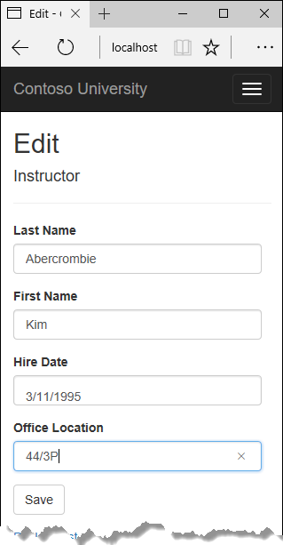

# Tutorial: Update related data - ASP.NET MVC with EF Core

In the previous tutorial you displayed related data; in this tutorial you'll update related data by updating foreign key fields and navigation properties.

The following illustrations show some of the pages that you'll work with.





In this tutorial, you:

> [!div class="checklist"]
> * Customize Courses pages
> * Add Instructors Edit page
> * Add courses to Edit page
> * Update Delete page
> * Add office location and courses to Create page

## Prerequisites

* [Read related data](read-related-data.md)

## Customize Courses pages

When a new `Course` entity is created, it must have a relationship to an existing department. To facilitate this, the scaffolded code includes controller methods and Create and Edit views that include a drop-down list for selecting the department. The drop-down list sets the `Course.DepartmentID` foreign key property, and that's all the Entity Framework needs in order to load the `Department` navigation property with the appropriate `Department` entity. You'll use the scaffolded code, but change it slightly to add error handling and sort the drop-down list.

In `CoursesController.cs`, delete the four Create and Edit methods and replace them with the following code:

[!code-csharp[](intro/samples/cu/Controllers/CoursesController.cs?name=snippet_CreateGet)]

[!code-csharp[](intro/samples/cu/Controllers/CoursesController.cs?name=snippet_CreatePost)]

[!code-csharp[](intro/samples/cu/Controllers/CoursesController.cs?name=snippet_EditGet)]

[!code-csharp[](intro/samples/cu/Controllers/CoursesController.cs?name=snippet_EditPost)]

After the `Edit` HttpPost method, create a new method that loads department info for the drop-down list.

[!code-csharp[](intro/samples/cu/Controllers/CoursesController.cs?name=snippet_Departments)]

The `PopulateDepartmentsDropDownList` method gets a list of all departments sorted by name, creates a `SelectList` collection for a drop-down list, and passes the collection to the view in `ViewBag`. The method accepts the optional `selectedDepartment` parameter that allows the calling code to specify the item that will be selected when the drop-down list is rendered. The view will pass the name "DepartmentID" to the `<select>` tag helper, and the helper then knows to look in the `ViewBag` object for a `SelectList` named "DepartmentID".

The HttpGet `Create` method calls the `PopulateDepartmentsDropDownList` method without setting the selected item, because for a new course the department isn't established yet:

[!code-csharp[](intro/samples/cu/Controllers/CoursesController.cs?highlight=3&name=snippet_CreateGet)]

The HttpGet `Edit` method sets the selected item, based on the ID of the department that's already assigned to the course being edited:

[!code-csharp[](intro/samples/cu/Controllers/CoursesController.cs?highlight=15&name=snippet_EditGet)]

The HttpPost methods for both `Create` and `Edit` also include code that sets the selected item when they redisplay the page after an error. This ensures that when the page is redisplayed to show the error message, whatever department was selected stays selected.

### Add .AsNoTracking to Details and Delete methods

To optimize performance of the Course Details and Delete pages, add `AsNoTracking` calls in the `Details` and HttpGet `Delete` methods.

[!code-csharp[](intro/samples/cu/Controllers/CoursesController.cs?highlight=10&name=snippet_Details)]

[!code-csharp[](intro/samples/cu/Controllers/CoursesController.cs?highlight=10&name=snippet_DeleteGet)]

### Modify the Course views

In `Views/Courses/Create.cshtml`, add a "Select Department" option to the **Department** drop-down list, change the caption from **DepartmentID** to **Department**, and add a validation message.

[!code-cshtml[](intro/samples/cu/Views/Courses/Create.cshtml?highlight=2-6&range=29-35)]

In `Views/Courses/Edit.cshtml`, make the same change for the Department field that you just did in `Create.cshtml`.

Also in `Views/Courses/Edit.cshtml`, add a course number field before the **Title** field. Because the course number is the primary key, it's displayed, but it can't be changed.

[!code-cshtml[](intro/samples/cu/Views/Courses/Edit.cshtml?range=15-18)]

There's already a hidden field (`<input type="hidden">`) for the course number in the Edit view. Adding a `<label>` tag helper doesn't eliminate the need for the hidden field because it doesn't cause the course number to be included in the posted data when the user clicks **Save** on the **Edit** page.

In `Views/Courses/Delete.cshtml`, add a course number field at the top and change department ID to department name.

[!code-cshtml[](intro/samples/cu/Views/Courses/Delete.cshtml?highlight=14-19,36)]

In `Views/Courses/Details.cshtml`, make the same change that you just did for `Delete.cshtml`.

### Test the Course pages

Run the app, select the **Courses** tab, click **Create New**, and enter data for a new course:



Click **Create**. The Courses Index page is displayed with the new course added to the list. The department name in the Index page list comes from the navigation property, showing that the relationship was established correctly.

Click **Edit** on a course in the Courses Index page.


Change data on the page and click **Save**. The Courses Index page is displayed with the updated course data.

## Add Instructors Edit page

When you edit an instructor record, you want to be able to update the instructor's office assignment. The `Instructor` entity has a one-to-zero-or-one relationship with the `OfficeAssignment` entity, which means your code has to handle the following situations:

* If the user clears the office assignment and it originally had a value, delete the `OfficeAssignment` entity.

* If the user enters an office assignment value and it originally was empty, create a new `OfficeAssignment` entity.

* If the user changes the value of an office assignment, change the value in an existing `OfficeAssignment` entity.

### Update the Instructors controller

In `InstructorsController.cs`, change the code in the HttpGet `Edit` method so that it loads the Instructor entity's `OfficeAssignment` navigation property and calls `AsNoTracking`:

[!code-csharp[](intro/samples/cu/Controllers/InstructorsController.cs?highlight=8-11&name=snippet_EditGetOA)]

Replace the HttpPost `Edit` method with the following code to handle office assignment updates:

[!code-csharp[](intro/samples/cu/Controllers/InstructorsController.cs?name=snippet_EditPostOA)]

The code does the following:

* Changes the method name to `EditPost` because the signature is now the same as the HttpGet `Edit` method (the `ActionName` attribute specifies that the `/Edit/` URL is still used).

* Gets the current `Instructor` entity from the database using eager loading for the `OfficeAssignment` navigation property. This is the same as what you did in the HttpGet `Edit` method.

* Updates the retrieved `Instructor` entity with values from the model binder. The `TryUpdateModel` overload enables you to declare the properties you want to include. This prevents over-posting, as explained in the [second tutorial](crud.md).

    <!-- Snippets don't play well with <ul> [!code-csharp[](intro/samples/cu/Controllers/InstructorsController.cs?range=241-244)] -->

    ```csharp
    if (await TryUpdateModelAsync<Instructor>(
        instructorToUpdate,
        "",
        i => i.FirstMidName, i => i.LastName, i => i.HireDate, i => i.OfficeAssignment))
    ```

* If the office location is blank, sets the `Instructor.OfficeAssignment` property to null so that the related row in the `OfficeAssignment` table will be deleted.

    <!-- Snippets don't play well with <ul>  "intro/samples/cu/Controllers/InstructorsController.cs"} -->

    ```csharp
    if (String.IsNullOrWhiteSpace(instructorToUpdate.OfficeAssignment?.Location))
    {
        instructorToUpdate.OfficeAssignment = null;
    }
    ```

* Saves the changes to the database.

### Update the Instructor Edit view

In `Views/Instructors/Edit.cshtml`, add a new field for editing the office location, at the end before the **Save** button:

[!code-cshtml[](intro/samples/cu/Views/Instructors/Edit.cshtml?range=30-34)]

Run the app, select the **Instructors** tab, and then click **Edit** on an instructor. Change the **Office Location** and click **Save**.



## Add courses to Edit page

Instructors may teach any number of courses. Now you'll enhance the Instructor Edit page by adding the ability to change course assignments using a group of checkboxes, as shown in the following screen shot:


The relationship between the `Course` and `Instructor` entities is many-to-many. To add and remove relationships, you add and remove entities to and from the `CourseAssignments` join entity set.

The UI that enables you to change which courses an instructor is assigned to is a group of checkboxes. A checkbox for every course in the database is displayed, and the ones that the instructor is currently assigned to are selected. The user can select or clear checkboxes to change course assignments. If the number of courses were much greater, you would probably want to use a different method of presenting the data in the view, but you'd use the same method of manipulating a join entity to create or delete relationships.

### Update the Instructors controller

To provide data to the view for the list of checkboxes, you'll use a view model class.

Create `AssignedCourseData.cs` in the *SchoolViewModels* folder and replace the existing code with the following code:

[!code-csharp[](intro/samples/cu/Models/SchoolViewModels/AssignedCourseData.cs)]

In `InstructorsController.cs`, replace the HttpGet `Edit` method with the following code. The changes are highlighted.

[!code-csharp[](intro/samples/cu/Controllers/InstructorsController.cs?highlight=10,17,21,22,23,24,25,26,27,28,29,30,31,32,33,34,35,36&name=snippet_EditGetCourses)]

The code adds eager loading for the `Courses` navigation property and calls the new `PopulateAssignedCourseData` method to provide information for the checkbox array using the `AssignedCourseData` view model class.

The code in the `PopulateAssignedCourseData` method reads through all `Course` entities in order to load a list of courses using the view model class. For each course, the code checks whether the course exists in the instructor's `Courses` navigation property. To create efficient lookup when checking whether a course is assigned to the instructor, the courses assigned to the instructor are put into a `HashSet` collection. The `Assigned` property  is set to true for courses the instructor is assigned to. The view will use this property to determine which checkboxes must be displayed as selected. Finally, the list is passed to the view in `ViewData`.

Next, add the code that's executed when the user clicks **Save**. Replace the `EditPost` method with the following code, and add a new method that updates the `Courses` navigation property of the Instructor entity.

[!code-csharp[](intro/samples/cu/Controllers/InstructorsController.cs?highlight=1,3,12,13,25,39-40&name=snippet_EditPostCourses)]

[!code-csharp[](intro/samples/cu/Controllers/InstructorsController.cs?name=snippet_UpdateCourses&highlight=1-31)]

The method signature is now different from the HttpGet `Edit` method, so the method name changes from `EditPost` back to `Edit`.

Since the view doesn't have a collection of Course entities, the model binder can't automatically update the `CourseAssignments` navigation property. Instead of using the model binder to update the `CourseAssignments` navigation property, you do that in the new `UpdateInstructorCourses` method. Therefore, you need to exclude the `CourseAssignments` property from model binding. This doesn't require any change to the code that calls `TryUpdateModel` because you're using the overload that requires explicit approval and `CourseAssignments` isn't in the include list.

If no checkboxes were selected, the code in `UpdateInstructorCourses` initializes the `CourseAssignments` navigation property with an empty collection and returns:

[!code-csharp[](intro/samples/cu/Controllers/InstructorsController.cs?name=snippet_UpdateCourses&highlight=3-7)]

The code then loops through all courses in the database and checks each course against the ones currently assigned to the instructor versus the ones that were selected in the view. To facilitate efficient lookups, the latter two collections are stored in `HashSet` objects.

If the checkbox for a course was selected but the course isn't in the `Instructor.CourseAssignments` navigation property, the course is added to the collection in the navigation property.

[!code-csharp[](intro/samples/cu/Controllers/InstructorsController.cs?highlight=14-20&name=snippet_UpdateCourses)]

If the checkbox for a course wasn't selected, but the course is in the `Instructor.CourseAssignments` navigation property, the course is removed from the navigation property.

[!code-csharp[](intro/samples/cu/Controllers/InstructorsController.cs?highlight=21-29&name=snippet_UpdateCourses)]

### Update the Instructor views

In `Views/Instructors/Edit.cshtml`, add a **Courses** field with an array of checkboxes by adding the following code immediately after the `div` elements for the **Office** field and before the `div` element for the **Save** button.

<a id="notepad"></a>
> [!NOTE]
> When you paste the code in Visual Studio, line breaks might be changed in a way that breaks the code. If the code looks different after pasting, press Ctrl+Z one time to undo the automatic formatting. This will fix the line breaks so that they look like what you see here. The indentation doesn't have to be perfect, but the `@:</tr><tr>`, `@:<td>`, `@:</td>`, and `@:</tr>` lines must each be on a single line as shown or you'll get a runtime error. With the block of new code selected, press Tab three times to line up the new code with the existing code. This problem is fixed in Visual Studio 2019.

[!code-cshtml[](intro/samples/cu/Views/Instructors/Edit.cshtml?range=35-61)]

This code creates an HTML table that has three columns. In each column is a checkbox followed by a caption that consists of the course number and title. The checkboxes all have the same name ("selectedCourses"), which informs the model binder that they're to be treated as a group. The value attribute of each checkbox is set to the value of `CourseID`. When the page is posted, the model binder passes an array to the controller that consists of the `CourseID` values for only the checkboxes which are selected.

When the checkboxes are initially rendered, those that are for courses assigned to the instructor have checked attributes, which selects them (displays them checked).

Run the app, select the **Instructors** tab, and click **Edit** on an instructor to see the **Edit** page.


Change some course assignments and click Save. The changes you make are reflected on the Index page.

> [!NOTE]
> The approach taken here to edit instructor course data works well when there's a limited number of courses. For collections that are much larger, a different UI and a different updating method would be required.

## Update Delete page

In `InstructorsController.cs`, delete the `DeleteConfirmed` method and insert the following code in its place.

[!code-csharp[](intro/samples/cu/Controllers/InstructorsController.cs?highlight=5-7,9-12&name=snippet_DeleteConfirmed)]

This code makes the following changes:

* Does eager loading for the `CourseAssignments` navigation property. You have to include this or EF won't know about related `CourseAssignment` entities and won't delete them. To avoid needing to read them here you could configure cascade delete in the database.

* If the instructor to be deleted is assigned as administrator of any departments, removes the instructor assignment from those departments.

## Add office location and courses to Create page

In `InstructorsController.cs`, delete the HttpGet and HttpPost `Create` methods, and then add the following code in their place:

[!code-csharp[](intro/samples/cu/Controllers/InstructorsController.cs?name=snippet_Create&highlight=3-5,12,14-22,29)]

This code is similar to what you saw for the `Edit` methods except that initially no courses are selected. The HttpGet `Create` method calls the `PopulateAssignedCourseData` method not because there might be courses selected but in order to provide an empty collection for the `foreach` loop in the view (otherwise the view code would throw a null reference exception).

The HttpPost `Create` method adds each selected course to the `CourseAssignments` navigation property before it checks for validation errors and adds the new instructor to the database. Courses are added even if there are model errors so that when there are model errors (for an example, the user keyed an invalid date), and the page is redisplayed with an error message, any course selections that were made are automatically restored.

Notice that in order to be able to add courses to the `CourseAssignments` navigation property you have to initialize the property as an empty collection:

```csharp
instructor.CourseAssignments = new List<CourseAssignment>();
```

As an alternative to doing this in controller code, you could do it in the `Instructor` model by changing the property getter to automatically create the collection if it doesn't exist, as shown in the following example:

```csharp
private ICollection<CourseAssignment> _courseAssignments;
public ICollection<CourseAssignment> CourseAssignments
{
    get
    {
        return _courseAssignments ?? (_courseAssignments = new List<CourseAssignment>());
    }
    set
    {
        _courseAssignments = value;
    }
}
```

If you modify the `CourseAssignments` property in this way, you can remove the explicit property initialization code in the controller.

In `Views/Instructor/Create.cshtml`, add an office location text box and checkboxes for courses before the Submit button. As in the case of the Edit page, [fix the formatting if Visual Studio reformats the code when you paste it](#notepad).

[!code-cshtml[](intro/samples/cu/Views/Instructors/Create.cshtml?range=29-61)]

Test by running the app and creating an instructor.

## Handling Transactions

As explained in the [CRUD tutorial](crud.md), the Entity Framework implicitly implements transactions. For scenarios where you need more control -- for example, if you want to include operations done outside of Entity Framework in a transaction -- see [Transactions](/ef/core/saving/transactions).

## Get the code

[Download or view the completed application.](https://github.com/dotnet/AspNetCore.Docs/tree/main/aspnetcore/data/ef-mvc/intro/samples/cu-final)

## Next steps

In this tutorial, you:

> [!div class="checklist"]
> * Customized Courses pages
> * Added Instructors Edit page
> * Added courses to Edit page
> * Updated Delete page
> * Added office location and courses to Create page

Advance to the next tutorial to learn how to handle concurrency conflicts.

> [!div class="nextstepaction"]
> [Handle concurrency conflicts](concurrency.md)
