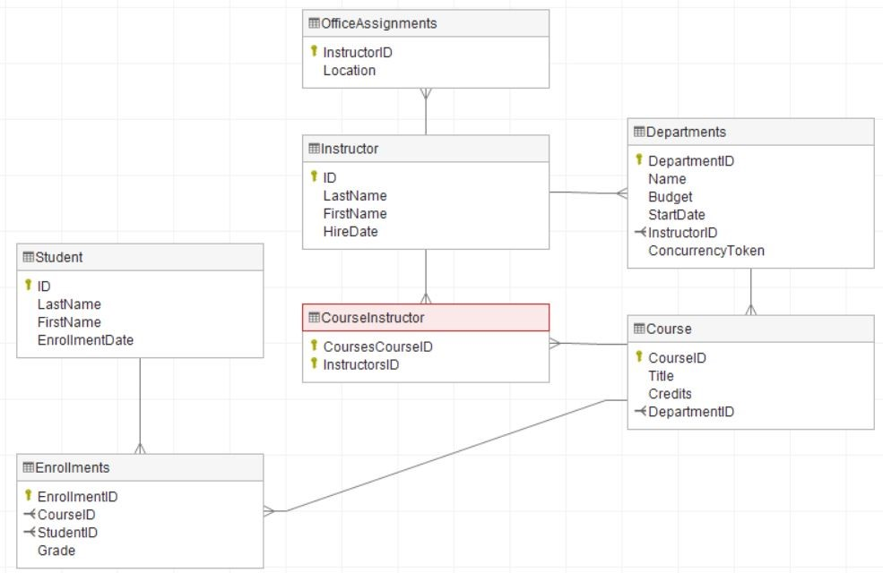
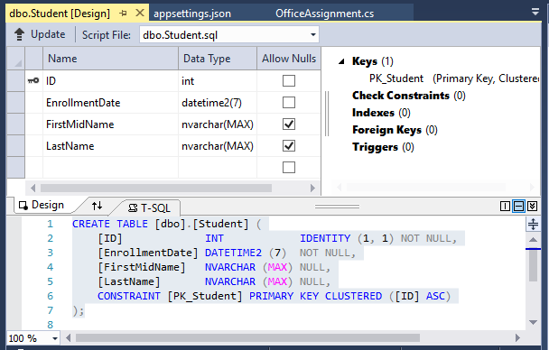
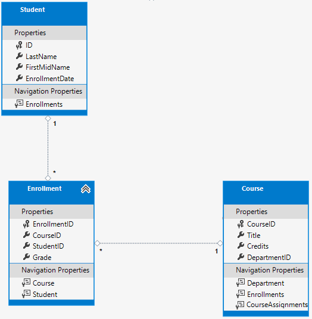
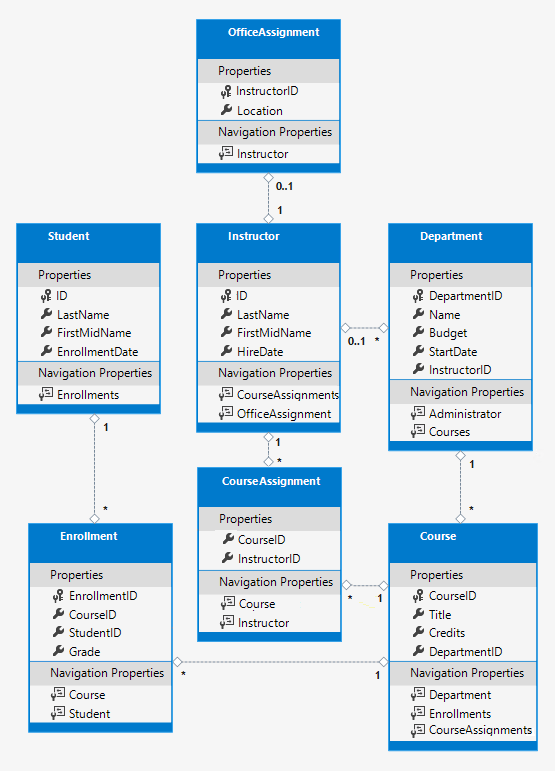
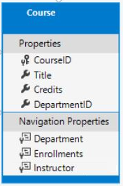
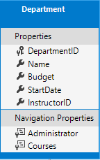
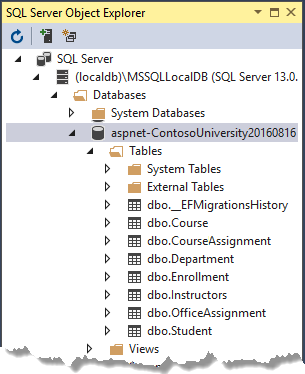
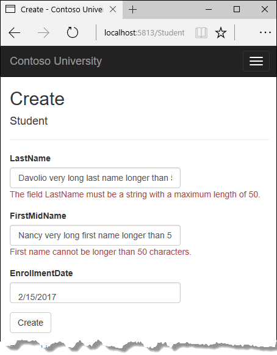

<!-- Removed from V 5.0, CourseAssignment -->

# Part 5, Razor Pages with EF Core in ASP.NET Core - Data Model

By [Tom Dykstra](https://github.com/tdykstra), [Jeremy Likness](https://twitter.com/jeremylikness), and [Jon P Smith](https://twitter.com/thereformedprog)

[!INCLUDE [about the series](~/includes/RP-EF/intro.md)]

:::moniker range=">= aspnetcore-5.0"

The previous tutorials worked with a basic data model that was composed of three entities. In this tutorial:

* More entities and relationships are added.
* The data model is customized by specifying formatting, validation, and database mapping rules.

The completed data model is shown in the following illustration:


The following database diagram was made with [Dataedo](https://dataedo.com/):

<!--Image added in https://github.com/dotnet/AspNetCore.Docs/pull/21922  -->



To create a database diagram with Dataedo:

* [Deploy the app to Azure](/azure/app-service/tutorial-dotnetcore-sqldb-app)
* Download and install [Dataedo](https://dataedo.com/) on your computer.
* Follow the instructions [Generate documentation for Azure SQL Database in 5 minutes
](https://dataedo.com/tutorials/generate-documentation-for-azure-sql-database)

In the preceding Dataedo diagram, the `CourseInstructor` is a join table created by Entity Framework. For more information, see [Many-to-many](/ef/core/modeling/relationships#many-to-many)

## The Student entity

Replace the code in `Models/Student.cs` with the following code:

[!code-csharp[](intro/samples/cu30/Models/Student.cs)]

The preceding code adds a `FullName` property and adds the following attributes to existing properties:

* [`[DataType]`](xref:System.ComponentModel.DataAnnotations.DataTypeAttribute)
* [`[DisplayFormat]`](xref:System.ComponentModel.DataAnnotations.DisplayFormatAttribute)
* [`[StringLength]`](xref:System.ComponentModel.DataAnnotations.StringLengthAttribute)
* [`[Column]`](xref:System.ComponentModel.DataAnnotations.Schema.ColumnAttribute)
* [`[Required]`](xref:System.ComponentModel.DataAnnotations.RequiredAttribute)
* [`[Display]`](xref:System.ComponentModel.DataAnnotations.DisplayAttribute)

### The FullName calculated property

`FullName` is a calculated property that returns a value that's created by concatenating two other properties. `FullName` can't be set, so it has only a get accessor. No `FullName` column is created in the database.

### The DataType attribute

```csharp
[DataType(DataType.Date)]
```

For student enrollment dates, all of the pages currently display the time of day along with the date, although only the date is relevant. By using data annotation attributes, you can make one code change that will fix the display format in every page that shows the data. 

The [DataType](xref:System.ComponentModel.DataAnnotations.DataTypeAttribute) attribute specifies a data type that's more specific than the database intrinsic type. In this case only the date should be displayed, not the date and time. The [DataType Enumeration](xref:System.ComponentModel.DataAnnotations.DataType) provides for many data types, such as Date, Time, PhoneNumber, Currency, EmailAddress, etc. The `DataType` attribute can also enable the app to automatically provide type-specific features. For example:

* The `mailto:` link is automatically created for `DataType.EmailAddress`.
* The date selector is provided for `DataType.Date` in most browsers.

The `DataType` attribute emits HTML 5 `data-` (pronounced data dash) attributes. The `DataType` attributes don't provide validation.

### The DisplayFormat attribute

```csharp
[DisplayFormat(DataFormatString = "{0:yyyy-MM-dd}", ApplyFormatInEditMode = true)]
```

`DataType.Date` doesn't specify the format of the date that's displayed. By default, the date field is displayed according to the default formats based on the server's [CultureInfo](xref:fundamentals/localization#provide-localized-resources-for-the-languages-and-cultures-you-support).

The `DisplayFormat` attribute is used to explicitly specify the date format. The `ApplyFormatInEditMode` setting specifies that the formatting should also be applied to the edit UI. Some fields shouldn't use `ApplyFormatInEditMode`. For example, the currency symbol should generally not be displayed in an edit text box.

The `DisplayFormat` attribute can be used by itself. It's generally a good idea to use the `DataType` attribute with the `DisplayFormat` attribute. The `DataType` attribute conveys the semantics of the data as opposed to how to render it on a screen. The `DataType` attribute provides the following benefits that are not available in `DisplayFormat`:

* The browser can enable HTML5 features. For example, show a calendar control, the locale-appropriate currency symbol, email links, and client-side input validation.
* By default, the browser renders data using the correct format based on the locale.

For more information, see the [\<input> Tag Helper documentation](xref:mvc/views/working-with-forms#the-input-tag-helper).

### The StringLength attribute

```csharp
[StringLength(50, ErrorMessage = "First name cannot be longer than 50 characters.")]
```

Data validation rules and validation error messages can be specified with attributes. The [StringLength](xref:System.ComponentModel.DataAnnotations.StringLengthAttribute) attribute specifies the minimum and maximum length of characters that are allowed in a data field. The code shown limits names to no more than 50 characters. An example that sets the minimum string length is shown [later](#the-required-attribute).

The `StringLength` attribute also provides client-side and server-side validation. The minimum value has no impact on the database schema.

The `StringLength` attribute doesn't prevent a user from entering white space for a name. The [RegularExpression](xref:System.ComponentModel.DataAnnotations.RegularExpressionAttribute) attribute can be used to apply restrictions to the input. For example, the following code requires the first character to be upper case and the remaining characters to be alphabetical:

```csharp
[RegularExpression(@"^[A-Z]+[a-zA-Z]*$")]
```

# [Visual Studio](#tab/visual-studio)

In **SQL Server Object Explorer** (SSOX), open the Student table designer by double-clicking the **Student** table.



The preceding image shows the schema for the `Student` table. The name fields have type `nvarchar(MAX)`. When a migration is created and applied later in this tutorial, the name fields become `nvarchar(50)` as a result of the string length attributes.

# [Visual Studio Code](#tab/visual-studio-code)

Using a SQLite tool, examine the column definitions for the `Student` table. The name fields have type `Text`. Notice that the first name field is called `FirstMidName`. In the next section, `FirstMidName` is changed to `FirstName`.

---

### The Column attribute

```csharp
[Column("FirstName")]
public string FirstMidName { get; set; }
```

Attributes can control how classes and properties are mapped to the database. In the `Student` model, the `Column` attribute is used to map the name of the `FirstMidName` property to "FirstName" in the database.

When the database is created, property names on the model are used for column names (except when the `Column` attribute is used). The `Student` model uses `FirstMidName` for the first-name field because the field might also contain a middle name.

With the `[Column]` attribute, `Student.FirstMidName` in the data model maps to the `FirstName` column of the `Student` table. The addition of the `Column` attribute changes the model backing the `SchoolContext`. The model backing the `SchoolContext` no longer matches the database. That discrepancy will be resolved by adding a migration later in this tutorial.

### The Required attribute

```csharp
[Required]
```

The `Required` attribute makes the name properties required fields. The `Required` attribute isn't needed for non-nullable types such as value types (for example, `DateTime`, `int`, and `double`). Types that can't be null are automatically treated as required fields.

The `Required` attribute must be used with `MinimumLength` for the `MinimumLength` to be enforced.

```csharp
[Display(Name = "Last Name")]
[Required]
[StringLength(50, MinimumLength=2)]
public string LastName { get; set; }
```

`MinimumLength` and `Required` allow whitespace to satisfy the validation. Use the `RegularExpression` attribute for full control over the string.

### The Display attribute

```csharp
[Display(Name = "Last Name")]
```

The `Display` attribute specifies that the caption for the text boxes should be "First Name", "Last Name", "Full Name", and "Enrollment Date." The default captions had no space dividing the words, for example "Lastname."

### Create a migration

Run the app and go to the Students page. An exception is thrown. The `[Column]` attribute causes EF to expect to find a column named `FirstName`, but the column name in the database is still `FirstMidName`.

# [Visual Studio](#tab/visual-studio)

The error message is similar to the following example:

```
SqlException: Invalid column name 'FirstName'.
There are pending model changes
Pending model changes are detected in the following:

SchoolContext
```

* In the PMC, enter the following commands to create a new migration and update the database:

  ```powershell
  Add-Migration ColumnFirstName
  Update-Database
   
  ```

  The first of these commands generates the following warning message:

  ```text
  An operation was scaffolded that may result in the loss of data.
  Please review the migration for accuracy.
  ```

  The warning is generated because the name fields are now limited to 50 characters. If a name in the database had more than 50 characters, the 51 to last character would be lost.

* Open the Student table in SSOX:

  

  Before the migration was applied, the name columns were of type [nvarchar(MAX)](/sql/t-sql/data-types/nchar-and-nvarchar-transact-sql). The name columns are now `nvarchar(50)`. The column name has changed from `FirstMidName` to `FirstName`.

# [Visual Studio Code](#tab/visual-studio-code)

The error message is similar to the following example:

```
SqliteException: SQLite Error 1: 'no such column: s.FirstName'.
```

* Open a command window in the project folder. Enter the following commands to create a new migration and update the database:

  ```dotnetcli
  dotnet ef migrations add ColumnFirstName
  dotnet ef database update
  ```
<!--
  The database update command displays an error like the following example:

  ```text
  SQLite does not support this migration operation ('AlterColumnOperation'). For more information, see http://go.microsoft.com/fwlink/?LinkId=723262.
  ```

For this tutorial, the way to get past this error is to delete and re-create the initial migration. For more information, see the SQLite warning note at the top of the [migrations tutorial](xref:data/ef-rp/migrations).

* Delete the *Migrations* folder.
* Run the following commands to drop the database, create a new initial migration, and apply the migration:

  ```dotnetcli
  dotnet ef database drop --force
  dotnet ef migrations add InitialCreate
  dotnet ef database update
   
  ```
-->
* Examine the Student table with a SQLite tool. The column that was `FirstMidName` is now `FirstName`.

---

* Run the app and go to the Students page.
* Notice that times are not input or displayed along with dates.
* Select **Create New**, and try to enter a name longer than 50 characters.

> [!Note]
> In the following sections, building the app at some stages generates compiler errors. The instructions specify when to build the app.

## The Instructor Entity

<!-- no longer using PJT
 -->

Create `Models/Instructor.cs` with the following code:

[!code-csharp[](intro/samples/cu50/Models/Instructor.cs?name=snippet_BeforeInheritance)]

Multiple attributes can be on one line. The `HireDate` attributes could be written as follows:

```csharp
[DataType(DataType.Date),Display(Name = "Hire Date"),DisplayFormat(DataFormatString = "{0:yyyy-MM-dd}", ApplyFormatInEditMode = true)]
```

### Navigation properties

The `Courses` and `OfficeAssignment` properties are navigation properties.

An instructor can teach any number of courses, so `Courses` is defined as a collection.

```csharp
public ICollection<Course> Courses { get; set; }
```

An instructor can have at most one office, so the `OfficeAssignment` property holds a single `OfficeAssignment` entity. `OfficeAssignment` is null if no office is assigned.

```csharp
public OfficeAssignment OfficeAssignment { get; set; }
```

## The OfficeAssignment entity


Create `Models/OfficeAssignment.cs` with the following code:

[!code-csharp[](intro/samples/cu30/Models/OfficeAssignment.cs)]

### The Key attribute

The [`[Key]`](xref:System.ComponentModel.DataAnnotations.KeyAttribute) attribute is used to identify a property as the primary key (PK) when the property name is something other than `classnameID` or `ID`.

There's a one-to-zero-or-one relationship between the `Instructor` and `OfficeAssignment` entities. An office assignment only exists in relation to the instructor it's assigned to. The `OfficeAssignment` PK is also its foreign key (FK) to the `Instructor` entity. A one-to-zero-or-one relationship occurs when a PK in one table is both a PK and a FK in another table.

EF Core can't automatically recognize `InstructorID` as the PK of `OfficeAssignment` because `InstructorID` doesn't follow the ID or classnameID naming convention. Therefore, the `Key` attribute is used to identify `InstructorID` as the PK:

```csharp
[Key]
public int InstructorID { get; set; }
```

By default, EF Core treats the key as non-database-generated because the column is for an identifying relationship. For more information, see [EF Keys](/ef/core/modeling/keys).

### The Instructor navigation property

The `Instructor.OfficeAssignment` navigation property can be null because there might not be an `OfficeAssignment` row for a given instructor. An instructor might not have an office assignment.

The `OfficeAssignment.Instructor` navigation property will always have an instructor entity because the foreign key `InstructorID` type is `int`, a non-nullable value type. An office assignment can't exist without an instructor.

When an `Instructor` entity has a related `OfficeAssignment` entity, each entity has a reference to the other one in its navigation property.

## The Course Entity

Update `Models/Course.cs` with the following code:

[!code-csharp[](intro/samples/cu50/Models/Course.cs?highlight=2,10,13,16,19,21,23)]

The `Course` entity has a foreign key (FK) property `DepartmentID`. `DepartmentID` points to the related `Department` entity. The `Course` entity has a `Department` navigation property.

EF Core doesn't require a foreign key property for a data model when the model has a navigation property for a related entity. EF Core automatically creates FKs in the database wherever they're needed. EF Core creates [shadow properties](/ef/core/modeling/shadow-properties) for automatically created FKs. However, explicitly including the FK in the data model can make updates simpler and more efficient. For example, consider a model where the FK property `DepartmentID` is ***not*** included. When a course entity is fetched to edit:

* The `Department` property is `null` if it's not explicitly loaded.
* To update the course entity, the `Department` entity must first be fetched.

When the FK property `DepartmentID` is included in the data model, there's no need to fetch the `Department` entity before an update.

### The DatabaseGenerated attribute

The `[DatabaseGenerated(DatabaseGeneratedOption.None)]` attribute specifies that the PK is provided by the application rather than generated by the database.

```csharp
[DatabaseGenerated(DatabaseGeneratedOption.None)]
[Display(Name = "Number")]
public int CourseID { get; set; }
```

By default, EF Core assumes that PK values are generated by the database. Database-generated is generally the best approach. For `Course` entities, the user specifies the PK. For example, a course number such as a 1000 series for the math department, a 2000 series for the English department.

The `DatabaseGenerated` attribute can also be used to generate default values. For example, the database can automatically generate a date field to record the date a row was created or updated. For more information, see [Generated Properties](/ef/core/modeling/generated-properties).

### Foreign key and navigation properties

The foreign key (FK) properties and navigation properties in the `Course` entity reflect the following relationships:

A course is assigned to one department, so there's a `DepartmentID` FK and a `Department` navigation property.

```csharp
public int DepartmentID { get; set; }
public Department Department { get; set; }
```

A course can have any number of students enrolled in it, so the `Enrollments` navigation property is a collection:

```csharp
public ICollection<Enrollment> Enrollments { get; set; }
```

A course may be taught by multiple instructors, so the `Instructors` navigation property is a collection:

```csharp
public ICollection<Instructor> Instructors { get; set; }
```

## The Department entity

Create `Models/Department.cs` with the following code:

[!code-csharp[](intro/samples/cu50/Models/Department.cs?name=snippet1)]

### The Column attribute

Previously the `Column` attribute was used to change column name mapping. In the code for the `Department` entity, the `Column` attribute is used to change SQL data type mapping. The `Budget` column is defined using the SQL Server money type in the database:

```csharp
[Column(TypeName="money")]
public decimal Budget { get; set; }
```

Column mapping is generally not required. EF Core chooses the appropriate SQL Server data type based on the CLR type for the property. The CLR `decimal` type maps to a SQL Server `decimal` type. `Budget` is for currency, and the money data type is more appropriate for currency.

### Foreign key and navigation properties

The FK and navigation properties reflect the following relationships:

* A department may or may not have an administrator.
* An administrator is always an instructor. Therefore the `InstructorID` property is included as the FK to the `Instructor` entity.

The navigation property is named `Administrator` but holds an `Instructor` entity:

```csharp
public int? InstructorID { get; set; }
public Instructor Administrator { get; set; }
```

The `?` in the preceding code specifies the property is nullable.

A department may have many courses, so there's a Courses navigation property:

```csharp
public ICollection<Course> Courses { get; set; }
```

By convention, EF Core enables cascade delete for non-nullable FKs and for many-to-many relationships. This default behavior can result in circular cascade delete rules. Circular cascade delete rules cause an exception when a migration is added.

For example, if the `Department.InstructorID` property was defined as non-nullable, EF Core would configure a cascade delete rule. In that case, the department would be deleted when the instructor assigned as its administrator is deleted. In this scenario, a restrict rule would make more sense. The following [fluent API](#fluent-api-alternative-to-attributes) would set a restrict rule and disable cascade delete.

  ```csharp
  modelBuilder.Entity<Department>()
     .HasOne(d => d.Administrator)
     .WithMany()
     .OnDelete(DeleteBehavior.Restrict)
  ```

<!-- todo review: Why update, just go with this from the start 
## The Enrollment entity

An enrollment record is for one course taken by one student.


Update `Models/Enrollment.cs` with the following code:

[!code-csharp[](intro/samples/cu30/Models/Enrollment.cs?highlight=1-2,16)]

-->

### The Enrollment foreign key and navigation properties

An enrollment record is for one course taken by one student.

 

Update `Models/Enrollment.cs` with the following code:

[!code-csharp[](intro/samples/cu50/Models/Enrollment.cs?highlight=1,15)]

The FK properties and navigation properties reflect the following relationships:

An enrollment record is for one course, so there's a `CourseID` FK property and a `Course` navigation property:

```csharp
public int CourseID { get; set; }
public Course Course { get; set; }
```

An enrollment record is for one student, so there's a `StudentID` FK property and a `Student` navigation property:

```csharp
public int StudentID { get; set; }
public Student Student { get; set; }
```

## Many-to-Many Relationships

There's a many-to-many relationship between the `Student` and `Course` entities. The `Enrollment` entity functions as a many-to-many join table ***with payload*** in the database. ***With payload*** means that the `Enrollment` table contains additional data besides FKs for the joined tables. In the `Enrollment` entity, the additional data besides FKs are the PK and `Grade`.

The following illustration shows what these relationships look like in an entity diagram. (This diagram was generated using [EF Power Tools](https://marketplace.visualstudio.com/items?itemName=ErikEJ.EntityFramework6PowerToolsCommunityEdition) for EF 6.x. Creating the diagram isn't part of the tutorial.)



Each relationship line has a 1 at one end and an asterisk (*) at the other, indicating a one-to-many relationship.

If the `Enrollment` table didn't include grade information, it would only need to contain the two FKs, `CourseID` and `StudentID`. A many-to-many join table without payload is sometimes called a pure join table (PJT).

The `Instructor` and `Course` entities have a many-to-many relationship using a PJT.

<!--
## The CourseAssignment entity


Create `Models/CourseAssignment.cs` with the following code:

[!code-csharp[](intro/samples/cu30/Models/CourseAssignment.cs)]

The Instructor-to-Courses many-to-many relationship requires a join table, and the entity for that join table is CourseAssignment.


It's common to name a join entity `EntityName1EntityName2`. For example, the Instructor-to-Courses join table using this pattern would be `CourseInstructor`. However, we recommend using a name that describes the relationship.

Data models start out simple and grow. Join tables without payload (PJTs) frequently evolve to include payload. By starting with a descriptive entity name, the name doesn't need to change when the join table changes. Ideally, the join entity would have its own natural (possibly single word) name in the business domain. For example, Books and Customers could be linked with a join entity called Ratings. For the Instructor-to-Courses many-to-many relationship, `CourseAssignment` is preferred over `CourseInstructor`.


### Composite key

The two FKs in `CourseAssignment` (`InstructorID` and `CourseID`) together uniquely identify each row of the `CourseAssignment` table. `CourseAssignment` doesn't require a dedicated PK. The `InstructorID` and `CourseID` properties function as a composite PK. The only way to specify composite PKs to EF Core is with the *fluent API*. The next section shows how to configure the composite PK.

The composite key ensures that:

* Multiple rows are allowed for one course.
* Multiple rows are allowed for one instructor.
* Multiple rows aren't allowed for the same instructor and course.

The `Enrollment` join entity defines its own PK, so duplicates of this sort are possible. To prevent such duplicates:

* Add a unique index on the FK fields, or
* Configure `Enrollment` with a primary composite key similar to `CourseAssignment`. For more information, see [Indexes](/ef/core/modeling/indexes).

-->

## Update the database context

Update `Data/SchoolContext.cs` with the following code:

[!code-csharp[](intro/samples/cu50/Data/SchoolContext.cs?name=snippet_SS&highlight=15-17,21-28)]

<!-- TODO review -->
The preceding code adds the new entities and configures the many-to-many relationship between the `Instructor` and `Course` entities.

## Fluent API alternative to attributes

The `OnModelCreating` method in the preceding code uses the *fluent API* to configure EF Core behavior. The API is called "fluent" because it's often used by stringing a series of method calls together into a single statement. The [following code](/ef/core/modeling/#use-fluent-api-to-configure-a-model) is an example of the fluent API:

```csharp
protected override void OnModelCreating(ModelBuilder modelBuilder)
{
    modelBuilder.Entity<Blog>()
        .Property(b => b.Url)
        .IsRequired();
}
```

In this tutorial, the fluent API is used only for database mapping that can't be done with attributes. However, the fluent API can specify most of the formatting, validation, and mapping rules that can be done with attributes.

Some attributes such as `MinimumLength` can't be applied with the fluent API. `MinimumLength` doesn't change the schema, it only applies a minimum length validation rule.

Some developers prefer to use the fluent API exclusively so that they can keep their entity classes *clean*. Attributes and the fluent API can be mixed. There are some configurations that can only be done with the fluent API, for example, specifying a composite PK. There are some configurations that can only be done with attributes (`MinimumLength`). The recommended practice for using fluent API or attributes:

* Choose one of these two approaches.
* Use the chosen approach consistently as much as possible.

Some of the attributes used in this tutorial are used for:

* Validation only (for example, `MinimumLength`).
* EF Core configuration only (for example, `HasKey`).
* Validation and EF Core configuration (for example, `[StringLength(50)]`).

For more information about attributes vs. fluent API, see [Methods of configuration](/ef/core/modeling/).

<!-- 
## Entity diagram

The following illustration shows the diagram that EF Power Tools create for the completed School model.



The preceding diagram shows:

* Several one-to-many relationship lines (1 to \*).
* The one-to-zero-or-one relationship line (1 to 0..1) between the `Instructor` and `OfficeAssignment` entities.
* The zero-or-one-to-many relationship line (0..1 to *) between the `Instructor` and `Department` entities.
-->

## Seed the database

Update the code in `Data/DbInitializer.cs`:

[!code-csharp[](intro/samples/cu50/Data/DbInitializer2.cs?name=snippet)]

The preceding code provides seed data for the new entities. Most of this code creates new entity objects and loads sample data. The sample data is used for testing.

<!-- This is beyond the scope of this tutorial too expensive to maintain, so removing
## Add a migration

Build the project.

# [Visual Studio](#tab/visual-studio)

In PMC, run the following command.

```powershell
Add-Migration ComplexDataModel
```

The preceding command displays a warning about possible data loss.

```text
An operation was scaffolded that may result in the loss of data.
Please review the migration for accuracy.
To undo this action, use 'ef migrations remove'
```

If the `database update` command is run, the following error is produced:

```text
The ALTER TABLE statement conflicted with the FOREIGN KEY constraint "FK_dbo.Course_dbo.Department_DepartmentID". The conflict occurred in
database "ContosoUniversity", table "dbo.Department", column 'DepartmentID'.
```

The next section fixes this error.

# [Visual Studio Code](#tab/visual-studio-code)

If migration is added and the `database update` command is run, the following error is returned:

```text
SQLite does not support this migration operation ('DropForeignKeyOperation').
For more information, see http://go.microsoft.com/fwlink/?LinkId=723262.
```

The next section fixes this error.

---

-->

## Apply the migration or drop and re-create

With the existing database, there are two approaches to changing the database:

* [Drop and re-create the database](#drop). Choose this section when using SQLite.
* [Apply the migration to the existing database](#applyexisting). The instructions in this section work for SQL Server only, ***not for SQLite***.

Either choice works for SQL Server. While the apply-migration method is more complex and time-consuming, it's the preferred approach for real-world, production environments.

<a name="drop"></a>

## Drop and re-create the database

To force EF Core to create a new database, drop and update the database:

# [Visual Studio](#tab/visual-studio)

  * Delete the *Migrations* folder.
  * In the **Package Manager Console** (PMC), run the following commands:

  ```powershell
  Drop-Database
  Add-Migration InitialCreate
  Update-Database
  ```

# [Visual Studio Code](#tab/visual-studio-code)

  * Open a command window and navigate to the project folder. The project folder contains the `ContosoUniversity.csproj` file.
  * Delete the *Migrations* folder.
  * Run the following commands:

  ```dotnetcli
  dotnet ef database drop --force
  dotnet ef migrations add InitialCreate
  dotnet ef database update
  ```

 ---

Run the app. Running the app runs the `DbInitializer.Initialize` method. The `DbInitializer.Initialize` populates the new database.

# [Visual Studio](#tab/visual-studio)

Open the database in SSOX:

  * If SSOX was opened previously, click the **Refresh** button.
  * Expand the **Tables** node. The created tables are displayed.

# [Visual Studio Code](#tab/visual-studio-code)

Use a SQLite tool to examine the database:

* New tables and columns.
* Seeded data in tables.

---

<!-- Dropped, see previous comment 
<a name="applyexisting"></a>

## Apply the migration

This section is optional. These steps work only for SQL Server LocalDB and only if you skipped the preceding [Drop and re-create the database](#drop) section.

When migrations are run with existing data, there may be FK constraints that are not satisfied with the existing data. With production data, steps must be taken to migrate the existing data. This section provides an example of fixing FK constraint violations. Don't make these code changes without a backup. Don't make these code changes if you completed the preceding [Drop and re-create the database](#drop) section.

The `{timestamp}_ComplexDataModel.cs` file contains the following code:

[!code-csharp[](intro/samples/cu30snapshots/5-complex/Migrations/ComplexDataModel.cs?name=snippet_DepartmentID)]

The preceding code adds a non-nullable `DepartmentID` FK to the `Course` table. The database from the previous tutorial contains rows in `Course`, so that table cannot be updated by migrations.

To make the `ComplexDataModel` migration work with existing data:

* Change the code to give the new column (`DepartmentID`) a default value.
* Create a fake department named "Temp" to act as the default department.

#### Fix the foreign key constraints

In the `ComplexDataModel` migration class, update the `Up` method:

* Open the `{timestamp}_ComplexDataModel.cs` file.
* Comment out the line of code that adds the `DepartmentID` column to the `Course` table.

[!code-csharp[](intro/samples/cu30snapshots/5-complex/Migrations/ComplexDataModel.cs?name=snippet_CommentOut&highlight=9-13)]

Add the following highlighted code. The new code goes after the `.CreateTable( name: "Department"` block:

[!code-csharp[](intro/samples/cu30snapshots/5-complex/Migrations/ComplexDataModel.cs?name=snippet_CreateDefaultValue&highlight=23-31)]

With the preceding changes, existing `Course` rows will be related to the "Temp" department after the `ComplexDataModel.Up` method runs.

The way of handling the situation shown here is simplified for this tutorial. A production app would:

* Include code or scripts to add `Department` rows and related `Course` rows to the new `Department` rows.
* Not use the "Temp" department or the default value for `Course.DepartmentID`.

# [Visual Studio](#tab/visual-studio)

* In the **Package Manager Console** (PMC), run the following command:

  ```powershell
  Update-Database
  ```

Because the `DbInitializer.Initialize` method is designed to work only with an empty database, use SSOX to delete all the rows in the Student and Course tables. (Cascade delete will take care of the Enrollment table.)

# [Visual Studio Code](#tab/visual-studio-code)

* If you're using SQL Server LocalDB with Visual Studio Code, run the following command:

  ```dotnetcli
  dotnet ef database update
  ```

---

Run the app. Running the app runs the `DbInitializer.Initialize` method. The `DbInitializer.Initialize` populates the new database.
-->

## Next steps

The next two tutorials show how to read and update related data.

> [!div class="step-by-step"]
> [Previous tutorial](xref:data/ef-rp/migrations)
> [Next tutorial](xref:data/ef-rp/read-related-data)

:::moniker-end

:::moniker range=">= aspnetcore-3.0 < aspnetcore-5.0"

The previous tutorials worked with a basic data model that was composed of three entities. In this tutorial:

* More entities and relationships are added.
* The data model is customized by specifying formatting, validation, and database mapping rules.

The completed data model is shown in the following illustration:


## The Student entity


Replace the code in `Models/Student.cs` with the following code:

[!code-csharp[](intro/samples/cu30/Models/Student.cs)]

The preceding code adds a `FullName` property and adds the following attributes to existing properties:

* `[DataType]`
* `[DisplayFormat]`
* `[StringLength]`
* `[Column]`
* `[Required]`
* `[Display]`

### The FullName calculated property

`FullName` is a calculated property that returns a value that's created by concatenating two other properties. `FullName` can't be set, so it has only a get accessor. No `FullName` column is created in the database.

### The DataType attribute

```csharp
[DataType(DataType.Date)]
```

For student enrollment dates, all of the pages currently display the time of day along with the date, although only the date is relevant. By using data annotation attributes, you can make one code change that will fix the display format in every page that shows the data. 

The [DataType](xref:System.ComponentModel.DataAnnotations.DataTypeAttribute) attribute specifies a data type that's more specific than the database intrinsic type. In this case only the date should be displayed, not the date and time. The [DataType Enumeration](xref:System.ComponentModel.DataAnnotations.DataType) provides for many data types, such as Date, Time, PhoneNumber, Currency, EmailAddress, etc. The `DataType` attribute can also enable the app to automatically provide type-specific features. For example:

* The `mailto:` link is automatically created for `DataType.EmailAddress`.
* The date selector is provided for `DataType.Date` in most browsers.

The `DataType` attribute emits HTML 5 `data-` (pronounced data dash) attributes. The `DataType` attributes don't provide validation.

### The DisplayFormat attribute

```csharp
[DisplayFormat(DataFormatString = "{0:yyyy-MM-dd}", ApplyFormatInEditMode = true)]
```

`DataType.Date` doesn't specify the format of the date that's displayed. By default, the date field is displayed according to the default formats based on the server's [CultureInfo](xref:fundamentals/localization#provide-localized-resources-for-the-languages-and-cultures-you-support).

The `DisplayFormat` attribute is used to explicitly specify the date format. The `ApplyFormatInEditMode` setting specifies that the formatting should also be applied to the edit UI. Some fields shouldn't use `ApplyFormatInEditMode`. For example, the currency symbol should generally not be displayed in an edit text box.

The `DisplayFormat` attribute can be used by itself. It's generally a good idea to use the `DataType` attribute with the `DisplayFormat` attribute. The `DataType` attribute conveys the semantics of the data as opposed to how to render it on a screen. The `DataType` attribute provides the following benefits that are not available in `DisplayFormat`:

* The browser can enable HTML5 features. For example, show a calendar control, the locale-appropriate currency symbol, email links, and client-side input validation.
* By default, the browser renders data using the correct format based on the locale.

For more information, see the [\<input> Tag Helper documentation](xref:mvc/views/working-with-forms#the-input-tag-helper).

### The StringLength attribute

```csharp
[StringLength(50, ErrorMessage = "First name cannot be longer than 50 characters.")]
```

Data validation rules and validation error messages can be specified with attributes. The [StringLength](xref:System.ComponentModel.DataAnnotations.StringLengthAttribute) attribute specifies the minimum and maximum length of characters that are allowed in a data field. The code shown limits names to no more than 50 characters. An example that sets the minimum string length is shown [later](#the-required-attribute).

The `StringLength` attribute also provides client-side and server-side validation. The minimum value has no impact on the database schema.

The `StringLength` attribute doesn't prevent a user from entering white space for a name. The [RegularExpression](xref:System.ComponentModel.DataAnnotations.RegularExpressionAttribute) attribute can be used to apply restrictions to the input. For example, the following code requires the first character to be upper case and the remaining characters to be alphabetical:

```csharp
[RegularExpression(@"^[A-Z]+[a-zA-Z]*$")]
```

# [Visual Studio](#tab/visual-studio)

In **SQL Server Object Explorer** (SSOX), open the Student table designer by double-clicking the **Student** table.


The preceding image shows the schema for the `Student` table. The name fields have type `nvarchar(MAX)`. When a migration is created and applied later in this tutorial, the name fields become `nvarchar(50)` as a result of the string length attributes.

# [Visual Studio Code](#tab/visual-studio-code)

In your SQLite tool, examine the column definitions for the `Student` table. The name fields have type `Text`. Notice that the first name field is called `FirstMidName`. In the next section, you change the name of that column to `FirstName`.

---

### The Column attribute

```csharp
[Column("FirstName")]
public string FirstMidName { get; set; }
```

Attributes can control how classes and properties are mapped to the database. In the `Student` model, the `Column` attribute is used to map the name of the `FirstMidName` property to "FirstName" in the database.

When the database is created, property names on the model are used for column names (except when the `Column` attribute is used). The `Student` model uses `FirstMidName` for the first-name field because the field might also contain a middle name.

With the `[Column]` attribute, `Student.FirstMidName` in the data model maps to the `FirstName` column of the `Student` table. The addition of the `Column` attribute changes the model backing the `SchoolContext`. The model backing the `SchoolContext` no longer matches the database. That discrepancy will be resolved by adding a migration later in this tutorial.

### The Required attribute

```csharp
[Required]
```

The `Required` attribute makes the name properties required fields. The `Required` attribute isn't needed for non-nullable types such as value types (for example, `DateTime`, `int`, and `double`). Types that can't be null are automatically treated as required fields.

The `Required` attribute must be used with `MinimumLength` for the `MinimumLength` to be enforced.

```csharp
[Display(Name = "Last Name")]
[Required]
[StringLength(50, MinimumLength=2)]
public string LastName { get; set; }
```

`MinimumLength` and `Required` allow whitespace to satisfy the validation. Use the `RegularExpression` attribute for full control over the string.

### The Display attribute

```csharp
[Display(Name = "Last Name")]
```

The `Display` attribute specifies that the caption for the text boxes should be "First Name", "Last Name", "Full Name", and "Enrollment Date." The default captions had no space dividing the words, for example "Lastname."

### Create a migration

Run the app and go to the Students page. An exception is thrown. The `[Column]` attribute causes EF to expect to find a column named `FirstName`, but the column name in the database is still `FirstMidName`.

# [Visual Studio](#tab/visual-studio)

The error message is similar to the following example:

```
SqlException: Invalid column name 'FirstName'.
```

* In the PMC, enter the following commands to create a new migration and update the database:

  ```powershell
  Add-Migration ColumnFirstName
  Update-Database
  ```

  The first of these commands generates the following warning message:

  ```text
  An operation was scaffolded that may result in the loss of data.
  Please review the migration for accuracy.
  ```

  The warning is generated because the name fields are now limited to 50 characters. If a name in the database had more than 50 characters, the 51 to last character would be lost.

* Open the Student table in SSOX:

  

  Before the migration was applied, the name columns were of type [nvarchar(MAX)](/sql/t-sql/data-types/nchar-and-nvarchar-transact-sql). The name columns are now `nvarchar(50)`. The column name has changed from `FirstMidName` to `FirstName`.

# [Visual Studio Code](#tab/visual-studio-code)

The error message is similar to the following example:

```
SqliteException: SQLite Error 1: 'no such column: s.FirstName'.
```

* Open a command window in the project folder. Enter the following commands to create a new migration and update the database:

  ```dotnetcli
  dotnet ef migrations add ColumnFirstName
  dotnet ef database update
  ```

  The database update command displays an error like the following example:

  ```text
  SQLite does not support this migration operation ('AlterColumnOperation'). For more information, see http://go.microsoft.com/fwlink/?LinkId=723262.
  ```

For this tutorial, the way to get past this error is to delete and re-create the initial migration. For more information, see the SQLite warning note at the top of the [migrations tutorial](xref:data/ef-rp/migrations).

* Delete the *Migrations* folder.
* Run the following commands to drop the database, create a new initial migration, and apply the migration:

  ```dotnetcli
  dotnet ef database drop --force
  dotnet ef migrations add InitialCreate
  dotnet ef database update
  ```

* Examine the Student table in your SQLite tool. The column that was FirstMidName is now FirstName.

---

* Run the app and go to the Students page.
* Notice that times are not input or displayed along with dates.
* Select **Create New**, and try to enter a name longer than 50 characters.

> [!Note]
> In the following sections, building the app at some stages generates compiler errors. The instructions specify when to build the app.

## The Instructor Entity


Create `Models/Instructor.cs` with the following code:

[!code-csharp[](intro/samples/cu30/Models/Instructor.cs)]

Multiple attributes can be on one line. The `HireDate` attributes could be written as follows:

```csharp
[DataType(DataType.Date),Display(Name = "Hire Date"),DisplayFormat(DataFormatString = "{0:yyyy-MM-dd}", ApplyFormatInEditMode = true)]
```

### Navigation properties

The `CourseAssignments` and `OfficeAssignment` properties are navigation properties.

An instructor can teach any number of courses, so `CourseAssignments` is defined as a collection.

```csharp
public ICollection<CourseAssignment> CourseAssignments { get; set; }
```

An instructor can have at most one office, so the `OfficeAssignment` property holds a single `OfficeAssignment` entity. `OfficeAssignment` is null if no office is assigned.

```csharp
public OfficeAssignment OfficeAssignment { get; set; }
```

## The OfficeAssignment entity


Create `Models/OfficeAssignment.cs` with the following code:

[!code-csharp[](intro/samples/cu30/Models/OfficeAssignment.cs)]

### The Key attribute

The `[Key]` attribute is used to identify a property as the primary key (PK) when the property name is something other than classnameID or ID.

There's a one-to-zero-or-one relationship between the `Instructor` and `OfficeAssignment` entities. An office assignment only exists in relation to the instructor it's assigned to. The `OfficeAssignment` PK is also its foreign key (FK) to the `Instructor` entity.

EF Core can't automatically recognize `InstructorID` as the PK of `OfficeAssignment` because `InstructorID` doesn't follow the ID or classnameID naming convention. Therefore, the `Key` attribute is used to identify `InstructorID` as the PK:

```csharp
[Key]
public int InstructorID { get; set; }
```

By default, EF Core treats the key as non-database-generated because the column is for an identifying relationship.

### The Instructor navigation property

The `Instructor.OfficeAssignment` navigation property can be null because there might not be an `OfficeAssignment` row for a given instructor. An instructor might not have an office assignment.

The `OfficeAssignment.Instructor` navigation property will always have an instructor entity because the foreign key `InstructorID` type is `int`, a non-nullable value type. An office assignment can't exist without an instructor.

When an `Instructor` entity has a related `OfficeAssignment` entity, each entity has a reference to the other one in its navigation property.

## The Course Entity



Update `Models/Course.cs` with the following code:

[!code-csharp[](intro/samples/cu30/Models/Course.cs?highlight=2,10,13,16,19,21,23)]

The `Course` entity has a foreign key (FK) property `DepartmentID`. `DepartmentID` points to the related `Department` entity. The `Course` entity has a `Department` navigation property.

EF Core doesn't require a foreign key property for a data model when the model has a navigation property for a related entity. EF Core automatically creates FKs in the database wherever they're needed. EF Core creates [shadow properties](/ef/core/modeling/shadow-properties) for automatically created FKs. However, explicitly including the FK in the data model can make updates simpler and more efficient. For example, consider a model where the FK property `DepartmentID` is *not* included. When a course entity is fetched to edit:

* The `Department` property is null if it's not explicitly loaded.
* To update the course entity, the `Department` entity must first be fetched.

When the FK property `DepartmentID` is included in the data model, there's no need to fetch the `Department` entity before an update.

### The DatabaseGenerated attribute

The `[DatabaseGenerated(DatabaseGeneratedOption.None)]` attribute specifies that the PK is provided by the application rather than generated by the database.

```csharp
[DatabaseGenerated(DatabaseGeneratedOption.None)]
[Display(Name = "Number")]
public int CourseID { get; set; }
```

By default, EF Core assumes that PK values are generated by the database. Database-generated is generally the best approach. For `Course` entities, the user specifies the PK. For example, a course number such as a 1000 series for the math department, a 2000 series for the English department.

The `DatabaseGenerated` attribute can also be used to generate default values. For example, the database can automatically generate a date field to record the date a row was created or updated. For more information, see [Generated Properties](/ef/core/modeling/generated-properties).

### Foreign key and navigation properties

The foreign key (FK) properties and navigation properties in the `Course` entity reflect the following relationships:

A course is assigned to one department, so there's a `DepartmentID` FK and a `Department` navigation property.

```csharp
public int DepartmentID { get; set; }
public Department Department { get; set; }
```

A course can have any number of students enrolled in it, so the `Enrollments` navigation property is a collection:

```csharp
public ICollection<Enrollment> Enrollments { get; set; }
```

A course may be taught by multiple instructors, so the `CourseAssignments` navigation property is a collection:

```csharp
public ICollection<CourseAssignment> CourseAssignments { get; set; }
```

`CourseAssignment` is explained [later](#many-to-many-relationships).

## The Department entity



Create `Models/Department.cs` with the following code:

[!code-csharp[](intro/samples/cu30snapshots/5-complex/Models/Department1.cs)]

### The Column attribute

Previously the `Column` attribute was used to change column name mapping. In the code for the `Department` entity, the `Column` attribute is used to change SQL data type mapping. The `Budget` column is defined using the SQL Server money type in the database:

```csharp
[Column(TypeName="money")]
public decimal Budget { get; set; }
```

Column mapping is generally not required. EF Core chooses the appropriate SQL Server data type based on the CLR type for the property. The CLR `decimal` type maps to a SQL Server `decimal` type. `Budget` is for currency, and the money data type is more appropriate for currency.

### Foreign key and navigation properties

The FK and navigation properties reflect the following relationships:

* A department may or may not have an administrator.
* An administrator is always an instructor. Therefore the `InstructorID` property is included as the FK to the `Instructor` entity.

The navigation property is named `Administrator` but holds an `Instructor` entity:

```csharp
public int? InstructorID { get; set; }
public Instructor Administrator { get; set; }
```

The question mark (?) in the preceding code specifies the property is nullable.

A department may have many courses, so there's a Courses navigation property:

```csharp
public ICollection<Course> Courses { get; set; }
```

By convention, EF Core enables cascade delete for non-nullable FKs and for many-to-many relationships. This default behavior can result in circular cascade delete rules. Circular cascade delete rules cause an exception when a migration is added.

For example, if the `Department.InstructorID` property was defined as non-nullable, EF Core would configure a cascade delete rule. In that case, the department would be deleted when the instructor assigned as its administrator is deleted. In this scenario, a restrict rule would make more sense. The following [fluent API](#fluent-api-alternative-to-attributes) would set a restrict rule and disable cascade delete.

  ```csharp
  modelBuilder.Entity<Department>()
     .HasOne(d => d.Administrator)
     .WithMany()
     .OnDelete(DeleteBehavior.Restrict)
  ```

## The Enrollment entity

An enrollment record is for one course taken by one student.


Update `Models/Enrollment.cs` with the following code:

[!code-csharp[](intro/samples/cu30/Models/Enrollment.cs?highlight=1-2,16)]

### Foreign key and navigation properties

The FK properties and navigation properties reflect the following relationships:

An enrollment record is for one course, so there's a `CourseID` FK property and a `Course` navigation property:

```csharp
public int CourseID { get; set; }
public Course Course { get; set; }
```

An enrollment record is for one student, so there's a `StudentID` FK property and a `Student` navigation property:

```csharp
public int StudentID { get; set; }
public Student Student { get; set; }
```

## Many-to-Many Relationships

There's a many-to-many relationship between the `Student` and `Course` entities. The `Enrollment` entity functions as a many-to-many join table *with payload* in the database. "With payload" means that the `Enrollment` table contains additional data besides FKs for the joined tables (in this case, the PK and `Grade`).

The following illustration shows what these relationships look like in an entity diagram. (This diagram was generated using [EF Power Tools](https://marketplace.visualstudio.com/items?itemName=ErikEJ.EntityFramework6PowerToolsCommunityEdition) for EF 6.x. Creating the diagram isn't part of the tutorial.)


Each relationship line has a 1 at one end and an asterisk (*) at the other, indicating a one-to-many relationship.

If the `Enrollment` table didn't include grade information, it would only need to contain the two FKs (`CourseID` and `StudentID`). A many-to-many join table without payload is sometimes called a pure join table (PJT).

The `Instructor` and `Course` entities have a many-to-many relationship using a pure join table.

Note: EF 6.x supports implicit join tables for many-to-many relationships, but EF Core doesn't. For more information, see [Many-to-many relationships in EF Core 2.0](https://blog.oneunicorn.com/2017/09/25/many-to-many-relationships-in-ef-core-2-0-part-1-the-basics/).

## The CourseAssignment entity


Create `Models/CourseAssignment.cs` with the following code:

[!code-csharp[](intro/samples/cu30/Models/CourseAssignment.cs)]

The Instructor-to-Courses many-to-many relationship requires a join table, and the entity for that join table is CourseAssignment.


It's common to name a join entity `EntityName1EntityName2`. For example, the Instructor-to-Courses join table using this pattern would be `CourseInstructor`. However, we recommend using a name that describes the relationship.

Data models start out simple and grow. Join tables without payload (PJTs) frequently evolve to include payload. By starting with a descriptive entity name, the name doesn't need to change when the join table changes. Ideally, the join entity would have its own natural (possibly single word) name in the business domain. For example, Books and Customers could be linked with a join entity called Ratings. For the Instructor-to-Courses many-to-many relationship, `CourseAssignment` is preferred over `CourseInstructor`.

### Composite key

The two FKs in `CourseAssignment` (`InstructorID` and `CourseID`) together uniquely identify each row of the `CourseAssignment` table. `CourseAssignment` doesn't require a dedicated PK. The `InstructorID` and `CourseID` properties function as a composite PK. The only way to specify composite PKs to EF Core is with the *fluent API*. The next section shows how to configure the composite PK.

The composite key ensures that:

* Multiple rows are allowed for one course.
* Multiple rows are allowed for one instructor.
* Multiple rows aren't allowed for the same instructor and course.

The `Enrollment` join entity defines its own PK, so duplicates of this sort are possible. To prevent such duplicates:

* Add a unique index on the FK fields, or
* Configure `Enrollment` with a primary composite key similar to `CourseAssignment`. For more information, see [Indexes](/ef/core/modeling/indexes).

## Update the database context

Update `Data/SchoolContext.cs` with the following code:

[!code-csharp[](intro/samples/cu30/Data/SchoolContext.cs?highlight=15-18,25-31)]

The preceding code adds the new entities and configures the `CourseAssignment` entity's composite PK.

## Fluent API alternative to attributes

The `OnModelCreating` method in the preceding code uses the *fluent API* to configure EF Core behavior. The API is called "fluent" because it's often used by stringing a series of method calls together into a single statement. The [following code](/ef/core/modeling/#use-fluent-api-to-configure-a-model) is an example of the fluent API:

```csharp
protected override void OnModelCreating(ModelBuilder modelBuilder)
{
    modelBuilder.Entity<Blog>()
        .Property(b => b.Url)
        .IsRequired();
}
```

In this tutorial, the fluent API is used only for database mapping that can't be done with attributes. However, the fluent API can specify most of the formatting, validation, and mapping rules that can be done with attributes.

Some attributes such as `MinimumLength` can't be applied with the fluent API. `MinimumLength` doesn't change the schema, it only applies a minimum length validation rule.

Some developers prefer to use the fluent API exclusively so that they can keep their entity classes "clean." Attributes and the fluent API can be mixed. There are some configurations that can only be done with the fluent API (specifying a composite PK). There are some configurations that can only be done with attributes (`MinimumLength`). The recommended practice for using fluent API or attributes:

* Choose one of these two approaches.
* Use the chosen approach consistently as much as possible.

Some of the attributes used in this tutorial are used for:

* Validation only (for example, `MinimumLength`).
* EF Core configuration only (for example, `HasKey`).
* Validation and EF Core configuration (for example, `[StringLength(50)]`).

For more information about attributes vs. fluent API, see [Methods of configuration](/ef/core/modeling/).

## Entity diagram

The following illustration shows the diagram that EF Power Tools create for the completed School model.


The preceding diagram shows:

* Several one-to-many relationship lines (1 to \*).
* The one-to-zero-or-one relationship line (1 to 0..1) between the `Instructor` and `OfficeAssignment` entities.
* The zero-or-one-to-many relationship line (0..1 to *) between the `Instructor` and `Department` entities.

## Seed the database

Update the code in `Data/DbInitializer.cs`:

[!code-csharp[](intro/samples/cu30/Data/DbInitializer.cs)]

The preceding code provides seed data for the new entities. Most of this code creates new entity objects and loads sample data. The sample data is used for testing. See `Enrollments` and `CourseAssignments` for examples of how many-to-many join tables can be seeded.

## Add a migration

Build the project.

# [Visual Studio](#tab/visual-studio)

In PMC, run the following command.

```powershell
Add-Migration ComplexDataModel
```

The preceding command displays a warning about possible data loss.

```text
An operation was scaffolded that may result in the loss of data.
Please review the migration for accuracy.
To undo this action, use 'ef migrations remove'
```

If the `database update` command is run, the following error is produced:

```text
The ALTER TABLE statement conflicted with the FOREIGN KEY constraint "FK_dbo.Course_dbo.Department_DepartmentID". The conflict occurred in
database "ContosoUniversity", table "dbo.Department", column 'DepartmentID'.
```

In the next section, you see what to do about this error.

# [Visual Studio Code](#tab/visual-studio-code)

If you add a migration and run the `database update` command, the following error would be produced:

```text
SQLite does not support this migration operation ('DropForeignKeyOperation').
For more information, see http://go.microsoft.com/fwlink/?LinkId=723262.
```

In the next section, you see how to avoid this error.

---

## Apply the migration or drop and re-create

Now that you have an existing database, you need to think about how to apply changes to it. This tutorial shows two alternatives:

* [Drop and re-create the database](#drop). Choose this section if you're using SQLite.
* [Apply the migration to the existing database](#applyexisting). The instructions in this section work for SQL Server only, **not for SQLite**. 

Either choice works for SQL Server. While the apply-migration method is more complex and time-consuming, it's the preferred approach for real-world, production environments. 

<a name="drop"></a>

## Drop and re-create the database

[Skip this section](#apply-the-migration) if you're using SQL Server and want to do the apply-migration approach in the following section.

To force EF Core to create a new database, drop and update the database:

# [Visual Studio](#tab/visual-studio)

* In the **Package Manager Console** (PMC), run the following command:

  ```powershell
  Drop-Database
  ```

* Delete the *Migrations* folder, then run the following command:

  ```powershell
  Add-Migration InitialCreate
  Update-Database
  ```

# [Visual Studio Code](#tab/visual-studio-code)

* Open a command window and navigate to the project folder. The project folder contains the `ContosoUniversity.csproj` file.

* Run the following command:

  ```dotnetcli
  dotnet ef database drop --force
  ```

* Delete the *Migrations* folder, then run the following command:

  ```dotnetcli
  dotnet ef migrations add InitialCreate
  dotnet ef database update
  ```

---

Run the app. Running the app runs the `DbInitializer.Initialize` method. The `DbInitializer.Initialize` populates the new database.

# [Visual Studio](#tab/visual-studio)

Open the database in SSOX:

* If SSOX was opened previously, click the **Refresh** button.
* Expand the **Tables** node. The created tables are displayed.

  

* Examine the **CourseAssignment** table:

  * Right-click the **CourseAssignment** table and select **View Data**.
  * Verify the **CourseAssignment** table contains data.

  

# [Visual Studio Code](#tab/visual-studio-code)

Use your SQLite tool to examine the database:

* New tables and columns.
* Seeded data in tables, for example the **CourseAssignment** table.

---

<a name="applyexisting"></a>

## Apply the migration

This section is optional. These steps work only for SQL Server LocalDB and only if you skipped the preceding [Drop and re-create the database](#drop) section.

When migrations are run with existing data, there may be FK constraints that are not satisfied with the existing data. With production data, steps must be taken to migrate the existing data. This section provides an example of fixing FK constraint violations. Don't make these code changes without a backup. Don't make these code changes if you completed the preceding [Drop and re-create the database](#drop) section.

The `{timestamp}_ComplexDataModel.cs` file contains the following code:

[!code-csharp[](intro/samples/cu30snapshots/5-complex/Migrations/ComplexDataModel.cs?name=snippet_DepartmentID)]

The preceding code adds a non-nullable `DepartmentID` FK to the `Course` table. The database from the previous tutorial contains rows in `Course`, so that table cannot be updated by migrations.

To make the `ComplexDataModel` migration work with existing data:

* Change the code to give the new column (`DepartmentID`) a default value.
* Create a fake department named "Temp" to act as the default department.

#### Fix the foreign key constraints

In the `ComplexDataModel` migration class, update the `Up` method:

* Open the `{timestamp}_ComplexDataModel.cs` file.
* Comment out the line of code that adds the `DepartmentID` column to the `Course` table.

[!code-csharp[](intro/samples/cu30snapshots/5-complex/Migrations/ComplexDataModel.cs?name=snippet_CommentOut&highlight=9-13)]

Add the following highlighted code. The new code goes after the `.CreateTable( name: "Department"` block:

[!code-csharp[](intro/samples/cu30snapshots/5-complex/Migrations/ComplexDataModel.cs?name=snippet_CreateDefaultValue&highlight=23-31)]

With the preceding changes, existing `Course` rows will be related to the "Temp" department after the `ComplexDataModel.Up` method runs.

The way of handling the situation shown here is simplified for this tutorial. A production app would:

* Include code or scripts to add `Department` rows and related `Course` rows to the new `Department` rows.
* Not use the "Temp" department or the default value for `Course.DepartmentID`.

# [Visual Studio](#tab/visual-studio)

* In the **Package Manager Console** (PMC), run the following command:

  ```powershell
  Update-Database
  ```

Because the `DbInitializer.Initialize` method is designed to work only with an empty database, use SSOX to delete all the rows in the Student and Course tables. (Cascade delete will take care of the Enrollment table.)

# [Visual Studio Code](#tab/visual-studio-code)

* If you're using SQL Server LocalDB with Visual Studio Code, run the following command:

  ```dotnetcli
  dotnet ef database update
  ```

---

Run the app. Running the app runs the `DbInitializer.Initialize` method. The `DbInitializer.Initialize` populates the new database.

## Next steps

The next two tutorials show how to read and update related data.

> [!div class="step-by-step"]
> [Previous tutorial](xref:data/ef-rp/migrations)
> [Next tutorial](xref:data/ef-rp/read-related-data)

:::moniker-end

:::moniker range="< aspnetcore-3.0"

The previous tutorials worked with a basic data model that was composed of three entities. In this tutorial:

* More entities and relationships are added.
* The data model is customized by specifying formatting, validation, and database mapping rules.

The entity classes for the completed data model are shown in the following illustration:


If you run into problems you can't solve, download the [completed app](
https://github.com/dotnet/AspNetCore.Docs/tree/main/aspnetcore/data/ef-rp/intro/samples).

## Customize the data model with attributes

In this section, the data model is customized using attributes.

### The DataType attribute

The student pages currently displays the time of the enrollment date. Typically, date fields show only the date and not the time.

Update `Models/Student.cs` with the following highlighted code:

[!code-csharp[](intro/samples/cu21/Models/Student.cs?name=snippet_DataType&highlight=3,12-13)]

The [DataType](xref:System.ComponentModel.DataAnnotations.DataTypeAttribute) attribute specifies a data type that's more specific than the database intrinsic type. In this case only the date should be displayed, not the date and time. The [DataType Enumeration](xref:System.ComponentModel.DataAnnotations.DataType) provides for many data types, such as Date, Time, PhoneNumber, Currency, EmailAddress, etc. The `DataType` attribute can also enable the app to automatically provide type-specific features. For example:

* The `mailto:` link is automatically created for `DataType.EmailAddress`.
* The date selector is provided for `DataType.Date` in most browsers.

The `DataType` attribute emits HTML 5 `data-` (pronounced data dash) attributes that HTML 5 browsers consume. The `DataType` attributes don't provide validation.

`DataType.Date` doesn't specify the format of the date that's displayed. By default, the date field is displayed according to the default formats based on the server's [CultureInfo](xref:fundamentals/localization#provide-localized-resources-for-the-languages-and-cultures-you-support).

The `DisplayFormat` attribute is used to explicitly specify the date format:

```csharp
[DisplayFormat(DataFormatString = "{0:yyyy-MM-dd}", ApplyFormatInEditMode = true)]
```

The `ApplyFormatInEditMode` setting specifies that the formatting should also be applied to the edit UI. Some fields shouldn't use `ApplyFormatInEditMode`. For example, the currency symbol should generally not be displayed in an edit text box.

The `DisplayFormat` attribute can be used by itself. It's generally a good idea to use the `DataType` attribute with the `DisplayFormat` attribute. The `DataType` attribute conveys the semantics of the data as opposed to how to render it on a screen. The `DataType` attribute provides the following benefits that are not available in `DisplayFormat`:

* The browser can enable HTML5 features. For example, show a calendar control, the locale-appropriate currency symbol, email links, client-side input validation, etc.
* By default, the browser renders data using the correct format based on the locale.

For more information, see the [\<input> Tag Helper documentation](xref:mvc/views/working-with-forms#the-input-tag-helper).

Run the app. Navigate to the Students Index page. Times are no longer displayed. Every view that uses the `Student` model displays the date without time.


### The StringLength attribute

Data validation rules and validation error messages can be specified with attributes. The [StringLength](xref:System.ComponentModel.DataAnnotations.StringLengthAttribute) attribute specifies the minimum and maximum length of characters that are allowed in a data field. The `StringLength` attribute
also provides client-side and server-side validation. The minimum value has no impact on the database schema.

Update the `Student` model with the following code:

[!code-csharp[](intro/samples/cu21/Models/Student.cs?name=snippet_StringLength&highlight=10,12)]

The preceding code limits names to no more than 50 characters. The `StringLength` attribute doesn't prevent a user from entering white space for a name. The [RegularExpression](xref:System.ComponentModel.DataAnnotations.RegularExpressionAttribute) attribute is used to apply restrictions to the input. For example, the following code requires the first character to be upper case and the remaining characters to be alphabetical:

```csharp
[RegularExpression(@"^[A-Z]+[a-zA-Z]*$")]
```

Run the app:

* Navigate to the Students page.
* Select **Create New**, and enter a name longer than 50 characters.
* Select **Create**, client-side validation shows an error message.



In **SQL Server Object Explorer** (SSOX), open the Student table designer by double-clicking the **Student** table.


The preceding image shows the schema for the `Student` table. The name fields have type `nvarchar(MAX)` because migrations has not been run on the DB. When migrations are run later in this tutorial, the name fields become `nvarchar(50)`.

### The Column attribute

Attributes can control how classes and properties are mapped to the database. In this section, the `Column` attribute is used to map the name of the `FirstMidName` property to "FirstName" in the DB.

When the DB is created, property names on the model are used for column names (except when the `Column` attribute is used).

The `Student` model uses `FirstMidName` for the first-name field because the field might also contain a middle name.

Update the `Student.cs` file with the following highlighted code:

[!code-csharp[](intro/samples/cu21/Models/Student.cs?name=snippet_Column&highlight=4,14)]

With the preceding change, `Student.FirstMidName` in the app maps to the `FirstName` column of the `Student` table.

The addition of the `Column` attribute changes the model backing the `SchoolContext`. The model backing the `SchoolContext` no longer matches the database. If the app is run before applying migrations, the following exception is generated:

```
SqlException: Invalid column name 'FirstName'.
```

To update the DB:

* Build the project.
* Open a command window in the project folder. Enter the following commands to create a new migration and update the DB:

# [Visual Studio](#tab/visual-studio)

```powershell
Add-Migration ColumnFirstName
Update-Database
```

# [Visual Studio Code](#tab/visual-studio-code)

```dotnetcli
dotnet ef migrations add ColumnFirstName
dotnet ef database update
```

---

The `migrations add ColumnFirstName` command generates the following warning message:

```text
An operation was scaffolded that may result in the loss of data.
Please review the migration for accuracy.
```

The warning is generated because the name fields are now limited to 50 characters. If a name in the DB had more than 50 characters, the 51 to last character would be lost.

* Test the app.

Open the Student table in SSOX:


Before migration was applied, the name columns were of type [nvarchar(MAX)](/sql/t-sql/data-types/nchar-and-nvarchar-transact-sql). The name columns are now `nvarchar(50)`. The column name has changed from `FirstMidName` to `FirstName`.

> [!Note]
> In the following section, building the app at some stages generates compiler errors. The instructions specify when to build the app.

## Student entity update


Update `Models/Student.cs` with the following code:

[!code-csharp[](intro/samples/cu21/Models/Student.cs?name=snippet_BeforeInheritance&highlight=11,13,15,18,22,24-31)]

### The Required attribute

The `Required` attribute makes the name properties required fields. The `Required` attribute isn't needed for non-nullable types such as value types (`DateTime`, `int`, `double`, etc.). Types that can't be null are automatically treated as required fields.

The `Required` attribute could be replaced with a minimum length parameter in the `StringLength` attribute:

```csharp
[Display(Name = "Last Name")]
[StringLength(50, MinimumLength=1)]
public string LastName { get; set; }
```

### The Display attribute

The `Display` attribute specifies that the caption for the text boxes should be "First Name", "Last Name", "Full Name", and "Enrollment Date." The default captions had no space dividing the words, for example "Lastname."

### The FullName calculated property

`FullName` is a calculated property that returns a value that's created by concatenating two other properties. `FullName` cannot be set, it has only a get accessor. No `FullName` column is created in the database.

## Create the Instructor Entity


Create `Models/Instructor.cs` with the following code:

[!code-csharp[](intro/samples/cu21/Models/Instructor.cs)]

Multiple attributes can be on one line. The `HireDate` attributes could be written as follows:

```csharp
[DataType(DataType.Date),Display(Name = "Hire Date"),DisplayFormat(DataFormatString = "{0:yyyy-MM-dd}", ApplyFormatInEditMode = true)]
```

### The CourseAssignments and OfficeAssignment navigation properties

The `CourseAssignments` and `OfficeAssignment` properties are navigation properties.

An instructor can teach any number of courses, so `CourseAssignments` is defined as a collection.

```csharp
public ICollection<CourseAssignment> CourseAssignments { get; set; }
```

If a navigation property holds multiple entities:

* It must be a list type where the entries can be added, deleted, and updated.

Navigation property types include:

* `ICollection<T>`
* `List<T>`
* `HashSet<T>`

If `ICollection<T>` is specified, EF Core creates a `HashSet<T>` collection by default.

The `CourseAssignment` entity is explained in the section on many-to-many relationships.

Contoso University business rules state that an instructor can have at most one office. The `OfficeAssignment` property holds a single `OfficeAssignment` entity. `OfficeAssignment` is null if no office is assigned.

```csharp
public OfficeAssignment OfficeAssignment { get; set; }
```

## Create the OfficeAssignment entity


Create `Models/OfficeAssignment.cs` with the following code:

[!code-csharp[](intro/samples/cu21/Models/OfficeAssignment.cs)]

### The Key attribute

The `[Key]` attribute is used to identify a property as the primary key (PK) when the property name is something other than classnameID or ID.

There's a one-to-zero-or-one relationship between the `Instructor` and `OfficeAssignment` entities. An office assignment only exists in relation to the instructor it's assigned to. The `OfficeAssignment` PK is also its foreign key (FK) to the `Instructor` entity. EF Core can't automatically recognize `InstructorID` as the PK of `OfficeAssignment` because:

* `InstructorID` doesn't follow the ID or classnameID naming convention.

Therefore, the `Key` attribute is used to identify `InstructorID` as the PK:

```csharp
[Key]
public int InstructorID { get; set; }
```

By default, EF Core treats the key as non-database-generated because the column is for an identifying relationship.

### The Instructor navigation property

The `OfficeAssignment` navigation property for the `Instructor` entity is nullable because:

* Reference types (such as classes are nullable).
* An instructor might not have an office assignment.

The `OfficeAssignment` entity has a non-nullable `Instructor` navigation property because:

* `InstructorID` is non-nullable.
* An office assignment can't exist without an instructor.

When an `Instructor` entity has a related `OfficeAssignment` entity, each entity has a reference to the other one in its navigation property.

The `[Required]` attribute could be applied to the `Instructor` navigation property:

```csharp
[Required]
public Instructor Instructor { get; set; }
```

The preceding code specifies that there must be a related instructor. The preceding code is unnecessary because the `InstructorID` foreign key (which is also the PK) is non-nullable.

## Modify the Course Entity


Update `Models/Course.cs` with the following code:

[!code-csharp[](intro/samples/cu21/Models/Course.cs?name=snippet_Final&highlight=2,10,13,16,19,21,23)]

The `Course` entity has a foreign key (FK) property `DepartmentID`. `DepartmentID` points to the related `Department` entity. The `Course` entity has a `Department` navigation property.

EF Core doesn't require a FK property for a data model when the model has a navigation property for a related entity.

EF Core automatically creates FKs in the database wherever they're needed. EF Core creates [shadow properties](/ef/core/modeling/shadow-properties) for automatically created FKs. Having the FK in the data model can make updates simpler and more efficient. For example, consider a model where the FK property `DepartmentID` is *not* included. When a course entity is fetched to edit:

* The `Department` entity is null if it's not explicitly loaded.
* To update the course entity, the `Department` entity must first be fetched.

When the FK property `DepartmentID` is included in the data model, there's no need to
fetch the `Department` entity before an update.

### The DatabaseGenerated attribute

The `[DatabaseGenerated(DatabaseGeneratedOption.None)]` attribute specifies that the PK is provided by the application rather than generated by the database.

```csharp
[DatabaseGenerated(DatabaseGeneratedOption.None)]
[Display(Name = "Number")]
public int CourseID { get; set; }
```

By default, EF Core assumes that PK values are generated by the DB. DB generated PK values is generally the best approach. For `Course` entities, the user specifies the PK. For example, a course number such as a 1000 series for the math department, a 2000 series for the English department.

The `DatabaseGenerated` attribute can also be used to generate default values. For example, the DB can automatically generate a date field to record the date a row was created or updated. For more information, see [Generated Properties](/ef/core/modeling/generated-properties).

### Foreign key and navigation properties

The foreign key (FK) properties and navigation properties in the `Course` entity reflect the following relationships:

A course is assigned to one department, so there's a `DepartmentID` FK and a `Department` navigation property.

```csharp
public int DepartmentID { get; set; }
public Department Department { get; set; }
```

A course can have any number of students enrolled in it, so the `Enrollments` navigation property is a collection:

```csharp
public ICollection<Enrollment> Enrollments { get; set; }
```

A course may be taught by multiple instructors, so the `CourseAssignments` navigation property is a collection:

```csharp
public ICollection<CourseAssignment> CourseAssignments { get; set; }
```

`CourseAssignment` is explained [later](#many-to-many-relationships).

## Create the Department entity


Create `Models/Department.cs` with the following code:

[!code-csharp[](intro/samples/cu21/Models/Department.cs?name=snippet_Begin)]

### The Column attribute

Previously the `Column` attribute was used to change column name mapping. In the code for the `Department` entity, the `Column` attribute is used to change SQL data type mapping. The `Budget` column is defined using the SQL Server money type in the DB:

```csharp
[Column(TypeName="money")]
public decimal Budget { get; set; }
```

Column mapping is generally not required. EF Core generally chooses the appropriate SQL Server data type based on the CLR type for the property. The CLR `decimal` type maps to a SQL Server `decimal` type. `Budget` is for currency, and the money data type is more appropriate for currency.

### Foreign key and navigation properties

The FK and navigation properties reflect the following relationships:

* A department may or may not have an administrator.
* An administrator is always an instructor. Therefore the `InstructorID` property is included as the FK to the `Instructor` entity.

The navigation property is named `Administrator` but holds an `Instructor` entity:

```csharp
public int? InstructorID { get; set; }
public Instructor Administrator { get; set; }
```

The question mark (?) in the preceding code specifies the property is nullable.

A department may have many courses, so there's a Courses navigation property:

```csharp
public ICollection<Course> Courses { get; set; }
```

Note: By convention, EF Core enables cascade delete for non-nullable FKs and for many-to-many relationships. Cascading delete can result in circular cascade delete rules. Circular cascade delete rules causes an exception when a migration is added.

For example, if the `Department.InstructorID` property was defined as non-nullable:

* EF Core configures a cascade delete rule to delete the department when the instructor is deleted.
* Deleting the department when the instructor is deleted isn't the intended behavior.
* The following [fluent API](#fluent-api-alternative-to-attributes) would set a restrict rule instead of cascade.

   ```csharp
   modelBuilder.Entity<Department>()
      .HasOne(d => d.Administrator)
      .WithMany()
      .OnDelete(DeleteBehavior.Restrict)
  ```

The preceding code disables cascade delete on the department-instructor relationship.

## Update the Enrollment entity

An enrollment record is for one course taken by one student.


Update `Models/Enrollment.cs` with the following code:

[!code-csharp[](intro/samples/cu21/Models/Enrollment.cs?name=snippet_Final&highlight=1-2,16)]

### Foreign key and navigation properties

The FK properties and navigation properties reflect the following relationships:

An enrollment record is for one course, so there's a `CourseID` FK property and a `Course` navigation property:

```csharp
public int CourseID { get; set; }
public Course Course { get; set; }
```

An enrollment record is for one student, so there's a `StudentID` FK property and a `Student` navigation property:

```csharp
public int StudentID { get; set; }
public Student Student { get; set; }
```

## Many-to-Many Relationships

There's a many-to-many relationship between the `Student` and `Course` entities. The `Enrollment` entity functions as a many-to-many join table *with payload* in the database. "With payload" means that the `Enrollment` table contains additional data besides FKs for the joined tables (in this case, the PK and `Grade`).

The following illustration shows what these relationships look like in an entity diagram. (This diagram was generated using [EF Power Tools](https://marketplace.visualstudio.com/items?itemName=ErikEJ.EntityFramework6PowerToolsCommunityEdition) for EF 6.x. Creating the diagram isn't part of the tutorial.)


Each relationship line has a 1 at one end and an asterisk (*) at the other, indicating a one-to-many relationship.

If the `Enrollment` table didn't include grade information, it would only need to contain the two FKs (`CourseID` and `StudentID`). A many-to-many join table without payload is sometimes called a pure join table (PJT).

The `Instructor` and `Course` entities have a many-to-many relationship using a pure join table.

Note: EF 6.x supports implicit join tables for many-to-many relationships, but EF Core doesn't. For more information, see [Many-to-many relationships in EF Core 2.0](https://blog.oneunicorn.com/2017/09/25/many-to-many-relationships-in-ef-core-2-0-part-1-the-basics/).

## The CourseAssignment entity


Create `Models/CourseAssignment.cs` with the following code:

[!code-csharp[](intro/samples/cu21/Models/CourseAssignment.cs)]

### Instructor-to-Courses


The Instructor-to-Courses many-to-many relationship:

* Requires a join table that must be represented by an entity set.
* Is a pure join table (table without payload).

It's common to name a join entity `EntityName1EntityName2`. For example, the Instructor-to-Courses join table using this pattern is `CourseInstructor`. However, we recommend using a name that describes the relationship.

Data models start out simple and grow. No-payload joins (PJTs) frequently evolve to include payload. By starting with a descriptive entity name, the name doesn't need to change when the join table changes. Ideally, the join entity would have its own natural (possibly single word) name in the business domain. For example, Books and Customers could be linked with a join entity called Ratings. For the Instructor-to-Courses many-to-many relationship, `CourseAssignment` is preferred over `CourseInstructor`.

### Composite key

FKs are not nullable. The two FKs in `CourseAssignment` (`InstructorID` and `CourseID`) together uniquely identify each row of the `CourseAssignment` table. `CourseAssignment` doesn't require a dedicated PK. The `InstructorID` and `CourseID` properties function as a composite PK. The only way to specify composite PKs to EF Core is with the *fluent API*. The next section shows how to configure the composite PK.

The composite key ensures:

* Multiple rows are allowed for one course.
* Multiple rows are allowed for one instructor.
* Multiple rows for the same instructor and course isn't allowed.

The `Enrollment` join entity defines its own PK, so duplicates of this sort are possible. To prevent such duplicates:

* Add a unique index on the FK fields, or
* Configure `Enrollment` with a primary composite key similar to `CourseAssignment`. For more information, see [Indexes](/ef/core/modeling/indexes).

## Update the DB context

Add the following highlighted code to `Data/SchoolContext.cs`:

[!code-csharp[](intro/samples/cu21/Data/SchoolContext.cs?name=snippet_BeforeInheritance&highlight=15-18,25-31)]

The preceding code adds the new entities and configures the `CourseAssignment` entity's composite PK.

## Fluent API alternative to attributes

The `OnModelCreating` method in the preceding code uses the *fluent API* to configure EF Core behavior. The API is called "fluent" because it's often used by stringing a series of method calls together into a single statement. The [following code](/ef/core/modeling/#use-fluent-api-to-configure-a-model) is an example of the fluent API:

```csharp
protected override void OnModelCreating(ModelBuilder modelBuilder)
{
    modelBuilder.Entity<Blog>()
        .Property(b => b.Url)
        .IsRequired();
}
```

In this tutorial, the fluent API is used only for DB mapping that can't be done with attributes. However, the fluent API can specify most of the formatting, validation, and mapping rules that can be done with attributes.

Some attributes such as `MinimumLength` can't be applied with the fluent API. `MinimumLength` doesn't change the schema, it only applies a minimum length validation rule.

Some developers prefer to use the fluent API exclusively so that they can keep their entity classes "clean." Attributes and the fluent API can be mixed. There are some configurations that can only be done with the fluent API (specifying a composite PK). There are some configurations that can only be done with attributes (`MinimumLength`). The recommended practice for using fluent API or attributes:

* Choose one of these two approaches.
* Use the chosen approach consistently as much as possible.

Some of the attributes used in the this tutorial are used for:

* Validation only (for example, `MinimumLength`).
* EF Core configuration only (for example, `HasKey`).
* Validation and EF Core configuration (for example, `[StringLength(50)]`).

For more information about attributes vs. fluent API, see [Methods of configuration](/ef/core/modeling/).

## Entity Diagram Showing Relationships

The following illustration shows the diagram that EF Power Tools create for the completed School model.


The preceding diagram shows:

* Several one-to-many relationship lines (1 to \*).
* The one-to-zero-or-one relationship line (1 to 0..1) between the `Instructor` and `OfficeAssignment` entities.
* The zero-or-one-to-many relationship line (0..1 to *) between the `Instructor` and `Department` entities.

## Seed the DB with Test Data

Update the code in `Data/DbInitializer.cs`:

[!code-csharp[](intro/samples/cu21/Data/DbInitializer.cs?name=snippet_Final)]

The preceding code provides seed data for the new entities. Most of this code creates new entity objects and loads sample data. The sample data is used for testing. See `Enrollments` and `CourseAssignments` for examples of how many-to-many join tables can be seeded.

## Add a migration

Build the project.

# [Visual Studio](#tab/visual-studio)

```powershell
Add-Migration ComplexDataModel
```

# [Visual Studio Code](#tab/visual-studio-code)

```dotnetcli
dotnet ef migrations add ComplexDataModel
```

---

The preceding command displays a warning about possible data loss.

```text
An operation was scaffolded that may result in the loss of data.
Please review the migration for accuracy.
Done. To undo this action, use 'ef migrations remove'
```

If the `database update` command is run, the following error is produced:

```text
The ALTER TABLE statement conflicted with the FOREIGN KEY constraint "FK_dbo.Course_dbo.Department_DepartmentID". The conflict occurred in
database "ContosoUniversity", table "dbo.Department", column 'DepartmentID'.
```

## Apply the migration

Now that you have an existing database, you need to think about how to apply future changes to it. This tutorial shows two approaches:

* [Drop and re-create the database](#drop)
* [Apply the migration to the existing database](#applyexisting). While this method is more complex and time-consuming, it's the preferred approach for real-world, production environments. **Note**: This is an optional section of the tutorial. You can do the drop and re-create steps and skip this section. If you do want to follow the steps in this section, don't do the drop and re-create steps. 

<a name="drop"></a>

### Drop and re-create the database

The code in the updated `DbInitializer` adds seed data for the new entities. To force EF Core to create a new  DB, drop and update the DB:

# [Visual Studio](#tab/visual-studio)

In the **Package Manager Console** (PMC), run the following command:

```powershell
Drop-Database
Update-Database
```

Run `Get-Help about_EntityFrameworkCore` from the PMC to get help information.

# [Visual Studio Code](#tab/visual-studio-code)

Open a command window and navigate to the project folder. The project folder contains the `Startup.cs` file.

Enter the following in the command window:

```dotnetcli
dotnet ef database drop
dotnet ef database update
```

---

Run the app. Running the app runs the `DbInitializer.Initialize` method. The `DbInitializer.Initialize` populates the new DB.

Open the DB in SSOX:

* If SSOX was opened previously, click the **Refresh** button.
* Expand the **Tables** node. The created tables are displayed.


Examine the **CourseAssignment** table:

* Right-click the **CourseAssignment** table and select **View Data**.
* Verify the **CourseAssignment** table contains data.


<a name="applyexisting"></a>

### Apply the migration to the existing database

This section is optional. These steps work only if you skipped the preceding [Drop and re-create the database](#drop) section.

When migrations are run with existing data, there may be FK constraints that are not satisfied with the existing data. With production data, steps must be taken to migrate the existing data. This section provides an example of fixing FK constraint violations. Don't make these code changes without a backup. Don't make these code changes if you completed the previous section and updated the database.

The `{timestamp}_ComplexDataModel.cs` file contains the following code:

[!code-csharp[](intro/samples/cu/Migrations/20171027005808_ComplexDataModel.cs?name=snippet_DepartmentID)]

The preceding code adds a non-nullable `DepartmentID` FK to the `Course` table. The DB from the previous tutorial contains rows in `Course`, so that table cannot be updated by migrations.

To make the `ComplexDataModel` migration work with existing data:

* Change the code to give the new column (`DepartmentID`) a default value.
* Create a fake department named "Temp" to act as the default department.

#### Fix the foreign key constraints

Update the `ComplexDataModel` classes `Up` method:

* Open the `{timestamp}_ComplexDataModel.cs` file.
* Comment out the line of code that adds the `DepartmentID` column to the `Course` table.

[!code-csharp[](intro/samples/cu/Migrations/20171027005808_ComplexDataModel.cs?name=snippet_CommentOut&highlight=9-13)]

Add the following highlighted code. The new code goes after the `.CreateTable( name: "Department"` block:

[!code-csharp[](intro/samples/cu/Migrations/20171027005808_ComplexDataModel.cs?name=snippet_CreateDefaultValue&highlight=22-32)]

With the preceding changes, existing `Course` rows will be related to the "Temp" department after the `ComplexDataModel` `Up` method runs.

A production app would:

* Include code or scripts to add `Department` rows and related `Course` rows to the new `Department` rows.
* Not use the "Temp" department or the default value for `Course.DepartmentID`.

The next tutorial covers related data.

## Additional resources

* [YouTube version of this tutorial(Part 1)](https://www.youtube.com/watch?v=0n2f0ObgCoA)
* [YouTube version of this tutorial(Part 2)](https://www.youtube.com/watch?v=Je0Z5K1TNmY)

> [!div class="step-by-step"]
> [Previous](xref:data/ef-rp/migrations)
> [Next](xref:data/ef-rp/read-related-data)

:::moniker-end
