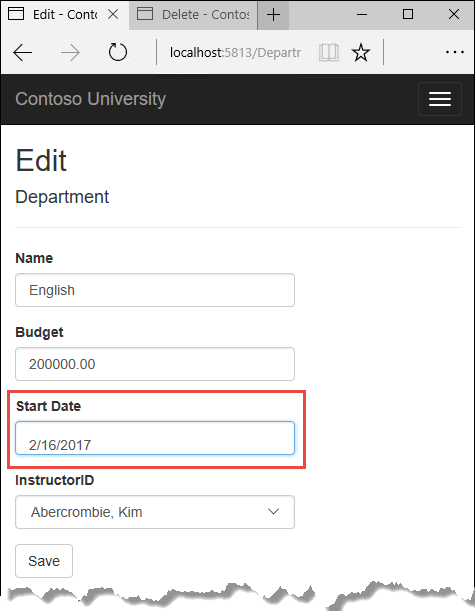

en-us/
?view=netcore-2.0

# Handling concurrency conflicts - EF Core with Razor Pages (8 of 10)

By [Tom Dykstra](https://github.com/tdykstra) and [Rick Anderson](https://twitter.com/RickAndMSFT)

[!INCLUDE[about the series](../../includes/RP-EF/intro.md)]

This tutorial shows how to handle conflicts when multiple users update an entity concurrently (at the same time). If you run into problems you can't solve, download the [completed app for this stage](https://github.com/aspnet/Docs/tree/master/aspnetcore/data/ef-rp/intro/samples/StageSnapShots/cu-part8).

## Concurrency conflicts

A concurrency conflict occurs when:

* A user navigates to the edit page for an entity.
* Another user updates the same entity before the first user's change is written to the DB. 

If concurrency detection is not enabled, when concurrent updates occur:

* The last update wins. That is, the last update values are saved to the DB.
* The firt of the current updates is lost. That's generally not what you want.

### Pessimistic concurrency (locking)

DB locking, also called pessimistic concurrency, is one way to implement concurrency.
For example, before a row is read from the db, the app can request a lock for read-only or for update access. If a row is locked for update access:

* Other users can not lock the row for read-only access. That is, other users can't read the data.
* Other users can not lock the row for update access. 

If a row for is locked for read-only access:

* Other users can also read the data. That is, they can lock it for read-only access.
* Other users cannot get an update lock to update the data.

Managing locks has disadvantages:

* It's complex to program. 
* It requires significant DB management resources.
* It can cause performance problems as the number of users of an app increases. 

Not all DB management systems support pessimistic concurrency. Entity Framework Core provides no built-in support for pessimistic locking. This tutorial doesn't show you how to implement pessimistic concurrency.

### Optimistic concurrency

Optimistic concurrency allows concurrency conflicts to happen, and then reacts appropriately when they do. For example, Jane visits the Department edit page and changes the budget for the English department from $350,000.00 to $0.00.


Before Jane clicks **Save**, John visits the same page and changes the Start Date field from 9/1/2007 to 9/1/2013.


Jane clicks **Save** first and sees her change when the browser displays the Index page.


John clicks **Save** on an Edit page that still shows a budget of $350,000.00. What happens next is determined by how you handle concurrency conflicts.

Some of the options include the following:

* You can keep track of which property a user has modified and update only the corresponding columns in the DB.

     In the scenario, no data would be lost. Different properties were updated by the two users. The next time someone browses the English department, they'll see both Jane's and John's changes. This method of updating can reduce the number of conflicts that could result in data loss. This approach:
		* Can't avoid data loss if competing changes are made to the same property. 
		* Is generally not practical in a web app.  It requires maintaining significant state in order to keep track of all fetched values and new values. Maintaining large amounts of state can affect app performance.
		* Can increase app complexity compared to concurrency detection on an entity.

* You can let John's change overwrite Jane's change.

     The next time someone browses the English department, they'll see 9/1/2013 and the fetched $350,000.00 value. This approach is called a *Client Wins* or *Last in Wins* scenario. (All values from the client take precedence over what's in the data store.) If you don't do any coding for concurrency handling, this will happen automatically.

* You can prevent John's change from being updated in the DB.

	Typically, the app would:

		* Display an error message.
		* Show the current state of the data.
		* Allow the user to reapply the changes. 
		
	This is called a *Store Wins* scenario. (The data-store values take precedence over the values submitted by the client.) You implement the Store Wins scenario in this tutorial. This method ensures that no changes are overwritten without a user being alerted to what's happening.

### Detecting concurrency conflicts

Concurrency conflicts can be handled by catching [DbUpdateConcurrencyException](https://docs.microsoft.com/en-us/dotnet/api/microsoft.entityframeworkcore.dbupdateconcurrencyexception?view=efcore-2.0). The DB and data model must be configured to support throwing `DbUpdateConcurrencyException`. Some options for enabling conflict detection include the following:

* Include a [rowversion](https://docs.microsoft.com/en-us/sql/t-sql/data-types/rowversion-transact-sql) tracking column in the DB table. `rowversion` is used to determine when a row has been changed. Include the `rowversion` tracking column in the `Where` clause of `SQL Update` and `Delete`. This tutorial uses the `rowversion` tracking column approach.

	The `rowversion` generates a sequential number that's incremented each time the row is updated. In an `Update` or `Delete` command, the `Where` clause includes the fetched value of  `rowversion`. If the row being updated has been changed:

	* `rowversion` won't match the fetched value.
	* The `Update` or `Delete` command don't find a row because the `Where` clause includes the fetched `rowversion`.

	In EF, when no rows have been updated by the `Update` or `Delete` command, a concurrency exception is thrown.

* Configure EF to include the fetched values of every column in the table in the `Where` clause of `Update` and `Delete` commands.

 If anything in the row has changed since the row was first read:
		
	* The `Where` clause won't return a row to update.
	* EF interprets zero rows changed as a concurrency conflict. 
		
	For DB tables that have many columns, this approach:

	* Can result in very large `Where` clauses.
	* Can require that you maintain large amounts of state. 
		
	Maintaining large amounts of state can affect app performance. Therefore this approach is generally not recommended. This approach isn't used in this tutorial.
   
	To implement this concurrency approach:

	 * Decorate all non-primary-key properties in the entity with [ConcurrencyCheck](https://docs.microsoft.com/en-us/dotnet/api/system.componentmodel.dataannotations.concurrencycheckattribute?view=netcore-2.0). 
	 * Adding `ConcurrencyCheck` enables EF to include all columns in the SQL `Where` clause of `Update` and `Delete` statements.	 

## Add a tracking property to the Department entity

In *Models/Department.cs*, add a tracking property named RowVersion:

[!code-csharp[Main](intro/samples/cu/Models/Department.cs?name=snippet_Final&highlight=26,27)]

The [Timestamp](https://docs.microsoft.com/en-us/dotnet/api/system.componentmodel.dataannotations.timestampattribute?view=netcore-2.0) attribute specifies that this column will be included in the `Where` clause of `Update` and Delete commands sent to the DB. The attribute is called `Timestamp` because previous versions of SQL Server used a SQL `timestamp` data type before the SQL `rowversion` type replaced it.

The fluent API can also specify the tracking property:

```csharp
modelBuilder.Entity<Department>()
    .Property(p => p.RowVersion).IsConcurrencyToken();
```

Adding the `RowVersion` property changes the DB model, which requires a migration.

Build the project. Enter the following in a command window:

```console
dotnet ef migrations add RowVersion
dotnet ef database update
```

The preceding commands:

* Adds the *Migrations/{time stamp}_RowVersion.cs* migration file.
* Updates the *Migrations/SchoolContextModelSnapshot.cs* file. The update adds the following highlighted code to the `BuildModel` method:

[!code-csharp[Main](intro/samples/cu/Migrations/SchoolContextModelSnapshot2.cs?name=snippet&highlight=14-16)]
	
* Runs migrations to update the DB.

<a name="scaffold"></a>
## Scaffold the Departments model

* Exit Visual Studio.
* Open a command window in the project directory (The directory that contains the *Program.cs*, *Startup.cs*, and *.csproj* files).
* Run the following command:

 ```console
dotnet aspnet-codegenerator razorpage -m Department -dc SchoolContext -udl -outDir Pages\Departments --referenceScriptLibraries
 ```

The preceding command scaffolds the `Department` model. Open the project in Visual Studio.

Build the project. The build generates errors like the following:

`1>Pages/Departments/Index.cshtml.cs(26,37,26,43): error CS1061: 'SchoolContext' does not
 contain a definition for 'Department' and no extension method 'Department' accepting a first
 argument of type 'SchoolContext' could be found (are you missing a using directive or
 an assembly reference?)`

 Globally change `_context.Department` to `_context.Departments` (that is, add an "s" to `Department`). 7 occurrences are found and updated.
 
 <!--
In the *DepartmentsController.cs* file, change all four occurrences of "FirstMidName" to "FullName" so that the department administrator drop-down lists will contain the full name of the instructor rather than just the last name.
 
[!code-csharp[Main](intro/samples/cu/Controllers/DepartmentsController.cs?name=snippet_Dropdown)]
-->


### Update the Departments Index page

The scaffolding engine created a RowVersion column for the Index page, but that field shouldn't be displayed. In this tutorial you display the last byte of the `RowVersion` to help understand concurrency. The last byte is not guaranteed to be unique. A real app wouldn't display `RowVersion` or the last by of `RowVersion`.

Update the Index page:

* Replace Index with Departments.
* Replace the markup containing `RowVersion` with the last byte of `RowVersion`.
* Replace FirstMidName with FullName.

The following markup shows the updated page:

[!code-html[](intro/samples/cu/Pages/Departments/Index.cshtml?highlight=5,8,29,47,50)]

### Update the Edit page model

Update *pages\departments\edit.cshtml.cs* with the following code:

[!code-csharp[](intro/samples/cu/Pages/Departments/Index.cshtml.cs?name=snippet)]

Examine the `OnPostAsync` signature:

[!code-csharp[](intro/samples/cu/Pages/Departments/Index.cshtml.cs?name=snippet_sig)]

The `rowVersion` parameter comes from `<input type="hidden" asp-for="Department.RowVersion" />` in the Razor page. The `rowVersion` parameter is the value when this entity was fetched in `OnGetAsync`. The Db `rowVersion` my differ if this entity has been updated
after OnGetAsync is called. 


In both the HttpGet `Edit` method and the `Details` method, add `AsNoTracking`. In the HttpGet `Edit` method, add eager loading for the Administrator.

<!--
[!code-csharp[Main](intro/samples/cu/Controllers/DepartmentsController.cs?name=snippet_EagerLoading&highlight=2,3)]

Replace the existing code for the HttpPost `Edit` method with the following code:

[!code-csharp[Main](intro/samples/cu/Controllers/DepartmentsController.cs?name=snippet_EditPost)]

The code begins by trying to read the department to be updated. If the `SingleOrDefaultAsync` method returns null, the department was deleted by another user. In that case the code uses the posted form values to create a department entity so that the Edit page can be redisplayed with an error message. As an alternative, you wouldn't have to re-create the department entity if you display only an error message without redisplaying the department fields.

The view stores the fetched `RowVersion` value in a hidden field, and this method receives that value in the `rowVersion` parameter. Before you call `SaveChanges`, you have to put that fetched `RowVersion` property value in the [OriginalValue](https://docs.microsoft.com/en-us/dotnet/api/microsoft.entityframeworkcore.changetracking.propertyentry.originalvalue?view=efcore-2.0#Microsoft_EntityFrameworkCore_ChangeTracking_PropertyEntry_OriginalValue) collection for the entity.

```csharp
_context.Entry(departmentToUpdate).Property("RowVersion").OriginalValue = rowVersion;
```

Then when EF creates a SQL UPDATE command, that command will include a WHERE clause that looks for a row that has the fetched `RowVersion` value. If no rows are affected by the UPDATE command (no rows have the fetched `RowVersion` value),  EF throws a `DbUpdateConcurrencyException` exception.

The code in the catch block for that exception gets the affected Department entity that has the updated values from the `Entries` property on the exception object.

[!code-csharp[Main](intro/samples/cu/Controllers/DepartmentsController.cs?range=164)]

The `Entries` collection will have just one `EntityEntry` object.  You can use that object to get the new values entered by the user and the current DB values.

[!code-csharp[Main](intro/samples/cu/Controllers/DepartmentsController.cs?range=165-166)]

The code adds a custom error message for each column that has DB values different from what the user entered on the Edit page (only one field is shown here for brevity).

[!code-csharp[Main](intro/samples/cu/Controllers/DepartmentsController.cs?range=174-178)]

Finally, the code sets the `RowVersion` value of the `departmentToUpdate` to the new value retrieved from the DB. This new `RowVersion` value will be stored in the hidden field when the Edit page is redisplayed, and the next time the user clicks **Save**, only concurrency errors that happen since the redisplay of the Edit page will be caught.

[!code-csharp[Main](intro/samples/cu/Controllers/DepartmentsController.cs?range=199-200)]

The `ModelState.Remove` statement is required because `ModelState` has the old `RowVersion` value. In the view, the `ModelState` value for a field takes precedence over the model property values when both are present.

## Update the Department Edit view

In *Views/Departments/Edit.cshtml*, make the following changes:

* Add a hidden field to save the `RowVersion` property value, immediately following the hidden field for the `DepartmentID` property.

* Add a "Select Administrator" option to the drop-down list.

[!code-html[Main](intro/samples/cu/Views/Departments/Edit.cshtml?highlight=16,34-36)]

## Test concurrency conflicts in the Edit page

Run the app and go to the Departments Index page. Right-click the **Edit** hyperlink for the English department and select **Open in new tab**, then click the **Edit** hyperlink for the English department. The two browser tabs now display the same information.

Change a field in the first browser tab and click **Save**.


The browser shows the Index page with the changed value.

Change a field in the second browser tab.


Click **Save**. You see an error message:


Click **Save** again. The value you entered in the second browser tab is saved. You see the saved values when the Index page appears.

## Update the Delete page

For the Delete page, EF detects concurrency conflicts caused by someone else editing the department in a similar manner. When the HttpGet `Delete` method displays the confirmation view, the view includes the fetched `RowVersion` value in a hidden field. That value is then available to the HttpPost `Delete` method that's called when the user confirms the deletion. When EF creates the SQL DELETE command, it includes a WHERE clause with the fetched `RowVersion` value. If the command results in zero rows affected (meaning the row was changed after the Delete confirmation page was displayed), a concurrency exception is thrown, and the HttpGet ``Delete`` method is called with an error flag set to true in order to redisplay the confirmation page with an error message. It's also possible that zero rows were affected because the row was deleted by another user, so in that case no error message is displayed.

### Update the Delete methods in the Departments controller

In *DepartmentsController.cs*, replace the HttpGet `Delete` method with the following code:

[!code-csharp[Main](intro/samples/cu/Controllers/DepartmentsController.cs?name=snippet_DeleteGet&highlight=1,10,14-17,21-29)]

The method accepts an optional parameter that indicates whether the page is being redisplayed after a concurrency error. If this flag is true and the department specified no longer exists, it was deleted by another user. In that case, the code redirects to the Index page.  If this flag is true and the Department does exist, it was changed by another user. In that case, the code sends an error message to the view using `ViewData`.  

Replace the code in the HttpPost `Delete` method (named `DeleteConfirmed`) with the following code:

[!code-csharp[Main](intro/samples/cu/Controllers/DepartmentsController.cs?name=snippet_DeletePost&highlight=1,3,5-8,11-18)]

In the scaffolded code that you just replaced, this method accepted only a record ID:


```csharp
public async Task<IActionResult> DeleteConfirmed(int id)
```

You've changed this parameter to a Department entity instance created by the model binder. This gives EF access to the RowVersion property value in addition to the record key.

```csharp
public async Task<IActionResult> Delete(Department department)
```

You have also changed the action method name from `DeleteConfirmed` to `Delete`. The scaffolded code used the name `DeleteConfirmed` to give the HttpPost method a unique signature. (The CLR requires overloaded methods to have different method parameters.) Now that the signatures are unique, you can stick with the MVC convention and use the same name for the HttpPost and HttpGet delete methods.

If the department is already deleted, the `AnyAsync` method returns false and the app just goes back to the Index method.

If a concurrency error is caught, the code redisplays the Delete confirmation page and provides a flag that indicates it should display a concurrency error message.

### Update the Delete view

In *Views/Departments/Delete.cshtml*, replace the scaffolded code with the following code that adds an error message field and hidden fields for the DepartmentID and RowVersion properties. The changes are highlighted.

[!code-html[Main](intro/samples/cu/Views/Departments/Delete.cshtml?highlight=9,38,44,45,48)]

This makes the following changes:

* Adds an error message between the `h2` and `h3` headings.

* Replaces FirstMidName with FullName in the **Administrator** field.

* Removes the RowVersion field.

* Adds a hidden field for the `RowVersion` property.

Run the app and go to the Departments Index page. Right-click the **Delete** hyperlink for the English department and select **Open in new tab**, then in the first tab click the **Edit** hyperlink for the English department.

In the first window, change one of the values, and click **Save**:



In the second tab, click **Delete**. You see the concurrency error message, and the Department values are refreshed with what's currently in the DB.


If you click **Delete** again, you're redirected to the Index page, which shows that the department has been deleted.

## Update Details and Create views

You can optionally clean up scaffolded code in the Details and Create views.

Replace the code in *Views/Departments/Details.cshtml* to delete the RowVersion column and show the full name of the Administrator.

[!code-html[Main](intro/samples/cu/Views/Departments/Details.cshtml?highlight=35)]

Replace the code in *Views/Departments/Create.cshtml* to add a Select option to the drop-down list.

[!code-html[Main](intro/samples/cu/Views/Departments/Create.cshtml?highlight=32-34)]

## Summary

This completes the introduction to handling concurrency conflicts. For more information about how to handle concurrency in EF Core, see [Concurrency conflicts](https://docs.microsoft.com/ef/core/saving/concurrency). The next tutorial shows how to implement table-per-hierarchy inheritance for the Instructor and Student entities.

-->

>[!div class="step-by-step"]
[Previous](xref:data/ef-mvc/update-related-data)
