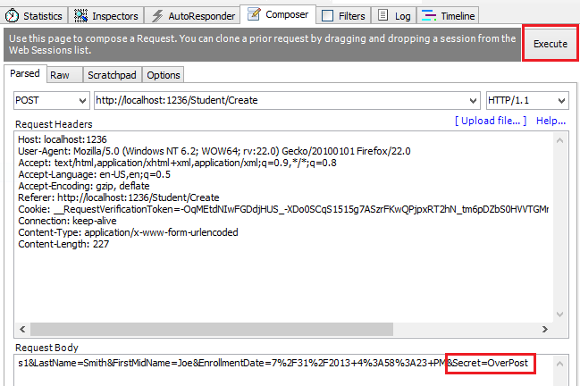

# Part 2, Razor Pages with EF Core in ASP.NET Core - CRUD

By [Tom Dykstra](https://github.com/tdykstra), [Jeremy Likness](https://twitter.com/jeremylikness), and [Jon P Smith](https://twitter.com/thereformedprog)

[!INCLUDE [about the series](~/includes/RP-EF/intro.md)]

:::moniker range=">= aspnetcore-6.0"

In this tutorial, the scaffolded CRUD (create, read, update, delete) code is reviewed and customized.

## No repository

Some developers use a service layer or repository pattern to create an abstraction layer between the UI (Razor Pages) and the data access layer. This tutorial doesn't do that. To minimize complexity and keep the tutorial focused on EF Core, EF Core code is added directly to the page model classes.

## Update the Details page

The scaffolded code for the Students pages doesn't include enrollment data. In this section, enrollments are added to the `Details` page.

### Read enrollments

To display a student's enrollment data on the page, the enrollment data must be read. The scaffolded code in `Pages/Students/Details.cshtml.cs` reads only the `Student` data, without the `Enrollment` data:

[!code-csharp[Main](intro/samples/cu30snapshots/2-crud/Pages/Students/Details1.cshtml.cs?name=snippet_OnGetAsync&highlight=8)]

Replace the `OnGetAsync` method with the following code to read enrollment data for the selected student. The changes are highlighted.

[!code-csharp[Main](intro/samples/cu30/Pages/Students/Details.cshtml.cs?name=snippet_OnGetAsync&highlight=8-12)]

The <xref:Microsoft.EntityFrameworkCore.EntityFrameworkQueryableExtensions.Include%2A> and [ThenInclude](xref:Microsoft.EntityFrameworkCore.EntityFrameworkQueryableExtensions.ThenInclude%60%603(Microsoft.EntityFrameworkCore.Query.IIncludableQueryable{%60%600,%60%601},System.Linq.Expressions.Expression{System.Func{%60%601,%60%602}})) methods cause the context to load the `Student.Enrollments` navigation property, and within each enrollment the `Enrollment.Course` navigation property. These methods are examined in detail in the [Read related data](xref:data/ef-rp/read-related-data) tutorial.

The <xref:Microsoft.EntityFrameworkCore.EntityFrameworkQueryableExtensions.AsNoTracking%2A> method improves performance in scenarios where the entities returned are not updated in the current context. `AsNoTracking` is discussed later in this tutorial.

### Display enrollments

Replace the code in `Pages/Students/Details.cshtml` with the following code to display a list of enrollments. The changes are highlighted.

[!code-cshtml[Main](intro/samples/cu30/Pages/Students/Details.cshtml?highlight=32-53)]

The preceding code loops through the entities in the `Enrollments` navigation property. For each enrollment, it displays the course title and the grade. The course title is retrieved from the `Course` entity that's stored in the `Course` navigation property of the Enrollments entity.

Run the app, select the **Students** tab, and click the **Details** link for a student. The list of courses and grades for the selected student is displayed.

### Ways to read one entity

The generated code uses [FirstOrDefaultAsync](xref:Microsoft.EntityFrameworkCore.EntityFrameworkQueryableExtensions.FirstOrDefaultAsync%60%601(System.Linq.IQueryable{%60%600},System.Threading.CancellationToken)) to read one entity. This method returns null if nothing is found; otherwise, it returns the first row found that satisfies the query filter criteria. `FirstOrDefaultAsync` is generally a better choice than the following alternatives:

* [SingleOrDefaultAsync](xref:Microsoft.EntityFrameworkCore.EntityFrameworkQueryableExtensions.SingleOrDefaultAsync%60%601(System.Linq.IQueryable{%60%600},System.Linq.Expressions.Expression{System.Func{%60%600,System.Boolean}},System.Threading.CancellationToken)) - Throws an exception if there's more than one entity that satisfies the query filter. To determine if more than one row could be returned by the query, `SingleOrDefaultAsync` tries to fetch multiple rows. This extra work is unnecessary if the query can only return one entity, as when it searches on a unique key.
* [FindAsync](xref:Microsoft.EntityFrameworkCore.DbContext.FindAsync(System.Type,System.Object[])) - Finds an entity with the primary key (PK). If an entity with the PK is being tracked by the context, it's returned without a request to the database. This method is optimized to look up a single entity, but you can't call `Include` with `FindAsync`.  So if related data is needed, `FirstOrDefaultAsync` is the better choice.

### Route data vs. query string

The URL for the Details page is `https://localhost:<port>/Students/Details?id=1`. The entity's primary key value is in the query string. Some developers prefer to pass the key value in route data: `https://localhost:<port>/Students/Details/1`. For more information, see [Update the generated code](xref:tutorials/razor-pages/da1#update-the-generated-code).

## Update the Create page

The scaffolded `OnPostAsync` code for the Create page is vulnerable to [overposting](#overposting). Replace the `OnPostAsync` method in `Pages/Students/Create.cshtml.cs` with the following code.

[!code-csharp[Main](intro/samples/cu30/Pages/Students/Create.cshtml.cs?name=snippet_OnPostAsync)]

### TryUpdateModelAsync

The preceding code creates a Student object and then uses posted form fields to update the Student object's properties. The [TryUpdateModelAsync](xref:Microsoft.AspNetCore.Mvc.ControllerBase.TryUpdateModelAsync(System.Object,System.Type,System.String)) method:

* Uses the posted form values from the <xref:Microsoft.AspNetCore.Mvc.RazorPages.PageModel.PageContext%2A> property in the <xref:Microsoft.AspNetCore.Mvc.RazorPages.PageModel>.
* Updates only the properties listed (`s => s.FirstMidName, s => s.LastName, s => s.EnrollmentDate`).
* Looks for form fields with a "student" prefix. For example, `Student.FirstMidName`. It's not case sensitive.
* Uses the [model binding](xref:mvc/models/model-binding) system to convert form values from strings to the types in the `Student` model. For example, `EnrollmentDate` is converted to `DateTime`.

Run the app, and create a student entity to test the Create page.

## Overposting

Using `TryUpdateModel` to update fields with posted values is a security best practice because it prevents overposting. For example, suppose the Student entity includes a `Secret` property that this web page shouldn't update or add:

[!code-csharp[Main](intro/samples/cu30snapshots/2-crud/Models/StudentZsecret.cs?name=snippet_Intro&highlight=7)]

Even if the app doesn't have a `Secret` field on the create or update Razor Page, a hacker could set the `Secret` value by overposting. A hacker could use a tool such as Fiddler, or write some JavaScript, to post a `Secret` form value. The original code doesn't limit the fields that the model binder uses when it creates a Student instance.

Whatever value the hacker specified for the `Secret` form field is updated in the database. The following image shows the Fiddler tool adding the `Secret` field, with the value "OverPost", to the posted form values.

The value "OverPost" is successfully added to the `Secret` property of the inserted row. That happens even though the app designer never intended the `Secret` property to be set with the Create page.

### View model

View models provide an alternative way to prevent overposting.

The application model is often called the domain model. The domain model typically contains all the properties required by the corresponding entity in the database. The view model contains only the properties needed for the UI page, for example, the Create page.

In addition to the view model, some apps use a binding model or input model to pass data between the Razor Pages page model class and the browser. 

Consider the following `StudentVM` view model:

[!code-csharp[Main](intro/samples/cu50/ViewModels/StudentVM.cs?name=snippet)]

The following code uses the `StudentVM` view model to create a new student:

[!code-csharp[Main](intro/samples/cu50/Pages/Students/CreateVM.cshtml.cs?name=snippet)]

The [SetValues](xref:Microsoft.EntityFrameworkCore.ChangeTracking.PropertyValues.SetValues(System.Object)) method sets the values of this object by reading values from another <xref:Microsoft.EntityFrameworkCore.ChangeTracking.PropertyValues> object. `SetValues` uses property name matching. The view model type:

* Doesn't need to be related to the model type.
* Needs to have properties that match.

Using `StudentVM` requires the Create page use `StudentVM` rather than `Student`:

[!code-cshtml[Main](intro/samples/cu50/Pages/Students/CreateVM.cshtml)]

## Update the Edit page

In `Pages/Students/Edit.cshtml.cs`, replace the `OnGetAsync` and `OnPostAsync` methods with the following code.

[!code-csharp[Main](intro/samples/cu30/Pages/Students/Edit.cshtml.cs?name=snippet_OnGetPost)]

The code changes are similar to the Create page with a few exceptions:

* `FirstOrDefaultAsync` has been replaced with <xref:Microsoft.EntityFrameworkCore.DbSet%601.FindAsync%2A>. When you don't have to include related data, `FindAsync` is more efficient.
* `OnPostAsync` has an `id` parameter.
* The current student is fetched from the database, rather than creating an empty student.

Run the app, and test it by creating and editing a student.

## Entity States

The database context keeps track of whether entities in memory are in sync with their corresponding rows in the database. This tracking information determines what happens when [SaveChangesAsync](xref:Microsoft.EntityFrameworkCore.DbContext.SaveChangesAsync(System.Threading.CancellationToken)) is called. For example, when a new entity is passed to the <xref:Microsoft.EntityFrameworkCore.DbContext.AddAsync%2A> method, that entity's state is set to <xref:Microsoft.EntityFrameworkCore.EntityState.Added>. When `SaveChangesAsync` is called, the database context issues a SQL `INSERT` command.

An entity may be in one of the [following states](xref:Microsoft.EntityFrameworkCore.EntityState):

* `Added`: The entity doesn't yet exist in the database. The `SaveChanges` method issues an `INSERT` statement.

* `Unchanged`: No changes need to be saved with this entity. An entity has this status when it's read from the database.

* `Modified`: Some or all of the entity's property values have been modified. The `SaveChanges` method issues an `UPDATE` statement.

* `Deleted`: The entity has been marked for deletion. The `SaveChanges` method issues a `DELETE` statement.

* `Detached`: The entity isn't being tracked by the database context.

In a desktop app, state changes are typically set automatically. An entity is read, changes are made, and the entity state is automatically changed to `Modified`. Calling `SaveChanges` generates a SQL `UPDATE` statement that updates only the changed properties.

In a web app, the `DbContext` that reads an entity and displays the data is disposed after a page is rendered. When a page's `OnPostAsync` method is called, a new web request is made and with a new instance of the `DbContext`. Rereading the entity in that new context simulates desktop processing.

## Update the Delete page

In this section, a custom error message is implemented when the call to `SaveChanges` fails.

Replace the code in `Pages/Students/Delete.cshtml.cs` with the following code:

[!code-csharp[Main](intro/samples/cu50/Pages/Students/Delete.cshtml.cs)]

The preceding code:

* Adds [Logging](xref:fundamentals/logging/index).
* Adds the optional parameter `saveChangesError` to the `OnGetAsync` method signature. `saveChangesError` indicates whether the method was called after a failure to delete the student object.

The delete operation might fail because of transient network problems. Transient network errors are more likely when the database is in the cloud. The `saveChangesError` parameter is `false` when the Delete page `OnGetAsync` is called from the UI. When `OnGetAsync` is called by `OnPostAsync` because the delete operation failed, the `saveChangesError` parameter is `true`.

The `OnPostAsync` method retrieves the selected entity, then calls the [Remove](xref:Microsoft.EntityFrameworkCore.DbContext.Remove(System.Object)) method to set the entity's status to `Deleted`. When `SaveChanges` is called, a SQL `DELETE` command is generated. If `Remove` fails:

* The database exception is caught.
* The Delete pages `OnGetAsync` method is called with `saveChangesError=true`.

Add an error message to `Pages/Students/Delete.cshtml`:

[!code-cshtml[Main](intro/samples/cu50/Pages/Students/Delete.cshtml?highlight=10)]

Run the app and delete a student to test the Delete page.

## Next steps

> [!div class="step-by-step"]
> [Previous tutorial](xref:data/ef-rp/intro)
> [Next tutorial](xref:data/ef-rp/sort-filter-page)

:::moniker-end

:::moniker range=">= aspnetcore-5.0 < aspnetcore-6.0"

In this tutorial, the scaffolded CRUD (create, read, update, delete) code is reviewed and customized.

## No repository

Some developers use a service layer or repository pattern to create an abstraction layer between the UI (Razor Pages) and the data access layer. This tutorial doesn't do that. To minimize complexity and keep the tutorial focused on EF Core, EF Core code is added directly to the page model classes.

## Update the Details page

The scaffolded code for the Students pages doesn't include enrollment data. In this section, enrollments are added to the `Details` page.

### Read enrollments

To display a student's enrollment data on the page, the enrollment data must be read. The scaffolded code in `Pages/Students/Details.cshtml.cs` reads only the `Student` data, without the `Enrollment` data:

[!code-csharp[Main](intro/samples/cu30snapshots/2-crud/Pages/Students/Details1.cshtml.cs?name=snippet_OnGetAsync&highlight=8)]

Replace the `OnGetAsync` method with the following code to read enrollment data for the selected student. The changes are highlighted.

[!code-csharp[Main](intro/samples/cu30/Pages/Students/Details.cshtml.cs?name=snippet_OnGetAsync&highlight=8-12)]

The <xref:Microsoft.EntityFrameworkCore.EntityFrameworkQueryableExtensions.Include%2A> and [ThenInclude](xref:Microsoft.EntityFrameworkCore.EntityFrameworkQueryableExtensions.ThenInclude%60%603(Microsoft.EntityFrameworkCore.Query.IIncludableQueryable{%60%600,%60%601},System.Linq.Expressions.Expression{System.Func{%60%601,%60%602}})) methods cause the context to load the `Student.Enrollments` navigation property, and within each enrollment the `Enrollment.Course` navigation property. These methods are examined in detail in the [Read related data](xref:data/ef-rp/read-related-data) tutorial.

The <xref:Microsoft.EntityFrameworkCore.EntityFrameworkQueryableExtensions.AsNoTracking%2A> method improves performance in scenarios where the entities returned are not updated in the current context. `AsNoTracking` is discussed later in this tutorial.

### Display enrollments

Replace the code in `Pages/Students/Details.cshtml` with the following code to display a list of enrollments. The changes are highlighted.

[!code-cshtml[Main](intro/samples/cu30/Pages/Students/Details.cshtml?highlight=32-53)]

The preceding code loops through the entities in the `Enrollments` navigation property. For each enrollment, it displays the course title and the grade. The course title is retrieved from the `Course` entity that's stored in the `Course` navigation property of the Enrollments entity.

Run the app, select the **Students** tab, and click the **Details** link for a student. The list of courses and grades for the selected student is displayed.

### Ways to read one entity

The generated code uses [FirstOrDefaultAsync](xref:Microsoft.EntityFrameworkCore.EntityFrameworkQueryableExtensions.FirstOrDefaultAsync%60%601(System.Linq.IQueryable{%60%600},System.Threading.CancellationToken)) to read one entity. This method returns null if nothing is found; otherwise, it returns the first row found that satisfies the query filter criteria. `FirstOrDefaultAsync` is generally a better choice than the following alternatives:

* [SingleOrDefaultAsync](xref:Microsoft.EntityFrameworkCore.EntityFrameworkQueryableExtensions.SingleOrDefaultAsync%60%601(System.Linq.IQueryable{%60%600},System.Linq.Expressions.Expression{System.Func{%60%600,System.Boolean}},System.Threading.CancellationToken)) - Throws an exception if there's more than one entity that satisfies the query filter. To determine if more than one row could be returned by the query, `SingleOrDefaultAsync` tries to fetch multiple rows. This extra work is unnecessary if the query can only return one entity, as when it searches on a unique key.
* [FindAsync](xref:Microsoft.EntityFrameworkCore.DbContext.FindAsync(System.Type,System.Object[])) - Finds an entity with the primary key (PK). If an entity with the PK is being tracked by the context, it's returned without a request to the database. This method is optimized to look up a single entity, but you can't call `Include` with `FindAsync`.  So if related data is needed, `FirstOrDefaultAsync` is the better choice.

### Route data vs. query string

The URL for the Details page is `https://localhost:<port>/Students/Details?id=1`. The entity's primary key value is in the query string. Some developers prefer to pass the key value in route data: `https://localhost:<port>/Students/Details/1`. For more information, see [Update the generated code](xref:tutorials/razor-pages/da1#update-the-generated-code).

## Update the Create page

The scaffolded `OnPostAsync` code for the Create page is vulnerable to [overposting](#overposting). Replace the `OnPostAsync` method in `Pages/Students/Create.cshtml.cs` with the following code.

[!code-csharp[Main](intro/samples/cu30/Pages/Students/Create.cshtml.cs?name=snippet_OnPostAsync)]

### TryUpdateModelAsync

The preceding code creates a Student object and then uses posted form fields to update the Student object's properties. The [TryUpdateModelAsync](xref:Microsoft.AspNetCore.Mvc.ControllerBase.TryUpdateModelAsync(System.Object,System.Type,System.String)) method:

* Uses the posted form values from the <xref:Microsoft.AspNetCore.Mvc.RazorPages.PageModel.PageContext%2A> property in the <xref:Microsoft.AspNetCore.Mvc.RazorPages.PageModel>.
* Updates only the properties listed (`s => s.FirstMidName, s => s.LastName, s => s.EnrollmentDate`).
* Looks for form fields with a "student" prefix. For example, `Student.FirstMidName`. It's not case sensitive.
* Uses the [model binding](xref:mvc/models/model-binding) system to convert form values from strings to the types in the `Student` model. For example, `EnrollmentDate` is converted to `DateTime`.

Run the app, and create a student entity to test the Create page.

## Overposting

Using `TryUpdateModel` to update fields with posted values is a security best practice because it prevents overposting. For example, suppose the Student entity includes a `Secret` property that this web page shouldn't update or add:

[!code-csharp[Main](intro/samples/cu30snapshots/2-crud/Models/StudentZsecret.cs?name=snippet_Intro&highlight=7)]

Even if the app doesn't have a `Secret` field on the create or update Razor Page, a hacker could set the `Secret` value by overposting. A hacker could use a tool such as Fiddler, or write some JavaScript, to post a `Secret` form value. The original code doesn't limit the fields that the model binder uses when it creates a Student instance.

Whatever value the hacker specified for the `Secret` form field is updated in the database. The following image shows the Fiddler tool adding the `Secret` field, with the value "OverPost", to the posted form values.

The value "OverPost" is successfully added to the `Secret` property of the inserted row. That happens even though the app designer never intended the `Secret` property to be set with the Create page.

### View model

View models provide an alternative way to prevent overposting.

The application model is often called the domain model. The domain model typically contains all the properties required by the corresponding entity in the database. The view model contains only the properties needed for the UI page, for example, the Create page.

In addition to the view model, some apps use a binding model or input model to pass data between the Razor Pages page model class and the browser. 

Consider the following `StudentVM` view model:

[!code-csharp[Main](intro/samples/cu50/ViewModels/StudentVM.cs?name=snippet)]

The following code uses the `StudentVM` view model to create a new student:

[!code-csharp[Main](intro/samples/cu50/Pages/Students/CreateVM.cshtml.cs?name=snippet)]

The [SetValues](xref:Microsoft.EntityFrameworkCore.ChangeTracking.PropertyValues.SetValues(System.Object)) method sets the values of this object by reading values from another <xref:Microsoft.EntityFrameworkCore.ChangeTracking.PropertyValues> object. `SetValues` uses property name matching. The view model type:

* Doesn't need to be related to the model type.
* Needs to have properties that match.

Using `StudentVM` requires the Create page use `StudentVM` rather than `Student`:

[!code-cshtml[Main](intro/samples/cu50/Pages/Students/CreateVM.cshtml)]

## Update the Edit page

In `Pages/Students/Edit.cshtml.cs`, replace the `OnGetAsync` and `OnPostAsync` methods with the following code.

[!code-csharp[Main](intro/samples/cu30/Pages/Students/Edit.cshtml.cs?name=snippet_OnGetPost)]

The code changes are similar to the Create page with a few exceptions:

* `FirstOrDefaultAsync` has been replaced with <xref:Microsoft.EntityFrameworkCore.DbSet%601.FindAsync%2A>. When you don't have to include related data, `FindAsync` is more efficient.
* `OnPostAsync` has an `id` parameter.
* The current student is fetched from the database, rather than creating an empty student.

Run the app, and test it by creating and editing a student.

## Entity States

The database context keeps track of whether entities in memory are in sync with their corresponding rows in the database. This tracking information determines what happens when [SaveChangesAsync](xref:Microsoft.EntityFrameworkCore.DbContext.SaveChangesAsync(System.Threading.CancellationToken)) is called. For example, when a new entity is passed to the <xref:Microsoft.EntityFrameworkCore.DbContext.AddAsync%2A> method, that entity's state is set to <xref:Microsoft.EntityFrameworkCore.EntityState.Added>. When `SaveChangesAsync` is called, the database context issues a SQL `INSERT` command.

An entity may be in one of the [following states](xref:Microsoft.EntityFrameworkCore.EntityState):

* `Added`: The entity doesn't yet exist in the database. The `SaveChanges` method issues an `INSERT` statement.

* `Unchanged`: No changes need to be saved with this entity. An entity has this status when it's read from the database.

* `Modified`: Some or all of the entity's property values have been modified. The `SaveChanges` method issues an `UPDATE` statement.

* `Deleted`: The entity has been marked for deletion. The `SaveChanges` method issues a `DELETE` statement.

* `Detached`: The entity isn't being tracked by the database context.

In a desktop app, state changes are typically set automatically. An entity is read, changes are made, and the entity state is automatically changed to `Modified`. Calling `SaveChanges` generates a SQL `UPDATE` statement that updates only the changed properties.

In a web app, the `DbContext` that reads an entity and displays the data is disposed after a page is rendered. When a page's `OnPostAsync` method is called, a new web request is made and with a new instance of the `DbContext`. Rereading the entity in that new context simulates desktop processing.

## Update the Delete page

In this section, a custom error message is implemented when the call to `SaveChanges` fails.

Replace the code in `Pages/Students/Delete.cshtml.cs` with the following code:

[!code-csharp[Main](intro/samples/cu50/Pages/Students/Delete.cshtml.cs)]

The preceding code:

* Adds [Logging](xref:fundamentals/logging/index).
* Adds the optional parameter `saveChangesError` to the `OnGetAsync` method signature. `saveChangesError` indicates whether the method was called after a failure to delete the student object.

The delete operation might fail because of transient network problems. Transient network errors are more likely when the database is in the cloud. The `saveChangesError` parameter is `false` when the Delete page `OnGetAsync` is called from the UI. When `OnGetAsync` is called by `OnPostAsync` because the delete operation failed, the `saveChangesError` parameter is `true`.

The `OnPostAsync` method retrieves the selected entity, then calls the [Remove](xref:Microsoft.EntityFrameworkCore.DbContext.Remove(System.Object)) method to set the entity's status to `Deleted`. When `SaveChanges` is called, a SQL `DELETE` command is generated. If `Remove` fails:

* The database exception is caught.
* The Delete pages `OnGetAsync` method is called with `saveChangesError=true`.

Add an error message to `Pages/Students/Delete.cshtml`:

[!code-cshtml[Main](intro/samples/cu50/Pages/Students/Delete.cshtml?highlight=10)]

Run the app and delete a student to test the Delete page.

## Next steps

> [!div class="step-by-step"]
> [Previous tutorial](xref:data/ef-rp/intro)
> [Next tutorial](xref:data/ef-rp/sort-filter-page)

:::moniker-end

:::moniker range="< aspnetcore-5.0"

In this tutorial, the scaffolded CRUD (create, read, update, delete) code is reviewed and customized.

## No repository

Some developers use a service layer or repository pattern to create an abstraction layer between the UI (Razor Pages) and the data access layer. This tutorial doesn't do that. To minimize complexity and keep the tutorial focused on EF Core, EF Core code is added directly to the page model classes. 

## Update the Details page

The scaffolded code for the Students pages doesn't include enrollment data. In this section, enrollments are added to the Details page.

### Read enrollments

To display a student's enrollment data on the page, the enrollment data needs to be read. The scaffolded code in `Pages/Students/Details.cshtml.cs` reads only the Student data, without the Enrollment data:

[!code-csharp[Main](intro/samples/cu30snapshots/2-crud/Pages/Students/Details1.cshtml.cs?name=snippet_OnGetAsync&highlight=8)]

Replace the `OnGetAsync` method with the following code to read enrollment data for the selected student. The changes are highlighted.

[!code-csharp[Main](intro/samples/cu30/Pages/Students/Details.cshtml.cs?name=snippet_OnGetAsync&highlight=8-12)]

The <xref:Microsoft.EntityFrameworkCore.EntityFrameworkQueryableExtensions.Include%2A> and [ThenInclude](xref:Microsoft.EntityFrameworkCore.EntityFrameworkQueryableExtensions.ThenInclude%60%603(Microsoft.EntityFrameworkCore.Query.IIncludableQueryable{%60%600,%60%601},System.Linq.Expressions.Expression{System.Func{%60%601,%60%602}})) methods cause the context to load the `Student.Enrollments` navigation property, and within each enrollment the `Enrollment.Course` navigation property. These methods are examined in detail in the [Reading related data](xref:data/ef-rp/read-related-data) tutorial.

The <xref:Microsoft.EntityFrameworkCore.EntityFrameworkQueryableExtensions.AsNoTracking%2A> method improves performance in scenarios where the entities returned are not updated in the current context. `AsNoTracking` is discussed later in this tutorial.

### Display enrollments

Replace the code in `Pages/Students/Details.cshtml` with the following code to display a list of enrollments. The changes are highlighted.

[!code-cshtml[Main](intro/samples/cu30/Pages/Students/Details.cshtml?highlight=32-53)]

The preceding code loops through the entities in the `Enrollments` navigation property. For each enrollment, it displays the course title and the grade. The course title is retrieved from the Course entity that's stored in the `Course` navigation property of the Enrollments entity.

Run the app, select the **Students** tab, and click the **Details** link for a student. The list of courses and grades for the selected student is displayed.

### Ways to read one entity

The generated code uses [FirstOrDefaultAsync](xref:Microsoft.EntityFrameworkCore.EntityFrameworkQueryableExtensions.FirstOrDefaultAsync%60%601(System.Linq.IQueryable{%60%600},System.Threading.CancellationToken)) to read one entity. This method returns null if nothing is found; otherwise, it returns the first row found that satisfies the query filter criteria. `FirstOrDefaultAsync` is generally a better choice than the following alternatives:

* [SingleOrDefaultAsync](xref:Microsoft.EntityFrameworkCore.EntityFrameworkQueryableExtensions.SingleOrDefaultAsync%60%601(System.Linq.IQueryable{%60%600},System.Linq.Expressions.Expression{System.Func{%60%600,System.Boolean}},System.Threading.CancellationToken)) - Throws an exception if there's more than one entity that satisfies the query filter. To determine if more than one row could be returned by the query, `SingleOrDefaultAsync` tries to fetch multiple rows. This extra work is unnecessary if the query can only return one entity, as when it searches on a unique key.
* [FindAsync](xref:Microsoft.EntityFrameworkCore.DbContext.FindAsync(System.Type,System.Object[])) - Finds an entity with the primary key (PK). If an entity with the PK is being tracked by the context, it's returned without a request to the database. This method is optimized to look up a single entity, but you can't call `Include` with `FindAsync`.  So if related data is needed, `FirstOrDefaultAsync` is the better choice.

### Route data vs. query string

The URL for the Details page is `https://localhost:<port>/Students/Details?id=1`. The entity's primary key value is in the query string. Some developers prefer to pass the key value in route data: `https://localhost:<port>/Students/Details/1`. For more information, see [Update the generated code](xref:tutorials/razor-pages/da1#update-the-generated-code).

## Update the Create page

The scaffolded `OnPostAsync` code for the Create page is vulnerable to [overposting](#overposting). Replace the `OnPostAsync` method in `Pages/Students/Create.cshtml.cs` with the following code.

[!code-csharp[Main](intro/samples/cu30/Pages/Students/Create.cshtml.cs?name=snippet_OnPostAsync)]

### TryUpdateModelAsync

The preceding code creates a Student object and then uses posted form fields to update the Student object's properties. The [TryUpdateModelAsync](xref:Microsoft.AspNetCore.Mvc.ControllerBase.TryUpdateModelAsync(System.Object,System.Type,System.String)) method:

* Uses the posted form values from the <xref:Microsoft.AspNetCore.Mvc.RazorPages.PageModel.PageContext%2A> property in the <xref:Microsoft.AspNetCore.Mvc.RazorPages.PageModel>.
* Updates only the properties listed (`s => s.FirstMidName, s => s.LastName, s => s.EnrollmentDate`).
* Looks for form fields with a "student" prefix. For example, `Student.FirstMidName`. It's not case sensitive.
* Uses the [model binding](xref:mvc/models/model-binding) system to convert form values from strings to the types in the `Student` model. For example, `EnrollmentDate` has to be converted to DateTime.

Run the app, and create a student entity to test the Create page.

## Overposting

Using `TryUpdateModel` to update fields with posted values is a security best practice because it prevents overposting. For example, suppose the Student entity includes a `Secret` property that this web page shouldn't update or add:

[!code-csharp[Main](intro/samples/cu30snapshots/2-crud/Models/StudentZsecret.cs?name=snippet_Intro&highlight=7)]

Even if the app doesn't have a `Secret` field on the create or update Razor Page, a hacker could set the `Secret` value by overposting. A hacker could use a tool such as Fiddler, or write some JavaScript, to post a `Secret` form value. The original code doesn't limit the fields that the model binder uses when it creates a Student instance.

Whatever value the hacker specified for the `Secret` form field is updated in the database. The following image shows the Fiddler tool adding the `Secret` field (with the value "OverPost") to the posted form values.

The value "OverPost" is successfully added to the `Secret` property of the inserted row. That happens even though the app designer never intended the `Secret` property to be set with the Create page.

### View model

View models provide an alternative way to prevent overposting.

The application model is often called the domain model. The domain model typically contains all the properties required by the corresponding entity in the database. The view model contains only the properties needed for the UI that it is used for (for example, the Create page).

In addition to the view model, some apps use a binding model or input model to pass data between the Razor Pages page model class and the browser. 

Consider the following `Student` view model:

[!code-csharp[Main](intro/samples/cu30snapshots/2-crud/Models/StudentVM.cs)]

The following code uses the `StudentVM` view model to create a new student:

[!code-csharp[Main](intro/samples/cu30snapshots/2-crud/Pages/Students/CreateVM.cshtml.cs?name=snippet_OnPostAsync)]

The [SetValues](xref:Microsoft.EntityFrameworkCore.ChangeTracking.PropertyValues.SetValues(System.Object)) method sets the values of this object by reading values from another <xref:Microsoft.EntityFrameworkCore.ChangeTracking.PropertyValues> object. `SetValues` uses property name matching. The view model type doesn't need to be related to the model type, it just needs to have properties that match.

Using `StudentVM` requires [Create.cshtml](https://github.com/dotnet/AspNetCore.Docs/tree/main/aspnetcore/data/ef-rp/intro/samples/cu30snapshots/2-crud/Pages/Students/CreateVM.cshtml) be updated to use `StudentVM` rather than `Student`.

## Update the Edit page

In `Pages/Students/Edit.cshtml.cs`, replace the `OnGetAsync` and `OnPostAsync` methods with the following code.

[!code-csharp[Main](intro/samples/cu30/Pages/Students/Edit.cshtml.cs?name=snippet_OnGetPost)]

The code changes are similar to the Create page with a few exceptions:

* `FirstOrDefaultAsync` has been replaced with <xref:Microsoft.EntityFrameworkCore.DbSet%601.FindAsync%2A>. When included related data is not needed, `FindAsync` is more efficient.
* `OnPostAsync` has an `id` parameter.
* The current student is fetched from the database, rather than creating an empty student.

Run the app, and test it by creating and editing a student.

## Entity States

The database context keeps track of whether entities in memory are in sync with their corresponding rows in the database. This tracking information determines what happens when [SaveChangesAsync](xref:Microsoft.EntityFrameworkCore.DbContext.SaveChangesAsync(System.Threading.CancellationToken)) is called. For example, when a new entity is passed to the <xref:Microsoft.EntityFrameworkCore.DbContext.AddAsync%2A> method, that entity's state is set to <xref:Microsoft.EntityFrameworkCore.EntityState.Added>. When `SaveChangesAsync` is called, the database context issues a SQL INSERT command.

An entity may be in one of the [following states](xref:Microsoft.EntityFrameworkCore.EntityState):

* `Added`: The entity doesn't yet exist in the database. The `SaveChanges` method issues an INSERT statement.

* `Unchanged`: No changes need to be saved with this entity. An entity has this status when it's read from the database.

* `Modified`: Some or all of the entity's property values have been modified. The `SaveChanges` method issues an UPDATE statement.

* `Deleted`: The entity has been marked for deletion. The `SaveChanges` method issues a DELETE statement.

* `Detached`: The entity isn't being tracked by the database context.

In a desktop app, state changes are typically set automatically. An entity is read, changes are made, and the entity state is automatically changed to `Modified`. Calling `SaveChanges` generates a SQL UPDATE statement that updates only the changed properties.

In a web app, the `DbContext` that reads an entity and displays the data is disposed after a page is rendered. When a page's `OnPostAsync` method is called, a new web request is made and with a new instance of the `DbContext`. Rereading the entity in that new context simulates desktop processing.

## Update the Delete page

In this section, you implement a custom error message when the call to `SaveChanges` fails.

Replace the code in `Pages/Students/Delete.cshtml.cs` with the following code. The changes are highlighted (other than cleanup of `using` statements).

[!code-csharp[Main](intro/samples/cu30/Pages/Students/Delete.cshtml.cs?name=snippet_All&highlight=20,22,30,38-41,53-71)]

The preceding code adds the optional parameter `saveChangesError` to the `OnGetAsync` method signature. `saveChangesError` indicates whether the method was called after a failure to delete the student object. The delete operation might fail because of transient network problems. Transient network errors are more likely when the database is in the cloud. The `saveChangesError` parameter is false when the Delete page `OnGetAsync` is called from the UI. When `OnGetAsync` is called by `OnPostAsync` (because the delete operation failed), the `saveChangesError` parameter is true.

The `OnPostAsync` method retrieves the selected entity, then calls the [Remove](xref:Microsoft.EntityFrameworkCore.DbContext.Remove(System.Object)) method to set the entity's status to `Deleted`. When `SaveChanges` is called, a SQL DELETE command is generated. If `Remove` fails:

* The database exception is caught.
* The Delete page's `OnGetAsync` method is called with `saveChangesError=true`.

Add an error message to the Delete Razor Page (`Pages/Students/Delete.cshtml`):

[!code-cshtml[Main](intro/samples/cu30/Pages/Students/Delete.cshtml?highlight=10)]

Run the app and delete a student to test the Delete page.

## Next steps

> [!div class="step-by-step"]
> [Previous tutorial](xref:data/ef-rp/intro)
> [Next tutorial](xref:data/ef-rp/sort-filter-page)

:::moniker-end
