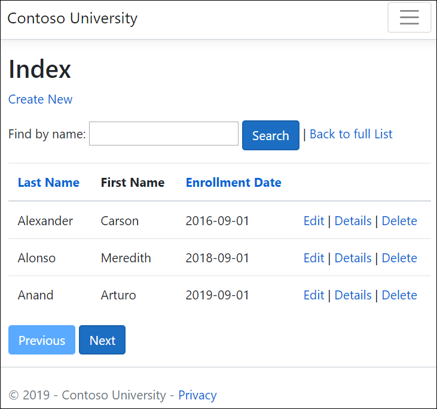
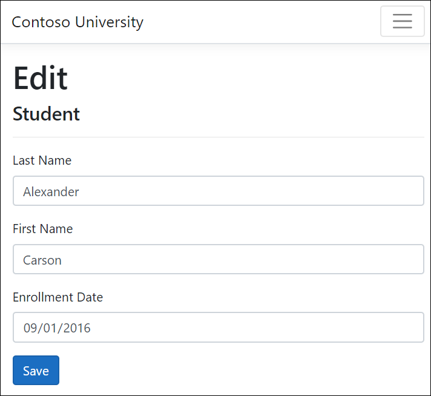
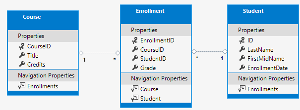
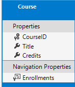

# Razor Pages with Entity Framework Core in ASP.NET Core - Tutorial 1 of 8

By [Tom Dykstra](https://github.com/tdykstra), [Jeremy Likness](https://twitter.com/jeremylikness), and [Jon P Smith](https://twitter.com/thereformedprog)

:::moniker range=">= aspnetcore-6.0"

This is the first in a series of tutorials that show how to use Entity Framework (EF) Core in an [ASP.NET Core Razor Pages](xref:razor-pages/index) app. The tutorials build a web site for a fictional Contoso University. The site includes functionality such as student admission, course creation, and instructor assignments. The tutorial uses the code first approach. For information on following this tutorial using the database first approach, see [this Github issue](https://github.com/dotnet/AspNetCore.Docs/issues/16897).

[Download or view the completed app.](https://github.com/dotnet/AspNetCore.Docs/tree/main/aspnetcore/data/ef-rp/intro/samples/cu60) [Download instructions](xref:index#how-to-download-a-sample).

## Prerequisites

* If you're new to Razor Pages, go through the [Get started with Razor Pages](xref:tutorials/razor-pages/razor-pages-start) tutorial series before starting this one.

# [Visual Studio](#tab/visual-studio)

[!INCLUDE[VS prereqs](~/includes/net-prereqs-vs-6.0.md)]

### Database engines

The Visual Studio instructions use [SQL Server LocalDB](/sql/database-engine/configure-windows/sql-server-2016-express-localdb), a version of SQL Server Express that runs only on Windows.

# [Visual Studio Code](#tab/visual-studio-code)

[!INCLUDE[VSC prereqs](~/includes/net-prereqs-vsc-6.0.md)]

Consider downloading and installing a third-party tool for managing and viewing a SQLite database, such as [DB Browser for SQLite](https://sqlitebrowser.org/).

### Database engines

The Visual Studio Code tab use [SQLite](https://www.sqlite.org/), a cross-platform database engine.

---

### Troubleshooting

If you run into a problem you can't resolve, compare your code to the [completed project](https://github.com/dotnet/AspNetCore.Docs/tree/main/aspnetcore/data/ef-rp/intro/samples). A good way to get help is by posting a question to StackOverflow.com, using the [ASP.NET Core tag](https://stackoverflow.com/questions/tagged/asp.net-core) or the [EF Core tag](https://stackoverflow.com/questions/tagged/entity-framework-core).

### The sample app

The app built in these tutorials is a basic university web site. Users can view and update student, course, and instructor information. Here are a few of the screens created in the tutorial.





The UI style of this site is based on the built-in project templates. The tutorial's focus is on how to use EF Core with ASP.NET Core, not how to customize the UI.

<a name="build"></a>

### Optional: Build the sample download

This step is optional. Building the completed app is recommended when you have problems you can't solve. If you run into a problem you can't resolve, compare your code to the [completed project](https://github.com/dotnet/AspNetCore.Docs/tree/main/aspnetcore/data/ef-rp/intro/samples/cu50). [Download instructions](xref:index#how-to-download-a-sample).

# [Visual Studio](#tab/visual-studio)

Select `ContosoUniversity.csproj` to open the project.

* Build the project.
* In Package Manager Console (PMC) run the following command:

   ```powershell
   Update-Database
   ```

# [Visual Studio Code](#tab/visual-studio-code)

* Remove the comments from the `ContosoUniversity.csproj` file so `SQLiteVersion` is defined:

  ```xml
  <PropertyGroup Condition="'$(Configuration)|$(Platform)'=='Debug|AnyCPU'">
    <DefineConstants>TRACE;SQLiteVersion</DefineConstants>
  </PropertyGroup>
  ```

* In a command window, update the database:

  ```dotnetcli
  dotnet tool install --global dotnet-ef
  dotnet ef database update
    
  ```

[!INCLUDE[](~/includes/dotnet-tool-install-arch-options.md)]

<!-- prerelease versions require
  dotnet tool uninstall --global dotnet-ef
-->
---

Run the project to seed the database.

## Create the web app project

# [Visual Studio](#tab/visual-studio)

1. Start Visual Studio 2022 and select **Create a new project**.

   

1. In the **Create a new project** dialog, select **ASP.NET Core Web App**, and then select **Next**.

   

1. In the **Configure your new project** dialog, enter `ContosoUniversity` for **Project name**. It's important to name the project *ContosoUniversity*, including matching the capitalization, so the namespaces will match when you copy and paste example code.

1. Select **Next**.

1. In the **Additional information** dialog, select **.NET 6.0 (Long-term support)** and then select **Create**.

   

# [Visual Studio Code](#tab/visual-studio-code)

* In a terminal, navigate to the folder in which the project folder should be created.
* Run the following commands to create a Razor Pages project and `cd` into the new project folder:

  ```dotnetcli
  dotnet new webapp -o ContosoUniversity
  cd ContosoUniversity  
  ```

---

## Set up the site style

Copy and paste the following code into the `Pages/Shared/_Layout.cshtml` file:

[!code-cshtml[Main](intro/samples/cu60/Pages/Shared/_Layout.cshtml?highlight=6,15,22-36,50)]

The layout file sets the site header, footer, and menu. The preceding code makes the following changes:

* Each occurrence of "ContosoUniversity" to "Contoso University". There are three occurrences.
* The **Home** and **Privacy** menu entries are deleted.
* Entries are added for **About**, **Students**, **Courses**, **Instructors**, and **Departments**.

In `Pages/Index.cshtml`, replace the contents of the file with the following code:

[!code-cshtml[Main](intro/samples/cu60/Pages/Index.cshtml)]

The preceding code replaces the text about ASP.NET Core with text about this app.

Run the app to verify that the home page appears.

## The data model

The following sections create a data model:



A student can enroll in any number of courses, and a course can have any number of students enrolled in it.

## The Student entity


* Create a *Models* folder in the project folder.
* Create `Models/Student.cs` with the following code:
  [!code-csharp[Main](intro/samples/cu60/Models/Student.cs?name=snippet_first)]

The `ID` property becomes the primary key column of the database table that corresponds to this class. By default, EF Core interprets a property that's named `ID` or `classnameID` as the primary key. So the alternative automatically recognized name for the `Student` class primary key is `StudentID`. For more information, see [EF Core - Keys](/ef/core/modeling/keys?tabs=data-annotations).

The `Enrollments` property is a [navigation property](/ef/core/modeling/relationships). Navigation properties hold other entities that are related to this entity. In this case, the `Enrollments` property of a `Student` entity holds all of the `Enrollment` entities that are related to that Student. For example, if a Student row in the database has two related Enrollment rows, the `Enrollments` navigation property contains those two Enrollment entities. 

In the database, an Enrollment row is related to a Student row if its `StudentID` column contains the student's ID value. For example, suppose a Student row has ID=1. Related Enrollment rows will have `StudentID` = 1. `StudentID` is a *foreign key* in the Enrollment table. 

The `Enrollments` property is defined as `ICollection<Enrollment>` because there may be multiple related Enrollment entities. Other collection types can be used, such as `List<Enrollment>` or `HashSet<Enrollment>`. When `ICollection<Enrollment>` is used, EF Core creates a `HashSet<Enrollment>` collection by default.

## The Enrollment entity


Create `Models/Enrollment.cs` with the following code:

[!code-csharp[](intro/samples/cu60/Models/Enrollment.cs)]

The `EnrollmentID` property is the primary key; this entity uses the `classnameID` pattern instead of `ID` by itself. For a production data model, many developers choose one pattern and use it consistently. This tutorial uses both just to illustrate that both work. Using `ID` without `classname` makes it easier to implement some kinds of data model changes.

The `Grade` property is an `enum`. The question mark after the `Grade` type declaration indicates that the `Grade` property is [nullable](/dotnet/csharp/programming-guide/nullable-types/). A grade that's null is different from a zero grade&mdash;null means a grade isn't known or hasn't been assigned yet.

The `StudentID` property is a foreign key, and the corresponding navigation property is `Student`. An `Enrollment` entity is associated with one `Student` entity, so the property contains a single `Student` entity.

The `CourseID` property is a foreign key, and the corresponding navigation property is `Course`. An `Enrollment` entity is associated with one `Course` entity.

EF Core interprets a property as a foreign key if it's named `<navigation property name><primary key property name>`. For example,`StudentID` is the foreign key for the `Student` navigation property, since the `Student` entity's primary key is `ID`. Foreign key properties can also be named `<primary key property name>`. For example, `CourseID` since the `Course` entity's primary key is `CourseID`.

## The Course entity



Create `Models/Course.cs` with the following code:

  [!code-csharp[Main](intro/samples/cu60/Models/Course.cs?name=snippet_first)]

The `Enrollments` property is a navigation property. A `Course` entity can be related to any number of `Enrollment` entities.

The `DatabaseGenerated` attribute allows the app to specify the primary key rather than having the database generate it.

Build the app. The compiler generates several warnings about how `null` values are handled. See [this GitHub issue](https://github.com/dotnet/Scaffolding/issues/1594), [Nullable reference types](/dotnet/csharp/nullable-references), and [Tutorial: Express your design intent more clearly with nullable and non-nullable reference types](/dotnet/csharp/whats-new/tutorials/nullable-reference-types) for more information.

To eliminate the warnings from nullable reference types, remove the following line from the `ContosoUniversity.csproj` file:

```xml
<Nullable>enable</Nullable>
```

The scaffolding engine currently does not support [nullable reference types](/dotnet/csharp/nullable-references), therefore the models used in scaffold can't either.

Remove the `?` nullable reference type annotation from `public string? RequestId { get; set; }` in `Pages/Error.cshtml.cs` so the project builds without compiler warnings.

## Scaffold Student pages

In this section, the ASP.NET Core scaffolding tool is used to generate:

* An EF Core `DbContext` class. The context is the main class that coordinates Entity Framework functionality for a given data model. It derives from the <xref:Microsoft.EntityFrameworkCore.DbContext?displayProperty=fullName> class.
* Razor pages that handle Create, Read, Update, and Delete (CRUD) operations for the `Student` entity.

# [Visual Studio](#tab/visual-studio)

* Create a *Pages/Students* folder.
* In **Solution Explorer**, right-click the *Pages/Students* folder and select **Add** > **New Scaffolded Item**.
* In the **Add New Scaffold Item** dialog:
  * In the left tab, select **Installed > Common > Razor Pages**
  * Select **Razor Pages using Entity Framework (CRUD)** > **ADD**.
* In the **Add Razor Pages using Entity Framework (CRUD)** dialog:
  * In the **Model class** drop-down, select **Student (ContosoUniversity.Models)**.
  * In the **Data context class** row, select the **+** (plus) sign.
    * Change the data context name to end in `SchoolContext` rather than `ContosoUniversityContext`. The updated context name: `ContosoUniversity.Data.SchoolContext`
    * Select **Add** to finish adding the data context class.
    * Select **Add** to finish the **Add Razor Pages** dialog.

<!-- If scaffolding fails with the error `'Install the package Microsoft.VisualStudio.Web.CodeGeneration.Design and try again.'`, run the scaffold tool again or see [this GitHub issue](https://github.com/dotnet/Scaffolding/issues/1540). -->

The following packages are automatically installed:

* `Microsoft.EntityFrameworkCore.SqlServer`
* `Microsoft.EntityFrameworkCore.Tools`
* `Microsoft.VisualStudio.Web.CodeGeneration.Design`

# [Visual Studio Code](#tab/visual-studio-code)

* Run the following .NET Core CLI commands to install required NuGet packages:

  ```dotnetcli
  dotnet add package Microsoft.EntityFrameworkCore.SQLite
  dotnet add package Microsoft.EntityFrameworkCore.SqlServer
  dotnet add package Microsoft.EntityFrameworkCore.Design
  dotnet add package Microsoft.EntityFrameworkCore.Tools
  dotnet add package Microsoft.VisualStudio.Web.CodeGeneration.Design
  dotnet add package Microsoft.AspNetCore.Diagnostics.EntityFrameworkCore
  ```

   The `Microsoft.VisualStudio.Web.CodeGeneration.Design` package is required for scaffolding. Although the app won't use SQL Server, the scaffolding tool needs the SQL Server package.

* Create a *Pages/Students* folder.

* Run the following command to install the [aspnet-codegenerator scaffolding tool](xref:fundamentals/tools/dotnet-aspnet-codegenerator).

  ```dotnetcli
   dotnet tool install --global dotnet-aspnet-codegenerator
  
  ```

* Run the following command to scaffold Student pages.

  **On Windows**

  ```dotnetcli
  dotnet aspnet-codegenerator razorpage -m Student -dc ContosoUniversity.Data.SchoolContext -udl -outDir Pages\Students --referenceScriptLibraries -sqlite  
  ```

  **On macOS or Linux**

  ```dotnetcli
  dotnet aspnet-codegenerator razorpage -m Student -dc ContosoUniversity.Data.SchoolContext -udl -outDir Pages/Students --referenceScriptLibraries -sqlite  
  ```

---

If the preceding step fails, build the project and retry the scaffold step.

The scaffolding process:

* Creates Razor pages in the *Pages/Students* folder:
  * `Create.cshtml` and `Create.cshtml.cs`
  * `Delete.cshtml` and `Delete.cshtml.cs`
  * `Details.cshtml` and `Details.cshtml.cs`
  * `Edit.cshtml` and `Edit.cshtml.cs`
  * `Index.cshtml` and `Index.cshtml.cs`
* Creates `Data/SchoolContext.cs`.
* Adds the context to dependency injection in `Program.cs`.
* Adds a database connection string to `appsettings.json`.

## Database connection string

The scaffolding tool generates a connection string in the `appsettings.json` file.

# [Visual Studio](#tab/visual-studio)

The connection string specifies [SQL Server LocalDB](/sql/database-engine/configure-windows/sql-server-2016-express-localdb):

[!code-json[Main](intro/samples/cu60/appsettings.json?highlight=10)]

LocalDB is a lightweight version of the SQL Server Express Database Engine and is intended for app development, not production use. By default, LocalDB creates *.mdf* files in the `C:/Users/<user>` directory.

# [Visual Studio Code](#tab/visual-studio-code)

Rename the connection string key to `SchoolContextSQLite` and shorten value to `CU.db`:

[!code-json[Main](intro/samples/cu60/appsettings.Development.json?highlight=10)]

Don't change the directory without making sure it's valid.

Renaming the connection string key to `SchoolContextSQLite` helps the author maintain one sample that supports both the SQLlite and SQL Server.

---

## Update the database context class

The main class that coordinates EF Core functionality for a given data model is the database context class. The context is derived from <xref:Microsoft.EntityFrameworkCore.DbContext?displayProperty=fullName>. The context specifies which entities are included in the data model. In this project, the class is named `SchoolContext`.

Update `Data/SchoolContext.cs` with the following code:

[!code-csharp[Main](intro/samples/cu30snapshots/1-intro/Data/SchoolContext.cs?highlight=13-22)]

The preceding code changes from the singular `DbSet<Student> Student` to the  plural `DbSet<Student> Students`. To make the Razor Pages code match the new `DBSet` name, make a global change from:
  `_context.Student.`
to:
  `_context.Students.`

There are 8 occurrences.

Because an entity set contains multiple entities, many developers prefer the `DBSet` property names should be plural.

The highlighted code:

* Creates a <xref:Microsoft.EntityFrameworkCore.DbSet%601> property for each entity set. In EF Core terminology:
  * An entity set typically corresponds to a database table.
  * An entity corresponds to a row in the table.
* Calls <xref:Microsoft.EntityFrameworkCore.DbContext.OnModelCreating%2A>. `OnModelCreating`:
  * Is called when `SchoolContext` has been initialized, but before the model has been locked down and used to initialize the context.
  * Is required because later in the tutorial the `Student` entity will have references to the other entities.
  <!-- Review, OnModelCreating needs review -->

We hope to [fix this issue](https://github.com/dotnet/Scaffolding/issues/1594) in a future release.

## Program.cs

ASP.NET Core is built with [dependency injection](xref:fundamentals/dependency-injection). Services such as the `SchoolContext` are registered with dependency injection during app startup. Components that require these services, such as Razor Pages, are provided these services via constructor parameters. The constructor code that gets a database context instance is shown later in the tutorial.

The scaffolding tool automatically registered the context class with the dependency injection container.

# [Visual Studio](#tab/visual-studio)

The following highlighted lines were added by the scaffolder:

[!code-csharp[Main](intro/samples/cu60/Program.cs?name=snippet_sx&highlight=1-2,7-8)]

# [Visual Studio Code](#tab/visual-studio-code)

Verify the code added by the scaffolder calls <xref:Microsoft.EntityFrameworkCore.SqliteDbContextOptionsBuilderExtensions.UseSqlite%2A>.

[!code-csharp[Main](intro/samples/cu60/Program.cs?name=snippet_sqlite&highlight=1-2,7-8)]

See [Use SQLite for development, SQL Server for production](xref:tutorials/razor-pages/model?tabs=visual-studio-code#sqlite-ss-6) for information on using a production database.

---

The name of the connection string is passed in to the context by calling a method on a <xref:Microsoft.EntityFrameworkCore.DbContextOptions> object. For local development, the [ASP.NET Core configuration system](xref:fundamentals/configuration/index) reads the connection string from the `appsettings.json` or the `appsettings.Development.json` file.

<a name="dbx"></a>

### Add the database exception filter

Add <xref:Microsoft.Extensions.DependencyInjection.DatabaseDeveloperPageExceptionFilterServiceExtensions.AddDatabaseDeveloperPageExceptionFilter%2A> and <xref:Microsoft.AspNetCore.Builder.MigrationsEndPointExtensions.UseMigrationsEndPoint%2A> as shown in the following code:

# [Visual Studio](#tab/visual-studio)

[!code-csharp[Main](intro/samples/cu60/Program.cs?name=snippet_sx_filter&highlight=10,18-23)]

Add the [Microsoft.AspNetCore.Diagnostics.EntityFrameworkCore](https://www.nuget.org/packages/Microsoft.AspNetCore.Diagnostics.EntityFrameworkCore) NuGet package.

In the Package Manager Console, enter the following to add the NuGet package:

```powershell
Install-Package Microsoft.AspNetCore.Diagnostics.EntityFrameworkCore
```

# [Visual Studio Code](#tab/visual-studio-code)

[!code-csharp[Main](intro/samples/cu60/Program.cs?name=snippet_sqlite_filter&highlight=10,18-23)]
---

The `Microsoft.AspNetCore.Diagnostics.EntityFrameworkCore` NuGet package provides ASP.NET Core middleware for Entity Framework Core error pages. This middleware helps to detect and diagnose errors with Entity Framework Core migrations.

The `AddDatabaseDeveloperPageExceptionFilter` provides helpful error information in the [development environment](xref:fundamentals/environments) for EF migrations errors.

## Create the database

Update `Program.cs` to create the database if it doesn't exist:

# [Visual Studio](#tab/visual-studio)

<!-- make a copy of Program.cs to ProgramEnsure.cs with // DbInitializer.Initialize(context); commented out -->
[!code-csharp[Main](intro/samples/cu60/ProgramEnsure.cs?name=snippet_sx_all&highlight=25-32)]

# [Visual Studio Code](#tab/visual-studio-code)

[!code-csharp[Main](intro/samples/cu60/ProgramEnsure.cs?name=snippet_sqlite_all&highlight=25-32)]

---

The <xref:Microsoft.EntityFrameworkCore.Infrastructure.DatabaseFacade.EnsureCreated%2A> method takes no action if a database for the context exists. If no database exists, it creates the database and schema. `EnsureCreated` enables the following workflow for handling data model changes:

* Delete the database. Any existing data is lost.
* Change the data model. For example, add an `EmailAddress` field.
* Run the app.
* `EnsureCreated` creates a database with the new schema.

This workflow works early in development when the schema is rapidly evolving, as long as data doesn't need to be preserved. The situation is different when data that has been entered into the database needs to be preserved. When that is the case, use migrations.

Later in the tutorial series, the database is deleted that was created by `EnsureCreated` and migrations is used. A database that is created by `EnsureCreated` can't be updated by using migrations.

### Test the app

* Run the app.
* Select the **Students** link and then **Create New**.
* Test the Edit, Details, and Delete links.

## Seed the database

The `EnsureCreated` method creates an empty database. This section adds code that populates the database with test data.

Create `Data/DbInitializer.cs` with the following code:

[!code-csharp[Main](intro/samples/cu60/Data/DbInitializer1.cs?name=snippet)]

The code checks if there are any students in the database. If there are no students, it adds test data to the database. It creates the test data in arrays rather than `List<T>` collections to optimize performance.

* In `Program.cs`, remove `//` from the `DbInitializer.Initialize` line:

 [!code-csharp[Main](intro/samples/cu60/Program.cs?name=snippet_ensure&highlight=7)]

# [Visual Studio](#tab/visual-studio)

* Stop the app if it's running, and run the following command in the **Package Manager Console** (PMC):

  ```powershell
  Drop-Database -Confirm
   
  ```

* Respond with `Y` to delete the database.

# [Visual Studio Code](#tab/visual-studio-code)

* Stop the app if it's running, and delete the `CU.db` file.

---

* Restart the app.
* Select the Students page to see the seeded data.

## View the database

# [Visual Studio](#tab/visual-studio)

* Open **SQL Server Object Explorer** (SSOX) from the **View** menu in Visual Studio.
* In SSOX, select **(localdb)\MSSQLLocalDB > Databases > SchoolContext-{GUID}**. The database name is generated from the context name provided earlier plus a dash and a GUID.
* Expand the **Tables** node.
* Right-click the **Student** table and click **View Data** to see the columns created and the rows inserted into the table.
* Right-click the **Student** table and click **View Code** to see how the `Student` model maps to the `Student` table schema.

# [Visual Studio Code](#tab/visual-studio-code)

Use a SQLite tool to view the database schema and seeded data. The database file is named `CU.db` and is located in the project folder.

---

## Asynchronous EF methods in ASP.NET Core web apps

Asynchronous programming is the default mode for ASP.NET Core and EF Core.

A web server has a limited number of threads available, and in high load situations all of the available threads might be in use. When that happens, the server can't process new requests until the threads are freed up. With synchronous code, many threads may be tied up while they aren't doing work because they're waiting for I/O to complete. With asynchronous code, when a process is waiting for I/O to complete, its thread is freed up for the server to use for processing other requests. As a result, asynchronous code enables server resources to be used more efficiently, and the server can handle more traffic without delays.

Asynchronous code does introduce a small amount of overhead at run time. For low traffic situations, the performance hit is negligible, while for high traffic situations, the potential performance improvement is substantial.

In the following code, the [async](/dotnet/csharp/language-reference/keywords/async) keyword, `Task` return value, `await` keyword, and `ToListAsync` method make the code execute asynchronously.

```csharp
public async Task OnGetAsync()
{
    Students = await _context.Students.ToListAsync();
}
```

* The `async` keyword tells the compiler to:
  * Generate callbacks for parts of the method body.
  * Create the [Task](/dotnet/csharp/programming-guide/concepts/async/async-return-types#BKMK_TaskReturnType) object that's returned.
* The `Task` return type represents ongoing work.
* The `await` keyword causes the compiler to split the method into two parts. The first part ends with the operation that's started asynchronously. The second part is put into a callback method that's called when the operation completes.
* `ToListAsync` is the asynchronous version of the `ToList` extension method.

Some things to be aware of when writing asynchronous code that uses EF Core:

* Only statements that cause queries or commands to be sent to the database are executed asynchronously. That includes `ToListAsync`, `SingleOrDefaultAsync`, `FirstOrDefaultAsync`, and `SaveChangesAsync`. It doesn't include statements that just change an `IQueryable`, such as `var students = context.Students.Where(s => s.LastName == "Davolio")`.
* An EF Core context isn't thread safe: don't try to do multiple operations in parallel.
* To take advantage of the performance benefits of async code, verify that library packages (such as for paging) use async if they call EF Core methods that send queries to the database.

For more information about asynchronous programming in .NET, see [Async Overview](/dotnet/standard/async) and [Asynchronous programming with async and await](/dotnet/csharp/programming-guide/concepts/async/).

> [!WARNING]
> The async implementation of [Microsoft.Data.SqlClient](https://github.com/dotnet/SqlClient) has some known issues ([#593](https://github.com/dotnet/SqlClient/issues/593), [#601](https://github.com/dotnet/SqlClient/issues/601), and others). If you're seeing unexpected performance problems, try using sync command execution instead, especially when dealing with large text or binary values.

<!-- Review: See https://github.com/dotnet/AspNetCore.Docs/issues/14528 -->
## Performance considerations

In general, a web page shouldn't be loading an arbitrary number of rows. A query should use paging or a limiting approach. For example, the preceding query could use `Take` to limit the rows returned:

[!code-csharp[Main](intro/samples/cu50snapshots/Index.cshtml.cs?name=snippet)]

Enumerating a large table in a view could return a partially constructed HTTP 200 response if a database exception occurs part way through the enumeration.

Paging is covered later in the tutorial.

For more information, see [Performance considerations (EF)](/ef/core/performance).

## Next steps

[Use SQLite for development, SQL Server for production](xref:tutorials/razor-pages/model?tabs=visual-studio-code#use-sqlite-for-development-sql-server-for-production)

> [!div class="step-by-step"]
> [Next tutorial](xref:data/ef-rp/crud)

:::moniker-end

:::moniker range="= aspnetcore-5.0"

This is the first in a series of tutorials that show how to use Entity Framework (EF) Core in an [ASP.NET Core Razor Pages](xref:razor-pages/index) app. The tutorials build a web site for a fictional Contoso University. The site includes functionality such as student admission, course creation, and instructor assignments. The tutorial uses the code first approach. For information on following this tutorial using the database first approach, see [this Github issue](https://github.com/dotnet/AspNetCore.Docs/issues/16897).

[Download or view the completed app.](https://github.com/dotnet/AspNetCore.Docs/tree/main/aspnetcore/data/ef-rp/intro/samples/cu50) [Download instructions](xref:index#how-to-download-a-sample).

## Prerequisites

* If you're new to Razor Pages, go through the [Get started with Razor Pages](xref:tutorials/razor-pages/razor-pages-start) tutorial series before starting this one.

# [Visual Studio](#tab/visual-studio)

[!INCLUDE[VS prereqs](~/includes/net-core-prereqs-vs-5.0.md)]

### Database engines

The Visual Studio instructions use [SQL Server LocalDB](/sql/database-engine/configure-windows/sql-server-2016-express-localdb), a version of SQL Server Express that runs only on Windows.

# [Visual Studio Code](#tab/visual-studio-code)

[!INCLUDE[VS Code prereqs](~/includes/net-core-prereqs-vsc-5.0.md)]

Consider downloading and installing a third-party tool for managing and viewing a SQLite database, such as [DB Browser for SQLite](https://sqlitebrowser.org/).

### Database engines

The Visual Studio Code tab use [SQLite](https://www.sqlite.org/), a cross-platform database engine.

---

### Troubleshooting

If you run into a problem you can't resolve, compare your code to the [completed project](https://github.com/dotnet/AspNetCore.Docs/tree/main/aspnetcore/data/ef-rp/intro/samples). A good way to get help is by posting a question to StackOverflow.com, using the [ASP.NET Core tag](https://stackoverflow.com/questions/tagged/asp.net-core) or the [EF Core tag](https://stackoverflow.com/questions/tagged/entity-framework-core).

### The sample app

The app built in these tutorials is a basic university web site. Users can view and update student, course, and instructor information. Here are a few of the screens created in the tutorial.


The UI style of this site is based on the built-in project templates. The tutorial's focus is on how to use EF Core with ASP.NET Core, not how to customize the UI.

<a name="build"></a>

### Optional: Build the sample download

This step is optional. Building the completed app is recommended when you have problems you can't solve. If you run into a problem you can't resolve, compare your code to the [completed project](https://github.com/dotnet/AspNetCore.Docs/tree/main/aspnetcore/data/ef-rp/intro/samples/cu50). [Download instructions](xref:index#how-to-download-a-sample).

# [Visual Studio](#tab/visual-studio)

Select `ContosoUniversity.csproj` to open the project.

* Build the project.
* In Package Manager Console (PMC) run the following command:

```powershell
Update-Database
```

# [Visual Studio Code](#tab/visual-studio-code)

* Remove the comments from the `ContosoUniversity.csproj` file so `SQLiteVersion` is defined:

  ```xml
  <PropertyGroup Condition="'$(Configuration)|$(Platform)'=='Debug|AnyCPU'">
    <DefineConstants>TRACE;SQLiteVersion</DefineConstants>
  </PropertyGroup>
  ```

* In a command window, update the database:

  ```dotnetcli
  dotnet tool install --global dotnet-ef
  dotnet ef database update
    
  ```

<!-- prerelease versions require
  dotnet tool uninstall --global dotnet-ef
-->
---

Run the project to seed the database.

## Create the web app project

# [Visual Studio](#tab/visual-studio)

1. Start Visual Studio and select **Create a new project**.
1. In the **Create a new project** dialog, select **ASP.NET Core Web Application** > **Next**.
1. In the **Configure your new project** dialog, enter `ContosoUniversity` for **Project name**. It's important to use this exact name including capitalization, so each `namespace` matches when code is copied.
1. Select **Create**.
1. In the **Create a new ASP.NET Core web application** dialog, select:
    1. **.NET Core** and **ASP.NET Core 5.0** in the dropdowns.
    1. **ASP.NET Core Web App**.
    1. **Create**
      
    
# [Visual Studio Code](#tab/visual-studio-code)

* In a terminal, navigate to the folder in which the project folder should be created.
* Run the following commands to create a Razor Pages project and `cd` into the new project folder:

  ```dotnetcli
  dotnet new webapp -o ContosoUniversity
  cd ContosoUniversity  
  ```

---

## Set up the site style

Copy and paste the following code into the `Pages/Shared/_Layout.cshtml` file:

[!code-cshtml[Main](intro/samples/cu50/Pages/Shared/_Layout.cshtml?highlight=6,14,21-35,49)]

The layout file sets the site header, footer, and menu. The preceding code makes the following changes:

* Each occurrence of "ContosoUniversity" to "Contoso University". There are three occurrences.
* The **Home** and **Privacy** menu entries are deleted.
* Entries are added for **About**, **Students**, **Courses**, **Instructors**, and **Departments**.

In `Pages/Index.cshtml`, replace the contents of the file with the following code:

[!code-cshtml[Main](intro/samples/cu50/Pages/Index.cshtml)]

The preceding code replaces the text about ASP.NET Core with text about this app.

Run the app to verify that the home page appears.

## The data model

The following sections create a data model:


A student can enroll in any number of courses, and a course can have any number of students enrolled in it.

## The Student entity


* Create a *Models* folder in the project folder. 

* Create `Models/Student.cs` with the following code:

  [!code-csharp[Main](intro/samples/cu30snapshots/1-intro/Models/Student.cs)]

The `ID` property becomes the primary key column of the database table that corresponds to this class. By default, EF Core interprets a property that's named `ID` or `classnameID` as the primary key. So the alternative automatically recognized name for the `Student` class primary key is `StudentID`. For more information, see [EF Core - Keys](/ef/core/modeling/keys?tabs=data-annotations).

The `Enrollments` property is a [navigation property](/ef/core/modeling/relationships). Navigation properties hold other entities that are related to this entity. In this case, the `Enrollments` property of a `Student` entity holds all of the `Enrollment` entities that are related to that Student. For example, if a Student row in the database has two related Enrollment rows, the `Enrollments` navigation property contains those two Enrollment entities. 

In the database, an Enrollment row is related to a Student row if its `StudentID` column contains the student's ID value. For example, suppose a Student row has ID=1. Related Enrollment rows will have `StudentID` = 1. `StudentID` is a *foreign key* in the Enrollment table. 

The `Enrollments` property is defined as `ICollection<Enrollment>` because there may be multiple related Enrollment entities. Other collection types can be used, such as `List<Enrollment>` or `HashSet<Enrollment>`. When `ICollection<Enrollment>` is used, EF Core creates a `HashSet<Enrollment>` collection by default.

## The Enrollment entity


Create `Models/Enrollment.cs` with the following code:

[!code-csharp[](intro/samples/cu50/Models/Enrollment.cs)]

The `EnrollmentID` property is the primary key; this entity uses the `classnameID` pattern instead of `ID` by itself. For a production data model, many developers choose one pattern and use it consistently. This tutorial uses both just to illustrate that both work. Using `ID` without `classname` makes it easier to implement some kinds of data model changes.

The `Grade` property is an `enum`. The question mark after the `Grade` type declaration indicates that the `Grade` property is [nullable](/dotnet/csharp/programming-guide/nullable-types/). A grade that's null is different from a zero grade&mdash;null means a grade isn't known or hasn't been assigned yet.

The `StudentID` property is a foreign key, and the corresponding navigation property is `Student`. An `Enrollment` entity is associated with one `Student` entity, so the property contains a single `Student` entity.

The `CourseID` property is a foreign key, and the corresponding navigation property is `Course`. An `Enrollment` entity is associated with one `Course` entity.

EF Core interprets a property as a foreign key if it's named `<navigation property name><primary key property name>`. For example,`StudentID` is the foreign key for the `Student` navigation property, since the `Student` entity's primary key is `ID`. Foreign key properties can also be named `<primary key property name>`. For example, `CourseID` since the `Course` entity's primary key is `CourseID`.

## The Course entity


Create `Models/Course.cs` with the following code:

[!code-csharp[Main](intro/samples/cu30snapshots/1-intro/Models/Course.cs)]

The `Enrollments` property is a navigation property. A `Course` entity can be related to any number of `Enrollment` entities.

The `DatabaseGenerated` attribute allows the app to specify the primary key rather than having the database generate it.

Build the project to validate that there are no compiler errors.

## Scaffold Student pages

In this section, the ASP.NET Core scaffolding tool is used to generate:

* An EF Core `DbContext` class. The context is the main class that coordinates Entity Framework functionality for a given data model. It derives from the <xref:Microsoft.EntityFrameworkCore.DbContext?displayProperty=fullName> class.
* Razor pages that handle Create, Read, Update, and Delete (CRUD) operations for the `Student` entity.

# [Visual Studio](#tab/visual-studio)

* Create a *Pages/Students* folder.
* In **Solution Explorer**, right-click the *Pages/Students* folder and select **Add** > **New Scaffolded Item**.
* In the **Add New Scaffold Item** dialog:
  * In the left tab, select **Installed > Common > Razor Pages**
  * Select **Razor Pages using Entity Framework (CRUD)** > **ADD**.
* In the **Add Razor Pages using Entity Framework (CRUD)** dialog:
  * In the **Model class** drop-down, select **Student (ContosoUniversity.Models)**.
  * In the **Data context class** row, select the **+** (plus) sign.
    * Change the data context name to end in `SchoolContext` rather than `ContosoUniversityContext`. The updated context name: `ContosoUniversity.Data.SchoolContext`
    * Select **Add** to finish adding the data context class.
    * Select **Add** to finish the **Add Razor Pages** dialog.

If scaffolding fails with the error `'Install the package Microsoft.VisualStudio.Web.CodeGeneration.Design and try again.'`, run the scaffold tool again or see [this GitHub issue](https://github.com/dotnet/Scaffolding/issues/1540).

The following packages are automatically installed:

* `Microsoft.EntityFrameworkCore.SqlServer`
* `Microsoft.EntityFrameworkCore.Tools`
* `Microsoft.VisualStudio.Web.CodeGeneration.Design`

# [Visual Studio Code](#tab/visual-studio-code)

* Run the following .NET Core CLI commands to install required NuGet packages:

  ```dotnetcli
  dotnet add package Microsoft.EntityFrameworkCore.SQLite -v 5.0.0-*
  dotnet add package Microsoft.EntityFrameworkCore.SqlServer -v 5.0.0-*
  dotnet add package Microsoft.EntityFrameworkCore.Design -v 5.0.0-*
  dotnet add package Microsoft.EntityFrameworkCore.Tools -v 5.0.0-*
  dotnet add package Microsoft.VisualStudio.Web.CodeGeneration.Design -v 5.0.0-*
  dotnet add package Microsoft.AspNetCore.Diagnostics.EntityFrameworkCore -v 5.0.0-*  
  ```

   The `Microsoft.VisualStudio.Web.CodeGeneration.Design` package is required for scaffolding. Although the app won't use SQL Server, the scaffolding tool needs the SQL Server package.

* Create a *Pages/Students* folder.

* Run the following command to install the [aspnet-codegenerator scaffolding tool](xref:fundamentals/tools/dotnet-aspnet-codegenerator).

  ```dotnetcli
   dotnet tool install --global dotnet-aspnet-codegenerator
  
  ```

* Run the following command to scaffold Student pages.

  **On Windows**

  ```dotnetcli
  dotnet aspnet-codegenerator razorpage -m Student -dc ContosoUniversity.Data.SchoolContext -udl -outDir Pages\Students --referenceScriptLibraries -sqlite  
  ```

  **On macOS or Linux**

  ```dotnetcli
  dotnet aspnet-codegenerator razorpage -m Student -dc ContosoUniversity.Data.SchoolContext -udl -outDir Pages/Students --referenceScriptLibraries -sqlite  
  ```

---

If the preceding step fails, build the project and retry the scaffold step.

The scaffolding process:

* Creates Razor pages in the *Pages/Students* folder:
  * `Create.cshtml` and `Create.cshtml.cs`
  * `Delete.cshtml` and `Delete.cshtml.cs`
  * `Details.cshtml` and `Details.cshtml.cs`
  * `Edit.cshtml` and `Edit.cshtml.cs`
  * `Index.cshtml` and `Index.cshtml.cs`
* Creates `Data/SchoolContext.cs`.
* Adds the context to dependency injection in `Startup.cs`.
* Adds a database connection string to `appsettings.json`.

## Database connection string

The scaffolding tool generates a connection string in the `appsettings.json` file.

# [Visual Studio](#tab/visual-studio)

The connection string specifies [SQL Server LocalDB](/sql/database-engine/configure-windows/sql-server-2016-express-localdb):

[!code-json[Main](intro/samples/cu50/appsettings1.json?highlight=11)]

LocalDB is a lightweight version of the SQL Server Express Database Engine and is intended for app development, not production use. By default, LocalDB creates *.mdf* files in the `C:/Users/<user>` directory.

# [Visual Studio Code](#tab/visual-studio-code)

Shorten the SQLite connection string to `CU.db`:

[!code-json[Main](intro/samples/cu50/appsettingsSQLite.json?highlight=11)]

Don't change the directory without making sure it's valid.

---

## Update the database context class

The main class that coordinates EF Core functionality for a given data model is the database context class. The context is derived from <xref:Microsoft.EntityFrameworkCore.DbContext?displayProperty=fullName>. The context specifies which entities are included in the data model. In this project, the class is named `SchoolContext`.

Update `Data/SchoolContext.cs` with the following code:

[!code-csharp[Main](intro/samples/cu30snapshots/1-intro/Data/SchoolContext.cs?highlight=13-22)]

The preceding code changes from the singular `DbSet<Student> Student` to the  plural `DbSet<Student> Students`. To make the Razor Pages code match the new `DBSet` name, make a global change from:
  `_context.Student.`
to:
  `_context.Students.`

There are 8 occurrences.

Because an entity set contains multiple entities, many developers prefer the `DBSet` property names should be plural.

The highlighted code:

* Creates a <xref:Microsoft.EntityFrameworkCore.DbSet%601> property for each entity set. In EF Core terminology:
  * An entity set typically corresponds to a database table.
  * An entity corresponds to a row in the table.
* Calls <xref:Microsoft.EntityFrameworkCore.DbContext.OnModelCreating%2A>. `OnModelCreating`:
  * Is called when `SchoolContext` has been initialized, but before the model has been locked down and used to initialize the context.
  * Is required because later in the tutorial the `Student` entity will have references to the other entities.
  <!-- Review, OnModelCreating needs review -->

Build the project to verify there are no compiler errors.

## Startup.cs

ASP.NET Core is built with [dependency injection](xref:fundamentals/dependency-injection). Services such as the `SchoolContext` are registered with dependency injection during app startup. Components that require these services, such as Razor Pages, are provided these services via constructor parameters. The constructor code that gets a database context instance is shown later in the tutorial.

The scaffolding tool automatically registered the context class with the dependency injection container.

# [Visual Studio](#tab/visual-studio)

The following highlighted lines were added by the scaffolder:

[!code-csharp[Main](intro/samples/cu30/Startup.cs?name=snippet_ConfigureServices&highlight=5-6)]

# [Visual Studio Code](#tab/visual-studio-code)

Verify the code added by the scaffolder calls `UseSqlite`.

[!code-csharp[Main](intro/samples/cu30/StartupSQLite.cs?name=snippet_ConfigureServices&highlight=5-6)]

See [Use SQLite for development, SQL Server for production](xref:tutorials/razor-pages/model?tabs=visual-studio-code#use-sqlite-for-development-sql-server-for-production) for information on using a production database.

---

The name of the connection string is passed in to the context by calling a method on a <xref:Microsoft.EntityFrameworkCore.DbContextOptions> object. For local development, the [ASP.NET Core configuration system](xref:fundamentals/configuration/index) reads the connection string from the `appsettings.json` file.

<a name="dbx"></a>

### Add the database exception filter

Add <xref:Microsoft.Extensions.DependencyInjection.DatabaseDeveloperPageExceptionFilterServiceExtensions.AddDatabaseDeveloperPageExceptionFilter%2A> and <xref:Microsoft.AspNetCore.Builder.MigrationsEndPointExtensions.UseMigrationsEndPoint%2A> as shown in the following code:

# [Visual Studio](#tab/visual-studio)

[!code-csharp[Main](intro/samples/cu50/Startup.cs?name=snippet&highlight=8,15-16)]

Add the [Microsoft.AspNetCore.Diagnostics.EntityFrameworkCore](https://www.nuget.org/packages/Microsoft.AspNetCore.Diagnostics.EntityFrameworkCore) NuGet package.

In the Package Manager Console, enter the following to add the NuGet package:

```powershell
Install-Package Microsoft.AspNetCore.Diagnostics.EntityFrameworkCore
```

# [Visual Studio Code](#tab/visual-studio-code)

[!code-csharp[Main](intro/samples/cu50/StartupSQLite.cs?name=snippet_ConfigureServices&highlight=8,16)]

---

The `Microsoft.AspNetCore.Diagnostics.EntityFrameworkCore` NuGet package provides ASP.NET Core middleware for Entity Framework Core error pages. This middleware helps to detect and diagnose errors with Entity Framework Core migrations.

The `AddDatabaseDeveloperPageExceptionFilter` provides helpful error information in the [development environment](xref:fundamentals/environments) for EF migrations errors.

## Create the database

Update `Program.cs` to create the database if it doesn't exist:

[!code-csharp[Main](intro/samples/cu30snapshots/1-intro/Program.cs?highlight=1-2,14-18,21-38)]

The <xref:Microsoft.EntityFrameworkCore.Infrastructure.DatabaseFacade.EnsureCreated%2A> method takes no action if a database for the context exists. If no database exists, it creates the database and schema. `EnsureCreated` enables the following workflow for handling data model changes:

* Delete the database. Any existing data is lost.
* Change the data model. For example, add an `EmailAddress` field.
* Run the app.
* `EnsureCreated` creates a database with the new schema.

This workflow works early in development when the schema is rapidly evolving, as long as data doesn't need to be preserved. The situation is different when data that has been entered into the database needs to be preserved. When that is the case, use migrations.

Later in the tutorial series, the database is deleted that was created by `EnsureCreated` and migrations is used. A database that is created by `EnsureCreated` can't be updated by using migrations.

### Test the app

* Run the app.
* Select the **Students** link and then **Create New**.
* Test the Edit, Details, and Delete links.

## Seed the database

The `EnsureCreated` method creates an empty database. This section adds code that populates the database with test data.

Create `Data/DbInitializer.cs` with the following code:

[!code-csharp[Main](intro/samples/cu50/Data/DbInitializer1.cs?name=snippet)]

The code checks if there are any students in the database. If there are no students, it adds test data to the database. It creates the test data in arrays rather than `List<T>` collections to optimize performance.

* In `Program.cs`, remove `//` from the `DbInitializer.Initialize` line:

  ```csharp
    context.Database.EnsureCreated();
    DbInitializer.Initialize(context);
  ```

# [Visual Studio](#tab/visual-studio)

* Stop the app if it's running, and run the following command in the **Package Manager Console** (PMC):

  ```powershell
  Drop-Database -Confirm
   
  ```

* Respond with `Y` to delete the database.

# [Visual Studio Code](#tab/visual-studio-code)

* Stop the app if it's running, and delete the `CU.db` file.

---

* Restart the app.
* Select the Students page to see the seeded data.

## View the database

# [Visual Studio](#tab/visual-studio)

* Open **SQL Server Object Explorer** (SSOX) from the **View** menu in Visual Studio.
* In SSOX, select **(localdb)\MSSQLLocalDB > Databases > SchoolContext-{GUID}**. The database name is generated from the context name provided earlier plus a dash and a GUID.
* Expand the **Tables** node.
* Right-click the **Student** table and click **View Data** to see the columns created and the rows inserted into the table.
* Right-click the **Student** table and click **View Code** to see how the `Student` model maps to the `Student` table schema.

# [Visual Studio Code](#tab/visual-studio-code)

Use a SQLite tool to view the database schema and seeded data. The database file is named `CU.db` and is located in the project folder.

---

## Asynchronous code

Asynchronous programming is the default mode for ASP.NET Core and EF Core.

A web server has a limited number of threads available, and in high load situations all of the available threads might be in use. When that happens, the server can't process new requests until the threads are freed up. With synchronous code, many threads may be tied up while they aren't doing work because they're waiting for I/O to complete. With asynchronous code, when a process is waiting for I/O to complete, its thread is freed up for the server to use for processing other requests. As a result, asynchronous code enables server resources to be used more efficiently, and the server can handle more traffic without delays.

Asynchronous code does introduce a small amount of overhead at run time. For low traffic situations, the performance hit is negligible, while for high traffic situations, the potential performance improvement is substantial.

In the following code, the [async](/dotnet/csharp/language-reference/keywords/async) keyword, `Task` return value, `await` keyword, and `ToListAsync` method make the code execute asynchronously.

```csharp
public async Task OnGetAsync()
{
    Students = await _context.Students.ToListAsync();
}
```

* The `async` keyword tells the compiler to:
  * Generate callbacks for parts of the method body.
  * Create the [Task](/dotnet/csharp/programming-guide/concepts/async/async-return-types#BKMK_TaskReturnType) object that's returned.
* The `Task` return type represents ongoing work.
* The `await` keyword causes the compiler to split the method into two parts. The first part ends with the operation that's started asynchronously. The second part is put into a callback method that's called when the operation completes.
* `ToListAsync` is the asynchronous version of the `ToList` extension method.

Some things to be aware of when writing asynchronous code that uses EF Core:

* Only statements that cause queries or commands to be sent to the database are executed asynchronously. That includes `ToListAsync`, `SingleOrDefaultAsync`, `FirstOrDefaultAsync`, and `SaveChangesAsync`. It doesn't include statements that just change an `IQueryable`, such as `var students = context.Students.Where(s => s.LastName == "Davolio")`.
* An EF Core context isn't thread safe: don't try to do multiple operations in parallel.
* To take advantage of the performance benefits of async code, verify that library packages (such as for paging) use async if they call EF Core methods that send queries to the database.

For more information about asynchronous programming in .NET, see [Async Overview](/dotnet/standard/async) and [Asynchronous programming with async and await](/dotnet/csharp/programming-guide/concepts/async/).

<!-- Review: See https://github.com/dotnet/AspNetCore.Docs/issues/14528 -->
## Performance considerations

In general, a web page shouldn't be loading an arbitrary number of rows. A query should use paging or a limiting approach. For example, the preceding query could use `Take` to limit the rows returned:

[!code-csharp[Main](intro/samples/cu50snapshots/Index.cshtml.cs?name=snippet)]

Enumerating a large table in a view could return a partially constructed HTTP 200 response if a database exception occurs part way through the enumeration.

<xref:Microsoft.AspNetCore.Mvc.MvcOptions.MaxModelBindingCollectionSize> defaults to 1024. The following code sets `MaxModelBindingCollectionSize`:

[!code-csharp[Main](intro/samples/cu50/StartupMaxMBsize.cs?name=snippet_ConfigureServices)]

See [Configuration](xref:fundamentals/configuration/index) for information on configuration settings like `MyMaxModelBindingCollectionSize`.

Paging is covered later in the tutorial.

For more information, see [Performance considerations (EF)](/dotnet/framework/data/adonet/ef/performance-considerations).

[!INCLUDE[s](~/includes/sql-log.md)]

## Next steps

[Use SQLite for development, SQL Server for production](xref:tutorials/razor-pages/model?tabs=visual-studio-code#use-sqlite-for-development-sql-server-for-production)

> [!div class="step-by-step"]
> [Next tutorial](xref:data/ef-rp/crud)

:::moniker-end

:::moniker range="< aspnetcore-5.0"

This is the first in a series of tutorials that show how to use Entity Framework (EF) Core in an [ASP.NET Core Razor Pages](xref:razor-pages/index) app. The tutorials build a web site for a fictional Contoso University. The site includes functionality such as student admission, course creation, and instructor assignments. The tutorial uses the code first approach. For information on following this tutorial using the database first approach, see [this Github issue](https://github.com/dotnet/AspNetCore.Docs/issues/16897).

[Download or view the completed app.](https://github.com/dotnet/AspNetCore.Docs/tree/main/aspnetcore/data/ef-rp/intro/samples) [Download instructions](xref:index#how-to-download-a-sample).

## Prerequisites

* If you're new to Razor Pages, go through the [Get started with Razor Pages](xref:tutorials/razor-pages/razor-pages-start) tutorial series before starting this one.

# [Visual Studio](#tab/visual-studio)

[!INCLUDE[VS prereqs](~/includes/net-core-prereqs-vs-3.0.md)]

# [Visual Studio Code](#tab/visual-studio-code)

[!INCLUDE[VS Code prereqs](~/includes/net-core-prereqs-vsc-3.0.md)]

---

## Database engines

The Visual Studio instructions use [SQL Server LocalDB](/sql/database-engine/configure-windows/sql-server-2016-express-localdb), a version of SQL Server Express that runs only on Windows.

The Visual Studio Code instructions use [SQLite](https://www.sqlite.org/), a cross-platform database engine.

If you choose to use SQLite, download and install a third-party tool for managing and viewing a SQLite database, such as [DB Browser for SQLite](https://sqlitebrowser.org/).

## Troubleshooting

If you run into a problem you can't resolve, compare your code to the [completed project](https://github.com/dotnet/AspNetCore.Docs/tree/main/aspnetcore/data/ef-rp/intro/samples). A good way to get help is by posting a question to StackOverflow.com, using the [ASP.NET Core tag](https://stackoverflow.com/questions/tagged/asp.net-core) or the [EF Core tag](https://stackoverflow.com/questions/tagged/entity-framework-core).

## The sample app

The app built in these tutorials is a basic university web site. Users can view and update student, course, and instructor information. Here are a few of the screens created in the tutorial.


The UI style of this site is based on the built-in project templates. The tutorial's focus is on how to use EF Core, not how to customize the UI.

Follow the link at the top of the page to get the source code for the completed project. The *cu30* folder has the code for the ASP.NET Core 3.0 version of the tutorial. Files that reflect the state of the code for tutorials 1-7 can be found in the *cu30snapshots* folder.

# [Visual Studio](#tab/visual-studio)

To run the app after downloading the completed project:

* Build the project.
* In Package Manager Console (PMC) run the following command:

   ```powershell
   Update-Database
   ```

* Run the project to seed the database.

# [Visual Studio Code](#tab/visual-studio-code)

To run the app after downloading the completed project:

* Delete `ContosoUniversity.csproj`, and rename `ContosoUniversitySQLite.csproj` to `ContosoUniversity.csproj`.
* In `Program.cs`, comment out `#define Startup` so `StartupSQLite` is used.
* Delete `appsettings.json`, and rename `appSettingsSQLite.json` to `appsettings.json`.
* Delete the *Migrations* folder, and rename *MigrationsSQL* to *Migrations*.
* Do a global search for `#if SQLiteVersion` and remove `#if SQLiteVersion` and the associated `#endif` statement.
* Build the project.
* At a command prompt in the project folder, run the following commands:

  ```dotnetcli
  dotnet tool uninstall --global dotnet-ef
  dotnet tool install --global dotnet-ef --version 5.0.0-*
  dotnet ef database update
  ```

* In your SQLite tool, run the following SQL statement:

  ```sql
  UPDATE Department SET RowVersion = randomblob(8)
  ```
  
* Run the project to seed the database.

---

## Create the web app project

# [Visual Studio](#tab/visual-studio)

* From the Visual Studio **File** menu, select **New** > **Project**.
* Select **ASP.NET Core Web Application**.
* Name the project *ContosoUniversity*. It's important to use this exact name including capitalization, so the namespaces match when code is copied and pasted.
* Select **.NET Core** and **ASP.NET Core 3.0** in the dropdowns, and then select **Web Application**.

# [Visual Studio Code](#tab/visual-studio-code)

* In a terminal, navigate to the folder in which the project folder should be created.

* Run the following commands to create a Razor Pages project and `cd` into the new project folder:

  ```dotnetcli
  dotnet new webapp -o ContosoUniversity
  cd ContosoUniversity
  ```

---

## Set up the site style

Set up the site header, footer, and menu by updating `Pages/Shared/_Layout.cshtml`:

* Change each occurrence of "ContosoUniversity" to "Contoso University". There are three occurrences.

* Delete the **Home** and **Privacy** menu entries, and add entries for **About**, **Students**, **Courses**, **Instructors**, and **Departments**.

The changes are highlighted.

[!code-cshtml[Main](intro/samples/cu30/Pages/Shared/_Layout.cshtml?highlight=6,14,21-35,49)]

In `Pages/Index.cshtml`, replace the contents of the file with the following code to replace the text about ASP.NET Core with text about this app:

[!code-cshtml[Main](intro/samples/cu30/Pages/Index.cshtml)]

Run the app to verify that the home page appears.

## The data model

The following sections create a data model:


A student can enroll in any number of courses, and a course can have any number of students enrolled in it.

## The Student entity


* Create a *Models* folder in the project folder.
* Create `Models/Student.cs` with the following code:

  [!code-csharp[Main](intro/samples/cu30snapshots/1-intro/Models/Student.cs)]

The `ID` property becomes the primary key column of the database table that corresponds to this class. By default, EF Core interprets a property that's named `ID` or `classnameID` as the primary key. So the alternative automatically recognized name for the `Student` class primary key is `StudentID`. For more information, see [EF Core - Keys](/ef/core/modeling/keys?tabs=data-annotations).

The `Enrollments` property is a [navigation property](/ef/core/modeling/relationships). Navigation properties hold other entities that are related to this entity. In this case, the `Enrollments` property of a `Student` entity holds all of the `Enrollment` entities that are related to that Student. For example, if a Student row in the database has two related Enrollment rows, the `Enrollments` navigation property contains those two Enrollment entities. 

In the database, an Enrollment row is related to a Student row if its StudentID column contains the student's ID value. For example, suppose a Student row has ID=1. Related Enrollment rows will have StudentID = 1. StudentID is a *foreign key* in the Enrollment table. 

The `Enrollments` property is defined as `ICollection<Enrollment>` because there may be multiple related Enrollment entities. You can use other collection types, such as `List<Enrollment>` or `HashSet<Enrollment>`. When `ICollection<Enrollment>` is used, EF Core creates a `HashSet<Enrollment>` collection by default.

## The Enrollment entity


Create `Models/Enrollment.cs` with the following code:

[!code-csharp[Main](intro/samples/cu30snapshots/1-intro/Models/Enrollment.cs)]

The `EnrollmentID` property is the primary key; this entity uses the `classnameID` pattern instead of `ID` by itself. For a production data model, choose one pattern and use it consistently. This tutorial uses both just to illustrate that both work. Using `ID` without `classname` makes it easier to implement some kinds of data model changes.

The `Grade` property is an `enum`. The question mark after the `Grade` type declaration indicates that the `Grade` property is [nullable](/dotnet/csharp/programming-guide/nullable-types/). A grade that's null is different from a zero grade&mdash;null means a grade isn't known or hasn't been assigned yet.

The `StudentID` property is a foreign key, and the corresponding navigation property is `Student`. An `Enrollment` entity is associated with one `Student` entity, so the property contains a single `Student` entity.

The `CourseID` property is a foreign key, and the corresponding navigation property is `Course`. An `Enrollment` entity is associated with one `Course` entity.

EF Core interprets a property as a foreign key if it's named `<navigation property name><primary key property name>`. For example,`StudentID` is the foreign key for the `Student` navigation property, since the `Student` entity's primary key is `ID`. Foreign key properties can also be named `<primary key property name>`. For example, `CourseID` since the `Course` entity's primary key is `CourseID`.

## The Course entity


Create `Models/Course.cs` with the following code:

[!code-csharp[Main](intro/samples/cu30snapshots/1-intro/Models/Course.cs)]

The `Enrollments` property is a navigation property. A `Course` entity can be related to any number of `Enrollment` entities.

The `DatabaseGenerated` attribute allows the app to specify the primary key rather than having the database generate it.

Build the project to validate that there are no compiler errors.

## Scaffold Student pages

In this section, you use the ASP.NET Core scaffolding tool to generate:

* An EF Core *context* class. The context is the main class that coordinates Entity Framework functionality for a given data model. It derives from the `Microsoft.EntityFrameworkCore.DbContext` class.
* Razor pages that handle Create, Read, Update, and Delete (CRUD) operations for the `Student` entity.

# [Visual Studio](#tab/visual-studio)

* Create a *Students* folder in the *Pages* folder.
* In **Solution Explorer**, right-click the *Pages/Students* folder and select **Add** > **New Scaffolded Item**.
* In the **Add Scaffold** dialog, select **Razor Pages using Entity Framework (CRUD)** > **ADD**.
* In the **Add Razor Pages using Entity Framework (CRUD)** dialog:
  * In the **Model class** drop-down, select **Student (ContosoUniversity.Models)**.
  * In the **Data context class** row, select the **+** (plus) sign.
  * Change the data context name from *ContosoUniversity.Models.ContosoUniversityContext* to *ContosoUniversity.Data.SchoolContext*.
  * Select **Add**.

The following packages are automatically installed:

* `Microsoft.VisualStudio.Web.CodeGeneration.Design`
* `Microsoft.EntityFrameworkCore.SqlServer`
* `Microsoft.Extensions.Logging.Debug`
* `Microsoft.EntityFrameworkCore.Tools`

# [Visual Studio Code](#tab/visual-studio-code)

* Run the following .NET Core CLI commands to install required NuGet packages:
<!-- TO DO  After testing, Replace with
[!INCLUDE[](~/includes/includes/add-EF-NuGet-SQLite-CLI.md)]
remove dotnet tool install --global  below
 -->
  ```dotnetcli
  dotnet add package Microsoft.EntityFrameworkCore.SQLite
  dotnet add package Microsoft.EntityFrameworkCore.SqlServer
  dotnet add package Microsoft.EntityFrameworkCore.Design
  dotnet add package Microsoft.EntityFrameworkCore.Tools
  dotnet add package Microsoft.VisualStudio.Web.CodeGeneration.Design
  dotnet add package Microsoft.Extensions.Logging.Debug
  ```

  The Microsoft.VisualStudio.Web.CodeGeneration.Design package is required for scaffolding. Although the app won't use SQL Server, the scaffolding tool needs the SQL Server package.

* Create a *Pages/Students* folder.

* Run the following command to install the [aspnet-codegenerator scaffolding tool](xref:fundamentals/tools/dotnet-aspnet-codegenerator).

  ```dotnetcli
  dotnet tool install --global dotnet-aspnet-codegenerator
  ```

* Run the following command to scaffold Student pages.

  **On Windows**

  ```dotnetcli
  dotnet aspnet-codegenerator razorpage -m Student -dc ContosoUniversity.Data.SchoolContext -udl -outDir Pages\Students --referenceScriptLibraries
  ```

  **On macOS or Linux**

  ```dotnetcli
  dotnet aspnet-codegenerator razorpage -m Student -dc ContosoUniversity.Data.SchoolContext -udl -outDir Pages/Students --referenceScriptLibraries
  ```

---

If you have a problem with the preceding step, build the project and retry the scaffold step.

The scaffolding process:

* Creates Razor pages in the *Pages/Students* folder:
  * `Create.cshtml` and `Create.cshtml.cs`
  * `Delete.cshtml` and `Delete.cshtml.cs`
  * `Details.cshtml` and `Details.cshtml.cs`
  * `Edit.cshtml` and `Edit.cshtml.cs`
  * `Index.cshtml` and `Index.cshtml.cs`
* Creates `Data/SchoolContext.cs`.
* Adds the context to dependency injection in `Startup.cs`.
* Adds a database connection string to `appsettings.json`.

## Database connection string

# [Visual Studio](#tab/visual-studio)

The `appsettings.json` file specifies the connection string [SQL Server LocalDB](/sql/database-engine/configure-windows/sql-server-2016-express-localdb).

[!code-json[Main](intro/samples/cu30/appsettings.json?highlight=11)]

LocalDB is a lightweight version of the SQL Server Express Database Engine and is intended for app development, not production use. By default, LocalDB creates *.mdf* files in the `C:/Users/<user>` directory.

# [Visual Studio Code](#tab/visual-studio-code)

Change the connection string to point to a SQLite database file named `CU.db`:

[!code-json[Main](intro/samples/cu30/appsettingsSQLite.json?highlight=11)]

---

## Update the database context class

The main class that coordinates EF Core functionality for a given data model is the database context class. The context is derived from <xref:Microsoft.EntityFrameworkCore.DbContext?displayProperty=fullName>. The context specifies which entities are included in the data model. In this project, the class is named `SchoolContext`.

Update `Data/SchoolContext.cs` with the following code:

[!code-csharp[Main](intro/samples/cu30snapshots/1-intro/Data/SchoolContext.cs?highlight=13-22)]

The highlighted code creates a <xref:Microsoft.EntityFrameworkCore.DbSet%601> property for each entity set. In EF Core terminology:

* An entity set typically corresponds to a database table.
* An entity corresponds to a row in the table.

Since an entity set contains multiple entities, the DBSet properties should be plural names. Since the scaffolding tool created a`Student` DBSet, this step changes it to plural `Students`. 

To make the Razor Pages code match the new DBSet name, make a global change across the whole project of `_context.Student` to `_context.Students`.  There are 8 occurrences.

Build the project to verify there are no compiler errors.

## Startup.cs

ASP.NET Core is built with [dependency injection](xref:fundamentals/dependency-injection). Services (such as the EF Core database context) are registered with dependency injection during application startup. Components that require these services (such as Razor Pages) are provided these services via constructor parameters. The constructor code that gets a database context instance is shown later in the tutorial.

The scaffolding tool automatically registered the context class with the dependency injection container.

# [Visual Studio](#tab/visual-studio)

* In `ConfigureServices`, the highlighted lines were added by the scaffolder:

  [!code-csharp[Main](intro/samples/cu30/Startup.cs?name=snippet_ConfigureServices&highlight=5-6)]

# [Visual Studio Code](#tab/visual-studio-code)

* In `ConfigureServices`, make sure the code added by the scaffolder calls `UseSqlite`.

  [!code-csharp[Main](intro/samples/cu30/StartupSQLite.cs?name=snippet_ConfigureServices&highlight=5-6)]

---

The name of the connection string is passed in to the context by calling a method on a <xref:Microsoft.EntityFrameworkCore.DbContextOptions> object. For local development, the [ASP.NET Core configuration system](xref:fundamentals/configuration/index) reads the connection string from the `appsettings.json` file.

## Create the database

Update `Program.cs` to create the database if it doesn't exist:

[!code-csharp[Main](intro/samples/cu30snapshots/1-intro/Program.cs?highlight=1-2,14-18,21-38)]

The <xref:Microsoft.EntityFrameworkCore.Infrastructure.DatabaseFacade.EnsureCreated%2A> method takes no action if a database for the context exists. If no database exists, it creates the database and schema. `EnsureCreated` enables the following workflow for handling data model changes:

* Delete the database. Any existing data is lost.
* Change the data model. For example, add an `EmailAddress` field.
* Run the app.
* `EnsureCreated` creates a database with the new schema.

This workflow works well early in development when the schema is rapidly evolving, as long as you don't need to preserve data. The situation is different when data that has been entered into the database needs to be preserved. When that is the case, use migrations.

Later in the tutorial series, you delete the database that was created by `EnsureCreated` and use migrations instead. A database that is created by `EnsureCreated` can't be updated by using migrations.

### Test the app

* Run the app.
* Select the **Students** link and then **Create New**.
* Test the Edit, Details, and Delete links.

## Seed the database

The `EnsureCreated` method creates an empty database. This section adds code that populates the database with test data.

Create `Data/DbInitializer.cs` with the following code:
<!-- next update, keep this file in the project and surround with #if -->
  [!code-csharp[Main](intro/samples/cu30snapshots/1-intro/Data/DbInitializer.cs)]

  The code checks if there are any students in the database. If there are no students, it adds test data to the database. It creates the test data in arrays rather than `List<T>` collections to optimize performance.

* In `Program.cs`, replace the `EnsureCreated` call with a `DbInitializer.Initialize` call:

  ```csharp
  // context.Database.EnsureCreated();
  DbInitializer.Initialize(context);
  ```

# [Visual Studio](#tab/visual-studio)

Stop the app if it's running, and run the following command in the **Package Manager Console** (PMC):

```powershell
Drop-Database
```

# [Visual Studio Code](#tab/visual-studio-code)

* Stop the app if it's running, and delete the `CU.db` file.

---

* Restart the app.

* Select the Students page to see the seeded data.

## View the database

# [Visual Studio](#tab/visual-studio)

* Open **SQL Server Object Explorer** (SSOX) from the **View** menu in Visual Studio.
* In SSOX, select **(localdb)\MSSQLLocalDB > Databases > SchoolContext-{GUID}**. The database name is generated from the context name you provided earlier plus a dash and a GUID.
* Expand the **Tables** node.
* Right-click the **Student** table and click **View Data** to see the columns created and the rows inserted into the table.
* Right-click the **Student** table and click **View Code** to see how the `Student` model maps to the `Student` table schema.

# [Visual Studio Code](#tab/visual-studio-code)

Use your SQLite tool to view the database schema and seeded data. The database file is named `CU.db` and is located in the project folder.

---

## Asynchronous code

Asynchronous programming is the default mode for ASP.NET Core and EF Core.

A web server has a limited number of threads available, and in high load situations all of the available threads might be in use. When that happens, the server can't process new requests until the threads are freed up. With synchronous code, many threads may be tied up while they aren't actually doing any work because they're waiting for I/O to complete. With asynchronous code, when a process is waiting for I/O to complete, its thread is freed up for the server to use for processing other requests. As a result, asynchronous code enables server resources to be used more efficiently, and the server can handle more traffic without delays.

Asynchronous code does introduce a small amount of overhead at run time. For low traffic situations, the performance hit is negligible, while for high traffic situations, the potential performance improvement is substantial.

In the following code, the [async](/dotnet/csharp/language-reference/keywords/async) keyword, `Task<T>` return value, `await` keyword, and `ToListAsync` method make the code execute asynchronously.

```csharp
public async Task OnGetAsync()
{
    Students = await _context.Students.ToListAsync();
}
```

* The `async` keyword tells the compiler to:
  * Generate callbacks for parts of the method body.
  * Create the [Task](/dotnet/csharp/programming-guide/concepts/async/async-return-types#BKMK_TaskReturnType) object that's returned.
* The `Task<T>` return type represents ongoing work.
* The `await` keyword causes the compiler to split the method into two parts. The first part ends with the operation that's started asynchronously. The second part is put into a callback method that's called when the operation completes.
* `ToListAsync` is the asynchronous version of the `ToList` extension method.

Some things to be aware of when writing asynchronous code that uses EF Core:

* Only statements that cause queries or commands to be sent to the database are executed asynchronously. That includes `ToListAsync`, `SingleOrDefaultAsync`, `FirstOrDefaultAsync`, and `SaveChangesAsync`. It doesn't include statements that just change an `IQueryable`, such as `var students = context.Students.Where(s => s.LastName == "Davolio")`.
* An EF Core context isn't thread safe: don't try to do multiple operations in parallel.
* To take advantage of the performance benefits of async code, verify that library packages (such as for paging) use async if they call EF Core methods that send queries to the database.

For more information about asynchronous programming in .NET, see [Async Overview](/dotnet/standard/async) and [Asynchronous programming with async and await](/dotnet/csharp/programming-guide/concepts/async/).

## Next steps

> [!div class="step-by-step"]
> [Next tutorial](xref:data/ef-rp/crud)

:::moniker-end
