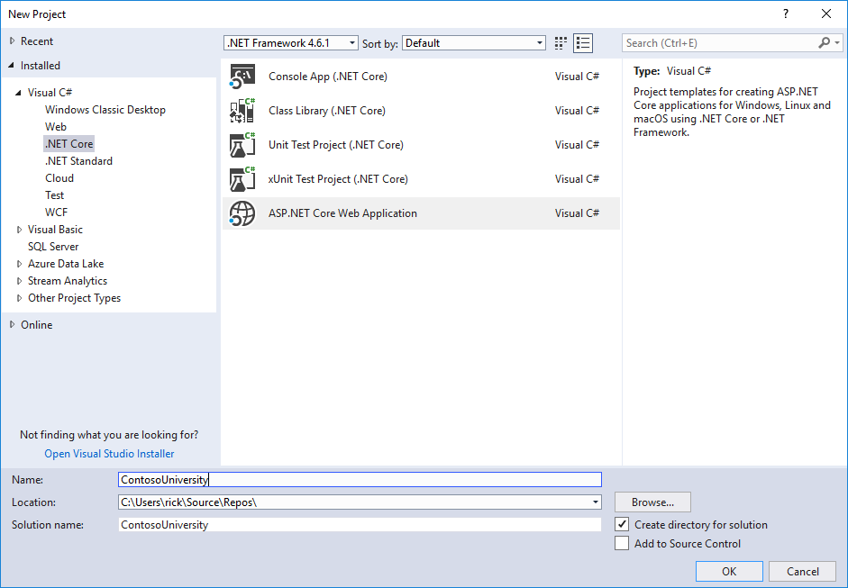
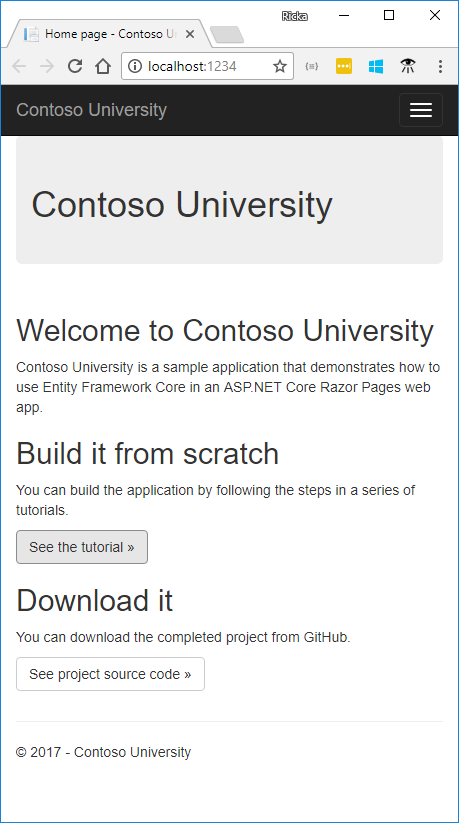
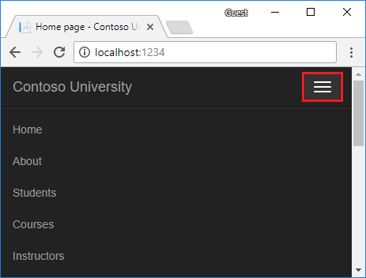

# Getting started with Razor Pages and Entity Framework Core using Visual Studio (1 of 8)

By [Tom Dykstra](https://github.com/tdykstra) and [Rick Anderson](https://twitter.com/RickAndMSFT)

The Contoso University sample web app demonstrates how to create ASP.NET Core 2.0 MVC web applications using Entity Framework (EF) Core 2.0 and Visual Studio 2017.

The sample app is a web site for a fictional Contoso University. It includes functionality such as student admission, course creation, and instructor assignments. This page is the first in a series of tutorials that explain how to build the Contoso University sample app.

[Download or view the completed app.](https://github.com/aspnet/Docs/tree/master/aspnetcore/data/ef-rp/intro/samples) [Download instructions](xref:tutorials/index#how-to-download-a-sample).

## Prerequisites

[!INCLUDE[install 2.0](../../includes/install2.0.md)]

## Troubleshooting

If you run into a problem you can't resolve, you can generally find the solution by comparing your code to the [completed stage](https://github.com/aspnet/Docs/tree/master/aspnetcore/data/ef-rp/intro/samples/StageSnapShots) or [completed project](https://github.com/aspnet/Docs/tree/master/aspnetcore/data/ef-rp/intro/samples/cu-final). For a list of common errors and how to solve them, see [the Troubleshooting section of the last tutorial in the series](xref:data/ef-mvc/advanced#common-errors). If you don't find what you need there, you can post a question to StackOverflow.com for [ASP.NET Core](https://stackoverflow.com/questions/tagged/asp.net-core) or [EF Core](https://stackoverflow.com/questions/tagged/entity-framework-core).

> [!TIP]
> This series of tutorials builds on what is done in earlier tutorials. Consider saving a copy of the project after each successful tutorial completion. If you run into problems, you can start over from the previous tutorial instead of going back to the beginning. Alternatively, you can download a [completed stage](https://github.com/aspnet/Docs/tree/master/aspnetcore/data/ef-rp/intro/samples/StageSnapShots) and start over using the completed stage.

## The Contoso University web app

The app built in these tutorials is a basic university web site.

Users can view and update student, course, and instructor information. Here are a few of the screens created in the tutorial.


The UI style of this site is close to what's generated by the built-in templates. The tutorial focus is on EF Core with Razor Pages, not the UI.

## Create a Razor Pages web app

* From the Visual Studio **File** menu, select **New** > **Project**.
* Create a new ASP.NET Core Web Application. Name the project **ContosoUniversity**. It's important to name the project *ContosoUniversity* so the namespaces match when code is copy/pasted.
 
* Select **ASP.NET Core 2.0** in the dropdown, and then select **Web Application**.
 

Press **F5** to run the app in debug mode or **Ctrl-F5** to run without attaching the debugger

## Set up the site style

A few changes set up the site menu, layout, and home page.

Open *Pages/_Layout.cshtml* and make the following changes:

* Change each occurrence of "ContosoUniversity" to "Contoso University." There are three occurrences.

* Add menu entries for **Students**, **Courses**, **Instructors**, and **Departments**, and delete the **Contact** menu entry.

The changes are highlighted.

[!code-html[](intro/samples/cu/Pages/_Layout.cshtml?highlight=6,29,35-39,47&range=1-50)]

In *Views/Home/Index.cshtml*, replace the contents of the file with the following code to replace the text about ASP.NET and MVC with text about this app:

[!code-html[](intro/samples/cu/Pages/Index.cshtml)]

Press CTRL+F5 to run the project. The home page is displayed with tabs created in the following tutorials:



## Create the data model

Create entity classes for the Contoso University app. Start with the following three entities:


There's a one-to-many relationship between `Student` and `Enrollment` entities. There's a one-to-many relationship between `Course` and `Enrollment` entities. A student can enroll in any number of courses. A course can have any number of students enrolled in it.

In the following sections, a class for each one of these entities is created.

### The Student entity


Create a *Models* folder. In the *Models* folder, create a class file named *Student.cs* with the following code:

[!code-csharp[Main](intro/samples/cu/Models/Student.cs?name=snippet_Intro)]

The `ID` property becomes the primary key column of the database (DB) table that corresponds to this class. By default, EF Core interprets a property that's named `ID` or `classnameID` as the primary key.

The `Enrollments` property is a navigation property. Navigation properties link to other entities that are related to this entity. In this case, the `Enrollments` property of a `Student entity` holds all of the `Enrollment` entities that are related to that `Student`. For example, if a Student row in the DB has two related Enrollment rows, the `Enrollments` navigation property contains those two `Enrollment` entities. A related `Enrollment` row is a row that contains that student's primary key value in the `StudentID` column. For example, suppose the student with ID=1 has two rows in the `Enrollment` table. The `Enrollment` table has two rows with `StudentID` = 1. `StudentID` is a foreign key in the `Enrollment` table that specifies the student in the `Student` table.

If a navigation property can hold multiple entities, the navigation property must be a list type, such as `ICollection<T>`. `ICollection<T>` can be specified, or a type such as `List<T>` or `HashSet<T>`. When `ICollection<T>` is used, EF Core creates a `HashSet<T>` collection by default. Navigation properties that hold multiple entities come from many-to-many and one-to-many relationships.

### The Enrollment entity


In the *Models* folder, create *Enrollment.cs* with the following code:

[!code-csharp[Main](intro/samples/cu/Models/Enrollment.cs?name=snippet_Intro)]

The `EnrollmentID` property is the primary key. This entity uses the `classnameID` pattern instead of `ID` like the `Student` entity. Typically developers choose one pattern and use it throughout the data model. In a later tutorial, using ID without classname is shown to make it easier to implement inheritance in the data model.

The `Grade` property is an `enum`. The question mark after the `Grade` type declaration indicates that the `Grade` property is nullable. A grade that's null is different from a zero grade -- null means a grade isn't known or hasn't been assigned yet.

The `StudentID` property is a foreign key, and the corresponding navigation property is `Student`. An `Enrollment` entity is associated with one `Student` entity, so the property contains a single `Student` entity. The `Student` entity differs from the `Student.Enrollments` navigation property, which contains multiple `Enrollment` entities.

The `CourseID` property is a foreign key, and the corresponding navigation property is `Course`. An `Enrollment` entity is associated with one `Course` entity.

EF Core interprets a property as a foreign key if it's named `<navigation property name><primary key property name>`. For example,`StudentID` for the `Student` navigation property, since the `Student` entity's primary key is `ID`. Foreign key properties can also be named `<primary key property name>`. For example, `CourseID` since the `Course` entity's primary key is `CourseID`.

### The Course entity


In the *Models* folder, create *Course.cs* with the following code:

[!code-csharp[Main](intro/samples/cu/Models/Course.cs?name=snippet_Intro)]

The `Enrollments` property is a navigation property. A `Course` entity can be related to any number of `Enrollment` entities.

The `DatabaseGenerated` attribute allows the app to specify the primary key rather than having the DB generate it.

## Create the SchoolContext DB context

The main class that coordinates EF Core functionality for a given data model is the DB context class. The data context is derived from `Microsoft.EntityFrameworkCore.DbContext`. The data context specifies which entities are included in the data model. In this project, the class is named `SchoolContext`.

In the project folder, create a folder named *Data*.

In the *Data* folder create *SchoolContext.cs* with the following code:

[!code-csharp[Main](intro/samples/cu/Data/SchoolContext.cs?name=snippet_Intro)]

This code creates a `DbSet` property for each entity set. In EF Core terminology:

* An entity set typically corresponds to a DB table.
* An entity corresponds to a row in the table.

`DbSet<Enrollment>` and `DbSet<Course>` can be omitted. EF Core includes them implicitly because the `Student` entity references the `Enrollment` entity, and the `Enrollment` entity references the `Course` entity. For this tutorial, keep `DbSet<Enrollment>` and `DbSet<Course>` in the `SchoolContext`.

When the DB is created, EF Core creates tables that have names the same as the `DbSet` property names. Property names for collections are typically plural (Students rather than Student). Developers disagree about whether table names should be plural. For these tutorials, the default behavior is overridden by specifying singular table names in the DbContext. To specify singular table names, add the following highlighted code:

[!code-csharp[Main](intro/samples/cu/Data/SchoolContext.cs?name=snippet_TableNames&highlight=16-21)]

## Register the context with dependency injection

ASP.NET Core includes [dependency injection](xref:fundamentals/dependency-injection). Services (such as the EF Core DB context) are registered with dependency injection during application startup. Components that require these services (such as Razor Pages) are provided these services via constructor parameters. The constructor code that gets a db context instance is shown later in the tutorial.

To register `SchoolContext` as a service, open *Startup.cs*, and add the highlighted lines to the `ConfigureServices` method.

[!code-csharp[Main](intro/samples/cu/Startup.cs?name=snippet_SchoolContext&highlight=3-4)]

The name of the connection string is passed in to the context by calling a method on a `DbContextOptionsBuilder` object. For local development, the [ASP.NET Core configuration system](xref:fundamentals/configuration/index) reads the connection string from the *appsettings.json* file.

Add `using` statements for `ContosoUniversity.Data` and `Microsoft.EntityFrameworkCore` namespaces. Build the project.

[!code-csharp[Main](intro/samples/cu/Startup.cs?name=snippet_Usings)]

Open the *appsettings.json* file and add a connection string as shown in the following code:

[!code-json[](./intro/samples/cu/appsettings1.json?highlight=2-4)]

The preceding connection string uses `ConnectRetryCount=0` to prevent [SQLClient](https://docs.microsoft.com/dotnet/framework/data/adonet/ef/sqlclient-for-the-entity-framework) from hanging.

### SQL Server Express LocalDB

The connection string specifies a SQL Server LocalDB DB. LocalDB is a lightweight version of the SQL Server Express Database Engine and is intended for app development, not production use. LocalDB starts on demand and runs in user mode, so there is no complex configuration. By default, LocalDB creates *.mdf* DB files in the `C:/Users/<user>` directory.

## Add code to initialize the DB with test data

EF Core creates an empty DB. In this section, a *Seed* method is written to populate it with test data.

In the *Data* folder, create a new class file named *DbInitializer.cs* and add the following code:

[!code-csharp[Main](intro/samples/cu/Data/DbInitializer.cs?name=snippet_Intro)]

The code checks if there are any students in the DB. If there are no students in the DB, the DB is seeded with test data. It loads test data into arrays rather than `List<T>` collections to optimize performance.

The `EnsureCreated` method automatically creates the DB for the DB context. If the DB exists, `EnsureCreated` returns without modifying the DB.

In *Program.cs*, modify the `Main` method to do the following:

* Get a DB context instance from the dependency injection container.
* Call the seed method, passing to it the context.
* Dispose the context when the seed method completes.

The following code shows the updated *Program.cs* file.

[!code-csharp[Main](intro/samples/cu/ProgramOriginal.cs?name=snippet)]

The first time the app is run, the DB is created and seeded with test data. When the data model is updated:
* Delete the DB.
* Update the seed method.
* Run the app and a new seeded DB is created. 

In later tutorials, the DB is updated when the data model changes, without deleting and re-creating the DB.

<a name="pmc"></a>
## Add scaffold tooling

In this section, the Package Manager Console (PMC) is used to add the Visual Studio web code generation package. This package is required to run the scaffolding engine.

From the **Tools** menu, select **NuGet Package Manager** > **Package Manager Console**.

In the Package Manager Console (PMC), enter the following commands:

```powershell
Install-Package Microsoft.VisualStudio.Web.CodeGeneration.Design
Install-Package Microsoft.VisualStudio.Web.CodeGeneration.Utils
```

The previous command adds the NuGet packages to the *.csproj file:

[!code-csharp[Main](intro/samples/cu/ContosoUniversity1_csproj.txt?highlight=7-8)]

<a name="scaffold"></a>
## Scaffold the model

* Open a command window in the project directory (The directory that contains the *Program.cs*, *Startup.cs*, and *.csproj* files).
* Run the following commands:


 ```console
dotnet restore
dotnet aspnet-codegenerator razorpage -m Student -dc SchoolContext -udl -outDir Pages\Students --referenceScriptLibraries
 ```
 
If the following error is generated:

```text
Unhandled Exception: System.IO.FileNotFoundException: 
Could not load file or assembly 
'Microsoft.VisualStudio.Web.CodeGeneration.Utils, 
Version=2.0.0.0, Culture=neutral, PublicKeyToken=adb9793829ddae60'.
The system cannot find the file specified.
```

Run the command again and leave a comment at the bottom of the page.

Build the project. The build generates errors like the following:

 `1>Pages\Students\Index.cshtml.cs(26,38,26,45): error CS1061: 'SchoolContext' does not contain a definition for 'Student'`

 Globally change `_context.Student` to `_context.Students` (that is, add an "s" to `Student`). 7 occurrences are found and updated. We hope to fix [this bug](https://github.com/aspnet/Scaffolding/issues/633) in the next release.

[!INCLUDE[model4tbl](../../includes/RP/model4tbl.md)]

 <a name="test"></a>
### Test the app

Run the app and select the **Students** link. Depending on the browser width, the **Students** link appears at the top of the page. If the **Students** link is not visible, click the navigation icon in the upper right corner.



Test the **Create**, **Edit**, and **Details** links.

## View the DB

When the app is started, `DbInitializer.Initialize` calls `EnsureCreated`. `EnsureCreated` detects if the DB exists, and creates one if necessary. If there are no Students in the DB, the `Initialize` method adds students.

Open **SQL Server Object Explorer** (SSOX) from the **View** menu in Visual Studio.
In SSOX, click **(localdb)\MSSQLLocalDB > Databases > ContosoUniversity1**.

Expand the **Tables** node.

Right-click the **Student** table and click **View Data** to see the columns created and the rows inserted into the table.

The *.mdf* and *.ldf* DB files are in the *C:\Users\<yourusername>* folder.

`EnsureCreated` is called on app start, which allows the following work flow:

* Delete the DB.
* Change the DB schema (for example, add an `EmailAddress` field).
* Run the app.

`EnsureCreated` creates a DB with the`EmailAddress` column.

## Conventions

The amount of code written in order for EF Core to create a complete DB is minimal because of the use of conventions, or assumptions that EF Core makes.

* The names of `DbSet` properties are used as table names. For entities not referenced by a `DbSet` property, entity class names are used as table names.

* Entity property names are used for column names.

* Entity properties that are named ID or classnameID are recognized as primary key properties.

* A property is interpreted as a foreign key property if it's named *<navigation property name><primary key property name>* (for example, `StudentID` for the `Student` navigation property since the `Student` entity's primary key is `ID`). Foreign key properties can be named *<primary key property name>* (for example, `EnrollmentID` since the `Enrollment` entity's primary key is `EnrollmentID`).

Conventional behavior can be overridden. For example, the table names can be explicitly specified, as shown earlier in this tutorial. The column names can be explicitly set. Primary keys and foreign keys can be explicitly set.

## Asynchronous code

Asynchronous programming is the default mode for ASP.NET Core and EF Core.

A web server has a limited number of threads available, and in high load situations all of the available threads might be in use. When that happens, the server can't process new requests until the threads are freed up. With synchronous code, many threads may be tied up while they aren't actually doing any work because they're waiting for I/O to complete. With asynchronous code, when a process is waiting for I/O to complete, its thread is freed up for the server to use for processing other requests. As a result, asynchronous code enables server resources to be used more efficiently, and the server is enabled to handle more traffic without delays.

Asynchronous code does introduce a small amount of overhead at run time. For low traffic situations, the performance hit is negligible, while for high traffic situations, the potential performance improvement is substantial.

In the following code, the `async` keyword, `Task<T>` return value, `await` keyword, and `ToListAsync` method make the code execute asynchronously.

[!code-csharp[Main](intro/samples/cu/Pages/Students/Index.cshtml.cs?name=snippet_ScaffoldedIndex)]

* The `async` keyword tells the compiler to:

  * Generate callbacks for parts of the method body.
  * Automatically create the [Task](https://docs.microsoft.com/dotnet/api/system.threading.tasks.task?view=netframework-4.7) object that is returned. For more information, see [Task Return Type](https://docs.microsoft.com/dotnet/csharp/programming-guide/concepts/async/async-return-types#BKMK_TaskReturnType).

* The implicit return type `Task` represents ongoing work.

* The `await` keyword causes the compiler to split the method into two parts. The first part ends with the operation that is started asynchronously. The second part is put into a callback method that is called when the operation completes.

* `ToListAsync` is the asynchronous version of the `ToList` extension method.

Some things to be aware of when writing asynchronous code that uses EF Core:

* Only statements that cause queries or commands to be sent to the DB are executed asynchronously. That includes, `ToListAsync`, `SingleOrDefaultAsync`, `FirstOrDefaultAsync`, and `SaveChangesAsync`. It does not include statements that just change an `IQueryable`, such as `var students = context.Students.Where(s => s.LastName == "Davolio")`.

* An EF Core context is not threaded safe: don't try to do multiple operations in parallel. 

* To take advantage of the performance benefits of async code, verify that library packages (such as for paging) use async if they call EF Core methods that send queries to the DB.

For more information about asynchronous programming in .NET, see [Async Overview](https://docs.microsoft.com/dotnet/articles/standard/async).

In the next tutorial, basic CRUD (create, read, update, delete) operations are examined.

>[!div class="step-by-step"]
[Next](xref:data/ef-rp/crud)
