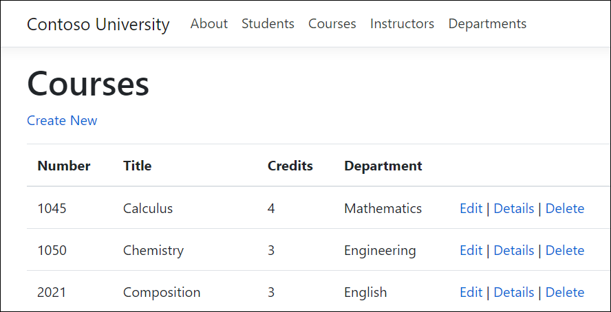
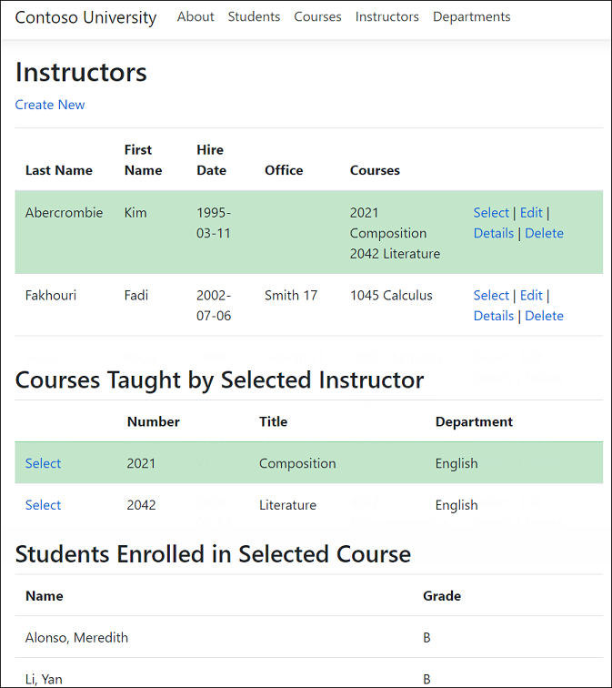
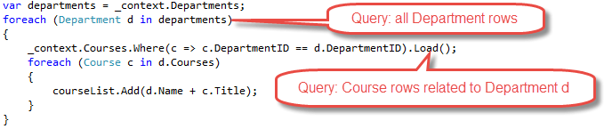
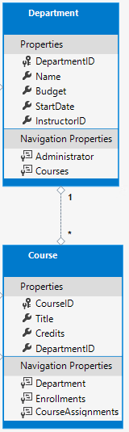
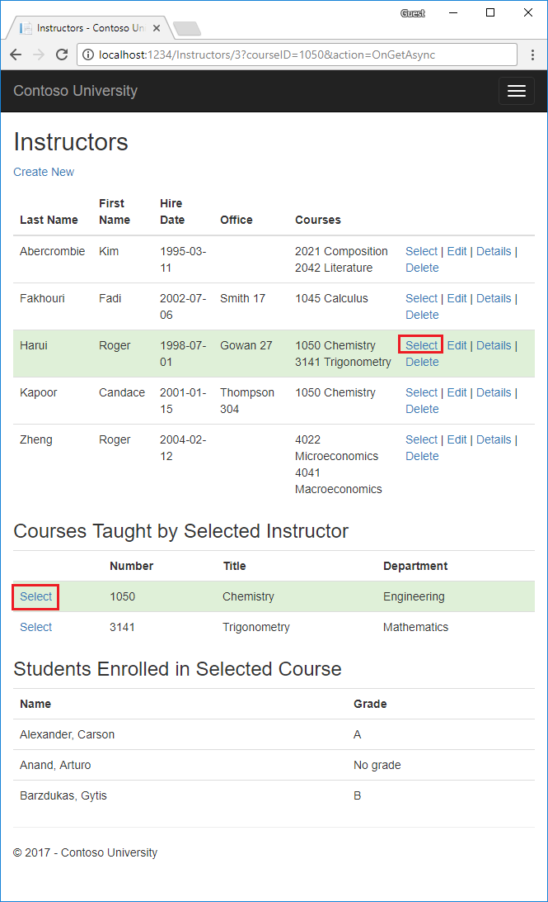

# Part 6, Razor Pages with EF Core in ASP.NET Core - Read Related Data

By [Tom Dykstra](https://github.com/tdykstra), [Jon P Smith](https://twitter.com/thereformedprog), and [Rick Anderson](https://twitter.com/RickAndMSFT)

[!INCLUDE [about the series](../../includes/RP-EF/intro.md)]

:::moniker range=">= aspnetcore-5.0"

This tutorial shows how to read and display related data. Related data is data that EF Core loads into navigation properties.

The following illustrations show the completed pages for this tutorial:





## Eager, explicit, and lazy loading

There are several ways that EF Core can load related data into the navigation properties of an entity:

* [Eager loading](/ef/core/querying/related-data#eager-loading). Eager loading is when a query for one type of entity also loads related entities. When an entity is read, its related data is retrieved. This typically results in a single join query that retrieves all of the data that's needed. EF Core will issue multiple queries for some types of eager loading. Issuing multiple queries can be more efficient than a large single query. Eager loading is specified with the <xref:Microsoft.EntityFrameworkCore.EntityFrameworkQueryableExtensions.Include%2A> and <xref:Microsoft.EntityFrameworkCore.EntityFrameworkQueryableExtensions.ThenInclude%2A> methods.

  

  Eager loading sends multiple queries when a collection navigation is included:

  * One query for the main query 
  * One query for each collection "edge" in the load tree.

* Separate queries with `Load`: The data can be retrieved in separate queries, and EF Core "fixes up" the navigation properties. "Fixes up" means that EF Core automatically populates the navigation properties. Separate queries with `Load` is more like explicit loading than eager loading.

  

  **Note:** EF Core automatically fixes up navigation properties to any other entities that were previously loaded into the context instance. Even if the data for a navigation property is *not* explicitly included, the property may still be populated if some or all of the related entities were previously loaded.

* [Explicit loading](/ef/core/querying/related-data#explicit-loading). When the entity is first read, related data isn't retrieved. Code must be written to retrieve the related data when it's needed. Explicit loading with separate queries results in multiple queries sent to the database. With explicit loading, the code specifies the navigation properties to be loaded. Use the `Load` method to do explicit loading. For example:

  

* [Lazy loading](/ef/core/querying/related-data#lazy-loading). When the entity is first read, related data isn't retrieved. The first time a navigation property is accessed, the data required for that navigation property is automatically retrieved. A query is sent to the database each time a navigation property is accessed for the first time. Lazy loading can hurt performance, for example when developers use [N+1 queries](https://www.bing.com/search?q=N%2B1+queries). N+1 queries load a parent and enumerate through children.

## Create Course pages

The `Course` entity includes a navigation property that contains the related `Department` entity.



To display the name of the assigned department for a course:

* Load the related `Department` entity into the `Course.Department` navigation property.
* Get the name from the `Department` entity's `Name` property.

<a name="scaffold"></a>

### Scaffold Course pages

# [Visual Studio](#tab/visual-studio)

* Follow the instructions in [Scaffold Student pages](xref:data/ef-rp/intro#scaffold-student-pages) with the following exceptions:

  * Create a *Pages/Courses* folder.
  * Use `Course` for the model class.
  * Use the existing context class instead of creating a new one.

# [Visual Studio Code](#tab/visual-studio-code)

* Create a *Pages/Courses* folder.

* Run the following command to scaffold the Course pages.

  **On Windows:**

  ```dotnetcli
  dotnet aspnet-codegenerator razorpage -m Course -dc SchoolContext -udl -outDir Pages\Courses --referenceScriptLibraries
  ```

  **On Linux or macOS:**

  ```dotnetcli
  dotnet aspnet-codegenerator razorpage -m Course -dc SchoolContext -udl -outDir Pages/Courses --referenceScriptLibraries
  ```

---

* Open `Pages/Courses/Index.cshtml.cs` and examine the `OnGetAsync` method. The scaffolding engine specified eager loading for the `Department` navigation property. The `Include` method specifies eager loading.

* Run the app and select the **Courses** link. The department column displays the `DepartmentID`, which isn't useful.

### Display the department name

Update Pages/Courses/Index.cshtml.cs with the following code:

[!code-csharp[](intro/samples/cu30/Pages/Courses/Index.cshtml.cs?highlight=18,22,24)]

The preceding code changes the `Course` property to `Courses` and adds `AsNoTracking`. `AsNoTracking` improves performance because the entities returned are not tracked. The entities don't need to be tracked because they're not updated in the current context.

Update `Pages/Courses/Index.cshtml` with the following code.

[!code-cshtml[](intro/samples/cu30/Pages/Courses/Index.cshtml?highlight=5,8,16-18,20,23,26,32,35-37,45)]

The following changes have been made to the scaffolded code:

* Changed the `Course` property name to `Courses`.
* Added a **Number** column that shows the `CourseID` property value. By default, primary keys aren't scaffolded because normally they're meaningless to end users. However, in this case the primary key is meaningful.
* Changed the **Department** column to display the department name. The code displays the `Name` property of the `Department` entity that's loaded into the `Department` navigation property:

  ```html
  @Html.DisplayFor(modelItem => item.Department.Name)
  ```

Run the app and select the **Courses** tab to see the list with department names.


<a name="select"></a>

### Loading related data with Select

The `OnGetAsync` method loads related data with the `Include` method. The `Select` method is an alternative that loads only the related data needed. For single items, like the `Department.Name` it uses a `SQL INNER JOIN`. For collections, it uses another database access, but so does the `Include` operator on collections.

The following code loads related data with the `Select` method:

[!code-csharp[](intro/samples/cu50/Pages/Courses/IndexSelectModel.cshtml.cs?name=snippet_RevisedIndexMethod&highlight=6)]

The preceding code doesn't return any entity types, therefore no tracking is done. For more information about the EF tracking, see [Tracking vs. No-Tracking Queries](/ef/core/querying/tracking).

The `CourseViewModel`:

[!code-csharp[](intro/samples/cu50/Models/SchoolViewModels/CourseViewModel.cs)]

See [IndexSelectModel](https://github.com/dotnet/AspNetCore.Docs/tree/main/aspnetcore/data/ef-rp/intro/samples/cu50/Pages/Courses) for the complete Razor Pages.

## Create Instructor pages

This section scaffolds Instructor pages and adds related Courses and Enrollments to the Instructors Index page.

<a name="IP"></a>


This page reads and displays related data in the following ways:

* The list of instructors displays related data from the `OfficeAssignment` entity (Office in the preceding image). The `Instructor` and `OfficeAssignment` entities are in a one-to-zero-or-one relationship. Eager loading is used for the `OfficeAssignment` entities. Eager loading is typically more efficient when the related data needs to be displayed. In this case, office assignments for the instructors are displayed.
* When the user selects an instructor, related `Course` entities are displayed. The `Instructor` and `Course` entities are in a many-to-many relationship. Eager loading is used for the `Course` entities and their related `Department` entities. In this case, separate queries might be more efficient because only courses for the selected instructor are needed. This example shows how to use eager loading for navigation properties in entities that are in navigation properties.
* When the user selects a course, related data from the `Enrollments` entity is displayed. In the preceding image, student name and grade are displayed. The `Course` and `Enrollment` entities are in a one-to-many relationship.

### Create a view model

The instructors page shows data from three different tables. A view model is needed that includes three properties representing the three tables.

Create `Models/SchoolViewModels/InstructorIndexData.cs` with the following code:

[!code-csharp[](intro/samples/cu50/Models/SchoolViewModels/InstructorIndexData.cs)]

### Scaffold Instructor pages

# [Visual Studio](#tab/visual-studio)

* Follow the instructions in [Scaffold the student pages](xref:data/ef-rp/intro#scaffold-student-pages) with the following exceptions:

  * Create a *Pages/Instructors* folder.
  * Use `Instructor` for the model class.
  * Use the existing context class instead of creating a new one.

# [Visual Studio Code](#tab/visual-studio-code)

* Create a *Pages/Instructors* folder.

* Run the following command to scaffold the Instructor pages.

  **On Windows:**

  ```dotnetcli
  dotnet aspnet-codegenerator razorpage -m Instructor -dc SchoolContext -udl -outDir Pages\Instructors --referenceScriptLibraries
  ```

  **On Linux or macOS:**

  ```dotnetcli
  dotnet aspnet-codegenerator razorpage -m Instructor -dc SchoolContext -udl -outDir Pages/Instructors --referenceScriptLibraries
  ```

---

Run the app and navigate to the Instructors page.

Update `Pages/Instructors/Index.cshtml.cs` with the following code:

[!code-csharp[](intro/samples/cu50/Pages/Instructors/Index.cshtml.cs?name=snippet_all)]

The `OnGetAsync` method accepts optional route data for the ID of the selected instructor.

Examine the query in the `Pages/Instructors/Index.cshtml.cs` file:

[!code-csharp[](intro/samples/cu50/Pages/Instructors/Index.cshtml.cs?name=snippet_query)]

The code specifies eager loading for the following navigation properties:

* `Instructor.OfficeAssignment`
* `Instructor.Courses`
    * `Course.Department`

The following code executes when an instructor is selected, that is, `id != null`.

[!code-csharp[](intro/samples/cu50/Pages/Instructors/Index.cshtml.cs?name=snippet_id)]

The selected instructor is retrieved from the list of instructors in the view model. The view model's `Courses` property is loaded with the `Course` entities from the selected instructor's `Courses` navigation property.

The `Where` method returns a collection. In this case, the filter select a single entity, so the `Single` method is called to convert the collection into a single `Instructor` entity. The `Instructor` entity provides access to the `Course` navigation property.

The <xref:System.Linq.Enumerable.Single%2A> method is used on a collection when the collection has only one item. The `Single` method throws an exception if the collection is empty or if there's more than one item. An alternative is <xref:System.Linq.Enumerable.SingleOrDefault%2A>, which returns a default value if the collection is empty. For this query, `null` in the default returned.

The following code populates the view model's `Enrollments` property when a course is selected:

[!code-csharp[](intro/samples/cu50/Pages/Instructors/Index.cshtml.cs?name=snippet_enrollment)]

### Update the instructors Index page

Update `Pages/Instructors/Index.cshtml` with the following code.

[!code-cshtml[](intro/samples/cu50/Pages/Instructors/Index.cshtml?highlight=1)]

The preceding code makes the following changes:

  * Updates the `page` directive to `@page "{id:int?}"`. `"{id:int?}"` is a route template. The [route template](xref:fundamentals/routing#route-template-reference) changes integer query strings in the URL to route data. For example, clicking on the **Select** link for an instructor with only the `@page` directive produces a URL like the following:

    `https://localhost:5001/Instructors?id=2`

    When the page directive is `@page "{id:int?}"`, the URL is:
    `https://localhost:5001/Instructors/2`

  * Adds an **Office** column that displays `item.OfficeAssignment.Location` only if `item.OfficeAssignment` isn't null. Because this is a one-to-zero-or-one relationship, there might not be a related OfficeAssignment entity.

    ```html
    @if (item.OfficeAssignment != null)
    {
        @item.OfficeAssignment.Location
    }
    ```

  * Adds a **Courses** column that displays courses taught by each instructor. See [Explicit line transition](xref:mvc/views/razor#explicit-line-transition) for more about this razor syntax.
  * Adds code that dynamically adds `class="table-success"` to the `tr` element of the selected instructor and course. This sets a background color for the selected row using a Bootstrap class.

    ```html
    string selectedRow = "";
    if (item.CourseID == Model.CourseID)
    {
        selectedRow = "table-success";
    }
    <tr class="@selectedRow">
    ```

  * Adds a new hyperlink labeled **Select**. This link sends the selected instructor's ID to the `Index` method and sets a background color.

    ```html
    <a asp-action="Index" asp-route-id="@item.ID">Select</a> |
    ```

  * Adds a table of courses for the selected Instructor.
  * Adds a table of student enrollments for the selected course.

Run the app and select the **Instructors** tab. The page displays the `Location` (office) from the related `OfficeAssignment` entity. If `OfficeAssignment` is null, an empty table cell is displayed.

Click on the **Select** link for an instructor. The row style changes and courses assigned to that instructor are displayed.

Select a course to see the list of enrolled students and their grades.


## Next steps

The next tutorial shows how to update related data.

>[!div class="step-by-step"]
>[Previous tutorial](xref:data/ef-rp/complex-data-model)
>[Next tutorial](xref:data/ef-rp/update-related-data)

:::moniker-end

:::moniker range=">= aspnetcore-3.0 < aspnetcore-5.0"

This tutorial shows how to read and display related data. Related data is data that EF Core loads into navigation properties.

The following illustrations show the completed pages for this tutorial:


## Eager, explicit, and lazy loading

There are several ways that EF Core can load related data into the navigation properties of an entity:

* [Eager loading](/ef/core/querying/related-data#eager-loading). Eager loading is when a query for one type of entity also loads related entities. When an entity is read, its related data is retrieved. This typically results in a single join query that retrieves all of the data that's needed. EF Core will issue multiple queries for some types of eager loading. Issuing multiple queries can be more efficient than a giant single query. Eager loading is specified with the `Include` and `ThenInclude` methods.

  
 
  Eager loading sends multiple queries when a collection navigation is included:

  * One query for the main query 
  * One query for each collection "edge" in the load tree.

* Separate queries with `Load`: The data can be retrieved in separate queries, and EF Core "fixes up" the navigation properties. "Fixes up" means that EF Core automatically populates the navigation properties. Separate queries with `Load` is more like explicit loading than eager loading.

  

  **Note:** EF Core automatically fixes up navigation properties to any other entities that were previously loaded into the context instance. Even if the data for a navigation property is *not* explicitly included, the property may still be populated if some or all of the related entities were previously loaded.

* [Explicit loading](/ef/core/querying/related-data#explicit-loading). When the entity is first read, related data isn't retrieved. Code must be written to retrieve the related data when it's needed. Explicit loading with separate queries results in multiple queries sent to the database. With explicit loading, the code specifies the navigation properties to be loaded. Use the `Load` method to do explicit loading. For example:

  

* [Lazy loading](/ef/core/querying/related-data#lazy-loading). When the entity is first read, related data isn't retrieved. The first time a navigation property is accessed, the data required for that navigation property is automatically retrieved. A query is sent to the database each time a navigation property is accessed for the first time. Lazy loading can hurt performance, for example when developers use N+1 patterns, loading a parent and enumerating through children.

## Create Course pages

The `Course` entity includes a navigation property that contains the related `Department` entity.


To display the name of the assigned department for a course:

* Load the related `Department` entity into the `Course.Department` navigation property.
* Get the name from the `Department` entity's `Name` property.

<a name="scaffold"></a>

### Scaffold Course pages

# [Visual Studio](#tab/visual-studio)

* Follow the instructions in [Scaffold Student pages](xref:data/ef-rp/intro#scaffold-student-pages) with the following exceptions:

  * Create a *Pages/Courses* folder.
  * Use `Course` for the model class.
  * Use the existing context class instead of creating a new one.

# [Visual Studio Code](#tab/visual-studio-code)

* Create a *Pages/Courses* folder.

* Run the following command to scaffold the Course pages.

  **On Windows:**

  ```dotnetcli
  dotnet aspnet-codegenerator razorpage -m Course -dc SchoolContext -udl -outDir Pages\Courses --referenceScriptLibraries
  ```

  **On Linux or macOS:**

  ```dotnetcli
  dotnet aspnet-codegenerator razorpage -m Course -dc SchoolContext -udl -outDir Pages/Courses --referenceScriptLibraries
  ```

---

* Open `Pages/Courses/Index.cshtml.cs` and examine the `OnGetAsync` method. The scaffolding engine specified eager loading for the `Department` navigation property. The `Include` method specifies eager loading.

* Run the app and select the **Courses** link. The department column displays the `DepartmentID`, which isn't useful.

### Display the department name

Update Pages/Courses/Index.cshtml.cs with the following code:

[!code-csharp[](intro/samples/cu30/Pages/Courses/Index.cshtml.cs?highlight=18,22,24)]

The preceding code changes the `Course` property to `Courses` and adds `AsNoTracking`. `AsNoTracking` improves performance because the entities returned are not tracked. The entities don't need to be tracked because they're not updated in the current context.

Update `Pages/Courses/Index.cshtml` with the following code.

[!code-cshtml[](intro/samples/cu30/Pages/Courses/Index.cshtml?highlight=5,8,16-18,20,23,26,32,35-37,45)]

The following changes have been made to the scaffolded code:

* Changed the `Course` property name to `Courses`.
* Added a **Number** column that shows the `CourseID` property value. By default, primary keys aren't scaffolded because normally they're meaningless to end users. However, in this case the primary key is meaningful.
* Changed the **Department** column to display the department name. The code displays the `Name` property of the `Department` entity that's loaded into the `Department` navigation property:

  ```html
  @Html.DisplayFor(modelItem => item.Department.Name)
  ```

Run the app and select the **Courses** tab to see the list with department names.


<a name="select"></a>

### Loading related data with Select

The `OnGetAsync` method loads related data with the `Include` method. The `Select` method is an alternative that loads only the related data needed. For single items, like the `Department.Name` it uses a SQL INNER JOIN. For collections, it uses another database access, but so does the `Include` operator on collections.

The following code loads related data with the `Select` method:

[!code-csharp[](intro/samples/cu30snapshots/6-related/Pages/Courses/IndexSelect.cshtml.cs?name=snippet_RevisedIndexMethod&highlight=6)]

The preceding code doesn't return any entity types, therefore no tracking is done. For more information about the EF tracking, see [Tracking vs. No-Tracking Queries](/ef/core/querying/tracking).

The `CourseViewModel`:

[!code-csharp[](intro/samples/cu30snapshots/6-related/Models/SchoolViewModels/CourseViewModel.cs?name=snippet)]

See [IndexSelect.cshtml](https://github.com/dotnet/AspNetCore.Docs/tree/main/aspnetcore/data/ef-rp/intro/samples/cu30snapshots/6-related/Pages/Courses/IndexSelect.cshtml) and [IndexSelect.cshtml.cs](https://github.com/dotnet/AspNetCore.Docs/tree/main/aspnetcore/data/ef-rp/intro/samples/cu30snapshots/6-related/Pages/Courses/IndexSelect.cshtml.cs) for a complete example.

## Create Instructor pages

This section scaffolds Instructor pages and adds related Courses and Enrollments to the Instructors Index page.

<a name="IP"></a>


This page reads and displays related data in the following ways:

* The list of instructors displays related data from the `OfficeAssignment` entity (Office in the preceding image). The `Instructor` and `OfficeAssignment` entities are in a one-to-zero-or-one relationship. Eager loading is used for the `OfficeAssignment` entities. Eager loading is typically more efficient when the related data needs to be displayed. In this case, office assignments for the instructors are displayed.
* When the user selects an instructor, related `Course` entities are displayed. The `Instructor` and `Course` entities are in a many-to-many relationship. Eager loading is used for the `Course` entities and their related `Department` entities. In this case, separate queries might be more efficient because only courses for the selected instructor are needed. This example shows how to use eager loading for navigation properties in entities that are in navigation properties.
* When the user selects a course, related data from the `Enrollments` entity is displayed. In the preceding image, student name and grade are displayed. The `Course` and `Enrollment` entities are in a one-to-many relationship.

### Create a view model

The instructors page shows data from three different tables. A view model is needed that includes three properties representing the three tables.

Create `SchoolViewModels/InstructorIndexData.cs` with the following code:

[!code-csharp[](intro/samples/cu30/Models/SchoolViewModels/InstructorIndexData.cs)]

### Scaffold Instructor pages

# [Visual Studio](#tab/visual-studio)

* Follow the instructions in [Scaffold the student pages](xref:data/ef-rp/intro#scaffold-student-pages) with the following exceptions:

  * Create a *Pages/Instructors* folder.
  * Use `Instructor` for the model class.
  * Use the existing context class instead of creating a new one.

# [Visual Studio Code](#tab/visual-studio-code)

* Create a *Pages/Instructors* folder.

* Run the following command to scaffold the Instructor pages.

  **On Windows:**

  ```dotnetcli
  dotnet aspnet-codegenerator razorpage -m Instructor -dc SchoolContext -udl -outDir Pages\Instructors --referenceScriptLibraries
  ```

  **On Linux or macOS:**

  ```dotnetcli
  dotnet aspnet-codegenerator razorpage -m Instructor -dc SchoolContext -udl -outDir Pages/Instructors --referenceScriptLibraries
  ```

---

To see what the scaffolded page looks like before you update it, run the app and navigate to the Instructors page.

Update `Pages/Instructors/Index.cshtml.cs` with the following code:

[!code-csharp[](intro/samples/cu30snapshots/6-related/Pages/Instructors/Index1.cshtml.cs?name=snippet_all&highlight=2,19-53)]

The `OnGetAsync` method accepts optional route data for the ID of the selected instructor.

Examine the query in the `Pages/Instructors/Index.cshtml.cs` file:

[!code-csharp[](intro/samples/cu30snapshots/6-related/Pages/Instructors/Index1.cshtml.cs?name=snippet_EagerLoading)]

The code specifies eager loading for the following navigation properties:

* `Instructor.OfficeAssignment`
* `Instructor.CourseAssignments`
  * `CourseAssignments.Course`
    * `Course.Department`
    * `Course.Enrollments`
      * `Enrollment.Student`

Notice the repetition of `Include` and `ThenInclude` methods for `CourseAssignments` and `Course`. This repetition is necessary to specify eager loading for two navigation properties of the `Course` entity.

The following code executes when an instructor is selected (`id != null`).

[!code-csharp[](intro/samples/cu30snapshots/6-related/Pages/Instructors/Index1.cshtml.cs?name=snippet_SelectInstructor)]

The selected instructor is retrieved from the list of instructors in the view model. The view model's `Courses` property is loaded with the `Course` entities from that instructor's `CourseAssignments` navigation property.

The `Where` method returns a collection. But in this case, the filter will select a single entity, so the `Single` method is called to convert the collection into a single `Instructor` entity. The `Instructor` entity provides access to the `CourseAssignments` property. `CourseAssignments` provides access to the related `Course` entities.


The `Single` method is used on a collection when the collection has only one item. The `Single` method throws an exception if the collection is empty or if there's more than one item. An alternative is `SingleOrDefault`, which returns a default value (null in this case) if the collection is empty.

The following code populates the view model's `Enrollments` property when a course is selected:

[!code-csharp[](intro/samples/cu30snapshots/6-related/Pages/Instructors/Index1.cshtml.cs?name=snippet_SelectCourse)]

### Update the instructors Index page

Update `Pages/Instructors/Index.cshtml` with the following code.

[!code-cshtml[](intro/samples/cu30/Pages/Instructors/Index.cshtml?highlight=1,5,8,16-21,25-32,43-57,67-102,104-126)]

The preceding code makes the following changes:

* Updates the `page` directive from `@page` to `@page "{id:int?}"`. `"{id:int?}"` is a route template. The route template changes integer query strings in the URL to route data. For example, clicking on the **Select** link for an instructor with only the `@page` directive produces a URL like the following:

  `https://localhost:5001/Instructors?id=2`

  When the page directive is `@page "{id:int?}"`, the URL is:

  `https://localhost:5001/Instructors/2`

* Adds an **Office** column that displays `item.OfficeAssignment.Location` only if `item.OfficeAssignment` isn't null. Because this is a one-to-zero-or-one relationship, there might not be a related OfficeAssignment entity.

  ```html
  @if (item.OfficeAssignment != null)
  {
      @item.OfficeAssignment.Location
  }
  ```

* Adds a **Courses** column that displays courses taught by each instructor. See [Explicit line transition](xref:mvc/views/razor#explicit-line-transition) for more about this razor syntax.

* Adds code that dynamically adds `class="table-success"` to the `tr` element of the selected instructor and course. This sets a background color for the selected row using a Bootstrap class.

  ```html
  string selectedRow = "";
  if (item.CourseID == Model.CourseID)
  {
      selectedRow = "table-success";
  }
  <tr class="@selectedRow">
  ```

* Adds a new hyperlink labeled **Select**. This link sends the selected instructor's ID to the `Index` method and sets a background color.

  ```html
  <a asp-action="Index" asp-route-id="@item.ID">Select</a> |
  ```

* Adds a table of courses for the selected Instructor.

* Adds a table of student enrollments for the selected course.

Run the app and select the **Instructors** tab. The page displays the `Location` (office) from the related `OfficeAssignment` entity. If `OfficeAssignment` is null, an empty table cell is displayed.

Click on the **Select** link for an instructor. The row style changes and courses assigned to that instructor are displayed.

Select a course to see the list of enrolled students and their grades.


## Using Single

The `Single` method can pass in the `Where` condition instead of calling the `Where` method separately:

[!code-csharp[](intro/samples/cu30snapshots/6-related/Pages/Instructors/IndexSingle.cshtml.cs?name=snippet_single&highlight=21-22,30-31)]

Use of `Single` with a Where condition is a matter of personal preference. It provides no benefits over using the `Where` method.

## Explicit loading

The current code specifies eager loading for `Enrollments` and `Students`:

[!code-csharp[](intro/samples/cu30snapshots/6-related/Pages/Instructors/Index1.cshtml.cs?name=snippet_EagerLoading&highlight=6-9)]

Suppose users rarely want to see enrollments in a course. In that case, an optimization would be to only load the enrollment data if it's requested. In this section, the `OnGetAsync` is updated to use explicit loading of `Enrollments` and `Students`.

Update `Pages/Instructors/Index.cshtml.cs` with the following code.

[!code-csharp[](intro/samples/cu30/Pages/Instructors/Index.cshtml.cs?highlight=31-35,52-56)]

The preceding code drops the *ThenInclude* method calls for enrollment and student data. If a course is selected, the explicit loading code retrieves:

* The `Enrollment` entities for the selected course.
* The `Student` entities for each `Enrollment`.

Notice that the preceding code comments out `.AsNoTracking()`. Navigation properties can only be explicitly loaded for tracked entities.

Test the app. From a user's perspective, the app behaves identically to the previous version.

## Next steps

The next tutorial shows how to update related data.

>[!div class="step-by-step"]
>[Previous tutorial](xref:data/ef-rp/complex-data-model)
>[Next tutorial](xref:data/ef-rp/update-related-data)

:::moniker-end

:::moniker range="< aspnetcore-3.0"

In this tutorial, related data is read and displayed. Related data is data that EF Core loads into navigation properties.

If you run into problems you can't solve, [download or view the completed app.](https://github.com/dotnet/AspNetCore.Docs/tree/main/aspnetcore/data/ef-rp/intro/samples) [Download instructions](xref:index#how-to-download-a-sample).

The following illustrations show the completed pages for this tutorial:




## Eager, explicit, and lazy Loading of related data

There are several ways that EF Core can load related data into the navigation properties of an entity:

* [Eager loading](/ef/core/querying/related-data#eager-loading). Eager loading is when a query for one type of entity also loads related entities. When the entity is read, its related data is retrieved. This typically results in a single join query that retrieves all of the data that's needed. EF Core will issue multiple queries for some types of eager loading. Issuing multiple queries can be more efficient than was the case for some queries in EF6 where there was a single query. Eager loading is specified with the `Include` and `ThenInclude` methods.

  
 
  Eager loading sends multiple queries when a collection navigation is included:

  * One query for the main query 
  * One query for each collection "edge" in the load tree.

* Separate queries with `Load`: The data can be retrieved in separate queries, and EF Core "fixes up" the navigation properties. "fixes up" means that EF Core automatically populates the navigation properties. Separate queries with `Load` is more like explicit loading than eager loading.

  

  Note: EF Core automatically fixes up navigation properties to any other entities that were previously loaded into the context instance. Even if the data for a navigation property is *not* explicitly included, the property may still be populated if some or all of the related entities were previously loaded.

* [Explicit loading](/ef/core/querying/related-data#explicit-loading). When the entity is first read, related data isn't retrieved. Code must be written to retrieve the related data when it's needed. Explicit loading with separate queries results in multiple queries sent to the DB. With explicit loading, the code specifies the navigation properties to be loaded. Use the `Load` method to do explicit loading. For example:

  

* [Lazy loading](/ef/core/querying/related-data#lazy-loading). [Lazy loading was added to EF Core in version 2.1](/ef/core/querying/related-data#lazy-loading). When the entity is first read, related data isn't retrieved. The first time a navigation property is accessed, the data required for that navigation property is automatically retrieved. A query is sent to the DB each time a navigation property is accessed for the first time.

* The `Select` operator loads only the related data needed.

## Create a Course page that displays department name

The Course entity includes a navigation property that contains the `Department` entity. The `Department` entity contains the department that the course is assigned to.

To display the name of the assigned department in a list of courses:

* Get the `Name` property from the `Department` entity.
* The `Department` entity comes from the `Course.Department` navigation property.


<a name="scaffold"></a>

### Scaffold the Course model

# [Visual Studio](#tab/visual-studio) 

Follow the instructions in [Scaffold the student model](xref:data/ef-rp/intro#scaffold-the-student-model) and use `Course` for the model class.

# [Visual Studio Code](#tab/visual-studio-code)

 Run the following command:

  ```dotnetcli
  dotnet aspnet-codegenerator razorpage -m Course -dc SchoolContext -udl -outDir Pages\Courses --referenceScriptLibraries
  ```

---

The preceding command scaffolds the `Course` model. Open the project in Visual Studio.

Open `Pages/Courses/Index.cshtml.cs` and examine the `OnGetAsync` method. The scaffolding engine specified eager loading for the `Department` navigation property. The `Include` method specifies eager loading.

Run the app and select the **Courses** link. The department column displays the `DepartmentID`, which isn't useful.

Update the `OnGetAsync` method with the following code:

[!code-csharp[](intro/samples/cu/Pages/Courses/Index.cshtml.cs?name=snippet_RevisedIndexMethod)]

The preceding code adds `AsNoTracking`. `AsNoTracking` improves performance because the entities returned are not tracked. The entities are not tracked because they're not updated in the current context.

Update `Pages/Courses/Index.cshtml` with the following highlighted markup:

[!code-cshtml[](intro/samples/cu/Pages/Courses/Index.cshtml?highlight=4,7,15-17,34-36,44)]

The following changes have been made to the scaffolded code:

* Changed the heading from Index to Courses.
* Added a **Number** column that shows the `CourseID` property value. By default, primary keys aren't scaffolded because normally they're meaningless to end users. However, in this case the primary key is meaningful.
* Changed the **Department** column to display the department name. The code displays the `Name` property of the `Department` entity that's loaded into the `Department` navigation property:

  ```html
  @Html.DisplayFor(modelItem => item.Department.Name)
  ```

Run the app and select the **Courses** tab to see the list with department names.


<a name="select"></a>

### Loading related data with Select

The `OnGetAsync` method loads related data with the `Include` method:

[!code-csharp[](intro/samples/cu/Pages/Courses/Index.cshtml.cs?name=snippet_RevisedIndexMethod&highlight=4)]

The `Select` operator loads only the related data needed. For single items, like the `Department.Name` it uses a SQL INNER JOIN. For collections, it uses another database access, but so does the `Include` operator on collections.

The following code loads related data with the `Select` method:

[!code-csharp[](intro/samples/cu/Pages/Courses/IndexSelect.cshtml.cs?name=snippet_RevisedIndexMethod&highlight=4)]

The `CourseViewModel`:

[!code-csharp[](intro/samples/cu/Models/SchoolViewModels/CourseViewModel.cs?name=snippet)]

See [IndexSelect.cshtml](https://github.com/dotnet/AspNetCore.Docs/tree/main/aspnetcore/data/ef-rp/intro/samples/cu/Pages/Courses/IndexSelect.cshtml) and [IndexSelect.cshtml.cs](https://github.com/dotnet/AspNetCore.Docs/tree/main/aspnetcore/data/ef-rp/intro/samples/cu/Pages/Courses/IndexSelect.cshtml.cs) for a complete example.

## Create an Instructors page that shows Courses and Enrollments

In this section, the Instructors page is created.

<a name="IP"></a>


This page reads and displays related data in the following ways:

* The list of instructors displays related data from the `OfficeAssignment` entity (Office in the preceding image). The `Instructor` and `OfficeAssignment` entities are in a one-to-zero-or-one relationship. Eager loading is used for the `OfficeAssignment` entities. Eager loading is typically more efficient when the related data needs to be displayed. In this case, office assignments for the instructors are displayed.
* When the user selects an instructor (Harui in the preceding image), related `Course` entities are displayed. The `Instructor` and `Course` entities are in a many-to-many relationship. Eager loading is used for the `Course` entities and their related `Department` entities. In this case, separate queries might be more efficient because only courses for the selected instructor are needed. This example shows how to use eager loading for navigation properties in entities that are in navigation properties.
* When the user selects a course (Chemistry in the preceding image), related data from the `Enrollments` entity is displayed. In the preceding image, student name and grade are displayed. The `Course` and `Enrollment` entities are in a one-to-many relationship.

### Create a view model for the Instructor Index view

The instructors page shows data from three different tables. A view model is created that includes the three entities representing the three tables.

In the *SchoolViewModels* folder, create `InstructorIndexData.cs` with the following code:

[!code-csharp[](intro/samples/cu/Models/SchoolViewModels/InstructorIndexData.cs)]

### Scaffold the Instructor model

# [Visual Studio](#tab/visual-studio) 

Follow the instructions in [Scaffold the student model](xref:data/ef-rp/intro#scaffold-the-student-model) and use `Instructor` for the model class.

# [Visual Studio Code](#tab/visual-studio-code)

 Run the following command:

  ```dotnetcli
  dotnet aspnet-codegenerator razorpage -m Instructor -dc SchoolContext -udl -outDir Pages\Instructors --referenceScriptLibraries
  ```

---

The preceding command scaffolds the `Instructor` model. 
Run the app and navigate to the instructors page.

Replace `Pages/Instructors/Index.cshtml.cs` with the following code:

[!code-csharp[](intro/samples/cu/Pages/Instructors/Index1.cshtml.cs?name=snippet_all&highlight=2,18-99)]

The `OnGetAsync` method accepts optional route data for the ID of the selected instructor.

Examine the query in the `Pages/Instructors/Index.cshtml.cs` file:

[!code-csharp[](intro/samples/cu/Pages/Instructors/Index1.cshtml.cs?name=snippet_ThenInclude)]

The query has two includes:

* `OfficeAssignment`: Displayed in the [instructors view](#IP).
* `CourseAssignments`: Which brings in the courses taught.

### Update the instructors Index page

Update `Pages/Instructors/Index.cshtml` with the following markup:

[!code-cshtml[](intro/samples/cu/Pages/Instructors/IndexRRD.cshtml?range=1-65&highlight=1,5,8,16-21,25-32,43-57)]

The preceding markup makes the following changes:

* Updates the `page` directive from `@page` to `@page "{id:int?}"`. `"{id:int?}"` is a route template. The route template changes integer query strings in the URL to route data. For example, clicking on the **Select** link for an instructor with only the `@page` directive produces a URL like the following:

  `http://localhost:1234/Instructors?id=2`

  When the page directive is `@page "{id:int?}"`, the previous URL is:

  `http://localhost:1234/Instructors/2`

* Page title is **Instructors**.
* Added an **Office** column that displays `item.OfficeAssignment.Location` only if `item.OfficeAssignment` isn't null. Because this is a one-to-zero-or-one relationship, there might not be a related OfficeAssignment entity.

  ```html
  @if (item.OfficeAssignment != null)
  {
      @item.OfficeAssignment.Location
  }
  ```

* Added a **Courses** column that displays courses taught by each instructor. See [Explicit line transition](xref:mvc/views/razor#explicit-line-transition) for more about this razor syntax.

* Added code that dynamically adds `class="success"` to the `tr` element of the selected instructor. This sets a background color for the selected row using a Bootstrap class.

  ```html
  string selectedRow = "";
  if (item.CourseID == Model.CourseID)
  {
      selectedRow = "success";
  }
  <tr class="@selectedRow">
  ```

* Added a new hyperlink labeled **Select**. This link sends the selected instructor's ID to the `Index` method and sets a background color.

  ```html
  <a asp-action="Index" asp-route-id="@item.ID">Select</a> |
  ```

Run the app and select the **Instructors** tab. The page displays the `Location` (office) from the related `OfficeAssignment` entity. If OfficeAssignment` is null, an empty table cell is displayed.

Click on the **Select** link. The row style changes.

### Add courses taught by selected instructor

Update the `OnGetAsync` method in `Pages/Instructors/Index.cshtml.cs` with the following code:

[!code-csharp[](intro/samples/cu/Pages/Instructors/Index2.cshtml.cs?name=snippet_OnGetAsync&highlight=1,8,16-999)]

Add `public int CourseID { get; set; }`

[!code-csharp[](intro/samples/cu/Pages/Instructors/Index2.cshtml.cs?name=snippet_1&highlight=12)]

Examine the updated query:

[!code-csharp[](intro/samples/cu/Pages/Instructors/Index2.cshtml.cs?name=snippet_ThenInclude)]

The preceding query adds the `Department` entities.

The following code executes when an instructor is selected (`id != null`). The selected instructor is retrieved from the list of instructors in the view model. The view model's `Courses` property is loaded with the `Course` entities from that instructor's `CourseAssignments` navigation property.

[!code-csharp[](intro/samples/cu/Pages/Instructors/Index2.cshtml.cs?name=snippet_ID)]

The `Where` method returns a collection. In the preceding `Where` method, only a single `Instructor` entity is returned. The `Single` method converts the collection into a single `Instructor` entity. The `Instructor` entity provides access to the `CourseAssignments` property. `CourseAssignments` provides access to the related `Course` entities.


The `Single` method is used on a collection when the collection has only one item. The `Single` method throws an exception if the collection is empty or if there's more than one item. An alternative is `SingleOrDefault`, which returns a default value (null in this case) if the collection is empty. Using `SingleOrDefault` on an empty collection:

* Results in an exception (from trying to find a `Courses` property on a null reference).
* The exception message would less clearly indicate the cause of the problem.

The following code populates the view model's `Enrollments` property when a course is selected:

[!code-csharp[](intro/samples/cu/Pages/Instructors/Index2.cshtml.cs?name=snippet_courseID)]

Add the following markup to the end of the `Pages/Instructors/Index.cshtml` Razor Page:

[!code-cshtml[](intro/samples/cu/Pages/Instructors/IndexRRD.cshtml?range=60-102&highlight=7-999)]

The preceding markup displays a list of courses related to an instructor when an instructor is selected.

Test the app. Click on a **Select** link on the instructors page.

### Show student data

In this section, the app is updated to show the student data for a selected course.

Update the query in the `OnGetAsync` method in `Pages/Instructors/Index.cshtml.cs` with the following code:

[!code-csharp[](intro/samples/cu/Pages/Instructors/Index.cshtml.cs?name=snippet_ThenInclude&highlight=6-9)]

Update `Pages/Instructors/Index.cshtml`. Add the following markup to the end of the file:

[!code-cshtml[](intro/samples/cu/Pages/Instructors/IndexRRD.cshtml?range=103-)]

The preceding markup displays a list of the students who are enrolled in the selected course.

Refresh the page and select an instructor. Select a course to see the list of enrolled students and their grades.


## Using Single

The `Single` method can pass in the `Where` condition instead of calling the `Where` method separately:

[!code-csharp[](intro/samples/cu/Pages/Instructors/IndexSingle.cshtml.cs?name=snippet_single&highlight=21-22,30-31)]

The preceding `Single` approach provides no benefits over using `Where`. Some developers prefer the `Single` approach style.

## Explicit loading

The current code specifies eager loading for `Enrollments` and `Students`:

[!code-csharp[](intro/samples/cu/Pages/Instructors/Index.cshtml.cs?name=snippet_ThenInclude&highlight=6-9)]

Suppose users rarely want to see enrollments in a course. In that case, an optimization would be to only load the enrollment data if it's requested. In this section, the `OnGetAsync` is updated to use explicit loading of `Enrollments` and `Students`.

Update the `OnGetAsync` with the following code:

[!code-csharp[](intro/samples/cu/Pages/Instructors/IndexXp.cshtml.cs?name=snippet_OnGetAsync&highlight=9-13,29-35)]

The preceding code drops the *ThenInclude* method calls for enrollment and student data. If a course is selected, the highlighted code retrieves:

* The `Enrollment` entities for the selected course.
* The `Student` entities for each `Enrollment`.

Notice the preceding code comments out `.AsNoTracking()`. Navigation properties can only be explicitly loaded for tracked entities.

Test the app. From a users perspective, the app behaves identically to the previous version.

The next tutorial shows how to update related data.

## Additional resources

* [YouTube version of this tutorial (part1)](https://www.youtube.com/watch?v=PzKimUDmrvE)
* [YouTube version of this tutorial (part2)](https://www.youtube.com/watch?v=xvDDrIHv5ko)

>[!div class="step-by-step"]
>[Previous](xref:data/ef-rp/complex-data-model)
>[Next](xref:data/ef-rp/update-related-data)

:::moniker-end
