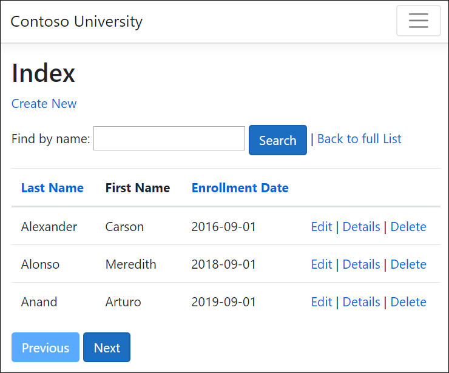
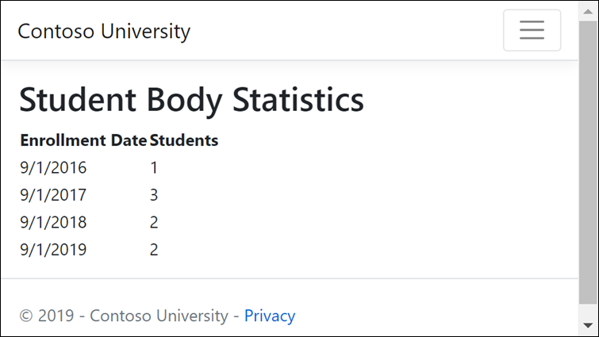
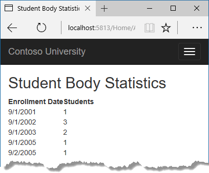

# Part 3, Razor Pages with EF Core in ASP.NET Core - Sort, Filter, Paging

By [Tom Dykstra](https://github.com/tdykstra), [Jeremy Likness](https://twitter.com/jeremylikness), and [Jon P Smith](https://twitter.com/thereformedprog)

[!INCLUDE [about the series](~/includes/RP-EF/intro.md)]

:::moniker range=">= aspnetcore-3.0"

This tutorial adds sorting, filtering, and paging functionality to the Students pages.

The following illustration shows a completed page. The column headings are clickable links to sort the column. Click a column heading repeatedly to switch between ascending and descending sort order.



## Add sorting

Replace the code in `Pages/Students/Index.cshtml.cs` with the following code to add sorting.

[!code-csharp[Main](intro/samples/cu30snapshots/3-sorting/Pages/Students/Index1.cshtml.cs?name=snippet_All)]

The preceding code:

* Requires adding `using System;`.
* Adds properties to contain the sorting parameters.
* Changes the name of the `Student` property to `Students`.
* Replaces the code in the `OnGetAsync` method.

The `OnGetAsync` method receives a `sortOrder` parameter from the query string in the URL. The URL and query string is generated by the [Anchor Tag Helper](xref:mvc/views/tag-helpers/builtin-th/anchor-tag-helper).

The `sortOrder` parameter is either `Name` or `Date`. The `sortOrder` parameter is optionally followed by `_desc` to specify descending order. The default sort order is ascending.

When the Index page is requested from the **Students** link, there's no query string. The students are displayed in ascending order by last name. Ascending order by last name is the `default` in the `switch` statement. When the user clicks a column heading link, the appropriate `sortOrder` value is provided in the query string value.

`NameSort` and `DateSort` are used by the Razor Page to configure the column heading hyperlinks with the appropriate query string values:

[!code-csharp[Main](intro/samples/cu30snapshots/3-sorting/Pages/Students/Index1.cshtml.cs?name=snippet_Ternary)]

The code uses the C# [conditional operator ?:](/dotnet/csharp/language-reference/operators/conditional-operator). The `?:` operator is a ternary operator, it takes three operands. The first line specifies that when `sortOrder` is null or empty, `NameSort` is set to `name_desc`. If `sortOrder` is ***not*** null or empty, `NameSort` is set to an empty string.

These two statements enable the page to set the column heading hyperlinks as follows:

| Current sort order   | Last Name Hyperlink | Date Hyperlink |
|:--------------------:|:-------------------:|:--------------:|
| Last Name ascending  | descending          | ascending      |
| Last Name descending | ascending           | ascending      |
| Date ascending       | ascending           | descending     |
| Date descending      | ascending           | ascending      |

The method uses LINQ to Entities to specify the column to sort by. The code initializes an `IQueryable<Student>` before the switch statement, and modifies it in the switch statement:

[!code-csharp[Main](intro/samples/cu30snapshots/3-sorting/Pages/Students/Index1.cshtml.cs?name=snippet_IQueryable)]

When an `IQueryable` is created or modified, no query is sent to the database. The query isn't executed until the `IQueryable` object is converted into a collection. `IQueryable` are converted to a collection by calling a method such as `ToListAsync`. Therefore, the `IQueryable` code results in a single query that's not executed until the following statement:

[!code-csharp[Main](intro/samples/cu30snapshots/3-sorting/Pages/Students/Index1.cshtml.cs?name=snippet_SortOnlyRtn)]

`OnGetAsync` could get verbose with a large number of sortable columns. For information about an alternative way to code this functionality, see [Use dynamic LINQ to simplify code](xref:data/ef-mvc/advanced#dynamic-linq) in the MVC version of this tutorial series.

### Add column heading hyperlinks to the Student Index page

Replace the code in `Students/Index.cshtml`, with the following code. The changes are highlighted.

[!code-cshtml[Main](intro/samples/cu30snapshots/3-sorting/Pages/Students/Index1.cshtml?highlight=5,8,17-19,22,25-27,33)]

The preceding code:

* Adds hyperlinks to the `LastName` and `EnrollmentDate` column headings.
* Uses the information in `NameSort` and `DateSort` to set up hyperlinks with the current sort order values.
* Changes the page heading from Index to Students.
* Changes `Model.Student` to `Model.Students`.

To verify that sorting works:

* Run the app and select the **Students** tab.
* Click the column headings.

## Add filtering

To add filtering to the Students Index page:

* A text box and a submit button is added to the Razor Page. The text box supplies a search string on the first or last name.
* The page model is updated to use the text box value.

### Update the OnGetAsync method

Replace the code in `Students/Index.cshtml.cs` with the following code to add filtering:

[!code-csharp[Main](intro/samples/cu30snapshots/3-sorting/Pages/Students/Index2.cshtml.cs?name=snippet_All&highlight=17,22,26-30)]

The preceding code:

* Adds the `searchString` parameter to the `OnGetAsync` method, and saves the parameter value in the `CurrentFilter` property. The search string value is received from a text box that's added in the next section.
* Adds to the LINQ statement a `Where` clause. The `Where` clause selects only students whose first name or last name contains the search string. The LINQ statement is executed only if there's a value to search for.

### IQueryable vs. IEnumerable

The code calls the <xref:System.Linq.Queryable.Where%2A> method on an `IQueryable` object, and the filter is processed on the server. In some scenarios, the app might be calling the `Where` method as an extension method on an in-memory collection. For example, suppose `_context.Students` changes from EF Core `DbSet` to a repository method that returns an `IEnumerable` collection. The result would normally be the same but in some cases may be different.

For example, the .NET Framework implementation of `Contains` performs a case-sensitive comparison by default. In SQL Server, `Contains` case-sensitivity is determined by the collation setting of the SQL Server instance. SQL Server defaults to case-insensitive. SQLite defaults to case-sensitive. `ToUpper` could be called to make the test explicitly case-insensitive:

```csharp
Where(s => s.LastName.ToUpper().Contains(searchString.ToUpper())`
```

The preceding code would ensure that the filter is case-insensitive even if the `Where` method is called on an `IEnumerable` or runs on SQLite.

When `Contains` is called on an `IEnumerable` collection, the .NET Core implementation is used. When `Contains` is called on an `IQueryable` object, the database implementation is used.

Calling `Contains` on an `IQueryable` is usually preferable for performance reasons. With `IQueryable`, the filtering is done by the database server. If an `IEnumerable` is created first, all the rows have to be returned from the database server.

There's a performance penalty for calling `ToUpper`. The `ToUpper` code adds a function in the WHERE clause of the TSQL SELECT statement. The added function prevents the optimizer from using an index. Given that SQL is installed as case-insensitive, it's best to avoid the `ToUpper` call when it's not needed.

For more information, see [How to use case-insensitive query with Sqlite provider](https://github.com/aspnet/EntityFrameworkCore/issues/11414).

### Update the Razor page

Replace the code in `Pages/Students/Index.cshtml` to add a **Search** button.

[!code-cshtml[Main](intro/samples/cu30snapshots/3-sorting/Pages/Students/Index2.cshtml?highlight=14-23)]

The preceding code uses the `<form>` [tag helper](xref:mvc/views/tag-helpers/intro) to add the search text box and button. By default, the `<form>` tag helper submits form data with a POST. With POST, the parameters are passed in the HTTP message body and not in the URL. When HTTP GET is used, the form data is passed in the URL as query strings. Passing the data with query strings enables users to bookmark the URL. The [W3C guidelines](https://www.w3.org/2001/tag/doc/whenToUseGet.html) recommend that GET should be used when the action doesn't result in an update.

Test the app:

* Select the **Students** tab and enter a search string. If you're using SQLite, the filter is case-insensitive only if you implemented the optional `ToUpper` code shown earlier.

* Select **Search**.

Notice that the URL contains the search string. For example:

```browser-address-bar
https://localhost:5001/Students?SearchString=an
```

If the page is bookmarked, the bookmark contains the URL to the page and the `SearchString` query string. The `method="get"` in the `form` tag is what caused the query string to be generated.

Currently, when a column heading sort link is selected, the filter value from the **Search** box is lost. The lost filter value is fixed in the next section.

## Add paging

In this section, a `PaginatedList` class is created to support paging. The `PaginatedList` class uses `Skip` and `Take` statements to filter data on the server instead of retrieving all rows of the table. The following illustration shows the paging buttons.


### Create the PaginatedList class

In the project folder, create `PaginatedList.cs` with the following code:

[!code-csharp[Main](intro/samples/cu50/PaginatedList.cs)]

The `CreateAsync` method in the preceding code takes page size and page number and applies the appropriate `Skip` and `Take` statements to the `IQueryable`. When `ToListAsync` is called on the `IQueryable`, it returns a List containing only the requested page. The properties `HasPreviousPage` and `HasNextPage` are used to enable or disable **Previous** and **Next** paging buttons.

The `CreateAsync` method is used to create the `PaginatedList<T>`. A constructor can't create the `PaginatedList<T>` object; constructors can't run asynchronous code.

### Add page size to configuration

Add `PageSize` to the `appsettings.json` [Configuration](xref:fundamentals/configuration/index) file:

[!code-json[Main](intro/samples/cu50/appsettings.json?highlight=2)]

### Add paging to IndexModel

Replace the code in `Students/Index.cshtml.cs` to add paging.

[!code-csharp[Main](intro/samples/cu50/Pages/Students/Index.cshtml.cs?name=snippet_All&highlight=5,15-20,28-43,70-72)]

The preceding code:

* Changes the type of the `Students` property from `IList<Student>` to `PaginatedList<Student>`.
* Adds the page index, the current `sortOrder`, and the `currentFilter` to the `OnGetAsync` method signature.
* Saves the sort order in the `CurrentSort` property.
* Resets page index to 1 when there's a new search string.
* Uses the `PaginatedList` class to get Student entities.
* Sets `pageSize` to 3 from [Configuration](xref:fundamentals/configuration/index), 4 if configuration fails.

All the parameters that `OnGetAsync` receives are null when:

* The page is called from the **Students** link.
* The user hasn't clicked a paging or sorting link.

When a paging link is clicked, the page index variable contains the page number to display.

The `CurrentSort` property provides the Razor Page with the current sort order. The current sort order must be included in the paging links to keep the sort order while paging.

The `CurrentFilter` property provides the Razor Page with the current filter string. The `CurrentFilter` value:

* Must be included in the paging links in order to maintain the filter settings during paging.
* Must be restored to the text box when the page is redisplayed.

If the search string is changed while paging, the page is reset to 1. The page has to be reset to 1 because the new filter can result in different data to display. When a search value is entered and **Submit** is selected:

  * The search string is changed.
  * The `searchString` parameter isn't null.

  The `PaginatedList.CreateAsync` method converts the student query to a single page of students in a collection type that supports paging. That single page of students is passed to the Razor Page.

  The two question marks after `pageIndex` in the `PaginatedList.CreateAsync` call represent the [null-coalescing operator](/dotnet/csharp/language-reference/operators/null-conditional-operator). The null-coalescing operator defines a default value for a nullable type. The expression `pageIndex ?? 1` returns the value of `pageIndex` if it has a value, otherwise, it returns 1.

### Add paging links

Replace the code in `Students/Index.cshtml` with the following code. The changes are highlighted:

[!code-cshtml[Main](intro/samples/cu50/Pages/Students/Index.cshtml?highlight=29-32,38-41,69-87)]

The column header links use the query string to pass the current search string to the `OnGetAsync` method:

[!code-cshtml[Main](intro/samples/cu50/Pages/Students/Index.cshtml?range=29-32)]

The paging buttons are displayed by tag helpers:

[!code-cshtml[Main](intro/samples/cu50/Pages/Students/Index.cshtml?range=73-87)]

Run the app and navigate to the students page.

* To make sure paging works, click the paging links in different sort orders.
* To verify that paging works correctly with sorting and filtering, enter a search string and try paging.


## Grouping

This section creates an `About` page that displays how many students have enrolled for each enrollment date. The update uses grouping and includes the following steps:

* Create a view model for the data used by the `About` page.
* Update the `About` page to use the view model.

### Create the view model

Create a *Models/SchoolViewModels* folder.

Create `SchoolViewModels/EnrollmentDateGroup.cs` with the following code:

[!code-csharp[Main](intro/samples/cu50/Models/SchoolViewModels/EnrollmentDateGroup.cs)]

### Create the Razor Page

Create a `Pages/About.cshtml` file with the following code:

[!code-cshtml[Main](intro/samples/cu50/Pages/About.cshtml)]

### Create the page model

Update the `Pages/About.cshtml.cs` file with the following code:

[!code-csharp[Main](intro/samples/cu50/Pages/About.cshtml.cs)]

The LINQ statement groups the student entities by enrollment date, calculates the number of entities in each group, and stores the results in a collection of `EnrollmentDateGroup` view model objects.

Run the app and navigate to the About page. The count of students for each enrollment date is displayed in a table.



## Next steps

In the next tutorial, the app uses migrations to update the data model.

> [!div class="step-by-step"]
> [Previous tutorial](xref:data/ef-rp/crud)
> [Next tutorial](xref:data/ef-rp/migrations)

:::moniker-end

:::moniker range="< aspnetcore-3.0"

In this tutorial, sorting, filtering, grouping, and paging, functionality is added.

The following illustration shows a completed page. The column headings are clickable links to sort the column. Clicking a column heading repeatedly switches between ascending and descending sort order.


If you run into problems you can't solve, download the [completed app](https://github.com/dotnet/AspNetCore.Docs/tree/main/aspnetcore/data/ef-rp/intro/samples).

## Add sorting to the Index page

Add strings to the `Students/Index.cshtml.cs` `PageModel` to contain the sorting parameters:

[!code-csharp[](intro/samples/cu21/Pages/Students/Index.cshtml.cs?name=snippet1&highlight=10-13)]

Update the `Students/Index.cshtml.cs` `OnGetAsync` with the following code:

[!code-csharp[](intro/samples/cu21/Pages/Students/Index.cshtml.cs?name=snippet_SortOnly)]

The preceding code receives a `sortOrder` parameter from the query string in the URL. The URL (including the query string) is generated by the [Anchor Tag Helper](xref:mvc/views/tag-helpers/builtin-th/anchor-tag-helper
)

The `sortOrder` parameter is either "Name" or "Date." The `sortOrder` parameter is optionally followed by "_desc" to specify descending order. The default sort order is ascending.

When the Index page is requested from the **Students** link, there's no query string. The students are displayed in ascending order by last name. Ascending order by last name is the default (fall-through case) in the `switch` statement. When the user clicks a column heading link, the appropriate `sortOrder` value is provided in the query string value.

`NameSort` and `DateSort` are used by the Razor Page to configure the column heading hyperlinks with the appropriate query string values:

[!code-csharp[](intro/samples/cu21/Pages/Students/Index.cshtml.cs?name=snippet_SortOnly&highlight=3-4)]

The following code contains the C# conditional [?: operator](/dotnet/csharp/language-reference/operators/conditional-operator):

[!code-csharp[](intro/samples/cu21/Pages/Students/Index.cshtml.cs?name=snippet_Ternary)]

The first line specifies that when `sortOrder` is null or empty, `NameSort` is set to "name_desc." If `sortOrder` is **not** null or empty, `NameSort` is set to an empty string.

The `?: operator` is also known as the ternary operator.

These two statements enable the page to set the column heading hyperlinks as follows:

| Current sort order | Last Name Hyperlink | Date Hyperlink |
|:--------------------:|:-------------------:|:--------------:|
| Last Name ascending | descending        | ascending      |
| Last Name descending | ascending           | ascending      |
| Date ascending       | ascending           | descending     |
| Date descending      | ascending           | ascending      |

The method uses LINQ to Entities to specify the column to sort by. The code initializes an `IQueryable<Student>` before the switch statement, and modifies it in the switch statement:

[!code-csharp[](intro/samples/cu21/Pages/Students/Index.cshtml.cs?name=snippet_SortOnly&highlight=6-999)]

 When an`IQueryable` is created or modified, no query is sent to the database. The query isn't executed until the `IQueryable` object is converted into a collection. `IQueryable` are converted to a collection by calling a method such as `ToListAsync`. Therefore, the `IQueryable` code results in a single query that's not executed until the following statement:

[!code-csharp[](intro/samples/cu21/Pages/Students/Index.cshtml.cs?name=snippet_SortOnlyRtn)]

`OnGetAsync` could get verbose with a large number of sortable columns.

### Add column heading hyperlinks to the Student Index page

Replace the code in `Students/Index.cshtml`, with the following highlighted code:

[!code-cshtml[](intro/samples/cu21/Pages/Students/Index2.cshtml?highlight=17-19,25-27)]

The preceding code:

* Adds hyperlinks to the `LastName` and `EnrollmentDate` column headings.
* Uses the information in `NameSort` and `DateSort` to set up hyperlinks with the current sort order values.

To verify that sorting works:

* Run the app and select the **Students** tab.
* Click **Last Name**.
* Click **Enrollment Date**.

To get a better understanding of the code:

* In `Students/Index.cshtml.cs`, set a breakpoint on `switch (sortOrder)`.
* Add a watch for `NameSort` and `DateSort`.
* In `Students/Index.cshtml`, set a breakpoint on `@Html.DisplayNameFor(model => model.Student[0].LastName)`.

Step through the debugger.

## Add a Search Box to the Students Index page

To add filtering to the Students Index page:

* A text box and a submit button is added to the Razor Page. The text box supplies a search string on the first or last name.
* The page model is updated to use the text box value.

### Add filtering functionality to the Index method

Update the `Students/Index.cshtml.cs` `OnGetAsync` with the following code:

[!code-csharp[](intro/samples/cu21/Pages/Students/Index.cshtml.cs?name=snippet_SortFilter&highlight=1,5,9-13)]

The preceding code:

* Adds the `searchString` parameter to the `OnGetAsync` method. The search string value is received from a text box that's added in the next section.
* Added to the LINQ statement a `Where` clause. The `Where` clause selects only students whose first name or last name contains the search string. The LINQ statement is executed only if there's a value to search for.

Note: The preceding code calls the `Where` method on an `IQueryable` object, and the filter is processed on the server. In some scenarios, the app might be calling the `Where` method as an extension method on an in-memory collection. For example, suppose `_context.Students` changes from EF Core `DbSet` to a repository method that returns an `IEnumerable` collection. The result would normally be the same but in some cases may be different.

For example, the .NET Framework implementation of `Contains` performs a case-sensitive comparison by default. In SQL Server, `Contains` case-sensitivity is determined by the collation setting of the SQL Server instance. SQL Server defaults to case-insensitive. `ToUpper` could be called to make the test explicitly case-insensitive:

`Where(s => s.LastName.ToUpper().Contains(searchString.ToUpper())`

The preceding code would ensure that results are case-insensitive if the code changes to use `IEnumerable`. When `Contains` is called on an `IEnumerable` collection, the .NET Core implementation is used. When `Contains` is called on an `IQueryable` object, the database implementation is used. Returning an `IEnumerable` from a repository can have a significant performance penalty:

1. All the rows are returned from the DB server.
1. The filter is applied to all the returned rows in the application.

There's a performance penalty for calling `ToUpper`. The `ToUpper` code adds a function in the WHERE clause of the TSQL SELECT statement. The added function prevents the optimizer from using an index. Given that SQL is installed as case-insensitive, it's best to avoid the `ToUpper` call when it's not needed.

### Add a Search Box to the Student Index page

In `Pages/Students/Index.cshtml`, add the following highlighted code to create a **Search** button and assorted chrome.

[!code-cshtml[](intro/samples/cu21/Pages/Students/Index3.cshtml?highlight=14-23&range=1-25)]

The preceding code uses the `<form>` [tag helper](xref:mvc/views/tag-helpers/intro) to add the search text box and button. By default, the `<form>` tag helper submits form data with a POST. With POST, the parameters are passed in the HTTP message body and not in the URL. When HTTP GET is used, the form data is passed in the URL as query strings. Passing the data with query strings enables users to bookmark the URL. The [W3C guidelines](https://www.w3.org/2001/tag/doc/whenToUseGet.html) recommend that GET should be used when the action doesn't result in an update.

Test the app:

* Select the **Students** tab and enter a search string.
* Select **Search**.

Notice that the URL contains the search string.

```html
http://localhost:5000/Students?SearchString=an
```

If the page is bookmarked, the bookmark contains the URL to the page and the `SearchString` query string. The `method="get"` in the `form` tag is what caused the query string to be generated.

Currently, when a column heading sort link is selected, the filter value from the **Search** box is lost. The lost filter value is fixed in the next section.

## Add paging functionality to the Students Index page

In this section, a `PaginatedList` class is created to support paging. The `PaginatedList` class uses `Skip` and `Take` statements to filter data on the server instead of retrieving all rows of the table. The following illustration shows the paging buttons.


In the project folder, create `PaginatedList.cs` with the following code:

[!code-csharp[](intro/samples/cu21/PaginatedList.cs)]

The `CreateAsync` method in the preceding code takes page size and page number and applies the appropriate `Skip` and `Take` statements to the `IQueryable`. When `ToListAsync` is called on the `IQueryable`, it returns a List containing only the requested page. The properties `HasPreviousPage` and `HasNextPage` are used to enable or disable **Previous** and **Next** paging buttons.

The `CreateAsync` method is used to create the `PaginatedList<T>`. A constructor can't create the `PaginatedList<T>` object, constructors can't run asynchronous code.

## Add paging functionality to the Index method

In `Students/Index.cshtml.cs`, update the type of `Student` from `IList<Student>` to `PaginatedList<Student>`:

[!code-csharp[](intro/samples/cu21/Pages/Students/Index.cshtml.cs?name=snippet_SortFilterPageType)]

Update the `Students/Index.cshtml.cs` `OnGetAsync` with the following code:

[!code-csharp[](intro/samples/cu21/Pages/Students/Index.cshtml.cs?name=snippet_SortFilterPage&highlight=1-4,7-14,41-999)]

The preceding code adds the page index, the current `sortOrder`, and the `currentFilter` to the method signature.

[!code-csharp[](intro/samples/cu21/Pages/Students/Index.cshtml.cs?name=snippet_SortFilterPage2)]

All the parameters are null when:

* The page is called from the **Students** link.
* The user hasn't clicked a paging or sorting link.

When a paging link is clicked, the page index variable contains the page number to display.

`CurrentSort` provides the Razor Page with the current sort order. The current sort order must be included in the paging links to keep the sort order while paging.

`CurrentFilter` provides the Razor Page with the current filter string. The `CurrentFilter` value:

* Must be included in the paging links in order to maintain the filter settings during paging.
* Must be restored to the text box when the page is redisplayed.

If the search string is changed while paging, the page is reset to 1. The page has to be reset to 1 because the new filter can result in different data to display. When a search value is entered and **Submit** is selected:

* The search string is changed.
* The `searchString` parameter isn't null.

[!code-csharp[](intro/samples/cu21/Pages/Students/Index.cshtml.cs?name=snippet_SortFilterPage3)]

The `PaginatedList.CreateAsync` method converts the student query to a single page of students in a collection type that supports paging. That single page of students is passed to the Razor Page.

[!code-csharp[](intro/samples/cu21/Pages/Students/Index.cshtml.cs?name=snippet_SortFilterPage4)]

The two question marks in `PaginatedList.CreateAsync` represent the [null-coalescing operator](/dotnet/csharp/language-reference/operators/null-conditional-operator). The null-coalescing operator defines a default value for a nullable type. The expression `(pageIndex ?? 1)` means return the value of `pageIndex` if it has a value. If `pageIndex` doesn't have a value, return 1.

## Add paging links to the student Razor Page

Update the markup in `Students/Index.cshtml`. The changes are highlighted:

[!code-cshtml[](intro/samples/cu21/Pages/Students/Index.cshtml?highlight=28-31,37-40,68-999)]

The column header links use the query string to pass the current search string to the `OnGetAsync` method so that the user can sort within filter results:

[!code-cshtml[](intro/samples/cu21/Pages/Students/Index.cshtml?range=28-31)]

The paging buttons are displayed by tag helpers:

[!code-cshtml[](intro/samples/cu21/Pages/Students/Index.cshtml?range=72-)]

Run the app and navigate to the students page.

* To make sure paging works, click the paging links in different sort orders.
* To verify that paging works correctly with sorting and filtering, enter a search string and try paging.


To get a better understanding of the code:

* In `Students/Index.cshtml.cs`, set a breakpoint on `switch (sortOrder)`.
* Add a watch for `NameSort`, `DateSort`, `CurrentSort`, and `Model.Student.PageIndex`.
* In `Students/Index.cshtml`, set a breakpoint on `@Html.DisplayNameFor(model => model.Student[0].LastName)`.

Step through the debugger.

## Update the About page to show student statistics

In this step, `Pages/About.cshtml` is updated to display how many students have enrolled for each enrollment date. The update uses grouping and includes the following steps:

* Create a view model for the data used by the **About** Page.
* Update the About page to use the view model.

### Create the view model

Create a *SchoolViewModels* folder in the *Models* folder.

In the *SchoolViewModels* folder, add a `EnrollmentDateGroup.cs` with the following code:

[!code-csharp[](intro/samples/cu21/Models/SchoolViewModels/EnrollmentDateGroup.cs)]

### Update the About page model

The web templates in ASP.NET Core 2.2 do not include the About page. If you are using ASP.NET Core 2.2, create the About Razor Page.

Update the `Pages/About.cshtml.cs` file with the following code:

[!code-csharp[](intro/samples/cu21/Pages/About.cshtml.cs)]

The LINQ statement groups the student entities by enrollment date, calculates the number of entities in each group, and stores the results in a collection of `EnrollmentDateGroup` view model objects.

### Modify the About Razor Page

Replace the code in the `Pages/About.cshtml` file with the following code:

[!code-cshtml[](intro/samples/cu21/Pages/About.cshtml)]

Run the app and navigate to the About page. The count of students for each enrollment date is displayed in a table.

If you run into problems you can't solve, download the [completed app for this stage](https://github.com/dotnet/AspNetCore.Docs/tree/main/aspnetcore/data/ef-rp/intro/samples/cu20snapshots/cu-part3-sorting).



## Additional resources

* [Debugging ASP.NET Core 2.x source](https://github.com/dotnet/AspNetCore.Docs/issues/4155)
* [YouTube version of this tutorial](https://www.youtube.com/watch?v=MDs7PFpoMqI)

In the next tutorial, the app uses migrations to update the data model.

> [!div class="step-by-step"]
> [Previous](xref:data/ef-rp/crud)
> [Next](xref:data/ef-rp/migrations)

:::moniker-end

