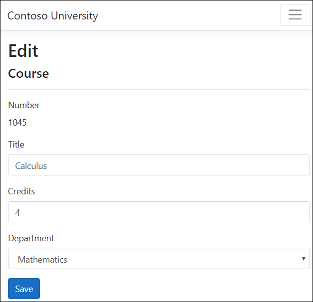
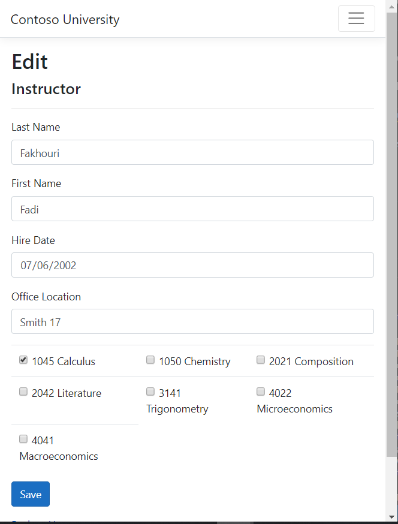
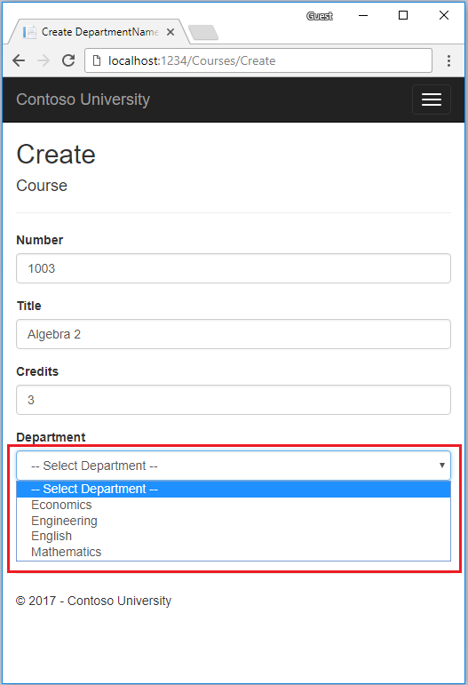

# Part 7, Razor Pages with EF Core in ASP.NET Core - Update Related Data

By [Tom Dykstra](https://github.com/tdykstra), [Jon P Smith](https://twitter.com/thereformedprog), and [Rick Anderson](https://twitter.com/RickAndMSFT)

[!INCLUDE [about the series](../../includes/RP-EF/intro.md)]

:::moniker range=">= aspnetcore-5.0"

This tutorial shows how to update related data. The following illustrations show some of the completed pages.

## Update the Course Create and Edit pages

The scaffolded code for the Course Create and Edit pages has a Department drop-down list that shows `DepartmentID`, an `int`. The drop-down should show the Department name, so both of these pages need a list of department names. To provide that list, use a base class for the Create and Edit pages.

### Create a base class for Course Create and Edit

Create a `Pages/Courses/DepartmentNamePageModel.cs` file with the following code:

[!code-csharp]

The preceding code creates a <xref:Microsoft.AspNetCore.Mvc.Rendering.SelectList> to contain the list of department names. If `selectedDepartment` is specified, that department is selected in the `SelectList`.

The Create and Edit page model classes will derive from `DepartmentNamePageModel`.

### Update the Course Create page model

A Course is assigned to a Department. The base class for the Create and Edit pages provides a `SelectList` for selecting the department. The drop-down list that uses the `SelectList` sets the `Course.DepartmentID` foreign key (FK) property. EF Core uses the `Course.DepartmentID` FK to load the `Department` navigation property.

Update `Pages/Courses/Create.cshtml.cs` with the following code:

[!code-csharp]

[!INCLUDE[loc comments](~/includes/code-comments-loc.md)]

The preceding code:

* Derives from `DepartmentNamePageModel`.
* Uses <xref:Microsoft.AspNetCore.Mvc.ControllerBase.TryUpdateModelAsync%2A> to prevent [overposting](xref:data/ef-rp/crud#overposting).
* Removes `ViewData["DepartmentID"]`. The `DepartmentNameSL` `SelectList` is a strongly typed model and will be used by the Razor page. Strongly typed models are preferred over weakly typed. For more information, see [Weakly typed data (ViewData and ViewBag)](xref:mvc/views/overview#VD_VB).

### Update the Course Create Razor page

Update `Pages/Courses/Create.cshtml` with the following code:

[!code-cshtml]

The preceding code makes the following changes:

* Changes the caption from **DepartmentID** to **Department**.
* Replaces `"ViewBag.DepartmentID"` with `DepartmentNameSL` (from the base class).
* Adds the "Select Department" option. This change renders "Select Department" in the drop-down when no department has been selected yet, rather than the first department.
* Adds a validation message when the department isn't selected.

The Razor Page uses the [Select Tag Helper](xref:mvc/views/working-with-forms#the-select-tag-helper):

[!code-cshtml]

Test the Create page. The Create page displays the department name rather than the department ID.

### Update the Course Edit page model

Update `Pages/Courses/Edit.cshtml.cs` with the following code:

[!code-csharp]

The changes are similar to those made in the Create page model. In the preceding code, `PopulateDepartmentsDropDownList` passes in the department ID, which selects that department in the drop-down list.

### Update the Course Edit Razor page

Update `Pages/Courses/Edit.cshtml` with the following code:

[!code-cshtml]

The preceding code makes the following changes:

* Displays the course ID. Generally the Primary Key (PK) of an entity isn't displayed. PKs are usually meaningless to users. In this case, the PK is the course number.
* Changes the caption for the Department drop-down from **DepartmentID** to **Department**.
* Replaces `"ViewBag.DepartmentID"` with `DepartmentNameSL`, which is in the base class.

The page contains a hidden field (`<input type="hidden">`) for the course number. Adding a `<label>` tag helper with `asp-for="Course.CourseID"` doesn't eliminate the need for the hidden field. `<input type="hidden">` is required for the course number to be included in the posted data when the user selects **Save**.

## Update the Course page models

<xref:Microsoft.EntityFrameworkCore.EntityFrameworkQueryableExtensions.AsNoTracking%2A> can improve performance when tracking isn't required.

Update `Pages/Courses/Delete.cshtml.cs` and `Pages/Courses/Details.cshtml.cs` by adding `AsNoTracking` to the `OnGetAsync` methods:

[!code-csharp]

### Update the Course Razor pages

Update `Pages/Courses/Delete.cshtml` with the following code:

[!code-cshtml]

Make the same changes to the Details page.

[!code-cshtml]

## Test the Course pages

Test the create, edit, details, and delete pages.

## Update the instructor Create and Edit pages

Instructors may teach any number of courses. The following image shows the instructor Edit page with an array of course checkboxes.

The checkboxes enable changes to courses an instructor is assigned to. A checkbox is displayed for every course in the database. Courses that the instructor is assigned to are selected. The user can select or clear checkboxes to change course assignments. If the number of courses were much greater, a different UI might work better. But the method of managing a many-to-many relationship shown here wouldn't change. To create or delete relationships, you manipulate a join entity.

### Create a class for assigned courses data

Create `Models/SchoolViewModels/AssignedCourseData.cs` with the following code:

[!code-csharp]

The `AssignedCourseData` class contains data to create the checkboxes for courses assigned to an instructor.

### Create an Instructor page model base class

Create the `Pages/Instructors/InstructorCoursesPageModel.cs` base class:

[!code-csharp]

The `InstructorCoursesPageModel` is the base class for the Edit and Create page models. `PopulateAssignedCourseData` reads all `Course` entities to populate `AssignedCourseDataList`. For each course, the code sets the `CourseID`, title, and whether or not the instructor is assigned to the course. A [HashSet](xref:System.Collections.Generic.HashSet%601) is used for efficient lookups.

### Handle office location

Another relationship the edit page has to handle is the one-to-zero-or-one relationship that the Instructor entity has with the `OfficeAssignment` entity. The instructor edit code must handle the following scenarios: 

* If the user clears the office assignment, delete the `OfficeAssignment` entity.
* If the user enters an office assignment and it was empty, create a new `OfficeAssignment` entity.
* If the user changes the office assignment, update the `OfficeAssignment` entity.

## Update the Instructor Edit page model

Update `Pages/Instructors/Edit.cshtml.cs` with the following code:

[!code-csharp]

The preceding code:

* Gets the current `Instructor` entity from the database using eager loading for the `OfficeAssignment` and `Courses` navigation properties.
* Updates the retrieved `Instructor` entity with values from the model binder. <xref:Microsoft.AspNetCore.Mvc.ControllerBase.TryUpdateModelAsync%2A> prevents [overposting](xref:data/ef-rp/crud#overposting).
* If the office location is blank, sets `Instructor.OfficeAssignment` to null. When `Instructor.OfficeAssignment` is null, the related row in the `OfficeAssignment` table is deleted.
* Calls `PopulateAssignedCourseData` in `OnGetAsync` to provide information for the checkboxes using the `AssignedCourseData` view model class.
* Calls `UpdateInstructorCourses` in `OnPostAsync` to apply information from the checkboxes to the Instructor entity being edited.
* Calls `PopulateAssignedCourseData` and `UpdateInstructorCourses` in `OnPostAsync` if <xref:Microsoft.AspNetCore.Mvc.ControllerBase.TryUpdateModelAsync%2A> fails. These method calls restore the assigned course data entered on the page when it is redisplayed with an error message.

Since the Razor page doesn't have a collection of Course entities, the model binder can't automatically update the `Courses` navigation property. Instead of using the model binder to update the `Courses` navigation property, that's done in the new `UpdateInstructorCourses` method. Therefore you need to exclude the `Courses` property from model binding. This doesn't require any change to the code that calls <xref:Microsoft.AspNetCore.Mvc.ControllerBase.TryUpdateModelAsync%2A> because you're using the overload with declared properties and `Courses` isn't in the include list.

If no checkboxes were selected, the code in `UpdateInstructorCourses` initializes the `instructorToUpdate.Courses` with an empty collection and returns:

[!code-csharp]

The code then loops through all courses in the database and checks each course against the ones currently assigned to the instructor versus the ones that were selected in the page. To facilitate efficient lookups, the latter two collections are stored in `HashSet` objects.

If the checkbox for a course is selected but the course is ***not*** in the `Instructor.Courses` navigation property, the course is added to the collection in the navigation property.

[!code-csharp]

If the checkbox for a course is ***not*** selected, but the course is in the `Instructor.Courses` navigation property, the course is removed from the navigation property.

[!code-csharp]

### Update the Instructor Edit Razor page

Update `Pages/Instructors/Edit.cshtml` with the following code:

[!code-cshtml]

The preceding code creates an HTML table that has three columns. Each column has a checkbox and a caption containing the course number and title. The checkboxes all have the same name ("selectedCourses"). Using the same name informs the model binder to treat them as a group. The value attribute of each checkbox is set to `CourseID`. When the page is posted, the model binder passes an array that consists of the `CourseID` values for only the checkboxes that are selected.

When the checkboxes are initially rendered, courses assigned to the instructor are selected.

Note: The approach taken here to edit instructor course data works well when there's a limited number of courses. For collections that are much larger, a different UI and a different updating method would be more useable and efficient.

Run the app and test the updated Instructors Edit page. Change some course assignments. The changes are reflected on the Index page.

### Update the Instructor Create page

Update the Instructor Create page model and with code similar to the Edit page:

[!code-csharp]

The preceding code:

  * Adds [logging](xref:fundamentals/logging/index) for warning and error messages.
  * Calls <xref:Microsoft.EntityFrameworkCore.EntityFrameworkQueryableExtensions.Load%2A>, which fetches all the Courses in one database call. For small collections this is an optimization when using <xref:Microsoft.EntityFrameworkCore.DbContext.FindAsync%2A>. `FindAsync` returns the tracked entity without a request to the database.

    [!code-csharp]

  * `_context.Instructors.Add(newInstructor)` creates a new `Instructor` using [many-to-many](/ef/core/modeling/relationships#many-to-many) relationships without explicitly mapping the join table. [Many-to-many was added in EF 5.0](/ef/core/what-is-new/ef-core-5.0/whatsnew).

Test the instructor Create page.

Update the Instructor Create Razor page with code similar to the Edit page:

[!code-cshtml]

## Update the Instructor Delete page

Update `Pages/Instructors/Delete.cshtml.cs` with the following code:

[!code-csharp]

The preceding code makes the following changes:

* Uses eager loading for the `Courses` navigation property. `Courses` must be included or they aren't deleted when the instructor is deleted. To avoid needing to read them, configure cascade delete in the database.

* If the instructor to be deleted is assigned as administrator of any departments, removes the instructor assignment from those departments.

Run the app and test the Delete page.

## Next steps

> [!div class="step-by-step"]
> [Previous tutorial](xref:data/ef-rp/read-related-data)
> [Next tutorial](xref:data/ef-rp/concurrency)

:::moniker-end

:::moniker range=">= aspnetcore-3.0 < aspnetcore-5.0"

This tutorial shows how to update related data. The following illustrations show some of the completed pages.

## Update the Course Create and Edit pages

The scaffolded code for the Course Create and Edit pages has a Department drop-down list that shows Department ID (an integer). The drop-down should show the Department name, so both of these pages need a list of department names. To provide that list, use a base class for the Create and Edit pages.

### Create a base class for Course Create and Edit

Create a `Pages/Courses/DepartmentNamePageModel.cs` file with the following code:

[!code-csharp]

The preceding code creates a <xref:Microsoft.AspNetCore.Mvc.Rendering.SelectList> to contain the list of department names. If `selectedDepartment` is specified, that department is selected in the `SelectList`.

The Create and Edit page model classes will derive from `DepartmentNamePageModel`.

### Update the Course Create page model

A Course is assigned to a Department. The base class for the Create and Edit pages provides a `SelectList` for selecting the department. The drop-down list that uses the `SelectList` sets the `Course.DepartmentID` foreign key (FK) property. EF Core uses the `Course.DepartmentID` FK to load the `Department` navigation property.

Update `Pages/Courses/Create.cshtml.cs` with the following code:

[!code-csharp]

[!INCLUDE[about the series](~/includes/code-comments-loc.md)]

The preceding code:

* Derives from `DepartmentNamePageModel`.
* Uses `TryUpdateModelAsync` to prevent [overposting](xref:data/ef-rp/crud#overposting).
* Removes `ViewData["DepartmentID"]`. `DepartmentNameSL` from the base class is a strongly typed model and will be used by the Razor page. Strongly typed models are preferred over weakly typed. For more information, see [Weakly typed data (ViewData and ViewBag)](xref:mvc/views/overview#VD_VB).

### Update the Course Create Razor page

Update `Pages/Courses/Create.cshtml` with the following code:

[!code-cshtml]

The preceding code makes the following changes:

* Changes the caption from **DepartmentID** to **Department**.
* Replaces `"ViewBag.DepartmentID"` with `DepartmentNameSL` (from the base class).
* Adds the "Select Department" option. This change renders "Select Department" in the drop-down when no department has been selected yet, rather than the first department.
* Adds a validation message when the department isn't selected.

The Razor Page uses the [Select Tag Helper](xref:mvc/views/working-with-forms#the-select-tag-helper):

[!code-cshtml]

Test the Create page. The Create page displays the department name rather than the department ID.

### Update the Course Edit page model

Update `Pages/Courses/Edit.cshtml.cs` with the following code:

[!code-csharp]

The changes are similar to those made in the Create page model. In the preceding code, `PopulateDepartmentsDropDownList` passes in the department ID, which selects that department in the drop-down list.

### Update the Course Edit Razor page

Update `Pages/Courses/Edit.cshtml` with the following code:

[!code-cshtml]

The preceding code makes the following changes:

* Displays the course ID. Generally the Primary Key (PK) of an entity isn't displayed. PKs are usually meaningless to users. In this case, the PK is the course number.
* Changes the caption for the Department drop-down from **DepartmentID** to **Department**.
* Replaces `"ViewBag.DepartmentID"` with `DepartmentNameSL` (from the base class).

The page contains a hidden field (`<input type="hidden">`) for the course number. Adding a `<label>` tag helper with `asp-for="Course.CourseID"` doesn't eliminate the need for the hidden field. `<input type="hidden">` is required for the course number to be included in the posted data when the user clicks **Save**.

## Update the Course Details and Delete pages

<xref:Microsoft.EntityFrameworkCore.EntityFrameworkQueryableExtensions.AsNoTracking%2A> can improve performance when tracking isn't required.

### Update the Course page models

Update `Pages/Courses/Delete.cshtml.cs` with the following code to add `AsNoTracking`:

[!code-csharp]

Make the same change in the `Pages/Courses/Details.cshtml.cs` file:

[!code-csharp]

### Update the Course Razor pages

Update `Pages/Courses/Delete.cshtml` with the following code:

[!code-cshtml]

Make the same changes to the Details page.

[!code-cshtml]

## Test the Course pages

Test the create, edit, details, and delete pages.

## Update the instructor Create and Edit pages

Instructors may teach any number of courses. The following image shows the instructor Edit page with an array of course checkboxes.

The checkboxes enable changes to courses an instructor is assigned to. A checkbox is displayed for every course in the database. Courses that the instructor is assigned to are selected. The user can select or clear checkboxes to change course assignments. If the number of courses were much greater, a different UI might work better. But the method of managing a many-to-many relationship shown here wouldn't change. To create or delete relationships, you manipulate a join entity.

### Create a class for assigned courses data

Create `Models/SchoolViewModels/AssignedCourseData.cs` with the following code:

[!code-csharp]

The `AssignedCourseData` class contains data to create the checkboxes for courses assigned to an instructor.

### Create an Instructor page model base class

Create the `Pages/Instructors/InstructorCoursesPageModel.cs` base class:

[!code-csharp]

The `InstructorCoursesPageModel` is the base class you will use for the Edit and Create page models. `PopulateAssignedCourseData` reads all `Course` entities to populate `AssignedCourseDataList`. For each course, the code sets the `CourseID`, title, and whether or not the instructor is assigned to the course. A [HashSet](xref:System.Collections.Generic.HashSet%601) is used for efficient lookups.

Since the Razor page doesn't have a collection of Course entities, the model binder can't automatically update the `CourseAssignments` navigation property. Instead of using the model binder to update the `CourseAssignments` navigation property, you do that in the new `UpdateInstructorCourses` method. Therefore you need to exclude the `CourseAssignments` property from model binding. This doesn't require any change to the code that calls `TryUpdateModel` because you're using the overload with declared properties and `CourseAssignments` isn't in the include list.

If no checkboxes were selected, the code in `UpdateInstructorCourses` initializes the `CourseAssignments` navigation property with an empty collection and returns:

[!code-csharp]

The code then loops through all courses in the database and checks each course against the ones currently assigned to the instructor versus the ones that were selected in the page. To facilitate efficient lookups, the latter two collections are stored in `HashSet` objects.

If the checkbox for a course was selected but the course isn't in the `Instructor.CourseAssignments` navigation property, the course is added to the collection in the navigation property.

[!code-csharp]

If the checkbox for a course wasn't selected, but the course is in the `Instructor.CourseAssignments` navigation property, the course is removed from the navigation property.

[!code-csharp]

### Handle office location

Another relationship the edit page has to handle is the one-to-zero-or-one relationship that the Instructor entity has with the `OfficeAssignment` entity. The instructor edit code must handle the following scenarios: 

* If the user clears the office assignment, delete the `OfficeAssignment` entity.
* If the user enters an office assignment and it was empty, create a new `OfficeAssignment` entity.
* If the user changes the office assignment, update the `OfficeAssignment` entity.

### Update the Instructor Edit page model

Update `Pages/Instructors/Edit.cshtml.cs` with the following code:

[!code-csharp]

The preceding code:

* Gets the current `Instructor` entity from the database using eager loading for the `OfficeAssignment`, `CourseAssignment`, and `CourseAssignment.Course` navigation properties.
* Updates the retrieved `Instructor` entity with values from the model binder. `TryUpdateModel` prevents [overposting](xref:data/ef-rp/crud#overposting).
* If the office location is blank, sets `Instructor.OfficeAssignment` to null. When `Instructor.OfficeAssignment` is null, the related row in the `OfficeAssignment` table is deleted.
* Calls `PopulateAssignedCourseData` in `OnGetAsync` to provide information for the checkboxes using the `AssignedCourseData` view model class.
* Calls `UpdateInstructorCourses` in `OnPostAsync` to apply information from the checkboxes to the Instructor entity being edited.
* Calls `PopulateAssignedCourseData` and `UpdateInstructorCourses` in `OnPostAsync` if `TryUpdateModel` fails. These method calls restore the assigned course data entered on the page when it is redisplayed with an error message.

### Update the Instructor Edit Razor page

Update `Pages/Instructors/Edit.cshtml` with the following code:

[!code-cshtml]

The preceding code creates an HTML table that has three columns. Each column has a checkbox and a caption containing the course number and title. The checkboxes all have the same name ("selectedCourses"). Using the same name informs the model binder to treat them as a group. The value attribute of each checkbox is set to `CourseID`. When the page is posted, the model binder passes an array that consists of the `CourseID` values for only the checkboxes that are selected.

When the checkboxes are initially rendered, courses assigned to the instructor are selected.

Note: The approach taken here to edit instructor course data works well when there's a limited number of courses. For collections that are much larger, a different UI and a different updating method would be more useable and efficient.

Run the app and test the updated Instructors Edit page. Change some course assignments. The changes are reflected on the Index page.

### Update the Instructor Create page

Update the Instructor Create page model and Razor page with code similar to the Edit page:

[!code-csharp]

[!code-cshtml]

Test the instructor Create page.

## Update the Instructor Delete page

Update `Pages/Instructors/Delete.cshtml.cs` with the following code:

[!code-csharp]

The preceding code makes the following changes:

* Uses eager loading for the `CourseAssignments` navigation property. `CourseAssignments` must be included or they aren't deleted when the instructor is deleted. To avoid needing to read them, configure cascade delete in the database.

* If the instructor to be deleted is assigned as administrator of any departments, removes the instructor assignment from those departments.

Run the app and test the Delete page.

## Next steps

> [!div class="step-by-step"]
> [Previous tutorial](xref:data/ef-rp/read-related-data)
> [Next tutorial](xref:data/ef-rp/concurrency)

:::moniker-end

:::moniker range="< aspnetcore-3.0"

This tutorial demonstrates updating related data. If you run into problems you can't solve, [download or view the completed app.](https://github.com/dotnet/AspNetCore.Docs/tree/main/aspnetcore/data/ef-rp/intro/samples) [Download instructions](xref:index#how-to-download-a-sample).

The following illustrations shows some of the completed pages.

Examine and test the Create and Edit course pages. Create a new course. The department is selected by its primary key (an integer), not its name. Edit the new course. When you have finished testing, delete the new course.

## Create a base class to share common code

The Courses/Create and Courses/Edit pages each need a list of department names. Create the `Pages/Courses/DepartmentNamePageModel.cshtml.cs` base class for the Create and Edit pages:

[!code-csharp]

The preceding code creates a <xref:Microsoft.AspNetCore.Mvc.Rendering.SelectList> to contain the list of department names. If `selectedDepartment` is specified, that department is selected in the `SelectList`.

The Create and Edit page model classes will derive from `DepartmentNamePageModel`.

## Customize the Courses Pages

When a new course entity is created, it must have a relationship to an existing department. To add a department while creating a course, the base class for Create and Edit contains a drop-down list for selecting the department. The drop-down list sets the `Course.DepartmentID` foreign key (FK) property. EF Core uses the `Course.DepartmentID` FK to load the `Department` navigation property.

Update the Create page model with the following code:

[!code-csharp]

The preceding code:

* Derives from `DepartmentNamePageModel`.
* Uses `TryUpdateModelAsync` to prevent [overposting](xref:data/ef-rp/crud#overposting).
* Replaces `ViewData["DepartmentID"]` with `DepartmentNameSL` (from the base class).

`ViewData["DepartmentID"]` is replaced with the strongly typed `DepartmentNameSL`. Strongly typed models are preferred over weakly typed. For more information, see [Weakly typed data (ViewData and ViewBag)](xref:mvc/views/overview#VD_VB).

### Update the Courses Create page

Update `Pages/Courses/Create.cshtml` with the following code:

[!code-cshtml]

The preceding markup makes the following changes:

* Changes the caption from **DepartmentID** to **Department**.
* Replaces `"ViewBag.DepartmentID"` with `DepartmentNameSL` (from the base class).
* Adds the "Select Department" option. This change renders "Select Department" rather than the first department.
* Adds a validation message when the department isn't selected.

The Razor Page uses the [Select Tag Helper](xref:mvc/views/working-with-forms#the-select-tag-helper):

[!code-cshtml]

Test the Create page. The Create page displays the department name rather than the department ID.

### Update the Courses Edit page.

Replace the code in `Pages/Courses/Edit.cshtml.cs` with the following code:

[!code-csharp]

The changes are similar to those made in the Create page model. In the preceding code, `PopulateDepartmentsDropDownList` passes in the department ID, which select the department specified in the drop-down list.

Update `Pages/Courses/Edit.cshtml` with the following markup:

[!code-cshtml]

The preceding markup makes the following changes:

* Displays the course ID. Generally the Primary Key (PK) of an entity isn't displayed. PKs are usually meaningless to users. In this case, the PK is the course number.
* Changes the caption from **DepartmentID** to **Department**.
* Replaces `"ViewBag.DepartmentID"` with `DepartmentNameSL` (from the base class).

The page contains a hidden field (`<input type="hidden">`) for the course number. Adding a `<label>` tag helper with `asp-for="Course.CourseID"` doesn't eliminate the need for the hidden field. `<input type="hidden">` is required for the course number to be included in the posted data when the user clicks **Save**.

Test the updated code. Create, edit, and delete a course.

## Add AsNoTracking to the Details and Delete page models

<xref:Microsoft.EntityFrameworkCore.EntityFrameworkQueryableExtensions.AsNoTracking%2A> can improve performance when tracking isn't required. Add `AsNoTracking` to the Delete and Details page model. The following code shows the updated Delete page model:

[!code-csharp]

Update the `OnGetAsync` method in the `Pages/Courses/Details.cshtml.cs` file:

[!code-csharp]

### Modify the Delete and Details pages

Update the Delete Razor page with the following markup:

[!code-cshtml]

Make the same changes to the Details page.

### Test the Course pages

Test create, edit, details, and delete.

## Update the instructor pages

The following sections update the instructor pages.

### Add office location

When editing an instructor record, you may want to update the instructor's office assignment. The `Instructor` entity has a one-to-zero-or-one relationship with the `OfficeAssignment` entity. The instructor code must handle:

* If the user clears the office assignment, delete the `OfficeAssignment` entity.
* If the user enters an office assignment and it was empty, create a new `OfficeAssignment` entity.
* If the user changes the office assignment, update the `OfficeAssignment` entity.

Update the instructors Edit page model with the following code:

[!code-csharp]

The preceding code:

* Gets the current `Instructor` entity from the database using eager loading for the `OfficeAssignment` navigation property.
* Updates the retrieved `Instructor` entity with values from the model binder. `TryUpdateModel` prevents [overposting](xref:data/ef-rp/crud#overposting).
* If the office location is blank, sets `Instructor.OfficeAssignment` to null. When `Instructor.OfficeAssignment` is null, the related row in the `OfficeAssignment` table is deleted.

### Update the instructor Edit page

Update `Pages/Instructors/Edit.cshtml` with the office location:

[!code-cshtml]

Verify you can change an instructors office location.

## Add Course assignments to the instructor Edit page

Instructors may teach any number of courses. In this section, you add the ability to change course assignments. The following image shows the updated instructor Edit page:

`Course` and `Instructor` has a many-to-many relationship. To add and remove relationships, you add and remove entities from the `CourseAssignments` join entity set.

checkboxes enable changes to courses an instructor is assigned to. A checkbox is displayed for every course in the database. Courses that the instructor is assigned to are checked. The user can select or clear checkboxes to change course assignments. If the number of courses were much greater:

* You'd probably use a different user interface to display the courses.
* The method of manipulating a join entity to create or delete relationships wouldn't change.

### Add classes to support Create and Edit instructor pages

Create `Models/SchoolViewModels/AssignedCourseData.cs` with the following code:

[!code-csharp]

The `AssignedCourseData` class contains data to create the checkboxes for assigned courses by an instructor.

Create the `Pages/Instructors/InstructorCoursesPageModel.cshtml.cs` base class:

[!code-csharp]

The `InstructorCoursesPageModel` is the base class you will use for the Edit and Create page models. `PopulateAssignedCourseData` reads all `Course` entities to populate `AssignedCourseDataList`. For each course, the code sets the `CourseID`, title, and whether or not the instructor is assigned to the course. A [HashSet](xref:System.Collections.Generic.HashSet%601) is used to create efficient lookups.

### Instructors Edit page model

Update the instructor Edit page model with the following code:

[!code-csharp]

The preceding code handles office assignment changes.

Update the instructor Razor View:

[!code-cshtml]

> [!NOTE]
> When you paste the code in Visual Studio, line breaks are changed in a way that breaks the code. Press Ctrl+Z one time to undo the automatic formatting. Ctrl+Z fixes the line breaks so that they look like what you see here. The indentation doesn't have to be perfect, but the `@:</tr><tr>`, `@:<td>`, `@:</td>`, and `@:</tr>` lines must each be on a single line as shown. With the block of new code selected, press Tab three times to line up the new code with the existing code. Vote on or review the status of this bug [with this link](https://developercommunity.visualstudio.com/content/problem/147795/razor-editor-malforms-pasted-markup-and-creates-in.html).

The preceding code creates an HTML table that has three columns. Each column has a checkbox and a caption containing the course number and title. The checkboxes all have the same name ("selectedCourses"). Using the same name informs the model binder to treat them as a group. The value attribute of each checkbox is set to `CourseID`. When the page is posted, the model binder passes an array that consists of the `CourseID` values for only the checkboxes that are selected.

When the checkboxes are initially rendered, courses assigned to the instructor have checked attributes.

Run the app and test the updated instructors Edit page. Change some course assignments. The changes are reflected on the Index page.

Note: The approach taken here to edit instructor course data works well when there's a limited number of courses. For collections that are much larger, a different UI and a different updating method would be more useable and efficient.

### Update the instructors Create page

Update the instructor Create page model with the following code:

[!code-csharp]

The preceding code is similar to the `Pages/Instructors/Edit.cshtml.cs` code.

Update the instructor Create Razor page with the following markup:

[!code-cshtml]

Test the instructor Create page.

## Update the Delete page

Update the Delete page model with the following code:

[!code-csharp]

The preceding code makes the following changes:

* Uses eager loading for the `CourseAssignments` navigation property. `CourseAssignments` must be included or they aren't deleted when the instructor is deleted. To avoid needing to read them, configure cascade delete in the database.

* If the instructor to be deleted is assigned as administrator of any departments, removes the instructor assignment from those departments.

## Additional resources

* [YouTube version of this tutorial (Part 1)](https://www.youtube.com/watch?v=Csh6gkmwc9E)
* [YouTube version of this tutorial (Part 2)](https://www.youtube.com/watch?v=mOAankB_Zgc)

> [!div class="step-by-step"]
> [Previous](xref:data/ef-rp/read-related-data)
> [Next](xref:data/ef-rp/concurrency)

:::moniker-end
