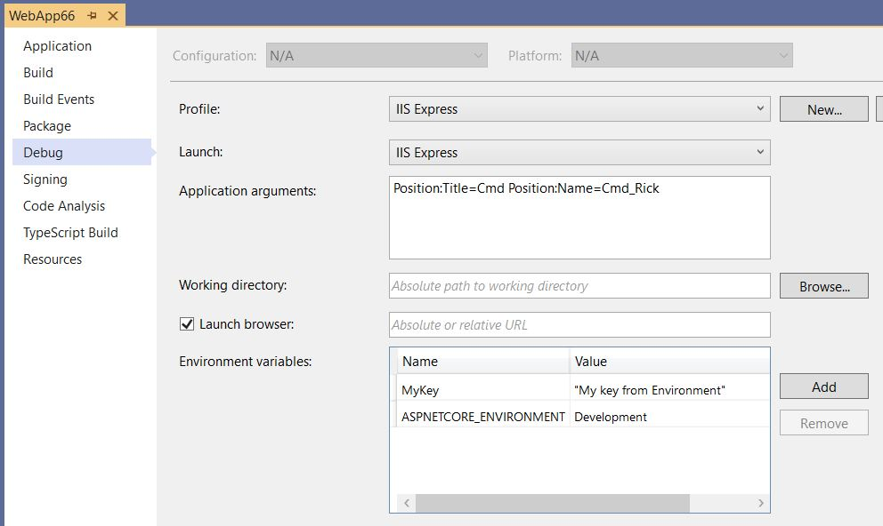
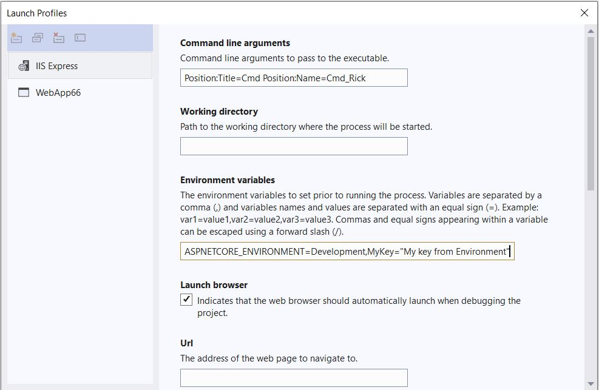

# Configuration in ASP.NET Core

By [Rick Anderson](https://twitter.com/RickAndMSFT) and [Kirk Larkin](https://twitter.com/serpent5)

:::moniker range=">= aspnetcore-6.0"

Application configuration in ASP.NET Core is performed using one or more [configuration providers](#cp). Configuration providers read configuration data from key-value pairs using a variety of configuration sources:

* Settings files, such as `appsettings.json`
* Environment variables
* Azure Key Vault
* Azure App Configuration
* Command-line arguments
* Custom providers, installed or created
* Directory files
* In-memory .NET objects

This article provides information on configuration in ASP.NET Core. For information on using configuration in console apps, see [.NET Configuration](/dotnet/core/extensions/configuration).

## Application and Host Configuration

ASP.NET Core apps configure and launch a *host*. The host is responsible for app startup and lifetime management. The ASP.NET Core templates create a <xref:Microsoft.AspNetCore.Builder.WebApplicationBuilder> which contains the host. While some configuration can be done in both the host and the application configuration providers, generally, only configuration that is necessary for the host should be done in host configuration.

Application configuration is the highest priority and is detailed in the next section. [Host configuration](#host) follows application configuration, and is described in this article.

<a name="default"></a>

### Default application configuration sources

ASP.NET Core web apps created with [dotnet new](/dotnet/core/tools/dotnet-new) or Visual Studio generate the following code:

```csharp
var builder = WebApplication.CreateBuilder(args);
```

<a name="hi2low"></a>

[WebApplication.CreateBuilder](xref:Microsoft.AspNetCore.Builder.WebApplication.CreateBuilder%2A) initializes a new instance of the <xref:Microsoft.AspNetCore.Builder.WebApplicationBuilder> class with preconfigured defaults. The initialized `WebApplicationBuilder` (`builder`) provides default configuration for the app in the following order, from highest to lowest priority:

1. Command-line arguments using the [Command-line configuration provider](#command-line).
1. Non-prefixed environment variables using the [Non-prefixed environment variables configuration provider](#evcp).
1. [User secrets](xref:security/app-secrets) when the app runs in the `Development` environment.
1. `appsettings.{Environment}.json` using the [JSON configuration provider](#file-configuration-provider). For example, `appsettings.Production.json` and `appsettings.Development.json`.
1. [appsettings.json](#appsettingsjson) using the [JSON configuration provider](#file-configuration-provider).
1. A fallback to the host configuration described in the [next section](#host).

<a name="host"></a>

### Default host configuration sources

The following list contains the default host configuration sources from highest to lowest priority:

1. `ASPNETCORE_`-prefixed environment variables using the [Environment variables configuration provider](xref:Microsoft.Extensions.Configuration.EnvironmentVariables.EnvironmentVariablesConfigurationProvider).
1.  Command-line arguments using the [Command-line configuration provider](#command-line)
1. `DOTNET_`-prefixed environment variables using the [Environment variables configuration provider](xref:Microsoft.Extensions.Configuration.EnvironmentVariables.EnvironmentVariablesConfigurationProvider).

When a configuration value is set in host and application configuration, the application configuration is used.

<!--
Remove next paragraph for .NET 7 as it's fixed in .NET 7 see bottom of the GitHub comment listed below.
-->
See [**Explanation** in this GitHub comment](https://github.com/dotnet/AspNetCore.Docs/issues/25626#issuecomment-1098616664) for an explanation of why in host configuration, `ASPNETCORE_` prefixed environment variables have higher priority than command-line arguments.

### Host variables

The following variables are locked in early when initializing the host builders and can't be influenced by application config:

* [Application name](xref:fundamentals/minimal-apis#change-the-content-root-application-name-and-environment)
* [Environment name](xref:fundamentals/environments), for example `Development`, `Production`, and `Staging`
* [Content root](xref:fundamentals/index#content-root)
* [Web root](xref:fundamentals/index#web-root)
* Whether to scan for [hosting startup assemblies](xref:fundamentals/configuration/platform-specific-configuration) and which assemblies to scan for.
* Variables read by app and library code from [HostBuilderContext.Configuration](xref:Microsoft.Extensions.Hosting.HostBuilderContext.Configuration) in [IHostBuilder.ConfigureAppConfiguration](xref:Microsoft.Extensions.Hosting.IHostBuilder.ConfigureAppConfiguration%2A) callbacks.

Every other host setting is read from application config instead of host config.

`URLS` is one of the many common host settings that is not a bootstrap setting. Like every other host setting not in the previous list, `URLS` is read later from application config. Host config is a fallback for application config, so host config can be used to set `URLS`, but it will be overridden by any configuration source in application config like `appsettings.json`.

For more information, see [Change the content root, app name, and environment](xref:migration/50-to-60-samples#change-the-content-root-app-name-and-environment) and [Change the content root, app name, and environment by environment variables or command line](xref:migration/50-to-60-samples#change-the-content-root-app-name-and-environment-by-environment-variables-or-command-line)

The remaining sections in this article refer to application configuration.

## Application configuration providers

The following code displays the enabled configuration providers in the order they were added:

[!code-csharp[](index/samples/6.x/ConfigSample/Pages/Index2.cshtml.cs?name=snippet)]

The preceding [list of highest to lowest priority default configuration sources](#hi2low) shows the providers in the opposite order they are added to template generated application. For example, the [JSON configuration provider](#file-configuration-provider) is added before the [Command-line configuration provider](#command-line).

Configuration providers that are added later have higher priority and override previous key settings. For example, if `MyKey` is set in both `appsettings.json` and the environment, the environment value is used. Using the default configuration providers, the  [Command-line configuration provider](#clcp) overrides all other providers.

For more information on `CreateBuilder`, see [Default builder settings](xref:fundamentals/host/generic-host#default-builder-settings).

### appsettings.json

Consider the following `appsettings.json` file:

[!code-json[](index/samples/6.x/ConfigSample/appsettings.json)]

The following code from the [sample download](https://github.com/dotnet/AspNetCore.Docs/tree/main/aspnetcore/fundamentals/configuration/index/samples/6.x/ConfigSample) displays several of the preceding configurations settings:

[!code-csharp[](index/samples/6.x/ConfigSample/Pages/Test.cshtml.cs?name=snippet)]

The default <xref:Microsoft.Extensions.Configuration.Json.JsonConfigurationProvider> loads configuration in the following order:

1. `appsettings.json`
1. `appsettings.{Environment}.json` : For example, the `appsettings.Production.json` and `appsettings.Development.json` files. The environment version of the file is loaded based on the <xref:Microsoft.Extensions.Hosting.IHostingEnvironment.EnvironmentName%2A?displayProperty=nameWithType>. For more information, see <xref:fundamentals/environments>.

`appsettings.{Environment}.json` values override keys in `appsettings.json`. For example, by default:

* In development, `appsettings.Development.json` configuration overwrites values found in `appsettings.json`.
* In production, `appsettings.Production.json` configuration overwrites values found in `appsettings.json`. For example, when deploying the app to Azure.

If a configuration value must be guaranteed, see [GetValue](#getvalue). The preceding example only reads strings and doesn’t support a default value.

Using the [default](#default) configuration, the `appsettings.json` and `appsettings.{Environment}.json` files are enabled with [reloadOnChange: true](https://github.com/dotnet/extensions/blob/release/3.1/src/Hosting/Hosting/src/Host.cs#L74-L75). Changes made to the `appsettings.json` and `appsettings.{Environment}.json` file ***after*** the app starts are read by the [JSON configuration provider](#jcp).

<a name="optpat"></a>

### Bind hierarchical configuration data using the options pattern

[!INCLUDE[](~/includes/bind6.md)]

Using the [default](#default) configuration, the `appsettings.json` and `appsettings.{Environment}.json` files are enabled with [reloadOnChange: true](https://github.com/dotnet/extensions/blob/release/3.1/src/Hosting/Hosting/src/Host.cs#L74-L75). Changes made to the `appsettings.json` and `appsettings.{Environment}.json` file ***after*** the app starts are read by the [JSON configuration provider](#jcp).

See [JSON configuration provider](#jcp) in this document for information on adding additional JSON configuration files.

## Combining service collection

[!INCLUDE[](~/includes/combine-di6.md)]

<a name="security"></a>

## Security and user secrets

Configuration data guidelines:

* Never store passwords or other sensitive data in configuration provider code or in plain text configuration files. The [Secret Manager](xref:security/app-secrets) tool can be used to store secrets in development.
* Don't use production secrets in development or test environments.
* Specify secrets outside of the project so that they can't be accidentally committed to a source code repository.

By [default](#default), the user secrets configuration source is registered after the JSON configuration sources. Therefore, user secrets keys take precedence over keys in `appsettings.json` and `appsettings.{Environment}.json`.

For more information on storing passwords or other sensitive data:

* <xref:fundamentals/environments>
* <xref:security/app-secrets>: Includes advice on using environment variables to store sensitive data. The Secret Manager tool uses the [File configuration provider](#fcp) to store user secrets in a JSON file on the local system.

[Azure Key Vault](https://azure.microsoft.com/services/key-vault/) safely stores app secrets for ASP.NET Core apps. For more information, see <xref:security/key-vault-configuration>.

<a name="evcp"></a>

## Non-prefixed environment variables

Non-prefixed environment variables are environment variables other than those prefixed by `ASPNETCORE_` or `DOTNET_`. For example, the ASP.NET Core web application templates set `"ASPNETCORE_ENVIRONMENT": "Development"` in `launchSettings.json`. For more information on `ASPNETCORE_` and `DOTNET_` environment variables, see:

* [List of highest to lowest priority default configuration sources](#hi2low) including non-prefixed, `ASPNETCORE_`-prefixed and `DOTNETCORE_`-prefixed environment variables.
* [`DOTNET_` environment variables](/dotnet/core/tools/dotnet-environment-variables) used outside of [Microsoft.Extensions.Hosting](xref:Microsoft.Extensions.Hosting).

Using the [default](#default) configuration, the <xref:Microsoft.Extensions.Configuration.EnvironmentVariables.EnvironmentVariablesConfigurationProvider> loads configuration from environment variable key-value pairs after reading `appsettings.json`, `appsettings.{Environment}.json`, and [user secrets](xref:security/app-secrets). Therefore, key values read from the environment override values read from `appsettings.json`, `appsettings.{Environment}.json`, and user secrets.

[!INCLUDE[](~/includes/environmentVarableColon.md)]

The following `set` commands:

* Set the environment keys and values of the [preceding example](#appsettingsjson) on Windows.
* Test the settings when using the [sample download](https://github.com/dotnet/AspNetCore.Docs/tree/main/aspnetcore/fundamentals/configuration/index/samples/3.x/ConfigSample). The `dotnet run` command must be run in the project directory.

```dotnetcli
set MyKey="My key from Environment"
set Position__Title=Environment_Editor
set Position__Name=Environment_Rick
dotnet run
```

The preceding environment settings:

* Are only set in processes launched from the command window they were set in.
* Won't be read by browsers launched with Visual Studio.

The following [setx](/windows-server/administration/windows-commands/setx) commands can be used to set the environment keys and values on Windows. Unlike `set`, `setx` settings are persisted. `/M` sets the variable in the system environment. If the `/M` switch isn't used, a user environment variable is set.

```console
setx MyKey "My key from setx Environment" /M
setx Position__Title Environment_Editor /M
setx Position__Name Environment_Rick /M
```

To test that the preceding commands override `appsettings.json` and `appsettings.{Environment}.json`:

* With Visual Studio: Exit and restart Visual Studio.
* With the CLI: Start a new command window and enter `dotnet run`.

Call <xref:Microsoft.Extensions.Configuration.EnvironmentVariablesExtensions.AddEnvironmentVariables%2A> with a string to specify a prefix for environment variables:

[!code-csharp[](~/fundamentals/configuration/index/samples/6.x/ConfigSample/Program.cs?name=snippet_env&highlight=5)]

In the preceding code:

* `builder.Configuration.AddEnvironmentVariables(prefix: "MyCustomPrefix_")` is added after the [default configuration providers](#default). For an example of ordering the configuration providers, see [JSON configuration provider](#jcp).
* Environment variables set with the `MyCustomPrefix_` prefix override the [default configuration providers](#default). This includes environment variables without the prefix.

The prefix is stripped off when the configuration key-value pairs are read.

The following commands test the custom prefix:

```dotnetcli
set MyCustomPrefix_MyKey="My key with MyCustomPrefix_ Environment"
set MyCustomPrefix_Position__Title=Editor_with_customPrefix
set MyCustomPrefix_Position__Name=Environment_Rick_cp
dotnet run
```

The [default configuration](#default) loads environment variables and command line arguments prefixed with `DOTNET_` and `ASPNETCORE_`. The `DOTNET_` and `ASPNETCORE_` prefixes are used by ASP.NET Core for [host and app configuration](xref:fundamentals/host/generic-host#host-configuration), but not for user configuration. For more information on host and app configuration, see [.NET Generic Host](xref:fundamentals/host/generic-host).

On [Azure App Service](https://azure.microsoft.com/services/app-service/), select **New application setting** on the **Settings > Configuration** page. Azure App Service application settings are:

* Encrypted at rest and transmitted over an encrypted channel.
* Exposed as environment variables.

For more information, see [Azure Apps: Override app configuration using the Azure Portal](xref:host-and-deploy/azure-apps/index#override-app-configuration-using-the-azure-portal).

See [Connection string prefixes](#constr) for information on Azure database connection strings.

### Naming of environment variables

Environment variable names reflect the structure of an `appsettings.json` file. Each element in the hierarchy is separated by a double underscore (preferable) or a colon. When the element structure includes an array, the array index should be treated as an additional element name in this path. Consider the following `appsettings.json` file and its equivalent values represented as environment variables.

*`appsettings.json`*

```json
{
    "SmtpServer": "smtp.example.com",
    "Logging": [
        {
            "Name": "ToEmail",
            "Level": "Critical",
            "Args": {
                "FromAddress": "MySystem@example.com",
                "ToAddress": "SRE@example.com"
            }
        },
        {
            "Name": "ToConsole",
            "Level": "Information"
        }
    ]
}
```

**environment variables**

```console
setx SmtpServer smtp.example.com
setx Logging__0__Name ToEmail
setx Logging__0__Level Critical
setx Logging__0__Args__FromAddress MySystem@example.com
setx Logging__0__Args__ToAddress SRE@example.com
setx Logging__1__Name ToConsole
setx Logging__1__Level Information
```

### Environment variables set in generated launchSettings.json

Environment variables set in `launchSettings.json` override those set in the system environment. For example, the ASP.NET Core web templates generate a `launchSettings.json` file that sets the endpoint configuration to:

```json
"applicationUrl": "https://localhost:5001;http://localhost:5000"
```

Configuring the `applicationUrl` sets the `ASPNETCORE_URLS` environment variable and overrides values set in the environment.

### Escape environment variables on Linux

On Linux, the value of URL environment variables must be escaped so `systemd` can parse it. Use the linux tool `systemd-escape` which yields `http:--localhost:5001`
 
 ```cmd
 groot@terminus:~$ systemd-escape http://localhost:5001
 http:--localhost:5001
 ```

### Display environment variables

The following code displays the environment variables and values on application startup, which can be helpful when debugging environment settings:

```csharp
var builder = WebApplication.CreateBuilder(args);
var app = builder.Build();

foreach (var c in builder.Configuration.AsEnumerable())
{
    Console.WriteLine(c.Key + " = " + c.Value);
}
```

<a name="clcp"></a>

## Command-line

Using the [default](#default) configuration, the <xref:Microsoft.Extensions.Configuration.CommandLine.CommandLineConfigurationProvider> loads configuration from command-line argument key-value pairs after the following configuration sources:

* `appsettings.json` and `appsettings.{Environment}.json` files.
* [App secrets](xref:security/app-secrets) in the Development environment.
* Environment variables.

By [default](#default), configuration values set on the command-line override configuration values set with all the other configuration providers.

### Command-line arguments

The following command sets keys and values using `=`:

```dotnetcli
dotnet run MyKey="Using =" Position:Title=Cmd Position:Name=Cmd_Rick
```

The following command sets keys and values using `/`:

```dotnetcli
dotnet run /MyKey "Using /" /Position:Title=Cmd /Position:Name=Cmd_Rick
```

The following command sets keys and values using `--`:

```dotnetcli
dotnet run --MyKey "Using --" --Position:Title=Cmd --Position:Name=Cmd_Rick
```

The key value:

* Must follow `=`, or the key must have a prefix of `--` or `/` when the value follows a space.
* Isn't required if `=` is used. For example, `MySetting=`.

Within the same command, don't mix command-line argument key-value pairs that use `=` with key-value pairs that use a space.

### Switch mappings

Switch mappings allow **key** name replacement logic. Provide a dictionary of switch replacements to the <xref:Microsoft.Extensions.Configuration.CommandLineConfigurationExtensions.AddCommandLine%2A> method.

When the switch mappings dictionary is used, the dictionary is checked for a key that matches the key provided by a command-line argument. If the command-line key is found in the dictionary, the dictionary value is passed back to set the key-value pair into the app's configuration. A switch mapping is required for any command-line key prefixed with a single dash (`-`).

Switch mappings dictionary key rules:

* Switches must start with `-` or `--`.
* The switch mappings dictionary must not contain duplicate keys.

To use a switch mappings dictionary, pass it into the call to `AddCommandLine`:

[!code-csharp[](~/fundamentals/configuration/index/samples/6.x/ConfigSample/Program.cs?name=snippet_sw)]

Run the following command works to test key replacement:

```dotnetcli
dotnet run -k1 value1 -k2 value2 --alt3=value2 /alt4=value3 --alt5 value5 /alt6 value6
```

The following code shows the key values for the replaced keys:

[!code-csharp[](index/samples/6.x/ConfigSample/Pages/Test3.cshtml.cs?name=snippet)]

For apps that use switch mappings, the call to `CreateDefaultBuilder` shouldn't pass arguments. The `CreateDefaultBuilder` method's `AddCommandLine` call doesn't include mapped switches, and there's no way to pass the switch-mapping dictionary to `CreateDefaultBuilder`. The solution isn't to pass the arguments to `CreateDefaultBuilder` but instead to allow the `ConfigurationBuilder` method's `AddCommandLine` method to process both the arguments and the switch-mapping dictionary.

## Set environment and command-line arguments with Visual Studio

Environment and command-line arguments can be set in Visual Studio from the launch profiles dialog:

* In Solution Explorer, right click the project and select **Properties**.
* Select the **Debug > General** tab and select **Open debug launch profiles UI**.

## Hierarchical configuration data

The Configuration API reads hierarchical configuration data by flattening the hierarchical data with the use of a delimiter in the configuration keys.

The [sample download](https://github.com/dotnet/AspNetCore.Docs/tree/main/aspnetcore/fundamentals/configuration/index/samples/6.x/ConfigSample) contains the following  `appsettings.json` file:

[!code-json[](index/samples/6.x/ConfigSample/appsettings.json)]

The following code from the [sample download](https://github.com/dotnet/AspNetCore.Docs/tree/main/aspnetcore/fundamentals/configuration/index/samples/6.x/ConfigSample) displays several of the configurations settings:

[!code-csharp[](index/samples/6.x/ConfigSample/Pages/Test.cshtml.cs?name=snippet)]

The preferred way to read hierarchical configuration data is using the options pattern. For more information, see [Bind hierarchical configuration data](#optpat) in this document.

<xref:Microsoft.Extensions.Configuration.ConfigurationSection.GetSection%2A> and <xref:Microsoft.Extensions.Configuration.IConfiguration.GetChildren%2A> methods are available to isolate sections and children of a section in the configuration data. These methods are described later in [GetSection, GetChildren, and Exists](#getsection).

<!--
[Azure Key Vault configuration provider](xref:security/key-vault-configuration) implement change detection.
-->

## Configuration keys and values

Configuration keys:

* Are case-insensitive. For example, `ConnectionString` and `connectionstring` are treated as equivalent keys.
* If a key and value is set in more than one configuration providers, the value from the last provider added is used. For more information, see [Default configuration](#default).
* Hierarchical keys
  * Within the Configuration API, a colon separator (`:`) works on all platforms.
  * In environment variables, a colon separator may not work on all platforms. A double underscore, `__`, is supported by all platforms and is automatically converted into a colon `:`.
  * In Azure Key Vault, hierarchical keys use `--` as a separator. The [Azure Key Vault configuration provider](xref:security/key-vault-configuration) automatically replaces `--` with a `:` when the secrets are loaded into the app's configuration.
* The <xref:Microsoft.Extensions.Configuration.ConfigurationBinder> supports binding arrays to objects using array indices in configuration keys. Array binding is described in the [Bind an array to a class](#boa) section.

Configuration values:

* Are strings.
* Null values can't be stored in configuration or bound to objects.

<a name="cp"></a>

## Configuration providers

The following table shows the configuration providers available to ASP.NET Core apps.

| Provider | Provides configuration from |
| -------- | ----------------------------------- |
| [Azure Key Vault configuration provider](xref:security/key-vault-configuration) | Azure Key Vault |
| [Azure App configuration provider](/azure/azure-app-configuration/quickstart-aspnet-core-app) | Azure App Configuration |
| [Command-line configuration provider](#clcp) | Command-line parameters |
| [Custom configuration provider](#custom-configuration-provider) | Custom source |
| [Environment Variables configuration provider](#evcp) | Environment variables |
| [File configuration provider](#file-configuration-provider) | INI, JSON, and XML files |
| [Key-per-file configuration provider](#key-per-file-configuration-provider) | Directory files |
| [Memory configuration provider](#memory-configuration-provider) | In-memory collections |
| [User secrets](xref:security/app-secrets) | File in the user profile directory |

Configuration sources are read in the order that their configuration providers are specified. Order configuration providers in code to suit the priorities for the underlying configuration sources that the app requires.

A typical sequence of configuration providers is:

1. `appsettings.json`
1. `appsettings.{Environment}.json`
1. [User secrets](xref:security/app-secrets)
1. Environment variables using the [Environment Variables configuration provider](#evcp).
1. Command-line arguments using the [Command-line configuration provider](#clcp).

A common practice is to add the Command-line configuration provider last in a series of providers to allow command-line arguments to override configuration set by the other providers.

The preceding sequence of providers is used in the [default configuration](#default).

<a name="constr"></a>

### Connection string prefixes

The Configuration API has special processing rules for four connection string environment variables. These connection strings are involved in configuring Azure connection strings for the app environment. Environment variables with the prefixes shown in the table are loaded into the app with the [default configuration](#default) or when no prefix is supplied to `AddEnvironmentVariables`.

| Connection string prefix | Provider |
| ------------------------ | -------- |
| `CUSTOMCONNSTR_` | Custom provider |
| `MYSQLCONNSTR_` | [MySQL](https://www.mysql.com/) |
| `SQLAZURECONNSTR_` | [Azure SQL Database](https://azure.microsoft.com/services/sql-database/) |
| `SQLCONNSTR_` | [SQL Server](https://www.microsoft.com/sql-server/) |

When an environment variable is discovered and loaded into configuration with any of the four prefixes shown in the table:

* The configuration key is created by removing the environment variable prefix and adding a configuration key section (`ConnectionStrings`).
* A new configuration key-value pair is created that represents the database connection provider (except for `CUSTOMCONNSTR_`, which has no stated provider).

| Environment variable key | Converted configuration key | Provider configuration entry |
|--|--|--|
| `CUSTOMCONNSTR_{KEY}` | `ConnectionStrings:{KEY}` | Configuration entry not created. |
| `MYSQLCONNSTR_{KEY}` | `ConnectionStrings:{KEY}` | Key: `ConnectionStrings:{KEY}_ProviderName`:<br>Value: `MySql.Data.MySqlClient` |
| `SQLAZURECONNSTR_{KEY}` | `ConnectionStrings:{KEY}` | Key: `ConnectionStrings:{KEY}_ProviderName`:<br>Value: `System.Data.SqlClient` |
| `SQLCONNSTR_{KEY}` | `ConnectionStrings:{KEY}` | Key: `ConnectionStrings:{KEY}_ProviderName`:<br>Value: `System.Data.SqlClient` |

<a name="fcp"></a>

## File configuration provider

<xref:Microsoft.Extensions.Configuration.FileConfigurationProvider> is the base class for loading configuration from the file system. The following configuration providers derive from `FileConfigurationProvider`:

* [INI configuration provider](#ini-configuration-provider)
* [JSON configuration provider](#jcp)
* [XML configuration provider](#xml-configuration-provider)

### INI configuration provider

The <xref:Microsoft.Extensions.Configuration.Ini.IniConfigurationProvider> loads configuration from INI file key-value pairs at runtime.

The following code clears all the configuration providers and adds several configuration providers:
[!code-csharp[](index/samples/6.x/ConfigSample/Program.cs?name=snippet_ini)]

In the preceding code, settings in the `MyIniConfig.ini` and  `MyIniConfig.{Environment}.ini` files are overridden by settings in the:

* [Environment variables configuration provider](#evcp)
* [Command-line configuration provider](#clcp).

The [sample download](https://github.com/dotnet/AspNetCore.Docs/tree/main/aspnetcore/fundamentals/configuration/index/samples/6.x/ConfigSample) contains the following `MyIniConfig.ini` file:

[!code-ini[](index/samples/6.x/ConfigSample/MyIniConfig.ini)]

The following code from the [sample download](https://github.com/dotnet/AspNetCore.Docs/tree/main/aspnetcore/fundamentals/configuration/index/samples/6.x/ConfigSample) displays several of the preceding configurations settings:

[!code-csharp[](index/samples/3.x/ConfigSample/Pages/Test.cshtml.cs?name=snippet)]

<a name="jcp"></a>

### JSON configuration provider

The <xref:Microsoft.Extensions.Configuration.Json.JsonConfigurationProvider> loads configuration from JSON file key-value pairs.

Overloads can specify:

* Whether the file is optional.
* Whether the configuration is reloaded if the file changes.

Consider the following code:

[!code-csharp[](~/fundamentals/configuration/index/samples/6.x/ConfigSample/Program.cs?name=snippet_json)]

The preceding code:

* Configures the JSON configuration provider to load the `MyConfig.json` file with the following options:
  * `optional: true`: The file is optional.
  * `reloadOnChange: true` : The file is reloaded when changes are saved.
* Reads the [default configuration providers](#default) before the `MyConfig.json` file. Settings in the `MyConfig.json` file override setting in the default configuration providers, including the [Environment variables configuration provider](#evcp) and the [Command-line configuration provider](#clcp).

You typically ***don't*** want a custom JSON file overriding values set in the [Environment variables configuration provider](#evcp) and the [Command-line configuration provider](#clcp).
<!-- not needed sample 
The following code clears all the configuration providers and adds several configuration providers:

[!code-csharp[](index/samples/3.x/ConfigSample/ProgramJSON2.cs?name=snippet)]

In the preceding code, settings in the `MyConfig.json` and  *MyConfig*.`Environment`.*json* files:

* Override settings in the `appsettings.json` and `appsettings.{Environment}.json` files.
* Are overridden by settings in the [Environment variables configuration provider](#evcp) and the [Command-line configuration provider](#clcp).

The [sample download](https://github.com/dotnet/AspNetCore.Docs/tree/main/aspnetcore/fundamentals/configuration/index/samples/3.x/ConfigSample) contains the following  `MyConfig.json` file:

[!code-json[](index/samples/3.x/ConfigSample/MyConfig.json)]

The following code from the [sample download](https://github.com/dotnet/AspNetCore.Docs/tree/main/aspnetcore/fundamentals/configuration/index/samples/3.x/ConfigSample) displays several of the preceding configurations settings:

[!code-csharp[](index/samples/3.x/ConfigSample/Pages/Test.cshtml.cs?name=snippet)]

-->

### XML configuration provider

The <xref:Microsoft.Extensions.Configuration.Xml.XmlConfigurationProvider> loads configuration from XML file key-value pairs at runtime.

The following code clears all the configuration providers and adds several configuration providers:

[!code-csharp[](~/fundamentals/configuration/index/samples/6.x/ConfigSample/Program.cs?name=snippet_xml)]

In the preceding code, settings in the `MyXMLFile.xml` and  `MyXMLFile.{Environment}.xml` files are overridden by settings in the:

* [Environment variables configuration provider](#evcp)
* [Command-line configuration provider](#clcp).

The [sample download](https://github.com/dotnet/AspNetCore.Docs/tree/main/aspnetcore/fundamentals/configuration/index/samples/6.x/ConfigSample) contains the following `MyXMLFile.xml` file:

[!code-xml[](index/samples/6.x/ConfigSample/MyXMLFile.xml)]

The following code from the [sample download](https://github.com/dotnet/AspNetCore.Docs/tree/main/aspnetcore/fundamentals/configuration/index/samples/6.x/ConfigSample) displays several of the preceding configurations settings:

[!code-csharp[](index/samples/6.x/ConfigSample/Pages/Test.cshtml.cs?name=snippet)]

Repeating elements that use the same element name work if the `name` attribute is used to distinguish the elements:

[!code-xml[](index/samples/6.x/ConfigSample/MyXMLFile3.xml)]

The following code reads the previous configuration file and displays the keys and values:

[!code-csharp[](index/samples/6.x/ConfigSample/Pages/XML/Index.cshtml.cs?name=snippet)]

Attributes can be used to supply values:

```xml
<?xml version="1.0" encoding="UTF-8"?>
<configuration>
  <key attribute="value" />
  <section>
    <key attribute="value" />
  </section>
</configuration>
```

The previous configuration file loads the following keys with `value`:

* key:attribute
* section:key:attribute

## Key-per-file configuration provider

The <xref:Microsoft.Extensions.Configuration.KeyPerFile.KeyPerFileConfigurationProvider> uses a directory's files as configuration key-value pairs. The key is the file name. The value contains the file's contents. The Key-per-file configuration provider is used in Docker hosting scenarios.

To activate key-per-file configuration, call the <xref:Microsoft.Extensions.Configuration.KeyPerFileConfigurationBuilderExtensions.AddKeyPerFile%2A> extension method on an instance of <xref:Microsoft.Extensions.Configuration.ConfigurationBuilder>. The `directoryPath` to the files must be an absolute path.

Overloads permit specifying:

* An `Action<KeyPerFileConfigurationSource>` delegate that configures the source.
* Whether the directory is optional and the path to the directory.

The double-underscore (`__`) is used as a configuration key delimiter in file names. For example, the file name `Logging__LogLevel__System` produces the configuration key `Logging:LogLevel:System`.

Call `ConfigureAppConfiguration` when building the host to specify the app's configuration:

```csharp
.ConfigureAppConfiguration((hostingContext, config) =>
{
    var path = Path.Combine(
        Directory.GetCurrentDirectory(), "path/to/files");
    config.AddKeyPerFile(directoryPath: path, optional: true);
})
```

<a name="mcp"></a>

## Memory configuration provider

The <xref:Microsoft.Extensions.Configuration.Memory.MemoryConfigurationProvider> uses an in-memory collection as configuration key-value pairs.

The following code adds a memory collection to the configuration system:

[!code-csharp[](~/fundamentals/configuration/index/samples/6.x/ConfigSample/Program.cs?name=snippet_mem)]

The following code from the [sample download](https://github.com/dotnet/AspNetCore.Docs/tree/main/aspnetcore/fundamentals/configuration/index/samples/3.x/ConfigSample) displays the preceding configurations settings:

[!code-csharp[](index/samples/3.x/ConfigSample/Pages/Test.cshtml.cs?name=snippet)]

In the preceding code, `config.AddInMemoryCollection(Dict)` is added after the [default configuration providers](#default). For an example of ordering the configuration providers, see [JSON configuration provider](#jcp).

See [Bind an array](#boa) for another example using `MemoryConfigurationProvider`.

<a name="kestrel"></a>

## Kestrel endpoint configuration

Kestrel specific endpoint configuration overrides all [cross-server](xref:fundamentals/servers/index) endpoint configurations. Cross-server endpoint configurations include:

* [UseUrls](xref:fundamentals/host/web-host#server-urls)
* `--urls` on the [command line](xref:fundamentals/configuration/index#command-line)
* The [environment variable](xref:fundamentals/configuration/index#environment-variables) `ASPNETCORE_URLS`

Consider the following `appsettings.json` file used in an ASP.NET Core web app:

[!code-json[](~/fundamentals/configuration/index/samples_snippets/5.x/appsettings.json?highlight=2-8)]

When the preceding highlighted markup is used in an ASP.NET Core web app ***and*** the app is launched on the command line with the following cross-server endpoint configuration:

`dotnet run --urls="https://localhost:7777"`

Kestrel binds to the endpoint configured specifically for Kestrel in the `appsettings.json` file (`https://localhost:9999`) and not `https://localhost:7777`.

Consider the Kestrel specific endpoint configured as an environment variable:

`set Kestrel__Endpoints__Https__Url=https://localhost:8888`

In the preceding environment variable, `Https` is the name of the Kestrel specific endpoint. The preceding `appsettings.json` file also defines a Kestrel specific endpoint named `Https`. By [default](#default-configuration), environment variables using the [Environment Variables configuration provider](#evcp) are read after `appsettings.{Environment}.json`, therefore, the preceding environment variable is used for the `Https` endpoint.

## GetValue

<xref:Microsoft.Extensions.Configuration.ConfigurationBinder.GetValue%2A?displayProperty=nameWithType> extracts a single value from configuration with a specified key and converts it to the specified type:

[!code-csharp[](index/samples/6.x/ConfigSample/Pages/TestNum.cshtml.cs?name=snippet)]

In the preceding code,  if `NumberKey` isn't found in the configuration, the default value of `99` is used.

## GetSection, GetChildren, and Exists

For the examples that follow, consider the following `MySubsection.json` file:

[!code-json[](index/samples/6.x/ConfigSample/MySubsection.json)]

The following code adds `MySubsection.json` to the configuration providers:

[!code-csharp[](~/fundamentals/configuration/index/samples/6.x/ConfigSample/Program.cs?name=snippet_sub)]

### GetSection

<xref:Microsoft.Extensions.Configuration.IConfiguration.GetSection%2A?displayProperty=nameWithType> returns a configuration subsection with the specified subsection key.

The following code returns values for `section1`:

[!code-csharp[](index/samples/6.x/ConfigSample/Pages/TestSection.cshtml.cs?name=snippet)]

The following code returns values for `section2:subsection0`:

[!code-csharp[](index/samples/6.x/ConfigSample/Pages/TestSection2.cshtml.cs?name=snippet)]

`GetSection` never returns `null`. If a matching section isn't found, an empty `IConfigurationSection` is returned.

When `GetSection` returns a matching section, <xref:Microsoft.Extensions.Configuration.IConfigurationSection.Value> isn't populated. A <xref:Microsoft.Extensions.Configuration.IConfigurationSection.Key> and <xref:Microsoft.Extensions.Configuration.IConfigurationSection.Path> are returned when the section exists.

### GetChildren and Exists

The following code calls <xref:Microsoft.Extensions.Configuration.IConfiguration.GetChildren%2A?displayProperty=nameWithType> and returns values for `section2:subsection0`:

[!code-csharp[](index/samples/6.x/ConfigSample/Pages/TestSection4.cshtml.cs?name=snippet)]

The preceding code calls <xref:Microsoft.Extensions.Configuration.ConfigurationExtensions.Exists%2A?displayProperty=nameWithType> to verify the  section exists:

<a name="boa"></a>

## Bind an array

The <xref:Microsoft.Extensions.Configuration.ConfigurationBinder.Bind%2A?displayProperty=nameWithType> supports binding arrays to objects using array indices in configuration keys. Any array format that exposes a numeric key segment is capable of array binding to a [POCO](https://wikipedia.org/wiki/Plain_Old_CLR_Object) class array.

Consider `MyArray.json` from the [sample download](https://github.com/dotnet/AspNetCore.Docs/tree/main/aspnetcore/fundamentals/configuration/index/samples/6.x/ConfigSample):

[!code-json[](index/samples/6.x/ConfigSample/MyArray.json)]

The following code adds `MyArray.json` to the configuration providers:

[!code-csharp[](~/fundamentals/configuration/index/samples/6.x/ConfigSample/Program.cs?name=snippet_ba)]

The following code reads the configuration and displays the values:

[!code-csharp[](index/samples/6.x/ConfigSample/Pages/Array.cshtml.cs?name=snippet)]

[!code-csharp[](index/samples/6.x/ConfigSample/Options/ArrayExample.cs?name=snippet)]

The preceding code returns the following output:

```text
Index: 0  Value: value00
Index: 1  Value: value10
Index: 2  Value: value20
Index: 3  Value: value40
Index: 4  Value: value50
```

In the preceding output, Index 3 has value `value40`, corresponding to `"4": "value40",` in `MyArray.json`. The bound array indices are continuous and not bound to the configuration key index. The configuration binder isn't capable of binding null values or creating null entries in bound objects.
<!-- Not needed sample 
The  following code loads the `array:entries` configuration with the <xref:Microsoft.Extensions.Configuration.MemoryConfigurationBuilderExtensions.AddInMemoryCollection*> extension method:

[!code-csharp[](index/samples/3.x/ConfigSample/ProgramArray.cs?name=snippet)]

The following code reads the configuration in the `arrayDict` `Dictionary` and displays the values:

[!code-csharp[](index/samples/3.x/ConfigSample/Pages/Array.cshtml.cs?name=snippet)]

The preceding code returns the following output:

```text
Index: 0  Value: value0
Index: 1  Value: value1
Index: 2  Value: value2
Index: 3  Value: value4
Index: 4  Value: value5
```

Index &num;3 in the bound object holds the configuration data for the `array:4` configuration key and its value of `value4`. When configuration data containing an array is bound, the array indices in the configuration keys are used to iterate the configuration data when creating the object. A null value can't be retained in configuration data, and a null-valued entry isn't created in a bound object when an array in configuration keys skip one or more indices.

The missing configuration item for index &num;3 can be supplied before binding to the `ArrayExample` instance by any configuration provider that reads the index &num;3 key/value pair. Consider the following `Value3.json` file from the sample download:

[!code-json[](index/samples/3.x/ConfigSample/Value3.json)]

The following code includes configuration for `Value3.json` and the `arrayDict` `Dictionary`:

[!code-csharp[](index/samples/3.x/ConfigSample/ProgramArray.cs?name=snippet2)]

The following code reads the preceding configuration and displays the values:

[!code-csharp[](index/samples/3.x/ConfigSample/Pages/Array.cshtml.cs?name=snippet)]

The preceding code returns the following output:

```text
Index: 0  Value: value0
Index: 1  Value: value1
Index: 2  Value: value2
Index: 3  Value: value3
Index: 4  Value: value4
Index: 5  Value: value5
```

Custom configuration providers aren't required to implement array binding.
-->

## Custom configuration provider

The sample app demonstrates how to create a basic configuration provider that reads configuration key-value pairs from a database using [Entity Framework (EF)](/ef/core/).

The provider has the following characteristics:

* The EF in-memory database is used for demonstration purposes. To use a database that requires a connection string, implement a secondary `ConfigurationBuilder` to supply the connection string from another configuration provider.
* The provider reads a database table into configuration at startup. The provider doesn't query the database on a per-key basis.
* Reload-on-change isn't implemented, so updating the database after the app starts has no effect on the app's configuration.

Define an `EFConfigurationValue` entity for storing configuration values in the database.

`Models/EFConfigurationValue.cs`:

[!code-csharp[](index/samples/6.x/EfconfigSample/Models/EFConfigurationValue.cs?name=snippet1)]

Add an `EFConfigurationContext` to store and access the configured values.

`EFConfigurationProvider/EFConfigurationContext.cs`:

[!code-csharp[](index/samples/6.x/EfconfigSample/EFConfigurationProvider/EFConfigurationContext.cs?name=snippet1)]

Create a class that implements <xref:Microsoft.Extensions.Configuration.IConfigurationSource>.

`EFConfigurationProvider/EFConfigurationSource.cs`:

[!code-csharp[](index/samples/6.x/EfconfigSample/EFConfigurationProvider/EFConfigurationSource.cs?name=snippet1)]

Create the custom configuration provider by inheriting from <xref:Microsoft.Extensions.Configuration.ConfigurationProvider>. The configuration provider initializes the database when it's empty. Since configuration keys are case-insensitive, the dictionary used to initialize the database is created with the case-insensitive comparer ([StringComparer.OrdinalIgnoreCase](xref:System.StringComparer.OrdinalIgnoreCase)).

`EFConfigurationProvider/EFConfigurationProvider.cs`:

[!code-csharp[](index/samples/6.x/EfconfigSample/EFConfigurationProvider/EFConfigurationProvider.cs?name=snippet1)]

An `AddEFConfiguration` extension method permits adding the configuration source to a `ConfigurationBuilder`.

`Extensions/EntityFrameworkExtensions.cs`:

[!code-csharp[](index/samples/6.x/EfconfigSample/Extensions/EntityFrameworkExtensions.cs?name=snippet1)]

The following code shows how to use the custom `EFConfigurationProvider` in `Program.cs`:

[!code-csharp[](index/samples_snippets/6.x/EfconfigSample/Program.cs?highlight=5-6)]

## Access configuration with Dependency Injection (DI)

Configuration can be injected into services using [Dependency Injection (DI)](xref:fundamentals/dependency-injection) by resolving the <xref:Microsoft.Extensions.Configuration.IConfiguration> service:

[!code-csharp[](index/samples/6.x/ConfigSample/Service.cs?name=snippet_Class&highlight=5-6)]

For information on how to access values using `IConfiguration`, see [GetValue](#getvalue) and [GetSection, GetChildren, and Exists](#getsection-getchildren-and-exists) in this article.

## Access configuration in Razor Pages

The following code displays configuration data in a Razor Page:

[!code-cshtml[](index/samples/6.x/ConfigSample/Pages/Test5.cshtml)]

In the following code, `MyOptions` is added to the service container with <xref:Microsoft.Extensions.DependencyInjection.OptionsConfigurationServiceCollectionExtensions.Configure%2A> and bound to configuration:

[!code-csharp[](~/fundamentals/configuration/options/samples/6.x/OptionsSample/Program.cs?name=snippet)]

The following markup uses the [`@inject`](xref:mvc/views/razor#inject) Razor directive to resolve and display the options values:

[!code-cshtml[](~/fundamentals/configuration/options/samples/6.x/OptionsSample/Pages/Test3.cshtml)]

## Access configuration in a MVC view file

The following code displays configuration data in a MVC view:

[!code-cshtml[](index/samples/3.x/ConfigSample/Views/Home2/Index.cshtml)]

## Configure options with a delegate

Options configured in a delegate override values set in the configuration providers.

In the following code, an <xref:Microsoft.Extensions.Options.IConfigureOptions%601> service is added to the service container. It uses a delegate to configure values for `MyOptions`:

[!code-csharp[](~/fundamentals/configuration/options/samples/6.x/OptionsSample/Program.cs?name=snippet_del)]

The following code displays the options values:

[!code-csharp[](options/samples/6.x/OptionsSample/Pages/Test2.cshtml.cs?name=snippet)]

In the preceding example, the values of `Option1` and `Option2` are specified in `appsettings.json` and then overridden by the configured delegate.

<a name="hvac"></a>

## Host versus app configuration

Before the app is configured and started, a *host* is configured and launched. The host is responsible for app startup and lifetime management. Both the app and the host are configured using the configuration providers described in this topic. Host configuration key-value pairs are also included in the app's configuration. For more information on how the configuration providers are used when the host is built and how configuration sources affect host configuration, see <xref:fundamentals/index#host>.

<a name="dhc"></a>

## Default host configuration

For details on the default configuration when using the [Web Host](xref:fundamentals/host/web-host), see the [ASP.NET Core 2.2 version of this topic](?view=aspnetcore-2.2&preserve-view=true).

* Host configuration is provided from:
  * Environment variables prefixed with `DOTNET_` (for example, `DOTNET_ENVIRONMENT`) using the [Environment Variables configuration provider](#environment-variables). The prefix (`DOTNET_`) is stripped when the configuration key-value pairs are loaded.
  * Command-line arguments using the [Command-line configuration provider](#clcp).
* Web Host default configuration is established (`ConfigureWebHostDefaults`):
  * Kestrel is used as the web server and configured using the app's configuration providers.
  * Add Host Filtering Middleware.
  * Add Forwarded Headers Middleware if the `ASPNETCORE_FORWARDEDHEADERS_ENABLED` environment variable is set to `true`.
  * Enable IIS integration.

## Other configuration

This topic only pertains to *app configuration*. Other aspects of running and hosting ASP.NET Core apps are configured using configuration files not covered in this topic:

* `launch.json`/`launchSettings.json` are tooling configuration files for the Development environment, described:
  * In <xref:fundamentals/environments#development>.
  * Across the documentation set where the files are used to configure ASP.NET Core apps for Development scenarios.
* `web.config` is a server configuration file, described in the following topics:
  * <xref:host-and-deploy/iis/index>
  * <xref:host-and-deploy/aspnet-core-module>

Environment variables set in `launchSettings.json` override those set in the system environment.

For more information on migrating app configuration from earlier versions of ASP.NET, see <xref:migration/proper-to-2x/index#store-configurations>.

## Add configuration from an external assembly

An <xref:Microsoft.AspNetCore.Hosting.IHostingStartup> implementation allows adding enhancements to an app at startup from an external assembly outside of the app's `Startup` class. For more information, see <xref:fundamentals/configuration/platform-specific-configuration>.

## Additional resources

* [Configuration source code](https://github.com/dotnet/runtime/tree/main/src/libraries/Microsoft.Extensions.Configuration)
* [WebApplicationBuilder source code](https://github.com/dotnet/aspnetcore/blob/v6.0.1/src/DefaultBuilder/src/WebApplicationBuilder.cs)
* [View or download sample code](https://github.com/dotnet/AspNetCore.Docs/tree/main/aspnetcore/fundamentals/configuration/index/samples) ([how to download](xref:index#how-to-download-a-sample))
* <xref:fundamentals/configuration/options>
* <xref:blazor/fundamentals/configuration>

:::moniker-end

:::moniker range=">= aspnetcore-3.1 < aspnetcore-6.0"

Configuration in ASP.NET Core is performed using one or more [configuration providers](#cp). Configuration providers read configuration data from key-value pairs using a variety of configuration sources:

* Settings files, such as `appsettings.json`
* Environment variables
* Azure Key Vault
* Azure App Configuration
* Command-line arguments
* Custom providers, installed or created
* Directory files
* In-memory .NET objects

This topic provides information on configuration in ASP.NET Core. For information on using configuration in console apps, see [.NET Configuration](/dotnet/core/extensions/configuration).

[View or download sample code](https://github.com/dotnet/AspNetCore.Docs/tree/main/aspnetcore/fundamentals/configuration/index/samples) ([how to download](xref:index#how-to-download-a-sample))

<a name="default"></a>

## Default configuration

ASP.NET Core web apps created with [dotnet new](/dotnet/core/tools/dotnet-new) or Visual Studio generate the following code:

[!code-csharp[](index/samples/3.x/ConfigSample/Program.cs?name=snippet&highlight=9)]

 <xref:Microsoft.Extensions.Hosting.Host.CreateDefaultBuilder%2A> provides default configuration for the app in the following order:

1. [ChainedConfigurationProvider](xref:Microsoft.Extensions.Configuration.ChainedConfigurationSource) :  Adds an existing `IConfiguration` as a source. In the default configuration case, adds the [host](#hvac) configuration and setting it as the first source for the *app* configuration.
1. [appsettings.json](#appsettingsjson) using the [JSON configuration provider](#file-configuration-provider).
1. `appsettings.{Environment}.json` using the [JSON configuration provider](#file-configuration-provider). For example, `appsettings.Production.json` and `appsettings.Development.json`.
1. [App secrets](xref:security/app-secrets) when the app runs in the `Development` environment.
1. Environment variables using the [Environment Variables configuration provider](#evcp).
1. Command-line arguments using the [Command-line configuration provider](#clcp).

Configuration providers that are added later override previous key settings. For example, if `MyKey` is set in both `appsettings.json` and the environment, the environment value is used. Using the default configuration providers, the  [Command-line configuration provider](#clcp) overrides all other providers.

For more information on `CreateDefaultBuilder`, see [Default builder settings](xref:fundamentals/host/generic-host#default-builder-settings).

The following code displays the enabled configuration providers in the order they were added:

[!code-csharp[](index/samples/3.x/ConfigSample/Pages/Index2.cshtml.cs?name=snippet)]

### appsettings.json

Consider the following `appsettings.json` file:

[!code-json[](index/samples/3.x/ConfigSample/appsettings.json)]

The following code from the [sample download](https://github.com/dotnet/AspNetCore.Docs/tree/main/aspnetcore/fundamentals/configuration/index/samples/3.x/ConfigSample) displays several of the preceding configurations settings:

[!code-csharp[](index/samples/3.x/ConfigSample/Pages/Test.cshtml.cs?name=snippet)]

The default <xref:Microsoft.Extensions.Configuration.Json.JsonConfigurationProvider> loads configuration in the following order:

1. `appsettings.json`
1. `appsettings.{Environment}.json` : For example, the `appsettings.Production.json` and `appsettings.Development.json` files. The environment version of the file is loaded based on the <xref:Microsoft.Extensions.Hosting.IHostingEnvironment.EnvironmentName%2A?displayProperty=nameWithType>. For more information, see <xref:fundamentals/environments>.

`appsettings.{Environment}.json` values override keys in `appsettings.json`. For example, by default:

* In development, `appsettings.Development.json` configuration overwrites values found in `appsettings.json`.
* In production, `appsettings.Production.json` configuration overwrites values found in `appsettings.json`. For example, when deploying the app to Azure.

If a configuration value must be guaranteed, see [GetValue](#getvalue). The preceding example only reads strings and doesn’t support a default value.

Using the [default](#default) configuration, the `appsettings.json` and `appsettings.{Environment}.json` files are enabled with [reloadOnChange: true](https://github.com/dotnet/extensions/blob/release/3.1/src/Hosting/Hosting/src/Host.cs#L74-L75). Changes made to the `appsettings.json` and `appsettings.{Environment}.json` file ***after*** the app starts are read by the [JSON configuration provider](#jcp).

<a name="optpat"></a>

### Bind hierarchical configuration data using the options pattern

[!INCLUDE[](~/includes/bind.md)]

Using the [default](#default) configuration, the `appsettings.json` and `appsettings.{Environment}.json` files are enabled with [reloadOnChange: true](https://github.com/dotnet/extensions/blob/release/3.1/src/Hosting/Hosting/src/Host.cs#L74-L75). Changes made to the `appsettings.json` and `appsettings.{Environment}.json` file ***after*** the app starts are read by the [JSON configuration provider](#jcp).

See [JSON configuration provider](#jcp) in this document for information on adding additional JSON configuration files.

## Combining service collection

[!INCLUDE[](~/includes/combine-di.md)]

<a name="security"></a>

## Security and user secrets

Configuration data guidelines:

* Never store passwords or other sensitive data in configuration provider code or in plain text configuration files. The [Secret Manager](xref:security/app-secrets) tool can be used to store secrets in development.
* Don't use production secrets in development or test environments.
* Specify secrets outside of the project so that they can't be accidentally committed to a source code repository.

By [default](#default), the user secrets configuration source is registered after the JSON configuration sources. Therefore, user secrets keys take precedence over keys in `appsettings.json` and `appsettings.{Environment}.json`.

For more information on storing passwords or other sensitive data:

* <xref:fundamentals/environments>
* <xref:security/app-secrets>: Includes advice on using environment variables to store sensitive data. The Secret Manager tool uses the [File configuration provider](#fcp) to store user secrets in a JSON file on the local system.

[Azure Key Vault](https://azure.microsoft.com/services/key-vault/) safely stores app secrets for ASP.NET Core apps. For more information, see <xref:security/key-vault-configuration>.

<a name="evcp"></a>

## Environment variables

Using the [default](#default) configuration, the <xref:Microsoft.Extensions.Configuration.EnvironmentVariables.EnvironmentVariablesConfigurationProvider> loads configuration from environment variable key-value pairs after reading `appsettings.json`, `appsettings.{Environment}.json`, and [user secrets](xref:security/app-secrets). Therefore, key values read from the environment override values read from `appsettings.json`, `appsettings.{Environment}.json`, and user secrets.

[!INCLUDE[](~/includes/environmentVarableColon.md)]

The following `set` commands:

* Set the environment keys and values of the [preceding example](#appsettingsjson) on Windows.
* Test the settings when using the [sample download](https://github.com/dotnet/AspNetCore.Docs/tree/main/aspnetcore/fundamentals/configuration/index/samples/3.x/ConfigSample). The `dotnet run` command must be run in the project directory.

```dotnetcli
set MyKey="My key from Environment"
set Position__Title=Environment_Editor
set Position__Name=Environment_Rick
dotnet run
```

The preceding environment settings:

* Are only set in processes launched from the command window they were set in.
* Won't be read by browsers launched with Visual Studio.

The following [setx](/windows-server/administration/windows-commands/setx) commands can be used to set the environment keys and values on Windows. Unlike `set`, `setx` settings are persisted. `/M` sets the variable in the system environment. If the `/M` switch isn't used, a user environment variable is set.

```console
setx MyKey "My key from setx Environment" /M
setx Position__Title Environment_Editor /M
setx Position__Name Environment_Rick /M
```

To test that the preceding commands override `appsettings.json` and `appsettings.{Environment}.json`:

* With Visual Studio: Exit and restart Visual Studio.
* With the CLI: Start a new command window and enter `dotnet run`.

Call <xref:Microsoft.Extensions.Configuration.EnvironmentVariablesExtensions.AddEnvironmentVariables%2A> with a string to specify a prefix for environment variables:

[!code-csharp[](~/fundamentals/configuration/index/samples/3.x/ConfigSample/Program.cs?name=snippet4&highlight=12)]

In the preceding code:

* `config.AddEnvironmentVariables(prefix: "MyCustomPrefix_")` is added after the [default configuration providers](#default). For an example of ordering the configuration providers, see [JSON configuration provider](#jcp).
* Environment variables set with the `MyCustomPrefix_` prefix override the [default configuration providers](#default). This includes environment variables without the prefix.

The prefix is stripped off when the configuration key-value pairs are read.

The following commands test the custom prefix:

```dotnetcli
set MyCustomPrefix_MyKey="My key with MyCustomPrefix_ Environment"
set MyCustomPrefix_Position__Title=Editor_with_customPrefix
set MyCustomPrefix_Position__Name=Environment_Rick_cp
dotnet run
```

The [default configuration](#default) loads environment variables and command line arguments prefixed with `DOTNET_` and `ASPNETCORE_`. The `DOTNET_` and `ASPNETCORE_` prefixes are used by ASP.NET Core for [host and app configuration](xref:fundamentals/host/generic-host#host-configuration), but not for user configuration. For more information on host and app configuration, see [.NET Generic Host](xref:fundamentals/host/generic-host).

On [Azure App Service](https://azure.microsoft.com/services/app-service/), select **New application setting** on the **Settings > Configuration** page. Azure App Service application settings are:

* Encrypted at rest and transmitted over an encrypted channel.
* Exposed as environment variables.

For more information, see [Azure Apps: Override app configuration using the Azure Portal](xref:host-and-deploy/azure-apps/index#override-app-configuration-using-the-azure-portal).

See [Connection string prefixes](#constr) for information on Azure database connection strings.

### Naming of environment variables

Environment variable names reflect the structure of an `appsettings.json` file. Each element in the hierarchy is separated by a double underscore (preferable) or a colon. When the element structure includes an array, the array index should be treated as an additional element name in this path. Consider the following `appsettings.json` file and its equivalent values represented as environment variables.

*`appsettings.json`*

```json
{
    "SmtpServer": "smtp.example.com",
    "Logging": [
        {
            "Name": "ToEmail",
            "Level": "Critical",
            "Args": {
                "FromAddress": "MySystem@example.com",
                "ToAddress": "SRE@example.com"
            }
        },
        {
            "Name": "ToConsole",
            "Level": "Information"
        }
    ]
}
```

**environment variables**

```console
setx SmtpServer smtp.example.com
setx Logging__0__Name ToEmail
setx Logging__0__Level Critical
setx Logging__0__Args__FromAddress MySystem@example.com
setx Logging__0__Args__ToAddress SRE@example.com
setx Logging__1__Name ToConsole
setx Logging__1__Level Information
```

### Environment variables set in generated launchSettings.json

Environment variables set in `launchSettings.json` override those set in the system environment. For example, the ASP.NET Core web templates generate a `launchSettings.json` file that sets the endpoint configuration to:

```json
"applicationUrl": "https://localhost:5001;http://localhost:5000"
```

Configuring the `applicationUrl` sets the `ASPNETCORE_URLS` environment variable and overrides values set in the environment.

### Escape environment variables on Linux

On Linux, the value of URL environment variables must be escaped so `systemd` can parse it. Use the linux tool `systemd-escape` which yields `http:--localhost:5001`
 
 ```cmd
 groot@terminus:~$ systemd-escape http://localhost:5001
 http:--localhost:5001
 ```

### Display environment variables

The following code displays the environment variables and values on application startup, which can be helpful when debugging environment settings:

[!code-csharp[](~/fundamentals/configuration/index/samples_snippets/5.x/Program.cs?name=snippet)]

<a name="clcp"></a>

## Command-line

Using the [default](#default) configuration, the <xref:Microsoft.Extensions.Configuration.CommandLine.CommandLineConfigurationProvider> loads configuration from command-line argument key-value pairs after the following configuration sources:

* `appsettings.json` and `appsettings.{Environment}.json` files.
* [App secrets](xref:security/app-secrets) in the Development environment.
* Environment variables.

By [default](#default), configuration values set on the command-line override configuration values set with all the other configuration providers.

### Command-line arguments

The following command sets keys and values using `=`:

```dotnetcli
dotnet run MyKey="Using =" Position:Title=Cmd Position:Name=Cmd_Rick
```

The following command sets keys and values using `/`:

```dotnetcli
dotnet run /MyKey "Using /" /Position:Title=Cmd /Position:Name=Cmd_Rick
```

The following command sets keys and values using `--`:

```dotnetcli
dotnet run --MyKey "Using --" --Position:Title=Cmd --Position:Name=Cmd_Rick
```

The key value:

* Must follow `=`, or the key must have a prefix of `--` or `/` when the value follows a space.
* Isn't required if `=` is used. For example, `MySetting=`.

Within the same command, don't mix command-line argument key-value pairs that use `=` with key-value pairs that use a space.

### Switch mappings

Switch mappings allow **key** name replacement logic. Provide a dictionary of switch replacements to the <xref:Microsoft.Extensions.Configuration.CommandLineConfigurationExtensions.AddCommandLine%2A> method.

When the switch mappings dictionary is used, the dictionary is checked for a key that matches the key provided by a command-line argument. If the command-line key is found in the dictionary, the dictionary value is passed back to set the key-value pair into the app's configuration. A switch mapping is required for any command-line key prefixed with a single dash (`-`).

Switch mappings dictionary key rules:

* Switches must start with `-` or `--`.
* The switch mappings dictionary must not contain duplicate keys.

To use a switch mappings dictionary, pass it into the call to `AddCommandLine`:

[!code-csharp[](index/samples/3.x/ConfigSample/ProgramSwitch.cs?name=snippet&highlight=10-18,23)]

The following code shows the key values for the replaced keys:

[!code-csharp[](index/samples/3.x/ConfigSample/Pages/Test3.cshtml.cs?name=snippet)]

The following command works to test key replacement:

```dotnetcli
dotnet run -k1 value1 -k2 value2 --alt3=value2 /alt4=value3 --alt5 value5 /alt6 value6
```

For apps that use switch mappings, the call to `CreateDefaultBuilder` shouldn't pass arguments. The `CreateDefaultBuilder` method's `AddCommandLine` call doesn't include mapped switches, and there's no way to pass the switch-mapping dictionary to `CreateDefaultBuilder`. The solution isn't to pass the arguments to `CreateDefaultBuilder` but instead to allow the `ConfigurationBuilder` method's `AddCommandLine` method to process both the arguments and the switch-mapping dictionary.

## Set environment and command-line arguments with Visual Studio

The following image shows setting environment and command-line arguments with Visual Studio:



In Visual Studio 2019 version 16.10 preview 4 and later, setting environment and command-line arguments is done from the launch profiles UI:



## Hierarchical configuration data

The Configuration API reads hierarchical configuration data by flattening the hierarchical data with the use of a delimiter in the configuration keys.

The [sample download](https://github.com/dotnet/AspNetCore.Docs/tree/main/aspnetcore/fundamentals/configuration/index/samples/3.x/ConfigSample) contains the following  `appsettings.json` file:

[!code-json[](index/samples/3.x/ConfigSample/appsettings.json)]

The following code from the [sample download](https://github.com/dotnet/AspNetCore.Docs/tree/main/aspnetcore/fundamentals/configuration/index/samples/3.x/ConfigSample) displays several of the configurations settings:

[!code-csharp[](index/samples/3.x/ConfigSample/Pages/Test.cshtml.cs?name=snippet)]

The preferred way to read hierarchical configuration data is using the options pattern. For more information, see [Bind hierarchical configuration data](#optpat) in this document.

<xref:Microsoft.Extensions.Configuration.ConfigurationSection.GetSection%2A> and <xref:Microsoft.Extensions.Configuration.IConfiguration.GetChildren%2A> methods are available to isolate sections and children of a section in the configuration data. These methods are described later in [GetSection, GetChildren, and Exists](#getsection).

<!--
[Azure Key Vault configuration provider](xref:security/key-vault-configuration) implement change detection.
-->

## Configuration keys and values

Configuration keys:

* Are case-insensitive. For example, `ConnectionString` and `connectionstring` are treated as equivalent keys.
* If a key and value is set in more than one configuration providers, the value from the last provider added is used. For more information, see [Default configuration](#default).
* Hierarchical keys
  * Within the Configuration API, a colon separator (`:`) works on all platforms.
  * In environment variables, a colon separator may not work on all platforms. A double underscore, `__`, is supported by all platforms and is automatically converted into a colon `:`.
  * In Azure Key Vault, hierarchical keys use `--` as a separator. The [Azure Key Vault configuration provider](xref:security/key-vault-configuration) automatically replaces `--` with a `:` when the secrets are loaded into the app's configuration.
* The <xref:Microsoft.Extensions.Configuration.ConfigurationBinder> supports binding arrays to objects using array indices in configuration keys. Array binding is described in the [Bind an array to a class](#boa) section.

Configuration values:

* Are strings.
* Null values can't be stored in configuration or bound to objects.

<a name="cp"></a>

## Configuration providers

The following table shows the configuration providers available to ASP.NET Core apps.

| Provider | Provides configuration from |
| -------- | ----------------------------------- |
| [Azure Key Vault configuration provider](xref:security/key-vault-configuration) | Azure Key Vault |
| [Azure App configuration provider](/azure/azure-app-configuration/quickstart-aspnet-core-app) | Azure App Configuration |
| [Command-line configuration provider](#clcp) | Command-line parameters |
| [Custom configuration provider](#custom-configuration-provider) | Custom source |
| [Environment Variables configuration provider](#evcp) | Environment variables |
| [File configuration provider](#file-configuration-provider) | INI, JSON, and XML files |
| [Key-per-file configuration provider](#key-per-file-configuration-provider) | Directory files |
| [Memory configuration provider](#memory-configuration-provider) | In-memory collections |
| [User secrets](xref:security/app-secrets) | File in the user profile directory |

Configuration sources are read in the order that their configuration providers are specified. Order configuration providers in code to suit the priorities for the underlying configuration sources that the app requires.

A typical sequence of configuration providers is:

1. `appsettings.json`
1. `appsettings.{Environment}.json`
1. [User secrets](xref:security/app-secrets)
1. Environment variables using the [Environment Variables configuration provider](#evcp).
1. Command-line arguments using the [Command-line configuration provider](#clcp).

A common practice is to add the Command-line configuration provider last in a series of providers to allow command-line arguments to override configuration set by the other providers.

The preceding sequence of providers is used in the [default configuration](#default).

<a name="constr"></a>

### Connection string prefixes

The Configuration API has special processing rules for four connection string environment variables. These connection strings are involved in configuring Azure connection strings for the app environment. Environment variables with the prefixes shown in the table are loaded into the app with the [default configuration](#default) or when no prefix is supplied to `AddEnvironmentVariables`.

| Connection string prefix | Provider |
| ------------------------ | -------- |
| `CUSTOMCONNSTR_` | Custom provider |
| `MYSQLCONNSTR_` | [MySQL](https://www.mysql.com/) |
| `SQLAZURECONNSTR_` | [Azure SQL Database](https://azure.microsoft.com/services/sql-database/) |
| `SQLCONNSTR_` | [SQL Server](https://www.microsoft.com/sql-server/) |

When an environment variable is discovered and loaded into configuration with any of the four prefixes shown in the table:

* The configuration key is created by removing the environment variable prefix and adding a configuration key section (`ConnectionStrings`).
* A new configuration key-value pair is created that represents the database connection provider (except for `CUSTOMCONNSTR_`, which has no stated provider).

| Environment variable key | Converted configuration key | Provider configuration entry |
|--|--|--|
| `CUSTOMCONNSTR_{KEY}` | `ConnectionStrings:{KEY}` | Configuration entry not created. |
| `MYSQLCONNSTR_{KEY}` | `ConnectionStrings:{KEY}` | Key: `ConnectionStrings:{KEY}_ProviderName`:<br>Value: `MySql.Data.MySqlClient` |
| `SQLAZURECONNSTR_{KEY}` | `ConnectionStrings:{KEY}` | Key: `ConnectionStrings:{KEY}_ProviderName`:<br>Value: `System.Data.SqlClient` |
| `SQLCONNSTR_{KEY}` | `ConnectionStrings:{KEY}` | Key: `ConnectionStrings:{KEY}_ProviderName`:<br>Value: `System.Data.SqlClient` |

<a name="fcp"></a>

## File configuration provider

<xref:Microsoft.Extensions.Configuration.FileConfigurationProvider> is the base class for loading configuration from the file system. The following configuration providers derive from `FileConfigurationProvider`:

* [INI configuration provider](#ini-configuration-provider)
* [JSON configuration provider](#jcp)
* [XML configuration provider](#xml-configuration-provider)

### INI configuration provider

The <xref:Microsoft.Extensions.Configuration.Ini.IniConfigurationProvider> loads configuration from INI file key-value pairs at runtime.

The following code clears all the configuration providers and adds several configuration providers:

[!code-csharp[](index/samples/3.x/ConfigSample/ProgramINI.cs?name=snippet&highlight=10-30)]

In the preceding code, settings in the `MyIniConfig.ini` and  `MyIniConfig.{Environment}.ini` files are overridden by settings in the:

* [Environment variables configuration provider](#evcp)
* [Command-line configuration provider](#clcp).

The [sample download](https://github.com/dotnet/AspNetCore.Docs/tree/main/aspnetcore/fundamentals/configuration/index/samples/3.x/ConfigSample) contains the following `MyIniConfig.ini` file:

[!code-ini[](index/samples/3.x/ConfigSample/MyIniConfig.ini)]

The following code from the [sample download](https://github.com/dotnet/AspNetCore.Docs/tree/main/aspnetcore/fundamentals/configuration/index/samples/3.x/ConfigSample) displays several of the preceding configurations settings:

[!code-csharp[](index/samples/3.x/ConfigSample/Pages/Test.cshtml.cs?name=snippet)]

<a name="jcp"></a>

### JSON configuration provider

The <xref:Microsoft.Extensions.Configuration.Json.JsonConfigurationProvider> loads configuration from JSON file key-value pairs.

Overloads can specify:

* Whether the file is optional.
* Whether the configuration is reloaded if the file changes.

Consider the following code:

[!code-csharp[](index/samples/3.x/ConfigSample/ProgramJSON.cs?name=snippet&highlight=12-14)]

The preceding code:

* Configures the JSON configuration provider to load the `MyConfig.json` file with the following options:
  * `optional: true`: The file is optional.
  * `reloadOnChange: true` : The file is reloaded when changes are saved.
* Reads the [default configuration providers](#default) before the `MyConfig.json` file. Settings in the `MyConfig.json` file override setting in the default configuration providers, including the [Environment variables configuration provider](#evcp) and the [Command-line configuration provider](#clcp).

You typically ***don't*** want a custom JSON file overriding values set in the [Environment variables configuration provider](#evcp) and the [Command-line configuration provider](#clcp).

The following code clears all the configuration providers and adds several configuration providers:

[!code-csharp[](index/samples/3.x/ConfigSample/ProgramJSON2.cs?name=snippet)]

In the preceding code, settings in the `MyConfig.json` and  *MyConfig*.`Environment`.*json* files:

* Override settings in the `appsettings.json` and `appsettings.{Environment}.json` files.
* Are overridden by settings in the [Environment variables configuration provider](#evcp) and the [Command-line configuration provider](#clcp).

The [sample download](https://github.com/dotnet/AspNetCore.Docs/tree/main/aspnetcore/fundamentals/configuration/index/samples/3.x/ConfigSample) contains the following  `MyConfig.json` file:

[!code-json[](index/samples/3.x/ConfigSample/MyConfig.json)]

The following code from the [sample download](https://github.com/dotnet/AspNetCore.Docs/tree/main/aspnetcore/fundamentals/configuration/index/samples/3.x/ConfigSample) displays several of the preceding configurations settings:

[!code-csharp[](index/samples/3.x/ConfigSample/Pages/Test.cshtml.cs?name=snippet)]

### XML configuration provider

The <xref:Microsoft.Extensions.Configuration.Xml.XmlConfigurationProvider> loads configuration from XML file key-value pairs at runtime.

The following code clears all the configuration providers and adds several configuration providers:

[!code-csharp[](index/samples/3.x/ConfigSample/ProgramXML.cs?name=snippet)]

In the preceding code, settings in the `MyXMLFile.xml` and  `MyXMLFile.{Environment}.xml` files are overridden by settings in the:

* [Environment variables configuration provider](#evcp)
* [Command-line configuration provider](#clcp).

The [sample download](https://github.com/dotnet/AspNetCore.Docs/tree/main/aspnetcore/fundamentals/configuration/index/samples/3.x/ConfigSample) contains the following `MyXMLFile.xml` file:

[!code-xml[](index/samples/3.x/ConfigSample/MyXMLFile.xml)]

The following code from the [sample download](https://github.com/dotnet/AspNetCore.Docs/tree/main/aspnetcore/fundamentals/configuration/index/samples/3.x/ConfigSample) displays several of the preceding configurations settings:

[!code-csharp[](index/samples/3.x/ConfigSample/Pages/Test.cshtml.cs?name=snippet)]

Repeating elements that use the same element name work if the `name` attribute is used to distinguish the elements:

[!code-xml[](index/samples/3.x/ConfigSample/MyXMLFile3.xml)]

The following code reads the previous configuration file and displays the keys and values:

[!code-csharp[](index/samples/3.x/ConfigSample/Pages/XML/Index.cshtml.cs?name=snippet)]

Attributes can be used to supply values:

```xml
<?xml version="1.0" encoding="UTF-8"?>
<configuration>
  <key attribute="value" />
  <section>
    <key attribute="value" />
  </section>
</configuration>
```

The previous configuration file loads the following keys with `value`:

* key:attribute
* section:key:attribute

## Key-per-file configuration provider

The <xref:Microsoft.Extensions.Configuration.KeyPerFile.KeyPerFileConfigurationProvider> uses a directory's files as configuration key-value pairs. The key is the file name. The value contains the file's contents. The Key-per-file configuration provider is used in Docker hosting scenarios.

To activate key-per-file configuration, call the <xref:Microsoft.Extensions.Configuration.KeyPerFileConfigurationBuilderExtensions.AddKeyPerFile%2A> extension method on an instance of <xref:Microsoft.Extensions.Configuration.ConfigurationBuilder>. The `directoryPath` to the files must be an absolute path.

Overloads permit specifying:

* An `Action<KeyPerFileConfigurationSource>` delegate that configures the source.
* Whether the directory is optional and the path to the directory.

The double-underscore (`__`) is used as a configuration key delimiter in file names. For example, the file name `Logging__LogLevel__System` produces the configuration key `Logging:LogLevel:System`.

Call `ConfigureAppConfiguration` when building the host to specify the app's configuration:

```csharp
.ConfigureAppConfiguration((hostingContext, config) =>
{
    var path = Path.Combine(
        Directory.GetCurrentDirectory(), "path/to/files");
    config.AddKeyPerFile(directoryPath: path, optional: true);
})
```

<a name="mcp"></a>

## Memory configuration provider

The <xref:Microsoft.Extensions.Configuration.Memory.MemoryConfigurationProvider> uses an in-memory collection as configuration key-value pairs.

The following code adds a memory collection to the configuration system:

[!code-csharp[](index/samples/3.x/ConfigSample/ProgramArray.cs?name=snippet6)]

The following code from the [sample download](https://github.com/dotnet/AspNetCore.Docs/tree/main/aspnetcore/fundamentals/configuration/index/samples/3.x/ConfigSample) displays the preceding configurations settings:

[!code-csharp[](index/samples/3.x/ConfigSample/Pages/Test.cshtml.cs?name=snippet)]

In the preceding code, `config.AddInMemoryCollection(Dict)` is added after the [default configuration providers](#default). For an example of ordering the configuration providers, see [JSON configuration provider](#jcp).

See [Bind an array](#boa) for another example using `MemoryConfigurationProvider`.

:::moniker-end

:::moniker range=">= aspnetcore-5.0 < aspnetcore-6.0"

<a name="kestrel"></a>

## Kestrel endpoint configuration

Kestrel specific endpoint configuration overrides all [cross-server](xref:fundamentals/servers/index) endpoint configurations. Cross-server endpoint configurations include:

* [UseUrls](xref:fundamentals/host/web-host#server-urls)
* `--urls` on the [command line](xref:fundamentals/configuration/index#command-line)
* The [environment variable](xref:fundamentals/configuration/index#environment-variables) `ASPNETCORE_URLS`

Consider the following `appsettings.json` file used in an ASP.NET Core web app:

[!code-json[](~/fundamentals/configuration/index/samples_snippets/5.x/appsettings.json?highlight=2-8)]

When the preceding highlighted markup is used in an ASP.NET Core web app ***and*** the app is launched on the command line with the following cross-server endpoint configuration:

`dotnet run --urls="https://localhost:7777"`

Kestrel binds to the endpoint configured specifically for Kestrel in the `appsettings.json` file (`https://localhost:9999`) and not `https://localhost:7777`.

Consider the Kestrel specific endpoint configured as an environment variable:

`set Kestrel__Endpoints__Https__Url=https://localhost:8888`

In the preceding environment variable, `Https` is the name of the Kestrel specific endpoint. The preceding `appsettings.json` file also defines a Kestrel specific endpoint named `Https`. By [default](#default-configuration), environment variables using the [Environment Variables configuration provider](#evcp) are read after `appsettings.{Environment}.json`, therefore, the preceding environment variable is used for the `Https` endpoint.

:::moniker-end

:::moniker range=">= aspnetcore-3.0 < aspnetcore-6.0"

## GetValue

<xref:Microsoft.Extensions.Configuration.ConfigurationBinder.GetValue%2A?displayProperty=nameWithType> extracts a single value from configuration with a specified key and converts it to the specified type. This method is an extension method for <xref:Microsoft.Extensions.Configuration.IConfiguration>:

[!code-csharp[](index/samples/3.x/ConfigSample/Pages/TestNum.cshtml.cs?name=snippet)]

In the preceding code,  if `NumberKey` isn't found in the configuration, the default value of `99` is used.

## GetSection, GetChildren, and Exists

For the examples that follow, consider the following `MySubsection.json` file:

[!code-json[](index/samples/3.x/ConfigSample/MySubsection.json)]

The following code adds `MySubsection.json` to the configuration providers:

[!code-csharp[](index/samples/3.x/ConfigSample/ProgramJSONsection.cs?name=snippet)]

### GetSection

<xref:Microsoft.Extensions.Configuration.IConfiguration.GetSection%2A?displayProperty=nameWithType> returns a configuration subsection with the specified subsection key.

The following code returns values for `section1`:

[!code-csharp[](index/samples/3.x/ConfigSample/Pages/TestSection.cshtml.cs?name=snippet)]

The following code returns values for `section2:subsection0`:

[!code-csharp[](index/samples/3.x/ConfigSample/Pages/TestSection2.cshtml.cs?name=snippet)]

`GetSection` never returns `null`. If a matching section isn't found, an empty `IConfigurationSection` is returned.

When `GetSection` returns a matching section, <xref:Microsoft.Extensions.Configuration.IConfigurationSection.Value> isn't populated. A <xref:Microsoft.Extensions.Configuration.IConfigurationSection.Key> and <xref:Microsoft.Extensions.Configuration.IConfigurationSection.Path> are returned when the section exists.

### GetChildren and Exists

The following code calls <xref:Microsoft.Extensions.Configuration.IConfiguration.GetChildren%2A?displayProperty=nameWithType> and returns values for `section2:subsection0`:

[!code-csharp[](index/samples/3.x/ConfigSample/Pages/TestSection4.cshtml.cs?name=snippet)]

The preceding code calls <xref:Microsoft.Extensions.Configuration.ConfigurationExtensions.Exists%2A?displayProperty=nameWithType> to verify the  section exists:

 <a name="boa"></a>

## Bind an array

The <xref:Microsoft.Extensions.Configuration.ConfigurationBinder.Bind%2A?displayProperty=nameWithType> supports binding arrays to objects using array indices in configuration keys. Any array format that exposes a numeric key segment is capable of array binding to a [POCO](https://wikipedia.org/wiki/Plain_Old_CLR_Object) class array.

Consider `MyArray.json` from the [sample download](https://github.com/dotnet/AspNetCore.Docs/tree/main/aspnetcore/fundamentals/configuration/index/samples/3.x/ConfigSample):

[!code-json[](index/samples/3.x/ConfigSample/MyArray.json)]

The following code adds `MyArray.json` to the configuration providers:

[!code-csharp[](index/samples/3.x/ConfigSample/ProgramJSONarray.cs?name=snippet)]

The following code reads the configuration and displays the values:

[!code-csharp[](index/samples/3.x/ConfigSample/Pages/Array.cshtml.cs?name=snippet)]

The preceding code returns the following output:

```text
Index: 0  Value: value00
Index: 1  Value: value10
Index: 2  Value: value20
Index: 3  Value: value40
Index: 4  Value: value50
```

In the preceding output, Index 3 has value `value40`, corresponding to `"4": "value40",` in `MyArray.json`. The bound array indices are continuous and not bound to the configuration key index. The configuration binder isn't capable of binding null values or creating null entries in bound objects

The  following code loads the `array:entries` configuration with the <xref:Microsoft.Extensions.Configuration.MemoryConfigurationBuilderExtensions.AddInMemoryCollection%2A> extension method:

[!code-csharp[](index/samples/3.x/ConfigSample/ProgramArray.cs?name=snippet)]

The following code reads the configuration in the `arrayDict` `Dictionary` and displays the values:

[!code-csharp[](index/samples/3.x/ConfigSample/Pages/Array.cshtml.cs?name=snippet)]

The preceding code returns the following output:

```text
Index: 0  Value: value0
Index: 1  Value: value1
Index: 2  Value: value2
Index: 3  Value: value4
Index: 4  Value: value5
```

Index &num;3 in the bound object holds the configuration data for the `array:4` configuration key and its value of `value4`. When configuration data containing an array is bound, the array indices in the configuration keys are used to iterate the configuration data when creating the object. A null value can't be retained in configuration data, and a null-valued entry isn't created in a bound object when an array in configuration keys skip one or more indices.

The missing configuration item for index &num;3 can be supplied before binding to the `ArrayExample` instance by any configuration provider that reads the index &num;3 key/value pair. Consider the following `Value3.json` file from the sample download:

[!code-json[](index/samples/3.x/ConfigSample/Value3.json)]

The following code includes configuration for `Value3.json` and the `arrayDict` `Dictionary`:

[!code-csharp[](index/samples/3.x/ConfigSample/ProgramArray.cs?name=snippet2)]

The following code reads the preceding configuration and displays the values:

[!code-csharp[](index/samples/3.x/ConfigSample/Pages/Array.cshtml.cs?name=snippet)]

The preceding code returns the following output:

```text
Index: 0  Value: value0
Index: 1  Value: value1
Index: 2  Value: value2
Index: 3  Value: value3
Index: 4  Value: value4
Index: 5  Value: value5
```

Custom configuration providers aren't required to implement array binding.

## Custom configuration provider

The sample app demonstrates how to create a basic configuration provider that reads configuration key-value pairs from a database using [Entity Framework (EF)](/ef/core/).

The provider has the following characteristics:

* The EF in-memory database is used for demonstration purposes. To use a database that requires a connection string, implement a secondary `ConfigurationBuilder` to supply the connection string from another configuration provider.
* The provider reads a database table into configuration at startup. The provider doesn't query the database on a per-key basis.
* Reload-on-change isn't implemented, so updating the database after the app starts has no effect on the app's configuration.

Define an `EFConfigurationValue` entity for storing configuration values in the database.

`Models/EFConfigurationValue.cs`:

[!code-csharp[](index/samples/3.x/ConfigurationSample/Models/EFConfigurationValue.cs?name=snippet1)]

Add an `EFConfigurationContext` to store and access the configured values.

`EFConfigurationProvider/EFConfigurationContext.cs`:

[!code-csharp[](index/samples/3.x/ConfigurationSample/EFConfigurationProvider/EFConfigurationContext.cs?name=snippet1)]

Create a class that implements <xref:Microsoft.Extensions.Configuration.IConfigurationSource>.

`EFConfigurationProvider/EFConfigurationSource.cs`:

[!code-csharp[](index/samples/3.x/ConfigurationSample/EFConfigurationProvider/EFConfigurationSource.cs?name=snippet1)]

Create the custom configuration provider by inheriting from <xref:Microsoft.Extensions.Configuration.ConfigurationProvider>. The configuration provider initializes the database when it's empty. Since configuration keys are case-insensitive, the dictionary used to initialize the database is created with the case-insensitive comparer ([StringComparer.OrdinalIgnoreCase](xref:System.StringComparer.OrdinalIgnoreCase)).

`EFConfigurationProvider/EFConfigurationProvider.cs`:

[!code-csharp[](index/samples/3.x/ConfigurationSample/EFConfigurationProvider/EFConfigurationProvider.cs?name=snippet1)]

An `AddEFConfiguration` extension method permits adding the configuration source to a `ConfigurationBuilder`.

`Extensions/EntityFrameworkExtensions.cs`:

[!code-csharp[](index/samples/3.x/ConfigurationSample/Extensions/EntityFrameworkExtensions.cs?name=snippet1)]

The following code shows how to use the custom `EFConfigurationProvider` in `Program.cs`:

[!code-csharp[](index/samples_snippets/3.x/ConfigurationSample/Program.cs?highlight=7-8)]

<a name="acs"></a>

## Access configuration in Startup

The following code displays configuration data in `Startup` methods:

[!code-csharp[](index/samples/3.x/ConfigSample/StartupKey.cs?name=snippet&highlight=13,18)]

For an example of accessing configuration using startup convenience methods, see [App startup: Convenience methods](xref:fundamentals/startup#convenience-methods).

## Access configuration in Razor Pages

The following code displays configuration data in a Razor Page:

[!code-cshtml[](index/samples/3.x/ConfigSample/Pages/Test5.cshtml)]

In the following code, `MyOptions` is added to the service container with <xref:Microsoft.Extensions.DependencyInjection.OptionsConfigurationServiceCollectionExtensions.Configure%2A> and bound to configuration:

[!code-csharp[](~/fundamentals/configuration/options/samples/3.x/OptionsSample/Startup3.cs?name=snippet_Example2)]

The following markup uses the [`@inject`](xref:mvc/views/razor#inject) Razor directive to resolve and display the options values:

[!code-cshtml[](~/fundamentals/configuration/options/samples/3.x/OptionsSample/Pages/Test3.cshtml)]

## Access configuration in a MVC view file

The following code displays configuration data in a MVC view:

[!code-cshtml[](index/samples/3.x/ConfigSample/Views/Home2/Index.cshtml)]

## Configure options with a delegate

Options configured in a delegate override values set in the configuration providers.

Configuring options with a delegate is demonstrated as Example 2 in the sample app.

In the following code, an <xref:Microsoft.Extensions.Options.IConfigureOptions%601> service is added to the service container. It uses a delegate to configure values for `MyOptions`:

[!code-csharp[](~/fundamentals/configuration/options/samples/3.x/OptionsSample/Startup2.cs?name=snippet_Example2)]

The following code displays the options values:

[!code-csharp[](options/samples/3.x/OptionsSample/Pages/Test2.cshtml.cs?name=snippet)]

In the preceding example, the values of `Option1` and `Option2` are specified in `appsettings.json` and then overridden by the configured delegate.

<a name="hvac"></a>

## Host versus app configuration

Before the app is configured and started, a *host* is configured and launched. The host is responsible for app startup and lifetime management. Both the app and the host are configured using the configuration providers described in this topic. Host configuration key-value pairs are also included in the app's configuration. For more information on how the configuration providers are used when the host is built and how configuration sources affect host configuration, see <xref:fundamentals/index#host>.

<a name="dhc"></a>

## Default host configuration

For details on the default configuration when using the [Web Host](xref:fundamentals/host/web-host), see the [ASP.NET Core 2.2 version of this topic](?view=aspnetcore-2.2&preserve-view=true).

* Host configuration is provided from:
  * Environment variables prefixed with `DOTNET_` (for example, `DOTNET_ENVIRONMENT`) using the [Environment Variables configuration provider](#environment-variables). The prefix (`DOTNET_`) is stripped when the configuration key-value pairs are loaded.
  * Command-line arguments using the Command-line configuration provider.
* Web Host default configuration is established (`ConfigureWebHostDefaults`):
  * Kestrel is used as the web server and configured using the app's configuration providers.
  * Add Host Filtering Middleware.
  * Add Forwarded Headers Middleware if the `ASPNETCORE_FORWARDEDHEADERS_ENABLED` environment variable is set to `true`.
  * Enable IIS integration.

## Other configuration

This topic only pertains to *app configuration*. Other aspects of running and hosting ASP.NET Core apps are configured using configuration files not covered in this topic:

* `launch.json`/`launchSettings.json` are tooling configuration files for the Development environment, described:
  * In <xref:fundamentals/environments#development>.
  * Across the documentation set where the files are used to configure ASP.NET Core apps for Development scenarios.
* `web.config` is a server configuration file, described in the following topics:
  * <xref:host-and-deploy/iis/index>
  * <xref:host-and-deploy/aspnet-core-module>

Environment variables set in `launchSettings.json` override those set in the system environment.

For more information on migrating app configuration from earlier versions of ASP.NET, see <xref:migration/proper-to-2x/index#store-configurations>.

## Add configuration from an external assembly

An <xref:Microsoft.AspNetCore.Hosting.IHostingStartup> implementation allows adding enhancements to an app at startup from an external assembly outside of the app's `Startup` class. For more information, see <xref:fundamentals/configuration/platform-specific-configuration>.

## Additional resources

* [Configuration source code](https://github.com/dotnet/runtime/tree/main/src/libraries/Microsoft.Extensions.Configuration)
* <xref:fundamentals/configuration/options>
* <xref:blazor/fundamentals/configuration>

:::moniker-end
