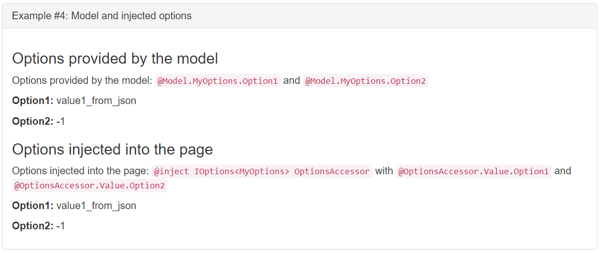

---
title: Options pattern in ASP.NET Core
author: rick-anderson
description: Discover how to use the options pattern to represent groups of related settings in ASP.NET Core apps.
monikerRange: '>= aspnetcore-2.1'
ms.author: riande
ms.custom: mvc
ms.date: 05/20/2020
no-loc: [appsettings.json, "ASP.NET Core Identity", cookie, Cookie, Blazor, "Blazor Server", "Blazor WebAssembly", "Identity", "Let's Encrypt", Razor, SignalR]
uid: fundamentals/configuration/options
--- 
# Options pattern in ASP.NET Core

::: moniker range=">= aspnetcore-3.0"

By [Kirk Larkin](https://twitter.com/serpent5) and [Rick Anderson](https://twitter.com/RickAndMSFT).

The options pattern uses classes to provide strongly typed access to groups of related settings. When [configuration settings](xref:fundamentals/configuration/index) are isolated by scenario into separate classes, the app adheres to two important software engineering principles:

* The [Interface Segregation Principle (ISP) or Encapsulation](/dotnet/standard/modern-web-apps-azure-architecture/architectural-principles#encapsulation): Scenarios (classes) that depend on configuration settings depend only on the configuration settings that they use.
* [Separation of Concerns](/dotnet/standard/modern-web-apps-azure-architecture/architectural-principles#separation-of-concerns): Settings for different parts of the app aren't dependent or coupled to one another.

Options also provide a mechanism to validate configuration data. For more information, see the [Options validation](#options-validation) section.

This topic provides information on the options pattern in ASP.NET Core. For information on using the options pattern in console apps, see [Options pattern in .NET](/dotnet/core/extensions/options).

[View or download sample code](https://github.com/dotnet/AspNetCore.Docs/tree/master/aspnetcore/fundamentals/configuration/options/samples) ([how to download](xref:index#how-to-download-a-sample))

<a name="optpat"></a>

## Bind hierarchical configuration

[!INCLUDE[](~/includes/bind.md)]

<a name="oi"></a>

## Options interfaces

<xref:Microsoft.Extensions.Options.IOptions%601>:

* Does ***not*** support:
  * Reading of configuration data after the app has started.
  * [Named options](#named)
* Is registered as a [Singleton](xref:fundamentals/dependency-injection#singleton) and can be injected into any [service lifetime](xref:fundamentals/dependency-injection#service-lifetimes).

<xref:Microsoft.Extensions.Options.IOptionsSnapshot%601>:

* Is useful in scenarios where options should be recomputed on every request. For more information, see [Use IOptionsSnapshot to read updated data](#ios).
* Is registered as [Scoped](xref:fundamentals/dependency-injection#scoped) and therefore cannot be injected into a Singleton service.
* Supports [named options](#named)

<xref:Microsoft.Extensions.Options.IOptionsMonitor%601>:

* Is used to retrieve options and manage options notifications for `TOptions` instances.
* Is registered as a [Singleton](xref:fundamentals/dependency-injection#singleton) and can be injected into any [service lifetime](xref:fundamentals/dependency-injection#service-lifetimes).
* Supports:
  * Change notifications
  * [Named options](#named-options-support-with-iconfigurenamedoptions)
  * [Reloadable configuration](#ios)
  * Selective options invalidation (<xref:Microsoft.Extensions.Options.IOptionsMonitorCache%601>)
  
[Post-configuration](#options-post-configuration) scenarios enable setting or changing options after all <xref:Microsoft.Extensions.Options.IConfigureOptions%601> configuration occurs.

<xref:Microsoft.Extensions.Options.IOptionsFactory%601> is responsible for creating new options instances. It has a single <xref:Microsoft.Extensions.Options.IOptionsFactory`1.Create*> method. The default implementation takes all registered <xref:Microsoft.Extensions.Options.IConfigureOptions%601> and <xref:Microsoft.Extensions.Options.IPostConfigureOptions%601> and runs all the configurations first, followed by the post-configuration. It distinguishes between <xref:Microsoft.Extensions.Options.IConfigureNamedOptions%601> and <xref:Microsoft.Extensions.Options.IConfigureOptions%601> and only calls the appropriate interface.

<xref:Microsoft.Extensions.Options.IOptionsMonitorCache%601> is used by <xref:Microsoft.Extensions.Options.IOptionsMonitor%601> to cache `TOptions` instances. The <xref:Microsoft.Extensions.Options.IOptionsMonitorCache%601> invalidates options instances in the monitor so that the value is recomputed (<xref:Microsoft.Extensions.Options.IOptionsMonitorCache`1.TryRemove*>). Values can be manually introduced with <xref:Microsoft.Extensions.Options.IOptionsMonitorCache`1.TryAdd*>. The <xref:Microsoft.Extensions.Options.IOptionsMonitorCache`1.Clear*> method is used when all named instances should be recreated on demand.

<a name="ios"></a>

## Use IOptionsSnapshot to read updated data

Using <xref:Microsoft.Extensions.Options.IOptionsSnapshot%601>, options are computed once per request when accessed and cached for the lifetime of the request. Changes to the configuration are read after the app starts when using configuration providers that support reading updated configuration values.

The difference between `IOptionsMonitor` and `IOptionsSnapshot` is that:

* `IOptionsMonitor` is a [singleton service](xref:fundamentals/dependency-injection#singleton) that retrieves current option values at any time, which is especially useful in singleton dependencies.
* `IOptionsSnapshot` is a [scoped service](xref:fundamentals/dependency-injection#scoped) and provides a snapshot of the options at the time the `IOptionsSnapshot<T>` object is constructed. Options snapshots are designed for use with transient and scoped dependencies.

The following code uses <xref:Microsoft.Extensions.Options.IOptionsSnapshot%601>.

[!code-csharp[](options/samples/3.x/OptionsSample/Pages/TestSnap.cshtml.cs?name=snippet)]

The following code registers a configuration instance which `MyOptions` binds against:

[!code-csharp[](~/fundamentals/configuration/options/samples/3.x/OptionsSample/Startup3.cs?name=snippet_Example2)]

In the preceding code, changes to the JSON configuration file after the app has started are read.

## IOptionsMonitor

The following code registers a configuration instance which `MyOptions` binds against.

[!code-csharp[](~/fundamentals/configuration/options/samples/3.x/OptionsSample/Startup3.cs?name=snippet_Example2)]

The following example uses <xref:Microsoft.Extensions.Options.IOptionsMonitor%601>:

[!code-csharp[](options/samples/3.x/OptionsSample/Pages/TestMonitor.cshtml.cs?name=snippet)]

In the preceding code, by default, changes to the JSON configuration file after the app has started are read.

<a name="named"></a>

## Named options support using IConfigureNamedOptions

Named options:

* Are useful when multiple configuration sections bind to the same properties.
* Are case sensitive.

Consider the following *appsettings.json* file:

[!code-json[](~/fundamentals/configuration/options/samples/3.x/OptionsSample/appsettings.NO.json)]

Rather than creating two classes to bind `TopItem:Month` and `TopItem:Year`,
the following class is used for each section:

[!code-csharp[](~/fundamentals/configuration/options/samples/3.x/OptionsSample/Models/TopItemSettings.cs)]

The following code configures the named options:

[!code-csharp[](~/fundamentals/configuration/options/samples/3.x/OptionsSample/StartupNO.cs?name=snippet_Example2)]

The following code displays the named options:

[!code-csharp[](options/samples/3.x/OptionsSample/Pages/TestNO.cshtml.cs?name=snippet)]

All options are named instances. <xref:Microsoft.Extensions.Options.IConfigureOptions%601> instances are treated as targeting the `Options.DefaultName` instance, which is `string.Empty`. <xref:Microsoft.Extensions.Options.IConfigureNamedOptions%601> also implements <xref:Microsoft.Extensions.Options.IConfigureOptions%601>. The default implementation of the <xref:Microsoft.Extensions.Options.IOptionsFactory%601> has logic to use each appropriately. The `null` named option is used to target all of the named instances instead of a specific named instance. <xref:Microsoft.Extensions.DependencyInjection.OptionsServiceCollectionExtensions.ConfigureAll*> and <xref:Microsoft.Extensions.DependencyInjection.OptionsServiceCollectionExtensions.PostConfigureAll*> use this convention.

## OptionsBuilder API

<xref:Microsoft.Extensions.Options.OptionsBuilder%601> is used to configure `TOptions` instances. `OptionsBuilder` streamlines creating named options as it's only a single parameter to the initial `AddOptions<TOptions>(string optionsName)` call instead of appearing in all of the subsequent calls. Options validation and the `ConfigureOptions` overloads that accept service dependencies are only available via `OptionsBuilder`.

`OptionsBuilder` is used in the [Options validation](#val) section.

## Use DI services to configure options

Services can be accessed from dependency injection while configuring options in two ways:

* Pass a configuration delegate to [Configure](xref:Microsoft.Extensions.Options.OptionsBuilder`1.Configure*) on [OptionsBuilder\<TOptions>](xref:Microsoft.Extensions.Options.OptionsBuilder`1). `OptionsBuilder<TOptions>` provides overloads of [Configure](xref:Microsoft.Extensions.Options.OptionsBuilder`1.Configure*) that allow use of up to five services to configure options:

  ```csharp
  services.AddOptions<MyOptions>("optionalName")
      .Configure<Service1, Service2, Service3, Service4, Service5>(
          (o, s, s2, s3, s4, s5) => 
              o.Property = DoSomethingWith(s, s2, s3, s4, s5));
  ```

* Create a type that implements <xref:Microsoft.Extensions.Options.IConfigureOptions%601> or <xref:Microsoft.Extensions.Options.IConfigureNamedOptions%601> and register the type as a service.

We recommend passing a configuration delegate to [Configure](xref:Microsoft.Extensions.Options.OptionsBuilder`1.Configure*), since creating a service is more complex. Creating a type is equivalent to what the framework does when calling [Configure](xref:Microsoft.Extensions.Options.OptionsBuilder`1.Configure*). Calling [Configure](xref:Microsoft.Extensions.Options.OptionsBuilder`1.Configure*) registers a transient generic <xref:Microsoft.Extensions.Options.IConfigureNamedOptions%601>, which has a constructor that accepts the generic service types specified. 

<a name="val"></a>

## Options validation

Options validation enables option values to be validated.

Consider the following *appsettings.json* file:

[!code-json[](~/fundamentals/configuration/options/samples/3.x/OptionsValidationSample/appsettings.Dev2.json)]

The following class binds to the `"MyConfig"` configuration section and applies a couple of `DataAnnotations` rules:

[!code-csharp[](options/samples/3.x/OptionsValidationSample/Configuration/MyConfigOptions.cs?name=snippet)]

The following code:

* Calls <xref:Microsoft.Extensions.DependencyInjection.OptionsServiceCollectionExtensions.AddOptions%2A> to get an [OptionsBuilder\<TOptions>](xref:Microsoft.Extensions.Options.OptionsBuilder`1) that binds to the `MyConfigOptions` class.
* Calls <xref:Microsoft.Extensions.DependencyInjection.OptionsBuilderDataAnnotationsExtensions.ValidateDataAnnotations%2A> to enable validation using `DataAnnotations`.

[!code-csharp[](options/samples/3.x/OptionsValidationSample/Startup.cs?name=snippet)]

The `ValidateDataAnnotations` extension method is defined in the [Microsoft.Extensions.Options.DataAnnotations](https://www.nuget.org/packages/Microsoft.Extensions.Options.DataAnnotations) NuGet package. For web apps that use the `Microsoft.NET.Sdk.Web` SDK, this package is referenced implicitly from the shared framework.

The following code displays the configuration values or the validation errors:

[!code-csharp[](options/samples/3.x/OptionsValidationSample/Controllers/HomeController.cs?name=snippet)]

The following code applies a more complex validation rule using a delegate:

[!code-csharp[](options/samples/3.x/OptionsValidationSample/Startup2.cs?name=snippet)]

### IValidateOptions for complex validation

The following class implements <xref:Microsoft.Extensions.Options.IValidateOptions`1>:

[!code-csharp[](options/samples/3.x/OptionsValidationSample/Configuration/MyConfigValidation.cs?name=snippet)]

`IValidateOptions` enables moving the validation code out of `StartUp` and into a class.

Using the preceding code, validation is enabled in `Startup.ConfigureServices` with the following code:

[!code-csharp[](options/samples/3.x/OptionsValidationSample/StartupValidation.cs?name=snippet)]

<!-- The following comment doesn't seem that useful 
Options validation doesn't guard against options modifications after the options instance is created. For example, `IOptionsSnapshot` options are created and validated once per request when the options are first accessed. The `IOptionsSnapshot` options aren't validated again on subsequent access attempts *for the same request*.

The `Validate` method accepts a `Func<TOptions, bool>`. To fully customize validation, implement `IValidateOptions<TOptions>`, which allows:

* Validation of multiple options types: `class ValidateTwo : IValidateOptions<Option1>, IValidationOptions<Option2>`
* Validation that depends on another option type: `public DependsOnAnotherOptionValidator(IOptionsMonitor<AnotherOption> options)`

`IValidateOptions` validates:

* A specific named options instance.
* All options when `name` is `null`.

Return a `ValidateOptionsResult` from your implementation of the interface:

```csharp
public interface IValidateOptions<TOptions> where TOptions : class
{
    ValidateOptionsResult Validate(string name, TOptions options);
}
```

Data Annotation-based validation is available from the [Microsoft.Extensions.Options.DataAnnotations](https://www.nuget.org/packages/Microsoft.Extensions.Options.DataAnnotations) package by calling the <xref:Microsoft.Extensions.DependencyInjection.OptionsBuilderDataAnnotationsExtensions.ValidateDataAnnotations*> method on `OptionsBuilder<TOptions>`. `Microsoft.Extensions.Options.DataAnnotations` is implicitly referenced in ASP.NET Core apps.

-->

## Options post-configuration

Set post-configuration with <xref:Microsoft.Extensions.Options.IPostConfigureOptions%601>. Post-configuration runs after all <xref:Microsoft.Extensions.Options.IConfigureOptions%601> configuration occurs:

```csharp
services.PostConfigure<MyOptions>(myOptions =>
{
    myOptions.Option1 = "post_configured_option1_value";
});
```

<xref:Microsoft.Extensions.Options.IPostConfigureOptions`1.PostConfigure*> is available to post-configure named options:

```csharp
services.PostConfigure<MyOptions>("named_options_1", myOptions =>
{
    myOptions.Option1 = "post_configured_option1_value";
});
```

Use <xref:Microsoft.Extensions.DependencyInjection.OptionsServiceCollectionExtensions.PostConfigureAll*> to post-configure all configuration instances:

```csharp
services.PostConfigureAll<MyOptions>(myOptions =>
{
    myOptions.Option1 = "post_configured_option1_value";
});
```

## Accessing options during startup

<xref:Microsoft.Extensions.Options.IOptions%601> and <xref:Microsoft.Extensions.Options.IOptionsMonitor%601> can be used in `Startup.Configure`, since services are built before the `Configure` method executes.

```csharp
public void Configure(IApplicationBuilder app, 
    IOptionsMonitor<MyOptions> optionsAccessor)
{
    var option1 = optionsAccessor.CurrentValue.Option1;
}
```

Don't use <xref:Microsoft.Extensions.Options.IOptions%601> or <xref:Microsoft.Extensions.Options.IOptionsMonitor%601> in `Startup.ConfigureServices`. An inconsistent options state may exist due to the ordering of service registrations.

## Options.ConfigurationExtensions NuGet package

The [Microsoft.Extensions.Options.ConfigurationExtensions](https://www.nuget.org/packages/Microsoft.Extensions.Options.ConfigurationExtensions/) package is implicitly referenced in ASP.NET Core apps.

::: moniker-end

::: moniker range="= aspnetcore-2.2"

The options pattern uses classes to represent groups of related settings. When [configuration settings](xref:fundamentals/configuration/index) are isolated by scenario into separate classes, the app adheres to two important software engineering principles:

* The [Interface Segregation Principle (ISP) or Encapsulation](/dotnet/standard/modern-web-apps-azure-architecture/architectural-principles#encapsulation): Scenarios (classes) that depend on configuration settings depend only on the configuration settings that they use.
* [Separation of Concerns](/dotnet/standard/modern-web-apps-azure-architecture/architectural-principles#separation-of-concerns): Settings for different parts of the app aren't dependent or coupled to one another.

Options also provide a mechanism to validate configuration data. For more information, see the [Options validation](#options-validation) section.

[View or download sample code](https://github.com/dotnet/AspNetCore.Docs/tree/master/aspnetcore/fundamentals/configuration/options/samples) ([how to download](xref:index#how-to-download-a-sample))

## Prerequisites

Reference the [Microsoft.AspNetCore.App metapackage](xref:fundamentals/metapackage-app) or add a package reference to the [Microsoft.Extensions.Options.ConfigurationExtensions](https://www.nuget.org/packages/Microsoft.Extensions.Options.ConfigurationExtensions/) package.

## Options interfaces

<xref:Microsoft.Extensions.Options.IOptionsMonitor%601> is used to retrieve options and manage options notifications for `TOptions` instances. <xref:Microsoft.Extensions.Options.IOptionsMonitor%601> supports the following scenarios:

* Change notifications
* [Named options](#named-options-support-with-iconfigurenamedoptions)
* [Reloadable configuration](#reload-configuration-data-with-ioptionssnapshot)
* Selective options invalidation (<xref:Microsoft.Extensions.Options.IOptionsMonitorCache%601>)

[Post-configuration](#options-post-configuration) scenarios allow you to set or change options after all <xref:Microsoft.Extensions.Options.IConfigureOptions%601> configuration occurs.

<xref:Microsoft.Extensions.Options.IOptionsFactory%601> is responsible for creating new options instances. It has a single <xref:Microsoft.Extensions.Options.IOptionsFactory`1.Create*> method. The default implementation takes all registered <xref:Microsoft.Extensions.Options.IConfigureOptions%601> and <xref:Microsoft.Extensions.Options.IPostConfigureOptions%601> and runs all the configurations first, followed by the post-configuration. It distinguishes between <xref:Microsoft.Extensions.Options.IConfigureNamedOptions%601> and <xref:Microsoft.Extensions.Options.IConfigureOptions%601> and only calls the appropriate interface.

<xref:Microsoft.Extensions.Options.IOptionsMonitorCache%601> is used by <xref:Microsoft.Extensions.Options.IOptionsMonitor%601> to cache `TOptions` instances. The <xref:Microsoft.Extensions.Options.IOptionsMonitorCache%601> invalidates options instances in the monitor so that the value is recomputed (<xref:Microsoft.Extensions.Options.IOptionsMonitorCache`1.TryRemove*>). Values can be manually introduced with <xref:Microsoft.Extensions.Options.IOptionsMonitorCache`1.TryAdd*>. The <xref:Microsoft.Extensions.Options.IOptionsMonitorCache`1.Clear*> method is used when all named instances should be recreated on demand.

<xref:Microsoft.Extensions.Options.IOptionsSnapshot%601> is useful in scenarios where options should be recomputed on every request. For more information, see the [Reload configuration data with IOptionsSnapshot](#reload-configuration-data-with-ioptionssnapshot) section.

<xref:Microsoft.Extensions.Options.IOptions%601> can be used to support options. However, <xref:Microsoft.Extensions.Options.IOptions%601> doesn't support the preceding scenarios of <xref:Microsoft.Extensions.Options.IOptionsMonitor%601>. You may continue to use <xref:Microsoft.Extensions.Options.IOptions%601> in existing frameworks and libraries that already use the <xref:Microsoft.Extensions.Options.IOptions%601> interface and don't require the scenarios provided by <xref:Microsoft.Extensions.Options.IOptionsMonitor%601>.

## General options configuration

General options configuration is demonstrated as Example 1 in the sample app.

An options class must be non-abstract with a public parameterless constructor. The following class, `MyOptions`, has two properties, `Option1` and `Option2`. Setting default values is optional, but the class constructor in the following example sets the default value of `Option1`. `Option2` has a default value set by initializing the property directly (*Models/MyOptions.cs*):

[!code-csharp[](options/samples/2.x/OptionsSample/Models/MyOptions.cs?name=snippet1)]

The `MyOptions` class is added to the service container with <xref:Microsoft.Extensions.DependencyInjection.OptionsConfigurationServiceCollectionExtensions.Configure*> and bound to configuration:

[!code-csharp[](options/samples/2.x/OptionsSample/Startup.cs?name=snippet_Example1)]

The following page model uses [constructor dependency injection](xref:mvc/controllers/dependency-injection) with <xref:Microsoft.Extensions.Options.IOptionsMonitor%601> to access the settings (*Pages/Index.cshtml.cs*):

[!code-csharp[](options/samples/2.x/OptionsSample/Pages/Index.cshtml.cs?range=9)]

[!code-csharp[](options/samples/2.x/OptionsSample/Pages/Index.cshtml.cs?name=snippet2&highlight=2,8)]

[!code-csharp[](options/samples/2.x/OptionsSample/Pages/Index.cshtml.cs?name=snippet_Example1)]

The sample's *appsettings.json* file specifies values for `option1` and `option2`:

[!code-json[](options/samples/2.x/OptionsSample/appsettings.json?highlight=2-3)]

When the app is run, the page model's `OnGet` method returns a string showing the option class values:

```html
option1 = value1_from_json, option2 = -1
```

> [!NOTE]
> When using a custom <xref:System.Configuration.ConfigurationBuilder> to load options configuration from a settings file, confirm that the base path is set correctly:
>
> ```csharp
> var configBuilder = new ConfigurationBuilder()
>    .SetBasePath(Directory.GetCurrentDirectory())
>    .AddJsonFile("appsettings.json", optional: true);
> var config = configBuilder.Build();
>
> services.Configure<MyOptions>(config);
> ```
>
> Explicitly setting the base path isn't required when loading options configuration from the settings file via <xref:Microsoft.AspNetCore.WebHost.CreateDefaultBuilder*>.

## Configure simple options with a delegate

Configuring simple options with a delegate is demonstrated as Example 2 in the sample app.

Use a delegate to set options values. The sample app uses the `MyOptionsWithDelegateConfig` class (*Models/MyOptionsWithDelegateConfig.cs*):

[!code-csharp[](options/samples/2.x/OptionsSample/Models/MyOptionsWithDelegateConfig.cs?name=snippet1)]

In the following code, a second <xref:Microsoft.Extensions.Options.IConfigureOptions%601> service is added to the service container. It uses a delegate to configure the binding with `MyOptionsWithDelegateConfig`:

[!code-csharp[](options/samples/2.x/OptionsSample/Startup.cs?name=snippet_Example2)]

*Index.cshtml.cs*:

[!code-csharp[](options/samples/2.x/OptionsSample/Pages/Index.cshtml.cs?range=10)]

[!code-csharp[](options/samples/2.x/OptionsSample/Pages/Index.cshtml.cs?name=snippet2&highlight=3,9)]

[!code-csharp[](options/samples/2.x/OptionsSample/Pages/Index.cshtml.cs?name=snippet_Example2)]

You can add multiple configuration providers. Configuration providers are available from NuGet packages and are applied in the order that they're registered. For more information, see <xref:fundamentals/configuration/index>.

Each call to <xref:Microsoft.Extensions.Options.IConfigureOptions%601.Configure*> adds an <xref:Microsoft.Extensions.Options.IConfigureOptions%601> service to the service container. In the preceding example, the values of `Option1` and `Option2` are both specified in *appsettings.json*, but the values of `Option1` and `Option2` are overridden by the configured delegate.

When more than one configuration service is enabled, the last configuration source specified *wins* and sets the configuration value. When the app is run, the page model's `OnGet` method returns a string showing the option class values:

```html
delegate_option1 = value1_configured_by_delegate, delegate_option2 = 500
```

## Suboptions configuration

Suboptions configuration is demonstrated as Example 3 in the sample app.

Apps should create options classes that pertain to specific scenario groups (classes) in the app. Parts of the app that require configuration values should only have access to the configuration values that they use.

When binding options to configuration, each property in the options type is bound to a configuration key of the form `property[:sub-property:]`. For example, the `MyOptions.Option1` property is bound to the key `Option1`, which is read from the `option1` property in *appsettings.json*.

In the following code, a third <xref:Microsoft.Extensions.Options.IConfigureOptions%601> service is added to the service container. It binds `MySubOptions` to the section `subsection` of the *appsettings.json* file:

[!code-csharp[](options/samples/2.x/OptionsSample/Startup.cs?name=snippet_Example3)]

The `GetSection` method requires the <xref:Microsoft.Extensions.Configuration?displayProperty=fullName> namespace.

The sample's *appsettings.json* file defines a `subsection` member with keys for `suboption1` and `suboption2`:

[!code-json[](options/samples/2.x/OptionsSample/appsettings.json?highlight=4-7)]

The `MySubOptions` class defines properties, `SubOption1` and `SubOption2`, to hold the options values (*Models/MySubOptions.cs*):

[!code-csharp[](options/samples/2.x/OptionsSample/Models/MySubOptions.cs?name=snippet1)]

The page model's `OnGet` method returns a string with the options values (*Pages/Index.cshtml.cs*):

[!code-csharp[](options/samples/2.x/OptionsSample/Pages/Index.cshtml.cs?range=11)]

[!code-csharp[](options/samples/2.x/OptionsSample/Pages/Index.cshtml.cs?name=snippet2&highlight=4,10)]

[!code-csharp[](options/samples/2.x/OptionsSample/Pages/Index.cshtml.cs?name=snippet_Example3)]

When the app is run, the `OnGet` method returns a string showing the suboption class values:

```html
subOption1 = subvalue1_from_json, subOption2 = 200
```

## Options injection

Options injection is demonstrated as Example 4 in the sample app.

Inject <xref:Microsoft.Extensions.Options.IOptionsMonitor%601> into:

* A Razor page or MVC view with the [`@inject`](xref:mvc/views/razor#inject) Razor directive.
* A page or view model.

The following example from the sample app injects <xref:Microsoft.Extensions.Options.IOptionsMonitor%601> into a page model (*Pages/Index.cshtml.cs*):

[!code-csharp[](options/samples/2.x/OptionsSample/Pages/Index.cshtml.cs?range=9)]

[!code-csharp[](options/samples/2.x/OptionsSample/Pages/Index.cshtml.cs?name=snippet2&highlight=2,8)]

[!code-csharp[](options/samples/2.x/OptionsSample/Pages/Index.cshtml.cs?name=snippet_Example4)]

The sample app shows how to inject `IOptionsMonitor<MyOptions>` with an `@inject` directive:

[!code-cshtml[](options/samples/2.x/OptionsSample/Pages/Index.cshtml?range=1-10&highlight=4)]

When the app is run, the options values are shown in the rendered page:



## Reload configuration data with IOptionsSnapshot

Reloading configuration data with <xref:Microsoft.Extensions.Options.IOptionsSnapshot%601> is demonstrated in Example 5 in the sample app.

Using <xref:Microsoft.Extensions.Options.IOptionsSnapshot%601>, options are computed once per request when accessed and cached for the lifetime of the request.

The difference between `IOptionsMonitor` and `IOptionsSnapshot` is that:

* `IOptionsMonitor` is a [singleton service](xref:fundamentals/dependency-injection#singleton) that retrieves current option values at any time, which is especially useful in singleton dependencies.
* `IOptionsSnapshot` is a [scoped service](xref:fundamentals/dependency-injection#scoped) and provides a snapshot of the options at the time the `IOptionsSnapshot<T>` object is constructed. Options snapshots are designed for use with transient and scoped dependencies.

The following example demonstrates how a new <xref:Microsoft.Extensions.Options.IOptionsSnapshot%601> is created after *appsettings.json* changes (*Pages/Index.cshtml.cs*). Multiple requests to the server return constant values provided by the *appsettings.json* file until the file is changed and configuration reloads.

[!code-csharp[](options/samples/2.x/OptionsSample/Pages/Index.cshtml.cs?range=12)]

[!code-csharp[](options/samples/2.x/OptionsSample/Pages/Index.cshtml.cs?name=snippet2&highlight=5,11)]

[!code-csharp[](options/samples/2.x/OptionsSample/Pages/Index.cshtml.cs?name=snippet_Example5)]

The following image shows the initial `option1` and `option2` values loaded from the *appsettings.json* file:

```html
snapshot option1 = value1_from_json, snapshot option2 = -1
```

Change the values in the *appsettings.json* file to `value1_from_json UPDATED` and `200`. Save the *appsettings.json* file. Refresh the browser to see that the options values are updated:

```html
snapshot option1 = value1_from_json UPDATED, snapshot option2 = 200
```

## Named options support with IConfigureNamedOptions

Named options support with <xref:Microsoft.Extensions.Options.IConfigureNamedOptions%601> is demonstrated as Example 6 in the sample app.

Named options support allows the app to distinguish between named options configurations. In the sample app, named options are declared with [OptionsServiceCollectionExtensions.Configure](xref:Microsoft.Extensions.DependencyInjection.OptionsServiceCollectionExtensions.Configure*), which calls the [ConfigureNamedOptions\<TOptions>.Configure](xref:Microsoft.Extensions.Options.ConfigureNamedOptions`1.Configure*) extension method. Named options are case sensitive.

[!code-csharp[](options/samples/2.x/OptionsSample/Startup.cs?name=snippet_Example6)]

The sample app accesses the named options with <xref:Microsoft.Extensions.Options.IOptionsSnapshot`1.Get*> (*Pages/Index.cshtml.cs*):

[!code-csharp[](options/samples/2.x/OptionsSample/Pages/Index.cshtml.cs?range=13-14)]

[!code-csharp[](options/samples/2.x/OptionsSample/Pages/Index.cshtml.cs?name=snippet2&highlight=6,12-13)]

[!code-csharp[](options/samples/2.x/OptionsSample/Pages/Index.cshtml.cs?name=snippet_Example6)]

Running the sample app, the named options are returned:

```html
named_options_1: option1 = value1_from_json, option2 = -1
named_options_2: option1 = named_options_2_value1_from_action, option2 = 5
```

`named_options_1` values are provided from configuration, which are loaded from the *appsettings.json* file. `named_options_2` values are provided by:

* The `named_options_2` delegate in `ConfigureServices` for `Option1`.
* The default value for `Option2` provided by the `MyOptions` class.

## Configure all options with the ConfigureAll method

Configure all options instances with the <xref:Microsoft.Extensions.DependencyInjection.OptionsServiceCollectionExtensions.ConfigureAll*> method. The following code configures `Option1` for all configuration instances with a common value. Add the following code manually to the `Startup.ConfigureServices` method:

```csharp
services.ConfigureAll<MyOptions>(myOptions => 
{
    myOptions.Option1 = "ConfigureAll replacement value";
});
```

Running the sample app after adding the code produces the following result:

```html
named_options_1: option1 = ConfigureAll replacement value, option2 = -1
named_options_2: option1 = ConfigureAll replacement value, option2 = 5
```

> [!NOTE]
> All options are named instances. Existing <xref:Microsoft.Extensions.Options.IConfigureOptions%601> instances are treated as targeting the `Options.DefaultName` instance, which is `string.Empty`. <xref:Microsoft.Extensions.Options.IConfigureNamedOptions%601> also implements <xref:Microsoft.Extensions.Options.IConfigureOptions%601>. The default implementation of the <xref:Microsoft.Extensions.Options.IOptionsFactory%601> has logic to use each appropriately. The `null` named option is used to target all of the named instances instead of a specific named instance (<xref:Microsoft.Extensions.DependencyInjection.OptionsServiceCollectionExtensions.ConfigureAll*> and <xref:Microsoft.Extensions.DependencyInjection.OptionsServiceCollectionExtensions.PostConfigureAll*> use this convention).

## OptionsBuilder API

<xref:Microsoft.Extensions.Options.OptionsBuilder%601> is used to configure `TOptions` instances. `OptionsBuilder` streamlines creating named options as it's only a single parameter to the initial `AddOptions<TOptions>(string optionsName)` call instead of appearing in all of the subsequent calls. Options validation and the `ConfigureOptions` overloads that accept service dependencies are only available via `OptionsBuilder`.

```csharp
// Options.DefaultName = "" is used.
services.AddOptions<MyOptions>().Configure(o => o.Property = "default");

services.AddOptions<MyOptions>("optionalName")
    .Configure(o => o.Property = "named");
```

## Use DI services to configure options

You can access other services from dependency injection while configuring options in two ways:

* Pass a configuration delegate to [Configure](xref:Microsoft.Extensions.Options.OptionsBuilder`1.Configure*) on [OptionsBuilder\<TOptions>](xref:Microsoft.Extensions.Options.OptionsBuilder`1). [OptionsBuilder\<TOptions>](xref:Microsoft.Extensions.Options.OptionsBuilder`1) provides overloads of [Configure](xref:Microsoft.Extensions.Options.OptionsBuilder`1.Configure*) that allow you to use up to five services to configure options:

  ```csharp
  services.AddOptions<MyOptions>("optionalName")
      .Configure<Service1, Service2, Service3, Service4, Service5>(
          (o, s, s2, s3, s4, s5) => 
              o.Property = DoSomethingWith(s, s2, s3, s4, s5));
  ```

* Create your own type that implements <xref:Microsoft.Extensions.Options.IConfigureOptions%601> or <xref:Microsoft.Extensions.Options.IConfigureNamedOptions%601> and register the type as a service.

We recommend passing a configuration delegate to [Configure](xref:Microsoft.Extensions.Options.OptionsBuilder`1.Configure*), since creating a service is more complex. Creating your own type is equivalent to what the framework does for you when you use [Configure](xref:Microsoft.Extensions.Options.OptionsBuilder`1.Configure*). Calling [Configure](xref:Microsoft.Extensions.Options.OptionsBuilder`1.Configure*) registers a transient generic <xref:Microsoft.Extensions.Options.IConfigureNamedOptions%601>, which has a constructor that accepts the generic service types specified. 

## Options validation

Options validation allows you to validate options when options are configured. Call `Validate` with a validation method that returns `true` if options are valid and `false` if they aren't valid:

```csharp
// Registration
services.AddOptions<MyOptions>("optionalOptionsName")
    .Configure(o => { }) // Configure the options
    .Validate(o => YourValidationShouldReturnTrueIfValid(o), 
        "custom error");

// Consumption
var monitor = services.BuildServiceProvider()
    .GetService<IOptionsMonitor<MyOptions>>();
  
try
{
    var options = monitor.Get("optionalOptionsName");
}
catch (OptionsValidationException e) 
{
   // e.OptionsName returns "optionalOptionsName"
   // e.OptionsType returns typeof(MyOptions)
   // e.Failures returns a list of errors, which would contain 
   //     "custom error"
}
```

The preceding example sets the named options instance to `optionalOptionsName`. The default options instance is `Options.DefaultName`.

Validation runs when the options instance is created. An options instance is guaranteed to pass validation the first time it's accessed.

> [!IMPORTANT]
> Options validation doesn't guard against options modifications after the options instance is created. For example, `IOptionsSnapshot` options are created and validated once per request when the options are first accessed. The `IOptionsSnapshot` options aren't validated again on subsequent access attempts *for the same request*.

The `Validate` method accepts a `Func<TOptions, bool>`. To fully customize validation, implement `IValidateOptions<TOptions>`, which allows:

* Validation of multiple options types: `class ValidateTwo : IValidateOptions<Option1>, IValidationOptions<Option2>`
* Validation that depends on another option type: `public DependsOnAnotherOptionValidator(IOptionsMonitor<AnotherOption> options)`

`IValidateOptions` validates:

* A specific named options instance.
* All options when `name` is `null`.

Return a `ValidateOptionsResult` from your implementation of the interface:

```csharp
public interface IValidateOptions<TOptions> where TOptions : class
{
    ValidateOptionsResult Validate(string name, TOptions options);
}
```

Data Annotation-based validation is available from the [Microsoft.Extensions.Options.DataAnnotations](https://www.nuget.org/packages/Microsoft.Extensions.Options.DataAnnotations) package by calling the <xref:Microsoft.Extensions.DependencyInjection.OptionsBuilderDataAnnotationsExtensions.ValidateDataAnnotations*> method on `OptionsBuilder<TOptions>`. `Microsoft.Extensions.Options.DataAnnotations` is included in the [Microsoft.AspNetCore.App metapackage](xref:fundamentals/metapackage-app).

```csharp
using Microsoft.Extensions.DependencyInjection;

private class AnnotatedOptions
{
    [Required]
    public string Required { get; set; }

    [StringLength(5, ErrorMessage = "Too long.")]
    public string StringLength { get; set; }

    [Range(-5, 5, ErrorMessage = "Out of range.")]
    public int IntRange { get; set; }
}

[Fact]
public void CanValidateDataAnnotations()
{
    var services = new ServiceCollection();
    services.AddOptions<AnnotatedOptions>()
        .Configure(o =>
        {
            o.StringLength = "111111";
            o.IntRange = 10;
            o.Custom = "nowhere";
        })
        .ValidateDataAnnotations();

    var sp = services.BuildServiceProvider();

    var error = Assert.Throws<OptionsValidationException>(() => 
        sp.GetRequiredService<IOptionsMonitor<AnnotatedOptions>>().CurrentValue);
    ValidateFailure<AnnotatedOptions>(error, Options.DefaultName, 1,
        "DataAnnotation validation failed for members Required " +
            "with the error 'The Required field is required.'.",
        "DataAnnotation validation failed for members StringLength " +
            "with the error 'Too long.'.",
        "DataAnnotation validation failed for members IntRange " +
            "with the error 'Out of range.'.");
}
```

Eager validation (fail fast at startup) is under consideration for a future release.

## Options post-configuration

Set post-configuration with <xref:Microsoft.Extensions.Options.IPostConfigureOptions%601>. Post-configuration runs after all <xref:Microsoft.Extensions.Options.IConfigureOptions%601> configuration occurs:

```csharp
services.PostConfigure<MyOptions>(myOptions =>
{
    myOptions.Option1 = "post_configured_option1_value";
});
```

<xref:Microsoft.Extensions.Options.IPostConfigureOptions`1.PostConfigure*> is available to post-configure named options:

```csharp
services.PostConfigure<MyOptions>("named_options_1", myOptions =>
{
    myOptions.Option1 = "post_configured_option1_value";
});
```

Use <xref:Microsoft.Extensions.DependencyInjection.OptionsServiceCollectionExtensions.PostConfigureAll*> to post-configure all configuration instances:

```csharp
services.PostConfigureAll<MyOptions>(myOptions =>
{
    myOptions.Option1 = "post_configured_option1_value";
});
```

## Accessing options during startup

<xref:Microsoft.Extensions.Options.IOptions%601> and <xref:Microsoft.Extensions.Options.IOptionsMonitor%601> can be used in `Startup.Configure`, since services are built before the `Configure` method executes.

```csharp
public void Configure(IApplicationBuilder app, IOptionsMonitor<MyOptions> optionsAccessor)
{
    var option1 = optionsAccessor.CurrentValue.Option1;
}
```

Don't use <xref:Microsoft.Extensions.Options.IOptions%601> or <xref:Microsoft.Extensions.Options.IOptionsMonitor%601> in `Startup.ConfigureServices`. An inconsistent options state may exist due to the ordering of service registrations.

::: moniker-end

::: moniker range="= aspnetcore-2.1"

The options pattern uses classes to represent groups of related settings. When [configuration settings](xref:fundamentals/configuration/index) are isolated by scenario into separate classes, the app adheres to two important software engineering principles:

* The [Interface Segregation Principle (ISP) or Encapsulation](/dotnet/standard/modern-web-apps-azure-architecture/architectural-principles#encapsulation): Scenarios (classes) that depend on configuration settings depend only on the configuration settings that they use.
* [Separation of Concerns](/dotnet/standard/modern-web-apps-azure-architecture/architectural-principles#separation-of-concerns): Settings for different parts of the app aren't dependent or coupled to one another.

Options also provide a mechanism to validate configuration data. For more information, see the [Options validation](#options-validation) section.

[View or download sample code](https://github.com/dotnet/AspNetCore.Docs/tree/master/aspnetcore/fundamentals/configuration/options/samples) ([how to download](xref:index#how-to-download-a-sample))

## Prerequisites

Reference the [Microsoft.AspNetCore.App metapackage](xref:fundamentals/metapackage-app) or add a package reference to the [Microsoft.Extensions.Options.ConfigurationExtensions](https://www.nuget.org/packages/Microsoft.Extensions.Options.ConfigurationExtensions/) package.

## Options interfaces

<xref:Microsoft.Extensions.Options.IOptionsMonitor%601> is used to retrieve options and manage options notifications for `TOptions` instances. <xref:Microsoft.Extensions.Options.IOptionsMonitor%601> supports the following scenarios:

* Change notifications
* [Named options](#named-options-support-with-iconfigurenamedoptions)
* [Reloadable configuration](#reload-configuration-data-with-ioptionssnapshot)
* Selective options invalidation (<xref:Microsoft.Extensions.Options.IOptionsMonitorCache%601>)

[Post-configuration](#options-post-configuration) scenarios allow you to set or change options after all <xref:Microsoft.Extensions.Options.IConfigureOptions%601> configuration occurs.

<xref:Microsoft.Extensions.Options.IOptionsFactory%601> is responsible for creating new options instances. It has a single <xref:Microsoft.Extensions.Options.IOptionsFactory`1.Create*> method. The default implementation takes all registered <xref:Microsoft.Extensions.Options.IConfigureOptions%601> and <xref:Microsoft.Extensions.Options.IPostConfigureOptions%601> and runs all the configurations first, followed by the post-configuration. It distinguishes between <xref:Microsoft.Extensions.Options.IConfigureNamedOptions%601> and <xref:Microsoft.Extensions.Options.IConfigureOptions%601> and only calls the appropriate interface.

<xref:Microsoft.Extensions.Options.IOptionsMonitorCache%601> is used by <xref:Microsoft.Extensions.Options.IOptionsMonitor%601> to cache `TOptions` instances. The <xref:Microsoft.Extensions.Options.IOptionsMonitorCache%601> invalidates options instances in the monitor so that the value is recomputed (<xref:Microsoft.Extensions.Options.IOptionsMonitorCache`1.TryRemove*>). Values can be manually introduced with <xref:Microsoft.Extensions.Options.IOptionsMonitorCache`1.TryAdd*>. The <xref:Microsoft.Extensions.Options.IOptionsMonitorCache`1.Clear*> method is used when all named instances should be recreated on demand.

<xref:Microsoft.Extensions.Options.IOptionsSnapshot%601> is useful in scenarios where options should be recomputed on every request. For more information, see the [Reload configuration data with IOptionsSnapshot](#reload-configuration-data-with-ioptionssnapshot) section.

<xref:Microsoft.Extensions.Options.IOptions%601> can be used to support options. However, <xref:Microsoft.Extensions.Options.IOptions%601> doesn't support the preceding scenarios of <xref:Microsoft.Extensions.Options.IOptionsMonitor%601>. You may continue to use <xref:Microsoft.Extensions.Options.IOptions%601> in existing frameworks and libraries that already use the <xref:Microsoft.Extensions.Options.IOptions%601> interface and don't require the scenarios provided by <xref:Microsoft.Extensions.Options.IOptionsMonitor%601>.

## General options configuration

General options configuration is demonstrated as Example 1 in the sample app.

An options class must be non-abstract with a public parameterless constructor. The following class, `MyOptions`, has two properties, `Option1` and `Option2`. Setting default values is optional, but the class constructor in the following example sets the default value of `Option1`. `Option2` has a default value set by initializing the property directly (*Models/MyOptions.cs*):

[!code-csharp[](options/samples/2.x/OptionsSample/Models/MyOptions.cs?name=snippet1)]

The `MyOptions` class is added to the service container with <xref:Microsoft.Extensions.DependencyInjection.OptionsConfigurationServiceCollectionExtensions.Configure*> and bound to configuration:

[!code-csharp[](options/samples/2.x/OptionsSample/Startup.cs?name=snippet_Example1)]

The following page model uses [constructor dependency injection](xref:mvc/controllers/dependency-injection) with <xref:Microsoft.Extensions.Options.IOptionsMonitor%601> to access the settings (*Pages/Index.cshtml.cs*):

[!code-csharp[](options/samples/2.x/OptionsSample/Pages/Index.cshtml.cs?range=9)]

[!code-csharp[](options/samples/2.x/OptionsSample/Pages/Index.cshtml.cs?name=snippet2&highlight=2,8)]

[!code-csharp[](options/samples/2.x/OptionsSample/Pages/Index.cshtml.cs?name=snippet_Example1)]

The sample's *appsettings.json* file specifies values for `option1` and `option2`:

[!code-json[](options/samples/2.x/OptionsSample/appsettings.json?highlight=2-3)]

When the app is run, the page model's `OnGet` method returns a string showing the option class values:

```html
option1 = value1_from_json, option2 = -1
```

> [!NOTE]
> When using a custom <xref:System.Configuration.ConfigurationBuilder> to load options configuration from a settings file, confirm that the base path is set correctly:
>
> ```csharp
> var configBuilder = new ConfigurationBuilder()
>    .SetBasePath(Directory.GetCurrentDirectory())
>    .AddJsonFile("appsettings.json", optional: true);
> var config = configBuilder.Build();
>
> services.Configure<MyOptions>(config);
> ```
>
> Explicitly setting the base path isn't required when loading options configuration from the settings file via <xref:Microsoft.AspNetCore.WebHost.CreateDefaultBuilder*>.

## Configure simple options with a delegate

Configuring simple options with a delegate is demonstrated as Example 2 in the sample app.

Use a delegate to set options values. The sample app uses the `MyOptionsWithDelegateConfig` class (*Models/MyOptionsWithDelegateConfig.cs*):

[!code-csharp[](options/samples/2.x/OptionsSample/Models/MyOptionsWithDelegateConfig.cs?name=snippet1)]

In the following code, a second <xref:Microsoft.Extensions.Options.IConfigureOptions%601> service is added to the service container. It uses a delegate to configure the binding with `MyOptionsWithDelegateConfig`:

[!code-csharp[](options/samples/2.x/OptionsSample/Startup.cs?name=snippet_Example2)]

*Index.cshtml.cs*:

[!code-csharp[](options/samples/2.x/OptionsSample/Pages/Index.cshtml.cs?range=10)]

[!code-csharp[](options/samples/2.x/OptionsSample/Pages/Index.cshtml.cs?name=snippet2&highlight=3,9)]

[!code-csharp[](options/samples/2.x/OptionsSample/Pages/Index.cshtml.cs?name=snippet_Example2)]

You can add multiple configuration providers. Configuration providers are available from NuGet packages and are applied in the order that they're registered. For more information, see <xref:fundamentals/configuration/index>.

Each call to <xref:Microsoft.Extensions.Options.IConfigureOptions%601.Configure*> adds an <xref:Microsoft.Extensions.Options.IConfigureOptions%601> service to the service container. In the preceding example, the values of `Option1` and `Option2` are both specified in *appsettings.json*, but the values of `Option1` and `Option2` are overridden by the configured delegate.

When more than one configuration service is enabled, the last configuration source specified *wins* and sets the configuration value. When the app is run, the page model's `OnGet` method returns a string showing the option class values:

```html
delegate_option1 = value1_configured_by_delegate, delegate_option2 = 500
```

## Suboptions configuration

Suboptions configuration is demonstrated as Example 3 in the sample app.

Apps should create options classes that pertain to specific scenario groups (classes) in the app. Parts of the app that require configuration values should only have access to the configuration values that they use.

When binding options to configuration, each property in the options type is bound to a configuration key of the form `property[:sub-property:]`. For example, the `MyOptions.Option1` property is bound to the key `Option1`, which is read from the `option1` property in *appsettings.json*.

In the following code, a third <xref:Microsoft.Extensions.Options.IConfigureOptions%601> service is added to the service container. It binds `MySubOptions` to the section `subsection` of the *appsettings.json* file:

[!code-csharp[](options/samples/2.x/OptionsSample/Startup.cs?name=snippet_Example3)]

The `GetSection` method requires the <xref:Microsoft.Extensions.Configuration?displayProperty=fullName> namespace.

The sample's *appsettings.json* file defines a `subsection` member with keys for `suboption1` and `suboption2`:

[!code-json[](options/samples/2.x/OptionsSample/appsettings.json?highlight=4-7)]

The `MySubOptions` class defines properties, `SubOption1` and `SubOption2`, to hold the options values (*Models/MySubOptions.cs*):

[!code-csharp[](options/samples/2.x/OptionsSample/Models/MySubOptions.cs?name=snippet1)]

The page model's `OnGet` method returns a string with the options values (*Pages/Index.cshtml.cs*):

[!code-csharp[](options/samples/2.x/OptionsSample/Pages/Index.cshtml.cs?range=11)]

[!code-csharp[](options/samples/2.x/OptionsSample/Pages/Index.cshtml.cs?name=snippet2&highlight=4,10)]

[!code-csharp[](options/samples/2.x/OptionsSample/Pages/Index.cshtml.cs?name=snippet_Example3)]

When the app is run, the `OnGet` method returns a string showing the suboption class values:

```html
subOption1 = subvalue1_from_json, subOption2 = 200
```

## Options provided by a view model or with direct view injection

Options provided by a view model or with direct view injection is demonstrated as Example 4 in the sample app.

Options can be supplied in a view model or by injecting <xref:Microsoft.Extensions.Options.IOptionsMonitor%601> directly into a view (*Pages/Index.cshtml.cs*):

[!code-csharp[](options/samples/2.x/OptionsSample/Pages/Index.cshtml.cs?range=9)]

[!code-csharp[](options/samples/2.x/OptionsSample/Pages/Index.cshtml.cs?name=snippet2&highlight=2,8)]

[!code-csharp[](options/samples/2.x/OptionsSample/Pages/Index.cshtml.cs?name=snippet_Example4)]

The sample app shows how to inject `IOptionsMonitor<MyOptions>` with an `@inject` directive:

[!code-cshtml[](options/samples/2.x/OptionsSample/Pages/Index.cshtml?range=1-10&highlight=4)]

When the app is run, the options values are shown in the rendered page:


## Reload configuration data with IOptionsSnapshot

Reloading configuration data with <xref:Microsoft.Extensions.Options.IOptionsSnapshot%601> is demonstrated in Example 5 in the sample app.

<xref:Microsoft.Extensions.Options.IOptionsSnapshot%601> supports reloading options with minimal processing overhead.

Options are computed once per request when accessed and cached for the lifetime of the request.

The following example demonstrates how a new <xref:Microsoft.Extensions.Options.IOptionsSnapshot%601> is created after *appsettings.json* changes (*Pages/Index.cshtml.cs*). Multiple requests to the server return constant values provided by the *appsettings.json* file until the file is changed and configuration reloads.

[!code-csharp[](options/samples/2.x/OptionsSample/Pages/Index.cshtml.cs?range=12)]

[!code-csharp[](options/samples/2.x/OptionsSample/Pages/Index.cshtml.cs?name=snippet2&highlight=5,11)]

[!code-csharp[](options/samples/2.x/OptionsSample/Pages/Index.cshtml.cs?name=snippet_Example5)]

The following image shows the initial `option1` and `option2` values loaded from the *appsettings.json* file:

```html
snapshot option1 = value1_from_json, snapshot option2 = -1
```

Change the values in the *appsettings.json* file to `value1_from_json UPDATED` and `200`. Save the *appsettings.json* file. Refresh the browser to see that the options values are updated:

```html
snapshot option1 = value1_from_json UPDATED, snapshot option2 = 200
```

## Named options support with IConfigureNamedOptions

Named options support with <xref:Microsoft.Extensions.Options.IConfigureNamedOptions%601> is demonstrated as Example 6 in the sample app.

Named options support allows the app to distinguish between named options configurations. In the sample app, named options are declared with [OptionsServiceCollectionExtensions.Configure](xref:Microsoft.Extensions.DependencyInjection.OptionsServiceCollectionExtensions.Configure*), which calls the [ConfigureNamedOptions\<TOptions>.Configure](xref:Microsoft.Extensions.Options.ConfigureNamedOptions`1.Configure*) extension method. Named options are case sensitive.

[!code-csharp[](options/samples/2.x/OptionsSample/Startup.cs?name=snippet_Example6)]

The sample app accesses the named options with <xref:Microsoft.Extensions.Options.IOptionsSnapshot`1.Get*> (*Pages/Index.cshtml.cs*):

[!code-csharp[](options/samples/2.x/OptionsSample/Pages/Index.cshtml.cs?range=13-14)]

[!code-csharp[](options/samples/2.x/OptionsSample/Pages/Index.cshtml.cs?name=snippet2&highlight=6,12-13)]

[!code-csharp[](options/samples/2.x/OptionsSample/Pages/Index.cshtml.cs?name=snippet_Example6)]

Running the sample app, the named options are returned:

```html
named_options_1: option1 = value1_from_json, option2 = -1
named_options_2: option1 = named_options_2_value1_from_action, option2 = 5
```

`named_options_1` values are provided from configuration, which are loaded from the *appsettings.json* file. `named_options_2` values are provided by:

* The `named_options_2` delegate in `ConfigureServices` for `Option1`.
* The default value for `Option2` provided by the `MyOptions` class.

## Configure all options with the ConfigureAll method

Configure all options instances with the <xref:Microsoft.Extensions.DependencyInjection.OptionsServiceCollectionExtensions.ConfigureAll*> method. The following code configures `Option1` for all configuration instances with a common value. Add the following code manually to the `Startup.ConfigureServices` method:

```csharp
services.ConfigureAll<MyOptions>(myOptions => 
{
    myOptions.Option1 = "ConfigureAll replacement value";
});
```

Running the sample app after adding the code produces the following result:

```html
named_options_1: option1 = ConfigureAll replacement value, option2 = -1
named_options_2: option1 = ConfigureAll replacement value, option2 = 5
```

> [!NOTE]
> All options are named instances. Existing <xref:Microsoft.Extensions.Options.IConfigureOptions%601> instances are treated as targeting the `Options.DefaultName` instance, which is `string.Empty`. <xref:Microsoft.Extensions.Options.IConfigureNamedOptions%601> also implements <xref:Microsoft.Extensions.Options.IConfigureOptions%601>. The default implementation of the <xref:Microsoft.Extensions.Options.IOptionsFactory%601> has logic to use each appropriately. The `null` named option is used to target all of the named instances instead of a specific named instance (<xref:Microsoft.Extensions.DependencyInjection.OptionsServiceCollectionExtensions.ConfigureAll*> and <xref:Microsoft.Extensions.DependencyInjection.OptionsServiceCollectionExtensions.PostConfigureAll*> use this convention).

## OptionsBuilder API

<xref:Microsoft.Extensions.Options.OptionsBuilder%601> is used to configure `TOptions` instances. `OptionsBuilder` streamlines creating named options as it's only a single parameter to the initial `AddOptions<TOptions>(string optionsName)` call instead of appearing in all of the subsequent calls. Options validation and the `ConfigureOptions` overloads that accept service dependencies are only available via `OptionsBuilder`.

```csharp
// Options.DefaultName = "" is used.
services.AddOptions<MyOptions>().Configure(o => o.Property = "default");

services.AddOptions<MyOptions>("optionalName")
    .Configure(o => o.Property = "named");
```

## Use DI services to configure options

You can access other services from dependency injection while configuring options in two ways:

* Pass a configuration delegate to [Configure](xref:Microsoft.Extensions.Options.OptionsBuilder`1.Configure*) on [OptionsBuilder\<TOptions>](xref:Microsoft.Extensions.Options.OptionsBuilder`1). [OptionsBuilder\<TOptions>](xref:Microsoft.Extensions.Options.OptionsBuilder`1) provides overloads of [Configure](xref:Microsoft.Extensions.Options.OptionsBuilder`1.Configure*) that allow you to use up to five services to configure options:

  ```csharp
  services.AddOptions<MyOptions>("optionalName")
      .Configure<Service1, Service2, Service3, Service4, Service5>(
          (o, s, s2, s3, s4, s5) => 
              o.Property = DoSomethingWith(s, s2, s3, s4, s5));
  ```

* Create your own type that implements <xref:Microsoft.Extensions.Options.IConfigureOptions%601> or <xref:Microsoft.Extensions.Options.IConfigureNamedOptions%601> and register the type as a service.

We recommend passing a configuration delegate to [Configure](xref:Microsoft.Extensions.Options.OptionsBuilder`1.Configure*), since creating a service is more complex. Creating your own type is equivalent to what the framework does for you when you use [Configure](xref:Microsoft.Extensions.Options.OptionsBuilder`1.Configure*). Calling [Configure](xref:Microsoft.Extensions.Options.OptionsBuilder`1.Configure*) registers a transient generic <xref:Microsoft.Extensions.Options.IConfigureNamedOptions%601>, which has a constructor that accepts the generic service types specified. 

## Options post-configuration

Set post-configuration with <xref:Microsoft.Extensions.Options.IPostConfigureOptions%601>. Post-configuration runs after all <xref:Microsoft.Extensions.Options.IConfigureOptions%601> configuration occurs:

```csharp
services.PostConfigure<MyOptions>(myOptions =>
{
    myOptions.Option1 = "post_configured_option1_value";
});
```

<xref:Microsoft.Extensions.Options.IPostConfigureOptions`1.PostConfigure*> is available to post-configure named options:

```csharp
services.PostConfigure<MyOptions>("named_options_1", myOptions =>
{
    myOptions.Option1 = "post_configured_option1_value";
});
```

Use <xref:Microsoft.Extensions.DependencyInjection.OptionsServiceCollectionExtensions.PostConfigureAll*> to post-configure all configuration instances:

```csharp
services.PostConfigureAll<MyOptions>(myOptions =>
{
    myOptions.Option1 = "post_configured_option1_value";
});
```

## Accessing options during startup

<xref:Microsoft.Extensions.Options.IOptions%601> and <xref:Microsoft.Extensions.Options.IOptionsMonitor%601> can be used in `Startup.Configure`, since services are built before the `Configure` method executes.

```csharp
public void Configure(IApplicationBuilder app, IOptionsMonitor<MyOptions> optionsAccessor)
{
    var option1 = optionsAccessor.CurrentValue.Option1;
}
```

Don't use <xref:Microsoft.Extensions.Options.IOptions%601> or <xref:Microsoft.Extensions.Options.IOptionsMonitor%601> in `Startup.ConfigureServices`. An inconsistent options state may exist due to the ordering of service registrations.

::: moniker-end

## Additional resources

* <xref:fundamentals/configuration/index>
