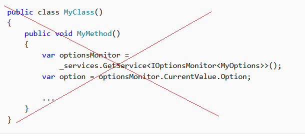

# Dependency injection in ASP.NET Core

::: moniker range=">= aspnetcore-3.0"

By [Kirk Larkin](https://twitter.com/serpent5), [Steve Smith](https://ardalis.com/), [Scott Addie](https://scottaddie.com), and [Brandon Dahler](https://github.com/brandondahler)

ASP.NET Core supports the dependency injection (DI) software design pattern, which is a technique for achieving [Inversion of Control (IoC)](/dotnet/standard/modern-web-apps-azure-architecture/architectural-principles#dependency-inversion) between classes and their dependencies.

For more information specific to dependency injection within MVC controllers, see <xref:mvc/controllers/dependency-injection>.

For information on using dependency injection in applications other than web apps, see [Dependency injection in .NET](/dotnet/core/extensions/dependency-injection).

For more information on dependency injection of options, see <xref:fundamentals/configuration/options>.

This topic provides information on dependency injection in ASP.NET Core. The primary documentation on using dependency injection is contained in [Dependency injection in .NET](/dotnet/core/extensions/dependency-injection).

[View or download sample code](https://github.com/dotnet/AspNetCore.Docs/tree/master/aspnetcore/fundamentals/dependency-injection/samples) ([how to download](xref:index#how-to-download-a-sample))

## Overview of dependency injection

A *dependency* is an object that another object depends on. Examine the following `MyDependency` class with a `WriteMessage` method that other classes depend on:

```csharp
public class MyDependency
{
    public void WriteMessage(string message)
    {
        Console.WriteLine($"MyDependency.WriteMessage called. Message: {message}");
    }
}
```

A class can create an instance of the `MyDependency` class to make use of its `WriteMessage` method. In the following example, the `MyDependency` class is a dependency of the `IndexModel` class:

```csharp
public class IndexModel : PageModel
{
    private readonly MyDependency _dependency = new MyDependency();

    public void OnGet()
    {
        _dependency.WriteMessage("IndexModel.OnGet created this message.");
    }
}
```

The class creates and directly depends on the `MyDependency` class. Code dependencies, such as in the previous example, are problematic and should be avoided for the following reasons:

* To replace `MyDependency` with a different implementation, the `IndexModel` class must be modified.
* If `MyDependency` has dependencies, they must also be configured by the `IndexModel` class. In a large project with multiple classes depending on `MyDependency`, the configuration code becomes scattered across the app.
* This implementation is difficult to unit test. The app should use a mock or stub `MyDependency` class, which isn't possible with this approach.

Dependency injection addresses these problems through:

* The use of an interface or base class to abstract the dependency implementation.
* Registration of the dependency in a service container. ASP.NET Core provides a built-in service container, <xref:System.IServiceProvider>. Services are typically registered in the app's `Startup.ConfigureServices` method.
* *Injection* of the service into the constructor of the class where it's used. The framework takes on the responsibility of creating an instance of the dependency and disposing of it when it's no longer needed.

In the [sample app](https://github.com/dotnet/AspNetCore.Docs/tree/master/aspnetcore/fundamentals/dependency-injection/samples), the `IMyDependency` interface defines the `WriteMessage` method:

[!code-csharp[](dependency-injection/samples/3.x/DependencyInjectionSample/Interfaces/IMyDependency.cs?name=snippet1)]

This interface is implemented by a concrete type, `MyDependency`:

[!code-csharp[](dependency-injection/samples/3.x/DependencyInjectionSample/Services/MyDependency.cs?name=snippet1)]

The sample app registers the `IMyDependency` service with the concrete type `MyDependency`. The <xref:Microsoft.Extensions.DependencyInjection.ServiceCollectionServiceExtensions.AddScoped%2A> method registers the service with a scoped lifetime, the lifetime of a single request. [Service lifetimes](#service-lifetimes) are described later in this topic.

[!code-csharp[](dependency-injection/samples/3.x/DependencyInjectionSample/StartupMyDependency.cs?name=snippet1)]

In the sample app, the `IMyDependency` service is requested and used to call the `WriteMessage` method:

[!code-csharp[](dependency-injection/samples/3.x/DependencyInjectionSample/Pages/Index2.cshtml.cs?name=snippet1)]

By using the DI pattern, the controller:

* Doesn't use the concrete type `MyDependency`, only the `IMyDependency` interface it implements. That makes it easy to change the implementation that the controller uses without modifying the controller.
* Doesn't create an instance of `MyDependency`, it's created by the DI container.

The implementation of the `IMyDependency` interface can be improved by using the built-in logging API:

[!code-csharp[](dependency-injection/samples/3.x/DependencyInjectionSample/Services/MyDependency.cs?name=snippet2)]

The updated `ConfigureServices` method registers the new `IMyDependency` implementation:

[!code-csharp[](dependency-injection/samples/3.x/DependencyInjectionSample/StartupMyDependency2.cs?name=snippet1)]

`MyDependency2` depends on <xref:Microsoft.Extensions.Logging.ILogger%601>, which it requests in the constructor. `ILogger<TCategoryName>` is a [framework-provided service](#framework-provided-services).

It's not unusual to use dependency injection in a chained fashion. Each requested dependency in turn requests its own dependencies. The container resolves the dependencies in the graph and returns the fully resolved service. The collective set of dependencies that must be resolved is typically referred to as a *dependency tree*, *dependency graph*, or *object graph*.

The container resolves `ILogger<TCategoryName>` by taking advantage of [(generic) open types](/dotnet/csharp/language-reference/language-specification/types#open-and-closed-types), eliminating the need to register every [(generic) constructed type](/dotnet/csharp/language-reference/language-specification/types#constructed-types).

In dependency injection terminology, a service:

* Is typically an object that provides a service to other objects, such as the `IMyDependency` service.
* Is not related to a web service, although the service may use a web service.

The framework provides a robust [logging](xref:fundamentals/logging/index) system. The `IMyDependency` implementations shown in the preceding examples were written to demonstrate basic DI, not to implement logging. Most apps shouldn't need to write loggers. The following code demonstrates using the default logging, which doesn't require any services to be registered in `ConfigureServices`:

[!code-csharp[](dependency-injection/samples/3.x/DependencyInjectionSample/Pages/About.cshtml.cs?name=snippet)]

Using the preceding code, there is no need to update `ConfigureServices`, because [logging](xref:fundamentals/logging/index) is provided by the framework.

## Services injected into Startup

Services can be injected into the `Startup` constructor and the `Startup.Configure` method.

Only the following services can be injected into the `Startup` constructor when using the Generic Host (<xref:Microsoft.Extensions.Hosting.IHostBuilder>):

* <xref:Microsoft.AspNetCore.Hosting.IWebHostEnvironment>
* <xref:Microsoft.Extensions.Hosting.IHostEnvironment>
* <xref:Microsoft.Extensions.Configuration.IConfiguration>

Any service registered with the DI container can be injected into the `Startup.Configure` method:

```csharp
public void Configure(IApplicationBuilder app, ILogger<Startup> logger)
{
    ...
}
```

For more information, see <xref:fundamentals/startup> and [Access configuration in Startup](xref:fundamentals/configuration/index#access-configuration-in-startup).

## Register groups of services with extension methods

The ASP.NET Core framework uses a convention for registering a group of related services. The convention is to use a single `Add{GROUP_NAME}` extension method to register all of the services required by a framework feature. For example, the <Microsoft.Extensions.DependencyInjection.MvcServiceCollectionExtensions.AddControllers> extension method registers the services required for MVC controllers.

The following code is generated by the Razor Pages template using individual user accounts and shows how to add additional services to the container using the extension methods <xref:Microsoft.Extensions.DependencyInjection.EntityFrameworkServiceCollectionExtensions.AddDbContext%2A> and <xref:Microsoft.Extensions.DependencyInjection.IdentityServiceCollectionUIExtensions.AddDefaultIdentity%2A>:

[!code-csharp[](dependency-injection/samples/3.x/DependencyInjectionSample/StartupEF.cs?name=snippet)]

[!INCLUDE[](~/includes/combine-di.md)]

## Service lifetimes

See [Service lifetimes](/dotnet/core/extensions/dependency-injection#service-lifetimes) in [Dependency injection in .NET](/dotnet/core/extensions/dependency-injection)

To use scoped services in middleware, use one of the following approaches:

* Inject the service into the middleware's `Invoke` or `InvokeAsync` method. Using [constructor injection](xref:mvc/controllers/dependency-injection#constructor-injection) throws a runtime exception because it forces the scoped service to behave like a singleton. The sample in the [Lifetime and registration options](#lifetime-and-registration-options) section demonstrates the `InvokeAsync` approach.
* Use [Factory-based middleware](xref:fundamentals/middleware/extensibility). Middleware registered using this approach is activated per client request (connection), which allows scoped services to be injected into the middleware's `InvokeAsync` method.

For more information, see <xref:fundamentals/middleware/write#per-request-middleware-dependencies>.

## Service registration methods

See [Service registration methods](/dotnet/core/extensions/dependency-injection#service-registration-methods) in [Dependency injection in .NET](/dotnet/core/extensions/dependency-injection)

 It's common to use multiple implementations when [mocking types for testing](xref:test/integration-tests#inject-mock-services).

Registering a service with only an implementation type is equivalent to registering that service with the same implementation and service type. This is why multiple implementations of a service cannot be registered using the methods that don't take an explicit service type. These methods can register multiple *instances* of a service, but they will all have the same *implementation* type.

Any of the above service registration methods can be used to register multiple service instances of the same service type. In the following example, `AddSingleton` is called twice with `IMyDependency` as the service type. The second call to `AddSingleton` overrides the previous one when resolved as `IMyDependency` and adds to the previous one when multiple services are resolved via `IEnumerable<IMyDependency>`. Services appear in the order they were registered when resolved via `IEnumerable<{SERVICE}>`.

```csharp
services.AddSingleton<IMyDependency, MyDependency>();
services.AddSingleton<IMyDependency, DifferentDependency>();

public class MyService
{
    public MyService(IMyDependency myDependency, 
       IEnumberable<IMyDependency> myDependencies)
    {
        Trace.Assert(myDependency is DifferentDependency);

        var dependencyArray = myDependencies.ToArray();
        Trace.Assert(dependencyArray[0] is MyDependency);
        Trace.Assert(dependencyArray[1] is DifferentDependency);
    }
}
```

## Constructor injection behavior

See [Constructor injection behavior](/dotnet/core/extensions/dependency-injection#constructor-injection-behavior) in [Dependency injection in .NET](/dotnet/core/extensions/dependency-injection)

## Entity Framework contexts

By default, Entity Framework contexts are added to the service container using the [scoped lifetime](#service-lifetimes) because web app database operations are normally scoped to the client request. To use a different lifetime, specify the lifetime by using an <xref:Microsoft.Extensions.DependencyInjection.EntityFrameworkServiceCollectionExtensions.AddDbContext%2A> overload. Services of a given lifetime shouldn't use a database context with a lifetime that's shorter than the service's lifetime.

## Lifetime and registration options

To demonstrate the difference between service lifetimes and their registration options, consider the following interfaces that represent a task as an operation with an identifier, `OperationId`. Depending on how the lifetime of an operation's service is configured for the following interfaces, the container provides either the same or different instances of the service when requested by a class:

[!code-csharp[](dependency-injection/samples/3.x/DependencyInjectionSample/Interfaces/IOperation.cs?name=snippet1)]

The following `Operation` class implements all of the preceding interfaces. The `Operation` constructor generates a GUID and stores the last 4 characters in the `OperationId` property:

[!code-csharp[](dependency-injection/samples/3.x/DependencyInjectionSample/Models/Operation.cs?name=snippet1)]

The `Startup.ConfigureServices` method creates multiple registrations of the `Operation` class according to the named lifetimes:

[!code-csharp[](dependency-injection/samples/3.x/DependencyInjectionSample/Startup2.cs?name=snippet1)]

The sample app demonstrates object lifetimes both within and between requests. The `IndexModel` and the middleware request each kind of `IOperation` type and log the `OperationId` for each:

[!code-csharp[](dependency-injection/samples/3.x/DependencyInjectionSample/Pages/Index.cshtml.cs?name=snippet1)]

Similar to the `IndexModel`, the middleware resolves the same services:

[!code-csharp[](dependency-injection/samples/3.x/DependencyInjectionSample/Middleware/MyMiddleware.cs?name=snippet)]

Scoped services must be resolved in the `InvokeAsync` method:

[!code-csharp[](dependency-injection/samples/3.x/DependencyInjectionSample/Middleware/MyMiddleware.cs?name=snippet2&highlight=2)]

The logger output shows:

* *Transient* objects are always different. The transient `OperationId` value is different in the `IndexModel` and in the middleware.
* *Scoped* objects are the same for each request but different across each request.
* *Singleton* objects are the same for every request.

To reduce the logging output, set "Logging:LogLevel:Microsoft:Error" in the *appsettings.Development.json* file:

[!code-json[](dependency-injection/samples/3.x/DependencyInjectionSample/appsettings.Development.json?highlight=7)]

## Call services from main

Create an <xref:Microsoft.Extensions.DependencyInjection.IServiceScope> with [IServiceScopeFactory.CreateScope](xref:Microsoft.Extensions.DependencyInjection.IServiceScopeFactory.CreateScope%2A) to resolve a scoped service within the app's scope. This approach is useful to access a scoped service at startup to run initialization tasks.

The following example shows how to access the scoped `IMyDependency` service and call its `WriteMessage` method in `Program.Main`:

[!code-csharp[](dependency-injection/samples/3.x/DependencyInjectionSample/Program.cs?name=snippet)]

<a name="sv"></a>

## Scope validation

See [Constructor injection behavior](/dotnet/core/extensions/dependency-injection#constructor-injection-behavior) in [Dependency injection in .NET](/dotnet/core/extensions/dependency-injection)

For more information, see [Scope validation](xref:fundamentals/host/web-host#scope-validation).

## Request Services

The services available within an ASP.NET Core request are exposed through the [HttpContext.RequestServices](xref:Microsoft.AspNetCore.Http.HttpContext.RequestServices) collection. When services are requested from inside of a request, the services and their dependencies are resolved from the `RequestServices` collection.

The framework creates a scope per request and `RequestServices` exposes the scoped service provider. All scoped services are valid for as long as the request is active.

> [!NOTE]
> Prefer requesting dependencies as constructor parameters to resolving services from the `RequestServices` collection. This results in classes that are easier to test.

## Design services for dependency injection

When designing services for dependency injection:

* Avoid stateful, static classes and members. Avoid creating global state by designing apps to use singleton services instead.
* Avoid direct instantiation of dependent classes within services. Direct instantiation couples the code to a particular implementation.
* Make services small, well-factored, and easily tested.

If a class has a lot of injected dependencies, it might be a sign that the class has too many responsibilities and violates the [Single Responsibility Principle (SRP)](/dotnet/standard/modern-web-apps-azure-architecture/architectural-principles#single-responsibility). Attempt to refactor the class by moving some of its responsibilities into new classes. Keep in mind that Razor Pages page model classes and MVC controller classes should focus on UI concerns.

### Disposal of services

The container calls <xref:System.IDisposable.Dispose%2A> for the <xref:System.IDisposable> types it creates. Services resolved from the container should never be disposed by the developer. If a type or factory is registered as a singleton, the container disposes the singleton automatically.

In the following example, the services are created by the service container and disposed automatically:

[!code-csharp[](dependency-injection/samples/3.x/DIsample2/DIsample2/Services/Service1.cs?name=snippet)]

[!code-csharp[](dependency-injection/samples/3.x/DIsample2/DIsample2/Startup.cs?name=snippet)]

[!code-csharp[](dependency-injection/samples/3.x/DIsample2/DIsample2/Pages/Index.cshtml.cs?name=snippet)]

The debug console shows the following output after each refresh of the Index page:

```console
Service1: IndexModel.OnGet
Service2: IndexModel.OnGet
Service3: IndexModel.OnGet
Service1.Dispose
```

### Services not created by the service container

Consider the following code:

[!code-csharp[](dependency-injection/samples/3.x/DIsample2/DIsample2/Startup2.cs?name=snippet)]

In the preceding code:

* The service instances aren't created by the service container.
* The framework doesn't dispose of the services automatically.
* The developer is responsible for disposing the services.

### IDisposable guidance for Transient and shared instances

See [IDisposable guidance for Transient and shared instance](/dotnet/core/extensions/dependency-injection-guidelines#idisposable-guidance-for-transient-and-shared-instances) in [Dependency injection in .NET](/dotnet/core/extensions/dependency-injection)

## Default service container replacement

See [Default service container replacement](/dotnet/core/extensions/dependency-injection-guidelines#default-service-container-replacement) in [Dependency injection in .NET](/dotnet/core/extensions/dependency-injection)

## Recommendations

See [Recommendations](/dotnet/core/extensions/dependency-injection-guidelines#recommendations) in [Dependency injection in .NET](/dotnet/core/extensions/dependency-injection)

* Avoid using the *service locator pattern*. For example, don't invoke <xref:System.IServiceProvider.GetService%2A> to obtain a service instance when you can use DI instead:

  **Incorrect:**

    

  **Correct**:

  ```csharp
  public class MyClass
  {
      private readonly IOptionsMonitor<MyOptions> _optionsMonitor;

      public MyClass(IOptionsMonitor<MyOptions> optionsMonitor)
      {
          _optionsMonitor = optionsMonitor;
      }

      public void MyMethod()
      {
          var option = _optionsMonitor.CurrentValue.Option;

          ...
      }
  }
  ```
* Another service locator variation to avoid is injecting a factory that resolves dependencies at runtime. Both of these practices mix [Inversion of Control](/dotnet/standard/modern-web-apps-azure-architecture/architectural-principles#dependency-inversion) strategies.
* Avoid static access to `HttpContext` (for example, [IHttpContextAccessor.HttpContext](xref:Microsoft.AspNetCore.Http.IHttpContextAccessor.HttpContext)).

<a name="ASP0000"></a>
* Avoid calls to <xref:Microsoft.Extensions.DependencyInjection.ServiceCollectionContainerBuilderExtensions.BuildServiceProvider%2A> in `ConfigureServices`. Calling `BuildServiceProvider` typically happens when the developer wants to resolve a service in `ConfigureServices`. For example, consider the case where the `LoginPath` is loaded from configuration. Avoid the following approach:

  

  In the preceding image, selecting the green wavy line under `services.BuildServiceProvider` shows the following ASP0000 warning:

  > ASP0000 Calling 'BuildServiceProvider' from application code results in an additional copy of singleton services being created. Consider alternatives such as dependency injecting services as parameters to 'Configure'.

  Calling `BuildServiceProvider` creates a second container, which can create torn singletons and cause references to object graphs across multiple containers.

  A correct way to get `LoginPath` is to use the options pattern's built-in support for DI:

  [!code-csharp[](dependency-injection/samples/3.x/AntiPattern3/Startup.cs?name=snippet)]

* Disposable transient services are captured by the container for disposal. This can turn into a memory leak if resolved from the top level container.
* Enable scope validation to make sure the app doesn't have singletons that capture scoped services. For more information, see [Scope validation](#scope-validation).

Like all sets of recommendations, you may encounter situations where ignoring a recommendation is required. Exceptions are rare, mostly special cases within the framework itself.

DI is an *alternative* to static/global object access patterns. You may not be able to realize the benefits of DI if you mix it with static object access.

## Recommended patterns for multi-tenancy in DI

[Orchard Core](https://github.com/OrchardCMS/OrchardCore) is an application framework for building modular, multi-tenant applications on ASP.NET Core. For more information, see the [Orchard Core Documentation](https://docs.orchardcore.net/en/dev/).

See the [Orchard Core samples](https://github.com/OrchardCMS/OrchardCore.Samples) for examples of how to build modular and multi-tenant apps using just the Orchard Core Framework without any of its CMS-specific features.

## Framework-provided services

The `Startup.ConfigureServices` method registers services that the app uses, including platform features, such as Entity Framework Core and ASP.NET Core MVC. Initially, the `IServiceCollection` provided to `ConfigureServices` has services defined by the framework depending on [how the host was configured](xref:fundamentals/index#host). For apps based on the ASP.NET Core templates, the framework registers more than 250 services. 

The following table lists a small sample of these framework-registered services:

| Service Type                                                                                    | Lifetime  |
|-------------------------------------------------------------------------------------------------|-----------|
| <xref:Microsoft.AspNetCore.Hosting.Builder.IApplicationBuilderFactory?displayProperty=fullName> | Transient |
| <xref:Microsoft.Extensions.Hosting.IHostApplicationLifetime>                                    | Singleton |
| <xref:Microsoft.AspNetCore.Hosting.IWebHostEnvironment>                                         | Singleton |
| <xref:Microsoft.AspNetCore.Hosting.IStartup?displayProperty=fullName>                           | Singleton |
| <xref:Microsoft.AspNetCore.Hosting.IStartupFilter?displayProperty=fullName>                     | Transient |
| <xref:Microsoft.AspNetCore.Hosting.Server.IServer?displayProperty=fullName>                     | Singleton |
| <xref:Microsoft.AspNetCore.Http.IHttpContextFactory?displayProperty=fullName>                   | Transient |
| <xref:Microsoft.Extensions.Logging.ILogger%601?displayProperty=fullName>                        | Singleton |
| <xref:Microsoft.Extensions.Logging.ILoggerFactory?displayProperty=fullName>                     | Singleton |
| <xref:Microsoft.Extensions.ObjectPool.ObjectPoolProvider?displayProperty=fullName>              | Singleton |
| <xref:Microsoft.Extensions.Options.IConfigureOptions%601?displayProperty=fullName>              | Transient |
| <xref:Microsoft.Extensions.Options.IOptions%601?displayProperty=fullName>                       | Singleton |
| <xref:System.Diagnostics.DiagnosticSource?displayProperty=fullName>                             | Singleton |
| <xref:System.Diagnostics.DiagnosticListener?displayProperty=fullName>                           | Singleton |

## Additional resources

* <xref:mvc/views/dependency-injection>
* <xref:mvc/controllers/dependency-injection>
* <xref:security/authorization/dependencyinjection>
* <xref:blazor/fundamentals/dependency-injection>
* [NDC Conference Patterns for DI app development](https://www.youtube.com/watch?v=x-C-CNBVTaY)
* <xref:fundamentals/startup>
* <xref:fundamentals/middleware/extensibility>
* [Four ways to dispose IDisposables in ASP.NET Core](https://andrewlock.net/four-ways-to-dispose-idisposables-in-asp-net-core/)
* [Writing Clean Code in ASP.NET Core with Dependency Injection (MSDN)](/archive/msdn-magazine/2016/may/asp-net-writing-clean-code-in-asp-net-core-with-dependency-injection)
* [Explicit Dependencies Principle](/dotnet/standard/modern-web-apps-azure-architecture/architectural-principles#explicit-dependencies)
* [Inversion of Control Containers and the Dependency Injection Pattern (Martin Fowler)](https://www.martinfowler.com/articles/injection.html)
* [How to register a service with multiple interfaces in ASP.NET Core DI](https://andrewlock.net/how-to-register-a-service-with-multiple-interfaces-for-in-asp-net-core-di/)

::: moniker-end

::: moniker range="< aspnetcore-3.0"

By [Steve Smith](https://ardalis.com/), [Scott Addie](https://scottaddie.com), and [Brandon Dahler](https://github.com/brandondahler)

ASP.NET Core supports the dependency injection (DI) software design pattern, which is a technique for achieving [Inversion of Control (IoC)](/dotnet/standard/modern-web-apps-azure-architecture/architectural-principles#dependency-inversion) between classes and their dependencies.

For more information specific to dependency injection within MVC controllers, see <xref:mvc/controllers/dependency-injection>.

[View or download sample code](https://github.com/aspnet/AspNetCore.Docs/tree/master/aspnetcore/fundamentals/dependency-injection/samples) ([how to download](xref:index#how-to-download-a-sample))

## Overview of dependency injection

A *dependency* is any object that another object requires. Examine the following `MyDependency` class with a `WriteMessage` method that other classes in an app depend upon:

```csharp
public class MyDependency
{
    public MyDependency()
    {
    }

    public Task WriteMessage(string message)
    {
        Console.WriteLine(
            $"MyDependency.WriteMessage called. Message: {message}");

        return Task.FromResult(0);
    }
}
```

An instance of the `MyDependency` class can be created to make the `WriteMessage` method available to a class. The `MyDependency` class is a dependency of the `IndexModel` class:

```csharp
public class IndexModel : PageModel
{
    MyDependency _dependency = new MyDependency();

    public async Task OnGetAsync()
    {
        await _dependency.WriteMessage(
            "IndexModel.OnGetAsync created this message.");
    }
}
```

The class creates and directly depends on the `MyDependency` instance. Code dependencies (such as the previous example) are problematic and should be avoided for the following reasons:

* To replace `MyDependency` with a different implementation, the class must be modified.
* If `MyDependency` has dependencies, they must be configured by the class. In a large project with multiple classes depending on `MyDependency`, the configuration code becomes scattered across the app.
* This implementation is difficult to unit test. The app should use a mock or stub `MyDependency` class, which isn't possible with this approach.

Dependency injection addresses these problems through:

* The use of an interface or base class to abstract the dependency implementation.
* Registration of the dependency in a service container. ASP.NET Core provides a built-in service container, <xref:System.IServiceProvider>. Services are registered in the app's `Startup.ConfigureServices` method.
* *Injection* of the service into the constructor of the class where it's used. The framework takes on the responsibility of creating an instance of the dependency and disposing of it when it's no longer needed.

In the [sample app](https://github.com/aspnet/AspNetCore.Docs/tree/master/aspnetcore/fundamentals/dependency-injection/samples), the `IMyDependency` interface defines a method that the service provides to the app:

[!code-csharp[](dependency-injection/samples/2.x/DependencyInjectionSample/Interfaces/IMyDependency.cs?name=snippet1)]

This interface is implemented by a concrete type, `MyDependency`:

[!code-csharp[](dependency-injection/samples/2.x/DependencyInjectionSample/Services/MyDependency.cs?name=snippet1)]

`MyDependency` requests an <xref:Microsoft.Extensions.Logging.ILogger`1> in its constructor. It's not unusual to use dependency injection in a chained fashion. Each requested dependency in turn requests its own dependencies. The container resolves the dependencies in the graph and returns the fully resolved service. The collective set of dependencies that must be resolved is typically referred to as a *dependency tree*, *dependency graph*, or *object graph*.

`IMyDependency` and `ILogger<TCategoryName>` must be registered in the service container. `IMyDependency` is registered in `Startup.ConfigureServices`. `ILogger<TCategoryName>` is registered by the logging abstractions infrastructure, so it's a [framework-provided service](#framework-provided-services) registered by default by the framework.

The container resolves `ILogger<TCategoryName>` by taking advantage of [(generic) open types](/dotnet/csharp/language-reference/language-specification/types#open-and-closed-types), eliminating the need to register every [(generic) constructed type](/dotnet/csharp/language-reference/language-specification/types#constructed-types):

```csharp
services.AddSingleton(typeof(ILogger<>), typeof(Logger<>));
```

In the sample app, the `IMyDependency` service is registered with the concrete type `MyDependency`. The registration scopes the service lifetime to the lifetime of a single request. [Service lifetimes](#service-lifetimes) are described later in this topic.

[!code-csharp[](dependency-injection/samples/2.x/DependencyInjectionSample/Startup.cs?name=snippet1&highlight=5)]

> [!NOTE]
> Each `services.Add{SERVICE_NAME}` extension method adds (and potentially configures) services. For example, `services.AddMvc()` adds the services Razor Pages and MVC require. We recommended that apps follow this convention. Place extension methods in the [Microsoft.Extensions.DependencyInjection](/dotnet/api/microsoft.extensions.dependencyinjection) namespace to encapsulate groups of service registrations.

If the service's constructor requires a [built in type](/dotnet/csharp/language-reference/keywords/built-in-types-table), such as a `string`, the type can be injected by using [configuration](xref:fundamentals/configuration/index) or the [options pattern](xref:fundamentals/configuration/options):

```csharp
public class MyDependency : IMyDependency
{
    public MyDependency(IConfiguration config)
    {
        var myStringValue = config["MyStringKey"];

        // Use myStringValue
    }

    ...
}
```

An instance of the service is requested via the constructor of a class where the service is used and assigned to a private field. The field is used to access the service as necessary throughout the class.

In the sample app, the `IMyDependency` instance is requested and used to call the service's `WriteMessage` method:

[!code-csharp[](dependency-injection/samples/2.x/DependencyInjectionSample/Pages/Index.cshtml.cs?name=snippet1&highlight=3,6,13,29-30)]

## Services injected into Startup

Only the following service types can be injected into the `Startup` constructor when using the Generic Host (<xref:Microsoft.Extensions.Hosting.IHostBuilder>):

* `IWebHostEnvironment`
* <xref:Microsoft.Extensions.Hosting.IHostEnvironment>
* <xref:Microsoft.Extensions.Configuration.IConfiguration>

Services can be injected into `Startup.Configure`:

```csharp
public void Configure(IApplicationBuilder app, IOptions<MyOptions> options)
{
    ...
}
```

For more information, see <xref:fundamentals/startup>.

## Framework-provided services

The `Startup.ConfigureServices` method is responsible for defining the services that the app uses, including platform features, such as Entity Framework Core and ASP.NET Core MVC. Initially, the `IServiceCollection` provided to `ConfigureServices` has services defined by the framework depending on [how the host was configured](xref:fundamentals/index#host). It's not uncommon for an app based on an ASP.NET Core template to have hundreds of services registered by the framework. A small sample of framework-registered services is listed in the following table.

| Service Type | Lifetime |
| ------------ | -------- |
| <xref:Microsoft.AspNetCore.Hosting.Builder.IApplicationBuilderFactory?displayProperty=fullName> | Transient |
| <xref:Microsoft.AspNetCore.Hosting.IApplicationLifetime?displayProperty=fullName> | Singleton |
| <xref:Microsoft.AspNetCore.Hosting.IHostingEnvironment?displayProperty=fullName> | Singleton |
| <xref:Microsoft.AspNetCore.Hosting.IStartup?displayProperty=fullName> | Singleton |
| <xref:Microsoft.AspNetCore.Hosting.IStartupFilter?displayProperty=fullName> | Transient |
| <xref:Microsoft.AspNetCore.Hosting.Server.IServer?displayProperty=fullName> | Singleton |
| <xref:Microsoft.AspNetCore.Http.IHttpContextFactory?displayProperty=fullName> | Transient |
| <xref:Microsoft.Extensions.Logging.ILogger`1?displayProperty=fullName> | Singleton |
| <xref:Microsoft.Extensions.Logging.ILoggerFactory?displayProperty=fullName> | Singleton |
| <xref:Microsoft.Extensions.ObjectPool.ObjectPoolProvider?displayProperty=fullName> | Singleton |
| <xref:Microsoft.Extensions.Options.IConfigureOptions`1?displayProperty=fullName> | Transient |
| <xref:Microsoft.Extensions.Options.IOptions`1?displayProperty=fullName> | Singleton |
| <xref:System.Diagnostics.DiagnosticSource?displayProperty=fullName> | Singleton |
| <xref:System.Diagnostics.DiagnosticListener?displayProperty=fullName> | Singleton |

## Register additional services with extension methods

When a service collection extension method is available to register a service (and its dependent services, if required), the convention is to use a single `Add{SERVICE_NAME}` extension method to register all of the services required by that service. The following code is an example of how to add additional services to the container using the extension methods [AddDbContext\<TContext>](/dotnet/api/microsoft.extensions.dependencyinjection.entityframeworkservicecollectionextensions.adddbcontext) and <xref:Microsoft.Extensions.DependencyInjection.IdentityServiceCollectionExtensions.AddIdentityCore*>:

```csharp
public void ConfigureServices(IServiceCollection services)
{
    ...

    services.AddDbContext<ApplicationDbContext>(options =>
        options.UseSqlServer(Configuration.GetConnectionString("DefaultConnection")));

    services.AddIdentity<ApplicationUser, IdentityRole>()
        .AddEntityFrameworkStores<ApplicationDbContext>()
        .AddDefaultTokenProviders();

    ...
}
```

For more information, see the <xref:Microsoft.Extensions.DependencyInjection.ServiceCollection> class in the API documentation.

## Service lifetimes

Choose an appropriate lifetime for each registered service. ASP.NET Core services can be configured with the following lifetimes:

### Transient

Transient lifetime services (<xref:Microsoft.Extensions.DependencyInjection.ServiceCollectionServiceExtensions.AddTransient*>) are created each time they're requested from the service container. This lifetime works best for lightweight, stateless services.

In apps that process requests, transient services are disposed at the end of the request.

### Scoped

Scoped lifetime services (<xref:Microsoft.Extensions.DependencyInjection.ServiceCollectionServiceExtensions.AddScoped*>) are created once per client request (connection).

In apps that process requests, scoped services are disposed at the end of the request.

> [!WARNING]
> When using a scoped service in a middleware, inject the service into the `Invoke` or `InvokeAsync` method. Don't inject via [constructor injection](xref:mvc/controllers/dependency-injection#constructor-injection) because it forces the service to behave like a singleton. For more information, see <xref:fundamentals/middleware/write#per-request-middleware-dependencies>.

### Singleton

Singleton lifetime services (<xref:Microsoft.Extensions.DependencyInjection.ServiceCollectionServiceExtensions.AddSingleton*>) are created the first time they're requested (or when `Startup.ConfigureServices` is run and an instance is specified with the service registration). Every subsequent request uses the same instance. If the app requires singleton behavior, allowing the service container to manage the service's lifetime is recommended. Don't implement the singleton design pattern and provide user code to manage the object's lifetime in the class.

In apps that process requests, singleton services are disposed when the <xref:Microsoft.Extensions.DependencyInjection.ServiceProvider> is disposed at app shutdown.

> [!WARNING]
> It's dangerous to resolve a scoped service from a singleton. It may cause the service to have incorrect state when processing subsequent requests.

## Service registration methods

Service registration extension methods offer overloads that are useful in specific scenarios.

| Method | Automatic<br>object<br>disposal | Multiple<br>implementations | Pass args |
| ------ | :-----------------------------: | :-------------------------: | :-------: |
| `Add{LIFETIME}<{SERVICE}, {IMPLEMENTATION}>()`<br>Example:<br>`services.AddSingleton<IMyDep, MyDep>();` | Yes | Yes | No |
| `Add{LIFETIME}<{SERVICE}>(sp => new {IMPLEMENTATION})`<br>Examples:<br>`services.AddSingleton<IMyDep>(sp => new MyDep());`<br>`services.AddSingleton<IMyDep>(sp => new MyDep("A string!"));` | Yes | Yes | Yes |
| `Add{LIFETIME}<{IMPLEMENTATION}>()`<br>Example:<br>`services.AddSingleton<MyDep>();` | Yes | No | No |
| `AddSingleton<{SERVICE}>(new {IMPLEMENTATION})`<br>Examples:<br>`services.AddSingleton<IMyDep>(new MyDep());`<br>`services.AddSingleton<IMyDep>(new MyDep("A string!"));` | No | Yes | Yes |
| `AddSingleton(new {IMPLEMENTATION})`<br>Examples:<br>`services.AddSingleton(new MyDep());`<br>`services.AddSingleton(new MyDep("A string!"));` | No | No | Yes |

For more information on type disposal, see the [Disposal of services](#disposal-of-services) section. A common scenario for multiple implementations is [mocking types for testing](xref:test/integration-tests#inject-mock-services).

Registering a service with only an implementation type is equivalent to registering that service with the same implementation and service type. This is why multiple implementations of a service cannot be registered using the methods that don't take an explicit service type. These methods can register multiple *instances* of a service, but they will all have the same *implementation* type.

Any of the above service registration methods can be used to register multiple service instances of the same service type. In the following example, `AddSingleton` is called twice with `IMyDependency` as the service type. The second call to `AddSingleton` overrides the previous one when resolved as `IMyDependency` and adds to the previous one when multiple services are resolved via `IEnumerable<IMyDependency>`. Services appear in the order they were registered when resolved via `IEnumerable<{SERVICE}>`.

```csharp
services.AddSingleton<IMyDependency, MyDependency>();
services.AddSingleton<IMyDependency, DifferentDependency>();

public class MyService
{
    public MyService(IMyDependency myDependency, 
       IEnumberable<IMyDependency> myDependencies)
    {
        Trace.Assert(myDependency is DifferentDependency);

        var dependencyArray = myDependencies.ToArray();
        Trace.Assert(dependencyArray[0] is MyDependency);
        Trace.Assert(dependencyArray[1] is DifferentDependency);
    }
}
```

The framework also provides `TryAdd{LIFETIME}` extension methods, which register the service only if there isn't already an implementation registered.

In the following example, the call to `AddSingleton` registers `MyDependency` as an implementation for `IMyDependency`. The call to `TryAddSingleton` has no effect because `IMyDependency` already has a registered implementation.

```csharp
services.AddSingleton<IMyDependency, MyDependency>();
// The following line has no effect:
services.TryAddSingleton<IMyDependency, DifferentDependency>();

public class MyService
{
    public MyService(IMyDependency myDependency, 
        IEnumberable<IMyDependency> myDependencies)
    {
        Trace.Assert(myDependency is MyDependency);
        Trace.Assert(myDependencies.Single() is MyDependency);
    }
}
```

For more information, see:

* <xref:Microsoft.Extensions.DependencyInjection.Extensions.ServiceCollectionDescriptorExtensions.TryAdd*>
* <xref:Microsoft.Extensions.DependencyInjection.Extensions.ServiceCollectionDescriptorExtensions.TryAddTransient*>
* <xref:Microsoft.Extensions.DependencyInjection.Extensions.ServiceCollectionDescriptorExtensions.TryAddScoped*>
* <xref:Microsoft.Extensions.DependencyInjection.Extensions.ServiceCollectionDescriptorExtensions.TryAddSingleton*>

[TryAddEnumerable(ServiceDescriptor)](xref:Microsoft.Extensions.DependencyInjection.Extensions.ServiceCollectionDescriptorExtensions.TryAddEnumerable*) methods only register the service if there isn't already an implementation *of the same type*. Multiple services are resolved via `IEnumerable<{SERVICE}>`. When registering services, the developer only wants to add an instance if one of the same type hasn't already been added. Generally, this method is used by library authors to avoid registering two copies of an instance in the container.

In the following example, the first line registers `MyDep` for `IMyDep1`. The second line registers `MyDep` for `IMyDep2`. The third line has no effect because `IMyDep1` already has a registered implementation of `MyDep`:

```csharp
public interface IMyDep1 {}
public interface IMyDep2 {}

public class MyDep : IMyDep1, IMyDep2 {}

services.TryAddEnumerable(ServiceDescriptor.Singleton<IMyDep1, MyDep>());
services.TryAddEnumerable(ServiceDescriptor.Singleton<IMyDep2, MyDep>());
// Two registrations of MyDep for IMyDep1 is avoided by the following line:
services.TryAddEnumerable(ServiceDescriptor.Singleton<IMyDep1, MyDep>());
```

### Constructor injection behavior

Services can be resolved by two mechanisms:

* <xref:System.IServiceProvider>
* <xref:Microsoft.Extensions.DependencyInjection.ActivatorUtilities>: Permits object creation without service registration in the dependency injection container. `ActivatorUtilities` is used with user-facing abstractions, such as Tag Helpers, MVC controllers, and model binders.

Constructors can accept arguments that aren't provided by dependency injection, but the arguments must assign default values.

When services are resolved by `IServiceProvider` or `ActivatorUtilities`, [constructor injection](xref:mvc/controllers/dependency-injection#constructor-injection) requires a *public* constructor.

When services are resolved by `ActivatorUtilities`, [constructor injection](xref:mvc/controllers/dependency-injection#constructor-injection) requires that only one applicable constructor exists. Constructor overloads are supported, but only one overload can exist whose arguments can all be fulfilled by dependency injection.

## Entity Framework contexts

Entity Framework contexts are usually added to the service container using the [scoped lifetime](#service-lifetimes) because web app database operations are normally scoped to the client request. The default lifetime is scoped if a lifetime isn't specified by an [AddDbContext\<TContext>](/dotnet/api/microsoft.extensions.dependencyinjection.entityframeworkservicecollectionextensions.adddbcontext) overload when registering the database context. Services of a given lifetime shouldn't use a database context with a shorter lifetime than the service.

## Lifetime and registration options

To demonstrate the difference between the lifetime and registration options, consider the following interfaces that represent tasks as an operation with a unique identifier, `OperationId`. Depending on how the lifetime of an operations service is configured for the following interfaces, the container provides either the same or a different instance of the service when requested by a class:

[!code-csharp[](dependency-injection/samples/2.x/DependencyInjectionSample/Interfaces/IOperation.cs?name=snippet1)]

The interfaces are implemented in the `Operation` class. The `Operation` constructor generates a GUID if one isn't supplied:

[!code-csharp[](dependency-injection/samples/2.x/DependencyInjectionSample/Models/Operation.cs?name=snippet1)]

An `OperationService` is registered that depends on each of the other `Operation` types. When `OperationService` is requested via dependency injection, it receives either a new instance of each service or an existing instance based on the lifetime of the dependent service.

* When transient services are created when requested from the container, the `OperationId` of the `IOperationTransient` service is different than the `OperationId` of the `OperationService`. `OperationService` receives a new instance of the `IOperationTransient` class. The new instance yields a different `OperationId`.
* When scoped services are created per client request, the `OperationId` of the `IOperationScoped` service is the same as that of `OperationService` within a client request. Across client requests, both services share a different `OperationId` value.
* When singleton and singleton-instance services are created once and used across all client requests and all services, the `OperationId` is constant across all service requests.

[!code-csharp[](dependency-injection/samples/2.x/DependencyInjectionSample/Services/OperationService.cs?name=snippet1)]

In `Startup.ConfigureServices`, each type is added to the container according to its named lifetime:

[!code-csharp[](dependency-injection/samples/2.x/DependencyInjectionSample/Startup.cs?name=snippet1&highlight=6-9,12)]

The `IOperationSingletonInstance` service is using a specific instance with a known ID of `Guid.Empty`. It's clear when this type is in use (its GUID is all zeroes).

The sample app demonstrates object lifetimes within and between individual requests. The sample app's `IndexModel` requests each kind of `IOperation` type and the `OperationService`. The page then displays all of the page model class's and service's `OperationId` values through property assignments:

[!code-csharp[](dependency-injection/samples/2.x/DependencyInjectionSample/Pages/Index.cshtml.cs?name=snippet1&highlight=7-11,14-18,21-25)]

Two following output shows the results of two requests:

**First request:**

Controller operations:

Transient: d233e165-f417-469b-a866-1cf1935d2518  
Scoped: 5d997e2d-55f5-4a64-8388-51c4e3a1ad19  
Singleton: 01271bc1-9e31-48e7-8f7c-7261b040ded9  
Instance: 00000000-0000-0000-0000-000000000000

`OperationService` operations:

Transient: c6b049eb-1318-4e31-90f1-eb2dd849ff64  
Scoped: 5d997e2d-55f5-4a64-8388-51c4e3a1ad19  
Singleton: 01271bc1-9e31-48e7-8f7c-7261b040ded9  
Instance: 00000000-0000-0000-0000-000000000000

**Second request:**

Controller operations:

Transient: b63bd538-0a37-4ff1-90ba-081c5138dda0  
Scoped: 31e820c5-4834-4d22-83fc-a60118acb9f4  
Singleton: 01271bc1-9e31-48e7-8f7c-7261b040ded9  
Instance: 00000000-0000-0000-0000-000000000000

`OperationService` operations:

Transient: c4cbacb8-36a2-436d-81c8-8c1b78808aaf  
Scoped: 31e820c5-4834-4d22-83fc-a60118acb9f4  
Singleton: 01271bc1-9e31-48e7-8f7c-7261b040ded9  
Instance: 00000000-0000-0000-0000-000000000000

Observe which of the `OperationId` values vary within a request and between requests:

* *Transient* objects are always different. The transient `OperationId` value for both the first and second client requests are different for both `OperationService` operations and across client requests. A new instance is provided to each service request and client request.
* *Scoped* objects are the same within a client request but different across client requests.
* *Singleton* objects are the same for every object and every request regardless of whether an `Operation` instance is provided in `Startup.ConfigureServices`.

## Call services from main

Create an <xref:Microsoft.Extensions.DependencyInjection.IServiceScope> with [IServiceScopeFactory.CreateScope](xref:Microsoft.Extensions.DependencyInjection.IServiceScopeFactory.CreateScope*) to resolve a scoped service within the app's scope. This approach is useful to access a scoped service at startup to run initialization tasks. The following example shows how to obtain a context for the `MyScopedService` in `Program.Main`:

```csharp
using System;
using System.Threading.Tasks;
using Microsoft.AspNetCore;
using Microsoft.AspNetCore.Hosting;
using Microsoft.Extensions.DependencyInjection;
using Microsoft.Extensions.Logging;

public class Program
{
    public static async Task Main(string[] args)
    {
        var host = CreateWebHostBuilder(args).Build();

        using (var serviceScope = host.Services.CreateScope())
        {
            var services = serviceScope.ServiceProvider;

            try
            {
                var serviceContext = services.GetRequiredService<MyScopedService>();
                // Use the context here
            }
            catch (Exception ex)
            {
                var logger = services.GetRequiredService<ILogger<Program>>();
                logger.LogError(ex, "An error occurred.");
            }
        }
    
        await host.RunAsync();
    }

    public static IWebHostBuilder CreateWebHostBuilder(string[] args) =>
        WebHost.CreateDefaultBuilder(args)
            .UseStartup<Startup>();
}
```

## Scope validation

When the app is running in the Development environment, the default service provider performs checks to verify that:

* Scoped services aren't directly or indirectly resolved from the root service provider.
* Scoped services aren't directly or indirectly injected into singletons.

The root service provider is created when <xref:Microsoft.Extensions.DependencyInjection.ServiceCollectionContainerBuilderExtensions.BuildServiceProvider*> is called. The root service provider's lifetime corresponds to the app/server's lifetime when the provider starts with the app and is disposed when the app shuts down.

Scoped services are disposed by the container that created them. If a scoped service is created in the root container, the service's lifetime is effectively promoted to singleton because it's only disposed by the root container when app/server is shut down. Validating service scopes catches these situations when `BuildServiceProvider` is called.

For more information, see <xref:fundamentals/host/web-host#scope-validation>.	

## Request Services

The services available within an ASP.NET Core request from `HttpContext` are exposed through the [HttpContext.RequestServices](xref:Microsoft.AspNetCore.Http.HttpContext.RequestServices) collection.

Request Services represent the services configured and requested as part of the app. When the objects specify dependencies, these are satisfied by the types found in `RequestServices`, not `ApplicationServices`.

Generally, the app shouldn't use these properties directly. Instead, request the types that classes require via class constructors and allow the framework inject the dependencies. This yields classes that are easier to test.

> [!NOTE]
> Prefer requesting dependencies as constructor parameters to accessing the `RequestServices` collection.

## Design services for dependency injection

Best practices are to:

* Design services to use dependency injection to obtain their dependencies.
* Avoid stateful, static classes and members. Design apps to use singleton services instead, which avoid creating global state.
* Avoid direct instantiation of dependent classes within services. Direct instantiation couples the code to a particular implementation.
* Make app classes small, well-factored, and easily tested.

If a class seems to have too many injected dependencies, this is generally a sign that the class has too many responsibilities and is violating the [Single Responsibility Principle (SRP)](/dotnet/standard/modern-web-apps-azure-architecture/architectural-principles#single-responsibility). Attempt to refactor the class by moving some of its responsibilities into a new class. Keep in mind that Razor Pages page model classes and MVC controller classes should focus on UI concerns. Business rules and data access implementation details should be kept in classes appropriate to these [separate concerns](/dotnet/standard/modern-web-apps-azure-architecture/architectural-principles#separation-of-concerns).

### Disposal of services

The container calls <xref:System.IDisposable.Dispose*> for the <xref:System.IDisposable> types it creates. If an instance is added to the container by user code, it isn't disposed automatically.

In the following example, the services are created by the service container and disposed automatically:

```csharp
public class Service1 : IDisposable {}
public class Service2 : IDisposable {}

public interface IService3 {}
public class Service3 : IService3, IDisposable {}

public void ConfigureServices(IServiceCollection services)
{
    services.AddScoped<Service1>();
    services.AddSingleton<Service2>();
    services.AddSingleton<IService3>(sp => new Service3());
}
```

In the following example:

* The service instances aren't created by the service container.
* The intended service lifetimes aren't known by the framework.
* The framework doesn't dispose of the services automatically.
* If the services aren't explicitly disposed in developer code, they persist until the app shuts down.

```csharp
public class Service1 : IDisposable {}
public class Service2 : IDisposable {}

public void ConfigureServices(IServiceCollection services)
{
    services.AddSingleton<Service1>(new Service1());
    services.AddSingleton(new Service2());
}
```

### IDisposable guidance for Transient and shared instances

#### Transient, limited lifetime

**Scenario**

The app requires an <xref:System.IDisposable> instance with a transient lifetime for either of the following scenarios:

* The instance is resolved in the root scope.
* The instance should be disposed before the scope ends.

**Solution**

Use the factory pattern to create an instance outside of the parent scope. In this situation, the app would generally have a `Create` method that calls the final type's constructor directly. If the final type has other dependencies, the factory can:

* Receive an <xref:System.IServiceProvider> in its constructor.
* Use <xref:Microsoft.Extensions.DependencyInjection.ActivatorUtilities.CreateInstance%2A?displayProperty=nameWithType> to instantiate the instance outside the container, while using the container for its dependencies.

#### Shared Instance, limited lifetime

**Scenario**

The app requires a shared <xref:System.IDisposable> instance across multiple services, but the <xref:System.IDisposable> should have a limited lifetime.

**Solution**

Register the instance with a Scoped lifetime. Use <xref:Microsoft.Extensions.DependencyInjection.IServiceScopeFactory.CreateScope%2A?displayProperty=nameWithType> to start and create a new <xref:Microsoft.Extensions.DependencyInjection.IServiceScope>. Use the scope's <xref:System.IServiceProvider> to get required services. Dispose the scope when the lifetime should end.

#### General Guidelines

* Don't register <xref:System.IDisposable> instances with a Transient scope. Use the factory pattern instead.
* Don't resolve Transient or Scoped <xref:System.IDisposable> instances in the root scope. The only general exception is when the app creates/recreates and disposes the <xref:System.IServiceProvider>, which isn't an ideal pattern.
* Receiving an <xref:System.IDisposable> dependency via DI doesn't require that the receiver implement <xref:System.IDisposable> itself. The receiver of the <xref:System.IDisposable> dependency shouldn't call <xref:System.IDisposable.Dispose%2A> on that dependency.
* Scopes should be used to control lifetimes of services. Scopes aren't hierarchical, and there's no special connection among scopes.

## Default service container replacement

The built-in service container is designed to serve the needs of the framework and most consumer apps. We recommend using the built-in container unless you need a specific feature that the built-in container doesn't support, such as:

* Property injection
* Injection based on name
* Child containers
* Custom lifetime management
* `Func<T>` support for lazy initialization
* Convention-based registration

The following third-party containers can be used with ASP.NET Core apps:

* [Autofac](https://autofac.readthedocs.io/en/latest/integration/aspnetcore.html)
* [DryIoc](https://www.nuget.org/packages/DryIoc.Microsoft.DependencyInjection)
* [Grace](https://www.nuget.org/packages/Grace.DependencyInjection.Extensions)
* [LightInject](https://github.com/seesharper/LightInject.Microsoft.DependencyInjection)
* [Lamar](https://jasperfx.github.io/lamar/)
* [Stashbox](https://github.com/z4kn4fein/stashbox-extensions-dependencyinjection)
* [Unity](https://www.nuget.org/packages/Unity.Microsoft.DependencyInjection)

### Thread safety

Create thread-safe singleton services. If a singleton service has a dependency on a transient service, the transient service may also require thread safety depending how it's used by the singleton.

The factory method of single service, such as the second argument to [AddSingleton\<TService>(IServiceCollection, Func\<IServiceProvider,TService>)](xref:Microsoft.Extensions.DependencyInjection.ServiceCollectionServiceExtensions.AddSingleton*), doesn't need to be thread-safe. Like a type (`static`) constructor, it's guaranteed to be called once by a single thread.

## Recommendations

* `async/await` and `Task` based service resolution is not supported. C# does not support asynchronous constructors; therefore, the recommended pattern is to use asynchronous methods after synchronously resolving the service.

* Avoid storing data and configuration directly in the service container. For example, a user's shopping cart shouldn't typically be added to the service container. Configuration should use the [options pattern](xref:fundamentals/configuration/options). Similarly, avoid "data holder" objects that only exist to allow access to some other object. It's better to request the actual item via DI.
* Avoid static access to services. For example, avoid statically-typing [IApplicationBuilder.ApplicationServices](xref:Microsoft.AspNetCore.Builder.IApplicationBuilder.ApplicationServices) for use elsewhere.

* Avoid using the *service locator pattern*, which mixes [Inversion of Control](/dotnet/standard/modern-web-apps-azure-architecture/architectural-principles#dependency-inversion) strategies.
  * Don't invoke <xref:System.IServiceProvider.GetService*> to obtain a service instance when you can use DI instead:

    **Incorrect:**

    ```csharp
    public class MyClass()
   
      public void MyMethod()
      {
          var optionsMonitor = 
              _services.GetService<IOptionsMonitor<MyOptions>>();
          var option = optionsMonitor.CurrentValue.Option;
   
          ...
      }
      ```
   
    **Correct**:

    ```csharp
    public class MyClass
    {
        private readonly IOptionsMonitor<MyOptions> _optionsMonitor;

        public MyClass(IOptionsMonitor<MyOptions> optionsMonitor)
        {
            _optionsMonitor = optionsMonitor;
        }

        public void MyMethod()
        {
            var option = _optionsMonitor.CurrentValue.Option;

            ...
        }
    }
    ```

* Avoid injecting a factory that resolves dependencies at runtime using <xref:System.IServiceProvider.GetService*>.
* Avoid static access to `HttpContext` (for example, [IHttpContextAccessor.HttpContext](xref:Microsoft.AspNetCore.Http.IHttpContextAccessor.HttpContext)).

Like all sets of recommendations, you may encounter situations where ignoring a recommendation is required. Exceptions are rare, mostly special cases within the framework itself.

DI is an *alternative* to static/global object access patterns. You may not be able to realize the benefits of DI if you mix it with static object access.

## Additional resources

* <xref:mvc/views/dependency-injection>
* <xref:mvc/controllers/dependency-injection>
* <xref:security/authorization/dependencyinjection>
* <xref:blazor/fundamentals/dependency-injection>
* <xref:fundamentals/startup>
* <xref:fundamentals/middleware/extensibility>
* [Four ways to dispose IDisposables in ASP.NET Core](https://andrewlock.net/four-ways-to-dispose-idisposables-in-asp-net-core/)
* [Writing Clean Code in ASP.NET Core with Dependency Injection (MSDN)](/archive/msdn-magazine/2016/may/asp-net-writing-clean-code-in-asp-net-core-with-dependency-injection)
* [Explicit Dependencies Principle](/dotnet/standard/modern-web-apps-azure-architecture/architectural-principles#explicit-dependencies)
* [Inversion of Control Containers and the Dependency Injection Pattern (Martin Fowler)](https://www.martinfowler.com/articles/injection.html)
* [How to register a service with multiple interfaces in ASP.NET Core DI](https://andrewlock.net/how-to-register-a-service-with-multiple-interfaces-for-in-asp-net-core-di/)

::: moniker-end
