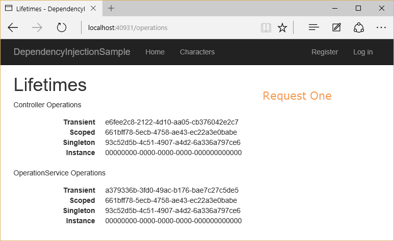
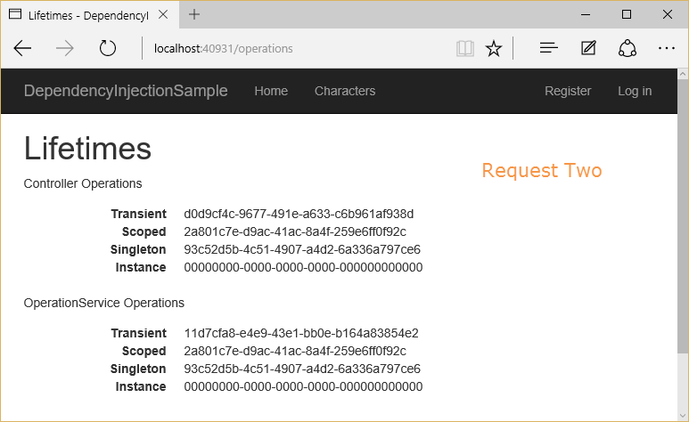

# Introduction to Dependency Injection in ASP.NET Core

<a name=fundamentals-dependency-injection></a>

By [Steve Smith](https://ardalis.com/) and [Scott Addie](https://scottaddie.com)

ASP.NET Core is designed from the ground up to support and leverage dependency injection. ASP.NET Core applications can leverage built-in framework services by having them injected into methods in the Startup class, and application services can be configured for injection as well. The default services container provided by ASP.NET Core provides a minimal feature set and is not intended to replace other containers.

[View or download sample code](https://github.com/aspnet/Docs/tree/master/aspnetcore/fundamentals/dependency-injection/sample)

## What is Dependency Injection?

Dependency injection (DI) is a technique for achieving loose coupling between objects and their collaborators, or dependencies. Rather than directly instantiating collaborators, or using static references, the objects a class needs in order to perform its actions are provided to the class in some fashion. Most often, classes will declare their dependencies via their constructor, allowing them to follow the [Explicit Dependencies Principle](http://deviq.com/explicit-dependencies-principle/). This approach is known as "constructor injection".

When classes are designed with DI in mind, they are more loosely coupled because they do not have direct, hard-coded dependencies on their collaborators. This follows the [Dependency Inversion Principle](http://deviq.com/dependency-inversion-principle/), which states that *"high level modules should not depend on low level modules; both should depend on abstractions."* Instead of referencing specific implementations, classes request abstractions (typically `interfaces`) which are provided to them when the class is constructed. Extracting dependencies into interfaces and providing implementations of these interfaces as parameters is also an example of the [Strategy design pattern](http://deviq.com/strategy-design-pattern/).

When a system is designed to use DI, with many classes requesting their dependencies via their constructor (or properties), it's helpful to have a class dedicated to creating these classes with their associated dependencies. These classes are referred to as *containers*, or more specifically, [Inversion of Control (IoC)](http://deviq.com/inversion-of-control/) containers or Dependency Injection (DI) containers. A container is essentially a factory that is responsible for providing instances of types that are requested from it. If a given type has declared that it has dependencies, and the container has been configured to provide the dependency types, it will create the dependencies as part of creating the requested instance. In this way, complex dependency graphs can be provided to classes without the need for any hard-coded object construction. In addition to creating objects with their dependencies, containers typically manage object lifetimes within the application.

ASP.NET Core includes a simple built-in container (represented by the `IServiceProvider` interface) that supports constructor injection by default, and ASP.NET makes certain services available through DI. ASP.NET's container refers to the types it manages as *services*. Throughout the rest of this article, *services* will refer to types that are managed by ASP.NET Core's IoC container. You configure the built-in container's services in the `ConfigureServices` method in your application's `Startup` class.

> [!NOTE]
> Martin Fowler has written an extensive article on [Inversion of Control Containers and the Dependency Injection Pattern](https://www.martinfowler.com/articles/injection.html). Microsoft Patterns and Practices also has a great description of [Dependency Injection](https://msdn.microsoft.com/library/hh323705.aspx).

> [!NOTE]
> This article covers Dependency Injection as it applies to all ASP.NET applications. Dependency Injection within MVC controllers is covered in [Dependency Injection and Controllers](../mvc/controllers/dependency-injection.md).

### Constructor Injection Behavior

Constructor injection requires that the constructor in question be *public*. Otherwise, your app will throw an `InvalidOperationException`:

> A suitable constructor for type 'YourType' could not be located. Ensure the type is concrete and services are registered for all parameters of a public constructor.


Constructor injection requires that only one applicable constructor exist. Constructor overloads are supported, but only one overload can exist whose arguments can all be fulfilled by dependency injection. If more than one exists, your app will throw an `InvalidOperationException`:

> Multiple constructors accepting all given argument types have been found in type 'YourType'. There should only be one applicable constructor.

Constructors can accept arguments that are not provided by dependency injection, but these must support default values. For example:

```csharp
// throws InvalidOperationException: Unable to resolve service for type 'System.String'...
public CharactersController(ICharacterRepository characterRepository, string title)
{
    _characterRepository = characterRepository;
    _title = title;
}

// runs without error
public CharactersController(ICharacterRepository characterRepository, string title = "Characters")
{
    _characterRepository = characterRepository;
    _title = title;
}
```

## Using Framework-Provided Services

The `ConfigureServices` method in the `Startup` class is responsible for defining the services the application will use, including platform features like Entity Framework Core and ASP.NET Core MVC. Initially, the `IServiceCollection` provided to `ConfigureServices` has the following services defined (depending on [how the host was configured](xref:fundamentals/hosting)):

| Service Type | Lifetime |
| ----- | ------- |
| [Microsoft.AspNetCore.Hosting.IHostingEnvironment](https://docs.microsoft.com/aspnet/core/api/microsoft.aspnetcore.hosting.ihostingenvironment) | Singleton |
| [Microsoft.Extensions.Logging.ILoggerFactory](https://docs.microsoft.com/aspnet/core/api/microsoft.extensions.logging.iloggerfactory) | Singleton |
| [Microsoft.Extensions.Logging.ILogger&lt;T&gt;](https://docs.microsoft.com/aspnet/core/api/microsoft.extensions.logging.ilogger) | Singleton |
| [Microsoft.AspNetCore.Hosting.Builder.IApplicationBuilderFactory](https://docs.microsoft.com/aspnet/core/api/microsoft.aspnetcore.hosting.builder.iapplicationbuilderfactory) | Transient |
| [Microsoft.AspNetCore.Http.IHttpContextFactory](https://docs.microsoft.com/aspnet/core/api/microsoft.aspnetcore.http.ihttpcontextfactory) | Transient |
| [Microsoft.Extensions.Options.IOptions&lt;T&gt;](https://docs.microsoft.com/aspnet/core/api/microsoft.extensions.options.ioptions-1) | Singleton |
| [System.Diagnostics.DiagnosticSource](https://docs.microsoft.com/dotnet/core/api/system.diagnostics.diagnosticsource) | Singleton |
| [System.Diagnostics.DiagnosticListener](https://docs.microsoft.com/dotnet/core/api/system.diagnostics.diagnosticlistener) | Singleton |
| [Microsoft.AspNetCore.Hosting.IStartupFilter](https://docs.microsoft.com/aspnet/core/api/microsoft.aspnetcore.hosting.istartupfilter) | Transient |
| [Microsoft.Extensions.ObjectPool.ObjectPoolProvider](https://docs.microsoft.com/aspnet/core/api/microsoft.extensions.objectpool.objectpoolprovider) | Singleton |
| [Microsoft.Extensions.Options.IConfigureOptions&lt;T&gt;](https://docs.microsoft.com/aspnet/core/api/microsoft.extensions.options.iconfigureoptions-1) | Transient |
| [Microsoft.AspNetCore.Hosting.Server.IServer](https://docs.microsoft.com/aspnet/core/api/microsoft.aspnetcore.hosting.server.iserver) | Singleton |
| [Microsoft.AspNetCore.Hosting.IStartup](https://docs.microsoft.com/aspnet/core/api/microsoft.aspnetcore.hosting.istartup) | Singleton |
| [Microsoft.AspNetCore.Hosting.IApplicationLifetime](https://docs.microsoft.com/aspnet/core/api/microsoft.aspnetcore.hosting.iapplicationlifetime) | Singleton |

Below is an example of how to add additional services to the container using a number of extension methods like `AddDbContext`, `AddIdentity`, and `AddMvc`.

[!code-csharp[Main](../common/samples/WebApplication1/Startup.cs?highlight=5-6,8-10,12&range=39-56)]

The features and middleware provided by ASP.NET, such as MVC, follow a convention of using a single Add*ServiceName* extension method to register all of the services required by that feature.

>[!TIP]
> You can request certain framework-provided services within `Startup` methods through their parameter lists - see [Application Startup](startup.md) for more details.

## Registering Your Own Services

You can register your own application services as follows. The first generic type represents the type (typically an interface) that will be requested from the container. The second generic type represents the concrete type that will be instantiated by the container and used to fulfill such requests.

[!code-csharp[Main](../common/samples/WebApplication1/Startup.cs?range=53-54)]

> [!NOTE]
> Each `services.Add<ServiceName>` extension method adds (and potentially configures) services. For example, `services.AddMvc()` adds the services MVC requires. It's recommended that you follow this convention, placing extension methods in the `Microsoft.Extensions.DependencyInjection` namespace, to encapsulate groups of service registrations.

The `AddTransient` method is used to map abstract types to concrete services that are instantiated separately for every object that requires it. This is known as the service's *lifetime*, and additional lifetime options are described below. It is important to choose an appropriate lifetime for each of the services you register. Should a new instance of the service be provided to each class that requests it? Should one instance be used throughout a given web request? Or should a single instance be used for the lifetime of the application?

In the sample for this article, there is a simple controller that displays character names, called `CharactersController`. Its `Index` method displays the current list of characters that have been stored in the application, and initializes the collection with a handful of characters if none exist. Note that although this application uses Entity Framework Core and the `ApplicationDbContext` class for its persistence, none of that is apparent in the controller. Instead, the specific data access mechanism has been abstracted behind an interface, `ICharacterRepository`, which follows the [repository pattern](http://deviq.com/repository-pattern/). An instance of `ICharacterRepository` is requested via the constructor and assigned to a private field, which is then used to access characters as necessary.

[!code-csharp[Main](../fundamentals/dependency-injection/sample/DependencyInjectionSample/Controllers/CharactersController.cs?highlight=3,5,6,7,8,14,21-27&range=8-36)]

The `ICharacterRepository` defines the two methods the controller needs to work with `Character` instances.

[!code-csharp[Main](../fundamentals/dependency-injection/sample/DependencyInjectionSample/Interfaces/ICharacterRepository.cs?highlight=8,9)]

This interface is in turn implemented by a concrete type, `CharacterRepository`, that is used at runtime.

> [!NOTE]
> The way DI is used with the `CharacterRepository` class is a general model you can follow for all of your application services, not just in "repositories" or data access classes.

[!code-csharp[Main](../fundamentals/dependency-injection/sample/DependencyInjectionSample/Models/CharacterRepository.cs?highlight=9,11,12,13,14)]

Note that `CharacterRepository` requests an `ApplicationDbContext` in its constructor. It is not unusual for dependency injection to be used in a chained fashion like this, with each requested dependency in turn requesting its own dependencies. The container is responsible for resolving all of the dependencies in the graph and returning the fully resolved service.

> [!NOTE]
> Creating the requested object, and all of the objects it requires, and all of the objects those require, is sometimes referred to as an *object graph*. Likewise, the collective set of dependencies that must be resolved is typically referred to as a *dependency tree* or *dependency graph*.

In this case, both `ICharacterRepository` and in turn `ApplicationDbContext` must be registered with the services container in `ConfigureServices` in `Startup`. `ApplicationDbContext` is configured with the call to the extension method `AddDbContext<T>`. The following code shows the registration of the `CharacterRepository` type.

[!code-csharp[Main](dependency-injection/sample/DependencyInjectionSample/Startup.cs?highlight=3-5,11&range=16-32)]

Entity Framework contexts should be added to the services container using the `Scoped` lifetime. This is taken care of automatically if you use the helper methods as shown above. Repositories that will make use of Entity Framework should use the same lifetime.

>[!WARNING]
> The main danger to be wary of is resolving a `Scoped` service from a singleton. It's likely in such a case that the service will have incorrect state when processing subsequent requests.

Services that have dependencies should register them in the container. If a service's constructor requires a primitive, such as a `string`, this can be injected by using the [options pattern and configuration](configuration.md).

## Service Lifetimes and Registration Options

ASP.NET services can be configured with the following lifetimes:

**Transient**

Transient lifetime services are created each time they are requested. This lifetime works best for lightweight, stateless services.

**Scoped**

Scoped lifetime services are created once per request.

**Singleton**

Singleton lifetime services are created the first time they are requested (or when `ConfigureServices` is run if you specify an instance there) and then every subsequent request will use the same instance. If your application requires singleton behavior, allowing the services container to manage the service's lifetime is recommended instead of implementing the singleton design pattern and managing your object's lifetime in the class yourself.

Services can be registered with the container in several ways. We have already seen how to register a service implementation with a given type by specifying the concrete type to use. In addition, a factory can be specified, which will then be used to create the instance on demand. The third approach is to directly specify the instance of the type to use, in which case the container will never attempt to create an instance (nor will it dispose of the instance).

To demonstrate the difference between these lifetime and registration options, consider a simple interface that represents one or more tasks as an *operation* with a unique identifier, `OperationId`. Depending on how we configure the lifetime for this service, the container will provide either the same or different instances of the service to the requesting class. To make it clear which lifetime is being requested, we will create one type per lifetime option:

[!code-csharp[Main](../fundamentals/dependency-injection/sample/DependencyInjectionSample/Interfaces/IOperation.cs?highlight=5-8)]

We implement these interfaces using a single class, `Operation`, that accepts a `Guid` in its constructor, or uses a new `Guid` if none is provided.

Next, in `ConfigureServices`, each type is added to the container according to its named lifetime:

[!code-csharp[Main](dependency-injection/sample/DependencyInjectionSample/Startup.cs?range=26-32)]

Note that the `IOperationSingletonInstance` service is using a specific instance with a known ID of `Guid.Empty` so it will be clear when this type is in use (its Guid will be all zeroes). We have also registered an `OperationService` that depends on each of the other `Operation` types, so that it will be clear within a request whether this service is getting the same instance as the controller, or a new one, for each operation type. All this service does is expose its dependencies as properties, so they can be displayed in the view.

[!code-csharp[Main](dependency-injection/sample/DependencyInjectionSample/Services/OperationService.cs)]

To demonstrate the object lifetimes within and between separate individual requests to the application, the sample includes an `OperationsController` that requests each kind of `IOperation` type as well as an `OperationService`. The `Index` action then displays all of the controller's and service's `OperationId` values.

[!code-csharp[Main](dependency-injection/sample/DependencyInjectionSample/Controllers/OperationsController.cs)]

Now two separate requests are made to this controller action:





Observe which of the `OperationId` values vary within a request, and between requests.

* *Transient* objects are always different; a new instance is provided to every controller and every service.

* *Scoped* objects are the same within a request, but different across different requests

* *Singleton* objects are the same for every object and every request (regardless of whether an instance is provided in `ConfigureServices`)

## Request Services

The services available within an ASP.NET request from `HttpContext` are exposed through the `RequestServices` collection.


Request Services represent the services you configure and request as part of your application. When your objects specify dependencies, these are satisfied by the types found in `RequestServices`, not `ApplicationServices`.

Generally, you shouldn't use these properties directly, preferring instead to request the types your classes you require via your class's constructor, and letting the framework inject these dependencies. This yields classes that are easier to test (see [Testing](../testing/index.md)) and are more loosely coupled.

> [!NOTE]
> Prefer requesting dependencies as constructor parameters to accessing the `RequestServices` collection.

## Designing Your Services For Dependency Injection

You should design your services to use dependency injection to get their collaborators. This means avoiding the use of stateful static method calls (which result in a code smell known as [static cling](http://deviq.com/static-cling/)) and the direct instantiation of dependent classes within your services. It may help to remember the phrase, [New is Glue](https://ardalis.com/new-is-glue), when choosing whether to instantiate a type or to request it via dependency injection. By following the [SOLID Principles of Object Oriented Design](http://deviq.com/solid/), your classes will naturally tend to be small, well-factored, and easily tested.

What if you find that your classes tend to have way too many dependencies being injected? This is generally a sign that your class is trying to do too much, and is probably violating SRP - the [Single Responsibility Principle](http://deviq.com/single-responsibility-principle/). See if you can refactor the class by moving some of its responsibilities into a new class. Keep in mind that your `Controller` classes should be focused on UI concerns, so business rules and data access implementation details should be kept in classes appropriate to these [separate concerns](http://deviq.com/separation-of-concerns/).

With regards to data access specifically, you can inject the `DbContext` into your controllers (assuming you've added EF to the services container in `ConfigureServices`). Some developers prefer to use a repository interface to the database rather than injecting the `DbContext` directly. Using an interface to encapsulate the data access logic in one place can minimize how many places you will have to change when your database changes.

### Disposing of services

The container will call `Dispose` for `IDisposable` types it creates. However, if you add an instance to the container yourself, it will not be disposed.

Example:

```csharp
// Services implement IDisposable:
public class Service1 : IDisposable {}
public class Service2 : IDisposable {}
public class Service3 : IDisposable {}

public void ConfigureServices(IServiceCollection services)
{
    // container will create the instance(s) of these types and will dispose them
    services.AddScoped<Service1>();
    services.AddSingleton<Service2>();

    // container did not create instance so it will NOT dispose it
    services.AddSingleton<Service3>(new Service3());
    services.AddSingleton(new Service3());
}
```

> [!NOTE]
> In version 1.0, the container called dispose on *all* `IDisposable` objects, including those it did not create.

## Replacing the default services container

The built-in services container is meant to serve the basic needs of the framework and most consumer applications built on it. However, developers can replace the built-in container with their preferred container. The `ConfigureServices` method typically returns `void`, but if its signature is changed to return `IServiceProvider`, a different container can be configured and returned. There are many IOC containers available for .NET. In this example, the [Autofac](https://autofac.org/) package is used.

First, install the appropriate container package(s):

* `Autofac`
* `Autofac.Extensions.DependencyInjection`

Next, configure the container in `ConfigureServices` and return an `IServiceProvider`:

```csharp
public IServiceProvider ConfigureServices(IServiceCollection services)
{
    services.AddMvc();
    // Add other framework services

    // Add Autofac
    var containerBuilder = new ContainerBuilder();
    containerBuilder.RegisterModule<DefaultModule>();
    containerBuilder.Populate(services);
    var container = containerBuilder.Build();
    return new AutofacServiceProvider(container);
}
```

> [!NOTE]
> When using a third-party DI container, you must change `ConfigureServices` so that it returns `IServiceProvider` instead of `void`.

Finally, configure Autofac as normal in `DefaultModule`:

```csharp
public class DefaultModule : Module
{
    protected override void Load(ContainerBuilder builder)
    {
        builder.RegisterType<CharacterRepository>().As<ICharacterRepository>();
    }
}
```

At runtime, Autofac will be used to resolve types and inject dependencies. [Learn more about using Autofac and ASP.NET Core](http://docs.autofac.org/en/latest/integration/aspnetcore.html).

### Thread safety

Singleton services need to be thread safe. If a singleton service has a dependency on a transient service, the transient service may also need to be thread safe depending how it’s used by the singleton.

## Recommendations

When working with dependency injection, keep the following recommendations in mind:

* DI is for objects that have complex dependencies. Controllers, services, adapters, and repositories are all examples of objects that might be added to DI.

* Avoid storing data and configuration directly in DI. For example, a user's shopping cart shouldn't typically be added to the services container. Configuration should use the [Options Model](configuration.md#options-config-objects). Similarly, avoid "data holder" objects that only exist to allow access to some other object. It's better to request the actual item needed via DI, if possible.

* Avoid static access to services.

* Avoid service location in your application code.

* Avoid static access to `HttpContext`.

> [!NOTE]
> Like all sets of recommendations, you may encounter situations where ignoring one is required. We have found exceptions to be rare -- mostly very special cases within the framework itself.

Remember, dependency injection is an *alternative* to static/global object access patterns. You will not be able to realize the benefits of DI if you mix it with static object access.

## Additional Resources

* [Application Startup](startup.md)

* [Testing](../testing/index.md)

* [Writing Clean Code in ASP.NET Core with Dependency Injection (MSDN)](https://msdn.microsoft.com/magazine/mt703433.aspx)

* [Container-Managed Application Design, Prelude: Where does the Container Belong?](https://blogs.msdn.microsoft.com/nblumhardt/2008/12/26/container-managed-application-design-prelude-where-does-the-container-belong/)

* [Explicit Dependencies Principle](http://deviq.com/explicit-dependencies-principle/)

* [Inversion of Control Containers and the Dependency Injection Pattern](https://www.martinfowler.com/articles/injection.html) (Fowler)
