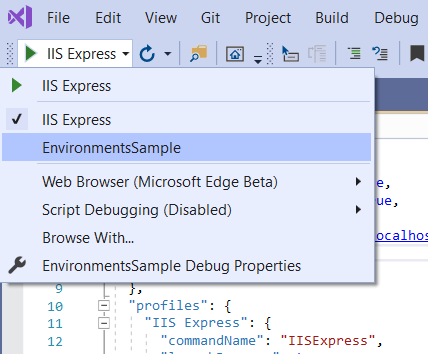
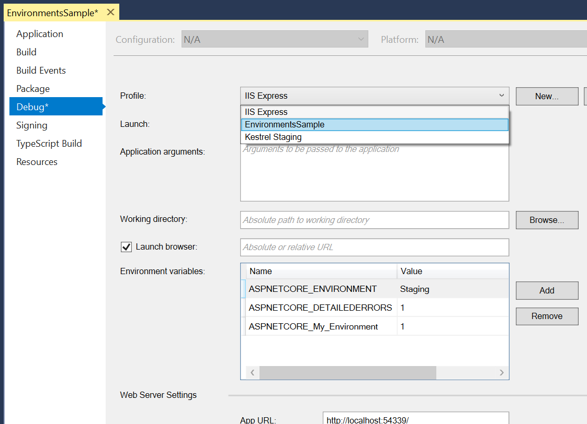
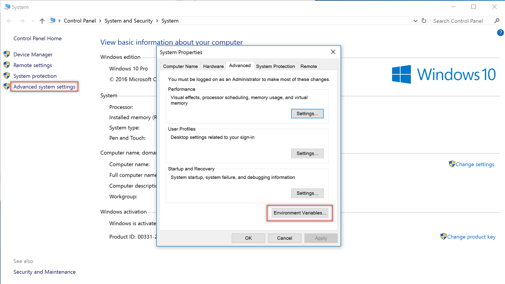
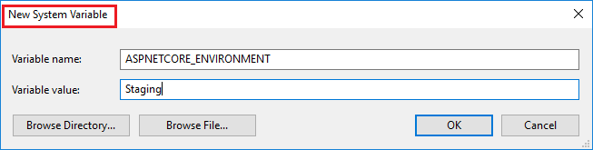

# Use multiple environments in ASP.NET Core

::: moniker range=">= aspnetcore-3.0"

By [Rick Anderson](https://twitter.com/RickAndMSFT) and [Kirk Larkin](https://twitter.com/serpent5)

ASP.NET Core configures app behavior based on the runtime environment using an environment variable.

[View or download sample code](https://github.com/dotnet/AspNetCore.Docs/tree/master/aspnetcore/fundamentals/environments/3.1sample) ([how to download](xref:index#how-to-download-a-sample))

## Environments

To determine the runtime environment, ASP.NET Core reads from the following environment variables:

1. [DOTNET_ENVIRONMENT](xref:fundamentals/configuration/index#default-host-configuration)
1. `ASPNETCORE_ENVIRONMENT` when <xref:Microsoft.Extensions.Hosting.GenericHostBuilderExtensions.ConfigureWebHostDefaults*> is called. The default ASP.NET Core web app templates call `ConfigureWebHostDefaults`. The `ASPNETCORE_ENVIRONMENT` value overrides `DOTNET_ENVIRONMENT`.

`IHostEnvironment.EnvironmentName` can be set to any value, but the following values are provided by the framework:

* <xref:Microsoft.Extensions.Hosting.Environments.Development> : The [launchSettings.json](#lsj) file sets `ASPNETCORE_ENVIRONMENT` to `Development` on the local machine.
* <xref:Microsoft.Extensions.Hosting.Environments.Staging>
* <xref:Microsoft.Extensions.Hosting.Environments.Production> : The default if `DOTNET_ENVIRONMENT` and `ASPNETCORE_ENVIRONMENT` have not been set.

The following code:

* Calls [UseDeveloperExceptionPage](/dotnet/api/microsoft.aspnetcore.builder.developerexceptionpageextensions.usedeveloperexceptionpage) when `ASPNETCORE_ENVIRONMENT` is set to `Development`.
* Calls [UseExceptionHandler](/dotnet/api/microsoft.aspnetcore.builder.exceptionhandlerextensions.useexceptionhandler) when the value of `ASPNETCORE_ENVIRONMENT` is set to `Staging`, `Production`, or  `Staging_2`.
* Injects <xref:Microsoft.AspNetCore.Hosting.IWebHostEnvironment> into `Startup.Configure`. This approach is useful when the app only requires adjusting `Startup.Configure` for a few environments with minimal code differences per environment.
* Is similar to the code generated by the ASP.NET Core templates.

[!code-csharp[](environments/3.1sample/EnvironmentsSample/Startup.cs?name=snippet)]

The [Environment Tag Helper](xref:mvc/views/tag-helpers/builtin-th/environment-tag-helper) uses the value of [IHostEnvironment.EnvironmentName](xref:Microsoft.Extensions.Hosting.IHostEnvironment.EnvironmentName) to include or exclude markup in the element:

[!code-cshtml[](environments/sample-snapshot/EnvironmentsSample/Pages/About.cshtml)]

The [About page](https://github.com/dotnet/AspNetCore.Docs/tree/master/aspnetcore/fundamentals/environments/3.1sample/EnvironmentsSample/Pages/About.cshtml) from the [sample code](https://github.com/dotnet/AspNetCore.Docs/tree/master/aspnetcore/fundamentals/environments/3.1sample) includes the preceding markup and displays the value of `IWebHostEnvironment.EnvironmentName`.

On Windows and macOS, environment variables and values aren't case-sensitive. Linux environment variables and values are **case-sensitive** by default.

### Create EnvironmentsSample

The [sample code](https://github.com/dotnet/AspNetCore.Docs/tree/master/aspnetcore/fundamentals/environments/3.1sample) used in this document is based on a Razor Pages project named *EnvironmentsSample*.

The following code creates and runs a web app named *EnvironmentsSample*:

```bash
dotnet new webapp -o EnvironmentsSample
cd EnvironmentsSample
dotnet run --verbosity normal
```

When the app runs, it displays some of the following output:

```bash
Using launch settings from c:\tmp\EnvironmentsSample\Properties\launchSettings.json
info: Microsoft.Hosting.Lifetime[0]
      Now listening on: https://localhost:5001
info: Microsoft.Hosting.Lifetime[0]
      Application started. Press Ctrl+C to shut down.
info: Microsoft.Hosting.Lifetime[0]
      Hosting environment: Development
info: Microsoft.Hosting.Lifetime[0]
      Content root path: c:\tmp\EnvironmentsSample
```

<a name="lsj"></a>

### Development and launchSettings.json

The development environment can enable features that shouldn't be exposed in production. For example, the ASP.NET Core templates enable the [Developer Exception Page](xref:fundamentals/error-handling#developer-exception-page) in the development environment.

The environment for local machine development can be set in the *Properties\launchSettings.json* file of the project. Environment values set in *launchSettings.json* override values set in the system environment.

The *launchSettings.json* file:

* Is only used on the local development machine.
* Is not deployed.
* contains profile settings.

The following JSON shows the *launchSettings.json* file for an ASP.NET Core web projected named *EnvironmentsSample* created with Visual Studio or `dotnet new`:

[!code-json[](environments/3.1sample/EnvironmentsSample/Properties/launchSettingsCopy.json)]

The preceding markup contains two profiles:

* `IIS Express`: The default profile used when launching the app from Visual Studio. The `"commandName"` key has the value `"IISExpress"`, therefore, [IISExpress](/iis/extensions/introduction-to-iis-express/iis-express-overview) is the web server. You can set the launch profile to the project or any other profile included. For example, in the image below, selecting the project name launches the [Kestrel web server](xref:fundamentals/servers/kestrel).

  
* `EnvironmentsSample`: The profile name is the project name. This profile is used by default when launching the app with `dotnet run`.  The `"commandName"` key has the value `"Project"`, therefore, the [Kestrel web server](xref:fundamentals/servers/kestrel) is launched.

The value of `commandName` can specify the web server to launch. `commandName` can be any one of the following:

* `IISExpress` : Launches IIS Express.
* `IIS` : No web server launched. IIS is expected to be available.
* `Project` : Launches Kestrel.

The Visual Studio project properties **Debug** tab provides a GUI to edit the *launchSettings.json* file. Changes made to project profiles may not take effect until the web server is restarted. Kestrel must be restarted before it can detect changes made to its environment.



The following *launchSettings.json* file contains multiple profiles:

[!code-json[](environments/3.1sample/EnvironmentsSample/Properties/launchSettings.json)]

Profiles can be selected:

* From the Visual Studio UI.
* Using the [`dotnet run`](/dotnet/core/tools/dotnet-run) command in a command shell with the `--launch-profile` option set to the profile's name. *This approach only supports Kestrel profiles.*

  ```dotnetcli
  dotnet run --launch-profile "SampleApp"
  ```

> [!WARNING]
> *launchSettings.json* shouldn't store secrets. The [Secret Manager tool](xref:security/app-secrets) can be used to store secrets for local development.

When using [Visual Studio Code](https://code.visualstudio.com/), environment variables can be set in the *.vscode/launch.json* file. The following example sets several [Host configuration values environment variables](xref:fundamentals/host/web-host#host-configuration-values):

[!code-json[](environments/3.1sample/EnvironmentsSample/.vscode/launch.json?range=4-10,32-38)]

The *.vscode/launch.json* file is only used by Visual Studio Code.

### Production

The production environment should be configured to maximize security, [performance](xref:performance/performance-best-practices), and application robustness. Some common settings that differ from development include:

* [Caching](xref:performance/caching/memory).
* Client-side resources are bundled, minified, and potentially served from a CDN.
* Diagnostic error pages disabled.
* Friendly error pages enabled.
* Production [logging](xref:fundamentals/logging/index) and monitoring enabled. For example, using [Application Insights](/azure/application-insights/app-insights-asp-net-core).

## Set the environment

It's often useful to set a specific environment for testing with an environment variable or platform setting. If the environment isn't set, it defaults to `Production`, which disables most debugging features. The method for setting the environment depends on the operating system.

When the host is built, the last environment setting read by the app determines the app's environment. The app's environment can't be changed while the app is running.

The [About page](https://github.com/dotnet/AspNetCore.Docs/tree/master/aspnetcore/fundamentals/environments/3.1sample/EnvironmentsSample/Pages/About.cshtml) from the [sample code](https://github.com/dotnet/AspNetCore.Docs/tree/master/aspnetcore/fundamentals/environments/3.1sample) displays the value of `IWebHostEnvironment.EnvironmentName`.

### Azure App Service

To set the environment in [Azure App Service](https://azure.microsoft.com/services/app-service/), perform the following steps:

1. Select the app from the **App Services** blade.
1. In the **Settings** group, select the **Configuration** blade.
1. In the **Application settings** tab, select **New application setting**.
1. In the **Add/Edit application setting** window, provide `ASPNETCORE_ENVIRONMENT` for the **Name**. For **Value**, provide the environment (for example, `Staging`).
1. Select the **Deployment slot setting** check box if you wish the environment setting to remain with the current slot when deployment slots are swapped. For more information, see [Set up staging environments in Azure App Service](/azure/app-service/web-sites-staged-publishing) in the Azure documentation.
1. Select **OK** to close the **Add/Edit application setting** window.
1. Select **Save** at the top of the **Configuration** blade.

Azure App Service automatically restarts the app after an app setting is added, changed, or deleted in the Azure portal.

### Windows

Environment values in *launchSettings.json* override values set in the system environment.

To set the `ASPNETCORE_ENVIRONMENT` for the current session when the app is started using [dotnet run](/dotnet/core/tools/dotnet-run), the following commands are used:

**Command prompt**

```console
set ASPNETCORE_ENVIRONMENT=Staging
dotnet run --no-launch-profile
```

**PowerShell**

```powershell
$Env:ASPNETCORE_ENVIRONMENT = "Staging"
dotnet run --no-launch-profile
```

The preceding command sets `ASPNETCORE_ENVIRONMENT` only for processes launched from that command window.

To set the value globally in Windows, use either of the following approaches:

* Open the **Control Panel** > **System** > **Advanced system settings** and add or edit the `ASPNETCORE_ENVIRONMENT` value:

  

  

* Open an administrative command prompt and use the `setx` command or open an administrative PowerShell command prompt and use `[Environment]::SetEnvironmentVariable`:

  **Command prompt**

  ```console
  setx ASPNETCORE_ENVIRONMENT Staging /M
  ```

  The `/M` switch indicates to set the environment variable at the system level. If the `/M` switch isn't used, the environment variable is set for the user account.

  **PowerShell**

  ```powershell
  [Environment]::SetEnvironmentVariable("ASPNETCORE_ENVIRONMENT", "Staging", "Machine")
  ```

  The `Machine` option value indicates to set the environment variable at the system level. If the option value is changed to `User`, the environment variable is set for the user account.

When the `ASPNETCORE_ENVIRONMENT` environment variable is set globally, it takes effect for `dotnet run` in any command window opened after the value is set. Environment values in *launchSettings.json* override values set in the system environment.

**web.config**

To set the `ASPNETCORE_ENVIRONMENT` environment variable with *web.config*, see the *Setting environment variables* section of <xref:host-and-deploy/aspnet-core-module#setting-environment-variables>.

**Project file or publish profile**

**For Windows IIS deployments:** Include the `<EnvironmentName>` property in the [publish profile (.pubxml)](xref:host-and-deploy/visual-studio-publish-profiles) or project file. This approach sets the environment in *web.config* when the project is published:

```xml
<PropertyGroup>
  <EnvironmentName>Development</EnvironmentName>
</PropertyGroup>
```

**Per IIS Application Pool**

To set the `ASPNETCORE_ENVIRONMENT` environment variable for an app running in an isolated Application Pool (supported on IIS 10.0 or later), see the *AppCmd.exe command* section of the [Environment Variables &lt;environmentVariables&gt;](/iis/configuration/system.applicationHost/applicationPools/add/environmentVariables/#appcmdexe) topic. When the `ASPNETCORE_ENVIRONMENT` environment variable is set for an app pool, its value overrides a setting at the system level.

When hosting an app in IIS and adding or changing the `ASPNETCORE_ENVIRONMENT` environment variable, use any one of the following approaches to have the new value picked up by apps:

* Execute `net stop was /y` followed by `net start w3svc` from a command prompt.
* Restart the server.

#### macOS

Setting the current environment for macOS can be performed in-line when running the app:

```bash
ASPNETCORE_ENVIRONMENT=Staging dotnet run
```

Alternatively, set the environment with `export` prior to running the app:

```bash
export ASPNETCORE_ENVIRONMENT=Staging
```

Machine-level environment variables are set in the *.bashrc* or *.bash_profile* file. Edit the file using any text editor. Add the following statement:

```bash
export ASPNETCORE_ENVIRONMENT=Staging
```

#### Linux

For Linux distributions, use the `export` command at a command prompt for session-based variable settings and *bash_profile* file for machine-level environment settings.

### Set the environment in code

Call <xref:Microsoft.Extensions.Hosting.HostingHostBuilderExtensions.UseEnvironment*> when building the host. See <xref:fundamentals/host/generic-host#environmentname>.

### Configuration by environment

To load configuration by environment, see <xref:fundamentals/configuration/index#json-configuration-provider>.

## Environment-based Startup class and methods

### Inject IWebHostEnvironment into the Startup class

Inject <xref:Microsoft.AspNetCore.Hosting.IWebHostEnvironment> into the `Startup` constructor. This approach is useful when the app requires configuring `Startup` for only a few environments with minimal code differences per environment.

In the following example:

* The environment is held in the `_env` field.
* `_env` is used in `ConfigureServices` and `Configure` to apply startup configuration based on the app's environment.

[!code-csharp[](environments/3.1sample/EnvironmentsSample/StartupInject.cs?name=snippet&highlight=3-11)]

### Startup class conventions

When an ASP.NET Core app starts, the [Startup class](xref:fundamentals/startup) bootstraps the app. The app can define multiple `Startup` classes for different environments. The appropriate `Startup` class is selected at runtime. The class whose name suffix matches the current environment is prioritized. If a matching `Startup{EnvironmentName}` class isn't found, the `Startup` class is used. This approach is useful when the app requires configuring startup for several environments with many code differences per environment. Typical apps will not need this approach.

To implement environment-based `Startup` classes, create a `Startup{EnvironmentName}` classes and a fallback `Startup` class:

[!code-csharp[](environments/3.1sample/EnvironmentsSample/StartupClassConventions.cs?name=snippet)]

Use the [UseStartup(IWebHostBuilder, String)](/dotnet/api/microsoft.aspnetcore.hosting.hostingabstractionswebhostbuilderextensions.usestartup) overload that accepts an assembly name:

[!code-csharp[](environments/3.1sample/EnvironmentsSample/Program.cs?name=snippet)]

### Startup method conventions

[Configure](xref:Microsoft.AspNetCore.Hosting.StartupBase.Configure%2A) and [ConfigureServices](xref:Microsoft.AspNetCore.Hosting.StartupBase.ConfigureServices%2A) support environment-specific versions of the form `Configure<EnvironmentName>` and `Configure<EnvironmentName>Services`. If a matching `Configure<EnvironmentName>Services` or `Configure<EnvironmentName>` method isn't found, the `ConfigureServices` or `Configure` method is used, respectively. This approach is useful when the app requires configuring startup for several environments with many code differences per environment:

[!code-csharp[](environments/3.1sample/EnvironmentsSample/StartupMethodConventions.cs?name=snippet)]

## Additional resources

* <xref:fundamentals/startup>
* <xref:fundamentals/configuration/index>
* <xref:blazor/fundamentals/environments>

::: moniker-end

::: moniker range="< aspnetcore-3.0"

By [Rick Anderson](https://twitter.com/RickAndMSFT)

ASP.NET Core configures app behavior based on the runtime environment using an environment variable.

[View or download sample code](https://github.com/dotnet/AspNetCore.Docs/tree/master/aspnetcore/fundamentals/environments/sample) ([how to download](xref:index#how-to-download-a-sample))

## Environments

ASP.NET Core reads the environment variable `ASPNETCORE_ENVIRONMENT` at app startup and stores the value in [IHostingEnvironment.EnvironmentName](xref:Microsoft.AspNetCore.Hosting.IHostingEnvironment.EnvironmentName). `ASPNETCORE_ENVIRONMENT` can be set to any value, but three values are provided by the framework:

* <xref:Microsoft.AspNetCore.Hosting.EnvironmentName.Development>
* <xref:Microsoft.AspNetCore.Hosting.EnvironmentName.Staging>
* <xref:Microsoft.AspNetCore.Hosting.EnvironmentName.Production> (default)

[!code-csharp[](environments/sample/EnvironmentsSample/Startup.cs?name=snippet)]

The preceding code:

* Calls [UseDeveloperExceptionPage](/dotnet/api/microsoft.aspnetcore.builder.developerexceptionpageextensions.usedeveloperexceptionpage) when `ASPNETCORE_ENVIRONMENT` is set to `Development`.
* Calls [UseExceptionHandler](/dotnet/api/microsoft.aspnetcore.builder.exceptionhandlerextensions.useexceptionhandler) when the value of `ASPNETCORE_ENVIRONMENT` is set one of the following:

  * `Staging`
  * `Production`
  * `Staging_2`

The [Environment Tag Helper](xref:mvc/views/tag-helpers/builtin-th/environment-tag-helper) uses the value of `IHostingEnvironment.EnvironmentName` to include or exclude markup in the element:

[!code-cshtml[](environments/sample-snapshot/EnvironmentsSample/Pages/About.cshtml)]

On Windows and macOS, environment variables and values aren't case-sensitive. Linux environment variables and values are case-sensitive by default.

### Development

The development environment can enable features that shouldn't be exposed in production. For example, the ASP.NET Core templates enable the [Developer Exception Page](xref:fundamentals/error-handling#developer-exception-page) in the development environment.

The environment for local machine development can be set in the *Properties\launchSettings.json* file of the project. Environment values set in *launchSettings.json* override values set in the system environment.

The following JSON shows three profiles from a *launchSettings.json* file:

```json
{
  "iisSettings": {
    "windowsAuthentication": false,
    "anonymousAuthentication": true,
    "iisExpress": {
      "applicationUrl": "http://localhost:54339/",
      "sslPort": 0
    }
  },
  "profiles": {
    "IIS Express": {
      "commandName": "IISExpress",
      "launchBrowser": true,
      "environmentVariables": {
        "ASPNETCORE_My_Environment": "1",
        "ASPNETCORE_DETAILEDERRORS": "1",
        "ASPNETCORE_ENVIRONMENT": "Staging"
      }
    },
    "EnvironmentsSample": {
      "commandName": "Project",
      "launchBrowser": true,
      "environmentVariables": {
        "ASPNETCORE_ENVIRONMENT": "Staging"
      },
      "applicationUrl": "http://localhost:54340/"
    },
    "Kestrel Staging": {
      "commandName": "Project",
      "launchBrowser": true,
      "environmentVariables": {
        "ASPNETCORE_My_Environment": "1",
        "ASPNETCORE_DETAILEDERRORS": "1",
        "ASPNETCORE_ENVIRONMENT": "Staging"
      },
      "applicationUrl": "http://localhost:51997/"
    }
  }
}
```

> [!NOTE]
> The `applicationUrl` property in *launchSettings.json* can specify a list of server URLs. Use a semicolon between the URLs in the list:
>
> ```json
> "EnvironmentsSample": {
>    "commandName": "Project",
>    "launchBrowser": true,
>    "applicationUrl": "https://localhost:5001;http://localhost:5000",
>    "environmentVariables": {
>      "ASPNETCORE_ENVIRONMENT": "Development"
>    }
> }
> ```

When the app is launched with [dotnet run](/dotnet/core/tools/dotnet-run), the first profile with `"commandName": "Project"` is used. The value of `commandName` specifies the web server to launch. `commandName` can be any one of the following:

* `IISExpress`
* `IIS`
* `Project` (which launches Kestrel)

When an app is launched with [dotnet run](/dotnet/core/tools/dotnet-run):

* *launchSettings.json* is read if available. `environmentVariables` settings in *launchSettings.json* override environment variables.
* The hosting environment is displayed.

The following output shows an app started with [dotnet run](/dotnet/core/tools/dotnet-run):

```bash
PS C:\Websites\EnvironmentsSample> dotnet run
Using launch settings from C:\Websites\EnvironmentsSample\Properties\launchSettings.json...
Hosting environment: Staging
Content root path: C:\Websites\EnvironmentsSample
Now listening on: http://localhost:54340
Application started. Press Ctrl+C to shut down.
```

The Visual Studio project properties **Debug** tab provides a GUI to edit the *launchSettings.json* file:


Changes made to project profiles may not take effect until the web server is restarted. Kestrel must be restarted before it can detect changes made to its environment.

> [!WARNING]
> *launchSettings.json* shouldn't store secrets. The [Secret Manager tool](xref:security/app-secrets) can be used to store secrets for local development.

When using [Visual Studio Code](https://code.visualstudio.com/), environment variables can be set in the *.vscode/launch.json* file. The following example sets the environment to `Development`:

```json
{
   "version": "0.2.0",
   "configurations": [
        {
            "name": ".NET Core Launch (web)",

            ... additional VS Code configuration settings ...

            "env": {
                "ASPNETCORE_ENVIRONMENT": "Development"
            }
        }
    ]
}
```

A *.vscode/launch.json* file in the project isn't read when starting the app with `dotnet run` in the same way as *Properties/launchSettings.json*. When launching an app in development that doesn't have a *launchSettings.json* file, either set the environment with an environment variable or a command-line argument to the `dotnet run` command.

### Production

The production environment should be configured to maximize security, performance, and app robustness. Some common settings that differ from development include:

* Caching.
* Client-side resources are bundled, minified, and potentially served from a CDN.
* Diagnostic error pages disabled.
* Friendly error pages enabled.
* Production logging and monitoring enabled. For example, [Application Insights](/azure/application-insights/app-insights-asp-net-core).

## Set the environment

It's often useful to set a specific environment for testing with an environment variable or platform setting. If the environment isn't set, it defaults to `Production`, which disables most debugging features. The method for setting the environment depends on the operating system.

When the host is built, the last environment setting read by the app determines the app's environment. The app's environment can't be changed while the app is running.

### Environment variable or platform setting

#### Azure App Service

To set the environment in [Azure App Service](https://azure.microsoft.com/services/app-service/), perform the following steps:

1. Select the app from the **App Services** blade.
1. In the **Settings** group, select the **Configuration** blade.
1. In the **Application settings** tab, select **New application setting**.
1. In the **Add/Edit application setting** window, provide `ASPNETCORE_ENVIRONMENT` for the **Name**. For **Value**, provide the environment (for example, `Staging`).
1. Select the **Deployment slot setting** check box if you wish the environment setting to remain with the current slot when deployment slots are swapped. For more information, see [Set up staging environments in Azure App Service](/azure/app-service/web-sites-staged-publishing) in the Azure documentation.
1. Select **OK** to close the **Add/Edit application setting** window.
1. Select **Save** at the top of the **Configuration** blade.

Azure App Service automatically restarts the app after an app setting (environment variable) is added, changed, or deleted in the Azure portal.

#### Windows

To set the `ASPNETCORE_ENVIRONMENT` for the current session when the app is started using [dotnet run](/dotnet/core/tools/dotnet-run), the following commands are used:

**Command prompt**

```console
set ASPNETCORE_ENVIRONMENT=Development
```

**PowerShell**

```powershell
$Env:ASPNETCORE_ENVIRONMENT = "Development"
```

These commands only take effect for the current window. When the window is closed, the `ASPNETCORE_ENVIRONMENT` setting reverts to the default setting or machine value.

To set the value globally in Windows, use either of the following approaches:

* Open the **Control Panel** > **System** > **Advanced system settings** and add or edit the `ASPNETCORE_ENVIRONMENT` value:

  

  

* Open an administrative command prompt and use the `setx` command or open an administrative PowerShell command prompt and use `[Environment]::SetEnvironmentVariable`:

  **Command prompt**

  ```console
  setx ASPNETCORE_ENVIRONMENT Development /M
  ```

  The `/M` switch indicates to set the environment variable at the system level. If the `/M` switch isn't used, the environment variable is set for the user account.

  **PowerShell**

  ```powershell
  [Environment]::SetEnvironmentVariable("ASPNETCORE_ENVIRONMENT", "Development", "Machine")
  ```

  The `Machine` option value indicates to set the environment variable at the system level. If the option value is changed to `User`, the environment variable is set for the user account.

When the `ASPNETCORE_ENVIRONMENT` environment variable is set globally, it takes effect for `dotnet run` in any command window opened after the value is set.

**web.config**

To set the `ASPNETCORE_ENVIRONMENT` environment variable with *web.config*, see the *Setting environment variables* section of <xref:host-and-deploy/aspnet-core-module#setting-environment-variables>.

**Project file or publish profile**

**For Windows IIS deployments:** Include the `<EnvironmentName>` property in the [publish profile (.pubxml)](xref:host-and-deploy/visual-studio-publish-profiles) or project file. This approach sets the environment in *web.config* when the project is published:

```xml
<PropertyGroup>
  <EnvironmentName>Development</EnvironmentName>
</PropertyGroup>
```

**Per IIS Application Pool**

To set the `ASPNETCORE_ENVIRONMENT` environment variable for an app running in an isolated Application Pool (supported on IIS 10.0 or later), see the *AppCmd.exe command* section of the [Environment Variables &lt;environmentVariables&gt;](/iis/configuration/system.applicationHost/applicationPools/add/environmentVariables/#appcmdexe) topic. When the `ASPNETCORE_ENVIRONMENT` environment variable is set for an app pool, its value overrides a setting at the system level.

> [!IMPORTANT]
> When hosting an app in IIS and adding or changing the `ASPNETCORE_ENVIRONMENT` environment variable, use any one of the following approaches to have the new value picked up by apps:
>
> * Execute `net stop was /y` followed by `net start w3svc` from a command prompt.
> * Restart the server.

#### macOS

Setting the current environment for macOS can be performed in-line when running the app:

```bash
ASPNETCORE_ENVIRONMENT=Development dotnet run
```

Alternatively, set the environment with `export` prior to running the app:

```bash
export ASPNETCORE_ENVIRONMENT=Development
```

Machine-level environment variables are set in the *.bashrc* or *.bash_profile* file. Edit the file using any text editor. Add the following statement:

```bash
export ASPNETCORE_ENVIRONMENT=Development
```

#### Linux

For Linux distributions, use the `export` command at a command prompt for session-based variable settings and *bash_profile* file for machine-level environment settings.

### Set the environment in code

Call <xref:Microsoft.AspNetCore.Hosting.HostingAbstractionsWebHostBuilderExtensions.UseEnvironment*> when building the host. See <xref:fundamentals/host/web-host#environment>.

### Configuration by environment

To load configuration by environment, we recommend:

* *appsettings* files (*appsettings.{Environment}.json*). See <xref:fundamentals/configuration/index#json-configuration-provider>.
* Environment variables (set on each system where the app is hosted). See <xref:fundamentals/host/web-host#environment> and <xref:security/app-secrets#environment-variables>.
* Secret Manager (in the Development environment only). See <xref:security/app-secrets>.

## Environment-based Startup class and methods

### Inject IHostingEnvironment into Startup.Configure

Inject <xref:Microsoft.AspNetCore.Hosting.IHostingEnvironment> into `Startup.Configure`. This approach is useful when the app only requires configuring `Startup.Configure` for only a few environments with minimal code differences per environment.

```csharp
public void Configure(IApplicationBuilder app, IHostingEnvironment env)
{
    if (env.IsDevelopment())
    {
        // Development environment code
    }
    else
    {
        // Code for all other environments
    }
}
```

### Inject IHostingEnvironment into the Startup class

Inject <xref:Microsoft.AspNetCore.Hosting.IHostingEnvironment> into the `Startup` constructor and assign the service to a field for use throughout the `Startup` class. This approach is useful when the app requires configuring startup for only a few environments with minimal code differences per environment.

In the following example:

* The environment is held in the `_env` field.
* `_env` is used in `ConfigureServices` and `Configure` to apply startup configuration based on the app's environment.

```csharp
public class Startup
{
    private readonly IHostingEnvironment _env;

    public Startup(IHostingEnvironment env)
    {
        _env = env;
    }

    public void ConfigureServices(IServiceCollection services)
    {
        if (_env.IsDevelopment())
        {
            // Development environment code
        }
        else if (_env.IsStaging())
        {
            // Staging environment code
        }
        else
        {
            // Code for all other environments
        }
    }

    public void Configure(IApplicationBuilder app)
    {
        if (_env.IsDevelopment())
        {
            // Development environment code
        }
        else
        {
            // Code for all other environments
        }
    }
}
```

### Startup class conventions

When an ASP.NET Core app starts, the [Startup class](xref:fundamentals/startup) bootstraps the app. The app can define separate `Startup` classes for different environments (for example, `StartupDevelopment`). The appropriate `Startup` class is selected at runtime. The class whose name suffix matches the current environment is prioritized. If a matching `Startup{EnvironmentName}` class isn't found, the `Startup` class is used. This approach is useful when the app requires configuring startup for several environments with many code differences per environment.

To implement environment-based `Startup` classes, create a `Startup{EnvironmentName}` class for each environment in use and a fallback `Startup` class:

```csharp
// Startup class to use in the Development environment
public class StartupDevelopment
{
    public void ConfigureServices(IServiceCollection services)
    {
    }

    public void Configure(IApplicationBuilder app, IHostingEnvironment env)
    {
    }
}

// Startup class to use in the Production environment
public class StartupProduction
{
    public void ConfigureServices(IServiceCollection services)
    {
    }

    public void Configure(IApplicationBuilder app, IHostingEnvironment env)
    {
    }
}

// Fallback Startup class
// Selected if the environment doesn't match a Startup{EnvironmentName} class
public class Startup
{
    public void ConfigureServices(IServiceCollection services)
    {
    }

    public void Configure(IApplicationBuilder app, IHostingEnvironment env)
    {
    }
}
```

Use the [UseStartup(IWebHostBuilder, String)](/dotnet/api/microsoft.aspnetcore.hosting.hostingabstractionswebhostbuilderextensions.usestartup) overload that accepts an assembly name:

```csharp
public static void Main(string[] args)
{
    CreateWebHostBuilder(args).Build().Run();
}

public static IWebHostBuilder CreateWebHostBuilder(string[] args)
{
    var assemblyName = typeof(Startup).GetTypeInfo().Assembly.FullName;

    return WebHost.CreateDefaultBuilder(args)
        .UseStartup(assemblyName);
}
```

### Startup method conventions

[Configure](xref:Microsoft.AspNetCore.Hosting.StartupBase.Configure%2A) and [ConfigureServices](xref:Microsoft.AspNetCore.Hosting.StartupBase.ConfigureServices%2A) support environment-specific versions of the form `Configure<EnvironmentName>` and `Configure<EnvironmentName>Services`. If a matching `Configure<EnvironmentName>Services` or `Configure<EnvironmentName>` method isn't found, the `ConfigureServices` or `Configure` method is used, respectively. This approach is useful when the app requires configuring startup for several environments with many code differences per environment:

[!code-csharp[](environments/sample/EnvironmentsSample/Startup.cs?name=snippet_all&highlight=15,42)]

## Additional resources

* <xref:fundamentals/startup>
* <xref:fundamentals/configuration/index>

::: moniker-end
