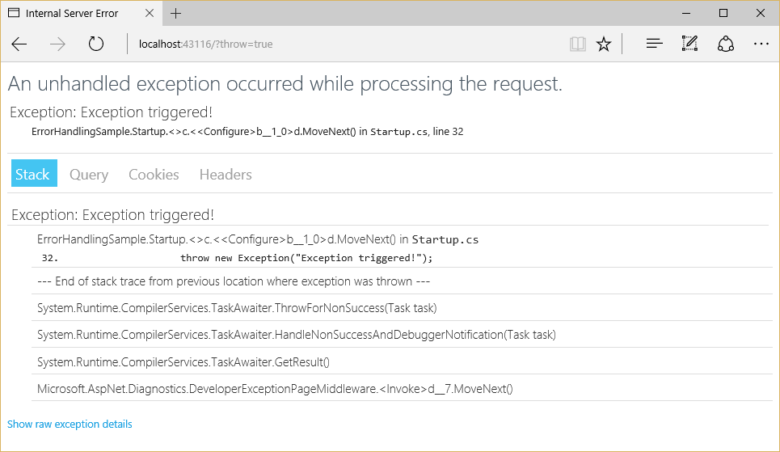
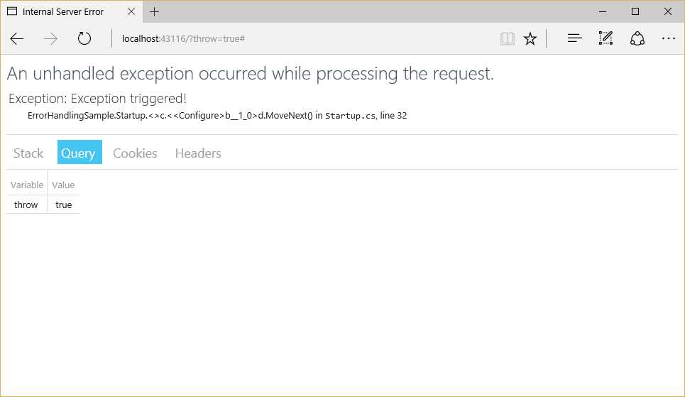
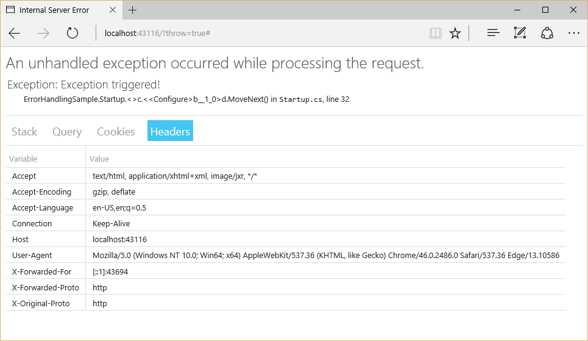
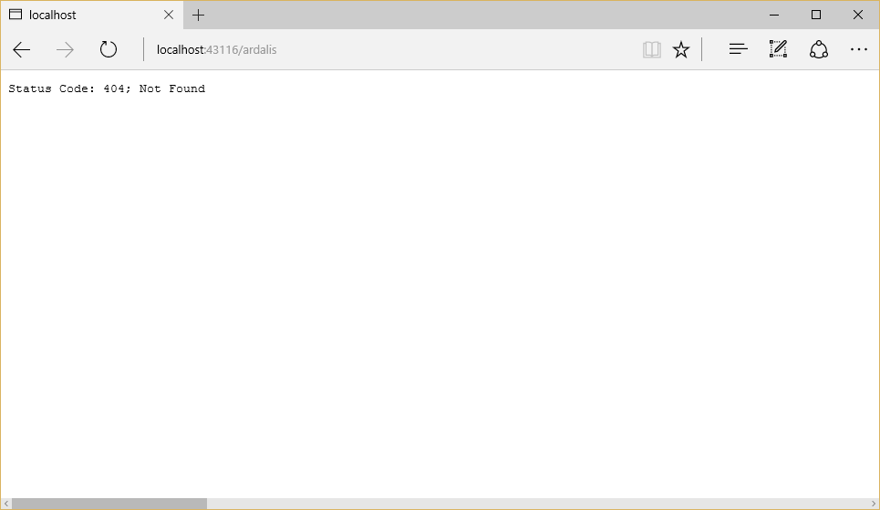

# Introduction to Error Handling in ASP.NET Core

By [Steve Smith](https://ardalis.com/) and [Tom Dykstra](https://github.com/tdykstra/)

This article covers common appoaches to handling errors in ASP.NET Core apps.

[View or download sample code](https://github.com/aspnet/Docs/tree/master/aspnetcore/fundamentals/error-handling/sample)

## The developer exception page

To configure an app to display a page that shows detailed information about exceptions, install the `Microsoft.AspNetCore.Diagnostics` NuGet package and add a line to the [Configure method in the Startup class](startup.md):

[!code-csharp[Main](error-handling/sample/Startup.cs?name=snippet_DevExceptionPage&highlight=7)]

Put `UseDeveloperExceptionPage` before any middleware you want to catch exceptions in, such as `app.UseMvc`.

>[!WARNING]
> Enable the developer exception page **only when the app is running in the Development environment**. You don't want to share detailed exception information publicly when the app runs in production. [Learn more about configuring environments](environments.md).

To see the developer exception page, run the sample application with the environment set to `Development`, and add `?throw=true` to the base URL of the app. The page includes several tabs with information about the exception and the request. The first tab includes a stack trace. 



The next tab shows the query string parameters, if any.



This request didn't have any cookies, but if it did, they would appear on the **Cookies** tab. You can see the headers that were passed in the last tab.



## Configuring a custom exception handling page

It's a good idea to configure an exception handler page to use when the app is not running in the `Development` environment.

[!code-csharp[Main](error-handling/sample/Startup.cs?name=snippet_DevExceptionPage&highlight=11)]

In an MVC app, don't explicitly decorate the error handler action method with HTTP method attributes, such as `HttpGet`. Using explicit verbs could prevent some requests from reaching the method.

```csharp
[Route("/Error")]
public IActionResult Index()
{
    // Handle error here
}
```

## Configuring status code pages

By default, your app will not provide a rich status code page for HTTP status codes such as 500 (Internal Server Error) or 404 (Not Found). You can configure the `StatusCodePagesMiddleware` by adding a line to the `Configure` method:

```csharp
app.UseStatusCodePages();
```

By default, this middleware adds simple, text-only handlers for common status codes, such as 404:



The middleware supports several different extension methods. One takes a lambda expression, another takes a content type and format string.

[!code-csharp[Main](error-handling/sample/Startup.cs?name=snippet_StatusCodePages)]

```csharp
app.UseStatusCodePages("text/plain", "Status code page, status code: {0}");
```

There are also redirect extension methods. One sends a 302 status code to the client, and one returns the original status code to the client but also executes the handler for the redirect URL.

[!code-csharp[Main](error-handling/sample/Startup.cs?name=snippet_StatusCodePagesWithRedirect)]

```csharp
app.UseStatusCodePagesWithReExecute("/error/{0}");
```

If you need to disable status code pages for certain requests, you can do so:

```csharp
var statusCodePagesFeature = context.Features.Get<IStatusCodePagesFeature>();
if (statusCodePagesFeature != null)
{
  statusCodePagesFeature.Enabled = false;
}
```

## Exception-handling code

Code in exception handling pages can throw exceptions. It's often a good idea for production error pages to consist of purely static content.

Also, be aware that once the headers for a response have been sent, you can't change the response's status code, nor can any exception pages or handlers run. The response must be completed or the connection aborted.

## Server exception handling

In addition to the exception handling logic in your app, the [server](servers/index.md) hosting your app performs some exception handling. If the server catches an exception before the headers are sent, the server sends a 500 Internal Server Error response with no body. If the server catches an exception after the headers have been sent, the server closes the connection. Requests that aren't handled by your app are handled by the server. Any exception that occurs is handled by the server's exception handling. Any configured custom error pages or exception handling middleware or filters don't affect this behavior.

## Startup exception handling

Only the hosting layer can handle exceptions that take place during app startup. You can [configure how the host behaves in response to errors during startup](hosting.md#detailed-errors) using `captureStartupErrors` and the `detailedErrors` key.

Hosting can only show an error page for a captured startup error if the error occurs after host address/port binding. If any binding fails for any reason, the hosting layer logs a critical exception, the dotnet process crashes, and no error page is displayed.

## ASP.NET MVC error handling

[MVC](../mvc/index.md) apps have some additional options for handling errors, such as configuring exception filters and performing model validation.

### Exception Filters

Exception filters can be configured globally or on a per-controller or per-action basis in an MVC app. These filters handle any unhandled exception that occurs during the execution of a controller action or another filter, and are not called otherwise. Learn more about exception filters in [Filters](../mvc/controllers/filters.md).

>[!TIP]
> Exception filters are good for trapping exceptions that occur within MVC actions, but they're not as flexible as error handling middleware. Prefer middleware for the general case, and use filters only where you need to do error handling *differently* based on which MVC action was chosen.

### Handling Model State Errors

[Model validation](../mvc/models/validation.md) occurs prior to each controller action being invoked, and it is the action method’s responsibility to inspect `ModelState.IsValid` and react appropriately.

Some apps will choose to follow a standard convention for dealing with model validation errors, in which case a [filter](../mvc/controllers/filters.md) may be an appropriate place to implement such a policy. You should test how your actions behave with invalid model states. Learn more in [Testing controller logic](../mvc/controllers/testing.md).


