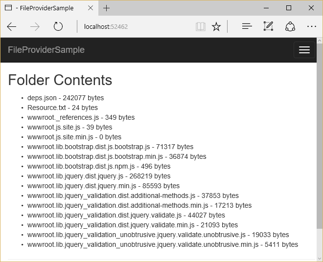

# File Providers in ASP.NET Core

By [Steve Smith](https://ardalis.com/)

ASP.NET Core abstracts file system access through the use of File Providers.

[View or download sample code](https://github.com/aspnet/Docs/tree/master/aspnetcore/fundamentals/file-providers/sample)

## File Provider abstractions

File Providers are an abstraction over file systems. The main interface is `IFileProvider`. `IFileProvider` exposes methods to get file information (`IFileInfo`), directory information (`IDirectoryContents`), and to set up change notifications (using an `IChangeToken`).

`IFileInfo` provides methods and properties about individual files or directories. It has two boolean properties, `Exists` and `IsDirectory`, as well as properties describing the file's `Name`, `Length` (in bytes), and `LastModified` date. You can read from the file using its `CreateReadStream` method.

## File Provider implementations

Three implementations of `IFileProvider` are available: Physical, Embedded, and Composite. The physical provider is used to access the actual system's files. The embedded provider is used to access files embedded in assemblies. The composite provider is used to provide combined access to files and directories from one or more other providers.

### PhysicalFileProvider

The `PhysicalFileProvider` provides access to the physical file system. It wraps the `System.IO.File` type (for the physical provider), scoping all paths to a directory and its children. This scoping limits access to a certain directory and its children, preventing access to the file system outside of this boundary. When instantiating this provider, you must provide it with a directory path, which serves as the base path for all requests made to this provider (and which restricts access outside of this path). In an ASP.NET Core app, you can instantiate a `PhysicalFileProvider` provider directly, or you can request an `IFileProvider` in a Controller or service's constructor through [dependency injection](dependency-injection.md). The latter approach will typically yield a more flexible and testable solution.

The sample below shows how to create a `PhysicalFileProvider`.


```csharp
IFileProvider provider = new PhysicalFileProvider(applicationRoot);
IDirectoryContents contents = provider.GetDirectoryContents(""); // the applicationRoot contents
IFileInfo fileInfo = provider.GetFileInfo("wwwroot/js/site.js"); // a file under applicationRoot
```

You can iterate through its directory contents or get a specific file's information by providing a subpath.

To request a provider from a controller, specify it in the controller's constructor and assign it to a local field. Use the local instance from your action methods:

[!code-csharp[Main](file-providers/sample/src/FileProviderSample/Controllers/HomeController.cs?highlight=5,7,12&range=6-19)]

Then, create the provider in the app's `Startup` class:

[!code-csharp[Main](file-providers/sample/src/FileProviderSample/Startup.cs?highlight=35,40&range=1-43)]

In the *Index.cshtml* view, iterate through the `IDirectoryContents` provided:

[!code-html[Main](file-providers/sample/src/FileProviderSample/Views/Home/Index.cshtml?highlight=2,7,9,11,15)]

The result:


### EmbeddedFileProvider

The `EmbeddedFileProvider` is used to access files embedded in assemblies. In .NET Core, you embed files in an assembly with the `<EmbeddedResource>` element in the *.csproj* file:

[!code-json[Main](file-providers/sample/src/FileProviderSample/FileProviderSample.csproj?range=13-18)]

You can use [globbing patterns](#globbing-patterns) when specifying files to embed in the assembly. These patterns can be used to match one or more files.

> [!NOTE]
> It's unlikely you would ever want to actually embed every .js file in your project in its assembly; the above sample is for demo purposes only.

When creating an `EmbeddedFileProvider`, pass the assembly it will read to its constructor.

<!-- literal_block {"ids": [], "names": [], "highlight_args": {}, "backrefs": [], "dupnames": [], "linenos": false, "classes": [], "xml:space": "preserve", "language": "c#"} -->

```csharp
var embeddedProvider = new EmbeddedFileProvider(Assembly.GetEntryAssembly());
```

The snippet above demonstrates how to create an `EmbeddedFileProvider` with access to the currently executing assembly.

Updating the sample app to use an `EmbeddedFileProvider` results in the following output:



> [!NOTE]
> Embedded resources do not expose directories. Rather, the path to the resource (via its namespace) is embedded in its filename using `.` separators.

> [!TIP]
> The `EmbeddedFileProvider` constructor accepts an optional `baseNamespace` parameter. Specifying this will scope calls to `GetDirectoryContents` to those resources under the provided namespace.

### CompositeFileProvider

The `CompositeFileProvider` combines `IFileProvider` instances, exposing a single interface for working with files from multiple providers. When creating the `CompositeFileProvider`, you pass one or more `IFileProvider` instances to its constructor:

[!code-csharp[Main](file-providers/sample/src/FileProviderSample/Startup.cs?highlight=3&range=35-37)]

Updating the sample app to use a `CompositeFileProvider` that includes both the physical and embedded providers configured previously, results in the following output:


## Watching for changes

The `IFileProvider` `Watch` method provides a way to watch one or more files or directories for changes. This method accepts a path string, which can use [globbing patterns](#globbing-patterns) to specify multiple files, and returns an `IChangeToken`. This token exposes a `HasChanged` property that can be inspected, and a `RegisterChangeCallback` method that is called when changes are detected to the specified path string. Note that each change token only calls its associated callback in response to a single change. To enable constant monitoring, you can use a `TaskCompletionSource` as shown below, or re-create `IChangeToken` instances in response to changes.

In this article's sample, a console application is configured to display a message whenever a text file is modified:

[!code-csharp[Main](file-providers/sample/src/WatchConsole/Program.cs?name=snippet1&highlight=1-2,16,19-20)]

The result, after saving the file several times:


> [!NOTE]
> Some file systems, such as Docker containers and network shares, may not reliably send change notifications. Set the `DOTNET_USE_POLLINGFILEWATCHER` environment variable to `1` or `true` to poll the file system for changes every 4 seconds.

## Globbing patterns

File system paths use wildcard patterns called *globbing patterns*. These simple patterns can be used to specify groups of files. The two wildcard characters are `*` and `**`.

**`*`**

   Matches anything at the current folder level, or any filename, or any file extension. Matches are terminated by `/` and `.` characters in the file path.

<strong><code>**</code></strong>

   Matches anything across multiple directory levels. Can be used to recursively match many files within a directory hierarchy.

### Globbing pattern examples

**`directory/file.txt`**

   Matches a specific file in a specific directory.

**<code>directory/*.txt</code>**

   Matches all files with `.txt` extension in a specific directory.

**`directory/*/bower.json`**

   Matches all `bower.json` files in directories exactly one level below the `directory` directory.

**<code>directory/&#42;&#42;/&#42;.txt</code>**

   Matches all files with `.txt` extension found anywhere under the `directory` directory.

## File Provider usage in ASP.NET Core

Several parts of ASP.NET Core utilize file providers. `IHostingEnvironment` exposes the app's content root and web root as `IFileProvider` types. The static files middleware uses file providers to locate static files. Razor makes heavy use of `IFileProvider` in locating views. Dotnet's publish functionality uses file providers and globbing patterns to specify which files should be published.

## Recommendations for use in apps

If your ASP.NET Core app requires file system access, you can request an instance of `IFileProvider` through dependency injection, and then use its methods to perform the access, as shown in this sample. This allows you to configure the provider once, when the app starts up, and reduces the number of implementation types your app instantiates.
