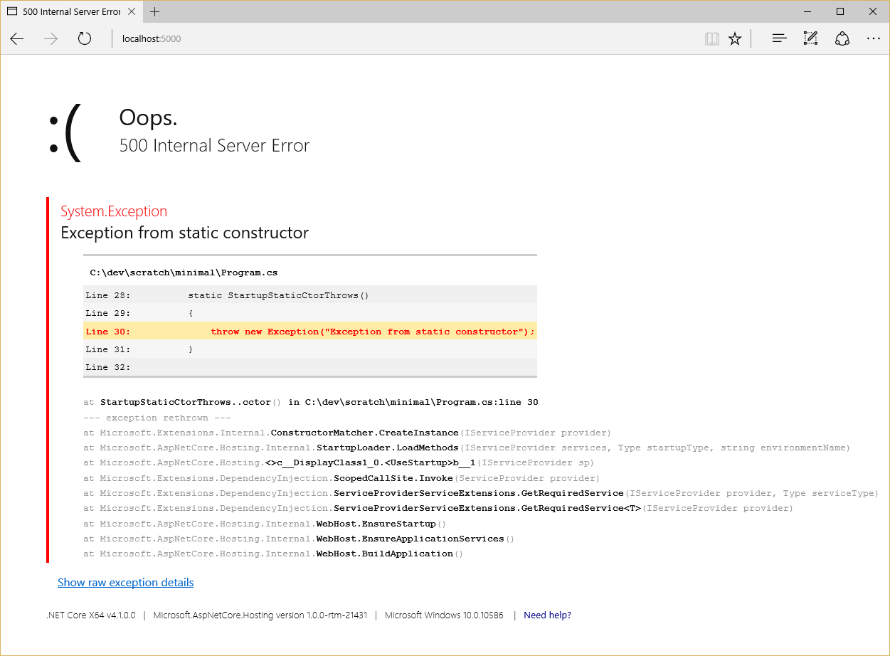

# Introduction to hosting in ASP.NET Core

By [Steve Smith](http://ardalis.com)

To run an ASP.NET Core app, you need to configure and launch a host using `WebHostBuilder`.

## What is a Host?

ASP.NET Core apps require a *host* in which to execute. A host must implement the `IWebHost` interface, which exposes collections of features and services, and a `Start` method. The host is typically created using an instance of a `WebHostBuilder`, which builds and returns a  `WebHost` instance. The `WebHost` references the server that will handle requests. Learn more about [servers](servers/index.md).

### What is the difference between a host and a server?

The host is responsible for application startup and lifetime management. The server is responsible for accepting HTTP requests. Part of the host's responsibility includes ensuring the application's services and the server are available and properly configured. You can think of the host as being a wrapper around the server. The host is configured to use a particular server; the server is unaware of its host.

## Setting up a Host

# [ASP.NET Core 1.x](#tab/aspnetcore1x)

You create a host using an instance of `WebHostBuilder`. This is typically done in your app's entry point: `public static void Main` (which in the project templates is located in a *Program.cs* file). A typical *Program.cs*, shown below, demonstrates how to use a `WebHostBuilder` to build a host.

[!code-csharp[Main](../common/samples/WebApplication1/Program.cs?highlight=14,15,16,17,18,19,20,21)]

The `WebHostBuilder` is responsible for creating the host that will bootstrap the server for the app. `WebHostBuilder` requires you provide a server that implements `IServer` (`UseKestrel` in the code above). `UseKestrel` specifies the Kestrel server will be used by the app.

The server's *content root* determines where it searches for content files, like MVC View files. The default content root is the folder from which the application is run.

> [!NOTE]
> Specifying `Directory.GetCurrentDirectory` as the content root will use the web project's root folder as the app's content root when the app is started from this folder (for example, calling `dotnet run` from the web project folder). This is the default used in Visual Studio and `dotnet new` templates.

To use IIS as a reverse proxy, call `UseIISIntegration` as part of building the host. 

Note that `UseIISIntegration` doesn't configure a *server*, like `UseKestrel` does. To use IIS with ASP.NET Core, you must specify both `UseKestrel` and `UseIISIntegration`. `UseKestrel` creates the web server and hosts the app. `UseIISIntegration` examines environment variables used by IIS/IISExpress and configures settings such as the port to listen on and the headers to use.

# [ASP.NET Core 2.x](#tab/aspnetcore2x)

You create a host using an instance of `WebHostBuilder`. This is typically done in your app's entry point: `public static void Main` (which in the project templates is located in a *Program.cs* file). A typical *Program.cs*, shown below, calls `CreateDefaultbuilder` to build a host:

[!code-csharp[Main](../common/samples/WebApplication1DotNetCore2.0App/Program.cs?name=snippet_Main&highlight=9)]

`CreateDefaultbuilder` creates an instance of `WebHostBuilder` to build the host that bootstraps the server for the app. The host requires a [server that implements IServer](servers/index.md). The built-in servers are [Kestrel](servers/kestrel.md) and [HTTP.sys](servers/httpsys.md); `CreateDefaultbuilder` use Kestrel by default.

`CreateDefaultbuilder` performs set-up tasks in addition to configuring Kestrel as the web server:

* Sets the content root to `Directory.GetCurrentDirectory`.
* Loads configuration from:
  * *appsettings.json*
  * *appsettings.\<EnvironmentName>.json*.
  * user secrets when the app runs in the Development environment
  * environment variables
  * supplied command line args
* Configures logging for console and debug output, with filtering rules specified in a Logging configuration section.
* Enables IIS integration.
* Adds the developer exception page when the app runs in the Development environment.

The server's *content root* determines where it searches for content files, like MVC View files. The default content root is the folder from which the application is run.

> [!NOTE]
> Specifying `Directory.GetCurrentDirectory` as the content root will use the web project's root folder as the app's content root when the app is started from this folder (for example, calling `dotnet run` from the web project folder). This is the default used in Visual Studio and `dotnet new` templates.

When you use IIS as a reverse proxy, ASP.NET Core automatically calls `UseIISIntegration` as part of building the host. For more information, see [ASP.NET Core Module](xref:fundamentals/servers/aspnet-core-module).

Note that `UseIISIntegration` doesn't configure a *server*, like `UseKestrel` does. `UseKestrel` creates the web server and hosts the app. `UseIISIntegration` examines environment variables used by IIS/IISExpress and configures settings such as the port to listen on and the headers to use.

---

A minimal implementation of configuring a host (and an ASP.NET Core app) would include just a server and configuration of the app's request pipeline:

```csharp
var host = new WebHostBuilder()
    .UseKestrel()
    .Configure(app =>
    {
        app.Run(async (context) => await context.Response.WriteAsync("Hi!"));
    })
    .Build();

host.Run();
```

> [!NOTE]
> When setting up a host, you can provide `Configure` and `ConfigureServices` methods, instead of or in addition to specifying a `Startup` class (which must also define these methods - see [Application Startup](startup.md)). Multiple calls to `ConfigureServices` will append to one another; calls to `Configure` or `UseStartup` will replace previous settings.

## Configuring a Host

The `WebHostBuilder` provides methods for setting most of the available configuration values for the host, which can also be set directly using `UseSetting` and associated key.

### Host Configuration Values

**Capture Startup Errors** `bool`

Key: `captureStartupErrors`. Defaults to `false`. When `false`, errors during startup result in the host exiting. When `true`, the host will capture any exceptions from the `Startup` class and attempt to start the server. It will display an error page (generic, or detailed, based on the Detailed Errors setting, below) for every request. Set using the `CaptureStartupErrors` method.

Note: When your app runs with Kestrel and IIS, the default behavior is to capture startup errors. 

```csharp
new WebHostBuilder()
    .CaptureStartupErrors(true)
   ```

**Content Root** `string`

Key: `contentRoot`. Defaults to the folder where the application assembly resides (for Kestrel; IIS will use the web project root by default). This setting determines where ASP.NET Core will begin searching for content files, such as MVC Views. Also used as the base path for the [Web Root Setting](#web-root-setting). Set using the `UseContentRoot` method. Path must exist, or host will fail to start.

```csharp
new WebHostBuilder()
    .UseContentRoot("c:\\mywebsite")
   ```

**Detailed Errors** `bool`

Key: `detailedErrors`. Defaults to `false`. When `true` (or when Environment is set to "Development"), the app will display details of startup exceptions, instead of just a generic error page. Set using `UseSetting`.

```csharp
new WebHostBuilder()
    .UseSetting("detailedErrors", "true")
```

When Detailed Errors is set to `false` and Capture Startup Errors is `true`, a generic error page is displayed in response to every request to the server.


When Detailed Errors is set to `true` and Capture Startup Errors is `true`, a detailed error page is displayed in response to every request to the server.



**Environment** `string`

Key: `environment`. Defaults to "Production". May be set to any value. Framework-defined values include "Development", "Staging", and "Production". Values are not case sensitive. See [Working with Multiple Environments](environments.md). Set using the `UseEnvironment` method.

```csharp
new WebHostBuilder()
    .UseEnvironment("Development")
```

> [!NOTE]
> By default, the environment is read from the `ASPNETCORE_ENVIRONMENT` environment variable. When using Visual Studio, environment variables may be set in the *launchSettings.json* file.

<a id="server-urls"></a>

**Server URLs** `string`

Key: `urls`. Set to a semicolon (;) separated list of URL prefixes to which the server should respond. For example, `http://localhost:123`. The domain/host name can be replaced with "\*" to indicate the server should listen to requests on any IP address or host using the specified port and protocol (for example, `http://*:5000` or `https://*:5001`). The protocol (`http://` or `https://`) must be included with each URL. The prefixes are interpreted by the configured server; supported formats will vary between servers.

```csharp
new WebHostBuilder()
    .UseUrls("http://*:5000;http://localhost:5001;https://hostname:5002")
```

In ASP.NET Core 2.0, Kestrel has its own endpoint configuration API and does not support `https://` in the `urls` string. For more information, see [Introduction to Kestrel](xref:fundamentals/servers/kestrel?tabs=aspnetcore2x#endpoint-configuration).

**Startup Assembly** `string`

Key: `startupAssembly`. Determines the assembly to search for the `Startup` class. Set using the `UseStartup` method. May instead reference specific type using `WebHostBuilder.UseStartup<StartupType>`. If multiple `UseStartup` methods are called, the last one takes precedence.

```csharp
new WebHostBuilder()
    .UseStartup("StartupAssemblyName")
```

<a name=web-root-setting></a>

**Web Root** `string`

Key: `webroot`. If not specified the default is `(Content Root Path)\wwwroot`, if it exists. If this path doesn't exist, then a no-op file provider is used. Set using `UseWebRoot`.

```csharp
new WebHostBuilder()
    .UseWebRoot("public")
```

### Overriding Configuration

Use [Configuration](configuration.md) to set configuration values to be used by the host. These values may be subsequently overridden. This is specified using `UseConfiguration`.

```csharp
public static void Main(string[] args)
{
    var config = new ConfigurationBuilder()
        .AddJsonFile("hosting.json", optional: true)
        .AddCommandLine(args)
        .Build();

    var host = new WebHostBuilder()
        .UseConfiguration(config)
        .UseKestrel()
        .Configure(app =>
        {
            app.Run(async (context) => await context.Response.WriteAsync("Hi!"));
        })
        .Build();

    host.Run();
}
```

In the example above, command-line arguments may be passed in to configure the host, or configuration settings may optionally be specified in a *hosting.json* file. To specify the host run on a particular URL, you could pass in the desired value from a command prompt:

```console
dotnet run --urls "http://*:5000"
```

The `Run` method starts the web app and blocks the calling thread until the host is shutdown.

```csharp
host.Run();
```

You can run the host in a non-blocking manner by calling its `Start` method:

```csharp
using (host)
{
    host.Start();
    Console.ReadLine();
}
```

Pass a list of URLs to the `Start` method and it will listen on the URLs specified:

```csharp
var urls = new List<string>()
{
    "http://*:5000",
    "http://localhost:5001"
};

var host = new WebHostBuilder()
    .UseKestrel()
    .UseStartup<Startup>()
    .Start(urls.ToArray());

using (host)
{
    Console.ReadLine();
}
```

The URL formats that are valid here depend on the server you're using. For more information, see [Server URLs](#server-urls) earlier in this article.

> [!NOTE]
> The `UseConfiguration` extension method isn't currently capable of parsing a configuration section returned by `GetSection` (for example, `.UseConfiguration(Configuration.GetSection("section"))`. The `GetSection` method filters the configuration keys to the section requested but leaves the section name on the keys (for example, `section:urls`, `section:environment`). The `UseConfiguration` method expects the keys to match the `WebHostBuilder` keys (for example, `urls`, `environment`). The presence of the section name on the keys prevents the section's values from configuring the host. This issue will be addressed in an upcoming release. For more information and workarounds, see [Passing configuration section into WebHostBuilder.UseConfiguration uses full keys](https://github.com/aspnet/Hosting/issues/839).

### Ordering Importance

`WebHostBuilder` settings are first read from certain environment variables, if set. These environment variables must use the format `ASPNETCORE_{configurationKey}`, so for example to set the URLs the server will listen on by default, you would set `ASPNETCORE_URLS`.

You can override any of these environment variable values by specifying configuration (using `UseConfiguration`) or by setting the value explicitly (using `UseUrls` for instance). The host will use whichever option sets the value last. For this reason, `UseIISIntegration` must appear after `UseUrls`, because it replaces the URL with one dynamically provided by IIS. If you want to programmatically set the default URL to one value, but allow it to be overridden with configuration, you could configure the host as follows:

```csharp
var config = new ConfigurationBuilder()
    .AddCommandLine(args)
    .Build();

var host = new WebHostBuilder()
    .UseUrls("http://*:1000") // default URL
    .UseConfiguration(config) // override from command line
    .UseKestrel()
    .Build();
```

## Additional resources

* [Publish to Windows using IIS](../publishing/iis.md)
* [Publish to Linux using Nginx](../publishing/linuxproduction.md)
* [Publish to Linux using Apache](../publishing/apache-proxy.md)
* [Host in a Windows Service](xref:hosting/windows-service)

