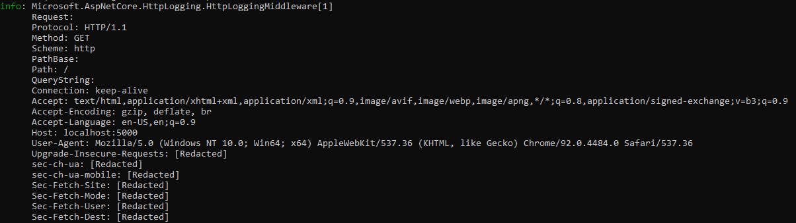

# HTTP Logging in ASP.NET Core

HTTP Logging is a middleware that logs information about HTTP requests and HTTP responses. HTTP logging provides logs of:

* HTTP request information
* Common properties
* Headers
* Body
* HTTP response information

HTTP Logging is valuable in several scenarios to:

* Record information about incoming requests and responses.
* Filter which parts of the request and response are logged.
* Filtering which headers to log.

HTTP Logging ***can reduce the performance of an app***, especially when logging the request and response bodies. Consider the performance impact when selecting fields to log. Test the performance impact of the selected logging properties.

> [!WARNING]
> HTTP Logging can potentially log personally identifiable information (PII). Consider the risk and avoid logging sensitive information.

## Enabling HTTP logging

HTTP Logging is enabled with `UseHttpLogging`, which adds HTTP logging middleware.

[!code-csharp[](samples/6.x/Program.cs?name=snippet&highlight=10)]

By default, HTTP Logging logs common properties such as path, status-code, and headers for requests and responses. Add the following line to the *appsettings.Development.json* file so the HTTP logs are displayed.
```
 "Microsoft.AspNetCore.HttpLogging.HttpLoggingMiddleware": "Information"
 ```

The output is logged as a single message at `LogLevel.Information`.



## HTTP Logging options

To configure the HTTP logging middleware, call `AddHttpLogging` in `Program.cs`.

[!code-csharp[](samples/6.x/Program.cs?name=Addservices)]

### `LoggingFields`

`HttpLoggingOptions.LoggingFields` is an enum flag that configures specific parts of the request and response to log. `LoggingFields` defaults to `RequestPropertiesAndHeaders | ResponsePropertiesAndHeaders`.

[!code-csharp[](samples/6.x/Program.cs?name=Addservices&highlight=4)]

| Flag | Flag for logging the HTTP | Value |
| ---- | ----------- | :---: |
| None | No logging. | 0x0 |
| `RequestPath` | Request Path, which includes both the <xref:Microsoft.AspNetCore.Http.HttpRequest.Path> and <xref:Microsoft.AspNetCore.Http.HttpRequest.PathBase>. | 0x1 |
| `RequestQuery` |  Request <xref:Microsoft.AspNetCore.Http.HttpRequest.QueryString>. | 0x2 |
| `RequestProtocol` |  Request <xref:Microsoft.AspNetCore.Http.HttpRequest.Protocol>. | 0x4 |
| `RequestMethod` |  Request <xref:Microsoft.AspNetCore.Http.HttpRequest.Method>. | 0x8 |
| `RequestScheme` |  Request <xref:Microsoft.AspNetCore.Http.HttpRequest.Scheme>. | 0x10 |
| `ResponseStatusCode` |  Response <xref:Microsoft.AspNetCore.Http.HttpResponse.StatusCode>. | 0x20 |
| `RequestHeaders` |  Request <xref:Microsoft.AspNetCore.Http.HttpRequest.Headers>. Request headers are logged as soon as the middleware is invoked. Headers are redacted by default with the character '[Redacted]' unless specified in the `HttpLoggingOptions.RequestHeaders`. | 0x40 |
| `ResponseHeaders` |  Response <xref:Microsoft.AspNetCore.Http.HttpResponse.Headers>. Response headers are logged when the <xref:Microsoft.AspNetCore.Http.HttpResponse.Body> is written to or when <xref:Microsoft.AspNetCore.Http.Features.IHttpResponseBodyFeature.StartAsync%2A> is called. Headers are redacted by default with the character '[Redacted]' unless specified in the `HttpLoggingOptions.ResponseHeaders`. | 0x80 |
| `RequestTrailers` |  Request [IHttpRequestTrailersFeature.Trailers](xref:Microsoft.AspNetCore.Http.Features.IHttpRequestTrailersFeature.Trailers). Request Trailers are currently not logged. | 0x100 |
| `ResponseTrailers` |  Response [IHttpResponseTrailersFeature.Trailers](xref:Microsoft.AspNetCore.Http.Features.IHttpResponseTrailersFeature.Trailers). Response Trailers are currently not logged. | 0x200 |
| `RequestBody` |  Request <xref:Microsoft.AspNetCore.Http.HttpRequest.Body>. Logging the request body has performance implications, as it requires buffering the entire request body up to `HttpLoggingOptions.RequestBodyLogLimit`. | 0x400 |
| `ResponseBody` |  Response <xref:Microsoft.AspNetCore.Http.HttpResponse.Body>. Logging the response body has performance implications, as it requires buffering the entire response body up to `HttpLoggingOptions.ResponseBodyLogLimit`. | 0x800 |
| `RequestProperties` | Flag for logging a collection of HTTP Request properties, including `RequestPath`, `RequestQuery`, `RequestProtocol`, `RequestMethod`, and `RequestScheme`. | `RequestPath | RequestQuery | RequestProtocol | RequestMethod | RequestScheme` |
| `RequestPropertiesAndHeaders` | Flag for logging HTTP Request properties and headers. Includes `RequestProperties` and `RequestHeaders`. | `RequestProperties | RequestHeaders` |
| `ResponsePropertiesAndHeaders` | Flag for logging HTTP Response properties and headers. Includes `ResponseStatusCode` and `ResponseHeaders`. | `ResponseStatusCode | ResponseHeaders` |
| `Request` | Flag for logging the entire HTTP Request. Includes `RequestPropertiesAndHeaders` and `RequestBody`. Logging the request body has performance implications, as it requires buffering the entire request body up to `HttpLoggingOptions.RequestBodyLogLimit`. | `RequestPropertiesAndHeaders | RequestBody` |
| `Response` | Flag for logging the entire HTTP Response. Includes `ResponseStatusCode`, `ResponseHeaders`, and `ResponseBody`. Logging the response body has performance implications, as it requires buffering the entire response body up to `HttpLoggingOptions.ResponseBodyLogLimit`. | `ResponseStatusCode | ResponseHeaders | ResponseBody` |
| `All` | Flag for logging both the HTTP Request and Response. Includes `Request` and `Response`. Logging the request and response body has performance implications, as it requires buffering the entire request and response body up to the `HttpLoggingOptions.RequestBodyLogLimit` and `HttpLoggingOptions.ResponseBodyLogLimit`. | `Request | Response` |

### `RequestHeaders`

`RequestHeaders` are a set of HTTP Request Headers that are allowed to be logged. Header values are only logged for header names that are in this collection.

[!code-csharp[](samples/6.x/Program.cs?name=Addservices&highlight=5)]

### `ResponseHeaders`

`ResponseHeaders` are a set of HTTP Response Headers that are allowed to be logged. Header values are only logged for header names that are in this collection.

[!code-csharp[](samples/6.x/Program.cs?name=Addservices&highlight=6)]

### `MediaTypeOptions`

`MediaTypeOptions` provides configuration for selecting which encoding to use for a specific media type. 

[!code-csharp[](samples/6.x/Program.cs?name=Addservices&highlight=7)]

#### `MediaTypeOptions` methods

<!-- When API is published, replace the following with API links -->

* `public void AddText(string contentType)`
  * Adds a contentType to be used for logging as text using UTF-8 encoding.
* `public void AddText(string contentType, Encoding encoding)`
  * Adds a contentType to be used for logging as text using the specified encoding.
* `public void AddBinary(MediaTypeHeaderValue mediaType)`
  * Adds a `MediaTypeHeaderValue` to be used for logging as binary.
* `public void AddBinary(string contentType)`
  * Adds a content to be used for logging as text using the specified content type.
* `public void Clear()`
  * Clears all MediaTypes.

### `RequestBodyLogLimit`

Maximum request body size to log, in bytes. Defaults to 32 KB.

[!code-csharp[](samples/6.x/Program.cs?name=Addservices&highlight=8)]

### `ResponseBodyLogLimit`

Maximum response body size to log, in bytes. Defaults to 32 KB.

[!code-csharp[](samples/6.x/Program.cs?name=Addservices&highlight=9)]
