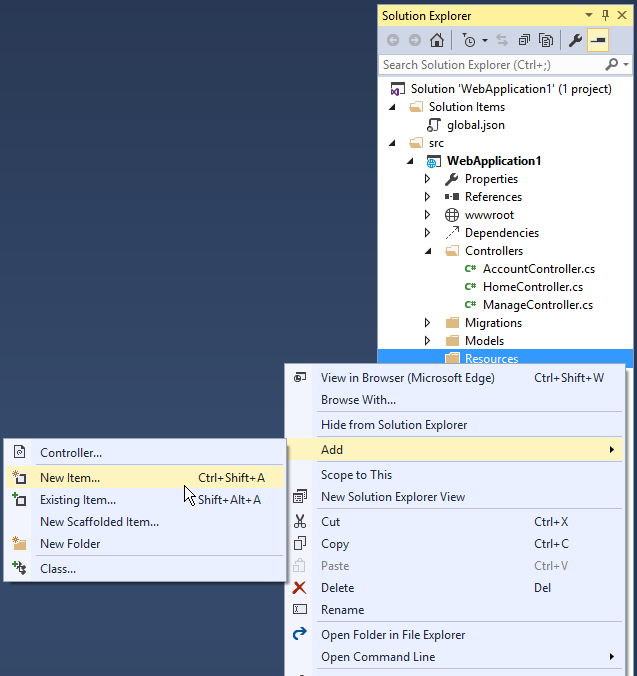
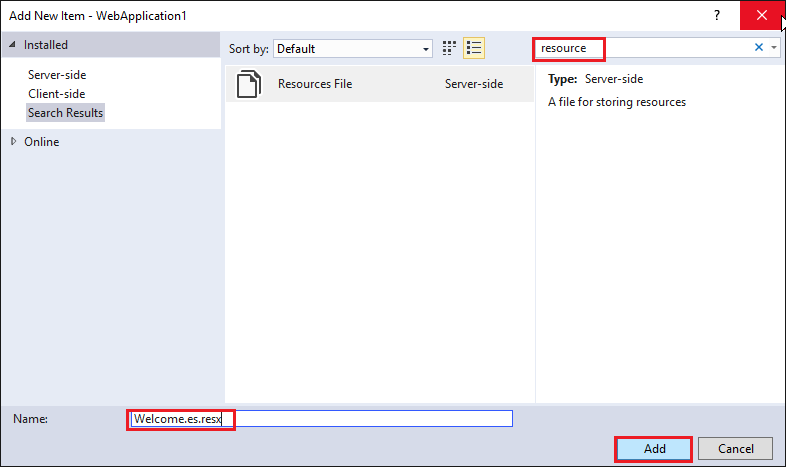
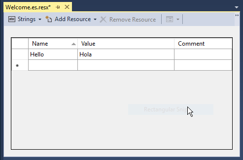
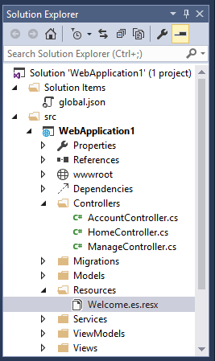
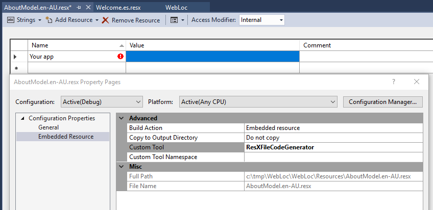
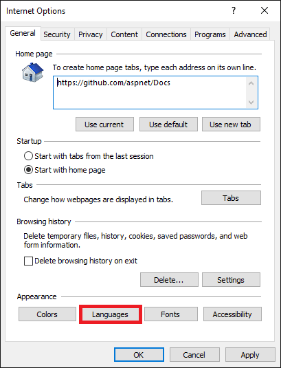

# Globalization and localization in ASP.NET Core

By [Rick Anderson](https://twitter.com/RickAndMSFT), [Damien Bowden](https://twitter.com/damien_bod), [Bart Calixto](https://twitter.com/bartmax), [Nadeem Afana](https://twitter.com/NadeemAfana), and [Hisham Bin Ateya](https://twitter.com/hishambinateya)

Creating a multilingual website with ASP.NET Core will allow your site to reach a wider audience. ASP.NET Core provides services and middleware for localizing into different languages and cultures.

Internationalization involves [Globalization](https://docs.microsoft.com/dotnet/api/system.globalization) and [Localization](https://docs.microsoft.com/dotnet/standard/globalization-localization/localization). Globalization is the process of designing apps that support different cultures. Globalization adds support for input, display, and output of a defined set of language scripts that relate to specific geographic areas.

Localization is the process of adapting a globalized app, which you have already processed for localizability, to a particular culture/locale.  For more information see **Globalization and localization terms** near the end of this document.

App localization involves the following:

1. Make the app's content localizable

2. Provide localized resources for the languages and cultures you support

3. Implement a strategy to select the language/culture for each request

## Make the app's content localizable

Introduced in ASP.NET Core, `IStringLocalizer` and `IStringLocalizer<T>` were architected to improve productivity when developing localized apps. `IStringLocalizer` uses the [ResourceManager](https://docs.microsoft.com/dotnet/api/system.resources.resourcemanager) and [ResourceReader](https://docs.microsoft.com/dotnet/api/system.resources.resourcereader) to provide culture-specific resources at run time. The simple interface has an indexer and an `IEnumerable` for returning localized strings. `IStringLocalizer` doesn't require you to store the default language strings in a resource file. You can develop an app
targeted for localization and not need to create resource files early in development. The code below shows how to wrap the string "About Title" for localization.

[!code-csharp[Main](localization/sample/Controllers/AboutController.cs)]

In the code above, the `IStringLocalizer<T>` implementation comes from [Dependency Injection](dependency-injection.md). If the localized value of "About Title" is not found, then the indexer key is returned, that is, the string "About Title". You can leave the default language literal strings in the app and wrap them in the localizer, so that you can focus on developing the app. You develop your app with your default language and prepare it for the localization step without first creating a default resource file. Alternatively, you can use the traditional approach and provide a key to retrieve the default language string. For many developers the new workflow of not having a default language *.resx* file and simply wrapping the string literals can reduce the overhead of localizing an app. Other developers will prefer the traditional work flow as it can make it easier to work with longer string literals and make it easier to update localized strings.

Use the `IHtmlLocalizer<T>` implementation for resources that contain HTML. `IHtmlLocalizer` HTML encodes arguments that are formatted in the resource string, but not the resource string. In the sample highlighted below, only the value of `name` parameter is HTML encoded.

[!code-csharp[Main](../fundamentals/localization/sample/Controllers/BookController.cs?highlight=3,5,20&start=1&end=24)]

Note: You generally want to only localize text and not HTML.

At the lowest level, you can get `IStringLocalizerFactory` out of [Dependency Injection](dependency-injection.md):

[!code-csharp[Main](localization/sample/Controllers/TestController.cs?start=9&end=26&highlight=7-13)]

The code above demonstrates each of the two factory create methods.

You can partition your localized strings by controller, area, or have just one container. In the sample app, a dummy class named `SharedResource` is used for shared resources.

[!code-csharp[Main](localization/sample/Resources/SharedResource.cs)]

Some developers use the `Startup` class to contain global or shared strings.  In the sample below, the `InfoController` and the `SharedResource` localizers are used:

[!code-csharp[Main](localization/sample/Controllers/InfoController.cs?range=9-26)]

## View localization

The `IViewLocalizer` service provides localized strings for a [view](https://docs.microsoft.com/aspnet/core). The `ViewLocalizer` class implements this interface and finds the resource location from the view file path. The following code shows how to use the default implementation of `IViewLocalizer`:

[!code-HTML[Main](localization/sample/Views/Home/About.cshtml)]

The default implementation of `IViewLocalizer` finds the resource file based on the view's file name. There is no option to use a global shared resource file. `ViewLocalizer` implements the localizer using `IHtmlLocalizer`, so Razor doesn't HTML encode the localized string. You can parameterize resource strings and `IViewLocalizer` will HTML encode the parameters, but not the resource string. Consider the following Razor markup:

```HTML
@Localizer["<i>Hello</i> <b>{0}!</b>", UserManager.GetUserName(User)]
   ```

A French resource file could contain the following:

| Key | Value |
| ----- | ------ |
| `<i>Hello</i> <b>{0}!</b>` | `<i>Bonjour</i> <b>{0} !</b> ` |

The rendered view would contain the HTML markup from the resource file.

Notes:
- View localization requires the "Localization.AspNetCore.TagHelpers" NuGet package.
- You generally want to only localize text and not HTML.

To use a shared resource file in a view, inject `IHtmlLocalizer<T>`:

[!code-HTML[Main](../fundamentals/localization/sample/Views/Test/About.cshtml?highlight=5,12)]

## DataAnnotations localization

DataAnnotations error messages are localized with `IStringLocalizer<T>`. Using the option `ResourcesPath = "Resources"`, the error messages in `RegisterViewModel` can be stored in either of the following paths:

* Resources/ViewModels.Account.RegisterViewModel.fr.resx
* Resources/ViewModels/Account/RegisterViewModel.fr.resx

[!code-csharp[Main](localization/sample/ViewModels/Account/RegisterViewModel.cs?start=9&end=26)]

In ASP.NET Core MVC 1.1.0 and higher, non-validation attributes are localized. ASP.NET Core MVC 1.0 does **not** look up localized strings for non-validation attributes.

<a name=one-resource-string-multiple-classes></a>
### Using one resource string for multiple classes

The following code shows how to use one resource string for validation attributes with multiple classes:

```
public void ConfigureServices(IServiceCollection services)
{
    services.AddMvc()
        .AddDataAnnotationsLocalization(options => {
            options.DataAnnotationLocalizerProvider = (type, factory) =>
                factory.Create(typeof(SharedResource));
        });
}
```

In the preceeding code, `SharedResource` is the class corresponding to the resx where your validation messages are stored. With this approach,  DataAnnotations will only use `SharedResource`, rather than the resource for each class. 

## Provide localized resources for the languages and cultures you support  

### SupportedCultures and SupportedUICultures

ASP.NET Core allows you to specify two culture values, `SupportedCultures` and `SupportedUICultures`. The [CultureInfo](https://docs.microsoft.com/dotnet/api/system.globalization.cultureinfo) object for `SupportedCultures` determines the results of culture-dependent functions, such as date, time, number, and currency formatting. `SupportedCultures` also determines the sorting order of text, casing conventions, and string comparisons. See [CultureInfo.CurrentCulture](https://docs.microsoft.com/dotnet/api/system.stringcomparer.currentculture#System_StringComparer_CurrentCulture) for more info on how the server gets the Culture. The `SupportedUICultures` determines which translates strings (from *.resx* files) are looked up by the [ResourceManager](https://docs.microsoft.com/dotnet/api/system.resources.resourcemanager). The `ResourceManager` simply looks up culture-specific strings that is determined by `CurrentUICulture`. Every thread in .NET has
`CurrentCulture` and `CurrentUICulture` objects. ASP.NET Core inspects these values when rendering culture-dependent functions. For example, if the current thread's culture is set to "en-US" (English, United States), `DateTime.Now.ToLongDateString()` displays "Thursday, February 18, 2016", but if `CurrentCulture` is set to "es-ES" (Spanish, Spain) the output will be "jueves, 18 de febrero de 2016".

## Working with resource files

A resource file is a useful mechanism for separating localizable strings from code. Translated strings for the non-default language are isolated *.resx* resource files. For example, you might want to create Spanish resource file named *Welcome.es.resx* containing translated strings. "es" is the language code for Spanish. To create this resource file in Visual Studio:

1. In **Solution Explorer**, right click on the folder which will contain the resource file > **Add** > **New Item**.

    

2. In the **Search installed templates** box, enter "resource" and name the file.

    

3. Enter the key value (native string) in the **Name** column and the translated string in the **Value** column.

    

    Visual Studio shows the *Welcome.es.resx* file.

    

<a name="error"></a>

If you are using Visual Studio 2017 Preview version 15.3, you'll get an error indicator in the resource editor. Remove the *ResXFileCodeGenerator*  value from the *Custom Tool*  properties grid to prevent this error message:



Alternatively, you can ignore this error. We hope to fix this in the next release.

## Resource file naming

Resources are named for the full type name of their class minus the assembly name. For example, a French resource in a project whose main assembly is `LocalizationWebsite.Web.dll` for the class `LocalizationWebsite.Web.Startup` would be named *Startup.fr.resx*. A resource for the class `LocalizationWebsite.Web.Controllers.HomeController` would be named *Controllers.HomeController.fr.resx*. If your targeted class's namespace is not the same as the assembly name you will need the full type name. For example, in the sample project a resource for the type `ExtraNamespace.Tools` would be named *ExtraNamespace.Tools.fr.resx*.

In the sample project, the `ConfigureServices` method sets the `ResourcesPath` to "Resources", so the project relative path for the home controller's French resource file is *Resources/Controllers.HomeController.fr.resx*. Alternatively, you can use folders to organize resource files. For the home controller, the path would be *Resources/Controllers/HomeController.fr.resx*. If you don't use the `ResourcesPath` option, the *.resx* file would go in the project base directory. The resource file for `HomeController` would be named *Controllers.HomeController.fr.resx*. The choice of using the dot or path naming convention depends on how you want to organize your resource files.

| Resource name | Dot or path naming |
| ------------   | ------------- |
| Resources/Controllers.HomeController.fr.resx | Dot  |
| Resources/Controllers/HomeController.fr.resx  | Path |
|    |     |

Resource files using `@inject IViewLocalizer` in Razor views follow a similar pattern. The resource file for a view can be named using either dot naming or path naming. Razor view resource files mimic the path of their associated view file. Assuming we set the `ResourcesPath` to "Resources", the French resource file associated with the *Views/Home/About.cshtml* view could be either of the following:

* Resources/Views/Home/About.fr.resx

* Resources/Views.Home.About.fr.resx

If you don't use the `ResourcesPath` option, the *.resx* file for a view would be located in the same folder as the view.

If you remove the ".fr" culture designator AND you have the culture set to French (via cookie or other mechanism), the default resource file is read and strings are localized. The Resource manager designates a default or fallback resource, when nothing meets your requested culture you're served the *.resx file without a culture designator. If you want to just return the key when missing a resource for the requested culture you must not have a default resource file.

### Generating resource files with Visual Studio

If you create a resource file in Visual Studio without a culture in the file name (for example, *Welcome.resx*), Visual Studio will create a C# class with a property for each string. That's usually not what you want with ASP.NET Core; you typically don't have a default *.resx* resource file (A *.resx* file without the culture name). We suggest you create the *.resx* file with a culture name (for example *Welcome.fr.resx*). When you create a *.resx* file with a culture name, Visual Studio will not generate the class file. We anticipate that many developers will **not** create a default language resource file.

### Adding Other Cultures

Each language and culture combination (other than the default language) requires a unique resource file. You create resource files for different cultures and locales by creating new resource files in which the ISO language codes are part of the file name (for example, **en-us**, **fr-ca**, and **en-gb**). These ISO codes are placed between the file name and the *.resx* file name extension, as in *Welcome.es-MX.resx* (Spanish/Mexico). To specify a culturally neutral language, remove the country code (`MX` in the preceding example). The culturally neutral Spanish resource file name is *Welcome.es.resx*.

## Implement a strategy to select the language/culture for each request  

### Configuring localization

Localization is configured in the `ConfigureServices` method:

[!code-csharp[Main](localization/sample/Program.cs?name=snippet1)]

* `AddLocalization` Adds the localization services to the services container. The code above also sets the resources path to "Resources".

* `AddViewLocalization` Adds support for localized view files. In this sample view localization is based on the view file suffix. For example "fr" in the *Index.fr.cshtml* file.

* `AddDataAnnotationsLocalization` Adds support for localized `DataAnnotations` validation messages through `IStringLocalizer` abstractions.

### Localization middleware

The current culture on a request is set in the localization [Middleware](middleware.md). The localization middleware is enabled in the `Configure` method of *Program.cs* file. Note, the localization middleware must be configured before any middleware which might check the request culture (for example, `app.UseMvcWithDefaultRoute()`).

[!code-csharp[Main](localization/sample/Program.cs?name=snippet2)]

`UseRequestLocalization` initializes a `RequestLocalizationOptions` object. On every request the list of `RequestCultureProvider` in the `RequestLocalizationOptions` is enumerated and the first provider that can successfully determine the request culture is used. The default providers come from the `RequestLocalizationOptions` class:

1. `QueryStringRequestCultureProvider`
2. `CookieRequestCultureProvider`
3. `AcceptLanguageHeaderRequestCultureProvider`

The default list goes from most specific to least specific. Later in the article we'll see how you can change the order and even add a custom culture provider. If none of the providers can determine the request culture, the `DefaultRequestCulture` is used.

### QueryStringRequestCultureProvider

Some apps will use a query string to set the [culture and UI culture](https://msdn.microsoft.com/library/system.globalization.cultureinfo.aspx). For apps that use the cookie or Accept-Language header approach, adding a query string to the URL is useful for debugging and testing code. By default, the `QueryStringRequestCultureProvider` is registered as the first localization provider in the `RequestCultureProvider` list. You pass the query string parameters `culture` and `ui-culture`. The following example sets the specific culture (language and region) to Spanish/Mexico:

   `http://localhost:5000/?culture=es-MX&ui-culture=es-MX`

If you only pass in one of the two (`culture` or `ui-culture`), the query string provider will set both values using the one you passed in. For example, setting just the culture will set both the `Culture` and the `UICulture`:

   `http://localhost:5000/?culture=es-MX`

### CookieRequestCultureProvider

Production apps will often provide a mechanism to set the culture with the ASP.NET Core culture cookie. Use the `MakeCookieValue`  method to create a cookie.

The `CookieRequestCultureProvider` `DefaultCookieName`  returns the default cookie name used to track the user’s preferred culture information. The default cookie  name is ".AspNetCore.Culture".

The cookie format is `c=%LANGCODE%|uic=%LANGCODE%`, where `c` is `Culture` and `uic` is `UICulture`, for example:

    c=en-UK|uic=en-US

If you only specify one of culture info and UI culture, the specified culture will be used for both culture info and UI culture.

### The Accept-Language HTTP header

The [Accept-Language header](https://www.w3.org/International/questions/qa-accept-lang-locales) is settable in most browsers and was originally intended to specify the user's language. This setting indicates what the browser has been set to send or has inherited from the underlying operating system. The Accept-Language HTTP header from a browser request is not an infallible way to detect the user's preferred language (see [Setting language preferences in a browser](https://www.w3.org/International/questions/qa-lang-priorities.en.php)). A production app should include a way for a user to customize their choice of culture.

### Setting the Accept-Language HTTP header in IE

1. From the gear icon, tap **Internet Options**.

2. Tap **Languages**.

    

3. Tap **Set Language Preferences**.

4. Tap **Add a language**.

5. Add the language.

6. Tap the language, then tap **Move Up**.

### Using a custom provider

Suppose you want to let your customers store their language and culture in your databases. You could write a provider to look up these values for the user. The following code shows how to add a custom provider:

```csharp
private const string enUSCulture = "en-US";

services.Configure<RequestLocalizationOptions>(options =>
{
    var supportedCultures = new[]
    {
        new CultureInfo(enUSCulture),
        new CultureInfo("fr")
    };

    options.DefaultRequestCulture = new RequestCulture(culture: enUSCulture, uiCulture: enUSCulture);
    options.SupportedCultures = supportedCultures;
    options.SupportedUICultures = supportedCultures;

    options.RequestCultureProviders.Insert(0, new CustomRequestCultureProvider(async context =>
    {
        // My custom request culture logic
        return new ProviderCultureResult("en");
    }));
});
```

Use `RequestLocalizationOptions` to add or remove localization providers.

### Setting the culture programmatically

This sample **Localization.StarterWeb** project on [GitHub](https://github.com/aspnet/entropy) contains UI to set the `Culture`. The *Views/Shared/_SelectLanguagePartial.cshtml* file allows you to select the culture from the list of supported cultures:

[!code-HTML[Main](localization/sample/Views/Shared/_SelectLanguagePartial.cshtml)]

The *Views/Shared/_SelectLanguagePartial.cshtml* file is added to the `footer` section of the layout file so it will be available to all views:

[!code-HTML[Main](localization/sample/Views/Shared/_Layout.cshtml?range=43-56&highlight=10)]

The `SetLanguage` method sets the culture cookie.

[!code-csharp[Main](localization/sample/Controllers/HomeController.cs?range=57-67)]

You can't plug in the *_SelectLanguagePartial.cshtml* to sample code for this project. The **Localization.StarterWeb** project on [GitHub](https://github.com/aspnet/entropy) has code to flow the `RequestLocalizationOptions` to a Razor partial through the [Dependency Injection](dependency-injection.md) container.

## Globalization and localization terms

The process of localizing your app also requires a basic understanding of relevant character sets commonly used in modern software development and an understanding of the issues associated with them. Although all computers store text as numbers (codes), different systems store the same text using different numbers. The localization process refers to translating the app user interface (UI) for a specific culture/locale.

[Localizability](https://docs.microsoft.com/dotnet/standard/globalization-localization/localizability-review) is an intermediate process for verifying that a globalized app is ready for localization.

The [RFC 4646](https://www.ietf.org/rfc/rfc4646.txt) format for the culture name is "<languagecode2>-<country/regioncode2>", where <languagecode2> is the language code and <country/regioncode2> is the subculture code. For example, `es-CL` for Spanish (Chile), `en-US` for English (United States), and `en-AU` for English (Australia). [RFC 4646](https://www.ietf.org/rfc/rfc4646.txt) is a combination of an ISO 639 two-letter lowercase culture code associated with a language and an ISO 3166 two-letter uppercase subculture code associated with a country or region.  See [Language Culture Name](https://msdn.microsoft.com/library/ee825488(v=cs.20).aspx).

Internationalization is often abbreviated to "I18N". The abbreviation takes the first and last letters and the number of letters between them, so 18 stands for the number of letters between the first "I" and the last "N". The same applies to Globalization (G11N), and Localization (L10N).

Terms:

* Globalization (G11N): The process of making an app support different languages and regions.
* Localization (L10N): The process of customizing an app for a given language and region.
* Internationalization (I18N): Describes both globalization and localization.
* Culture: It is a language and, optionally, a region.
* Neutral culture: A culture that has a specified language, but not a region. (for example "en", "es")
* Specific culture: A culture that has a specified language and region. (for example "en-US", "en-GB", "es-CL")
* Locale: A locale is the same as a culture.

## Additional resources

* [Localization.StarterWeb project](https://github.com/aspnet/entropy) used in the article.
* [Resource Files in Visual Studio](https://docs.microsoft.com/cpp/windows/resource-files-visual-studio)
* [Resources in .resx Files](https://docs.microsoft.com/dotnet/framework/resources/working-with-resx-files-programmatically)
