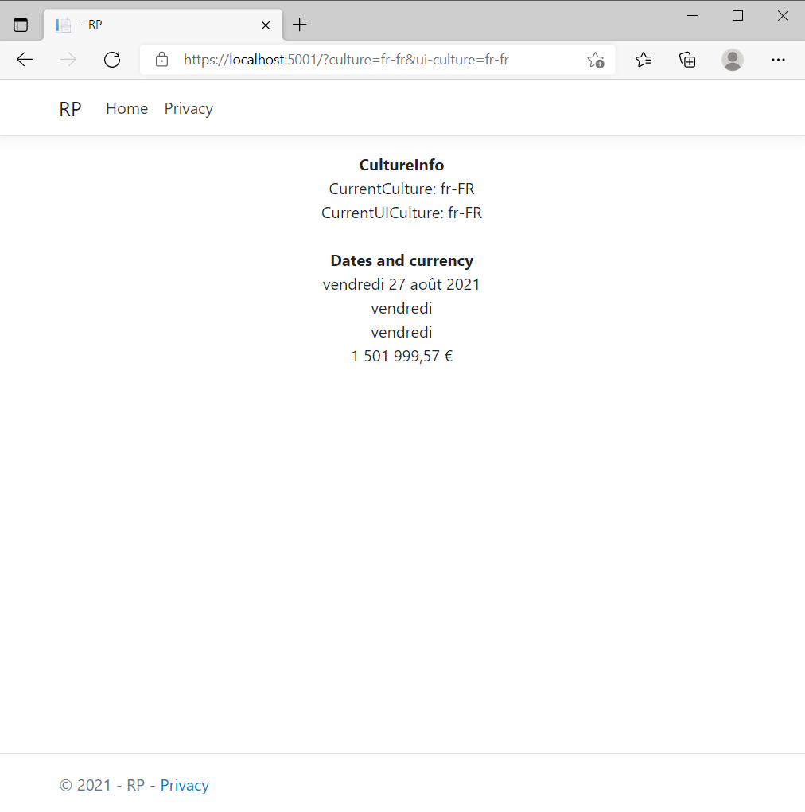
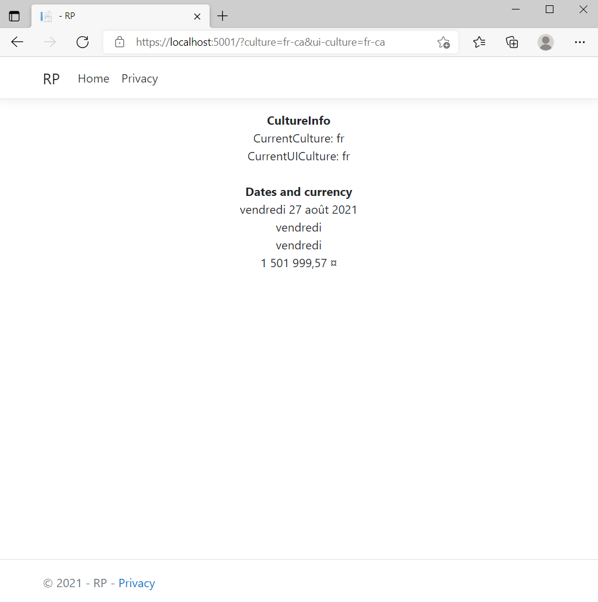
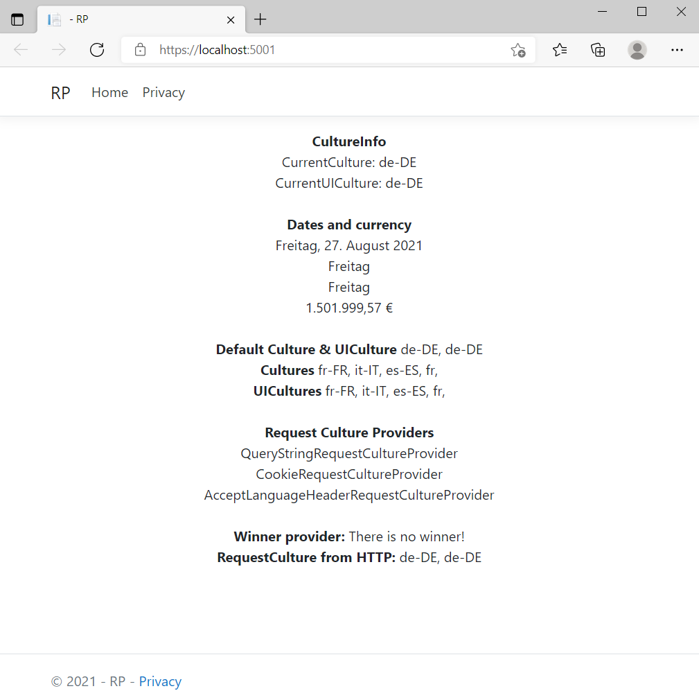
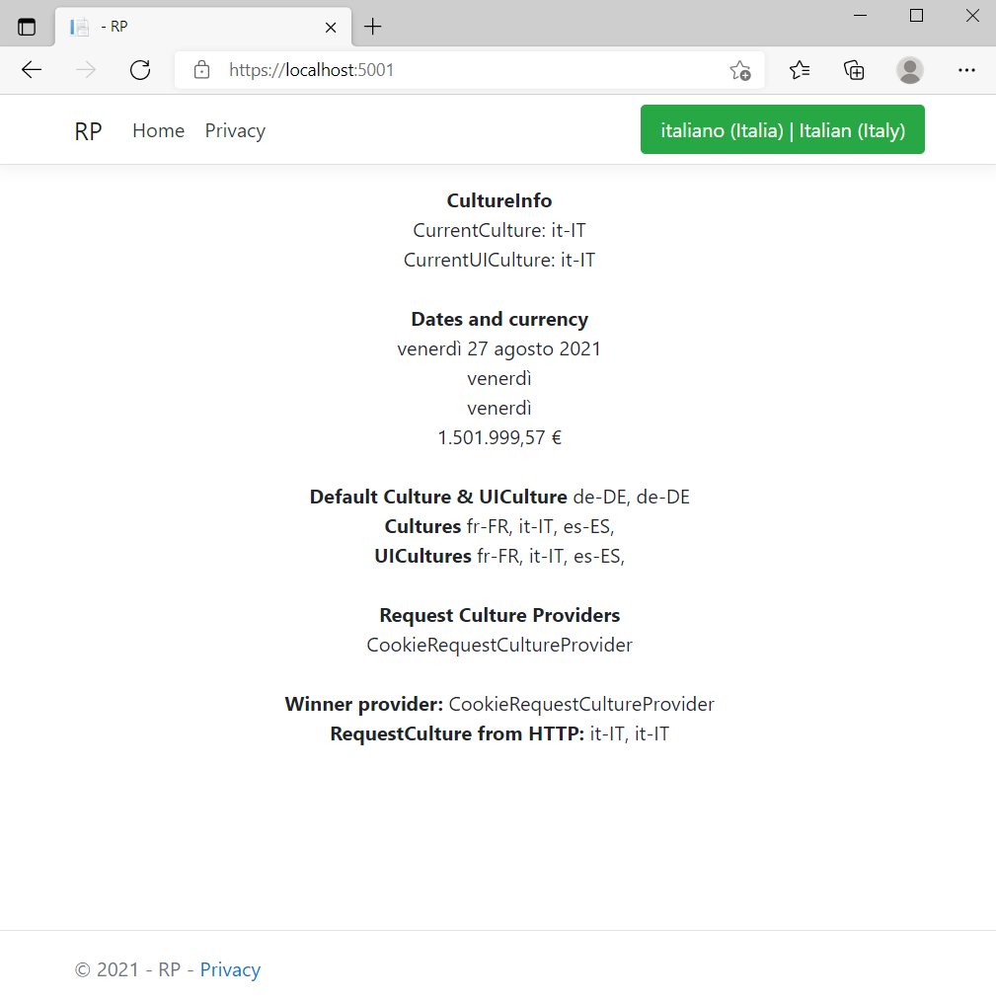
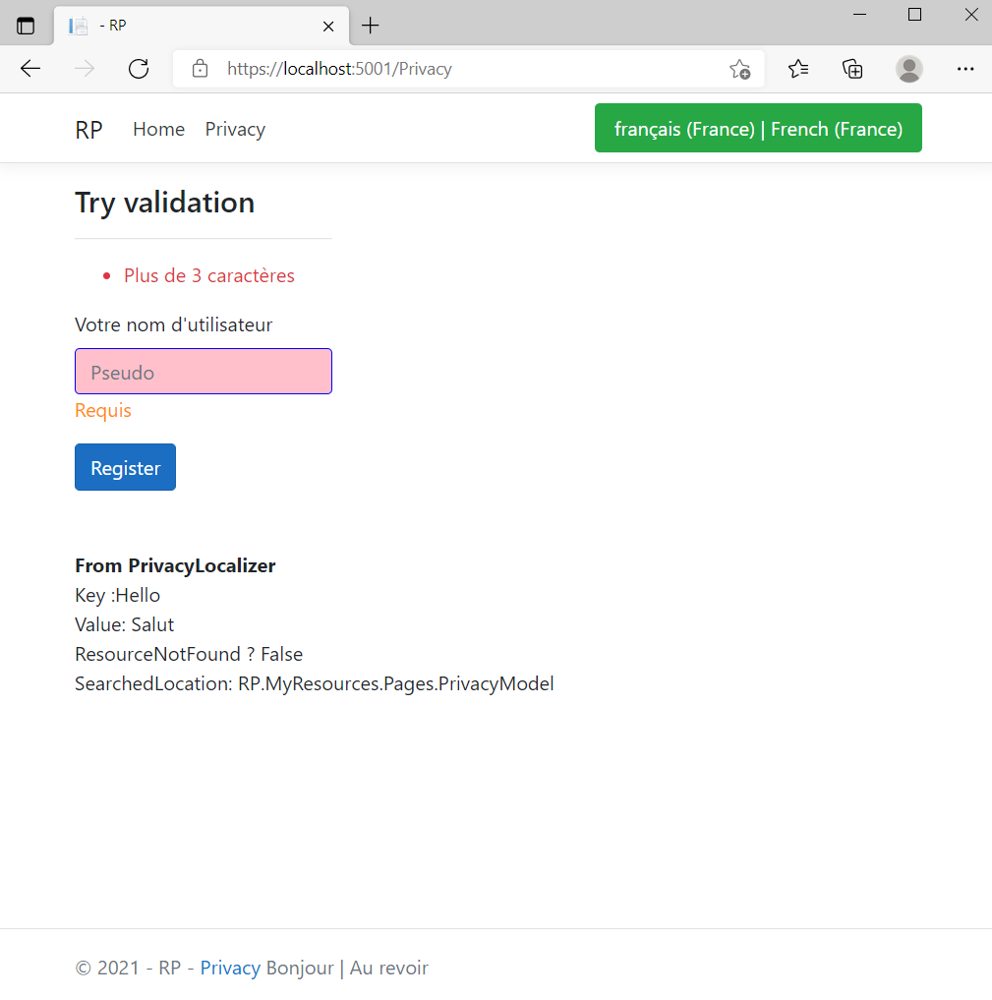

# Globalization and localization in ASP.NET Core

::: moniker range=">= aspnetcore-6.0"

By [Karim Murr](https://github.com/Ponant), [Damien Bowden](https://twitter.com/damien_bod), [Bart Calixto](https://twitter.com/bartmax), [Nadeem Afana](https://afana.me/), and [Hisham Bin Ateya](https://twitter.com/hishambinateya)

This topic shows how to configure a ASP.NET Core website to accept several languages. Localizing a website requires:

* Configuration of the .Net runtime, servers, middleware and localization services.
* Understand browser behavior.

## Terms and definitions

Internationalization involves [Globalization](/dotnet/api/system.globalization)
and [Localization](/dotnet/standard/globalization-localization/localization).
Globalization is the process of designing apps to support different cultures. Globalization adds support for input, display, and output of a defined set of language scripts that relate to specific geographic areas.

Localization is the process of adapting a globalized app to a particular culture/locale.

The process of localizing an app requires an understanding of relevant character sets commonly used in software development. For example, text can be stored in different formats depending on the operating system.

[Localizability](/dotnet/standard/globalization-localization/localizability-review) is an intermediate process for verifying that a globalized app is ready for localization.

The [RFC 4646](https://www.ietf.org/rfc/rfc4646.txt) format for the culture name is `<languagecode2>-<country/regioncode2>`, where `<languagecode2>` is the language code and `<country/regioncode2>` is the subculture code. For example, `es-CL` for Spanish (Chile), `en-US` for English (United States), and `en-AU` for English (Australia).

[RFC 4646](https://www.ietf.org/rfc/rfc4646.txt) is a combination of an ISO 639 two-letter lowercase culture code associated with a language and an ISO 3166 two-letter uppercase subculture code associated with a country or region.

Internationalization is often abbreviated to "I18N". The abbreviation takes the first and last letters and the number of letters between them, so 18 stands for the number of letters between the first "I" and the last "N". The same applies to Globalization (G11N), and Localization (L10N).

Summary of terms:

* Globalization (G11N): The process of making an app support different languages and regions.
* Localization (L10N): The process of customizing an app for a given language and region.
* Internationalization (I18N): Describes both globalization and localization.
* Culture: The language and, optionally, a region.
* Neutral culture: A culture that has a specified language, but not a region. For example "en" and "es".
* Specific culture: A culture that has a specified language and region. For example "en-US", "en-GB" and "es-CL".
* Parent culture: The neutral culture that contains a specific culture. For example, "en" is the parent culture of "en-US" and "en-GB".
* Locale: A locale is the same as a culture.

## Prerequisites

Create a simple [Razor Pages](xref:tutorials/razor-pages/razor-pages-start web app and name it `RP`. It's important to name the project `RP` so the namespaces match when copying and pasting code. Although this topic uses Razor Page, most of the content applies to MVC apps. Where there is a difference it's pointed out.

Localization requires an understanding of the following concepts:

1. What is the responsibility and scope of each part of the localization services.
1. How to configure an app to have a full control over localization.
1. How to store and retrieve translated content.

If you have problems with this sample, you can [view or download the complete sample project](https://github.com/dotnet/AspNetCore.Docs/tree/main/aspnetcore/fundamentals/localization/sample/6.x/) ([how to download](xref:index#how-to-download-a-sample)).

## Built-in localization

The <xref:System.Globalization.CultureInfo?displayProperty=fullName> object encompasses the [RFC 4646](https://www.ietf.org/rfc/rfc4646.txt) format and supports localization. Understanding `CultureInfo` is fundamental to localization. This topic focuses on `CurrentCulture` and `CurrentUICulture`, both of which are handled by `CultureInfo`.

`Culture` refers to operations such as letter casing, formatting of dates and numbers of that specific culture. `UICulture` represents the current user interface culture used by the Resource Manager to translate text at run time.

This section updates the RP app to display key `CultureInfo` static properties, dates, and a number formatted as a currency.

* Update *_ViewImports.cshtml* and add a using statement for `System.Globalization` as shown in the following code.

````cshtml
@using RP
@using System.Globalization
@namespace RP.Pages
@addTagHelper *, Microsoft.AspNetCore.Mvc.TagHelpers
````

Replace the contents of *index.cshtml* with the following markup:

````cshtml
@page
@model IndexModel
@{
    var price = 1501999.568m;
}
<!--Place everything inside this div-->
<div class="text-center">
    <strong>CultureInfo</strong>
    <div>CurrentCulture: <span>@CultureInfo.CurrentCulture</span></div>
    <div>CurrentUICulture: <span>@CultureInfo.CurrentUICulture</span></div>
    
    <br />

    <strong>Dates and currency</strong>
    <div>@DateTime.Now.ToLongDateString()</div>
    <div>@DateTimeFormatInfo.CurrentInfo.GetDayName(DateTime.Now.DayOfWeek)</div>
    <div>@CultureInfo.CurrentCulture.DateTimeFormat.GetDayName(DateTime.Now.DayOfWeek)</div>
    <div>@price.ToString("c")</div>
    <br />
</div>
````

Run the app to display the `CurrentCulture`, `CurrentUICulture`, dates, and more:


In the preceding image:

* The server returns `en-GB` for both `Culture` and `UICulture`.
* Dates and currency are displayed in the `en-GB` `Culture`.

What you see depends on the culture of the operating system where the app is running (Windows 10 in the `en-GB` locale when the snapshot was taken).

The `ToString("c")` overload displays the currency in the server's culture format. The response is generated on the server, so changing the browser's language at this stage won't change what the browser displays.
<!-- TODO: Is this a risky suggestion? Does it change windows UI to French? If so, most folks won't be able to change it back to their native language. -->
Change the OS regional format to anohter culture of your choosing and observe the differences. You may need to install a new language pack. On windows, **Settings** > **Regional Format**. Restart the web server. The following image show the Index page with the regional format setting `fr-FR` (French, France):


If you changed the regional format, restore it to the original setting.

## Localization configuration

The preceding section showed that the runtime automatically displays the time, date, and currency in the server locale. Frequently a web app needs to support more than one locale.

A fully localized ASP.NET Core app uses the following:

* <xref:Microsoft.Extensions.DependencyInjection.RequestLocalizationServiceCollectionExtensions.AddRequestLocalization%2A> : Configures the cultures and the middleware's behavior.
* <xref:Microsoft.Extensions.DependencyInjection.LocalizationServiceCollectionExtensions.AddLocalization%2A> : Allows injecting localizers as services that communicate
with your translated content.

### Control the Cultures and UICultures

Update *Program.cs* with the following highlighted code:

[!code-csharp[](localization/sample/6.x/start/Program.cs?name=snippet_full&highlight=3-7,28)]

`UseRequestLocalization` initializes a `RequestLocalizationOptions` object. On every request the list of `RequestCultureProvider` in the `RequestLocalizationOptions` is enumerated and the first provider that can successfully determine the request culture is used. The default providers come from the `RequestLocalizationOptions` class:

1. `QueryStringRequestCultureProvider`
1. `CookieRequestCultureProvider`
1. `AcceptLanguageHeaderRequestCultureProvider`

The default list goes from most specific to least specific. Later in the article we'll see how you can change the order and even add a custom culture provider. If none of the providers can determine the request culture, the `DefaultRequestCulture` is used.

The methods `AddSupportedCultures` and `AddSupportedUICultures` do nothing more than creating a list of `CultureInfo`
objects for the cultures that we provided. To follow along, we recommend that you choose cultures and uicultures
that are different from those of your OS. Therefore, in our case, we did not put in `en-GB`,
or any culture related to English. In addition, and for the moment,
make sure that the browser is not configured for those languages that you added to the service.
On Chromium browsers, this can be done by checking the language tab in the browser's settings.

Now run the server and you should not see any change; it is displaying `en-GB` in our system.
The reason being we did not yet set a default culture, which we purposely leave for later.

## The Query String Request Culture Provider

Now, assuming you are running on port 5001, browse to the following url:

````
https://localhost:5001/?culture=fr-fr&ui-culture=fr-fr
````

   

The middleware properly returned the culture and uiculture we have requested via two query strings.
You or your users now have a way to instruct which culture the server should display. 
Try out all cultures you have set, and it should work. Try out a culture that is not listed, e.g. `ar` (Arabic, neutral language)
and the server will return `en-GB` because it does not find anything else to show you.

Pass in one of the values, `culture` or `ui-culture`, and the query string provider
will set this value to both, so that the above query is equivalent to

```
https://localhost:5001/?culture=fr-fr
```

As a rule, it is important to be specific with the cultures. For example, prefer `fr-FR` or `fr-CA` (for French, Canada)
over the neutral, parent culture `fr`.
Indeed, the latter will lead, for instance, to numbers without currency when using `ToString(“c”)`,
because `fr` is a parent culture of many French cultures and the server cannot choose for you.
However, sometimes it is a good idea to add parent cultures such as `fr` to provide a fallback.
For instance, if you navigate to

`https://localhost:5001/?culture=fr-ca&ui-culture=fr-ca`

the server will return `en-GB`, which is not ideal for users who may not be at ease with English.
But if we add `fr`

````csharp
options.AddSupportedCultures(new[] { "fr-FR", "it-IT", "es-ES", "fr" });
options.AddSupportedUICultures(new[] { "fr-FR", "it-IT", "es-ES", "fr" });
````

we get some generic French formats when we request with `fr-CA`:

   

Notice how the currency symbol is now missing, but at least you make it easier for French Canadians.

Modify the code to set as default language `de-DE` (German, Germany) and run again

````csharp
options.SetDefaultCulture("de-DE");
````

   


Now the displayed information is in German for Germany by default, and no more `en-GB`.
This is important because you are gaining more control on how and when cultures should be used.
If we wish to have `en-GB` as a culture in our app, then it is better to set the culture explicitly in the service
rather than relying on the culture gotten from the server's host.

Before proceeding with the analysis, let's display all the registered cultures, uicultures and the default culture
in the `index.cshtml` page. Go to `_ViewImports.cshtml` and inject the options we have configured

````cshtml
@using Microsoft.Extensions.Options
@using RP
@using System.Globalization
@inject IOptions<RequestLocalizationOptions> RequetLocalizationOptions
@namespace RP.Pages
@addTagHelper *, Microsoft.AspNetCore.Mvc.TagHelpers
````

In the `index.cshtml` paste the following code at the bottom but inside the parent div to keep the text centered:

````cshtml
 <strong>Default Culture & UICulture</strong>
 <span>@RequetLocalizationOptions.Value.DefaultRequestCulture.Culture,</span>
 <span>@RequetLocalizationOptions.Value.DefaultRequestCulture.UICulture</span>

 <br />

 <strong>Cultures</strong>
 @foreach (var culture in RequetLocalizationOptions.Value.SupportedCultures)
 {
     <span>@culture,</span>
 }

 <br />

 <strong>UICultures</strong>
 @foreach (var uiculture in RequetLocalizationOptions.Value.SupportedUICultures)
 {
     <span>@uiculture,</span>
 }

 <br />
````

The `QueryStringRequestCultureProvider` which allowed you to get the culture from query strings is the first among three providers
registered automatically by the service. The two others are, in the following order, the `CookieRequestCultureProvider` and
`AcceptLanguageHeaderRequestCultureProvider`. We discuss these later.
This default list goes from most specific to least specific.
If none of the providers can determine the request culture, the `DefaultRequestCulture` is used (`de-DE` in our case),
if it has been set, otherwise it will use the host's culture (`en-GB` in our case).

Display the providers by adding the following to the `index.cshtml` page:

````cshtml

 <br />

 <strong>Request Culture Providers</strong>
 @foreach (var provider in RequetLocalizationOptions.Value.RequestCultureProviders)
 {
     <div>@provider.GetType().Name</div>
 }
````

In addition, it is possible to know which provider the middleware selected as a "winner" among the three.
Since this is decided during the HTTP pipeline, we need to invoke the `HttpContext` (or `Context` in MVC).
Add a using `@using Microsoft.AspNetCore.Localization` and add the following to the `index.cshtml` page:

````cshtml
<br />
@{
    var requestCultureFeature = HttpContext.Features.Get<IRequestCultureFeature>();
    var winner = requestCultureFeature?.Provider?.GetType().Name ?? "There is no winner!";
}
<strong>Winner provider: </strong><span>@winner</span>
<br />
<strong>RequestCulture from HTTP:</strong>
<span>@requestCultureFeature?.RequestCulture.Culture, @requestCultureFeature?.RequestCulture.UICulture</span>
````

Notice that we also display the culture that has been selected during the HTTP pipeline. You can view the `RequestCulture`
object as a holder of two properties, named `Culture` and `UICulture` which are nothing more than `CultureInfo` objects.

Running the app, you should get something like this:

  

As you can see, the HTTP pipeline outputs `de-DE` as a culture. But there is no winner provider (`null`). This is expected
because we are using the default and not querying. 

Now query with `de-DE`, `https://localhost:5001/?culture=de-DE&ui-culture=de-DE`.
There is no winner provider neither. This time the reason is we did not register `de-DE` as a supported culture or uiculture.
You can remediate this by adding this culture in the service when using `options.AddSupportedCultures` or
`options.AddSupportedUICultures`.
This will simplify your code when using cookies as we will see later.
However, for learning purposes we make explicit the separation of concerns
by leaving the default language out of the supported cultures and uicultures.

If now you query a registered culture, e.g., `https://localhost:5001/?culture=fr&ui-culture=fr`,
you get the `QueryStringRequestCultureProvider` as a winner

   

You can remove the query string provider `options.RequestCultureProviders.RemoveAt(0);`, and querying won't work anymore.

You can also customize the query string provider.

````csharp
options.RequestCultureProviders
.Add(new QueryStringRequestCultureProvider() { QueryStringKey = "lang", UIQueryStringKey = "uilang" });
````

so that you can query like this `https://localhost:5001/?lang=it-it`.

In general, using query strings to localize your application is practical for testing, but it is not recommended in production,
see [Managing multi-regional sites](https://developers.google.com/search/docs/advanced/crawling/managing-multi-regional-sites?hl=en&visit_id=637654323788088100-3821504457&rd=1#locale-specific-urls).

## The Accept Language Header Request Culture Provider

We come back to the initial service configuration:

````csharp
builder.Services.AddRequestLocalization(options =>
{
    options.AddSupportedCultures(new[] { "fr-FR", "it-IT", "es-ES", "fr" });
    options.AddSupportedUICultures(new[] { "fr-FR", "it-IT", "es-ES", "fr" });
    options.SetDefaultCulture("de-DE");
});
````
In particular, we have set `es-ES` (Spanish, Spain) as a culture.
Now, we set the browser to accept a new language, and our choice precisely is `es-ES`, in addition to `en-GB`.
There is no need to set this new culture as the default for the browser.
We recommend that you choose a culture in the browser's settings that you know you do not have on the machine.

Just refresh your browser (if the server is already running),
and the language displayed is `es-ES` and not the default `de-DE` (or `en-GB` if no default was set):

   

This is the role of the header request provider, it found `es-ES` so it skips the default.
Check that the Winner provider is indeed `AcceptLanguageHeaderRequestCultureProvider`.

The [Accept-Language header](https://www.w3.org/International/questions/qa-accept-lang-locales) is settable
in most browsers and was originally intended to specify the user's language.
This setting indicates what the browser has been set to send or has inherited from the underlying operating system.
The Accept-Language HTTP header from a browser request isn't an infallible way to detect the user's preferred language
(see [Setting language preferences in a browser](https://www.w3.org/International/questions/qa-lang-priorities.en.php)).
A production app should include a way for users to customize their choice of culture. We do this below.

[Content-Language](https://developer.mozilla.org/docs/Web/HTTP/Headers/Content-Language) is another language header.
This header is used to describe the language(s) intended for the audience, and allows a user to differentiate according to
the users' own preferred language. The `Content-Language` header can be added by setting the property:

````csharp
options.ApplyCurrentCultureToResponseHeaders = true;
````

The `RequestLocalizationMiddleware` will set the `Content-Language` header with the
`CurrentUICulture`. This also eliminates the need to set the response header `Content-Language` explicitly.

Notice that this header can be added regardless of the presence of
`AcceptLanguageHeaderRequestCultureProvider`.
Test this by removing all providers altogether `options.RequestCultureProviders.Clear();`

## The Cookie Request Culture Provider

Use the following configuration:

````csharp
builder.Services.AddRequestLocalization(options =>
{
    options.AddSupportedCultures(new[] { "fr-FR", "it-IT", "es-ES" });
    options.AddSupportedUICultures(new[] { "fr-FR", "it-IT", "es-ES" });
    options.SetDefaultCulture("de-DE");
    options.RequestCultureProviders.Clear();
    options.RequestCultureProviders.Add(new CookieRequestCultureProvider { CookieName = ".Contoso.Culture" });
});
````

We cleared all request culture providers to focus only on the cookie culture provider.
Clearing all providers prior to adding those you need is a good strategy because it eliminates the risk of
unwanted middleware behavior. For example, we have seen above how the mere presence of the accept language header provider
in `RequestCultureProviders` can lead to an undesired result for users with peculiar browsers' culture settings
(that they may not even be aware of).

We also created a new cookie request culture provider, and set its name to `.Contoso.Culture`.
The default cookie name is `.AspNetCore.Culture`.

Notice that we have removed the parent culture `fr`. This is because we want users to pick up a culture from a list of cultures,
and this is the only way for them to set the language. This makes our mechanism deterministic by eliminating culture fallbacks.
A Canadian French user will choose `fr-FR` if no other French language is available, and thus will expect the
formatting system to be the one used in France.
Providing this user with a generic `fr` will lead to inconsistencies in formatting, as we have seen with currencies, for example.
Of course, ideally, you would provide French Canadian users with `fr-CA`, to be added into the configuration.

At this stage, the query string provider and accept language header provider will not work.
In addition, as such the cookie request provider will do nothing until we instruct in code how to persist the culture cookie.
For this, we can provide some code to allow the user to select a culture among the list of cultures we have registered, and a cookie
will be persisted in the browser containing the information about that culture. We assume that you are familiar with adding a
Razor Page, a partial View, and familiar with Model Binding.

Create a partial view, named `_LanguagePartial.cshtml` and put it in the Shared folder.

````cshtml
@using Microsoft.AspNetCore.Localization

@{
    var usedCulture = Context.Features.Get<IRequestCultureFeature>()?.RequestCulture.Culture;
    
    // Set returnUrl to where the user was.
    // However, if the user clicks several times the language button, set the returnUrl to root
    var path = @Context.Request.Path.ToUriComponent();
    var returnUrl = path == "/Language" ? "/" : path;
}
<ul class="nav nav-pills">
    <li class="nav-item">
        <a class="nav-link btn-success" asp-area="" asp-page="/Language"
        asp-route-returnUrl="@returnUrl">@usedCulture?.NativeName | @usedCulture?.EnglishName</a>
    </li>
</ul>
````

Notice how we are using features already discussed previously. However, since we are working on a partial View,
we use `Context` and not `HttpContext`, the former being an MVC naming convention. Besides this, we have a `returnUrl`
which will bring back the users to the page they came from. Eventually,
we display each culture both in its native language as well as in English.

Invoke this partial View in `_Layout.cshtml`:

````cshtml
<div class="navbar-collapse collapse d-sm-inline-flex justify-content-between">
    <ul class="navbar-nav flex-grow-1">
        <li class="nav-item">
            <a class="nav-link text-dark" asp-area="" asp-page="/Index">Home</a>
        </li>
        <li class="nav-item">
            <a class="nav-link text-dark" asp-area="" asp-page="/Privacy">Privacy</a>
        </li>
    </ul>
    <partial name="_LanguagePartial" />
</div>
````

`_LanguagePartial` requires a `Language` page to route to. Create a Razor Page named `Language` and place it next to the Index page.
In `Language.cshtml`, paste the following code:

````cshtml
@page
@using Microsoft.AspNetCore.Localization
@model RP.Pages.LanguageModel
@{
    var setCultureName = HttpContext.Features.Get<IRequestCultureFeature>()?.RequestCulture.Culture.Name;
    var languages = new List<CultureInfo>();
    languages.Add(RequetLocalizationOptions.Value.DefaultRequestCulture.Culture);
    languages.AddRange(RequetLocalizationOptions.Value.SupportedCultures);
}

<div class="container">
    <div class="row">
        <div class="col-6 offset-3">
            <h4>Set the language here</h4>
            @foreach (var item in languages)
            {
                var btnColor = @item.Name == @setCultureName ? "btn-success" : "btn-secondary";
                <form asp-route-lang="@item.Name" asp-route-returnUrl=@Model.ReturnUrl method="post">
                    <button type="submit" class="btn btn-block @btnColor">@item.NativeName | @item.EnglishName</button>
                </form>
            }
        </div>
    </div>
</div>
````

Notice how the `languages` variable is built up from the `DefaultRequestCulture` (`de-DE`) and the supported cultures.
As mentioned earlier, this is because we did not include the default culture as a supported culture.
In practice, you probably do not want this, and instead put the default culture as part of other cultures your site supports.
In this case, the language variable will be `SupportedCultures` (or `SupportedUICultures` if you prefer), which will result
in a simpler code.

Next, the culture selected by the user is sent to the page as a `POST` request together with binding route parameters,
`lang` and `returnUrl`. In the code behind, `Language.cshtml.cs`, paste the following:

````csharp
using Microsoft.AspNetCore.Localization;
using Microsoft.AspNetCore.Mvc;
using Microsoft.AspNetCore.Mvc.RazorPages;
using Microsoft.Extensions.Options;

namespace RP.Pages;

public class LanguageModel : PageModel
{
    private readonly IOptions<RequestLocalizationOptions> _requestLocalizationOptions;
    public LanguageModel(IOptions<RequestLocalizationOptions> requestLocalizationOptions)
    {
        _requestLocalizationOptions = requestLocalizationOptions;
    }

    [BindProperty(SupportsGet = true)]
    public string? ReturnUrl { get; set; }

    public void OnGet()
    {
    }
    public IActionResult OnPost(string lang, string returnUrl)
    {
        if (ModelState.IsValid)
        {
            if (_requestLocalizationOptions.Value.RequestCultureProviders.FirstOrDefault()
                is CookieRequestCultureProvider cookieRequestCultureProvider)
            {
                Response.Cookies.Append(cookieRequestCultureProvider.CookieName,
                          //CookieRequestCultureProvider.MakeCookieValue(new RequestCulture(lang)),
                          //new CookieOptions { Expires = DateTimeOffset.UtcNow.AddYears(1) });
                          CookieRequestCultureProvider.MakeCookieValue(new RequestCulture(lang)));
            }
            return LocalRedirect(returnUrl);
        }
        return LocalRedirect("/");
    }
}
````

We are injecting the Singleton culture service to retrieve the `CookieRequestCultureProvider` and make use of
the static method `CookieRequestCultureProvider.MakeCookieValue` to build the culture cookie.
We chose a session cookie but leave commented code to show how you can persist the cookie for a year.

Run the app, pick a language, and navigate through pages. Check the Contoso cookie in the browser's dev tools.
The cookie format is `c=%LANGCODE%|uic=%LANGCODE%`, where `c` is `Culture` and `uic` is `UICulture`, for example:

````
c=en-UK|uic=en-US
````

Index page

   

Language page navigated to

   

Redirect to Index with a new language set by the cookie

   

## HTML Text Direction and Language attributes

You can declare the text direction `dir` and language `lang` in the `html` tag, in *_Layout.cshtml*:

````cshtml
@using Microsoft.AspNetCore.Localization
<!DOCTYPE html>
@{
    var requestCulture = Context.Features.Get<IRequestCultureFeature>()?.RequestCulture ??
    RequetLocalizationOptions.Value.DefaultRequestCulture;
    var lang = requestCulture.Culture.Name;
    var dir = requestCulture.Culture.TextInfo.IsRightToLeft ? "rtl" : "ltr";
}
<html dir="@dir" lang="@lang">
````

You can test this with, e.g., the `ar-LB` (Arabic, Lebanon) culture:

````csharp
builder.Services.AddRequestLocalization(options =>
{
    options.AddSupportedCultures(new[] { "fr-FR", "ar-LB" });
    options.AddSupportedUICultures(new[] { "fr-FR", "ar-LB" });
    options.SetDefaultCulture("de-DE");
    options.RequestCultureProviders.Clear();
    options.RequestCultureProviders.Add(new CookieRequestCultureProvider { CookieName = ".Contoso.Culture" });
});
````
Run and watch the direction going from left-to-right to right-to-left as you switch to `ar-LB`.
View the page source in the browser. Get further information in, e.g.
[Structural markup and right-to-left text in HTML](https://www.w3.org/International/questions/qa-html-dir#:~:text=The%20dir%20attribute%20is%20used,Ko%2C%20Syriac%2C%20and%20Thaana.)

## Step II: Content localization

In Step I, the configuration of `RequestLocalizationOptions` allowed you to establish a solid basis for the localization process.
We could define unambiguously the cultures we want to be available in the application. Users can choose among languages,
and you have already built-in localization of important content, such as dates, numbers, calendars, and currencies.
But what about translating the simple word "Hello", or any other specific content you need in your application? The responsibility of
the `RequestLocalizationOptions` as well as what we went through in Step I, stops here.

Assume that you have a set of content, such as a word, sentences, error or greeting messages as well as entire paragraphs,
sections or page which is specific to your application and that you need to be translated for users.
The standard strategy is to put such content in files or inside a database, for every culture that your application supports.
We call these resource files, or resources in general. The .NET ecosystem has an established mechanism for dealing with
internationalization, in particular through the [Resource Manager](/dotnet/core/extensions/retrieve-resources) to manage
[Resources](/dotnet/core/extensions/resources) and [Resource files](/dotnet/core/extensions/create-resource-files).
You can decide to choose among virtually any resource files format starting with simple text files. In .NET it is common to
use the so called *.resx* files, which unlike text files, can store not only strings, but also binary data such as images,
icons, and audio clips, and programmatic objects. Those three links are provided in case you wish to know more
about this well-established technology. However, in practice, you rarely need to know about the internals of the Resource Manager.
In ASP.NET 6 and prior versions of ASP.NET Core, the resource manager is abstracted away using interfaces.
Such interfaces have a convenient indexer and an `IEnumerable` for returning all localized strings.
Because such interfaces do not require storing the default language strings in a resource file,
you can develop an app targeted for localization without the need to create resource files early in development.

Suppose that your application should target French users in France
and German users in Germany. The default culture is German in Germany.
In addition, your team has mainly English-speaking developers,
so, you want to build the application in English and create resource files for French and German only.
When the development team is done, translators will translate all English content to German and French.

This means that Step I concludes with the following configuration

````csharp
builder.Services.AddRequestLocalization(options =>
{
    options.AddSupportedCultures(new[] { "fr-FR" });
    options.AddSupportedUICultures(new[] { "fr-FR" });
    options.SetDefaultCulture("de-DE");
    options.RequestCultureProviders.Clear();
    options.RequestCultureProviders.Add(new CookieRequestCultureProvider { CookieName = ".Contoso.Culture" });
});
````

You need to store the resource files somewhere, say in the folder *MyResources*. For this, create the *MyResources* folder,
and add the extension

````csharp
builder.Services.AddLocalization(options => options.ResourcesPath = "MyResources");
````
We discuss and use this extension in the next section. For the moment, you need to decide how to organize your resource files.
Your application supports two languages, `de-DE` by default and `fr-FR`,
so you will need **at minimum one resource file per culture**.
As we will see later, you could provide, for each culture, resource files for each razor page, each
controller or area. For now, we will consider just one file per culture. We will expand later this important remark,
because you will have to take important structural decisions for your resource files.

Create two *.resx* files, which you can easily do with Visual Studio, *Add New Item --> resource*. Call the first file
*SharedResources.de-DE.resx* and the second file *SharedResources.fr-FR.resx*.
By "SharedResources" we indicate to developers that content from such files may be injected in any class,
controller page or partial view.
Let's say you want to translate the sentence "Good morning", and the sentence "Welcome, John Doe", where "John" and "Doe" are
placeholders for the logged user's first and last names, which you would retrieve from an identity provider.

Edit the `de-DE` resource file and put as Keys and Values:

| Key | Value |
| --- | ----- |
| `Good morning` | `Guten Morgen` |
| `Welcome, {0} {1}` | `Willkommen {0} {1}` |


   

Notice the comment section in the *.resx* file, which you can use for translators or other developers.

Similarly, for the `fr-FR` culture:

| Key | Value |
| --- | ----- |
| `Good morning` | `Bonjour` |
| `Welcome, {0} {1}` | `Bienvenue {0} {1}` |

## Localize with IStringLocalizer

The `AddLocalization` extension configures two services. The first service is a concrete implementation of the
generic interface `IStringLocalizer<T>`, as a transient, and the second is a concrete implementation of `IStringLocalizerFactory`,
as a singleton. <xref:Microsoft.Extensions.Localization.IStringLocalizer%601> is one of the interfaces that we mentionned earlier;
namely, they wire up with the Resource Manager and Reader and provide you with an indexer to retrieve content that
you will put in the *MyResources* folder.

Since we want to make the sentences above available anywhere, we need to create
a class with the same base name as the resource files and use it as a type for the generic interface `IStringLocalizer<T>`.
The namespace for this class must be the namespace of the project, `RP` in our case.
In our scenario we put this class in the
*MyResources* folder. Create `SharedResources.cs` in this folder and rename the namespace if need be:

````csharp
/// <summary>
/// Object class referring to resources to be used anywhere 
/// </summary>
namespace RP;
public class SharedResources
{
}
````

By default, ASP.NET 6 as well as versions of ASP.NET Core above 3.0 will not read `SharedResources.cs` if it is not placed
at the root of the project. This is due to a
.
Since we want to keep `Sharedresources.cs` in *MyResources* we need to instruct MSBuild to use the old convention. This can be done
in several ways (see link above), the simplest way being to edit the `.csproj` file by setting
`EmbeddedResourceUseDependentUponConvention` to false

````csproj
  <PropertyGroup>
    <TargetFramework>net6.0</TargetFramework>
    <Nullable>enable</Nullable>
	  <EmbeddedResourceUseDependentUponConvention>false</EmbeddedResourceUseDependentUponConvention>
  </PropertyGroup>
````
Once this is done, you can inject `IStringLocalizer<SharedResources>`, for example in `_ViewImports.cshtml`

````cshtml
@using Microsoft.Extensions.Localization
@inject IStringLocalizer<SharedResources> SharedLocalizer
````

Display the following strings from the resource files at the beginning of `index.cshtml` by using the indexer or the indexer
with parameters as C# objects for placeholders:

````cshtml
    <!--Part II-->
    <strong>From SharedLocalizer</strong>
    <div>@SharedLocalizer["Good morning"]</div>
    <div>@SharedLocalizer["Welcome, {0} {1}", "Joe", "Doe"]</div>
    <div>@SharedLocalizer["I am not yet in the resx"]</div>

    <br />
    <br />
````

Run the app

   

The first two string are automatically returned in the German version. Switch to French to check out the French version.
Apart from your localized strings, the localizer will return any string in the indexer -as is- when it is not found
in the *.resx* file. This is the case for the string "I am not yet in the resx".
This means that your developers can continue working on the website without any translation, but they can prepare the website for
translation by putting the strings as indices in the localizer. Bear in mind, though,
that sooner or later you will have long strings, such as paragraphs.
In this case you use a short but otherwise evocative key names, such as

````cshtml
@SharedLocalizer["IntroductionKey"]
````

and you would use as a value the text to be translated.
For very long text, such as those found in e.g., *Terms and Conditions*, it might be better to leave them out of the
localization library, not include them in the *resx* files,
and rather render translated pages, with URLs for French and German.

You can inject the `SharedLocalizer` virtually anywhere. Try it out in the `IndexModel.cs` file, or a controller class:

````csharp
using Microsoft.AspNetCore.Mvc.RazorPages;
using Microsoft.Extensions.Localization;

namespace RP.Pages;
public class IndexModel : PageModel
{
    private readonly IStringLocalizer<SharedResources> _sharedLocalizer;

    public IndexModel(IStringLocalizer<SharedResources> sharedLocalizer)
    {
        _sharedLocalizer = sharedLocalizer;
    }

    public LocalizedString Message { get; private set; }
    public LocalizedString AnotherMessage { get; private set; }

    public void OnGet()
    {
        Message = _sharedLocalizer["Good morning"];
        AnotherMessage = _sharedLocalizer["I am not in the resx"];
    }
}
````

and output in the `Index.cshtml` view the strings as well as self-explanatory debug information

````cshtml
<strong>From SharedLocalizer IndexModel</strong>
<div>Key :@Model.Message.Name</div>
<div>Value: @Model.Message</div>
<div>ResourceNotFound ? @Model.Message.ResourceNotFound</div>
<div>SearchedLocation: @Model.Message.SearchedLocation</div>

<br />

<div>Key : @Model.AnotherMessage.Name</div>
<div>Value: @Model.AnotherMessage</div>
<div>ResourceNotFound ? @Model.AnotherMessage.ResourceNotFound</div>
<div>SearchedLocation: @Model.AnotherMessage.SearchedLocation</div>

<br />
<br />
````

   

Combining `IStringLocalizer` with a shared resource class allows for great flexibility. For instance,
you can use it for localizing strings in layout or partial views.
The `SharedLocalizer` being injected in `_ViewImports.cshtml`, you can set the following footer in `_Layout.cshtml`

````cshtml
<footer class="border-top footer text-muted">
    <div class="container">
        &copy; 2021 - RP - <a asp-area="" asp-page="/Privacy">Privacy</a> @SharedLocalizer["Good morning"]
    </div>
</footer>
````

Some developers prefer to organize their resource files per page, view, controller or area. Therefore, instead of putting in all
content to be translated in one shared resource file, per culture, you would have instead several resource files for the different
parts of your application.

For example, imagine you want to use a specific resource file for the *Privacy* page.
Where would you place the resource files, and how would you name them?
In the *Privacy* page, inject `IStringLocalizer` with the Type `PrivacyModel` instead of `SharedResources`.
As before, you can inject in the `Privacy.cshtml.cs` file, or in the Razor View `Privacy.cshtml`, as shown:

````cshtml
@inject IStringLocalizer<PrivacyModel> PrivacyLocalizer
````

You could inject in the `_ViewImports.cshtml`, but it defeats the purpose of having this transient service for the Privacy page only.
Now display the localizer results in the `Privacy.cshtml`

````cshtml
@page
@model PrivacyModel
@inject IStringLocalizer<PrivacyModel> PrivacyLocalizer

<strong>From PrivacyLocalizer</strong>
<div>Key :@PrivacyLocalizer["Hello"].Name</div>
<div>Value: @PrivacyLocalizer["Hello"]</div>
<div>ResourceNotFound ? @PrivacyLocalizer["Hello"].ResourceNotFound</div>
<div>SearchedLocation: @PrivacyLocalizer["Hello"].SearchedLocation</div>
````

Run, navigate to the privacy page and observe that the resource is not found (you do not have the necessary resource files, yet).
Focus on the searched location, `RP.MyResources.Pages.PrivacyModel`.

   

Therefore, you need to create a *Pages* folder inside *MyResources* and put in two *.resx* files, `PrivacyModel.de-DE.resx`
and `PrivacyModel.fr-FR.resx`. Add the key "Hello" together with the translated values ("Hallo" for `de-DE` and "Salut" for `fr-FR`).
Your resources folder should look like this:

   

Run and check that the key "Hello" is now translated.

Alternatively, you can skip creating the *Pages* folder inside *MyResources* and use instead the `Dot` convention for
naming files and place
such resources directly in *MyResources*. For instance, you could name your file `Pages.PrivacyModel.de-DE.resx` and place it in
*MyResources*. The structure would look like this:

   

For Razor Pages in folders, e.g., a *Movies* folder, you could create a subfolder *MyResources/Pages/Movies*
to hold the resource files. For the index page of the movies folder, you would refer to the namespace where that file lives,
for instance, you would inject as such:

````cshtml
@inject IStringLocalizer<Movies.IndexModel> MoviesLocalizer
````
See the [Resource file naming section](#resource-file-naming) for a general overview of the different notation conventions.

## Localize with IHtmlLocalizer

`IStringLocalizer` cannot be used to localize content that contains HTML. 
Instead, use the `IHtmlLocalizer<T>` implementation for resources that contain HTML.

This service can be injected as such

````csharp
builder.Services.AddRazorPages()
    .AddViewLocalization();
````

`IHtmlLocalizer` HTML encodes arguments that are formatted in the resource string,
but does not HTML encode the resource string itself. In the sample highlighted below,
only the value of the `name` parameter is HTML encoded.

Other than that, the patterns for using `IHtmlLocalizer` are like those for `IStringLocalizer`:

````csharp
ViewData["Message"] = _htmlLocalizer["<b>Hello</b><i> {0}</i>", name];
````
> [!NOTE]
> Generally, only localize text, not HTML.

## Localize with IViewLocalizer

The `IViewLocalizer` interface inherits `IHtmlLocalizer` and is provided via the same `AddViewLocalization` extension.
This extension adds an implementation of `IHtmlLocalizerFactory` as a singleton and two transient services which are
implementations of `IHtmlLocalizer` and `IViewLocalizer`.
The `IViewLocalizer` interface service provides localized strings for a [view](xref:mvc/views/overview).
The `ViewLocalizer` class implements this interface and finds the resource location from the view file path.
There is no option to use a global shared resource file.

As an example, you can use this interface to localize content in the layout file without resorting to a `Sharedresources.cs` file.
Open `_ViewImports.cshtml` and inject the service.

````cshtml
@inject IViewLocalizer ViewLocalizer
````

We will use the `Dot` convention to locate the resource file for the `_Layout.cshtml` file.
Therefore, in *MyResources*, create a file named `Pages.Shared._Layout.de-DE.resx`,
and another one named `Pages.Shared._Layout.fr-FR.resx`.

   

For a key, use "Goodbye" and for the value use "Auf Wiedersehen" for `de-DE` and "Au revoir" for `fr-FR`.
Use the following as a footer in `_Layout.cshtml` and run.

````cshtml
<footer class="border-top footer text-muted">
    <div class="container">
        &copy; 2021 - RP - <a asp-area="" asp-page="/Privacy">Privacy</a> @SharedLocalizer["Good morning"]
        | @ViewLocalizer["Goodbye"]
    </div>
</footer>
````

In this footer example you have two ways of localizing strings. The shared localizer based on `IStringLocalizer` with the class type
`SharedResources.cs` that we have built before, and the `ViewLocalizer` implementation of `IViewLocalizer`.

## Localize Data Annotations

You can localize [data annotation](/aspnet/core/tutorials/razor-pages/validation)
messages during form validation by using the `AddDataAnnotationsLocalization` extension,
which is an extenstion on `IMvcBuilder` in the same way as `AddViewLocalization`.
You can localize by using a shared resource file,
in the same way as we have done in [Localize with IStringLocalizer](#localize-with-istringlocalizer). This is convenient
because, usually, translations for data annotations are needed in more than one page.

In `Program.cs`, use the following:

````csharp
builder.Services.AddRazorPages()
        .AddViewLocalization()
        .AddDataAnnotationsLocalization(options =>
        {
            options.DataAnnotationLocalizerProvider = (type, factory) =>
                factory.Create(typeof(SharedResources));
        });
````

`AddDataAnnotationsLocalization` now adds support for localized `DataAnnotations`
validation messages through `IStringLocalizer` abstractions and uses the `SharedResources` resource files.

> [!NOTE]
> You can use `AddDataAnnotationsLocalization` without `AddViewLocalization`.
In our code example we keep `AddViewLocalization` because it is already used to display localized information in the footer. 

The default ASP.NET 6 template comes with a `_ValidationScriptsPartial.cshtml` file in the *Shared* folder. This partial view
loads `jquery-validation` and `jquery-validation-unobtrusive` Javascript files for client-side validation.
Check if this partial view is not already invoked, usually in the `_Layout.cshtml` file,
otherwise invoke it after the JQuery files, towards the end of the body tag in `_Layout.cshtml`:

````cshtml
     <partial name="_ValidationScriptsPartial" />
````

Put a simple form in the *Privacy* page, both in the view and the code behind. Open *Privacy.cshtml.cs* and replace the entire
code with

````csharp
using Microsoft.AspNetCore.Mvc;
using Microsoft.AspNetCore.Mvc.RazorPages;
using System.ComponentModel.DataAnnotations;

namespace RP.Pages;
public class PrivacyModel : PageModel
{
    [BindProperty]
    public InputModel Input { get; set; } = null!;

    public void OnGet()
    {
    }
    public IActionResult OnPost()
    {
        if (ModelState.IsValid)
        {
            return LocalRedirect("/");
        }
        return Page();
    }
}

public class InputModel
{
    [Required(ErrorMessage = "Required")]
    [MinLength(3, ErrorMessage = "{1} characters or more")]
    [Display(Prompt = "Username", Name = "Your Username")]
    public string UserName { get; set; } = null!;
}
````

The `InputModel` class plays the role of a *ViewModel* and is the one we need to provide translations for.
Add the following key/value pairs to *SharedResources.de-DE.rex*

| Key | Value |
| --- | ----- |
| `Required` | `Pflichtfeld` |
| `{1} characters or more` | `Mehr als {1} Zeichen` |
| `Username` | `Nutzername` |
| `Your Username` | `Ihre Benutzername` |

Add the following key/value pairs to *SharedResources.fr-FR.rex*

| Key | Value |
| --- | ----- |
| `Required` | `Requis` |
| `{1} characters or more` | `Plus de {1} caractères` |
| `Username` | `Pseudo` |
| `Your Username` | `Votre nom d'utilisateur` |


In the *Privacy.cshtml* view, replace all code with:

````cshtml
@page
@model PrivacyModel
@inject IStringLocalizer<PrivacyModel> PrivacyLocalizer

<!--Part II DataAnnotation-->
<div class="row">
    <div class="col-md-4">
        <form method="post">
            <h4>Try validation</h4>
            <hr />
            <div asp-validation-summary="All" class="text-danger"></div>
            <div class="form-group">
                <label asp-for="Input.UserName"></label>
                <input asp-for="Input.UserName" class="form-control" />
                <span asp-validation-for="Input.UserName" class="text-danger"></span>
            </div>
            <button type="submit" class="btn btn-primary">Register</button>
        </form>
    </div>
</div>
<br />
<br />
<!--Part I-->
<strong>From PrivacyLocalizer</strong>
<div>Key :@PrivacyLocalizer["Hello"].Name</div>
<div>Value: @PrivacyLocalizer["Hello"]</div>
<div>ResourceNotFound ? @PrivacyLocalizer["Hello"].ResourceNotFound</div>
<div>SearchedLocation: @PrivacyLocalizer["Hello"].SearchedLocation</div>
````

Run and navigate to the *Privacy* page, edit the input form and trigger the validation messages.
Change language and try again. You should see something like this:

   

   


You can override the `jquery-validation-unobtrusive` CSS styling classes by removing the `class="text-danger"` in the `span` tag
and use, e.g.:

````css
<style>
    .input-validation-error {
        border-color: blue;
        background-color: pink;
    }
    .field-validation-error {
        color: darkorange;
        word-break: break-all;
    }
</style>
````

<!--Decimal comma jquery issue-->
[!INCLUDE[](~/includes/localization/currency.md)]

## IStringLocalizerFactory

At the lowest level, you can retrieve `IStringLocalizerFactory` out of [Dependency Injection](dependency-injection.md).
For example, you can configure a singleton service `MyService`:

````csharp
public class MyService
{
    private readonly IStringLocalizer _localizer;

    public MyService(IStringLocalizerFactory factory)
    {
        var type = typeof(SharedResources);
        _localizer = factory.Create(type);
    }
}
````

The `Create` method returns an `IStringLocalizer` and has an overload:

````csharp
        var type = typeof(SharedResources);
        var assemblyName = new AssemblyName(type.GetTypeInfo().Assembly.FullName);
        _localizer = factory.Create(nameof(SharedResources), assemblyName.Name);
````

## Resource file naming

Resource file naming has been introduced "hands-on" in [Step II: Content localization](#step-ii-content-localization).
We summarize in more general terms. Resources are named for the full type name of their class minus the assembly name.
For example, a French resource in a project whose main assembly is `LocalizationWebsite.Web.dll` for the class
`LocalizationWebsite.Web.Startup` would be named *Startup.fr.resx*.
A resource for the class `LocalizationWebsite.Web.Controllers.HomeController` would be named
*Controllers.HomeController.fr.resx*.
If your targeted class namespace is not the same as the assembly’s name you will need the full type name.
For example, a resource for the type `ExtraNamespace.Tools` would be named *ExtraNamespace.Tools.fr.resx*.

In this tutorial we have set the `ResourcesPath` to *MyResources*,
so, the path for the Home's controller French resource file can be either of the following:

* *MyResources/Controllers.HomeController.fr.resx*

* *MyResources/Controllers/HomeController.fr.resx*.

If you do not set the `ResourcesPath` option, the *.resx* file would go in the base directory of the project and
the resource file for `HomeController` would be named *Controllers.HomeController.fr.resx*.
The choice of using the `Dot` or `Path` naming convention depends on how you want to organize your resource files.

| Resource path/name | Dot or Path naming |
| ------------   | ------------- |
| Resources/Controllers.HomeController.fr.resx | Dot  |
| Resources/Controllers/HomeController.fr.resx  | Path |

Resource files using `@inject IViewLocalizer` in Razor views follow a similar pattern.
Razor view resource files mimic the path of their associated view file.
Assuming we set the `ResourcesPath` to *MyResources*, the French resource file associated with the
*Views/Home/About.cshtml* view could be either of the following:

* *MyResources/Views/Home/About.fr.resx*

* *MyResources/Views.Home.About.fr.resx*

If you do not use the `ResourcesPath` option, the *.resx* file for a view would be in the same folder as the view.


When searching for a resource, localization engages in culture fallback.
Starting from the requested culture, if not found, it reverts to the parent culture of that culture.

For example, if your site has a default culture set to `de-DE` and receives a request with the culture `fr-CA`,
the localization system looks for the following resources in order, and selects the first match:

* *Welcome.fr-CA.resx*
* *Welcome.fr.resx*
* *Welcome:de-DE.resx*

> [!NOTE]
> If you create a resource file in Visual Studio without a culture in the file name
(for example, *Welcome.resx*), Visual Studio will create a C# class with a property for each string.
When you create a *.resx* file with a culture in the file name, Visual Studio will not generate the class file.

## RootNameSpaceAttribute 

The <xref:Microsoft.Extensions.Localization.RootNamespaceAttribute> attribute provides the root namespace of an assembly
when the root namespace of an assembly is different from the assembly’s name. 
This attribute is useful when a project's name is not a valid .NET identifier.
For instance, `my-project-name.csproj` will use the root namespace `my_project_name` and the assembly’s name `my-project-name`.
In such a situation, localization does not work by default and
fails due to the way resources are searched for within the assembly.
`RootNamespace` is a build-time value which is not available to the executing process. 
You can rectify this by pointing to the resource folder name and root namespace in the *AssemblyInfo.cs* file:

```csharp
using System.Reflection;
using Microsoft.Extensions.Localization;

[assembly: ResourceLocation("My Resource Folder Name")]
[assembly: RootNamespace("App My Root Namespace")]
```

## Model binding route data and query strings

See [Globalization behavior of model binding route data and query strings](xref:mvc/models/model-binding#glob).

## Additional resources

* [Sample project](https://github.com/dotnet/AspNetCore.Docs/tree/main/aspnetcore/fundamentals/localization/sample/6.x/)
* [Managing multi-regional sites](https://developers.google.com/search/docs/advanced/crawling/managing-multi-regional-sites?hl=en&visit_id=637654323788088100-3821504457&rd=1#locale-specific-urls)
* [Structural markup and right-to-left text in HTML](https://www.w3.org/International/questions/qa-html-dir#:~:text=The%20dir%20attribute%20is%20used,Ko%2C%20Syriac%2C%20and%20Thaana.)
* <xref:fundamentals/troubleshoot-aspnet-core-localization>
* [Globalizing and localizing .NET applications](/dotnet/standard/globalization-localization/index)
* [Resources in .resx Files](/dotnet/framework/resources/working-with-resx-files-programmatically)
* [Microsoft Multilingual App Toolkit](https://marketplace.visualstudio.com/items?itemName=MultilingualAppToolkit.MultilingualAppToolkit-18308)
* [Localization & Generics](http://hishambinateya.com/localization-and-generics)

::: moniker-end

::: moniker range=">= aspnetcore-5.0 < aspnetcore-6.0"

By [Rick Anderson](https://twitter.com/RickAndMSFT), [Damien Bowden](https://twitter.com/damien_bod), [Bart Calixto](https://twitter.com/bartmax), [Nadeem Afana](https://afana.me/), and [Hisham Bin Ateya](https://twitter.com/hishambinateya)

A multilingual website allows the site to reach a wider audience. ASP.NET Core provides services and middleware for localizing into different languages and cultures.

Internationalization involves [Globalization](/dotnet/api/system.globalization) and [Localization](/dotnet/standard/globalization-localization/localization). Globalization is the process of designing apps that support different cultures. Globalization adds support for input, display, and output of a defined set of language scripts that relate to specific geographic areas.

Localization is the process of adapting a globalized app, which you have already processed for localizability, to a particular culture/locale. For more information see **Globalization and localization terms** near the end of this document.

App localization involves the following:

1. Make the app's content localizable
1. Provide localized resources for the languages and cultures you support
1. Implement a strategy to select the language/culture for each request

[View or download sample code](https://github.com/dotnet/AspNetCore.Docs/tree/main/aspnetcore/fundamentals/localization/sample/2.x/) ([how to download](xref:index#how-to-download-a-sample))

## Make the app's content localizable

<xref:Microsoft.Extensions.Localization.IStringLocalizer> and <xref:Microsoft.Extensions.Localization.IStringLocalizer%601> were architected to improve productivity when developing localized apps. `IStringLocalizer` uses the <xref:System.Resources.ResourceManager> and <xref:System.Resources.ResourceReader> to provide culture-specific resources at run time. The interface has an indexer and an `IEnumerable` for returning localized strings. `IStringLocalizer` doesn't require storing the default language strings in a resource file. You can develop an app targeted for localization and not need to create resource files early in development. The code below shows how to wrap the string "About Title" for localization.

[!code-csharp[](localization/sample/3.x/Localization/Controllers/AboutController.cs)]

In the preceding code, the `IStringLocalizer<T>` implementation comes from [Dependency Injection](dependency-injection.md). If the localized value of "About Title" isn't found, then the indexer key is returned, that is, the string "About Title". You can leave the default language literal strings in the app and wrap them in the localizer, so that you can focus on developing the app. You develop your app with your default language and prepare it for the localization step without first creating a default resource file. Alternatively, you can use the traditional approach and provide a key to retrieve the default language string. For many developers the new workflow of not having a default language *.resx* file and simply wrapping the string literals can reduce the overhead of localizing an app. Other developers will prefer the traditional work flow as it can make it easier to work with longer string literals and make it easier to update localized strings.

Use the `IHtmlLocalizer<T>` implementation for resources that contain HTML. `IHtmlLocalizer` HTML encodes arguments that are formatted in the resource string, but doesn't HTML encode the resource string itself. In the sample highlighted below, only the value of `name` parameter is HTML encoded.

[!code-csharp[](~/fundamentals/localization/sample/3.x/Localization/Controllers/BookController.cs?highlight=3,5,20&start=1&end=24)]

> [!NOTE]
> Generally, only localize text, not HTML.

At the lowest level, you can get `IStringLocalizerFactory` out of [Dependency Injection](dependency-injection.md):

[!code-csharp[](localization/sample/3.x/Localization/Controllers/TestController.cs?start=9&end=26&highlight=7-13)]

The code above demonstrates each of the two factory create methods.

You can partition your localized strings by controller, area, or have just one container. In the sample app, a dummy class named `SharedResource` is used for shared resources.

[!code-csharp[](localization/sample/3.x/Localization/SharedResource.cs)]

Some developers use the `Startup` class to contain global or shared strings. In the sample below, the `InfoController` and the `SharedResource` localizers are used:

[!code-csharp[](localization/sample/3.x/Localization/Controllers/InfoController.cs?range=9-26)]

## View localization

The `IViewLocalizer` service provides localized strings for a [view](xref:mvc/views/overview). The `ViewLocalizer` class implements this interface and finds the resource location from the view file path. The following code shows how to use the default implementation of `IViewLocalizer`:

[!code-cshtml[](localization/sample/3.x/Localization/Views/Home/About.cshtml)]

The default implementation of `IViewLocalizer` finds the resource file based on the view's file name. There's no option to use a global shared resource file. `ViewLocalizer` implements the localizer using `IHtmlLocalizer`, so Razor doesn't HTML encode the localized string. You can parameterize resource strings and `IViewLocalizer` will HTML encode the parameters, but not the resource string. Consider the following Razor markup:

```cshtml
@Localizer["<i>Hello</i> <b>{0}!</b>", UserManager.GetUserName(User)]
```

A French resource file could contain the following:

| Key | Value |
| --- | ----- |
| `<i>Hello</i> <b>{0}!</b>` | `<i>Bonjour</i> <b>{0} !</b>` |

The rendered view would contain the HTML markup from the resource file.

> [!NOTE]
> Generally, only localize text, not HTML.

To use a shared resource file in a view, inject `IHtmlLocalizer<T>`:

[!code-cshtml[](~/fundamentals/localization/sample/3.x/Localization/Views/Test/About.cshtml?highlight=5,12)]

## DataAnnotations localization

DataAnnotations error messages are localized with `IStringLocalizer<T>`. Using the option `ResourcesPath = "Resources"`, the error messages in `RegisterViewModel` can be stored in either of the following paths:

* *Resources/ViewModels.Account.RegisterViewModel.fr.resx*
* *Resources/ViewModels/Account/RegisterViewModel.fr.resx*

[!code-csharp[](localization/sample/3.x/Localization/ViewModels/Account/RegisterViewModel.cs?start=9&end=26)]

In ASP.NET Core MVC 1.1.0 and higher, non-validation attributes are localized. ASP.NET Core MVC 1.0 does **not** look up localized strings for non-validation attributes.

<a name="one-resource-string-multiple-classes"></a>

### Using one resource string for multiple classes

The following code shows how to use one resource string for validation attributes with multiple classes:

```csharp
public void ConfigureServices(IServiceCollection services)
{
    services.AddMvc()
        .AddDataAnnotationsLocalization(options => {
            options.DataAnnotationLocalizerProvider = (type, factory) =>
                factory.Create(typeof(SharedResource));
        });
}
```

In the preceding code, `SharedResource` is the class corresponding to the resx where your validation messages are stored. With this approach, DataAnnotations will only use `SharedResource`, rather than the resource for each class.

## Provide localized resources for the languages and cultures you support

### SupportedCultures and SupportedUICultures

ASP.NET Core allows you to specify two culture values, `SupportedCultures` and `SupportedUICultures`. The [CultureInfo](/dotnet/api/system.globalization.cultureinfo) object for `SupportedCultures` determines the results of culture-dependent functions, such as date, time, number, and currency formatting. `SupportedCultures` also determines the sorting order of text, casing conventions, and string comparisons. See [CultureInfo.CurrentCulture](/dotnet/api/system.stringcomparer.currentculture#System_StringComparer_CurrentCulture) for more info on how the server gets the Culture. The `SupportedUICultures` determines which translated strings (from *.resx* files) are looked up by the [ResourceManager](/dotnet/api/system.resources.resourcemanager). The `ResourceManager` simply looks up culture-specific strings that's determined by `CurrentUICulture`. Every thread in .NET has `CurrentCulture` and `CurrentUICulture` objects. ASP.NET Core inspects these values when rendering culture-dependent functions. For example, if the current thread's culture is set to "en-US" (English, United States), `DateTime.Now.ToLongDateString()` displays "Thursday, February 18, 2016", but if `CurrentCulture` is set to "es-ES" (Spanish, Spain) the output will be "jueves, 18 de febrero de 2016".

## Resource files

A resource file is a useful mechanism for separating localizable strings from code. Translated strings for the non-default language are isolated in *.resx* resource files. For example, you might want to create Spanish resource file named *Welcome.es.resx* containing translated strings. "es" is the language code for Spanish. To create this resource file in Visual Studio:

1. In **Solution Explorer**, right click on the folder which will contain the resource file > **Add** > **New Item**.

   

1. In the **Search installed templates** box, enter "resource" and name the file.

   

1. Enter the key value (native string) in the **Name** column and the translated string in the **Value** column.

   

   Visual Studio shows the *Welcome.es.resx* file.

   

## Resource file naming

Resources are named for the full type name of their class minus the assembly name. For example, a French resource in a project whose main assembly is `LocalizationWebsite.Web.dll` for the class `LocalizationWebsite.Web.Startup` would be named *Startup.fr.resx*. A resource for the class `LocalizationWebsite.Web.Controllers.HomeController` would be named *Controllers.HomeController.fr.resx*. If your targeted class's namespace isn't the same as the assembly name you will need the full type name. For example, in the sample project a resource for the type `ExtraNamespace.Tools` would be named *ExtraNamespace.Tools.fr.resx*.

In the sample project, the `ConfigureServices` method sets the `ResourcesPath` to "Resources", so the project relative path for the home controller's French resource file is *Resources/Controllers.HomeController.fr.resx*. Alternatively, you can use folders to organize resource files. For the home controller, the path would be *Resources/Controllers/HomeController.fr.resx*. If you don't use the `ResourcesPath` option, the *.resx* file would go in the project base directory. The resource file for `HomeController` would be named *Controllers.HomeController.fr.resx*. The choice of using the dot or path naming convention depends on how you want to organize your resource files.

| Resource name | Dot or path naming |
| ------------   | ------------- |
| Resources/Controllers.HomeController.fr.resx | Dot  |
| Resources/Controllers/HomeController.fr.resx  | Path |

Resource files using `@inject IViewLocalizer` in Razor views follow a similar pattern. The resource file for a view can be named using either dot naming or path naming. Razor view resource files mimic the path of their associated view file. Assuming we set the `ResourcesPath` to "Resources", the French resource file associated with the *Views/Home/About.cshtml* view could be either of the following:

* Resources/Views/Home/About.fr.resx

* Resources/Views.Home.About.fr.resx

If you don't use the `ResourcesPath` option, the *.resx* file for a view would be located in the same folder as the view.

### RootNamespaceAttribute 

The <xref:Microsoft.Extensions.Localization.RootNamespaceAttribute> attribute provides the root namespace of an assembly when the root namespace of an assembly is different than the assembly name. 

> [!WARNING]
> This can occur when a project's name is not a valid .NET identifier. For instance `my-project-name.csproj` will use the root namespace `my_project_name` and the assembly name `my-project-name` leading to this error. 

If the root namespace of an assembly is different than the assembly name:

* Localization does not work by default.
* Localization fails due to the way resources are searched for within the assembly. `RootNamespace` is a build-time value which is not available to the executing process. 

If the `RootNamespace` is different from the `AssemblyName`, include the following in *AssemblyInfo.cs* (with parameter values replaced with the actual values):

```csharp
using System.Reflection;
using Microsoft.Extensions.Localization;

[assembly: ResourceLocation("Resource Folder Name")]
[assembly: RootNamespace("App Root Namespace")]
```

The preceding code enables the successful resolution of resx files.

## Culture fallback behavior

When searching for a resource, localization engages in "culture fallback". Starting from the requested culture, if not found, it reverts to the parent culture of that culture. As an aside, the [CultureInfo.Parent](/dotnet/api/system.globalization.cultureinfo.parent) property represents the parent culture. This usually (but not always) means removing the national signifier from the ISO. For example, the dialect of Spanish spoken in Mexico is "es-MX". It has the parent "es"&mdash;Spanish non-specific to any country.

Imagine your site receives a request for a "Welcome" resource using culture "fr-CA". The localization system looks for the following resources, in order, and selects the first match:

* *Welcome.fr-CA.resx*
* *Welcome.fr.resx*
* *Welcome.resx* (if the `NeutralResourcesLanguage` is "fr-CA")

As an example, if you remove the ".fr" culture designator and you have the culture set to French, the default resource file is read and strings are localized. The Resource manager designates a default or fallback resource for when nothing meets your requested culture. If you want to just return the key when missing a resource for the requested culture you must not have a default resource file.

### Generate resource files with Visual Studio

If you create a resource file in Visual Studio without a culture in the file name (for example, *Welcome.resx*), Visual Studio will create a C# class with a property for each string. That's usually not what you want with ASP.NET Core. You typically don't have a default *.resx* resource file (a *.resx* file without the culture name). We suggest you create the *.resx* file with a culture name (for example *Welcome.fr.resx*). When you create a *.resx* file with a culture name, Visual Studio won't generate the class file.

### Add other cultures

Each language and culture combination (other than the default language) requires a unique resource file. You create resource files for different cultures and locales by creating new resource files in which the ISO language codes are part of the file name (for example, **en-us**, **fr-ca**, and **en-gb**). These ISO codes are placed between the file name and the *.resx* file extension, as in *Welcome.es-MX.resx* (Spanish/Mexico).

## Implement a strategy to select the language/culture for each request

### Configure localization

Localization is configured in the `Startup.ConfigureServices` method:

[!code-csharp[](localization/sample/3.x/Localization/Startup.cs?name=snippet1)]

* `AddLocalization` adds the localization services to the services container. The code above also sets the resources path to "Resources".

* `AddViewLocalization` adds support for localized view files. In this sample view localization is based on the view file suffix. For example "fr" in the *Index.fr.cshtml* file.

* `AddDataAnnotationsLocalization` adds support for localized `DataAnnotations` validation messages through `IStringLocalizer` abstractions.

### Localization middleware

The current culture on a request is set in the localization [Middleware](xref:fundamentals/middleware/index). The localization middleware is enabled in the `Startup.Configure` method. The localization middleware must be configured before any middleware which might check the request culture (for example, `app.UseMvcWithDefaultRoute()`).

[!code-csharp[](localization/sample/3.x/Localization/Startup.cs?name=snippet2)]

[!INCLUDE[about the series](~/includes/code-comments-loc.md)]

`UseRequestLocalization` initializes a `RequestLocalizationOptions` object. On every request the list of `RequestCultureProvider` in the `RequestLocalizationOptions` is enumerated and the first provider that can successfully determine the request culture is used. The default providers come from the `RequestLocalizationOptions` class:

1. `QueryStringRequestCultureProvider`
1. `CookieRequestCultureProvider`
1. `AcceptLanguageHeaderRequestCultureProvider`

The default list goes from most specific to least specific. Later in the article we'll see how you can change the order and even add a custom culture provider. If none of the providers can determine the request culture, the `DefaultRequestCulture` is used.

### QueryStringRequestCultureProvider

Some apps will use a query string to set the <xref:System.Globalization.CultureInfo>. For apps that use the cookie or Accept-Language header approach, adding a query string to the URL is useful for debugging and testing code. By default, the `QueryStringRequestCultureProvider` is registered as the first localization provider in the `RequestCultureProvider` list. You pass the query string parameters `culture` and `ui-culture`. The following example sets the specific culture (language and region) to Spanish/Mexico:

```
http://localhost:5000/?culture=es-MX&ui-culture=es-MX
```

If you only pass in one of the two (`culture` or `ui-culture`), the query string provider will set both values using the one you passed in. For example, setting just the culture will set both the `Culture` and the `UICulture`:

```
http://localhost:5000/?culture=es-MX
```

### CookieRequestCultureProvider

Production apps will often provide a mechanism to set the culture with the ASP.NET Core culture cookie. Use the `MakeCookieValue` method to create a cookie.

The `CookieRequestCultureProvider` `DefaultCookieName` returns the default cookie name used to track the user's preferred culture information. The default cookie name is `.AspNetCore.Culture`.

The cookie format is `c=%LANGCODE%|uic=%LANGCODE%`, where `c` is `Culture` and `uic` is `UICulture`, for example:

```
c=en-UK|uic=en-US
```

If you only specify one of culture info and UI culture, the specified culture will be used for both culture info and UI culture.

### The Accept-Language HTTP header

The [Accept-Language header](https://www.w3.org/International/questions/qa-accept-lang-locales) is settable in most browsers and was originally intended to specify the user's language. This setting indicates what the browser has been set to send or has inherited from the underlying operating system. The Accept-Language HTTP header from a browser request isn't an infallible way to detect the user's preferred language (see [Setting language preferences in a browser](https://www.w3.org/International/questions/qa-lang-priorities.en.php)). A production app should include a way for a user to customize their choice of culture.

### Set the Accept-Language HTTP header in IE

1. From the gear icon, tap **Internet Options**.

1. Tap **Languages**.

   

1. Tap **Set Language Preferences**.

1. Tap **Add a language**.

1. Add the language.

1. Tap the language, then tap **Move Up**.

### The Content-Language HTTP header

The [Content-Language](https://developer.mozilla.org/docs/Web/HTTP/Headers/Content-Language) entity header:

* Is used to describe the language(s) intended for the audience.
* Allows a user to differentiate according to the users' own preferred language.

Entity headers are used in both HTTP requests and responses.

The `Content-Language` header can be added by setting the property `ApplyCurrentCultureToResponseHeaders`.

Adding the `Content-Language` header:

* Allows the RequestLocalizationMiddleware to set the `Content-Language` header with the `CurrentUICulture`.
* Eliminates the need to set the response header `Content-Language` explicitly.

```csharp
app.UseRequestLocalization(new RequestLocalizationOptions
{
    ApplyCurrentCultureToResponseHeaders = true
});
```

### Use a custom provider

Suppose you want to let your customers store their language and culture in your databases. You could write a provider to look up these values for the user. The following code shows how to add a custom provider:

```csharp
private const string enUSCulture = "en-US";

services.Configure<RequestLocalizationOptions>(options =>
{
    var supportedCultures = new[]
    {
        new CultureInfo(enUSCulture),
        new CultureInfo("fr")
    };

    options.DefaultRequestCulture = new RequestCulture(culture: enUSCulture, uiCulture: enUSCulture);
    options.SupportedCultures = supportedCultures;
    options.SupportedUICultures = supportedCultures;

    options.AddInitialRequestCultureProvider(new CustomRequestCultureProvider(async context =>
    {
        // My custom request culture logic
        return new ProviderCultureResult("en");
    }));
});
```

Use `RequestLocalizationOptions` to add or remove localization providers.

### Set the culture programmatically

This sample **Localization.StarterWeb** project on [GitHub](https://github.com/aspnet/entropy) contains UI to set the `Culture`. The *Views/Shared/_SelectLanguagePartial.cshtml* file allows you to select the culture from the list of supported cultures:

[!code-cshtml[](localization/sample/3.x/Localization/Views/Shared/_SelectLanguagePartial.cshtml)]

The *Views/Shared/_SelectLanguagePartial.cshtml* file is added to the `footer` section of the layout file so it will be available to all views:

[!code-cshtml[](localization/sample/3.x/Localization/Views/Shared/_Layout.cshtml?range=43-56&highlight=10)]

The `SetLanguage` method sets the culture cookie.

[!code-csharp[](localization/sample/3.x/Localization/Controllers/HomeController.cs?range=57-67)]

You can't plug in the *_SelectLanguagePartial.cshtml* to sample code for this project. The **Localization.StarterWeb** project on [GitHub](https://github.com/aspnet/entropy) has code to flow the `RequestLocalizationOptions` to a Razor partial through the [Dependency Injection](dependency-injection.md) container.

## Model binding route data and query strings

See [Globalization behavior of model binding route data and query strings](xref:mvc/models/model-binding#glob).

## Globalization and localization terms

The process of localizing your app also requires a basic understanding of relevant character sets commonly used in modern software development and an understanding of the issues associated with them. Although all computers store text as numbers (codes), different systems store the same text using different numbers. The localization process refers to translating the app user interface (UI) for a specific culture/locale.

[Localizability](/dotnet/standard/globalization-localization/localizability-review) is an intermediate process for verifying that a globalized app is ready for localization.

The [RFC 4646](https://www.ietf.org/rfc/rfc4646.txt) format for the culture name is `<languagecode2>-<country/regioncode2>`, where `<languagecode2>` is the language code and `<country/regioncode2>` is the subculture code. For example, `es-CL` for Spanish (Chile), `en-US` for English (United States), and `en-AU` for English (Australia). [RFC 4646](https://www.ietf.org/rfc/rfc4646.txt) is a combination of an ISO 639 two-letter lowercase culture code associated with a language and an ISO 3166 two-letter uppercase subculture code associated with a country or region. For more information, see <xref:System.Globalization.CultureInfo?displayProperty=fullName>.

Internationalization is often abbreviated to "I18N". The abbreviation takes the first and last letters and the number of letters between them, so 18 stands for the number of letters between the first "I" and the last "N". The same applies to Globalization (G11N), and Localization (L10N).

Terms:

* Globalization (G11N): The process of making an app support different languages and regions.
* Localization (L10N): The process of customizing an app for a given language and region.
* Internationalization (I18N): Describes both globalization and localization.
* Culture: It's a language and, optionally, a region.
* Neutral culture: A culture that has a specified language, but not a region. (for example "en", "es")
* Specific culture: A culture that has a specified language and region. (for example "en-US", "en-GB", "es-CL")
* Parent culture: The neutral culture that contains a specific culture. (for example, "en" is the parent culture of "en-US" and "en-GB")
* Locale: A locale is the same as a culture.

[!INCLUDE[](~/includes/localization/currency.md)]

[!INCLUDE[](~/includes/localization/unsupported-culture-log-level.md)]

## Additional resources

* <xref:fundamentals/troubleshoot-aspnet-core-localization>
* [Localization.StarterWeb project](https://github.com/aspnet/Entropy/tree/master/samples/Localization.StarterWeb) used in the article.
* [Globalizing and localizing .NET applications](/dotnet/standard/globalization-localization/index)
* [Resources in .resx Files](/dotnet/framework/resources/working-with-resx-files-programmatically)
* [Microsoft Multilingual App Toolkit](https://marketplace.visualstudio.com/items?itemName=MultilingualAppToolkit.MultilingualAppToolkit-18308)
* [Localization & Generics](http://hishambinateya.com/localization-and-generics)

::: moniker-end

::: moniker range=">= aspnetcore-3.0 < aspnetcore-5.0"

By [Rick Anderson](https://twitter.com/RickAndMSFT), [Damien Bowden](https://twitter.com/damien_bod), [Bart Calixto](https://twitter.com/bartmax), [Nadeem Afana](https://afana.me/), and [Hisham Bin Ateya](https://twitter.com/hishambinateya)

A multilingual website allows the site to reach a wider audience. ASP.NET Core provides services and middleware for localizing into different languages and cultures.

Internationalization involves [Globalization](/dotnet/api/system.globalization) and [Localization](/dotnet/standard/globalization-localization/localization). Globalization is the process of designing apps that support different cultures. Globalization adds support for input, display, and output of a defined set of language scripts that relate to specific geographic areas.

Localization is the process of adapting a globalized app, which you have already processed for localizability, to a particular culture/locale. For more information see **Globalization and localization terms** near the end of this document.

App localization involves the following:

1. Make the app's content localizable
1. Provide localized resources for the languages and cultures you support
1. Implement a strategy to select the language/culture for each request

[View or download sample code](https://github.com/dotnet/AspNetCore.Docs/tree/main/aspnetcore/fundamentals/localization/sample/3.x/Localization) ([how to download](xref:index#how-to-download-a-sample))

## Make the app content localizable

<xref:Microsoft.Extensions.Localization.IStringLocalizer> and <xref:Microsoft.Extensions.Localization.IStringLocalizer%601> were architected to improve productivity when developing localized apps. `IStringLocalizer` uses the <xref:System.Resources.ResourceManager> and <xref:System.Resources.ResourceReader> to provide culture-specific resources at run time. The interface has an indexer and an `IEnumerable` for returning localized strings. `IStringLocalizer` doesn't require storing the default language strings in a resource file. You can develop an app targeted for localization and not need to create resource files early in development. The code below shows how to wrap the string "About Title" for localization.

[!code-csharp[](localization/sample/3.x/Localization/Controllers/AboutController.cs)]

In the preceding code, the `IStringLocalizer<T>` implementation comes from [Dependency Injection](dependency-injection.md). If the localized value of "About Title" isn't found, then the indexer key is returned, that is, the string "About Title". You can leave the default language literal strings in the app and wrap them in the localizer, so that you can focus on developing the app. You develop your app with your default language and prepare it for the localization step without first creating a default resource file. Alternatively, you can use the traditional approach and provide a key to retrieve the default language string. For many developers the new workflow of not having a default language *.resx* file and simply wrapping the string literals can reduce the overhead of localizing an app. Other developers will prefer the traditional work flow as it can make it easier to work with longer string literals and make it easier to update localized strings.

Use the `IHtmlLocalizer<T>` implementation for resources that contain HTML. `IHtmlLocalizer` HTML encodes arguments that are formatted in the resource string, but doesn't HTML encode the resource string itself. In the sample highlighted below, only the value of `name` parameter is HTML encoded.

[!code-csharp[](~/fundamentals/localization/sample/3.x/Localization/Controllers/BookController.cs?highlight=3,5,20&start=1&end=24)]

> [!NOTE]
> Generally, only localize text, not HTML.

At the lowest level, you can get `IStringLocalizerFactory` out of [Dependency Injection](dependency-injection.md):

[!code-csharp[](localization/sample/3.x/Localization/Controllers/TestController.cs?start=9&end=26&highlight=7-13)]

The code above demonstrates each of the two factory create methods.

You can partition your localized strings by controller, area, or have just one container. In the sample app, a dummy class named `SharedResource` is used for shared resources.

[!code-csharp[](localization/sample/3.x/Localization/SharedResource.cs)]

Some developers use the `Startup` class to contain global or shared strings. In the sample below, the `InfoController` and the `SharedResource` localizers are used:

[!code-csharp[](localization/sample/3.x/Localization/Controllers/InfoController.cs?range=9-26)]

## View localization

The `IViewLocalizer` service provides localized strings for a [view](xref:mvc/views/overview). The `ViewLocalizer` class implements this interface and finds the resource location from the view file path. The following code shows how to use the default implementation of `IViewLocalizer`:

[!code-cshtml[](localization/sample/3.x/Localization/Views/Home/About.cshtml)]

The default implementation of `IViewLocalizer` finds the resource file based on the view's file name. There's no option to use a global shared resource file. `ViewLocalizer` implements the localizer using `IHtmlLocalizer`, so Razor doesn't HTML encode the localized string. You can parameterize resource strings and `IViewLocalizer` will HTML encode the parameters, but not the resource string. Consider the following Razor markup:

```cshtml
@Localizer["<i>Hello</i> <b>{0}!</b>", UserManager.GetUserName(User)]
```

A French resource file could contain the following:

| Key | Value |
| --- | ----- |
| `<i>Hello</i> <b>{0}!</b>` | `<i>Bonjour</i> <b>{0} !</b>` |

The rendered view would contain the HTML markup from the resource file.

> [!NOTE]
> Generally, only localize text, not HTML.

To use a shared resource file in a view, inject `IHtmlLocalizer<T>`:

[!code-cshtml[](~/fundamentals/localization/sample/3.x/Localization/Views/Test/About.cshtml?highlight=5,12)]

## DataAnnotations localization

DataAnnotations error messages are localized with `IStringLocalizer<T>`. Using the option `ResourcesPath = "Resources"`, the error messages in `RegisterViewModel` can be stored in either of the following paths:

* *Resources/ViewModels.Account.RegisterViewModel.fr.resx*
* *Resources/ViewModels/Account/RegisterViewModel.fr.resx*

[!code-csharp[](localization/sample/3.x/Localization/ViewModels/Account/RegisterViewModel.cs?start=9&end=26)]

Non-validation attributes are localized.

<a name="one-resource-string-multiple-classes"></a>

### Using one resource string for multiple classes

The following code shows how to use one resource string for validation attributes with multiple classes:

```csharp
public void ConfigureServices(IServiceCollection services)
{
    services.AddMvc()
        .AddDataAnnotationsLocalization(options => {
            options.DataAnnotationLocalizerProvider = (type, factory) =>
                factory.Create(typeof(SharedResource));
        });
}
```

In the preceding code, `SharedResource` is the class corresponding to the resx where your validation messages are stored. With this approach, DataAnnotations will only use `SharedResource`, rather than the resource for each class.

## Provide localized resources for the languages and cultures you support

### SupportedCultures and SupportedUICultures

ASP.NET Core allows you to specify two culture values, <xref:Microsoft.AspNetCore.Builder.RequestLocalizationOptions.SupportedCultures> and <xref:Microsoft.AspNetCore.Builder.RequestLocalizationOptions.SupportedUICultures>. The <xref:System.Globalization.CultureInfo> object for `SupportedCultures` determines the results of culture-dependent functions, such as date, time, number, and currency formatting. `SupportedCultures` also determines the sorting order of text, casing conventions, and string comparisons. For more information on how the server obtains the culture, see <xref:System.Globalization.CultureInfo.CurrentCulture?displayProperty=nameWithType> and <xref:System.Globalization.CultureInfo.CurrentUICulture?displayProperty=nameWithType>. The `SupportedUICultures` determines which translated strings (from `.resx` files) are looked up by the <xref:System.Resources.ResourceManager>. The `ResourceManager` looks up culture-specific strings that are determined by `CurrentUICulture`. Every thread in .NET has `CurrentCulture` and `CurrentUICulture` objects. The framework inspects these values when rendering culture-dependent functions. If the current thread's culture is set to `en-US` (English, United States), `DateTime.Now.ToLongDateString()` displays `Thursday, February 18, 2016`; but if `CurrentCulture` is set to `es-ES` (Spanish, Spain), the output is `jueves, 18 de febrero de 2016`.

## Resource files

A resource file is a useful mechanism for separating localizable strings from code. Translated strings for the non-default language are isolated in *.resx* resource files. For example, you might want to create Spanish resource file named *Welcome.es.resx* containing translated strings. "es" is the language code for Spanish. To create this resource file in Visual Studio:

1. In **Solution Explorer**, right click on the folder which will contain the resource file > **Add** > **New Item**.

   

1. In the **Search installed templates** box, enter "resource" and name the file.

   

1. Enter the key value (native string) in the **Name** column and the translated string in the **Value** column.

   

   Visual Studio shows the *Welcome.es.resx* file.

   

## Resource file naming

Resources are named for the full type name of their class minus the assembly name. For example, a French resource in a project whose main assembly is `LocalizationWebsite.Web.dll` for the class `LocalizationWebsite.Web.Startup` would be named *Startup.fr.resx*. A resource for the class `LocalizationWebsite.Web.Controllers.HomeController` would be named *Controllers.HomeController.fr.resx*. If your targeted class's namespace isn't the same as the assembly name you will need the full type name. For example, in the sample project a resource for the type `ExtraNamespace.Tools` would be named *ExtraNamespace.Tools.fr.resx*.

In the sample project, the `ConfigureServices` method sets the `ResourcesPath` to "Resources", so the project relative path for the home controller's French resource file is *Resources/Controllers.HomeController.fr.resx*. Alternatively, you can use folders to organize resource files. For the home controller, the path would be *Resources/Controllers/HomeController.fr.resx*. If you don't use the `ResourcesPath` option, the *.resx* file would go in the project base directory. The resource file for `HomeController` would be named *Controllers.HomeController.fr.resx*. The choice of using the dot or path naming convention depends on how you want to organize your resource files.

| Resource name | Dot or path naming |
| ------------   | ------------- |
| Resources/Controllers.HomeController.fr.resx | Dot  |
| Resources/Controllers/HomeController.fr.resx  | Path |

Resource files using `@inject IViewLocalizer` in Razor views follow a similar pattern. The resource file for a view can be named using either dot naming or path naming. Razor view resource files mimic the path of their associated view file. Assuming we set the `ResourcesPath` to "Resources", the French resource file associated with the *Views/Home/About.cshtml* view could be either of the following:

* Resources/Views/Home/About.fr.resx

* Resources/Views.Home.About.fr.resx

If you don't use the `ResourcesPath` option, the *.resx* file for a view would be located in the same folder as the view.

### RootNamespaceAttribute 

The <xref:Microsoft.Extensions.Localization.RootNamespaceAttribute> attribute provides the root namespace of an assembly when the root namespace of an assembly is different than the assembly name. 

> [!WARNING]
> This can occur when a project's name is not a valid .NET identifier. For instance `my-project-name.csproj` will use the root namespace `my_project_name` and the assembly name `my-project-name` leading to this error. 

If the root namespace of an assembly is different than the assembly name:

* Localization does not work by default.
* Localization fails due to the way resources are searched for within the assembly. `RootNamespace` is a build-time value which is not available to the executing process. 

If the `RootNamespace` is different from the `AssemblyName`, include the following in *AssemblyInfo.cs* (with parameter values replaced with the actual values):

```csharp
using System.Reflection;
using Microsoft.Extensions.Localization;

[assembly: ResourceLocation("Resource Folder Name")]
[assembly: RootNamespace("App Root Namespace")]
```

The preceding code enables the successful resolution of resx files.

## Culture fallback behavior

When searching for a resource, localization engages in "culture fallback". Starting from the requested culture, if not found, it reverts to the parent culture of that culture. As an aside, the [CultureInfo.Parent](/dotnet/api/system.globalization.cultureinfo.parent) property represents the parent culture. This usually (but not always) means removing the national signifier from the ISO. For example, the dialect of Spanish spoken in Mexico is "es-MX". It has the parent "es"&mdash;Spanish non-specific to any country.

Imagine your site receives a request for a "Welcome" resource using culture "fr-CA". The localization system looks for the following resources, in order, and selects the first match:

* *Welcome.fr-CA.resx*
* *Welcome.fr.resx*
* *Welcome.resx* (if the `NeutralResourcesLanguage` is "fr-CA")

As an example, if you remove the ".fr" culture designator and you have the culture set to French, the default resource file is read and strings are localized. The Resource manager designates a default or fallback resource for when nothing meets your requested culture. If you want to just return the key when missing a resource for the requested culture you must not have a default resource file.

### Generate resource files with Visual Studio

If you create a resource file in Visual Studio without a culture in the file name (for example, *Welcome.resx*), Visual Studio will create a C# class with a property for each string. That's usually not what you want with ASP.NET Core. You typically don't have a default *.resx* resource file (a *.resx* file without the culture name). We suggest you create the *.resx* file with a culture name (for example *Welcome.fr.resx*). When you create a *.resx* file with a culture name, Visual Studio won't generate the class file.

### Add other cultures

Each language and culture combination (other than the default language) requires a unique resource file. You create resource files for different cultures and locales by creating new resource files in which the ISO language codes are part of the file name (for example, **en-us**, **fr-ca**, and **en-gb**). These ISO codes are placed between the file name and the *.resx* file extension, as in *Welcome.es-MX.resx* (Spanish/Mexico).

## Implement a strategy to select the language/culture for each request

### Configure localization

Localization is configured in the `Startup.ConfigureServices` method:

[!code-csharp[](localization/sample/3.x/Localization/Startup.cs?name=snippet1)]

* `AddLocalization` adds the localization services to the services container. The code above also sets the resources path to "Resources".

* `AddViewLocalization` adds support for localized view files. In this sample view localization is based on the view file suffix. For example "fr" in the *Index.fr.cshtml* file.

* `AddDataAnnotationsLocalization` adds support for localized `DataAnnotations` validation messages through `IStringLocalizer` abstractions.

### Localization middleware

The current culture on a request is set in the localization [Middleware](xref:fundamentals/middleware/index). The localization middleware is enabled in the `Startup.Configure` method. The localization middleware must be configured before any middleware that might check the request culture (for example, `app.UseMvcWithDefaultRoute()`). Localization Middleware must appear after Routing Middleware if using <xref:Microsoft.AspNetCore.Localization.Routing.RouteDataRequestCultureProvider>. For more information on middleware order, see <xref:fundamentals/middleware/index#middleware-order>.

[!code-csharp[](localization/sample/3.x/Localization/Startup.cs?name=snippet2)]

[!INCLUDE[about the series](~/includes/code-comments-loc.md)]

`UseRequestLocalization` initializes a `RequestLocalizationOptions` object. On every request the list of `RequestCultureProvider` in the `RequestLocalizationOptions` is enumerated and the first provider that can successfully determine the request culture is used. The default providers come from the `RequestLocalizationOptions` class:

1. `QueryStringRequestCultureProvider`
1. `CookieRequestCultureProvider`
1. `AcceptLanguageHeaderRequestCultureProvider`

The default list goes from most specific to least specific. Later in the article we'll see how you can change the order and even add a custom culture provider. If none of the providers can determine the request culture, the `DefaultRequestCulture` is used.

### QueryStringRequestCultureProvider

Some apps will use a query string to set the <xref:System.Globalization.CultureInfo>. For apps that use the cookie or Accept-Language header approach, adding a query string to the URL is useful for debugging and testing code. By default, the `QueryStringRequestCultureProvider` is registered as the first localization provider in the `RequestCultureProvider` list. You pass the query string parameters `culture` and `ui-culture`. The following example sets the specific culture (language and region) to Spanish/Mexico:

   `http://localhost:5000/?culture=es-MX&ui-culture=es-MX`

If you only pass in one of the two (`culture` or `ui-culture`), the query string provider will set both values using the one you passed in. For example, setting just the culture will set both the `Culture` and the `UICulture`:

```
http://localhost:5000/?culture=es-MX
```

### CookieRequestCultureProvider

Production apps will often provide a mechanism to set the culture with the ASP.NET Core culture cookie. Use the `MakeCookieValue` method to create a cookie.

The `CookieRequestCultureProvider` `DefaultCookieName` returns the default cookie name used to track the user's preferred culture information. The default cookie name is `.AspNetCore.Culture`.

The cookie format is `c=%LANGCODE%|uic=%LANGCODE%`, where `c` is `Culture` and `uic` is `UICulture`, for example:

```
c=en-UK|uic=en-US
```

If you only specify one of culture info and UI culture, the specified culture will be used for both culture info and UI culture.

### The Accept-Language HTTP header

The [Accept-Language header](https://www.w3.org/International/questions/qa-accept-lang-locales) is settable in most browsers and was originally intended to specify the user's language. This setting indicates what the browser has been set to send or has inherited from the underlying operating system. The Accept-Language HTTP header from a browser request isn't an infallible way to detect the user's preferred language (see [Setting language preferences in a browser](https://www.w3.org/International/questions/qa-lang-priorities.en.php)). A production app should include a way for a user to customize their choice of culture.

### Set the Accept-Language HTTP header in IE

1. From the gear icon, tap **Internet Options**.

1. Tap **Languages**.

   

1. Tap **Set Language Preferences**.

1. Tap **Add a language**.

1. Add the language.

1. Tap the language, then tap **Move Up**.

### Use a custom provider

Suppose you want to let your customers store their language and culture in your databases. You could write a provider to look up these values for the user. The following code shows how to add a custom provider:

```csharp
private const string enUSCulture = "en-US";

services.Configure<RequestLocalizationOptions>(options =>
{
    var supportedCultures = new[]
    {
        new CultureInfo(enUSCulture),
        new CultureInfo("fr")
    };

    options.DefaultRequestCulture = new RequestCulture(culture: enUSCulture, uiCulture: enUSCulture);
    options.SupportedCultures = supportedCultures;
    options.SupportedUICultures = supportedCultures;

    options.AddInitialRequestCultureProvider(new CustomRequestCultureProvider(async context =>
    {
        // My custom request culture logic
        return new ProviderCultureResult("en");
    }));
});
```

Use `RequestLocalizationOptions` to add or remove localization providers.

### Set the culture programmatically

This sample **Localization.StarterWeb** project on [GitHub](https://github.com/aspnet/entropy) contains UI to set the `Culture`. The *Views/Shared/_SelectLanguagePartial.cshtml* file allows you to select the culture from the list of supported cultures:

[!code-cshtml[](localization/sample/3.x/Localization/Views/Shared/_SelectLanguagePartial.cshtml)]

The *Views/Shared/_SelectLanguagePartial.cshtml* file is added to the `footer` section of the layout file so it will be available to all views:

[!code-cshtml[](localization/sample/3.x/Localization/Views/Shared/_Layout.cshtml?range=43-56&highlight=10)]

The `SetLanguage` method sets the culture cookie.

[!code-csharp[](localization/sample/3.x/Localization/Controllers/HomeController.cs?range=57-67)]

You can't plug in the *_SelectLanguagePartial.cshtml* to sample code for this project. The **Localization.StarterWeb** project on [GitHub](https://github.com/aspnet/entropy) has code to flow the `RequestLocalizationOptions` to a Razor partial through the [Dependency Injection](dependency-injection.md) container.

## Model binding route data and query strings

See [Globalization behavior of model binding route data and query strings](xref:mvc/models/model-binding#glob).

## Globalization and localization terms

The process of localizing your app also requires a basic understanding of relevant character sets commonly used in modern software development and an understanding of the issues associated with them. Although all computers store text as numbers (codes), different systems store the same text using different numbers. The localization process refers to translating the app user interface (UI) for a specific culture/locale.

[Localizability](/dotnet/standard/globalization-localization/localizability-review) is an intermediate process for verifying that a globalized app is ready for localization.

The [RFC 4646](https://www.ietf.org/rfc/rfc4646.txt) format for the culture name is `<languagecode2>-<country/regioncode2>`, where `<languagecode2>` is the language code and `<country/regioncode2>` is the subculture code. For example, `es-CL` for Spanish (Chile), `en-US` for English (United States), and `en-AU` for English (Australia). [RFC 4646](https://www.ietf.org/rfc/rfc4646.txt) is a combination of an ISO 639 two-letter lowercase culture code associated with a language and an ISO 3166 two-letter uppercase subculture code associated with a country or region. For more information, see <xref:System.Globalization.CultureInfo?displayProperty=fullName>.

Internationalization is often abbreviated to "I18N". The abbreviation takes the first and last letters and the number of letters between them, so 18 stands for the number of letters between the first "I" and the last "N". The same applies to Globalization (G11N), and Localization (L10N).

Terms:

* Globalization (G11N): The process of making an app support different languages and regions.
* Localization (L10N): The process of customizing an app for a given language and region.
* Internationalization (I18N): Describes both globalization and localization.
* Culture: It's a language and, optionally, a region.
* Neutral culture: A culture that has a specified language, but not a region. (for example "en", "es")
* Specific culture: A culture that has a specified language and region. (for example "en-US", "en-GB", "es-CL")
* Parent culture: The neutral culture that contains a specific culture. (for example, "en" is the parent culture of "en-US" and "en-GB")
* Locale: A locale is the same as a culture.

[!INCLUDE[](~/includes/localization/currency.md)]

[!INCLUDE[](~/includes/localization/unsupported-culture-log-level.md)]

## Additional resources

* <xref:fundamentals/troubleshoot-aspnet-core-localization>
* [Localization.StarterWeb project](https://github.com/aspnet/Entropy/tree/master/samples/Localization.StarterWeb) used in the article.
* [Globalizing and localizing .NET applications](/dotnet/standard/globalization-localization/index)
* [Resources in .resx Files](/dotnet/framework/resources/working-with-resx-files-programmatically)
* [Microsoft Multilingual App Toolkit](https://marketplace.visualstudio.com/items?itemName=MultilingualAppToolkit.MultilingualAppToolkit-18308)
* [Localization & Generics](http://hishambinateya.com/localization-and-generics)

::: moniker-end
