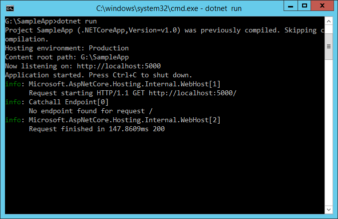
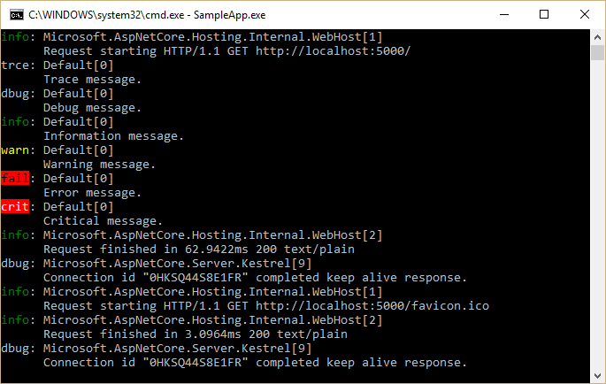
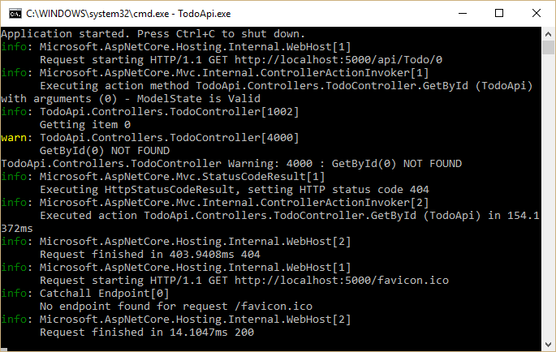

# Logging

By [Steve Smith](http://ardalis.com)

ASP.NET Core has built-in support for logging, and allows developers to easily leverage their preferred logging framework's functionality as well. Implementing logging in your application requires a minimal amount of setup code. Once this is in place, logging can be added wherever it is desired.

[View or download sample code](https://github.com/aspnet/Docs/tree/master/aspnetcore/fundamentals/logging/sample)

## Implementing Logging in your Application

Adding logging to a component in your application is done by requesting either an `ILoggerFactory` or an `ILogger<T>` via [Dependency Injection](dependency-injection.md). If an `ILoggerFactory` is requested, a logger must be created using its `CreateLogger` method. The following example shows how to do this:

[!code-csharp[Main](logging/sample/src/TodoApi/Startup.cs?range=53-54)]

When a logger is created, a category name must be provided. The category name specifies the source of the logging events. By convention this string is hierarchical, with categories separated by dot (`.`) characters. Some logging providers have filtering support that leverages this convention, making it easier to locate logging output of interest. In this article's sample application, logging is configured to use the built-in [`ConsoleLogger`](https://docs.asp.net/projects/api/en/latest/autoapi/Microsoft/Extensions/Logging/Console/ConsoleLogger/index.html) (see [Configuring Logging in your Application](#configuring-logging-in-your-application) below). To see the console logger in action, run the sample application using the `dotnet run` command, and make a request to configured URL (`localhost:5000`). You should see output similar to the following:

You may see more than one log statement per web request you make in your browser, since most browsers will make multiple requests (i.e. for the favicon file) when attempting to load a page. Note that the console logger displayed the log level (`info` in the image above) followed by the category (`[Catchall Endpoint]`), and then the message that was logged.

The call to the log method can utilize a format string with named placeholders (like *{path}*). These placeholders are populated in the order in which they appear by the args values passed into the method call. Some logging providers will store these names along with their mapped values in a dictionary that can later be queried. In the example below, the request path is passed in as a named placeholder:

[!code-csharp[Main](logging/sample/src/TodoApi/Startup.cs?range=54)]

In your real world applications, you will want to add logging based on application-level, not framework-level, events. For instance, if you have created a Web API application for managing To-Do Items (see [Building Your First Web API with ASP.NET Core MVC and Visual Studio](../tutorials/first-web-api.md)), you might add logging around the various operations that can be performed on these items.

The logic for the API is contained within the *TodoController*, which uses [Dependency Injection](dependency-injection.md) to request the services it requires via its constructor. Ideally, classes should follow this example and use their constructor to [define their dependencies explicitly](http://deviq.com/explicit-dependencies-principle/) as parameters. Rather than requesting an *ILoggerFactory* and creating an instance of *ILogger* explicitly, *TodoController* demonstrates another way to work with loggers in your application - you can request an *ILogger<T>* (where *T* is the class requesting the logger).

[!code-csharp[Main](../fundamentals/logging/sample/src/TodoApi/Controllers/TodoController.cs?highlight=5,8,11,17&range=11-30)]

Within each controller action, logging is done through the use of the local field, *_logger*, as shown on line 17, above. This technique is not limited to controllers, but can be utilized by any of your application services that utilize [Dependency Injection](dependency-injection.md).

### Working with ILogger\<T>

As we have just seen, your application can request an instance of `ILogger<T>` as a dependency in a class's constructor, where `T` is the type performing logging. The `TodoController` shows an example of this approach. When this technique is used, the logger will automatically use the type's name as its category name. By requesting an instance of `ILogger<T>`, your class doesn't need to create an instance of a logger via `ILoggerFactory`. You can use this approach anywhere you don't need the additional functionality offered by `ILoggerFactory`.

### Logging Verbosity Levels

When adding logging statements to your application, you must specify a [`LogLevel`](https://docs.asp.net/projects/api/en/latest/autoapi/Microsoft/Extensions/Logging/LogLevel/index.html). The LogLevel allows you to control the verbosity of the logging output from your application, as well as the ability to pipe different kinds of log messages to different loggers. For example, you may wish to log debug messages to a local file, but log errors to the machine's event log or a database.

ASP.NET Core defines six levels of logging verbosity, ordered by increasing importance or severity:

**Trace**

Used for the most detailed log messages, typically only valuable to a developer debugging an issue. These messages may contain sensitive application data and so should not be enabled in a production environment. *Disabled by default.* Example: `Credentials: {"User":"someuser", "Password":"P@ssword"}`

**Debug**

These messages have short-term usefulness during development. They contain information that may be useful for debugging, but have no long-term value. This is the default most verbose level of logging. Example: `Entering method Configure with flag set to true`

**Information**

These messages are used to track the general flow of the application. These logs should have some long term value, as opposed to `Verbose` level messages, which do not. Example: `Request received for path /foo`

**Warning**

The Warning level should be used for abnormal or unexpected events in the application flow. These may include errors or other conditions that do not cause the application to stop, but which may need to be investigated in the future. Handled exceptions are a common place to use the Warning log level. Examples: `Login failed for IP 127.0.0.1` or `FileNotFoundException for file foo.txt`

**Error**

An error should be logged when the current flow of the application must stop due to some failure, such as an exception that cannot be handled or recovered from. These messages should indicate a failure in the current activity or operation (such as the current HTTP request), not an application-wide failure. Example: `Cannot insert record due to duplicate key violation`

**Critical**

A critical log level should be reserved for unrecoverable application or system crashes, or catastrophic failure that requires immediate attention. Examples: data loss scenarios, out of disk space

The `Logging` package provides [`helper extension methods`](https://docs.asp.net/projects/api/en/latest/autoapi/Microsoft/Extensions/Logging/LoggerExtensions/index.html) for each `LogLevel` value, allowing you to call, for example, `LogInformation`, rather than the more verbose `Log(LogLevel.Information, ...)` method. Each of the `LogLevel`-specific extension methods has several overloads, allowing you to pass in some or all of the following parameters:

**string data**

The message to log.

**EventId eventId**

A numeric id to associate with the log, which can be used to associate a series of logged events with one another. Event IDs should be static and specific to a particular kind of event that is being logged. For instance, you might associate adding an item to a shopping cart as event id 1000 and completing a purchase as event id 1001. This allows intelligent filtering and processing of log statements.

**string format**

A format string for the log message.

**object[] args**

An array of objects to format.

**Exception error**

An exception instance to log.

> [!NOTE]
> The `EventId` type can be implicitly casted to `int`, so you can just pass an `int` to this argument.

> [!NOTE]
> Some loggers, such as the built-in `ConsoleLogger` used in this article, will ignore the `eventId` parameter. If you need to display it, you can include it in the message string. This is done in the following sample so you can easily see the eventId associated with each message, but in practice you would not typically include it in the log message.

In the `TodoController` example, event id constants are defined for each event, and log statements are configured at the appropriate verbosity level based on the success of the operation. In this case, successful operations log as `Information` and not found results are logged as `Warning` (error handling is not shown).

[!code-csharp[Main](../fundamentals/logging/sample/src/TodoApi/Controllers/TodoController.cs?highlight=4,12,16&range=24-43)]

> [!NOTE]
> It is recommended that you perform application logging at the level of your application and its APIs, not at the level of the framework. The framework already has logging built in which can be enabled simply by setting the appropriate logging verbosity level.

To see more detailed logging at the framework level, you can adjust the *LogLevel* specified to your logging provider to something more verbose (like *Debug* or *Trace*). For example, if you modify the *AddConsole* call in the *Configure* method to use *LogLevel.Trace* and run the application, the result shows much more framework-level detail about each request:

The console logger prefixes debug output with "dbug: "; there is no trace level debugging enabled by the framework by default. Each log level has a corresponding four character prefix that is used, so that log messages are consistently aligned.

|Log Level	   |Prefix|
|---|---|
|Critical       |crit|
|Error          |fail|
|Warning        |warn|
|Information    |info|
|Debug          |dbug|
|Trace          |trce|

### Scopes

In the course of logging information within your application, you can group a set of logical operations within a *scope*. A scope is an `IDisposable` type returned by calling the `ILogger.BeginScope<TState>` method, which lasts from the moment it is created until it is disposed. The built-in `TraceSource` logger returns a scope instance that is responsible for starting and stopping tracing operations. Any logging state, such as a transaction id, is attached to the scope when it is created.

Scopes are not required, and should be used sparingly, if at all. They're best used for operations that have a distinct beginning and end, such as a transaction involving multiple resources.

## Configuring Logging in your Application

To configure logging in your ASP.NET Core application, you should resolve `ILoggerFactory` in the `Configure` method of your `Startup` class. ASP.NET Core will automatically provide an instance of `ILoggerFactory` using [Dependency Injection](dependency-injection.md) when you add a parameter of this type to the `Configure` method.

[!code-csharp[Main](logging/sample/src/TodoApi/Startup.cs?highlight=3&range=23-25)]

Once you've added `ILoggerFactory` as a parameter, you configure loggers within the `Configure` method by calling methods (or extension methods) on the logger factory. We have already seen an example of this configuration at the beginning of this article, when we added console logging by calling `loggerFactory.AddConsole`.

> [!NOTE]
> You can optionally configure logging when setting up [Hosting](hosting.md), rather than in `Startup`.

Each logger provides its own set of extension methods to `ILoggerFactory`. The console, debug, and event log loggers allow you to specify the minimum logging level at which those loggers should write log messages. The console and debug loggers provide extension methods accepting a function to filter log messages according to their logging level and/or category (for example, `logLevel => logLevel >= LogLevel.Warning` or `(category, loglevel) => category.Contains("MyController") && loglevel >= LogLevel.Trace`). The event log logger provides a similar overload that takes an `EventLogSettings` instance as argument, which may contain a filtering function in its `Filter` property. The TraceSource logger does not provide any of those overloads, since its logging level and other parameters are based on the  `SourceSwitch` and `TraceListener` it uses.

A LoggerFactory instance can optionally be configured with custom `FilterLoggerSettings`. The example below configures custom log levels for different scopes, limiting system and Microsoft built-in logging to warnings while allowing the app to log at debug level by default. The `WithFilter` method returns a new `ILoggerFactory` that will filter the log messages passed to all logger providers registered with it. It does not affect any other `ILoggerFactory` instances, including the original `ILoggerFactory` instance.

[!code-csharp[Main](logging/sample/src/TodoApi/Startup.cs?range=27-34)]

### Configuring TraceSource Logging

When running on the full .NET Framework you can configuring logging to use the existing [System.Diagnostics.TraceSource](https://msdn.microsoft.com/en-us/library/system.diagnostics.tracesource(v=vs.110).aspx) libraries and providers, including easy access to the Windows event log. `TraceSource` allows you to route messages to a variety of listeners and is already in use by many organizations.

First, be sure to add the `Microsoft.Extensions.Logging.TraceSource` package to your project (in *project.json*), along with any specific trace source packages you'll be using (in this case, `TextWriterTraceListener`):

[!code-javascript[Main](../fundamentals/logging/sample/src/TodoApi/project.json?highlight=7,10&range=8-18)]

The following example demonstrates how to configure a `TraceSourceLogger` instance for an application, logging only `Warning` or higher priority messages. Each call to `AddTraceSource` takes a `TraceListener`. The call configures a `TextWriterTraceListener` to write to the console window. This log output will be in addition to the console logger that was already added to this sample, but its behavior is slightly different.

[!code-csharp[Main](logging/sample/src/TodoApi/Startup.cs?range=36-40)]

The `sourceSwitch` is configured to use `SourceLevels.Warning`, so only `Warning` (or higher) log messages are picked up by the `TraceListener` instance.

The API action below logs a warning when the specified `id` is not found:

[!code-csharp[Main](../fundamentals/logging/sample/src/TodoApi/Controllers/TodoController.cs?highlight=8&range=32-43)]

To test out this code, you can trigger logging a warning by running the app from the console and navigating to `http://localhost:5000/api/Todo/0`. You should see output similar to the following:

The yellow line with the "warn: " prefix, along with the following line, is output by the `ConsoleLogger`. The next line, beginning with "TodoApi.Controllers.TodoController", is output from the TraceSource logger. There are many other TraceSource listeners available, and the `TextWriterTraceListener` can be configured to use any `TextWriter` instance, making this a very flexible option for logging.

### Configuring Other Providers

In addition to the built-in loggers, you can configure logging to use other providers. Add the appropriate package to your *project.json* file, and then configure it just like any other provider. Typically, these packages include extension methods on `ILoggerFactory` to make it easy to add them.

   * [elmah.io](https://github.com/elmahio/Elmah.Io.Extensions.Logging) - provider for the elmah.io service

   * [Loggr](https://github.com/imobile3/Loggr.Extensions.Logging) - provider for the Loggr service

   * [NLog](https://github.com/NLog/NLog.Extensions.Logging) - provider for the NLog library

   * [Serilog](https://github.com/serilog/serilog-framework-logging) - provider for the Serilog library

You can create your own custom providers as well, to support other logging frameworks or your own internal logging requirements.

## Logging Recommendations

The following are some recommendations you may find helpful when implementing logging in your ASP.NET Core applications.

1. Log using the correct `LogLevel`. This will allow you to consume and route logging output appropriately based on the importance of the messages.

2. Log information that will enable errors to be identified quickly. Avoid logging irrelevant or redundant information.

3. Keep log messages concise without sacrificing important information.

4. Although loggers will not log if disabled, consider adding code guards around logging methods to prevent extra method calls and log message setup overhead, especially within loops and performance critical methods.

5. Name your loggers with a distinct prefix so they can easily be filtered or disabled. Remember the `Create<T>` extension will create loggers named with the full name of the class.

6. Use Scopes sparingly, and only for actions with a bounded start and end. For example, the framework provides a scope around MVC actions. Avoid nesting many scopes within one another.

7. Application logging code should be related to the business concerns of the application. Increase the logging verbosity to reveal additional framework-related concerns, rather than implementing yourself.

## Summary

ASP.NET Core provides built-in support for logging, which can easily be configured within the `Startup` class and used throughout the application. Logging verbosity can be configured globally and per logging provider to ensure actionable information is logged appropriately. Built-in providers for console and trace source logging are included in the framework; other logging frameworks can easily be configured as well.
