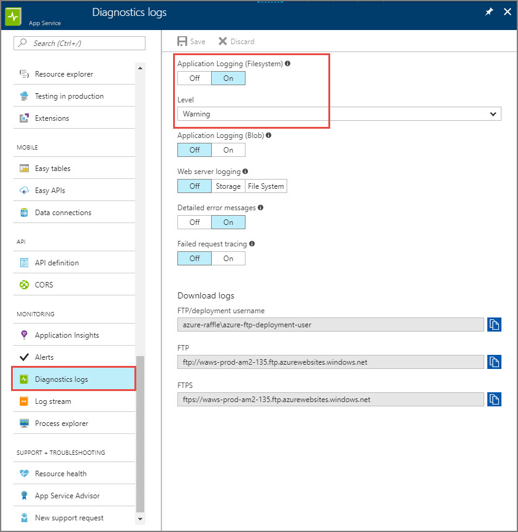
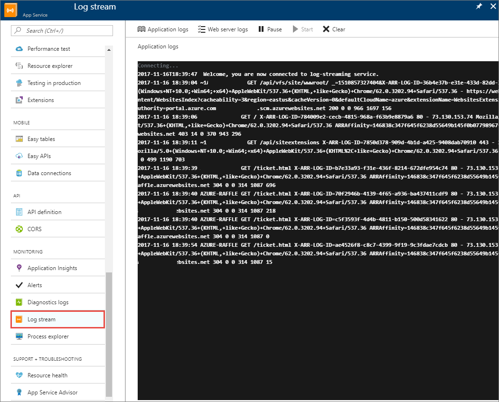

# Logging in ASP.NET Core

By [Steve Smith](https://ardalis.com/) and [Tom Dykstra](https://github.com/tdykstra)

ASP.NET Core supports a logging API that works with a variety of built-in and third-party logging providers. This article shows how to use the logging API with built-in providers.

[View or download sample code](https://github.com/aspnet/Docs/tree/master/aspnetcore/fundamentals/logging/index/samples) ([how to download](xref:tutorials/index#how-to-download-a-sample))

## Add providers

A logging provider displays or stores logs. For example, the Console provider displays logs on the console, and the Azure Application Insights provider stores them in Azure Application Insights. Logs can be sent to multiple destinations by adding multiple providers.

::: moniker range=">= aspnetcore-2.0"

To add a provider, call the provider's `Add{provider name}` extension method in *Program.cs*:

[!code-csharp[](index/samples/2.x/TodoApiSample/Program.cs?name=snippet_ExpandDefault&highlight=17-19)]

The default project template calls the <xref:Microsoft.AspNetCore.WebHost.CreateDefaultBuilder%2A> extension method, which adds the following logging providers:

* Console
* Debug
* EventSource (starting in ASP.NET Core 2.2)

[!code-csharp[](index/samples/2.x/TodoApiSample/Program.cs?name=snippet_TemplateCode&highlight=7)]

If you use `CreateDefaultBuilder`, you can replace the default providers with your own choices. Call <xref:Microsoft.Extensions.Logging.LoggingBuilderExtensions.ClearProviders%2A>, and add the providers you want.

[!code-csharp[](index/samples/2.x/TodoApiSample/Program.cs?name=snippet_LogFromMain&highlight=18-22)]

::: moniker-end

::: moniker range="< aspnetcore-2.0"

To use a provider, install its NuGet package and call the provider's extension method on an instance of <xref:Microsoft.Extensions.Logging.ILoggerFactory>:

[!code-csharp[](index/samples/1.x/TodoApiSample//Startup.cs?name=snippet_AddConsoleAndDebug&highlight=3,5-7)]

ASP.NET Core [dependency injection (DI)](xref:fundamentals/dependency-injection) provides the `ILoggerFactory` instance. The `AddConsole` and `AddDebug` extension methods are defined in the [Microsoft.Extensions.Logging.Console](https://www.nuget.org/packages/Microsoft.Extensions.Logging.Console/) and [Microsoft.Extensions.Logging.Debug](https://www.nuget.org/packages/Microsoft.Extensions.Logging.Debug/) packages. Each extension method calls the `ILoggerFactory.AddProvider` method, passing in an instance of the provider.

> [!NOTE]
> The [sample app](https://github.com/aspnet/Docs/tree/master/aspnetcore/fundamentals/logging/index/samples/1.x) adds logging providers in the `Startup.Configure` method. To obtain log output from code that executes earlier, add logging providers in the `Startup` class constructor.

::: moniker-end

Learn more about [built-in logging providers](#built-in-logging-providers) and [third-party logging providers](#third-party-logging-providers) later in the article.

## Create logs

Get an <xref:Microsoft.Extensions.Logging.ILogger`1> object from DI.

::: moniker range=">= aspnetcore-2.0"

The following controller example creates `Information` and `Warning` logs. The *category* is `TodoApiSample.Controllers.TodoController` (the fully qualified class name of `TodoController` in the sample app):

[!code-csharp[](index/samples/2.x/TodoApiSample/Controllers/TodoController.cs?name=snippet_LoggerDI&highlight=4,7)]

[!code-csharp[](index/samples/2.x/TodoApiSample/Controllers/TodoController.cs?name=snippet_CallLogMethods&highlight=3,7)]

The following Razor Pages example creates logs with `Information` as the *level* and `TodoApiSample.Pages.AboutModel` as the *category*:

[!code-csharp[](index/samples/2.x/TodoApiSample/Pages/About.cshtml.cs?name=snippet_LoggerDI&highlight=3, 7)]

[!code-csharp[](index/samples/2.x/TodoApiSample/Pages/About.cshtml.cs?name=snippet_CallLogMethods&highlight=4)]

::: moniker-end

::: moniker range="< aspnetcore-2.0"

[!code-csharp[](index/samples/1.x/TodoApiSample/Controllers/TodoController.cs?name=snippet_LoggerDI&highlight=7)]

[!code-csharp[](index/samples/1.x/TodoApiSample/Controllers/TodoController.cs?name=snippet_CallLogMethods&highlight=3,7)]

The preceding example creates logs with `Information` and `Warning` as the *level* and `TodoController` class as the *category*. 

::: moniker-end

The Log *level* indicates the severity of the logged event. The log *category* is a string that is associated with each log. The `ILogger<T>` instance creates logs that have the fully qualified name of type `T` as the category. [Levels](#log-level) and [categories](#log-category) are explained in more detail later in this article. 

::: moniker range=">= aspnetcore-2.0"

### Create logs in Startup

To write logs in the `Startup` class, include an `ILogger` parameter in the constructor signature:

[!code-csharp[](index/samples/2.x/TodoApiSample/Startup.cs?name=snippet_Startup&highlight=3,5,8,19,26)]

### Create logs in Program

To write logs in the `Program` class, get an `ILogger` instance from DI:

[!code-csharp[](index/samples/2.x/TodoApiSample/Program.cs?name=snippet_LogFromMain&highlight=9,10)]

::: moniker-end

### No asynchronous logger methods

Logging should be so fast that it isn't worth the performance cost of asynchronous code. If your logging data store is slow, don't write to it directly. Consider writing the log messages to a fast store initially, then move them to the slow store later. For example, log to a message queue that's read and persisted to slow storage by another process.

## Configuration

Logging provider configuration is provided by one or more configuration providers:

* File formats (INI, JSON, and XML).
* Command-line arguments.
* Environment variables.
* In-memory .NET objects.
* The unencrypted [Secret Manager](xref:security/app-secrets) storage.
* An encrypted user store, such as [Azure Key Vault](xref:security/key-vault-configuration).
* Custom providers (installed or created).

For example, logging configuration is commonly provided by the `Logging` section of app settings files. The following example shows the contents of a typical *appsettings.Development.json* file:

::: moniker range=">= aspnetcore-2.1"

```json
{
  "Logging": {
    "LogLevel": {
      "Default": "Debug",
      "System": "Information",
      "Microsoft": "Information"
    },
    "Console":
    {
      "IncludeScopes": true
    }
  }
}
```

The `Logging` property can have `LogLevel` and log provider properties (Console is shown).

The `LogLevel` property under `Logging` specifies the minimum [level](#log-level) to log for selected categories. In the example, `System` and `Microsoft` categories log at `Information` level, and all others log at `Debug` level.

Other properties under `Logging` specify logging providers. The example is for the Console provider. If a provider supports [log scopes](#log-scopes), `IncludeScopes` indicates whether they're enabled. A provider property (such as `Console` in the example) may also specify a `LogLevel` property. `LogLevel` under a provider specifies levels to log for that provider.

If levels are specified in `Logging.{providername}.LogLevel`, they override anything set in `Logging.LogLevel`.

::: moniker-end

::: moniker range="< aspnetcore-2.1"

```json
{
  "Logging": {
    "LogLevel": {
      "Default": "Debug",
      "System": "Information",
      "Microsoft": "Information"
    }
  }
}
```

`LogLevel` keys represent log names. The `Default` key applies to logs not explicitly listed. The value represents the [log level](#log-level) applied to the given log.

::: moniker-end

For information on implementing configuration providers, see <xref:fundamentals/configuration/index>.

## Sample logging output

With the sample code shown in the preceding section, logs appear in the console when the app is run from the command line. Here's an example of console output:

```console
info: Microsoft.AspNetCore.Hosting.Internal.WebHost[1]
      Request starting HTTP/1.1 GET http://localhost:5000/api/todo/0
info: Microsoft.AspNetCore.Mvc.Internal.ControllerActionInvoker[1]
      Executing action method TodoApi.Controllers.TodoController.GetById (TodoApi) with arguments (0) - ModelState is Valid
info: TodoApi.Controllers.TodoController[1002]
      Getting item 0
warn: TodoApi.Controllers.TodoController[4000]
      GetById(0) NOT FOUND
info: Microsoft.AspNetCore.Mvc.StatusCodeResult[1]
      Executing HttpStatusCodeResult, setting HTTP status code 404
info: Microsoft.AspNetCore.Mvc.Internal.ControllerActionInvoker[2]
      Executed action TodoApi.Controllers.TodoController.GetById (TodoApi) in 42.9286ms
info: Microsoft.AspNetCore.Hosting.Internal.WebHost[2]
      Request finished in 148.889ms 404
```

The preceding logs were generated by making an HTTP Get request to the sample app at `http://localhost:5000/api/todo/0`.

Here's an example of the same logs as they appear in the Debug window when you run the sample app in Visual Studio:


```console
Microsoft.AspNetCore.Hosting.Internal.WebHost:Information: Request starting HTTP/1.1 GET http://localhost:53104/api/todo/0  
Microsoft.AspNetCore.Mvc.Internal.ControllerActionInvoker:Information: Executing action method TodoApi.Controllers.TodoController.GetById (TodoApi) with arguments (0) - ModelState is Valid
TodoApi.Controllers.TodoController:Information: Getting item 0
TodoApi.Controllers.TodoController:Warning: GetById(0) NOT FOUND
Microsoft.AspNetCore.Mvc.StatusCodeResult:Information: Executing HttpStatusCodeResult, setting HTTP status code 404
Microsoft.AspNetCore.Mvc.Internal.ControllerActionInvoker:Information: Executed action TodoApi.Controllers.TodoController.GetById (TodoApi) in 152.5657ms
Microsoft.AspNetCore.Hosting.Internal.WebHost:Information: Request finished in 316.3195ms 404
```

The logs that are created by the `ILogger` calls shown in the preceding section begin with "TodoApi.Controllers.TodoController". The logs that begin with "Microsoft" categories are from ASP.NET Core framework code. ASP.NET Core and application code are using the same logging API and providers.

The remainder of this article explains some details and options for logging.

## NuGet packages

The `ILogger` and `ILoggerFactory` interfaces are in [Microsoft.Extensions.Logging.Abstractions](https://www.nuget.org/packages/Microsoft.Extensions.Logging.Abstractions/), and default implementations for them are in [Microsoft.Extensions.Logging](https://www.nuget.org/packages/microsoft.extensions.logging/).

## Log category

When an `ILogger` object is created, a *category* is specified for it. That category is included with each log message created by that instance of `Ilogger`. The category may be any string, but the convention is to use the class name, such as "TodoApi.Controllers.TodoController".

Use `ILogger<T>` to get an `ILogger` instance that uses the fully qualified type name of `T` as the category:

::: moniker range=">= aspnetcore-2.0"

[!code-csharp[](index/samples/2.x/TodoApiSample/Controllers/TodoController.cs?name=snippet_LoggerDI&highlight=7)]

::: moniker-end

::: moniker range="< aspnetcore-2.0"

[!code-csharp[](index/samples/1.x/TodoApiSample/Controllers/TodoController.cs?name=snippet_LoggerDI&highlight=7)]

::: moniker-end

To explicitly specify the category, call `ILoggerFactory.CreateLogger`:

::: moniker range=">= aspnetcore-2.0"

[!code-csharp[](index/samples/2.x/TodoApiSample/Controllers/TodoController.cs?name=snippet_CreateLogger&highlight=7,10)]

::: moniker-end

::: moniker range="< aspnetcore-2.0"

[!code-csharp[](index/samples/1.x/TodoApiSample/Controllers/TodoController.cs?name=snippet_CreateLogger&highlight=7,10)]

::: moniker-end

`ILogger<T>` is equivalent to calling `CreateLogger` with the fully qualified type name of `T`.

## Log level

Every log specifies a <xref:Microsoft.Extensions.Logging.LogLevel> value. The log level indicates the severity or importance. For example, you might write an `Information` log when a method ends normally and a `Warning` log when a method returns a *404 Not Found* status code.

The following code creates `Information` and `Warning` logs:

::: moniker range=">= aspnetcore-2.0"

[!code-csharp[](index/samples/2.x/TodoApiSample/Controllers/TodoController.cs?name=snippet_CallLogMethods&highlight=3,7)]

::: moniker-end

::: moniker range="< aspnetcore-2.0"

[!code-csharp[](index/samples/1.x/TodoApiSample/Controllers/TodoController.cs?name=snippet_CallLogMethods&highlight=3,7)]

::: moniker-end

In the preceding code, the first parameter is the [Log event ID](#log-event-id). The second parameter is a message template with placeholders for argument values provided by the remaining method parameters. The method parameters are explained in the [message template section](#log-message-template) later in this article.

Log methods that include the level in the method name (for example, `LogInformation` and `LogWarning`) are [extension methods for ILogger](xref:Microsoft.Extensions.Logging.LoggerExtensions). These methods call a `Log` method that takes a `LogLevel` parameter. You can call the `Log` method directly rather than one of these extension methods, but the syntax is relatively complicated. For more information, see <xref:Microsoft.Extensions.Logging.ILogger> and the [logger extensions source code](https://github.com/aspnet/Logging/blob/master/src/Microsoft.Extensions.Logging.Abstractions/LoggerExtensions.cs).

ASP.NET Core defines the following log levels, ordered here from lowest to highest severity.

* Trace = 0

  For information that's typically valuable only for debugging. These messages may contain sensitive application data and so shouldn't be enabled in a production environment. *Disabled by default.*

* Debug = 1

  For information that may be useful in development and debugging. Example: `Entering method Configure with flag set to true.` Enable `Debug` level logs in production only when troubleshooting, due to the high volume of logs.

* Information = 2

  For tracking the general flow of the app. These logs typically have some long-term value. Example: `Request received for path /api/todo`

* Warning = 3

  For abnormal or unexpected events in the app flow. These may include errors or other conditions that don't cause the app to stop but might need to be investigated. Handled exceptions are a common place to use the `Warning` log level. Example: `FileNotFoundException for file quotes.txt.`

* Error = 4

  For errors and exceptions that cannot be handled. These messages indicate a failure in the current activity or operation (such as the current HTTP request), not an app-wide failure. Example log message: `Cannot insert record due to duplicate key violation.`

* Critical = 5

  For failures that require immediate attention. Examples: data loss scenarios, out of disk space.

Use the log level to control how much log output is written to a particular storage medium or display window. For example:

* In production, send `Trace` through `Information` level to a volume data store. Send `Warning` through `Critical` to a value data store.
* During development, send `Warning` through `Critical` to the console, and add `Trace` through `Information` when troubleshooting.

The [Log filtering](#log-filtering) section later in this article explains how to control which log levels a provider handles.

ASP.NET Core writes logs for framework events. The log examples earlier in this article excluded logs below `Information` level, so no `Debug` or `Trace` level logs were created. Here's an example of console logs produced by running the sample app configured to show `Debug` logs:

```console
info: Microsoft.AspNetCore.Hosting.Internal.WebHost[1]
      Request starting HTTP/1.1 GET http://localhost:62555/api/todo/0
dbug: Microsoft.AspNetCore.Routing.Tree.TreeRouter[1]
      Request successfully matched the route with name 'GetTodo' and template 'api/Todo/{id}'.
dbug: Microsoft.AspNetCore.Mvc.Internal.ActionSelector[2]
      Action 'TodoApi.Controllers.TodoController.Update (TodoApi)' with id '089d59b6-92ec-472d-b552-cc613dfd625d' did not match the constraint 'Microsoft.AspNetCore.Mvc.Internal.HttpMethodActionConstraint'
dbug: Microsoft.AspNetCore.Mvc.Internal.ActionSelector[2]
      Action 'TodoApi.Controllers.TodoController.Delete (TodoApi)' with id 'f3476abe-4bd9-4ad3-9261-3ead09607366' did not match the constraint 'Microsoft.AspNetCore.Mvc.Internal.HttpMethodActionConstraint'
dbug: Microsoft.AspNetCore.Mvc.Internal.ControllerActionInvoker[1]
      Executing action TodoApi.Controllers.TodoController.GetById (TodoApi)
info: Microsoft.AspNetCore.Mvc.Internal.ControllerActionInvoker[1]
      Executing action method TodoApi.Controllers.TodoController.GetById (TodoApi) with arguments (0) - ModelState is Valid
info: TodoApi.Controllers.TodoController[1002]
      Getting item 0
warn: TodoApi.Controllers.TodoController[4000]
      GetById(0) NOT FOUND
dbug: Microsoft.AspNetCore.Mvc.Internal.ControllerActionInvoker[2]
      Executed action method TodoApi.Controllers.TodoController.GetById (TodoApi), returned result Microsoft.AspNetCore.Mvc.NotFoundResult.
info: Microsoft.AspNetCore.Mvc.StatusCodeResult[1]
      Executing HttpStatusCodeResult, setting HTTP status code 404
info: Microsoft.AspNetCore.Mvc.Internal.ControllerActionInvoker[2]
      Executed action TodoApi.Controllers.TodoController.GetById (TodoApi) in 0.8788ms
dbug: Microsoft.AspNetCore.Server.Kestrel[9]
      Connection id "0HL6L7NEFF2QD" completed keep alive response.
info: Microsoft.AspNetCore.Hosting.Internal.WebHost[2]
      Request finished in 2.7286ms 404
```

## Log event ID

Each log can specify an *event ID*. The sample app does this by using a locally defined `LoggingEvents` class:

::: moniker range=">= aspnetcore-2.0"

[!code-csharp[](index/samples/2.x/TodoApiSample/Controllers/TodoController.cs?name=snippet_CallLogMethods&highlight=3,7)]

[!code-csharp[](index/samples/2.x/TodoApiSample/Core/LoggingEvents.cs?name=snippet_LoggingEvents)]

::: moniker-end

::: moniker range="< aspnetcore-2.0"

[!code-csharp[](index/samples/1.x/TodoApiSample/Controllers/TodoController.cs?name=snippet_CallLogMethods&highlight=3,7)]

[!code-csharp[](index/samples/1.x/TodoApiSample/Core/LoggingEvents.cs?name=snippet_LoggingEvents)]

::: moniker-end

An event ID associates a set of events. For example, all logs related to displaying a list of items on a page might be 1001.

The logging provider may store the event ID in an ID field, in the logging message, or not at all. The Debug provider doesn't show event IDs. The console provider shows event IDs in brackets after the category:

```console
info: TodoApi.Controllers.TodoController[1002]
      Getting item invalidid
warn: TodoApi.Controllers.TodoController[4000]
      GetById(invalidid) NOT FOUND
```

## Log message template

Each log specifies a message template. The message template can contain placeholders for which arguments are provided. Use names for the placeholders, not numbers.

::: moniker range=">= aspnetcore-2.0"

[!code-csharp[](index/samples/2.x/TodoApiSample/Controllers/TodoController.cs?name=snippet_CallLogMethods&highlight=3,7)]

::: moniker-end

::: moniker range="< aspnetcore-2.0"

[!code-csharp[](index/samples/1.x/TodoApiSample/Controllers/TodoController.cs?name=snippet_CallLogMethods&highlight=3,7)]

::: moniker-end

The order of placeholders, not their names, determines which parameters are used to provide their values. In the following code, notice that the parameter names are out of sequence in the message template:

```csharp
string p1 = "parm1";
string p2 = "parm2";
_logger.LogInformation("Parameter values: {p2}, {p1}", p1, p2);
```

This code creates a log message with the parameter values in sequence:

```
Parameter values: parm1, parm2
```

The logging framework works this way so that logging providers can implement [semantic logging, also known as structured logging](https://softwareengineering.stackexchange.com/questions/312197/benefits-of-structured-logging-vs-basic-logging). The arguments themselves are passed to the logging system, not just the formatted message template. This information enables logging providers to store the parameter values as fields. For example, suppose logger method calls look like this:

```csharp
_logger.LogInformation("Getting item {ID} at {RequestTime}", id, DateTime.Now);
```

If you're sending the logs to Azure Table Storage, each Azure Table entity can have `ID` and `RequestTime` properties, which simplifies queries on log data. A query can find all logs within a particular `RequestTime` range without parsing the time out of the text message.

## Logging exceptions

The logger methods have overloads that let you pass in an exception, as in the following example:

::: moniker range=">= aspnetcore-2.0"

[!code-csharp[](index/samples/2.x/TodoApiSample/Controllers/TodoController.cs?name=snippet_LogException&highlight=3)]

::: moniker-end

::: moniker range="< aspnetcore-2.0"

[!code-csharp[](index/samples/1.x/TodoApiSample/Controllers/TodoController.cs?name=snippet_LogException&highlight=3)]

::: moniker-end

Different providers handle the exception information in different ways. Here's an example of Debug provider output from the code shown above.

```
TodoApi.Controllers.TodoController:Warning: GetById(036dd898-fb01-47e8-9a65-f92eb73cf924) NOT FOUND

System.Exception: Item not found exception.
 at TodoApi.Controllers.TodoController.GetById(String id) in C:\logging\sample\src\TodoApi\Controllers\TodoController.cs:line 226
```

## Log filtering

::: moniker range=">= aspnetcore-2.0"

You can specify a minimum log level for a specific provider and category or for all providers or all categories. Any logs below the minimum level aren't passed to that provider, so they don't get displayed or stored.

To suppress all logs, specify `LogLevel.None` as the minimum log level. The integer value of `LogLevel.None` is 6, which is higher than `LogLevel.Critical` (5).

### Create filter rules in configuration

The project template code calls `CreateDefaultBuilder` to set up logging for the Console and Debug providers. The `CreateDefaultBuilder` method also sets up logging to look for configuration in a `Logging` section, using code like the following:

[!code-csharp[](index/samples/2.x/TodoApiSample/Program.cs?name=snippet_ExpandDefault&highlight=15)]

The configuration data specifies minimum log levels by provider and category, as in the following example:

[!code-json[](index/samples/2.x/TodoApiSample/appsettings.json)]

This JSON creates six filter rules: one for the Debug provider, four for the Console provider, and one for all providers. A single rule is chosen for each provider when an `ILogger` object is created.

### Filter rules in code

The following example shows how to register filter rules in code:

[!code-csharp[](index/samples/2.x/TodoApiSample/Program.cs?name=snippet_FilterInCode&highlight=4-5)]

The second `AddFilter` specifies the Debug provider by using its type name. The first `AddFilter` applies to all providers because it doesn't specify a provider type.

### How filtering rules are applied

The configuration data and the `AddFilter` code shown in the preceding examples create the rules shown in the following table. The first six come from the configuration example and the last two come from the code example.

| Number | Provider      | Categories that begin with ...          | Minimum log level |
| :----: | ------------- | --------------------------------------- | ----------------- |
| 1      | Debug         | All categories                          | Information       |
| 2      | Console       | Microsoft.AspNetCore.Mvc.Razor.Internal | Warning           |
| 3      | Console       | Microsoft.AspNetCore.Mvc.Razor.Razor    | Debug             |
| 4      | Console       | Microsoft.AspNetCore.Mvc.Razor          | Error             |
| 5      | Console       | All categories                          | Information       |
| 6      | All providers | All categories                          | Debug             |
| 7      | All providers | System                                  | Debug             |
| 8      | Debug         | Microsoft                               | Trace             |

When an `ILogger` object is created, the `ILoggerFactory` object selects a single rule per provider to apply to that logger. All messages written by an `ILogger` instance are filtered based on the selected rules. The most specific rule possible for each provider and category pair is selected from the available rules.

The following algorithm is used for each provider when an `ILogger` is created for a given category:

* Select all rules that match the provider or its alias. If no match is found, select all rules with an empty provider.
* From the result of the preceding step, select rules with longest matching category prefix. If no match is found, select all rules that don't specify a category.
* If multiple rules are selected, take the **last** one.
* If no rules are selected, use `MinimumLevel`.

With the preceding list of rules, suppose you create an `ILogger` object for category "Microsoft.AspNetCore.Mvc.Razor.RazorViewEngine":

* For the Debug provider, rules 1, 6, and 8 apply. Rule 8 is most specific, so that's the one selected.
* For the Console provider, rules 3, 4, 5, and 6 apply. Rule 3 is most specific.

The resulting `ILogger` instance sends logs of `Trace` level and above to the Debug provider. Logs of `Debug` level and above are sent to the Console provider.

### Provider aliases

Each provider defines an *alias* that can be used in configuration in place of the fully qualified type name.  For the built-in providers, use the following aliases:

* Console
* Debug
* EventLog
* AzureAppServices
* TraceSource
* EventSource

### Default minimum level

There's a minimum level setting that takes effect only if no rules from configuration or code apply for a given provider and category. The following example shows how to set the minimum level:

[!code-csharp[](index/samples/2.x/TodoApiSample/Program.cs?name=snippet_MinLevel&highlight=3)]

If you don't explicitly set the minimum level, the default value is `Information`, which means that `Trace` and `Debug` logs are ignored.

### Filter functions

A filter function is invoked for all providers and categories that don't have rules assigned to them by configuration or code. Code in the function has access to the provider type, category, and log level. For example:

[!code-csharp[](index/samples/2.x/TodoApiSample/Program.cs?name=snippet_FilterFunction&highlight=5-13)]

::: moniker-end

::: moniker range="< aspnetcore-2.0"

Some logging providers let you specify when logs should be written to a storage medium or ignored based on log level and category.

The `AddConsole` and `AddDebug` extension methods provide overloads that accept filtering criteria. The following sample code causes the console provider to ignore logs below `Warning` level, while the Debug provider ignores logs that the framework creates.

[!code-csharp[](index/samples/1.x/TodoApiSample/Startup.cs?name=snippet_AddConsoleAndDebugWithFilter&highlight=6-7)]

The `AddEventLog` method has an overload that takes an `EventLogSettings` instance, which may contain a filtering function in its `Filter` property. The TraceSource provider doesn't provide any of those overloads, since its logging level and other parameters are based on the `SourceSwitch` and `TraceListener` it uses.

To set filtering rules for all providers that are registered with an `ILoggerFactory` instance, use the `WithFilter` extension method. The example below limits framework logs (category begins with "Microsoft" or "System") to warnings while logging at debug level for logs created by application code.

[!code-csharp[](index/samples/1.x/TodoApiSample/Startup.cs?name=snippet_FactoryFilter&highlight=6-11)]

To prevent any logs from being written, specify `LogLevel.None` as the minimum log level. The integer value of `LogLevel.None` is 6, which is higher than `LogLevel.Critical` (5).

The `WithFilter` extension method is provided by the [Microsoft.Extensions.Logging.Filter](https://www.nuget.org/packages/Microsoft.Extensions.Logging.Filter) NuGet package. The method returns a new `ILoggerFactory` instance that will filter the log messages passed to all logger providers registered with it. It doesn't affect any other `ILoggerFactory` instances, including the original `ILoggerFactory` instance.

::: moniker-end

## System categories and levels

Here are some categories used by ASP.NET Core and Entity Framework Core, with notes about what logs to expect from them:

| Category                            | Notes |
| ----------------------------------- | ----- |
| Microsoft.AspNetCore                | General ASP.NET Core diagnostics. |
| Microsoft.AspNetCore.DataProtection | Which keys were considered, found, and used. |
| Microsoft.AspNetCore.HostFiltering  | Hosts allowed. |
| Microsoft.AspNetCore.Hosting        | How long HTTP requests took to complete and what time they started. Which hosting startup assemblies were loaded. |
| Microsoft.AspNetCore.Mvc            | MVC and Razor diagnostics. Model binding, filter execution, view compilation, action selection. |
| Microsoft.AspNetCore.Routing        | Route matching information. |
| Microsoft.AspNetCore.Server         | Connection start, stop, and keep alive responses. HTTPS certificate information. |
| Microsoft.AspNetCore.StaticFiles    | Files served. |
| Microsoft.EntityFrameworkCore       | General Entity Framework Core diagnostics. Database activity and configuration, change detection, migrations. |

## Log scopes

 A *scope* can group a set of logical operations. This grouping can be used to attach the same data to each log that's created as part of a set. For example, every log created as part of processing a transaction can include the transaction ID.

A scope is an `IDisposable` type that's returned by the <xref:Microsoft.Extensions.Logging.ILogger.BeginScope*> method and lasts until it's disposed. Use a scope by wrapping logger calls in a `using` block:

[!code-csharp[](index/samples/1.x/TodoApiSample/Controllers/TodoController.cs?name=snippet_Scopes&highlight=4-5,13)]

The following code enables scopes for the console provider:

::: moniker range="> aspnetcore-2.0"

*Program.cs*:

[!code-csharp[](index/samples/2.x/TodoApiSample/Program.cs?name=snippet_Scopes&highlight=4)]

> [!NOTE]
> Configuring the `IncludeScopes` console logger option is required to enable scope-based logging.
>
> For information on configuration, see the [Configuration](#configuration) section.

::: moniker-end

::: moniker range="= aspnetcore-2.0"

*Program.cs*:

[!code-csharp[](index/samples/2.x/TodoApiSample/Program.cs?name=snippet_Scopes&highlight=4)]

> [!NOTE]
> Configuring the `IncludeScopes` console logger option is required to enable scope-based logging.

::: moniker-end

::: moniker range="< aspnetcore-2.0"

*Startup.cs*:

[!code-csharp[](index/samples/1.x/TodoApiSample/Startup.cs?name=snippet_Scopes&highlight=6)]

::: moniker-end

Each log message includes the scoped information:

```
info: TodoApi.Controllers.TodoController[1002]
      => RequestId:0HKV9C49II9CK RequestPath:/api/todo/0 => TodoApi.Controllers.TodoController.GetById (TodoApi) => Message attached to logs created in the using block
      Getting item 0
warn: TodoApi.Controllers.TodoController[4000]
      => RequestId:0HKV9C49II9CK RequestPath:/api/todo/0 => TodoApi.Controllers.TodoController.GetById (TodoApi) => Message attached to logs created in the using block
      GetById(0) NOT FOUND
```

## Built-in logging providers

ASP.NET Core ships the following providers:

* [Console](#console-provider)
* [Debug](#debug-provider)
* [EventSource](#eventsource-provider)
* [EventLog](#windows-eventlog-provider)
* [TraceSource](#tracesource-provider)

Options for [Logging in Azure](#logging-in-azure) are covered later in this article.

For information about stdout logging, see <xref:host-and-deploy/iis/troubleshoot#aspnet-core-module-stdout-log> and <xref:host-and-deploy/azure-apps/troubleshoot#aspnet-core-module-stdout-log>.

### Console provider

The [Microsoft.Extensions.Logging.Console](https://www.nuget.org/packages/Microsoft.Extensions.Logging.Console) provider package sends log output to the console. 

::: moniker range=">= aspnetcore-2.0"

```csharp
logging.AddConsole();
```

::: moniker-end

::: moniker range="< aspnetcore-2.0"

```csharp
loggerFactory.AddConsole();
```

[AddConsole overloads](xref:Microsoft.Extensions.Logging.ConsoleLoggerExtensions) let you pass in a minimum log level, a filter function, and a boolean that indicates whether scopes are supported. Another option is to pass in an `IConfiguration` object, which can specify scopes support and logging levels.

The console provider has a significant impact on performance and is generally not appropriate for use in production.

When you create a new project in Visual Studio, the `AddConsole` method looks like this:

```csharp
loggerFactory.AddConsole(Configuration.GetSection("Logging"));
```

This code refers to the `Logging` section of the *appSettings.json* file:

[!code-json[](index/samples/1.x/TodoApiSample//appsettings.json)]

The settings shown limit framework logs to warnings while allowing the app to log at debug level, as explained in the [Log filtering](#log-filtering) section. For more information, see [Configuration](xref:fundamentals/configuration/index).

::: moniker-end

To see console logging output, open a command prompt in the project folder and run the following command:

```console
dotnet run
```

### Debug provider

The [Microsoft.Extensions.Logging.Debug](https://www.nuget.org/packages/Microsoft.Extensions.Logging.Debug) provider package writes log output by using the [System.Diagnostics.Debug](/dotnet/api/system.diagnostics.debug) class (`Debug.WriteLine` method calls).

On Linux, this provider writes logs to */var/log/message*.

::: moniker range=">= aspnetcore-2.0"

```csharp
logging.AddDebug();
```

::: moniker-end

::: moniker range="< aspnetcore-2.0"

```csharp
loggerFactory.AddDebug();
```

[AddDebug overloads](xref:Microsoft.Extensions.Logging.DebugLoggerFactoryExtensions) let you pass in a minimum log level or a filter function.

::: moniker-end

### EventSource provider

For apps that target ASP.NET Core 1.1.0 or later, the [Microsoft.Extensions.Logging.EventSource](https://www.nuget.org/packages/Microsoft.Extensions.Logging.EventSource) provider package can implement event tracing. On Windows, it uses [ETW](https://msdn.microsoft.com/library/windows/desktop/bb968803). The provider is cross-platform, but there are no event collection and display tools yet for Linux or macOS.

::: moniker range=">= aspnetcore-2.0"

```csharp
logging.AddEventSourceLogger();
```

::: moniker-end

::: moniker range="< aspnetcore-2.0"

```csharp
loggerFactory.AddEventSourceLogger();
```

::: moniker-end

A good way to collect and view logs is to use the [PerfView utility](https://github.com/Microsoft/perfview). There are other tools for viewing ETW logs, but PerfView provides the best experience for working with the ETW events emitted by ASP.NET.

To configure PerfView for collecting events logged by this provider, add the string `*Microsoft-Extensions-Logging` to the **Additional Providers** list. (Don't miss the asterisk at the start of the string.)


### Windows EventLog provider

The [Microsoft.Extensions.Logging.EventLog](https://www.nuget.org/packages/Microsoft.Extensions.Logging.EventLog) provider package sends log output to the Windows Event Log.

::: moniker range=">= aspnetcore-2.0"

```csharp
logging.AddEventLog();
```

::: moniker-end

::: moniker range="< aspnetcore-2.0"

```csharp
loggerFactory.AddEventLog();
```

[AddEventLog overloads](xref:Microsoft.Extensions.Logging.EventLoggerFactoryExtensions) let you pass in `EventLogSettings` or a minimum log level.

::: moniker-end

### TraceSource provider

The [Microsoft.Extensions.Logging.TraceSource](https://www.nuget.org/packages/Microsoft.Extensions.Logging.TraceSource) provider package uses the <xref:System.Diagnostics.TraceSource> libraries and providers.

::: moniker range=">= aspnetcore-2.0"

```csharp
logging.AddTraceSource(sourceSwitchName);
```

::: moniker-end

::: moniker range="< aspnetcore-2.0"

```csharp
loggerFactory.AddTraceSource(sourceSwitchName);
```

::: moniker-end

[AddTraceSource overloads](xref:Microsoft.Extensions.Logging.TraceSourceFactoryExtensions) let you pass in a source switch and a trace listener.

To use this provider, an app has to run on the .NET Framework (rather than .NET Core). The provider can route messages to a variety of [listeners](/dotnet/framework/debug-trace-profile/trace-listeners), such as the <xref:System.Diagnostics.TextWriterTraceListener> used in the sample app.

::: moniker range="< aspnetcore-2.0"

The following example configures a `TraceSource` provider that logs `Warning` and higher messages to the console window.

[!code-csharp[](index/samples/1.x/TodoApiSample/Startup.cs?name=snippet_TraceSource&highlight=9-12)]

::: moniker-end

## Logging in Azure

For information about logging in Azure, see the following sections:

* [Azure App Service provider](#azure-app-service-provider)
* [Azure log streaming](#azure-log-streaming)

::: moniker range=">= aspnetcore-1.1"

* [Azure Application Insights trace logging](#azure-application-insights-trace-logging)

::: moniker-end

### Azure App Service provider

The [Microsoft.Extensions.Logging.AzureAppServices](https://www.nuget.org/packages/Microsoft.Extensions.Logging.AzureAppServices) provider package writes logs to text files in an Azure App Service app's file system and to [blob storage](https://azure.microsoft.com/documentation/articles/storage-dotnet-how-to-use-blobs/#what-is-blob-storage) in an Azure Storage account. The provider package is available for apps targeting .NET Core 1.1 or later.

::: moniker range=">= aspnetcore-2.0"

If targeting .NET Core, note the following points:

::: moniker-end

::: moniker range="= aspnetcore-2.0"

* The provider package is included in the ASP.NET Core [Microsoft.AspNetCore.All metapackage](xref:fundamentals/metapackage).

::: moniker-end

::: moniker range=">= aspnetcore-2.1"

* The provider package isn't included in the [Microsoft.AspNetCore.App metapackage](xref:fundamentals/metapackage-app). To use the provider, install the package.

::: moniker-end

::: moniker range=">= aspnetcore-2.0"

* Don't explicitly call <xref:Microsoft.Extensions.Logging.AzureAppServicesLoggerFactoryExtensions.AddAzureWebAppDiagnostics*>. The provider is automatically made available to the app when the app is deployed to Azure App Service.

If targeting .NET Framework or referencing the `Microsoft.AspNetCore.App` metapackage, add the provider package to the project. Invoke `AddAzureWebAppDiagnostics` on an <xref:Microsoft.Extensions.Logging.ILoggerFactory> instance:

```csharp
logging.AddAzureWebAppDiagnostics();
```

::: moniker-end

::: moniker range="= aspnetcore-1.1"

```csharp
loggerFactory.AddAzureWebAppDiagnostics();
```

::: moniker-end

::: moniker range=">= aspnetcore-1.1"

An <xref:Microsoft.Extensions.Logging.AzureAppServicesLoggerFactoryExtensions.AddAzureWebAppDiagnostics*> overload lets you pass in <xref:Microsoft.Extensions.Logging.AzureAppServices.AzureAppServicesDiagnosticsSettings>. The settings object can override default settings, such as the logging output template, blob name, and file size limit. (*Output template* is a message template that's applied to all logs in addition to what's provided with an `ILogger` method call.)

When you deploy to an App Service app, the application honors the settings in the [Diagnostic Logs](/azure/app-service/web-sites-enable-diagnostic-log/#enablediag) section of the **App Service** page of the Azure portal. When these settings are updated, the changes take effect immediately without requiring a restart or redeployment of the app.


The default location for log files is in the *D:\\home\\LogFiles\\Application* folder, and the default file name is *diagnostics-yyyymmdd.txt*. The default file size limit is 10 MB, and the default maximum number of files retained is 2. The default blob name is *{app-name}{timestamp}/yyyy/mm/dd/hh/{guid}-applicationLog.txt*. For more information about default behavior, see <xref:Microsoft.Extensions.Logging.AzureAppServices.AzureAppServicesDiagnosticsSettings>.

The provider only works when the project runs in the Azure environment. It has no effect when the project is run locally&mdash;it doesn't write to local files or local development storage for blobs.

::: moniker-end

### Azure log streaming

Azure log streaming lets you view log activity in real time from:

* The app server
* The web server
* Failed request tracing

To configure Azure log streaming:

* Navigate to the **Diagnostics Logs** page from your app's portal page.
* Set **Application Logging (Filesystem)** to **On**.



Navigate to the **Log Streaming** page to view app messages. They're logged by the app through the `ILogger` interface.



::: moniker range=">= aspnetcore-1.1"

### Azure Application Insights trace logging

The Application Insights SDK can collect and report logs generated by the ASP.NET Core logging infrastructure. For more information, see the following resources:

* [Application Insights overview](/azure/application-insights/app-insights-overview)
* [Application Insights for ASP.NET Core](/azure/application-insights/app-insights-asp-net-core)
* [Microsoft/ApplicationInsights-aspnetcore Wiki: Logging](https://github.com/Microsoft/ApplicationInsights-aspnetcore/wiki/Logging).

::: moniker-end

## Third-party logging providers

Third-party logging frameworks that work with ASP.NET Core:

* [elmah.io](https://elmah.io/) ([GitHub repo](https://github.com/elmahio/Elmah.Io.Extensions.Logging))
* [Gelf](http://docs.graylog.org/en/2.3/pages/gelf.html) ([GitHub repo](https://github.com/mattwcole/gelf-extensions-logging))
* [JSNLog](http://jsnlog.com/) ([GitHub repo](https://github.com/mperdeck/jsnlog))
* [KissLog.net](https://kisslog.net/) ([GitHub repo](https://github.com/catalingavan/KissLog-net))
* [Loggr](http://loggr.net/) ([GitHub repo](https://github.com/imobile3/Loggr.Extensions.Logging))
* [NLog](http://nlog-project.org/) ([GitHub repo](https://github.com/NLog/NLog.Extensions.Logging))
* [Sentry](https://sentry.io/welcome/) ([GitHub repo](https://github.com/getsentry/sentry-dotnet))
* [Serilog](https://serilog.net/) ([GitHub repo](https://github.com/serilog/serilog-extensions-logging))

Some third-party frameworks can perform [semantic logging, also known as structured logging](https://softwareengineering.stackexchange.com/questions/312197/benefits-of-structured-logging-vs-basic-logging).

Using a third-party framework is similar to using one of the built-in providers:

1. Add a NuGet package to your project.
1. Call an `ILoggerFactory`.

For more information, see each provider's documentation. Third-party logging providers aren't supported by Microsoft.

## Additional resources

* <xref:fundamentals/logging/loggermessage>
