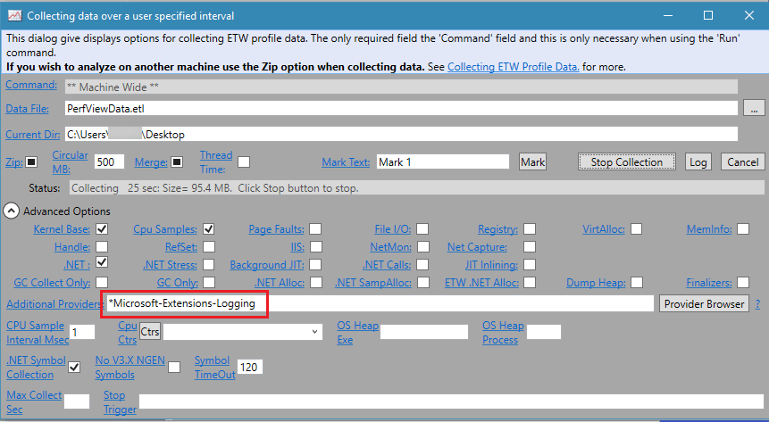

# Logging in .NET Core and ASP.NET Core

::: moniker range=">= aspnetcore-3.0"

By [Kirk Larkin](https://twitter.com/serpent5), [Juergen Gutsch](https://github.com/JuergenGutsch) and [Rick Anderson](https://twitter.com/RickAndMSFT)

.NET Core supports a logging API that works with a variety of built-in and third-party logging providers. This article shows how to use the logging API with built-in providers.

Most of the code examples shown in this article are from ASP.NET Core apps. The logging-specific parts of these code snippets apply to any .NET Core app that uses the [Generic Host](xref:fundamentals/host/generic-host). The ASP.NET Core web app templates use the Generic Host.

[View or download sample code](https://github.com/dotnet/AspNetCore.Docs/tree/master/aspnetcore/fundamentals/logging/index/samples/3.x) ([how to download](xref:index#how-to-download-a-sample))

<a name="lp"></a>

## Logging providers

Logging providers store logs, except for the `Console` provider which displays logs. For example, the Azure Application Insights provider stores logs in Azure Application Insights. Multiple providers can be enabled.

The default ASP.NET Core web app templates:

* Use the [Generic Host](xref:fundamentals/host/generic-host).
* Call <xref:Microsoft.Extensions.Hosting.Host.CreateDefaultBuilder%2A>, which adds the following logging providers:
  * [Console](#console)
  * [Debug](#debug)
  * [EventSource](#event-source)
  * [EventLog](#welog): Windows only

[!code-csharp[](index/samples/3.x/TodoApiDTO/Program.cs?name=snippet_TemplateCode&highlight=9)]

The preceding code shows the `Program` class created with the ASP.NET Core web app templates. The next several sections provide samples based on the ASP.NET Core web app templates, which use the Generic Host. [Non-host console apps](#nhca) are discussed later in this document.

To override the default set of logging providers added by `Host.CreateDefaultBuilder`, call `ClearProviders` and add the required logging providers. For example, the following code:

* Calls <xref:Microsoft.Extensions.Logging.LoggingBuilderExtensions.ClearProviders%2A> to remove all the <xref:Microsoft.Extensions.Logging.ILoggerProvider> instances from the builder.
* Adds the [Console](#console) logging provider.

[!code-csharp[](index/samples/3.x/TodoApiDTO/Program.cs?name=snippet_AddProvider&highlight=5-6)]

For additional providers, see:

* [Built-in logging providers](#bilp)
* [Third-party logging providers](#third-party-logging-providers).

## Create logs

To create logs, use an <xref:Microsoft.Extensions.Logging.ILogger%601> object from [dependency injection](xref:fundamentals/dependency-injection) (DI).

The following example:

* Creates a logger, `ILogger<AboutModel>`, which uses a log *category* of the fully qualified name of the type `AboutModel`. The log category is a string that is associated with each log.
* Calls <xref:Microsoft.Extensions.Logging.LoggerExtensions.LogInformation*> to log at the `Information` level. The Log *level* indicates the severity of the logged event.

[!code-csharp[](index/samples/3.x/TodoApiDTO/Pages/About.cshtml.cs?name=snippet_CallLogMethods&highlight=5,14)]

[Levels](#log-level) and [categories](#log-category) are explained in more detail later in this document.

For information on Blazor, see [Create logs in Blazor and Blazor WebAssembly](#clib) in this document.

[Create logs in Main and Startup](#clms) shows how to create logs in `Main` and `Startup`.

## Configure logging

Logging configuration is commonly provided by the `Logging` section of *appsettings*.`{Environment}`*.json* files. The following *appsettings.Development.json* file is generated by the ASP.NET Core web app templates:

[!code-json[](index/samples/3.x/TodoApiDTO/appsettings.Development.json)]

In the preceding JSON:

* The `"Default"`, `"Microsoft"`, and `"Microsoft.Hosting.Lifetime"` categories are specified.
* The `"Microsoft"` category applies to all categories that start with `"Microsoft"`. For example, this setting applies to the `"Microsoft.AspNetCore.Routing.EndpointMiddleware"` category.
* The `"Microsoft"` category logs at log level `Warning` and higher.
* The `"Microsoft.Hosting.Lifetime"` category is more specific than the `"Microsoft"` category, so the `"Microsoft.Hosting.Lifetime"` category logs at log level "Information" and higher.
* A specific log provider is not specified, so `LogLevel` applies to all the enabled logging providers except for the [Windows EventLog](#welog).

The `Logging` property can have <xref:Microsoft.Extensions.Logging.LogLevel> and log provider properties. The `LogLevel` specifies the minimum [level](#log-level) to log for selected categories. In the preceding JSON, `Information` and `Warning` log levels are specified. `LogLevel` indicates the severity of the log and ranges from 0 to 6:

`Trace` = 0, `Debug` = 1, `Information` = 2, `Warning` = 3, `Error` = 4, `Critical` = 5, and `None` = 6.

When a `LogLevel` is specified, logging is enabled for messages at the specified level and higher. In the preceding JSON, the `Default` category is logged for `Information` and higher. For example, `Information`, `Warning`, `Error`, and `Critical` messages are logged. If no `LogLevel` is specified, logging defaults to the `Information` level. For more information, see [Log levels](#llvl).

A provider property can specify a `LogLevel` property. `LogLevel` under a provider specifies levels to log for that provider, and overrides the non-provider log settings. Consider the following *appsettings.json* file:

[!code-json[](index/samples/3.x/TodoApiDTO/appsettings.Prod2.json)]

Settings in `Logging.{providername}.LogLevel` override settings in `Logging.LogLevel`. In the preceding JSON, the `Debug` provider's default log level is set to `Information`:

`Logging:Debug:LogLevel:Default:Information`

The preceding setting specifies the `Information` log level for every `Logging:Debug:` category except `Microsoft.Hosting`. When a specific category is listed, the specific category overrides the default category. In the preceding JSON, the `Logging:Debug:LogLevel` categories `"Microsoft.Hosting"` and `"Default"` override the settings in `Logging:LogLevel`

The minimum log level can be specified for any of:

* Specific providers:  For example, `Logging:EventSource:LogLevel:Default:Information`
* Specific categories: For example, `Logging:LogLevel:Microsoft:Warning`
* All providers and all categories: `Logging:LogLevel:Default:Warning`

Any logs below the minimum level are ***not***:

* Passed to the provider.
* Logged or displayed.

To suppress all logs, specify [LogLevel.None](xref:Microsoft.Extensions.Logging.LogLevel). `LogLevel.None` has a value of 6, which is higher than `LogLevel.Critical` (5).

If a provider supports [log scopes](#logscopes), `IncludeScopes` indicates whether they're enabled. For more information, see [log scopes](#logscopes)

The following *appsettings.json* file contains all the providers enabled by default:

[!code-json[](index/samples/3.x/TodoApiDTO/appsettings.Production.json)]

In the preceding sample:

* The categories and levels are not suggested values. The sample is provided to show all the default providers.
* Settings in `Logging.{providername}.LogLevel` override settings in `Logging.LogLevel`. For example, the level in `Debug.LogLevel.Default` overrides the level in `LogLevel.Default`.
* Each default provider *alias* is used. Each provider defines an *alias* that can be used in configuration in place of the fully qualified type name. The built-in providers aliases are:
  * Console
  * Debug
  * EventSource
  * EventLog
  * AzureAppServicesFile
  * AzureAppServicesBlob
  * ApplicationInsights

## Set log level by command line, environment variables, and other configuration

Log level can be set by any of the [configuration providers](xref:fundamentals/configuration/index). 

[!INCLUDE[](~/includes/environmentVarableColon.md)]

The following commands:

* Set the environment key `Logging:LogLevel:Microsoft` to a value of `Information` on Windows.
* Test the settings when using an app created with the ASP.NET Core web application templates. The `dotnet run` command must be run in the project directory after using `set`.

```cmd
set Logging__LogLevel__Microsoft=Information
dotnet run
```

The preceding environment setting:

* Is only set in processes launched from the command window they were set in.
* Isn't read by browsers launched with Visual Studio.

The following [setx](/windows-server/administration/windows-commands/setx) command also sets the environment key and value on Windows. Unlike `set`, `setx` settings are persisted. The `/M` switch sets the variable in the system environment. If `/M` isn't used, a user environment variable is set.

```cmd
setx Logging__LogLevel__Microsoft=Information /M
```

On [Azure App Service](https://azure.microsoft.com/services/app-service/), select **New application setting** on the **Settings > Configuration** page. Azure App Service application settings are:

* Encrypted at rest and transmitted over an encrypted channel.
* Exposed as environment variables.

For more information, see [Azure Apps: Override app configuration using the Azure Portal](xref:host-and-deploy/azure-apps/index#override-app-configuration-using-the-azure-portal).

For more information on setting ASP.NET Core configuration values using environment variables, see [environment variables](xref:fundamentals/configuration/index#environment-variables). For information on using other configuration sources, including the command line, Azure Key Vault, Azure App Configuration, other file formats, and more, see <xref:fundamentals/configuration/index>.

## How filtering rules are applied

When an <xref:Microsoft.Extensions.Logging.ILogger%601> object is created, the <xref:Microsoft.Extensions.Logging.ILoggerFactory> object selects a single rule per provider to apply to that logger. All messages written by an `ILogger` instance are filtered based on the selected rules. The most specific rule for each provider and category pair is selected from the available rules.

The following algorithm is used for each provider when an `ILogger` is created for a given category:

* Select all rules that match the provider or its alias. If no match is found, select all rules with an empty provider.
* From the result of the preceding step, select rules with longest matching category prefix. If no match is found, select all rules that don't specify a category.
* If multiple rules are selected, take the **last** one.
* If no rules are selected, use `MinimumLevel`.

<a name="dnrvs"></a>

## Logging output from dotnet run and Visual Studio

Logs created with the [default logging providers](#lp) are displayed:

* In Visual Studio
  * In the Debug output window when debugging.
  * In the ASP.NET Core Web Server window.
* In the console window when the app is run with `dotnet run`.

Logs that begin with "Microsoft" categories are from ASP.NET Core framework code. ASP.NET Core and application code use the same logging API and providers.

<a name="lcat"></a>

## Log category

When an `ILogger` object is created, a *category* is specified. That category is included with each log message created by that instance of `ILogger`. The category string is arbitrary, but the convention is to use the class name. For example, in a controller the name might be `"TodoApi.Controllers.TodoController"`. The ASP.NET Core web apps use `ILogger<T>` to automatically get an `ILogger` instance that uses the fully qualified type name of `T` as the category:

[!code-csharp[](index/samples/3.x/TodoApiDTO/Pages/Privacy.cshtml.cs?name=snippet)]

To explicitly specify the category, call `ILoggerFactory.CreateLogger`:

[!code-csharp[](index/samples/3.x/TodoApiDTO/Pages/Contact.cshtml.cs?name=snippet)]

`ILogger<T>` is equivalent to calling `CreateLogger` with the fully qualified type name of `T`.

<a name="llvl"></a>

## Log level

The following table lists the <xref:Microsoft.Extensions.Logging.LogLevel> values, the convenience `Log{LogLevel}` extension method, and the suggested usage:

| LogLevel | Value | Method | Description |
| -------- | ----- | ------ | ----------- |
| [Trace](xref:Microsoft.Extensions.Logging.LogLevel) | 0 | <xref:Microsoft.Extensions.Logging.LoggerExtensions.LogTrace%2A> | Contain the most detailed messages. These messages may contain sensitive app data. These messages are disabled by default and should ***not*** be enabled in production. |
| [Debug](xref:Microsoft.Extensions.Logging.LogLevel) | 1 | <xref:Microsoft.Extensions.Logging.LoggerExtensions.LogDebug%2A> | For debugging and development. Use with caution in production due to the high volume. |
| [Information](xref:Microsoft.Extensions.Logging.LogLevel) | 2 | <xref:Microsoft.Extensions.Logging.LoggerExtensions.LogInformation%2A> | Tracks the general flow of the app. May have long-term value. |
| [Warning](xref:Microsoft.Extensions.Logging.LogLevel) | 3 | <xref:Microsoft.Extensions.Logging.LoggerExtensions.LogWarning%2A> | For abnormal or unexpected events. Typically includes errors or conditions that don't cause the app to fail. |
| [Error](xref:Microsoft.Extensions.Logging.LogLevel) | 4 | <xref:Microsoft.Extensions.Logging.LoggerExtensions.LogError%2A> | For errors and exceptions that cannot be handled. These messages indicate a failure in the current operation or request, not an app-wide failure. |
| [Critical](xref:Microsoft.Extensions.Logging.LogLevel) | 5 | <xref:Microsoft.Extensions.Logging.LoggerExtensions.LogCritical%2A> | For failures that require immediate attention. Examples: data loss scenarios, out of disk space. |
| [None](xref:Microsoft.Extensions.Logging.LogLevel) | 6 | | Specifies that a logging category should not write any messages. |

In the previous table, the `LogLevel` is listed from lowest to highest severity.

The [Log](xref:Microsoft.Extensions.Logging.LoggerExtensions) method's first parameter, <xref:Microsoft.Extensions.Logging.LogLevel>, indicates the severity of the log. Rather than calling `Log(LogLevel, ...)`, most developers call the [Log{LogLevel}](xref:Microsoft.Extensions.Logging.LoggerExtensions) extension methods. The `Log{LogLevel}` extension methods [call the Log method and specify the LogLevel](https://github.com/dotnet/extensions/blob/release/3.1/src/Logging/Logging.Abstractions/src/LoggerExtensions.cs). For example, the following two logging calls are functionally equivalent and produce the same log:

[!code-csharp[](index/samples/3.x/TodoApiDTO/Controllers/TestController.cs?name=snippet0&highlight=6-7)]

`MyLogEvents.TestItem` is the event ID. `MyLogEvents` is part of the sample app and is displayed in the [Log event ID](#leid) section.

[!INCLUDE[](~/includes/MyDisplayRouteInfoBoth.md)]

The following code creates `Information` and `Warning` logs:

[!code-csharp[](index/samples/3.x/TodoApiDTO/Controllers/TodoItemsController.cs?name=snippet_CallLogMethods&highlight=4,10)]

In the preceding code, the first `Log{LogLevel}` parameter,`MyLogEvents.GetItem`, is the [Log event ID](#leid). The second parameter is a message template with placeholders for argument values provided by the remaining method parameters. The method parameters are explained in the [message template](#lmt) section later in this document.

Call the appropriate `Log{LogLevel}` method to control how much log output is written to a particular storage medium. For example:

* In production:
  * Logging at the `Trace` or `Information` levels produces a high-volume of detailed log messages. To control costs and not exceed data storage limits, log `Trace` and `Information` level messages to a high-volume, low-cost data store. Consider limiting `Trace` and `Information` to specific categories.
  * Logging at `Warning` through `Critical` levels should produce few log messages.
    * Costs and storage limits usually aren't a concern.
    * Few logs allow more flexibility in data store choices.
* In development:
  * Set to `Warning`.
  * Add `Trace` or `Information` messages when troubleshooting. To limit output, set `Trace` or `Information` only for the categories under investigation.

ASP.NET Core writes logs for framework events. For example, consider the log output for:

* A Razor Pages app created with the ASP.NET Core templates.
* Logging set to `Logging:Console:LogLevel:Microsoft:Information`
* Navigation to the Privacy page:

```console
info: Microsoft.AspNetCore.Hosting.Diagnostics[1]
      Request starting HTTP/2 GET https://localhost:5001/Privacy
info: Microsoft.AspNetCore.Routing.EndpointMiddleware[0]
      Executing endpoint '/Privacy'
info: Microsoft.AspNetCore.Mvc.RazorPages.Infrastructure.PageActionInvoker[3]
      Route matched with {page = "/Privacy"}. Executing page /Privacy
info: Microsoft.AspNetCore.Mvc.RazorPages.Infrastructure.PageActionInvoker[101]
      Executing handler method DefaultRP.Pages.PrivacyModel.OnGet - ModelState is Valid
info: Microsoft.AspNetCore.Mvc.RazorPages.Infrastructure.PageActionInvoker[102]
      Executed handler method OnGet, returned result .
info: Microsoft.AspNetCore.Mvc.RazorPages.Infrastructure.PageActionInvoker[103]
      Executing an implicit handler method - ModelState is Valid
info: Microsoft.AspNetCore.Mvc.RazorPages.Infrastructure.PageActionInvoker[104]
      Executed an implicit handler method, returned result Microsoft.AspNetCore.Mvc.RazorPages.PageResult.
info: Microsoft.AspNetCore.Mvc.RazorPages.Infrastructure.PageActionInvoker[4]
      Executed page /Privacy in 74.5188ms
info: Microsoft.AspNetCore.Routing.EndpointMiddleware[1]
      Executed endpoint '/Privacy'
info: Microsoft.AspNetCore.Hosting.Diagnostics[2]
      Request finished in 149.3023ms 200 text/html; charset=utf-8
```

The following JSON sets `Logging:Console:LogLevel:Microsoft:Information`:

[!code-json[](index/samples/3.x/TodoApiDTO/appsettings.MSFT.json)]

<a name="leid"></a>

## Log event ID

Each log can specify an *event ID*. The sample app uses the `MyLogEvents` class to define event IDs:

<!-- Review: to bad there is no way to use an enum for event ID's -->
[!code-csharp[](index/samples/3.x/TodoApiDTO/Models/MyLogEvents.cs?name=snippet_LoggingEvents)]

[!code-csharp[](index/samples/3.x/TodoApiDTO/Controllers/TodoItemsController.cs?name=snippet_CallLogMethods&highlight=4,10)]

An event ID associates a set of events. For example, all logs related to displaying a list of items on a page might be 1001.

The logging provider may store the event ID in an ID field, in the logging message, or not at all. The Debug provider doesn't show event IDs. The console provider shows event IDs in brackets after the category:

```console
info: TodoApi.Controllers.TodoItemsController[1002]
      Getting item 1
warn: TodoApi.Controllers.TodoItemsController[4000]
      Get(1) NOT FOUND
```

Some logging providers store the event ID in a field, which allows for filtering on the ID.

<a name="lmt"></a>

## Log message template
<!-- Review, Each log API uses a message template. -->
Each log API uses a message template. The message template can contain placeholders for which arguments are provided. Use names for the placeholders, not numbers.

[!code-csharp[](index/samples/3.x/TodoApiDTO/Controllers/TodoItemsController.cs?name=snippet_CallLogMethods&highlight=4,10)]

The order of placeholders, not their names, determines which parameters are used to provide their values. In the following code, the parameter names are out of sequence in the message template:

```csharp
string p1 = "param1";
string p2 = "param2";
_logger.LogInformation("Parameter values: {p2}, {p1}", p1, p2);
```

The preceding code creates a log message with the parameter values in sequence:

```text
Parameter values: param1, param2
```

This approach allows logging providers to implement [semantic or structured logging](https://github.com/NLog/NLog/wiki/How-to-use-structured-logging). The arguments themselves are passed to the logging system, not just the formatted message template. This enables logging providers to store the parameter values as fields. For example, consider the following logger method:

```csharp
_logger.LogInformation("Getting item {Id} at {RequestTime}", id, DateTime.Now);
```

For example, when logging to Azure Table Storage:

* Each Azure Table entity can have `ID` and `RequestTime` properties.
* Tables with properties simplify queries on logged data. For example, a query can find all logs within a particular `RequestTime` range without having to parse the time out of the text message.

## Log exceptions

The logger methods have overloads that take an exception parameter:

[!code-csharp[](index/samples/3.x/TodoApiDTO/Controllers/TestController.cs?name=snippet_Exp)]

[!INCLUDE[](~/includes/MyDisplayRouteInfoBoth.md)]

Exception logging is provider-specific.

### Default log level

If the default log level is not set, the default log level value is `Information`.

For example, consider the following web app:

* Created with the ASP.NET web app templates.
* *appsettings.json* and *appsettings.Development.json* deleted or renamed.

With the preceding setup, navigating to the privacy or home page produces many `Trace`, `Debug`, and `Information`  messages with `Microsoft` in the category name.

The following code sets the default log level when the default log level is not set in configuration:

[!code-csharp[](index/samples/3.x/MyMain/Program.cs?name=snippet_MinLevel&highlight=10)]

<!-- review required: I say this a couple times -->
Generally, log levels should be specified in configuration and not code.

### Filter function

A filter function is invoked for all providers and categories that don't have rules assigned to them by configuration or code:

[!code-csharp[](index/samples/3.x/MyMain/Program.cs?name=snippet_FilterFunction)]

The preceding code displays console logs when the category contains `Controller` or `Microsoft` and the log level is `Information` or higher.

Generally, log levels should be specified in configuration and not code.

## ASP.NET Core and EF Core categories

The following table contains some categories used by ASP.NET Core and Entity Framework Core, with notes about the logs:

| Category                            | Notes |
| ----------------------------------- | ----- |
| Microsoft.AspNetCore                | General ASP.NET Core diagnostics. |
| Microsoft.AspNetCore.DataProtection | Which keys were considered, found, and used. |
| Microsoft.AspNetCore.HostFiltering  | Hosts allowed. |
| Microsoft.AspNetCore.Hosting        | How long HTTP requests took to complete and what time they started. Which hosting startup assemblies were loaded. |
| Microsoft.AspNetCore.Mvc            | MVC and Razor diagnostics. Model binding, filter execution, view compilation, action selection. |
| Microsoft.AspNetCore.Routing        | Route matching information. |
| Microsoft.AspNetCore.Server         | Connection start, stop, and keep alive responses. HTTPS certificate information. |
| Microsoft.AspNetCore.StaticFiles    | Files served. |
| Microsoft.EntityFrameworkCore       | General Entity Framework Core diagnostics. Database activity and configuration, change detection, migrations. |

To view more categories in the console window, set **appsettings.Development.json** to the following:

[!code-csharp[](index/samples/3.x/MyMain/appsettings.Trace.json)]

<!-- Review: What other providers support scopes? Console is not generally used in staging/production  -->

<a name="logscopes"></a>

## Log scopes

 A *scope* can group a set of logical operations. This grouping can be used to attach the same data to each log that's created as part of a set. For example, every log created as part of processing a transaction can include the transaction ID.

A scope:

* Is an <xref:System.IDisposable> type that's returned by the <xref:Microsoft.Extensions.Logging.ILogger.BeginScope*> method.
* Lasts until it's disposed.

The following providers support scopes:

* `Console`
* [AzureAppServicesFile and AzureAppServicesBlob](xref:Microsoft.Extensions.Logging.AzureAppServices.BatchingLoggerOptions.IncludeScopes)

Use a scope by wrapping logger calls in a `using` block:

[!code-csharp[](index/samples/3.x/TodoApiDTO/Controllers/TestController.cs?name=snippet_Scopes)]

The following JSON enables scopes for the console provider:

[!code-json[](index/samples/3.x/TodoApiDTO/appsettings.Scopes.json)]

The following code enables scopes for the console provider:

[!code-csharp[](index/samples/3.x/MyMain/Program.cs?name=snippet_Scopes)]

Generally, logging should be specified in configuration and not code.

<a name="bilp"></a>

## Built-in logging providers

ASP.NET Core includes the following logging providers:

* [Console](#console)
* [Debug](#debug)
* [EventSource](#event-source)
* [EventLog](#welog)
* [AzureAppServicesFile and AzureAppServicesBlob](#azure-app-service)
* [ApplicationInsights](#azure-application-insights)

For information on `stdout` and debug logging with the ASP.NET Core Module, see <xref:test/troubleshoot-azure-iis> and <xref:host-and-deploy/aspnet-core-module#log-creation-and-redirection>.

### Console

The `Console` provider logs output to the console. For more information on viewing `Console` logs in development, see [Logging output from dotnet run and Visual Studio](#dnrvs).

### Debug

The `Debug` provider writes log output by using the [System.Diagnostics.Debug](/dotnet/api/system.diagnostics.debug) class. Calls to `System.Diagnostics.Debug.WriteLine` write to the `Debug` provider.

On Linux, the `Debug` provider log location is distribution-dependent and may be one of the following:

* */var/log/message*
* */var/log/syslog*

### Event Source

The `EventSource` provider writes to a cross-platform event source with the name `Microsoft-Extensions-Logging`. On Windows, the provider uses [ETW](https://msdn.microsoft.com/library/windows/desktop/bb968803).

#### dotnet trace tooling

The [dotnet-trace](/dotnet/core/diagnostics/dotnet-trace) tool is a cross-platform CLI global tool that enables the collection of .NET Core traces of a running process. The tool collects <xref:Microsoft.Extensions.Logging.EventSource> provider data using a <xref:Microsoft.Extensions.Logging.EventSource.LoggingEventSource>.

See [dotnet-trace](/dotnet/core/diagnostics/dotnet-trace) for installation instructions.

Use the dotnet trace tooling to collect a trace from an app:

1. Run the app with the `dotnet run` command.
1. Determine the process identifier (PID) of the .NET Core app:
   * On Windows, use one of the following approaches:
     * Task Manager (Ctrl+Alt+Del)
     * [tasklist command](/windows-server/administration/windows-commands/tasklist)
     * [Get-Process Powershell command](/powershell/module/microsoft.powershell.management/get-process)
   * On Linux, use the [pidof command](https://refspecs.linuxfoundation.org/LSB_5.0.0/LSB-Core-generic/LSB-Core-generic/pidof.html).

   Find the PID for the process that has the same name as the app's assembly.

1. Execute the `dotnet trace` command.

   General command syntax:

   ```dotnetcli
   dotnet trace collect -p {PID} 
       --providers Microsoft-Extensions-Logging:{Keyword}:{Event Level}
           :FilterSpecs=\"
               {Logger Category 1}:{Event Level 1};
               {Logger Category 2}:{Event Level 2};
               ...
               {Logger Category N}:{Event Level N}\"
   ```

   When using a PowerShell command shell, enclose the `--providers` value in single quotes (`'`):

   ```dotnetcli
   dotnet trace collect -p {PID} 
       --providers 'Microsoft-Extensions-Logging:{Keyword}:{Event Level}
           :FilterSpecs=\"
               {Logger Category 1}:{Event Level 1};
               {Logger Category 2}:{Event Level 2};
               ...
               {Logger Category N}:{Event Level N}\"'
   ```

   On non-Windows platforms, add the `-f speedscope` option to change the format of the output trace file to `speedscope`.

   | Keyword | Description |
   | :-----: | ----------- |
   | 1       | Log meta events about the `LoggingEventSource`. Doesn't log events from `ILogger`). |
   | 2       | Turns on the `Message` event when `ILogger.Log()` is called. Provides information in a programmatic (not formatted) way. |
   | 4       | Turns on the `FormatMessage` event when `ILogger.Log()` is called. Provides the formatted string version of the information. |
   | 8       | Turns on the `MessageJson` event when `ILogger.Log()` is called. Provides a JSON representation of the arguments. |

   | Event Level | Description     |
   | :---------: | --------------- |
   | 0           | `LogAlways`     |
   | 1           | `Critical`      |
   | 2           | `Error`         |
   | 3           | `Warning`       |
   | 4           | `Informational` |
   | 5           | `Verbose`       |

   `FilterSpecs` entries for `{Logger Category}` and `{Event Level}` represent additional log filtering conditions. Separate `FilterSpecs` entries with a semicolon (`;`).

   Example using a Windows command shell (**no** single quotes around the `--providers` value):

   ```dotnetcli
   dotnet trace collect -p {PID} --providers Microsoft-Extensions-Logging:4:2:FilterSpecs=\"Microsoft.AspNetCore.Hosting*:4\"
   ```

   The preceding command activates:

   * The Event Source logger to produce formatted strings (`4`) for errors (`2`).
   * `Microsoft.AspNetCore.Hosting` logging at the `Informational` logging level (`4`).

1. Stop the dotnet trace tooling by pressing the Enter key or Ctrl+C.

   The trace is saved with the name *trace.nettrace* in the folder where the `dotnet trace` command is executed.

1. Open the trace with [Perfview](#perfview). Open the *trace.nettrace* file and explore the trace events.

If the app doesn't build the host with `CreateDefaultBuilder`, add the [Event Source provider](#event-source-provider) to the app's logging configuration.

For more information, see:

* [Trace for performance analysis utility (dotnet-trace)](/dotnet/core/diagnostics/dotnet-trace) (.NET Core documentation)
* [Trace for performance analysis utility (dotnet-trace)](https://github.com/dotnet/diagnostics/blob/master/documentation/dotnet-trace-instructions.md) (dotnet/diagnostics GitHub repository documentation)
* [LoggingEventSource Class](xref:Microsoft.Extensions.Logging.EventSource.LoggingEventSource) (.NET API Browser)
* <xref:System.Diagnostics.Tracing.EventLevel>
* [LoggingEventSource reference source (3.0)](https://github.com/dotnet/extensions/blob/release/3.0/src/Logging/Logging.EventSource/src/LoggingEventSource.cs): To obtain reference source for a different version, change the branch to `release/{Version}`, where `{Version}` is the version of ASP.NET Core desired.
* [Perfview](#perfview): Useful for viewing Event Source traces.

#### Perfview

Use the [PerfView utility](https://github.com/Microsoft/perfview) to collect and view logs. There are other tools for viewing ETW logs, but PerfView provides the best experience for working with the ETW events emitted by ASP.NET Core.

To configure PerfView for collecting events logged by this provider, add the string `*Microsoft-Extensions-Logging` to the **Additional Providers** list. Don't miss the `*` at the start of the string.

<a name="welog"></a>

### Windows EventLog

The `EventLog` provider sends log output to the Windows Event Log. Unlike the other providers, the `EventLog` provider does ***not*** inherit the default non-provider settings. If `EventLog` log settings are specified, they [default to LogLevel.Warning](https://github.com/dotnet/extensions/blob/release/3.1/src/Hosting/Hosting/src/Host.cs#L99-L103).

To log events lower than `Warning`, explicitly set the log level. For example, add the following to the *appsettings.json* file:

```json
"EventLog": {
  "LogLevel": {
    "Default": "Information"
  }
}
```

[AddEventLog overloads](xref:Microsoft.Extensions.Logging.EventLoggerFactoryExtensions) can pass in <xref:Microsoft.Extensions.Logging.EventLog.EventLogSettings>. If `null` or not specified, the following default settings are used:

* `LogName`: "Application"
* `SourceName`: ".NET Runtime"
* `MachineName`: The local machine name is used.

The following code changes the `SourceName` from the default value of `".NET Runtime"` to `MyLogs`:

[!code-csharp[](index/samples/3.x/MyMain/Program.cs?name=snippetEventLog)]

### Azure App Service

The [Microsoft.Extensions.Logging.AzureAppServices](https://www.nuget.org/packages/Microsoft.Extensions.Logging.AzureAppServices) provider package writes logs to text files in an Azure App Service app's file system and to [blob storage](https://azure.microsoft.com/documentation/articles/storage-dotnet-how-to-use-blobs/#what-is-blob-storage) in an Azure Storage account.

The provider package isn't included in the shared framework. To use the provider, add the provider package to the project.

To configure provider settings, use <xref:Microsoft.Extensions.Logging.AzureAppServices.AzureFileLoggerOptions> and <xref:Microsoft.Extensions.Logging.AzureAppServices.AzureBlobLoggerOptions>, as shown in the following example:

[!code-csharp[](index/samples/3.x/MyMain/Program.cs?name=snippet_AzLogOptions)]

When deployed to Azure App Service, the app uses the settings in the [App Service logs](/azure/app-service/web-sites-enable-diagnostic-log/#enable-application-logging-windows) section of the **App Service** page of the Azure portal. When the following settings are updated, the changes take effect immediately without requiring a restart or redeployment of the app.

* **Application Logging (Filesystem)**
* **Application Logging (Blob)**

The default location for log files is in the *D:\\home\\LogFiles\\Application* folder, and the default file name is *diagnostics-yyyymmdd.txt*. The default file size limit is 10 MB, and the default maximum number of files retained is 2. The default blob name is *{app-name}{timestamp}/yyyy/mm/dd/hh/{guid}-applicationLog.txt*.

This provider only logs when the project runs in the Azure environment.

#### Azure log streaming

Azure log streaming supports viewing log activity in real time from:

* The app server
* The web server
* Failed request tracing

To configure Azure log streaming:

* Navigate to the **App Service logs** page from the app's portal page.
* Set **Application Logging (Filesystem)** to **On**.
* Choose the log **Level**. This setting only applies to Azure log streaming.

Navigate to the **Log Stream** page to view logs. The logged messages are logged with the `ILogger` interface.

### Azure Application Insights

The [Microsoft.Extensions.Logging.ApplicationInsights](https://www.nuget.org/packages/Microsoft.Extensions.Logging.ApplicationInsights) provider package writes logs to [Azure Application Insights](/azure/azure-monitor/app/cloudservices). Application Insights is a service that monitors a web app and provides tools for querying and analyzing the telemetry data. If you use this provider, you can query and analyze your logs by using the Application Insights tools.

The logging provider is included as a dependency of [Microsoft.ApplicationInsights.AspNetCore](https://www.nuget.org/packages/Microsoft.ApplicationInsights.AspNetCore), which is the package that provides all available telemetry for ASP.NET Core. If you use this package, you don't have to install the provider package.

The [Microsoft.ApplicationInsights.Web](https://www.nuget.org/packages/Microsoft.ApplicationInsights.Web) package is for ASP.NET 4.x, not ASP.NET Core.

For more information, see the following resources:

* [Application Insights overview](/azure/application-insights/app-insights-overview)
* [Application Insights for ASP.NET Core applications](/azure/azure-monitor/app/asp-net-core) - Start here if you want to implement the full range of Application Insights telemetry along with logging.
* [ApplicationInsightsLoggerProvider for .NET Core ILogger logs](/azure/azure-monitor/app/ilogger) - Start here if you want to implement the logging provider without the rest of Application Insights telemetry.
* [Application Insights logging adapters](https://docs.microsoft.com/azure/azure-monitor/app/asp-net-trace-logs).
* [Install, configure, and initialize the Application Insights SDK](/learn/modules/instrument-web-app-code-with-application-insights) - Interactive tutorial on the Microsoft Learn site.

## Third-party logging providers

Third-party logging frameworks that work with ASP.NET Core:

* [elmah.io](https://elmah.io/) ([GitHub repo](https://github.com/elmahio/Elmah.Io.Extensions.Logging))
* [Gelf](https://docs.graylog.org/en/2.3/pages/gelf.html) ([GitHub repo](https://github.com/mattwcole/gelf-extensions-logging))
* [JSNLog](https://jsnlog.com/) ([GitHub repo](https://github.com/mperdeck/jsnlog))
* [KissLog.net](https://kisslog.net/) ([GitHub repo](https://github.com/catalingavan/KissLog-net))
* [Log4Net](https://logging.apache.org/log4net/) ([GitHub repo](https://github.com/huorswords/Microsoft.Extensions.Logging.Log4Net.AspNetCore))
* [Loggr](https://loggr.net/) ([GitHub repo](https://github.com/imobile3/Loggr.Extensions.Logging))
* [NLog](https://nlog-project.org/) ([GitHub repo](https://github.com/NLog/NLog.Extensions.Logging))
* [PLogger](https://www.nuget.org/packages/InvertedSoftware.PLogger.Core/) ([GitHub repo](https://github.com/invertedsoftware/InvertedSoftware.PLogger.Core))
* [Sentry](https://sentry.io/welcome/) ([GitHub repo](https://github.com/getsentry/sentry-dotnet))
* [Serilog](https://serilog.net/) ([GitHub repo](https://github.com/serilog/serilog-aspnetcore))
* [Stackdriver](https://cloud.google.com/dotnet/docs/stackdriver#logging) ([Github repo](https://github.com/googleapis/google-cloud-dotnet))

Some third-party frameworks can perform [semantic logging, also known as structured logging](https://softwareengineering.stackexchange.com/questions/312197/benefits-of-structured-logging-vs-basic-logging).

Using a third-party framework is similar to using one of the built-in providers:

1. Add a NuGet package to your project.
1. Call an `ILoggerFactory` extension method provided by the logging framework.

For more information, see each provider's documentation. Third-party logging providers aren't supported by Microsoft.

<a name="nhca"></a>

## Non-host console app

For an example of how to use the Generic Host in a non-web console app, see the *Program.cs* file of the [Background Tasks sample app](https://github.com/dotnet/AspNetCore.Docs/tree/master/aspnetcore/fundamentals/host/hosted-services/samples) (<xref:fundamentals/host/hosted-services>).

Logging code for apps without Generic Host differs in the way [providers are added](#add-providers) and [loggers are created](#create-logs). 

### Logging providers

In a non-host console app, call the provider's `Add{provider name}` extension method while creating a `LoggerFactory`:

[!code-csharp[](index/samples/3.x/LoggingConsoleApp/Program.cs?name=snippet_LoggerFactory&highlight=11-12)]

### Create logs

To create logs, use an <xref:Microsoft.Extensions.Logging.ILogger%601> object. Use the `LoggerFactory` to create an `ILogger`.

The following example creates a logger with `LoggingConsoleApp.Program` as the category.

[!code-csharp[](index/samples/3.x/LoggingConsoleApp/Program.cs?name=snippet_LoggerFactory&highlight=14)]

In the following ASP.NET CORE examples, the logger is used to create logs with `Information` as the level. The Log *level* indicates the severity of the logged event.

[!code-csharp[](index/samples/3.x/LoggingConsoleApp/Program.cs?name=snippet_LoggerFactory&highlight=15)]

[Levels](#log-level) and [categories](#log-category) are explained in more detail in this document.

<a name="lhc"></a>

## Log during host construction

Logging during host construction isn't directly supported. However, a separate logger can be used. In the following example, a [Serilog](https://serilog.net/) logger is used to log in `CreateHostBuilder`. `AddSerilog` uses the static configuration specified in `Log.Logger`:

```csharp
using System;
using Microsoft.AspNetCore.Hosting;
using Microsoft.Extensions.DependencyInjection;
using Microsoft.Extensions.Configuration;
using Microsoft.Extensions.Hosting;
using Microsoft.Extensions.Logging;

public class Program
{
    public static void Main(string[] args)
    {
        CreateHostBuilder(args).Build().Run();
    }

    public static IHostBuilder CreateHostBuilder(string[] args)
    {
        var builtConfig = new ConfigurationBuilder()
            .AddJsonFile("appsettings.json")
            .AddCommandLine(args)
            .Build();

        Log.Logger = new LoggerConfiguration()
            .WriteTo.Console()
            .WriteTo.File(builtConfig["Logging:FilePath"])
            .CreateLogger();

        try
        {
            return Host.CreateDefaultBuilder(args)
                .ConfigureServices((context, services) =>
                {
                    services.AddRazorPages();
                })
                .ConfigureAppConfiguration((hostingContext, config) =>
                {
                    config.AddConfiguration(builtConfig);
                })
                .ConfigureLogging(logging =>
                {   
                    logging.AddSerilog();
                })
                .ConfigureWebHostDefaults(webBuilder =>
                {
                    webBuilder.UseStartup<Startup>();
                });
        }
        catch (Exception ex)
        {
            Log.Fatal(ex, "Host builder error");

            throw;
        }
        finally
        {
            Log.CloseAndFlush();
        }
    }
}
```

<a name="csdi"></a>

## Configure a service that depends on ILogger

Constructor injection of a logger into `Startup` works in earlier versions of ASP.NET Core because a separate DI container is created for the Web Host. For information about why only one container is created for the Generic Host, see the [breaking change announcement](https://github.com/aspnet/Announcements/issues/353).

To configure a service that depends on `ILogger<T>`, use constructor injection or provide a factory method. The factory method approach is recommended only if there is no other option. For example, consider a service that needs an `ILogger<T>` instance provided by DI:

[!code-csharp[](index/samples/3.x/TodoApiSample/Startup2.cs?name=snippet_ConfigureServices&highlight=6-10)]

The preceding highlighted code is a [Func](/dotnet/api/system.func-2) that runs the first time the DI container needs to construct an instance of `MyService`. You can access any of the registered services in this way.

<a name="clms"></a>

## Create logs in Main

The following code logs in `Main` by getting an `ILogger` instance from DI after building the host:

[!code-csharp[](index/samples/3.x/TodoApiDTO/Program.cs?name=snippet_LogProgram)]

### Create logs in Startup

The following code writes logs in `Startup.Configure`:

[!code-csharp[](index/samples/3.x/TodoApiDTO/Startup.cs?name=snippet_Configure)]

Writing logs before completion of the DI container setup in the `Startup.ConfigureServices` method is not supported:

* Logger injection into the `Startup` constructor is not supported.
* Logger injection into the `Startup.ConfigureServices` method signature is not supported

The reason for this restriction is that logging depends on DI and on configuration, which in turns depends on DI. The DI container isn't set up until `ConfigureServices` finishes.

For information on configuring a service that depends on `ILogger<T>` or why constructor injection of a logger into `Startup` worked in earlier versions, see [Configure a service that depends on ILogger](#csdi)

### No asynchronous logger methods

Logging should be so fast that it isn't worth the performance cost of asynchronous code. If a logging data store is slow, don't write to it directly. Consider writing the log messages to a fast store initially, then moving them to the slow store later. For example, when logging to SQL Server, don't do so directly in a `Log` method, since the `Log` methods are synchronous. Instead, synchronously add log messages to an in-memory queue and have a background worker pull the messages out of the queue to do the asynchronous work of pushing data to SQL Server. For more information, see [this](https://github.com/dotnet/AspNetCore.Docs/issues/11801) GitHub issue.

<a name="clib"></a>

### Create logs in Blazor

#### Blazor WebAssembly

Configure logging in Blazor WebAssembly apps with the `WebAssemblyHostBuilder.Logging` property in `Program.Main`:

```csharp
using Microsoft.AspNetCore.Components.WebAssembly.Hosting;

...

var builder = WebAssemblyHostBuilder.CreateDefault(args);

builder.Logging.SetMinimumLevel(LogLevel.Debug);
builder.Logging.AddProvider(new CustomLoggingProvider());
```

The `Logging` property is of type <xref:Microsoft.Extensions.Logging.ILoggingBuilder>, so all of the extension methods available on <xref:Microsoft.Extensions.Logging.ILoggingBuilder> are also available on `Logging`.

#### Log in Razor components

Loggers respect app startup configuration.

The `using` directive for <xref:Microsoft.Extensions.Logging> is required to support Intellisense completions for APIs, such as <xref:Microsoft.Extensions.Logging.LoggerExtensions.LogWarning%2A> and <xref:Microsoft.Extensions.Logging.LoggerExtensions.LogError%2A>.

The following example demonstrates logging with an <xref:Microsoft.Extensions.Logging.ILogger> in Razor components:

```razor
@page "/counter"
@using Microsoft.Extensions.Logging;
@inject ILogger<Counter> logger;

<h1>Counter</h1>

<p>Current count: @currentCount</p>

<button class="btn btn-primary" @onclick="IncrementCount">Click me</button>

@code {
    private int currentCount = 0;

    private void IncrementCount()
    {
        logger.LogWarning("Someone has clicked me!");

        currentCount++;
    }
}
```

The following example demonstrates logging with an <xref:Microsoft.Extensions.Logging.ILoggerFactory> in Razor components:

```razor
@page "/counter"
@using Microsoft.Extensions.Logging;
@inject ILoggerFactory LoggerFactory

<h1>Counter</h1>

<p>Current count: @currentCount</p>

<button class="btn btn-primary" @onclick="IncrementCount">Click me</button>

@code {
    private int currentCount = 0;

    private void IncrementCount()
    {
        var logger = LoggerFactory.CreateLogger<Counter>();
        logger.LogWarning("Someone has clicked me!");

        currentCount++;
    }
}
```

## Change log levels in a running app

The Logging API doesn't include a scenario to change log levels while an app is running. However, some configuration providers are capable of reloading configuration, which takes immediate effect on logging configuration. For example, the [File Configuration Provider](xref:fundamentals/configuration/index#file-configuration-provider), reloads logging configuration by default. If configuration is changed in code while an app is running, the app can call [IConfigurationRoot.Reload](xref:Microsoft.Extensions.Configuration.IConfigurationRoot.Reload*) to update the app's logging configuration.

## ILogger and ILoggerFactory

The <xref:Microsoft.Extensions.Logging.ILogger%601> and <xref:Microsoft.Extensions.Logging.ILoggerFactory> interfaces and implementations are included in the .NET Core SDK. They are also available in the following NuGet packages:  

* The interfaces are in [Microsoft.Extensions.Logging.Abstractions](https://www.nuget.org/packages/Microsoft.Extensions.Logging.Abstractions/).
* The default implementations are in [Microsoft.Extensions.Logging](https://www.nuget.org/packages/microsoft.extensions.logging/).

<!-- review. Why would you want to hard code filtering rules in code? -->
<a name="fric"></a>

## Apply log filter rules in code

The preferred approach for setting log filter rules is by using [Configuration](xref:fundamentals/configuration/index).

The following example shows how to register filter rules in code:

[!code-csharp[](index/samples/3.x/MyMain/Program.cs?name=snippet_FilterInCode)]

`logging.AddFilter("System", LogLevel.Debug)` specifies the `System` category and log level `Debug`. The filter is applied to all providers because a specific provider was not configured.

`AddFilter<DebugLoggerProvider>("Microsoft", LogLevel.Information)` specifies:

* The `Debug` logging provider.
* Log level `Information` and higher.
* All categories starting with `"Microsoft"`.

## Create a custom logger

To add a custom logger, add an <xref:Microsoft.Extensions.Logging.ILoggerProvider> with <xref:Microsoft.Extensions.Logging.ILoggerFactory>:

```csharp
public void Configure(
    IApplicationBuilder app,
    IWebHostEnvironment env,
    ILoggerFactory loggerFactory)
{
    loggerFactory.AddProvider(new CustomLoggerProvider(new CustomLoggerConfiguration()));
```

The `ILoggerProvider` creates one or more `ILogger` instances. The `ILogger` instances are used by the framework to log the information.

### Sample custom logger configuration

The sample:

* Is designed to be a very basic sample that sets the color of the log console by event ID and log level. Loggers generally don't change by event ID and are not specific to log level.
* Creates different colored console entries per log level and event ID using the following configuration type:

[!code-csharp[](index/samples/3.x/CustomLogger/ColoredConsoleLogger/ColoredConsoleLoggerConfiguration.cs?name=snippet)]

The preceding code sets the default level to `Warning` and the color to `Yellow`. If the `EventId` is set to 0, we will log all events.

### Create the custom logger

The `ILogger` implementation category name is typically the logging source. For example, the type where the logger is created:

[!code-csharp[](index/samples/3.x/CustomLogger/ColoredConsoleLogger/ColoredConsoleLogger.cs?name=snippet)]

The preceding code:

* Creates a logger instance per category name.
* Checks `logLevel == _config.LogLevel` in `IsEnabled`, so each `logLevel` has a unique logger. Generally, loggers should also be enabled for all higher log levels:

```csharp
public bool IsEnabled(LogLevel logLevel)
{
    return logLevel >= _config.LogLevel;
}
```

### Create the custom LoggerProvider

The `LoggerProvider` is the class that creates the logger instances. Maybe it is not needed to create a logger instance per category, but this makes sense for some Loggers, like NLog or log4net. Doing this you are also able to choose different logging output targets per category if needed:

[!code-csharp[](index/samples/3.x/CustomLogger/ColoredConsoleLogger/ColoredConsoleLoggerProvider.cs?name=snippet)]

In the preceding code, <xref:Microsoft.Build.Logging.LoggerDescription.CreateLogger*> creates a single instance of the `ColoredConsoleLogger` per category name and stores it in the [`ConcurrentDictionary<TKey,TValue>`](/dotnet/api/system.collections.concurrent.concurrentdictionary-2);

### Usage and registration of the custom logger

Register the logger in the `Startup.Configure`:

[!code-csharp[](index/samples/3.x/CustomLogger/Startup.cs?name=snippet)]

For the preceding code, provide at least one extension method for the `ILoggerFactory`:

[!code-csharp[](index/samples/3.x/CustomLogger/ColoredConsoleLogger/ColoredConsoleLoggerExtensions.cs?name=snippet)]

## Additional resources

* <xref:fundamentals/logging/loggermessage>
* Logging bugs should be created in the [github.com/dotnet/runtime/](https://github.com/dotnet/runtime/issues) repo.
* [How to add custom logging in ASP.NET Core](https://asp.net-hacker.rocks/2017/05/05/add-custom-logging-in-aspnetcore.html)

::: moniker-end

::: moniker range="< aspnetcore-3.0"

By [Tom Dykstra](https://github.com/tdykstra) and [Steve Smith](https://ardalis.com/)

.NET Core supports a logging API that works with a variety of built-in and third-party logging providers. This article shows how to use the logging API with built-in providers.

[View or download sample code](https://github.com/dotnet/AspNetCore.Docs/tree/master/aspnetcore/fundamentals/logging/index/samples) ([how to download](xref:index#how-to-download-a-sample))

## Add providers

A logging provider displays or stores logs. For example, the Console provider displays logs on the console, and the Azure Application Insights provider stores them in Azure Application Insights. Logs can be sent to multiple destinations by adding multiple providers.

To add a provider, call the provider's `Add{provider name}` extension method in *Program.cs*:

[!code-csharp[](index/samples/2.x/TodoApiSample/Program.cs?name=snippet_ExpandDefault&highlight=18-20)]

The preceding code requires references to `Microsoft.Extensions.Logging` and `Microsoft.Extensions.Configuration`.

The default project template calls <xref:Microsoft.AspNetCore.WebHost.CreateDefaultBuilder%2A>, which adds the following logging providers:

* Console
* Debug
* EventSource (starting in ASP.NET Core 2.2)

[!code-csharp[](index/samples/2.x/TodoApiSample/Program.cs?name=snippet_TemplateCode&highlight=7)]

If you use `CreateDefaultBuilder`, you can replace the default providers with your own choices. Call <xref:Microsoft.Extensions.Logging.LoggingBuilderExtensions.ClearProviders%2A>, and add the providers you want.

[!code-csharp[](index/samples/2.x/TodoApiSample/Program.cs?name=snippet_LogFromMain&highlight=18-22)]

Learn more about [built-in logging providers](#built-in-logging-providers) and [third-party logging providers](#third-party-logging-providers) later in the article.

## Create logs

To create logs, use an <xref:Microsoft.Extensions.Logging.ILogger%601> object. In a web app or hosted service, get an `ILogger` from dependency injection (DI). In non-host console apps, use the `LoggerFactory` to create an `ILogger`.

The following ASP.NET Core example creates a logger with `TodoApiSample.Pages.AboutModel` as the category. The log *category* is a string that is associated with each log. The `ILogger<T>` instance provided by DI creates logs that have the fully qualified name of type `T` as the category. 

[!code-csharp[](index/samples/2.x/TodoApiSample/Pages/About.cshtml.cs?name=snippet_LoggerDI&highlight=3,5,7)]

In the following ASP.NET Core and console app examples, the logger is used to create logs with `Information` as the level. The Log *level* indicates the severity of the logged event.

[!code-csharp[](index/samples/2.x/TodoApiSample/Pages/About.cshtml.cs?name=snippet_CallLogMethods&highlight=4)]

[Levels](#log-level) and [categories](#log-category) are explained in more detail later in this article.

### Create logs in Startup

To write logs in the `Startup` class, include an `ILogger` parameter in the constructor signature:

[!code-csharp[](index/samples/2.x/TodoApiSample/Startup.cs?name=snippet_Startup&highlight=3,5,8,20,27)]

### Create logs in the Program class

To write logs in the `Program` class, get an `ILogger` instance from DI:

[!code-csharp[](index/samples/2.x/TodoApiSample/Program.cs?name=snippet_LogFromMain&highlight=9,10)]

Logging during host construction isn't directly supported. However, a separate logger can be used. In the following example, a [Serilog](https://serilog.net/) logger is used to log in `CreateWebHostBuilder`. `AddSerilog` uses the static configuration specified in `Log.Logger`:

```csharp
using System;
using Microsoft.AspNetCore;
using Microsoft.AspNetCore.Hosting;
using Microsoft.Extensions.DependencyInjection;
using Microsoft.Extensions.Configuration;
using Microsoft.Extensions.Logging;

public class Program
{
    public static void Main(string[] args)
    {
        CreateWebHostBuilder(args).Build().Run();
    }

    public static IWebHostBuilder CreateWebHostBuilder(string[] args)
    {
        var builtConfig = new ConfigurationBuilder()
            .AddJsonFile("appsettings.json")
            .AddCommandLine(args)
            .Build();

        Log.Logger = new LoggerConfiguration()
            .WriteTo.Console()
            .WriteTo.File(builtConfig["Logging:FilePath"])
            .CreateLogger();

        try
        {
            return WebHost.CreateDefaultBuilder(args)
                .ConfigureServices((context, services) =>
                {
                    services.AddMvc();
                })
                .ConfigureAppConfiguration((hostingContext, config) =>
                {
                    config.AddConfiguration(builtConfig);
                })
                .ConfigureLogging(logging =>
                {
                    logging.AddSerilog();
                })
                .UseStartup<Startup>();
        }
        catch (Exception ex)
        {
            Log.Fatal(ex, "Host builder error");

            throw;
        }
        finally
        {
            Log.CloseAndFlush();
        }
    }
}
```

### No asynchronous logger methods

Logging should be so fast that it isn't worth the performance cost of asynchronous code. If your logging data store is slow, don't write to it directly. Consider writing the log messages to a fast store initially, then move them to the slow store later. For example, if you're logging to SQL Server, you don't want to do that directly in a `Log` method, since the `Log` methods are synchronous. Instead, synchronously add log messages to an in-memory queue and have a background worker pull the messages out of the queue to do the asynchronous work of pushing data to SQL Server. For more information, see [this](https://github.com/dotnet/AspNetCore.Docs/issues/11801) GitHub issue.

## Configuration

Logging provider configuration is provided by one or more configuration providers:

* File formats (INI, JSON, and XML).
* Command-line arguments.
* Environment variables.
* In-memory .NET objects.
* The unencrypted [Secret Manager](xref:security/app-secrets) storage.
* An encrypted user store, such as [Azure Key Vault](xref:security/key-vault-configuration).
* Custom providers (installed or created).

For example, logging configuration is commonly provided by the `Logging` section of app settings files. The following example shows the contents of a typical *appsettings.Development.json* file:

```json
{
  "Logging": {
    "LogLevel": {
      "Default": "Debug",
      "System": "Information",
      "Microsoft": "Information"
    },
    "Console":
    {
      "IncludeScopes": true
    }
  }
}
```

The `Logging` property can have `LogLevel` and log provider properties (Console is shown).

The `LogLevel` property under `Logging` specifies the minimum [level](#log-level) to log for selected categories. In the example, `System` and `Microsoft` categories log at `Information` level, and all others log at `Debug` level.

Other properties under `Logging` specify logging providers. The example is for the Console provider. If a provider supports [log scopes](#log-scopes), `IncludeScopes` indicates whether they're enabled. A provider property (such as `Console` in the example) may also specify a `LogLevel` property. `LogLevel` under a provider specifies levels to log for that provider.

If levels are specified in `Logging.{providername}.LogLevel`, they override anything set in `Logging.LogLevel`. For example, consider the following JSON:

[!code-json[](index/samples/3.x/TodoApiDTO/appsettings.MSFT.json)]

In the preceding JSON, the `Console` provider settings overrides the preceding (default) log level.

The Logging API doesn't include a scenario to change log levels while an app is running. However, some configuration providers are capable of reloading configuration, which takes immediate effect on logging configuration. For example, the [File Configuration Provider](xref:fundamentals/configuration/index#file-configuration-provider), which is added by `CreateDefaultBuilder` to read settings files, reloads logging configuration by default. If configuration is changed in code while an app is running, the app can call [IConfigurationRoot.Reload](xref:Microsoft.Extensions.Configuration.IConfigurationRoot.Reload*) to update the app's logging configuration.

For information on implementing configuration providers, see <xref:fundamentals/configuration/index>.

## Sample logging output

With the sample code shown in the preceding section, logs appear in the console when the app is run from the command line. Here's an example of console output:

```console
info: Microsoft.AspNetCore.Hosting.Internal.WebHost[1]
      Request starting HTTP/1.1 GET http://localhost:5000/api/todo/0
info: Microsoft.AspNetCore.Mvc.Internal.ControllerActionInvoker[1]
      Executing action method TodoApi.Controllers.TodoController.GetById (TodoApi) with arguments (0) - ModelState is Valid
info: TodoApi.Controllers.TodoController[1002]
      Getting item 0
warn: TodoApi.Controllers.TodoController[4000]
      GetById(0) NOT FOUND
info: Microsoft.AspNetCore.Mvc.StatusCodeResult[1]
      Executing HttpStatusCodeResult, setting HTTP status code 404
info: Microsoft.AspNetCore.Mvc.Internal.ControllerActionInvoker[2]
      Executed action TodoApi.Controllers.TodoController.GetById (TodoApi) in 42.9286ms
info: Microsoft.AspNetCore.Hosting.Internal.WebHost[2]
      Request finished in 148.889ms 404
```

The preceding logs were generated by making an HTTP Get request to the sample app at `http://localhost:5000/api/todo/0`.

Here's an example of the same logs as they appear in the Debug window when you run the sample app in Visual Studio:

```console
Microsoft.AspNetCore.Hosting.Internal.WebHost:Information: Request starting HTTP/1.1 GET http://localhost:53104/api/todo/0  
Microsoft.AspNetCore.Mvc.Internal.ControllerActionInvoker:Information: Executing action method TodoApi.Controllers.TodoController.GetById (TodoApi) with arguments (0) - ModelState is Valid
TodoApi.Controllers.TodoController:Information: Getting item 0
TodoApi.Controllers.TodoController:Warning: GetById(0) NOT FOUND
Microsoft.AspNetCore.Mvc.StatusCodeResult:Information: Executing HttpStatusCodeResult, setting HTTP status code 404
Microsoft.AspNetCore.Mvc.Internal.ControllerActionInvoker:Information: Executed action TodoApi.Controllers.TodoController.GetById (TodoApi) in 152.5657ms
Microsoft.AspNetCore.Hosting.Internal.WebHost:Information: Request finished in 316.3195ms 404
```

The logs that are created by the `ILogger` calls shown in the preceding section begin with "TodoApi". The logs that begin with "Microsoft" categories are from ASP.NET Core framework code. ASP.NET Core and application code are using the same logging API and providers.

The remainder of this article explains some details and options for logging.

## NuGet packages

The `ILogger` and `ILoggerFactory` interfaces are in [Microsoft.Extensions.Logging.Abstractions](https://www.nuget.org/packages/Microsoft.Extensions.Logging.Abstractions/), and default implementations for them are in [Microsoft.Extensions.Logging](https://www.nuget.org/packages/microsoft.extensions.logging/).

## Log category

When an `ILogger` object is created, a *category* is specified for it. That category is included with each log message created by that instance of `ILogger`. The category may be any string, but the convention is to use the class name, such as "TodoApi.Controllers.TodoController".

Use `ILogger<T>` to get an `ILogger` instance that uses the fully qualified type name of `T` as the category:

[!code-csharp[](index/samples/2.x/TodoApiSample/Controllers/TodoController.cs?name=snippet_LoggerDI&highlight=7)]

To explicitly specify the category, call `ILoggerFactory.CreateLogger`:

[!code-csharp[](index/samples/2.x/TodoApiSample/Controllers/TodoController.cs?name=snippet_CreateLogger&highlight=7,10)]

`ILogger<T>` is equivalent to calling `CreateLogger` with the fully qualified type name of `T`.

## Log level

Every log specifies a <xref:Microsoft.Extensions.Logging.LogLevel> value. The log level indicates the severity or importance. For example, you might write an `Information` log when a method ends normally and a `Warning` log when a method returns a *404 Not Found* status code.

The following code creates `Information` and `Warning` logs:

[!code-csharp[](index/samples/2.x/TodoApiSample/Controllers/TodoController.cs?name=snippet_CallLogMethods&highlight=3,7)]

In the preceding code, the `MyLogEvents.GetItem` and `MyLogEvents.GetItemNotFound` parameters are the [Log event ID](#log-event-id). The second parameter is a message template with placeholders for argument values provided by the remaining method parameters. The method parameters are explained in the [Log message template section](#lmt) in this article.

Log methods that include the level in the method name (for example, `LogInformation` and `LogWarning`) are [extension methods for ILogger](xref:Microsoft.Extensions.Logging.LoggerExtensions). These methods call a `Log` method that takes a `LogLevel` parameter. You can call the `Log` method directly rather than one of these extension methods, but the syntax is relatively complicated. For more information, see <xref:Microsoft.Extensions.Logging.ILogger> and the [logger extensions source code](https://github.com/dotnet/extensions/blob/release/2.2/src/Logging/Logging.Abstractions/src/LoggerExtensions.cs).

ASP.NET Core defines the following log levels, ordered here from lowest to highest severity.

* Trace = 0

  For information that's typically valuable only for debugging. These messages may contain sensitive application data and so shouldn't be enabled in a production environment. *Disabled by default.*

* Debug = 1

  For information that may be useful in development and debugging. Example: `Entering method Configure with flag set to true.` Enable `Debug` level logs in production only when troubleshooting, due to the high volume of logs.

* Information = 2

  For tracking the general flow of the app. These logs typically have some long-term value. Example: `Request received for path /api/todo`

* Warning = 3

  For abnormal or unexpected events in the app flow. These may include errors or other conditions that don't cause the app to stop but might need to be investigated. Handled exceptions are a common place to use the `Warning` log level. Example: `FileNotFoundException for file quotes.txt.`

* Error = 4

  For errors and exceptions that cannot be handled. These messages indicate a failure in the current activity or operation (such as the current HTTP request), not an app-wide failure. Example log message: `Cannot insert record due to duplicate key violation.`

* Critical = 5

  For failures that require immediate attention. Examples: data loss scenarios, out of disk space.

Use the log level to control how much log output is written to a particular storage medium or display window. For example:

* In production:
  * Logging at the `Trace` through `Information` levels produces a high-volume of detailed log messages. To control costs and not exceed data storage limits, log `Trace` through `Information` level messages to a high-volume, low-cost data store.
  * Logging at `Warning` through `Critical` levels typically produces fewer, smaller log messages. Therefore, costs and storage limits usually aren't a concern, which results in greater flexibility of data store choice.
* During development:
  * Log `Warning` through `Critical` messages to the console.
  * Add `Trace` through `Information` messages when troubleshooting.

The [Log filtering](#log-filtering) section later in this article explains how to control which log levels a provider handles.

ASP.NET Core writes logs for framework events. The log examples earlier in this article excluded logs below `Information` level, so no `Debug` or `Trace` level logs were created. Here's an example of console logs produced by running the sample app configured to show `Debug` logs:

```console
info: Microsoft.AspNetCore.Hosting.Internal.WebHost[1]
      Request starting HTTP/1.1 GET http://localhost:62555/api/todo/0
dbug: Microsoft.AspNetCore.Routing.Tree.TreeRouter[1]
      Request successfully matched the route with name 'GetTodo' and template 'api/Todo/{id}'.
dbug: Microsoft.AspNetCore.Mvc.Internal.ActionSelector[2]
      Action 'TodoApi.Controllers.TodoController.Update (TodoApi)' with id '089d59b6-92ec-472d-b552-cc613dfd625d' did not match the constraint 'Microsoft.AspNetCore.Mvc.Internal.HttpMethodActionConstraint'
dbug: Microsoft.AspNetCore.Mvc.Internal.ActionSelector[2]
      Action 'TodoApi.Controllers.TodoController.Delete (TodoApi)' with id 'f3476abe-4bd9-4ad3-9261-3ead09607366' did not match the constraint 'Microsoft.AspNetCore.Mvc.Internal.HttpMethodActionConstraint'
dbug: Microsoft.AspNetCore.Mvc.Internal.ControllerActionInvoker[1]
      Executing action TodoApi.Controllers.TodoController.GetById (TodoApi)
info: Microsoft.AspNetCore.Mvc.Internal.ControllerActionInvoker[1]
      Executing action method TodoApi.Controllers.TodoController.GetById (TodoApi) with arguments (0) - ModelState is Valid
info: TodoApi.Controllers.TodoController[1002]
      Getting item 0
warn: TodoApi.Controllers.TodoController[4000]
      GetById(0) NOT FOUND
dbug: Microsoft.AspNetCore.Mvc.Internal.ControllerActionInvoker[2]
      Executed action method TodoApi.Controllers.TodoController.GetById (TodoApi), returned result Microsoft.AspNetCore.Mvc.NotFoundResult.
info: Microsoft.AspNetCore.Mvc.StatusCodeResult[1]
      Executing HttpStatusCodeResult, setting HTTP status code 404
info: Microsoft.AspNetCore.Mvc.Internal.ControllerActionInvoker[2]
      Executed action TodoApi.Controllers.TodoController.GetById (TodoApi) in 0.8788ms
dbug: Microsoft.AspNetCore.Server.Kestrel[9]
      Connection id "0HL6L7NEFF2QD" completed keep alive response.
info: Microsoft.AspNetCore.Hosting.Internal.WebHost[2]
      Request finished in 2.7286ms 404
```

## Log event ID

Each log can specify an *event ID*. The sample app does this by using a locally defined `LoggingEvents` class:

[!code-csharp[](index/samples/2.x/TodoApiSample/Controllers/TodoController.cs?name=snippet_CallLogMethods&highlight=3,7)]

[!code-csharp[](index/samples/2.x/TodoApiSample/Core/LoggingEvents.cs?name=snippet_LoggingEvents)]

An event ID associates a set of events. For example, all logs related to displaying a list of items on a page might be 1001.

The logging provider may store the event ID in an ID field, in the logging message, or not at all. The Debug provider doesn't show event IDs. The console provider shows event IDs in brackets after the category:

```console
info: TodoApi.Controllers.TodoController[1002]
      Getting item invalidid
warn: TodoApi.Controllers.TodoController[4000]
      GetById(invalidid) NOT FOUND
```

## Log message template

Each log specifies a message template. The message template can contain placeholders for which arguments are provided. Use names for the placeholders, not numbers.

[!code-csharp[](index/samples/2.x/TodoApiSample/Controllers/TodoController.cs?name=snippet_CallLogMethods&highlight=3,7)]

The order of placeholders, not their names, determines which parameters are used to provide their values. In the following code, notice that the parameter names are out of sequence in the message template:

```csharp
string p1 = "parm1";
string p2 = "parm2";
_logger.LogInformation("Parameter values: {p2}, {p1}", p1, p2);
```

This code creates a log message with the parameter values in sequence:

```text
Parameter values: parm1, parm2
```

The logging framework works this way so that logging providers can implement [semantic logging, also known as structured logging](https://softwareengineering.stackexchange.com/questions/312197/benefits-of-structured-logging-vs-basic-logging). The arguments themselves are passed to the logging system, not just the formatted message template. This information enables logging providers to store the parameter values as fields. For example, suppose logger method calls look like this:

```csharp
_logger.LogInformation("Getting item {Id} at {RequestTime}", id, DateTime.Now);
```

If you're sending the logs to Azure Table Storage, each Azure Table entity can have `ID` and `RequestTime` properties, which simplifies queries on log data. A query can find all logs within a particular `RequestTime` range without parsing the time out of the text message.

## Logging exceptions

The logger methods have overloads that let you pass in an exception, as in the following example:

[!code-csharp[](index/samples/2.x/TodoApiSample/Controllers/TodoController.cs?name=snippet_LogException&highlight=3)]

Different providers handle the exception information in different ways. Here's an example of Debug provider output from the code shown above.

```text
TodoApiSample.Controllers.TodoController: Warning: GetById(55) NOT FOUND

System.Exception: Item not found exception.
   at TodoApiSample.Controllers.TodoController.GetById(String id) in C:\TodoApiSample\Controllers\TodoController.cs:line 226
```

## Log filtering

You can specify a minimum log level for a specific provider and category or for all providers or all categories. Any logs below the minimum level aren't passed to that provider, so they don't get displayed or stored.

To suppress all logs, specify `LogLevel.None` as the minimum log level. The integer value of `LogLevel.None` is 6, which is higher than `LogLevel.Critical` (5).

### Create filter rules in configuration

The project template code calls `CreateDefaultBuilder` to set up logging for the Console, Debug, and EventSource (ASP.NET Core 2.2 or later) providers. The `CreateDefaultBuilder` method sets up logging to look for configuration in a `Logging` section, as explained [earlier in this article](#configuration).

The configuration data specifies minimum log levels by provider and category, as in the following example:

[!code-json[](index/samples/2.x/TodoApiSample/appsettings.json)]

This JSON creates six filter rules: one for the Debug provider, four for the Console provider, and one for all providers. A single rule is chosen for each provider when an `ILogger` object is created.

### Filter rules in code

The following example shows how to register filter rules in code:

[!code-csharp[](index/samples/2.x/TodoApiSample/Program.cs?name=snippet_FilterInCode&highlight=4-5)]

The second `AddFilter` specifies the Debug provider by using its type name. The first `AddFilter` applies to all providers because it doesn't specify a provider type.

### How filtering rules are applied

The configuration data and the `AddFilter` code shown in the preceding examples create the rules shown in the following table. The first six come from the configuration example and the last two come from the code example.

| Number | Provider      | Categories that begin with ...          | Minimum log level |
| :----: | ------------- | --------------------------------------- | ----------------- |
| 1      | Debug         | All categories                          | Information       |
| 2      | Console       | Microsoft.AspNetCore.Mvc.Razor.Internal | Warning           |
| 3      | Console       | Microsoft.AspNetCore.Mvc.Razor.Razor    | Debug             |
| 4      | Console       | Microsoft.AspNetCore.Mvc.Razor          | Error             |
| 5      | Console       | All categories                          | Information       |
| 6      | All providers | All categories                          | Debug             |
| 7      | All providers | System                                  | Debug             |
| 8      | Debug         | Microsoft                               | Trace             |

When an `ILogger` object is created, the `ILoggerFactory` object selects a single rule per provider to apply to that logger. All messages written by an `ILogger` instance are filtered based on the selected rules. The most specific rule possible for each provider and category pair is selected from the available rules.

The following algorithm is used for each provider when an `ILogger` is created for a given category:

* Select all rules that match the provider or its alias. If no match is found, select all rules with an empty provider.
* From the result of the preceding step, select rules with longest matching category prefix. If no match is found, select all rules that don't specify a category.
* If multiple rules are selected, take the **last** one.
* If no rules are selected, use `MinimumLevel`.

With the preceding list of rules, suppose you create an `ILogger` object for category "Microsoft.AspNetCore.Mvc.Razor.RazorViewEngine":

* For the Debug provider, rules 1, 6, and 8 apply. Rule 8 is most specific, so that's the one selected.
* For the Console provider, rules 3, 4, 5, and 6 apply. Rule 3 is most specific.

The resulting `ILogger` instance sends logs of `Trace` level and above to the Debug provider. Logs of `Debug` level and above are sent to the Console provider.

### Provider aliases

Each provider defines an *alias* that can be used in configuration in place of the fully qualified type name.  For the built-in providers, use the following aliases:

* Console
* Debug
* EventSource
* EventLog
* TraceSource
* AzureAppServicesFile
* AzureAppServicesBlob
* ApplicationInsights

### Default minimum level

There's a minimum level setting that takes effect only if no rules from configuration or code apply for a given provider and category. The following example shows how to set the minimum level:

[!code-csharp[](index/samples/2.x/TodoApiSample/Program.cs?name=snippet_MinLevel&highlight=3)]

If you don't explicitly set the minimum level, the default value is `Information`, which means that `Trace` and `Debug` logs are ignored.

### Filter functions

A filter function is invoked for all providers and categories that don't have rules assigned to them by configuration or code. Code in the function has access to the provider type, category, and log level. For example:

[!code-csharp[](index/samples/2.x/TodoApiSample/Program.cs?name=snippet_FilterFunction&highlight=5-13)]

## System categories and levels

Here are some categories used by ASP.NET Core and Entity Framework Core, with notes about what logs to expect from them:

| Category                            | Notes |
| ----------------------------------- | ----- |
| Microsoft.AspNetCore                | General ASP.NET Core diagnostics. |
| Microsoft.AspNetCore.DataProtection | Which keys were considered, found, and used. |
| Microsoft.AspNetCore.HostFiltering  | Hosts allowed. |
| Microsoft.AspNetCore.Hosting        | How long HTTP requests took to complete and what time they started. Which hosting startup assemblies were loaded. |
| Microsoft.AspNetCore.Mvc            | MVC and Razor diagnostics. Model binding, filter execution, view compilation, action selection. |
| Microsoft.AspNetCore.Routing        | Route matching information. |
| Microsoft.AspNetCore.Server         | Connection start, stop, and keep alive responses. HTTPS certificate information. |
| Microsoft.AspNetCore.StaticFiles    | Files served. |
| Microsoft.EntityFrameworkCore       | General Entity Framework Core diagnostics. Database activity and configuration, change detection, migrations. |

## Log scopes

 A *scope* can group a set of logical operations. This grouping can be used to attach the same data to each log that's created as part of a set. For example, every log created as part of processing a transaction can include the transaction ID.

A scope is an `IDisposable` type that's returned by the <xref:Microsoft.Extensions.Logging.ILogger.BeginScope*> method and lasts until it's disposed. Use a scope by wrapping logger calls in a `using` block:

[!code-csharp[](index/samples/2.x/TodoApiSample/Controllers/TodoController.cs?name=snippet_Scopes&highlight=4-5,13)]

The following code enables scopes for the console provider:

*Program.cs*:

[!code-csharp[](index/samples/2.x/TodoApiSample/Program.cs?name=snippet_Scopes&highlight=4)]

> [!NOTE]
> Configuring the `IncludeScopes` console logger option is required to enable scope-based logging.
>
> For information on configuration, see the [Configuration](#configuration) section.

Each log message includes the scoped information:

```
info: TodoApiSample.Controllers.TodoController[1002]
      => RequestId:0HKV9C49II9CK RequestPath:/api/todo/0 => TodoApiSample.Controllers.TodoController.GetById (TodoApi) => Message attached to logs created in the using block
      Getting item 0
warn: TodoApiSample.Controllers.TodoController[4000]
      => RequestId:0HKV9C49II9CK RequestPath:/api/todo/0 => TodoApiSample.Controllers.TodoController.GetById (TodoApi) => Message attached to logs created in the using block
      GetById(0) NOT FOUND
```

## Built-in logging providers

ASP.NET Core ships the following providers:

* [Console](#console-provider)
* [Debug](#debug-provider)
* [EventSource](#event-source-provider)
* [EventLog](#windows-eventlog-provider)
* [TraceSource](#tracesource-provider)
* [AzureAppServicesFile](#azure-app-service-provider)
* [AzureAppServicesBlob](#azure-app-service-provider)
* [ApplicationInsights](#azure-application-insights-trace-logging)

For information on stdout and debug logging with the ASP.NET Core Module, see <xref:test/troubleshoot-azure-iis> and <xref:host-and-deploy/aspnet-core-module#log-creation-and-redirection>.

### Console provider

The [Microsoft.Extensions.Logging.Console](https://www.nuget.org/packages/Microsoft.Extensions.Logging.Console) provider package sends log output to the console. 

```csharp
logging.AddConsole();
```

To see console logging output, open a command prompt in the project folder and run the following command:

```dotnetcli
dotnet run
```

### Debug provider

The [Microsoft.Extensions.Logging.Debug](https://www.nuget.org/packages/Microsoft.Extensions.Logging.Debug) provider package writes log output by using the [System.Diagnostics.Debug](/dotnet/api/system.diagnostics.debug) class (`Debug.WriteLine` method calls).

On Linux, this provider writes logs to */var/log/message*.

```csharp
logging.AddDebug();
```

### Event Source provider

The [Microsoft.Extensions.Logging.EventSource](https://www.nuget.org/packages/Microsoft.Extensions.Logging.EventSource) provider package writes to an Event Source cross-platform with the name `Microsoft-Extensions-Logging`. On Windows, the provider uses [ETW](https://msdn.microsoft.com/library/windows/desktop/bb968803).

```csharp
logging.AddEventSourceLogger();
```

The Event Source provider is added automatically when `CreateDefaultBuilder` is called to build the host.

Use the [PerfView utility](https://github.com/Microsoft/perfview) to collect and view logs. There are other tools for viewing ETW logs, but PerfView provides the best experience for working with the ETW events emitted by ASP.NET Core.

To configure PerfView for collecting events logged by this provider, add the string `*Microsoft-Extensions-Logging` to the **Additional Providers** list. (Don't miss the asterisk at the start of the string.)



### Windows EventLog provider

The [Microsoft.Extensions.Logging.EventLog](https://www.nuget.org/packages/Microsoft.Extensions.Logging.EventLog) provider package sends log output to the Windows Event Log.

```csharp
logging.AddEventLog();
```

[AddEventLog overloads](xref:Microsoft.Extensions.Logging.EventLoggerFactoryExtensions) let you pass in <xref:Microsoft.Extensions.Logging.EventLog.EventLogSettings>. If `null` or not specified, the following default settings are used:

* `LogName`: "Application"
* `SourceName`: ".NET Runtime"
* `MachineName`: The local machine name is used.

Events are logged for [Warning level and higher](#log-level). To log events lower than `Warning`, explicitly set the log level. For example, add the following to the *appsettings.json* file:

```json
"EventLog": {
  "LogLevel": {
    "Default": "Information"
  }
}
```

### TraceSource provider

The [Microsoft.Extensions.Logging.TraceSource](https://www.nuget.org/packages/Microsoft.Extensions.Logging.TraceSource) provider package uses the <xref:System.Diagnostics.TraceSource> libraries and providers.

```csharp
logging.AddTraceSource(sourceSwitchName);
```

[AddTraceSource overloads](xref:Microsoft.Extensions.Logging.TraceSourceFactoryExtensions) let you pass in a source switch and a trace listener.

To use this provider, an app has to run on the .NET Framework (rather than .NET Core). The provider can route messages to a variety of [listeners](/dotnet/framework/debug-trace-profile/trace-listeners), such as the <xref:System.Diagnostics.TextWriterTraceListener> used in the sample app.

### Azure App Service provider

The [Microsoft.Extensions.Logging.AzureAppServices](https://www.nuget.org/packages/Microsoft.Extensions.Logging.AzureAppServices) provider package writes logs to text files in an Azure App Service app's file system and to [blob storage](https://azure.microsoft.com/documentation/articles/storage-dotnet-how-to-use-blobs/#what-is-blob-storage) in an Azure Storage account.

```csharp
logging.AddAzureWebAppDiagnostics();
```

The provider package isn't included in the [Microsoft.AspNetCore.App metapackage](xref:fundamentals/metapackage-app). When targeting .NET Framework or referencing the `Microsoft.AspNetCore.App` metapackage, add the provider package to the project. 

An <xref:Microsoft.Extensions.Logging.AzureAppServicesLoggerFactoryExtensions.AddAzureWebAppDiagnostics*> overload lets you pass in <xref:Microsoft.Extensions.Logging.AzureAppServices.AzureAppServicesDiagnosticsSettings>. The settings object can override default settings, such as the logging output template, blob name, and file size limit. (*Output template* is a message template that's applied to all logs in addition to what's provided with an `ILogger` method call.)

When you deploy to an App Service app, the application honors the settings in the [App Service logs](/azure/app-service/web-sites-enable-diagnostic-log/#enablediag) section of the **App Service** page of the Azure portal. When the following settings are updated, the changes take effect immediately without requiring a restart or redeployment of the app.

* **Application Logging (Filesystem)**
* **Application Logging (Blob)**

The default location for log files is in the *D:\\home\\LogFiles\\Application* folder, and the default file name is *diagnostics-yyyymmdd.txt*. The default file size limit is 10 MB, and the default maximum number of files retained is 2. The default blob name is *{app-name}{timestamp}/yyyy/mm/dd/hh/{guid}-applicationLog.txt*.

The provider only works when the project runs in the Azure environment. It has no effect when the project is run locally&mdash;it doesn't write to local files or local development storage for blobs.

#### Azure log streaming

Azure log streaming lets you view log activity in real time from:

* The app server
* The web server
* Failed request tracing

To configure Azure log streaming:

* Navigate to the **App Service logs** page from your app's portal page.
* Set **Application Logging (Filesystem)** to **On**.
* Choose the log **Level**. This setting only applies to Azure log streaming, not other logging providers in the app.

Navigate to the **Log Stream** page to view app messages. They're logged by the app through the `ILogger` interface.

### Azure Application Insights trace logging

The [Microsoft.Extensions.Logging.ApplicationInsights](https://www.nuget.org/packages/Microsoft.Extensions.Logging.ApplicationInsights) provider package writes logs to Azure Application Insights. Application Insights is a service that monitors a web app and provides tools for querying and analyzing the telemetry data. If you use this provider, you can query and analyze your logs by using the Application Insights tools.

The logging provider is included as a dependency of [Microsoft.ApplicationInsights.AspNetCore](https://www.nuget.org/packages/Microsoft.ApplicationInsights.AspNetCore), which is the package that provides all available telemetry for ASP.NET Core. If you use this package, you don't have to install the provider package.

Don't use the [Microsoft.ApplicationInsights.Web](https://www.nuget.org/packages/Microsoft.ApplicationInsights.Web) package&mdash;that's for ASP.NET 4.x.

For more information, see the following resources:

* [Application Insights overview](/azure/application-insights/app-insights-overview)
* [Application Insights for ASP.NET Core applications](/azure/azure-monitor/app/asp-net-core) - Start here if you want to implement the full range of Application Insights telemetry along with logging.
* [ApplicationInsightsLoggerProvider for .NET Core ILogger logs](/azure/azure-monitor/app/ilogger) - Start here if you want to implement the logging provider without the rest of Application Insights telemetry.
* [Application Insights logging adapters](https://docs.microsoft.com/azure/azure-monitor/app/asp-net-trace-logs).
* [Install, configure, and initialize the Application Insights SDK](/learn/modules/instrument-web-app-code-with-application-insights) - Interactive tutorial on the Microsoft Learn site.

## Third-party logging providers

Third-party logging frameworks that work with ASP.NET Core:

* [elmah.io](https://elmah.io/) ([GitHub repo](https://github.com/elmahio/Elmah.Io.Extensions.Logging))
* [Gelf](https://docs.graylog.org/en/2.3/pages/gelf.html) ([GitHub repo](https://github.com/mattwcole/gelf-extensions-logging))
* [JSNLog](https://jsnlog.com/) ([GitHub repo](https://github.com/mperdeck/jsnlog))
* [KissLog.net](https://kisslog.net/) ([GitHub repo](https://github.com/catalingavan/KissLog-net))
* [Log4Net](https://logging.apache.org/log4net/) ([GitHub repo](https://github.com/huorswords/Microsoft.Extensions.Logging.Log4Net.AspNetCore))
* [Loggr](https://loggr.net/) ([GitHub repo](https://github.com/imobile3/Loggr.Extensions.Logging))
* [NLog](https://nlog-project.org/) ([GitHub repo](https://github.com/NLog/NLog.Extensions.Logging))
* [Sentry](https://sentry.io/welcome/) ([GitHub repo](https://github.com/getsentry/sentry-dotnet))
* [Serilog](https://serilog.net/) ([GitHub repo](https://github.com/serilog/serilog-aspnetcore))
* [Stackdriver](https://cloud.google.com/dotnet/docs/stackdriver#logging) ([Github repo](https://github.com/googleapis/google-cloud-dotnet))

Some third-party frameworks can perform [semantic logging, also known as structured logging](https://softwareengineering.stackexchange.com/questions/312197/benefits-of-structured-logging-vs-basic-logging).

Using a third-party framework is similar to using one of the built-in providers:

1. Add a NuGet package to your project.
1. Call an `ILoggerFactory` extension method provided by the logging framework.

For more information, see each provider's documentation. Third-party logging providers aren't supported by Microsoft.

## Additional resources

* <xref:fundamentals/logging/loggermessage>

::: moniker-end
