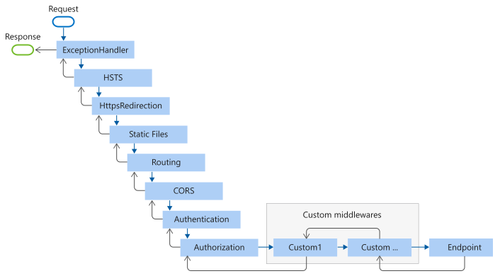
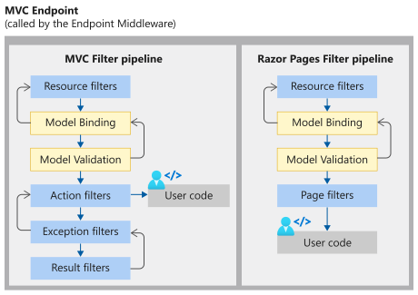

# ASP.NET Core Middleware

:::moniker range=">= aspnetcore-6.0"

By [Rick Anderson](https://twitter.com/RickAndMSFT) and [Steve Smith](https://ardalis.com/)

Middleware is software that's assembled into an app pipeline to handle requests and responses. Each component:

* Chooses whether to pass the request to the next component in the pipeline.
* Can perform work before and after the next component in the pipeline.

Request delegates are used to build the request pipeline. The request delegates handle each HTTP request.

Request delegates are configured using <xref:Microsoft.AspNetCore.Builder.RunExtensions.Run%2A>, <xref:Microsoft.AspNetCore.Builder.MapExtensions.Map%2A>, and <xref:Microsoft.AspNetCore.Builder.UseExtensions.Use%2A> extension methods. An individual request delegate can be specified in-line as an anonymous method (called in-line middleware), or it can be defined in a reusable class. These reusable classes and in-line anonymous methods are *middleware*, also called *middleware components*. Each middleware component in the request pipeline is responsible for invoking the next component in the pipeline or short-circuiting the pipeline. When a middleware short-circuits, it's called a *terminal middleware* because it prevents further middleware from processing the request.

<xref:migration/http-modules> explains the difference between request pipelines in ASP.NET Core and ASP.NET 4.x and provides additional middleware samples.

## Middleware code analysis

ASP.NET Core includes many compiler platform analyzers that inspect application code for quality. For more information, see <xref:diagnostics/code-analysis>

## Create a middleware pipeline with `WebApplication`

The ASP.NET Core request pipeline consists of a sequence of request delegates, called one after the other. The following diagram demonstrates the concept. The thread of execution follows the black arrows.


Each delegate can perform operations before and after the next delegate. Exception-handling delegates should be called early in the pipeline, so they can catch exceptions that occur in later stages of the pipeline.

The simplest possible ASP.NET Core app sets up a single request delegate that handles all requests. This case doesn't include an actual request pipeline. Instead, a single anonymous function is called in response to every HTTP request.

[!code-csharp[](index/snapshot/Middleware60/Program.cs)]

Chain multiple request delegates together with <xref:Microsoft.AspNetCore.Builder.UseExtensions.Use%2A>. The `next` parameter represents the next delegate in the pipeline. You can short-circuit the pipeline by *not* calling the `next` parameter. You can typically perform actions both before and after the `next` delegate, as the following example demonstrates:

[!code-csharp[](index/snapshot/Chain60/Program.cs?highlight=4-9)]

When a delegate doesn't pass a request to the next delegate, it's called *short-circuiting the request pipeline*. Short-circuiting is often desirable because it avoids unnecessary work. For example, [Static File Middleware](xref:fundamentals/static-files) can act as a *terminal middleware* by processing a request for a static file and short-circuiting the rest of the pipeline. Middleware added to the pipeline before the middleware that terminates further processing still processes code after their `next.Invoke` statements. However, see the following warning about attempting to write to a response that has already been sent.

> [!WARNING]
> Don't call `next.Invoke` after the response has been sent to the client. Changes to <xref:Microsoft.AspNetCore.Http.HttpResponse> after the response has started throw an exception. For example, [setting headers and a status code throw an exception](xref:performance/performance-best-practices#do-not-modify-the-status-code-or-headers-after-the-response-body-has-started). Writing to the response body after calling `next`:
>
> * May cause a protocol violation. For example, writing more than the stated `Content-Length`.
> * May corrupt the body format. For example, writing an HTML footer to a CSS file.
>
> <xref:Microsoft.AspNetCore.Http.HttpResponse.HasStarted%2A> is a useful hint to indicate if headers have been sent or the body has been written to.

<xref:Microsoft.AspNetCore.Builder.RunExtensions.Run%2A> delegates don't receive a `next` parameter. The first `Run` delegate is always terminal and terminates the pipeline. `Run` is a convention. Some middleware components may expose `Run[Middleware]` methods that run at the end of the pipeline:

[!code-csharp[](index/snapshot/Chain60/Program.cs?highlight=11-14)]
[!INCLUDE[about the series](~/includes/code-comments-loc.md)]

In the preceding example, the `Run` delegate writes `"Hello from 2nd delegate."` to the response and then terminates the pipeline. If another `Use` or `Run` delegate is added after the `Run` delegate, it's not called.

### Prefer app.Use overload that requires passing the context to next

<!-- TODO, a minimum, provide a sample usage. Better, use this overload in the 6.0 version -->

The non-allocating [app.Use](xref:Microsoft.AspNetCore.Builder.IApplicationBuilder.Use%2A) extension method:

* Requires passing the context to `next`.
* Saves two internal per-request allocations that are required when using the other overload.

For more information, see [this GitHub issue](https://github.com/dotnet/aspnetcore/pull/31784).

<a name="order"></a>

## Middleware order

The following diagram shows the complete request processing pipeline for ASP.NET Core MVC and Razor Pages apps. You can see how, in a typical app, existing middlewares are ordered and where custom middlewares are added. You have full control over how to reorder existing middlewares or inject new custom middlewares as necessary for your scenarios.



The **Endpoint** middleware in the preceding diagram executes the filter pipeline for the corresponding app type&mdash;MVC or Razor Pages.

The **Routing** middleware in the preceding diagram is shown following **Static Files**. This is the order that the project templates implement by explicitly calling [app.UseRouting](xref:Microsoft.AspNetCore.Builder.EndpointRoutingApplicationBuilderExtensions.UseRouting%2A). If you don't call `app.UseRouting`, the **Routing** middleware runs at the beginning of the pipeline by default. For more information, see [Routing](xref:fundamentals/routing).



The order that middleware components are added in the `Program.cs` file defines the order in which the middleware components are invoked on requests and the reverse order for the response. The order is **critical** for security, performance, and functionality.

The following highlighted code in `Program.cs` adds security-related middleware components in the typical recommended order:

[!code-csharp[](index/snapshot/Program60All3.cs?highlight=19-43)]

In the preceding code:

* Middleware that is not added when creating a new web app with [individual users accounts](xref:security/authentication/identity) is commented out.
* Not every middleware appears in this exact order, but many do. For example:
  * `UseCors`, `UseAuthentication`, and `UseAuthorization` must appear in the order shown.
  * `UseCors` currently must appear before `UseResponseCaching`. This requirement is explained in [GitHub issue dotnet/aspnetcore #23218](https://github.com/dotnet/aspnetcore/issues/23218).
  * `UseRequestLocalization` must appear before any middleware that might check the request culture (for example, `app.UseMvcWithDefaultRoute()`).

In some scenarios, middleware has different ordering. For example, caching and compression ordering is scenario specific, and there are multiple valid orderings. For example:

```csharp
app.UseResponseCaching();
app.UseResponseCompression();
```

With the preceding code, CPU usage could be reduced by caching the compressed response, but you might end up caching multiple representations of a resource using different compression algorithms such as Gzip or Brotli.

The following ordering combines static files to allow caching compressed static files:

```csharp
app.UseResponseCaching();
app.UseResponseCompression();
app.UseStaticFiles();
```

The following `Program.cs` code adds middleware components for common app scenarios:

1. Exception/error handling
   * When the app runs in the Development environment:
     * Developer Exception Page Middleware (<xref:Microsoft.AspNetCore.Builder.DeveloperExceptionPageExtensions.UseDeveloperExceptionPage%2A>) reports app runtime errors.
     * Database Error Page Middleware (<xref:Microsoft.AspNetCore.Builder.DatabaseErrorPageExtensions.UseDatabaseErrorPage%2A>) reports database runtime errors.
   * When the app runs in the Production environment:
     * Exception Handler Middleware (<xref:Microsoft.AspNetCore.Builder.ExceptionHandlerExtensions.UseExceptionHandler%2A>) catches exceptions thrown in the following middlewares.
     * HTTP Strict Transport Security Protocol (HSTS) Middleware (<xref:Microsoft.AspNetCore.Builder.HstsBuilderExtensions.UseHsts%2A>) adds the `Strict-Transport-Security` header.
1. HTTPS Redirection Middleware (<xref:Microsoft.AspNetCore.Builder.HttpsPolicyBuilderExtensions.UseHttpsRedirection%2A>) redirects HTTP requests to HTTPS.
1. Static File Middleware (<xref:Microsoft.AspNetCore.Builder.StaticFileExtensions.UseStaticFiles%2A>) returns static files and short-circuits further request processing.
1. Cookie Policy Middleware (<xref:Microsoft.AspNetCore.Builder.CookiePolicyAppBuilderExtensions.UseCookiePolicy%2A>) conforms the app to the EU General Data Protection Regulation (GDPR) regulations.
1. Routing Middleware (<xref:Microsoft.AspNetCore.Builder.EndpointRoutingApplicationBuilderExtensions.UseRouting%2A>) to route requests.
1. Authentication Middleware (<xref:Microsoft.AspNetCore.Builder.AuthAppBuilderExtensions.UseAuthentication%2A>) attempts to authenticate the user before they're allowed access to secure resources.
1. Authorization Middleware (<xref:Microsoft.AspNetCore.Builder.AuthorizationAppBuilderExtensions.UseAuthorization%2A>) authorizes a user to access secure resources.
1. Session Middleware (<xref:Microsoft.AspNetCore.Builder.SessionMiddlewareExtensions.UseSession%2A>) establishes and maintains session state. If the app uses session state, call Session Middleware after Cookie Policy Middleware and before MVC Middleware.
1. Endpoint Routing Middleware (<xref:Microsoft.AspNetCore.Builder.EndpointRoutingApplicationBuilderExtensions.UseEndpoints%2A> with <xref:Microsoft.AspNetCore.Builder.RazorPagesEndpointRouteBuilderExtensions.MapRazorPages%2A>) to add Razor Pages endpoints to the request pipeline.

```csharp
if (env.IsDevelopment())
{
    app.UseDeveloperExceptionPage();
    app.UseDatabaseErrorPage();
}
else
{
    app.UseExceptionHandler("/Error");
    app.UseHsts();
}
app.UseHttpsRedirection();
app.UseStaticFiles();
app.UseCookiePolicy();
app.UseRouting();
app.UseAuthentication();
app.UseAuthorization();
app.UseSession();
app.MapRazorPages();
```

In the preceding example code, each middleware extension method is exposed on <xref:Microsoft.AspNetCore.Builder.WebApplicationBuilder> through the <xref:Microsoft.AspNetCore.Builder?displayProperty=fullName> namespace.

<xref:Microsoft.AspNetCore.Builder.ExceptionHandlerExtensions.UseExceptionHandler%2A> is the first middleware component added to the pipeline. Therefore, the Exception Handler Middleware catches any exceptions that occur in later calls.

Static File Middleware is called early in the pipeline so that it can handle requests and short-circuit without going through the remaining components. The Static File Middleware provides **no** authorization checks. Any files served by Static File Middleware, including those under *wwwroot*, are publicly available. For an approach to secure static files, see <xref:fundamentals/static-files>.

If the request isn't handled by the Static File Middleware, it's passed on to the Authentication Middleware (<xref:Microsoft.AspNetCore.Builder.AuthAppBuilderExtensions.UseAuthentication%2A>), which performs authentication. Authentication doesn't short-circuit unauthenticated requests. Although Authentication Middleware authenticates requests, authorization (and rejection) occurs only after MVC selects a specific Razor Page or MVC controller and action.

The following example demonstrates a middleware order where requests for static files are handled by Static File Middleware before Response Compression Middleware. Static files aren't compressed with this middleware order. The Razor Pages responses can be compressed.

```csharp
// Static files aren't compressed by Static File Middleware.
app.UseStaticFiles();

app.UseRouting();

app.UseResponseCompression();

app.MapRazorPages();
```

For information about Single Page Applications, see the guides for the [React](xref:spa/react) and [Angular](xref:spa/angular) project templates.

## UseCors and UseStaticFiles order

The order for calling `UseCors` and `UseStaticFiles` depends on the app. For more information, see [UseCors and UseStaticFiles order](xref:security/cors#uc1)

### Forwarded Headers Middleware order

[!INCLUDE[](~/includes/ForwardedHeaders.md)]

## Branch the middleware pipeline

<xref:Microsoft.AspNetCore.Builder.MapExtensions.Map%2A> extensions are used as a convention for branching the pipeline. `Map` branches the request pipeline based on matches of the given request path. If the request path starts with the given path, the branch is executed.

[!code-csharp[](index/snapshot/Chain60/ProgramMap.cs)]

The following table shows the requests and responses from `http://localhost:1234` using the preceding code.

| Request             | Response                     |
| ------------------- | ---------------------------- |
| localhost:1234      | Hello from non-Map delegate. |
| localhost:1234/map1 | Map Test 1                   |
| localhost:1234/map2 | Map Test 2                   |
| localhost:1234/map3 | Hello from non-Map delegate. |

When `Map` is used, the matched path segments are removed from `HttpRequest.Path` and appended to `HttpRequest.PathBase` for each request.

`Map` supports nesting, for example:

```csharp
app.Map("/level1", level1App => {
    level1App.Map("/level2a", level2AApp => {
        // "/level1/level2a" processing
    });
    level1App.Map("/level2b", level2BApp => {
        // "/level1/level2b" processing
    });
});
```

`Map` can also match multiple segments at once:

[!code-csharp[](index/snapshot/Chain60/ProgramMultiSeg.cs?highlight=4)]

<xref:Microsoft.AspNetCore.Builder.MapWhenExtensions.MapWhen%2A> branches the request pipeline based on the result of the given predicate. Any predicate of type `Func<HttpContext, bool>` can be used to map requests to a new branch of the pipeline. In the following example, a predicate is used to detect the presence of a query string variable `branch`:

[!code-csharp[](index/snapshot/Chain60/ProgramMapWhen.cs?highlight=4)]

The following table shows the requests and responses from `http://localhost:1234` using the previous code:

| Request                       | Response                       |
| ----------------------------- | ------------------------------ |
| `localhost:1234`              | `Hello from non-Map delegate.` |
| `localhost:1234/?branch=main` | `Branch used = main`           |

<xref:Microsoft.AspNetCore.Builder.UseWhenExtensions.UseWhen%2A> also branches the request pipeline based on the result of the given predicate. Unlike with `MapWhen`, this branch is rejoined to the main pipeline if it doesn't short-circuit or contain a terminal middleware:

[!code-csharp[](index/snapshot/Chain60/ProgramUseWhen.cs?highlight=4-5)]

In the preceding example, a response of `Hello from non-Map delegate.` is written for all requests. If the request includes a query string variable `branch`, its value is logged before the main pipeline is rejoined.

## Built-in middleware

ASP.NET Core ships with the following middleware components. The *Order* column provides notes on middleware placement in the request processing pipeline and under what conditions the middleware may terminate request processing. When a middleware short-circuits the request processing pipeline and prevents further downstream middleware from processing a request, it's called a *terminal middleware*. For more information on short-circuiting, see the [Create a middleware pipeline with IApplicationBuilder](#create-a-middleware-pipeline-with-iapplicationbuilder) section.

| Middleware | Description | Order |
| ---------- | ----------- | ----- |
| [Authentication](xref:security/authentication/identity) | Provides authentication support. | Before `HttpContext.User` is needed. Terminal for OAuth callbacks. |
| [Authorization](xref:Microsoft.AspNetCore.Builder.AuthorizationAppBuilderExtensions.UseAuthorization%2A) | Provides authorization support. | Immediately after the Authentication Middleware. |
| [Cookie Policy](xref:security/gdpr) | Tracks consent from users for storing personal information and enforces minimum standards for cookie fields, such as `secure` and `SameSite`. | Before middleware that issues cookies. Examples: Authentication, Session, MVC (TempData). |
| [CORS](xref:security/cors) | Configures Cross-Origin Resource Sharing. | Before components that use CORS. `UseCors` currently must go before `UseResponseCaching` due to [this bug](https://github.com/dotnet/aspnetcore/issues/23218).|
| [DeveloperExceptionPage](xref:Microsoft.AspNetCore.Diagnostics.DeveloperExceptionPageMiddleware) | Generates a page with error information that is intended for use only in the Development environment. | Before components that generate errors. The project templates automatically register this middleware as the first middleware in the pipeline when the environment is Development. |
| [Diagnostics](xref:fundamentals/error-handling) | Several separate middlewares that provide a developer exception page, exception handling, status code pages, and the default web page for new apps. | Before components that generate errors. Terminal for exceptions or serving the default web page for new apps. |
| [Forwarded Headers](xref:host-and-deploy/proxy-load-balancer) | Forwards proxied headers onto the current request. | Before components that consume the updated fields. Examples: scheme, host, client IP, method. |
| [Health Check](xref:host-and-deploy/health-checks) | Checks the health of an ASP.NET Core app and its dependencies, such as checking database availability. | Terminal if a request matches a health check endpoint. |
| [Header Propagation](xref:fundamentals/http-requests#header-propagation-middleware) | Propagates HTTP headers from the incoming request to the outgoing HTTP Client requests. |
| [HTTP Logging](xref:fundamentals/http-logging/index) | Logs HTTP Requests and Responses. | At the beginning of the middleware pipeline. |
| [HTTP Method Override](xref:Microsoft.AspNetCore.Builder.HttpMethodOverrideExtensions) | Allows an incoming POST request to override the method. | Before components that consume the updated method. |
| [HTTPS Redirection](xref:security/enforcing-ssl#require-https) | Redirect all HTTP requests to HTTPS. | Before components that consume the URL. |
| [HTTP Strict Transport Security (HSTS)](xref:security/enforcing-ssl#http-strict-transport-security-protocol-hsts) | Security enhancement middleware that adds a special response header. | Before responses are sent and after components that modify requests. Examples: Forwarded Headers, URL Rewriting. |
| [MVC](xref:mvc/overview) | Processes requests with MVC/Razor Pages. | Terminal if a request matches a route. |
| [OWIN](xref:fundamentals/owin) | Interop with OWIN-based apps, servers, and middleware. | Terminal if the OWIN Middleware fully processes the request. |
| [Response Caching](xref:performance/caching/middleware) | Provides support for caching responses. | Before components that require caching. `UseCORS` must come before `UseResponseCaching`.|
| [Response Compression](xref:performance/response-compression) | Provides support for compressing responses. | Before components that require compression. |
| [Request Localization](xref:fundamentals/localization) | Provides localization support. | Before localization sensitive components. Must appear after Routing Middleware when using <xref:Microsoft.AspNetCore.Localization.Routing.RouteDataRequestCultureProvider>. |
| [Endpoint Routing](xref:fundamentals/routing) | Defines and constrains request routes. | Terminal for matching routes. |
| [SPA](xref:Microsoft.AspNetCore.Builder.SpaApplicationBuilderExtensions.UseSpa%2A) | Handles all requests from this point in the middleware chain by returning the default page for the Single Page Application (SPA) | Late in the chain, so that other middleware for serving static files, MVC actions, etc., takes precedence.|
| [Session](xref:fundamentals/app-state) | Provides support for managing user sessions. | Before components that require Session. | 
| [Static Files](xref:fundamentals/static-files) | Provides support for serving static files and directory browsing. | Terminal if a request matches a file. |
| [URL Rewrite](xref:fundamentals/url-rewriting) | Provides support for rewriting URLs and redirecting requests. | Before components that consume the URL. |
| [W3CLogging](xref:fundamentals/w3c-logger/index) | Generates server access logs in the [W3C Extended Log File Format](https://www.w3.org/TR/WD-logfile.html). | At the beginning of the middleware pipeline. |
| [WebSockets](xref:fundamentals/websockets) | Enables the WebSockets protocol. | Before components that are required to accept WebSocket requests. |

## Additional resources

* [Lifetime and registration options](xref:fundamentals/dependency-injection#lifetime-and-registration-options) contains a complete sample of middleware with *scoped*, *transient*, and *singleton* lifetime services.
* <xref:fundamentals/middleware/write>
* <xref:test/middleware>
* [Configure gRPC-Web in ASP.NET Core](xref:grpc/browser#configure-grpc-web-in-aspnet-core)
* <xref:migration/http-modules>
* <xref:fundamentals/startup>
* <xref:fundamentals/request-features>
* <xref:fundamentals/middleware/extensibility>
* <xref:fundamentals/middleware/extensibility-third-party-container>

:::moniker-end

:::moniker range="< aspnetcore-6.0"

By [Rick Anderson](https://twitter.com/RickAndMSFT) and [Steve Smith](https://ardalis.com/)

Middleware is software that's assembled into an app pipeline to handle requests and responses. Each component:

* Chooses whether to pass the request to the next component in the pipeline.
* Can perform work before and after the next component in the pipeline.

Request delegates are used to build the request pipeline. The request delegates handle each HTTP request.

Request delegates are configured using <xref:Microsoft.AspNetCore.Builder.RunExtensions.Run%2A>, <xref:Microsoft.AspNetCore.Builder.MapExtensions.Map%2A>, and <xref:Microsoft.AspNetCore.Builder.UseExtensions.Use%2A> extension methods. An individual request delegate can be specified in-line as an anonymous method (called in-line middleware), or it can be defined in a reusable class. These reusable classes and in-line anonymous methods are *middleware*, also called *middleware components*. Each middleware component in the request pipeline is responsible for invoking the next component in the pipeline or short-circuiting the pipeline. When a middleware short-circuits, it's called a *terminal middleware* because it prevents further middleware from processing the request.

<xref:migration/http-modules> explains the difference between request pipelines in ASP.NET Core and ASP.NET 4.x and provides additional middleware samples.

## Create a middleware pipeline with IApplicationBuilder

The ASP.NET Core request pipeline consists of a sequence of request delegates, called one after the other. The following diagram demonstrates the concept. The thread of execution follows the black arrows.


Each delegate can perform operations before and after the next delegate. Exception-handling delegates should be called early in the pipeline, so they can catch exceptions that occur in later stages of the pipeline.

The simplest possible ASP.NET Core app sets up a single request delegate that handles all requests. This case doesn't include an actual request pipeline. Instead, a single anonymous function is called in response to every HTTP request.

[!code-csharp[](index/snapshot/Middleware/Startup.cs)]

Chain multiple request delegates together with <xref:Microsoft.AspNetCore.Builder.UseExtensions.Use%2A>. The `next` parameter represents the next delegate in the pipeline. You can short-circuit the pipeline by *not* calling the *next* parameter. You can typically perform actions both before and after the next delegate, as the following example demonstrates:

[!code-csharp[](index/snapshot/Chain/Startup.cs?highlight=5-10)]

When a delegate doesn't pass a request to the next delegate, it's called *short-circuiting the request pipeline*. Short-circuiting is often desirable because it avoids unnecessary work. For example, [Static File Middleware](xref:fundamentals/static-files) can act as a *terminal middleware* by processing a request for a static file and short-circuiting the rest of the pipeline. Middleware added to the pipeline before the middleware that terminates further processing still processes code after their `next.Invoke` statements. However, see the following warning about attempting to write to a response that has already been sent.

> [!WARNING]
> Don't call `next.Invoke` after the response has been sent to the client. Changes to <xref:Microsoft.AspNetCore.Http.HttpResponse> after the response has started throw an exception. For example, [setting headers and a status code throw an exception](xref:performance/performance-best-practices#do-not-modify-the-status-code-or-headers-after-the-response-body-has-started). Writing to the response body after calling `next`:
>
> * May cause a protocol violation. For example, writing more than the stated `Content-Length`.
> * May corrupt the body format. For example, writing an HTML footer to a CSS file.
>
> <xref:Microsoft.AspNetCore.Http.HttpResponse.HasStarted%2A> is a useful hint to indicate if headers have been sent or the body has been written to.

<xref:Microsoft.AspNetCore.Builder.RunExtensions.Run%2A> delegates don't receive a `next` parameter. The first `Run` delegate is always terminal and terminates the pipeline. `Run` is a convention. Some middleware components may expose `Run[Middleware]` methods that run at the end of the pipeline:

[!code-csharp[](index/snapshot/Chain/Startup.cs?highlight=12-15)]
[!INCLUDE[about the series](~/includes/code-comments-loc.md)]

In the preceding example, the `Run` delegate writes `"Hello from 2nd delegate."` to the response and then terminates the pipeline. If another `Use` or `Run` delegate is added after the `Run` delegate, it's not called.

<a name="order"></a>

## Middleware order

The following diagram shows the complete request processing pipeline for ASP.NET Core MVC and Razor Pages apps. You can see how, in a typical app, existing middlewares are ordered and where custom middlewares are added. You have full control over how to reorder existing middlewares or inject new custom middlewares as necessary for your scenarios.


The **Endpoint** middleware in the preceding diagram executes the filter pipeline for the corresponding app type&mdash;MVC or Razor Pages.


The order that middleware components are added in the `Startup.Configure` method defines the order in which the middleware components are invoked on requests and the reverse order for the response. The order is **critical** for security, performance, and functionality.

The following `Startup.Configure` method adds security-related middleware components in the typical recommended order:

[!code-csharp[](index/snapshot/StartupAll3.cs?name=snippet)]

In the preceding code:

* Middleware that is not added when creating a new web app with [individual users accounts](xref:security/authentication/identity) is commented out.
* Not every middleware appears in this exact order, but many do. For example:
  * `UseCors`, `UseAuthentication`, and `UseAuthorization` must appear in the order shown.
  * `UseCors` currently must appear before `UseResponseCaching` due to [this bug](https://github.com/dotnet/aspnetcore/issues/23218).
  * `UseRequestLocalization` must appear before any middleware that might check the request culture (for example, `app.UseMvcWithDefaultRoute()`).

In some scenarios, middleware has different ordering. For example, caching and compression ordering is scenario specific, and there's multiple valid orderings. For example:

```csharp
app.UseResponseCaching();
app.UseResponseCompression();
```

With the preceding code, CPU could be saved by caching the compressed response, but you might end up caching multiple representations of a resource using different compression algorithms such as Gzip or Brotli.

The following ordering combines static files to allow caching compressed static files:

```csharp
app.UseResponseCaching();
app.UseResponseCompression();
app.UseStaticFiles();
```

The following `Startup.Configure` method adds middleware components for common app scenarios:

1. Exception/error handling
   * When the app runs in the Development environment:
     * Developer Exception Page Middleware (<xref:Microsoft.AspNetCore.Builder.DeveloperExceptionPageExtensions.UseDeveloperExceptionPage%2A>) reports app runtime errors.
     * Database Error Page Middleware reports database runtime errors.
   * When the app runs in the Production environment:
     * Exception Handler Middleware (<xref:Microsoft.AspNetCore.Builder.ExceptionHandlerExtensions.UseExceptionHandler%2A>) catches exceptions thrown in the following middlewares.
     * HTTP Strict Transport Security Protocol (HSTS) Middleware (<xref:Microsoft.AspNetCore.Builder.HstsBuilderExtensions.UseHsts%2A>) adds the `Strict-Transport-Security` header.
1. HTTPS Redirection Middleware (<xref:Microsoft.AspNetCore.Builder.HttpsPolicyBuilderExtensions.UseHttpsRedirection%2A>) redirects HTTP requests to HTTPS.
1. Static File Middleware (<xref:Microsoft.AspNetCore.Builder.StaticFileExtensions.UseStaticFiles%2A>) returns static files and short-circuits further request processing.
1. Cookie Policy Middleware (<xref:Microsoft.AspNetCore.Builder.CookiePolicyAppBuilderExtensions.UseCookiePolicy%2A>) conforms the app to the EU General Data Protection Regulation (GDPR) regulations.
1. Routing Middleware (<xref:Microsoft.AspNetCore.Builder.EndpointRoutingApplicationBuilderExtensions.UseRouting%2A>) to route requests.
1. Authentication Middleware (<xref:Microsoft.AspNetCore.Builder.AuthAppBuilderExtensions.UseAuthentication%2A>) attempts to authenticate the user before they're allowed access to secure resources.
1. Authorization Middleware (<xref:Microsoft.AspNetCore.Builder.AuthorizationAppBuilderExtensions.UseAuthorization%2A>) authorizes a user to access secure resources.
1. Session Middleware (<xref:Microsoft.AspNetCore.Builder.SessionMiddlewareExtensions.UseSession%2A>) establishes and maintains session state. If the app uses session state, call Session Middleware after Cookie Policy Middleware and before MVC Middleware.
1. Endpoint Routing Middleware (<xref:Microsoft.AspNetCore.Builder.EndpointRoutingApplicationBuilderExtensions.UseEndpoints%2A> with <xref:Microsoft.AspNetCore.Builder.RazorPagesEndpointRouteBuilderExtensions.MapRazorPages%2A>) to add Razor Pages endpoints to the request pipeline.

```csharp
public void Configure(IApplicationBuilder app, IWebHostEnvironment env)
{
    if (env.IsDevelopment())
    {
        app.UseDeveloperExceptionPage();
        app.UseDatabaseErrorPage();
    }
    else
    {
        app.UseExceptionHandler("/Error");
        app.UseHsts();
    }

    app.UseHttpsRedirection();
    app.UseStaticFiles();
    app.UseCookiePolicy();
    app.UseRouting();
    app.UseAuthentication();
    app.UseAuthorization();
    app.UseSession();

    app.UseEndpoints(endpoints =>
    {
        endpoints.MapRazorPages();
    });
}
```

In the preceding example code, each middleware extension method is exposed on <xref:Microsoft.AspNetCore.Builder.IApplicationBuilder> through the <xref:Microsoft.AspNetCore.Builder?displayProperty=fullName> namespace.

<xref:Microsoft.AspNetCore.Builder.ExceptionHandlerExtensions.UseExceptionHandler%2A> is the first middleware component added to the pipeline. Therefore, the Exception Handler Middleware catches any exceptions that occur in later calls.

Static File Middleware is called early in the pipeline so that it can handle requests and short-circuit without going through the remaining components. The Static File Middleware provides **no** authorization checks. Any files served by Static File Middleware, including those under *wwwroot*, are publicly available. For an approach to secure static files, see <xref:fundamentals/static-files>.

If the request isn't handled by the Static File Middleware, it's passed on to the Authentication Middleware (<xref:Microsoft.AspNetCore.Builder.AuthAppBuilderExtensions.UseAuthentication%2A>), which performs authentication. Authentication doesn't short-circuit unauthenticated requests. Although Authentication Middleware authenticates requests, authorization (and rejection) occurs only after MVC selects a specific Razor Page or MVC controller and action.

The following example demonstrates a middleware order where requests for static files are handled by Static File Middleware before Response Compression Middleware. Static files aren't compressed with this middleware order. The Razor Pages responses can be compressed.

```csharp
public void Configure(IApplicationBuilder app)
{
    // Static files aren't compressed by Static File Middleware.
    app.UseStaticFiles();

    app.UseRouting();

    app.UseResponseCompression();

    app.UseEndpoints(endpoints =>
    {
        endpoints.MapRazorPages();
    });
}
```

For Single Page Applications (SPAs), the SPA middleware <xref:Microsoft.Extensions.DependencyInjection.SpaStaticFilesExtensions.UseSpaStaticFiles%2A> usually comes last in the middleware pipeline. The SPA middleware comes last:

* To allow all other middlewares to respond to matching requests first.
* To allow SPAs with client-side routing to run for all routes that are unrecognized by the server app.

For more details on SPAs, see the guides for the [React](xref:spa/react) and [Angular](xref:spa/angular) project templates.

### Forwarded Headers Middleware order

[!INCLUDE[](~/includes/ForwardedHeaders.md)]

## Branch the middleware pipeline

<xref:Microsoft.AspNetCore.Builder.MapExtensions.Map%2A> extensions are used as a convention for branching the pipeline. `Map` branches the request pipeline based on matches of the given request path. If the request path starts with the given path, the branch is executed.

[!code-csharp[](index/snapshot/Chain/StartupMap.cs)]

The following table shows the requests and responses from `http://localhost:1234` using the previous code.

| Request             | Response                     |
| ------------------- | ---------------------------- |
| localhost:1234      | Hello from non-Map delegate. |
| localhost:1234/map1 | Map Test 1                   |
| localhost:1234/map2 | Map Test 2                   |
| localhost:1234/map3 | Hello from non-Map delegate. |

When `Map` is used, the matched path segments are removed from `HttpRequest.Path` and appended to `HttpRequest.PathBase` for each request.

`Map` supports nesting, for example:

```csharp
app.Map("/level1", level1App => {
    level1App.Map("/level2a", level2AApp => {
        // "/level1/level2a" processing
    });
    level1App.Map("/level2b", level2BApp => {
        // "/level1/level2b" processing
    });
});
```

`Map` can also match multiple segments at once:

[!code-csharp[](index/snapshot/Chain/StartupMultiSeg.cs?highlight=13)]

<xref:Microsoft.AspNetCore.Builder.MapWhenExtensions.MapWhen%2A> branches the request pipeline based on the result of the given predicate. Any predicate of type `Func<HttpContext, bool>` can be used to map requests to a new branch of the pipeline. In the following example, a predicate is used to detect the presence of a query string variable `branch`:

[!code-csharp[](index/snapshot/Chain/StartupMapWhen.cs?highlight=14-15)]

The following table shows the requests and responses from `http://localhost:1234` using the previous code:

| Request                       | Response                     |
| ----------------------------- | ---------------------------- |
| localhost:1234                | Hello from non-Map delegate. |
| localhost:1234/?branch=main | Branch used = main         |

<xref:Microsoft.AspNetCore.Builder.UseWhenExtensions.UseWhen%2A> also branches the request pipeline based on the result of the given predicate. Unlike with `MapWhen`, this branch is rejoined to the main pipeline if it doesn't short-circuit or contain a terminal middleware:

[!code-csharp[](index/snapshot/Chain/StartupUseWhen.cs?highlight=18-19)]

In the preceding example, a response of "Hello from main pipeline." is written for all requests. If the request includes a query string variable `branch`, its value is logged before the main pipeline is rejoined.

## Built-in middleware

ASP.NET Core ships with the following middleware components. The *Order* column provides notes on middleware placement in the request processing pipeline and under what conditions the middleware may terminate request processing. When a middleware short-circuits the request processing pipeline and prevents further downstream middleware from processing a request, it's called a *terminal middleware*. For more information on short-circuiting, see the [Create a middleware pipeline with IApplicationBuilder](#create-a-middleware-pipeline-with-iapplicationbuilder) section.

| Middleware | Description | Order |
| ---------- | ----------- | ----- |
| [Authentication](xref:security/authentication/identity) | Provides authentication support. | Before `HttpContext.User` is needed. Terminal for OAuth callbacks. |
| [Authorization](xref:Microsoft.AspNetCore.Builder.AuthorizationAppBuilderExtensions.UseAuthorization%2A) | Provides authorization support. | Immediately after the Authentication Middleware. |
| [Cookie Policy](xref:security/gdpr) | Tracks consent from users for storing personal information and enforces minimum standards for cookie fields, such as `secure` and `SameSite`. | Before middleware that issues cookies. Examples: Authentication, Session, MVC (TempData). |
| [CORS](xref:security/cors) | Configures Cross-Origin Resource Sharing. | Before components that use CORS. `UseCors` currently must go before `UseResponseCaching` due to [this bug](https://github.com/dotnet/aspnetcore/issues/23218).|
| [Diagnostics](xref:fundamentals/error-handling) | Several separate middlewares that provide a developer exception page, exception handling, status code pages, and the default web page for new apps. | Before components that generate errors. Terminal for exceptions or serving the default web page for new apps. |
| [Forwarded Headers](xref:host-and-deploy/proxy-load-balancer) | Forwards proxied headers onto the current request. | Before components that consume the updated fields. Examples: scheme, host, client IP, method. |
| [Health Check](xref:host-and-deploy/health-checks) | Checks the health of an ASP.NET Core app and its dependencies, such as checking database availability. | Terminal if a request matches a health check endpoint. |
| [Header Propagation](xref:fundamentals/http-requests#header-propagation-middleware) | Propagates HTTP headers from the incoming request to the outgoing HTTP Client requests. |
| [HTTP Method Override](xref:Microsoft.AspNetCore.Builder.HttpMethodOverrideExtensions) | Allows an incoming POST request to override the method. | Before components that consume the updated method. |
| [HTTPS Redirection](xref:security/enforcing-ssl#require-https) | Redirect all HTTP requests to HTTPS. | Before components that consume the URL. |
| [HTTP Strict Transport Security (HSTS)](xref:security/enforcing-ssl#http-strict-transport-security-protocol-hsts) | Security enhancement middleware that adds a special response header. | Before responses are sent and after components that modify requests. Examples: Forwarded Headers, URL Rewriting. |
| [MVC](xref:mvc/overview) | Processes requests with MVC/Razor Pages. | Terminal if a request matches a route. |
| [OWIN](xref:fundamentals/owin) | Interop with OWIN-based apps, servers, and middleware. | Terminal if the OWIN Middleware fully processes the request. |
| [Response Caching](xref:performance/caching/middleware) | Provides support for caching responses. | Before components that require caching. `UseCORS` must come before `UseResponseCaching`.|
| [Response Compression](xref:performance/response-compression) | Provides support for compressing responses. | Before components that require compression. |
| [Request Localization](xref:fundamentals/localization) | Provides localization support. | Before localization sensitive components. Must appear after Routing Middleware when using <xref:Microsoft.AspNetCore.Localization.Routing.RouteDataRequestCultureProvider>. |
| [Endpoint Routing](xref:fundamentals/routing) | Defines and constrains request routes. | Terminal for matching routes. |
| [SPA](xref:Microsoft.AspNetCore.Builder.SpaApplicationBuilderExtensions.UseSpa%2A) | Handles all requests from this point in the middleware chain by returning the default page for the Single Page Application (SPA) | Late in the chain, so that other middleware for serving static files, MVC actions, etc., takes precedence.|
| [Session](xref:fundamentals/app-state) | Provides support for managing user sessions. | Before components that require Session. | 
| [Static Files](xref:fundamentals/static-files) | Provides support for serving static files and directory browsing. | Terminal if a request matches a file. |
| [URL Rewrite](xref:fundamentals/url-rewriting) | Provides support for rewriting URLs and redirecting requests. | Before components that consume the URL. |
| [WebSockets](xref:fundamentals/websockets) | Enables the WebSocket protocol. | Before components that are required to accept WebSocket requests. |

## Additional resources

* [Lifetime and registration options](xref:fundamentals/dependency-injection#lifetime-and-registration-options) contains a complete sample of middleware with *scoped*, *transient*, and *singleton* lifetime services.
* <xref:fundamentals/middleware/write>
* <xref:test/middleware>
* <xref:migration/http-modules>
* <xref:fundamentals/startup>
* <xref:fundamentals/request-features>
* <xref:fundamentals/middleware/extensibility>
* <xref:fundamentals/middleware/extensibility-third-party-container>

:::moniker-end
