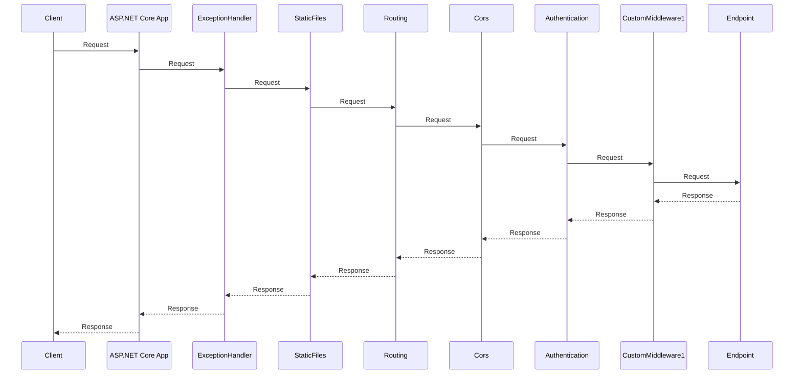

```mermaid
sequenceDiagram
    participant Client
    participant ASP.NET Core App
    participant ExceptionHandler
    participant StaticFiles
    participant Routing
    participant Cors
    participant Authentication
    participant CustomMiddleware1
    participant Endpoint

    Client->>ASP.NET Core App: Request
    ASP.NET Core App->>ExceptionHandler: Request
    ExceptionHandler->>StaticFiles: Request
    StaticFiles->>Routing: Request
    Routing->>Cors: Request
    Cors->>Authentication: Request
    Authentication->>CustomMiddleware1: Request
    CustomMiddleware1->>Endpoint: Request
    Endpoint-->>CustomMiddleware1: Response
    CustomMiddleware1-->>Authentication: Response
    Authentication-->>Cors: Response
    Cors-->>Routing: Response
    Routing-->>StaticFiles: Response
    StaticFiles-->>ExceptionHandler: Response
    ExceptionHandler-->>ASP.NET Core App: Response
    ASP.NET Core App-->>Client: Response
```