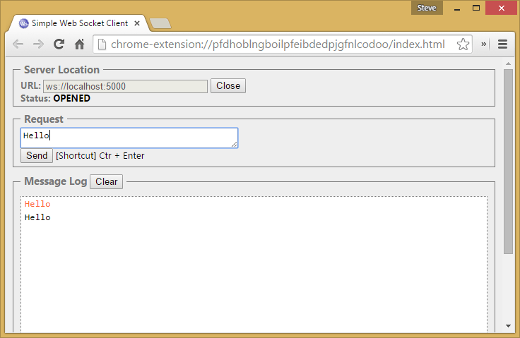

# Open Web Interface for .NET (OWIN) with ASP.NET Core

By [Steve Smith](https://ardalis.com/) and [Rick Anderson](https://twitter.com/RickAndMSFT)

ASP.NET Core supports the Open Web Interface for .NET (OWIN). OWIN allows web apps to be decoupled from web servers. It defines a standard way for middleware to be used in a pipeline to handle requests and associated responses. ASP.NET Core applications and middleware can interoperate with OWIN-based applications, servers, and middleware.

OWIN provides a decoupling layer that allows two frameworks with disparate object models to be used together. The `Microsoft.AspNetCore.Owin` package provides two adapter implementations:

* ASP.NET Core to OWIN 
* OWIN to ASP.NET Core

This allows ASP.NET Core to be hosted on top of an OWIN compatible server/host or for other OWIN compatible components to be run on top of ASP.NET Core.

> [!NOTE]
> Using these adapters comes with a performance cost. Apps using only ASP.NET Core components shouldn't use the `Microsoft.AspNetCore.Owin` package or adapters.

[View or download sample code](https://github.com/dotnet/AspNetCore.Docs/tree/master/aspnetcore/fundamentals/owin/sample) ([how to download](xref:index#how-to-download-a-sample))

## Running OWIN middleware in the ASP.NET Core pipeline

ASP.NET Core's OWIN support is deployed as part of the `Microsoft.AspNetCore.Owin` package. You can import OWIN support into your project by installing this package.

OWIN middleware conforms to the [OWIN specification](https://owin.org/spec/spec/owin-1.0.0.html), which requires a `Func<IDictionary<string, object>, Task>` interface, and specific keys be set (such as `owin.ResponseBody`). The following simple OWIN middleware displays "Hello World":

```csharp
public Task OwinHello(IDictionary<string, object> environment)
{
    string responseText = "Hello World via OWIN";
    byte[] responseBytes = Encoding.UTF8.GetBytes(responseText);

    // OWIN Environment Keys: https://owin.org/spec/spec/owin-1.0.0.html
    var responseStream = (Stream)environment["owin.ResponseBody"];
    var responseHeaders = (IDictionary<string, string[]>)environment["owin.ResponseHeaders"];

    responseHeaders["Content-Length"] = new string[] { responseBytes.Length.ToString(CultureInfo.InvariantCulture) };
    responseHeaders["Content-Type"] = new string[] { "text/plain" };

    return responseStream.WriteAsync(responseBytes, 0, responseBytes.Length);
}
```

The sample signature returns a `Task` and accepts an `IDictionary<string, object>` as required by OWIN.

The following code shows how to add the `OwinHello` middleware (shown above) to the ASP.NET Core pipeline with the `UseOwin` extension method.

```csharp
public void Configure(IApplicationBuilder app)
{
    app.UseOwin(pipeline =>
    {
        pipeline(next => OwinHello);
    });
}
```

You can configure other actions to take place within the OWIN pipeline.

> [!NOTE]
> Response headers should only be modified prior to the first write to the response stream.

> [!NOTE]
> Multiple calls to `UseOwin` is discouraged for performance reasons. OWIN components will operate best if grouped together.

```csharp
app.UseOwin(pipeline =>
{
    pipeline(next =>
    {
        return async environment =>
        {
            // Do something before.
            await next(environment);
            // Do something after.
        };
    });
});
```

<a name="hosting-on-owin"></a>

## Using ASP.NET Core Hosting on an OWIN-based server

OWIN-based servers can host ASP.NET Core apps. One such server is [Nowin](https://github.com/Bobris/Nowin), a .NET OWIN web server. In the sample for this article, I've included a project that references Nowin and uses it to create an `IServer` capable of self-hosting ASP.NET Core.

[!code-csharp[](owin/sample/src/NowinSample/Program.cs?highlight=15)]

`IServer` is an interface that requires a `Features` property and a `Start` method.

`Start` is responsible for configuring and starting the server, which in this case is done through a series of fluent API calls that set addresses parsed from the IServerAddressesFeature. Note that the fluent configuration of the `_builder` variable specifies that requests will be handled by the `appFunc` defined earlier in the method. This `Func` is called on each request to process incoming requests.

We'll also add an `IWebHostBuilder` extension to make it easy to add and configure the Nowin server.

```csharp
using System;
using Microsoft.AspNetCore.Hosting.Server;
using Microsoft.Extensions.DependencyInjection;
using Nowin;
using NowinSample;

namespace Microsoft.AspNetCore.Hosting
{
    public static class NowinWebHostBuilderExtensions
    {
        public static IWebHostBuilder UseNowin(this IWebHostBuilder builder)
        {
            return builder.ConfigureServices(services =>
            {
                services.AddSingleton<IServer, NowinServer>();
            });
        }

        public static IWebHostBuilder UseNowin(this IWebHostBuilder builder, Action<ServerBuilder> configure)
        {
            builder.ConfigureServices(services =>
            {
                services.Configure(configure);
            });
            return builder.UseNowin();
        }
    }
}
```

With this in place, invoke the extension in *Program.cs* to run an ASP.NET Core app using this custom server:

```csharp
using System;
using System.Collections.Generic;
using System.IO;
using System.Linq;
using System.Threading.Tasks;
using Microsoft.AspNetCore.Hosting;

namespace NowinSample
{
    public class Program
    {
        public static void Main(string[] args)
        {
            var host = new WebHostBuilder()
                .UseNowin()
                .UseContentRoot(Directory.GetCurrentDirectory())
                .UseIISIntegration()
                .UseStartup<Startup>()
                .Build();

            host.Run();
        }
    }
}
```

Learn more about [ASP.NET Core Servers](xref:fundamentals/servers/index).

## Run ASP.NET Core on an OWIN-based server and use its WebSockets support

Another example of how OWIN-based servers' features can be leveraged by ASP.NET Core is access to features like WebSockets. The .NET OWIN web server used in the previous example has support for Web Sockets built in, which can be leveraged by an ASP.NET Core application. The example below shows a simple web app that supports Web Sockets and echoes back everything sent to the server through WebSockets.

```csharp
public class Startup
{
    public void Configure(IApplicationBuilder app)
    {
        app.Use(async (context, next) =>
        {
            if (context.WebSockets.IsWebSocketRequest)
            {
                WebSocket webSocket = await context.WebSockets.AcceptWebSocketAsync();
                await EchoWebSocket(webSocket);
            }
            else
            {
                await next();
            }
        });

        app.Run(context =>
        {
            return context.Response.WriteAsync("Hello World");
        });
    }

    private async Task EchoWebSocket(WebSocket webSocket)
    {
        byte[] buffer = new byte[1024];
        WebSocketReceiveResult received = await webSocket.ReceiveAsync(
            new ArraySegment<byte>(buffer), CancellationToken.None);

        while (!webSocket.CloseStatus.HasValue)
        {
            // Echo anything we receive
            await webSocket.SendAsync(new ArraySegment<byte>(buffer, 0, received.Count), 
                received.MessageType, received.EndOfMessage, CancellationToken.None);

            received = await webSocket.ReceiveAsync(new ArraySegment<byte>(buffer), 
                CancellationToken.None);
        }

        await webSocket.CloseAsync(webSocket.CloseStatus.Value, 
            webSocket.CloseStatusDescription, CancellationToken.None);
    }
}
```

This [sample](https://github.com/dotnet/AspNetCore.Docs/tree/master/aspnetcore/fundamentals/owin/sample) is configured using the same `NowinServer` as the previous one - the only difference is in how the application is configured in its `Configure` method. A test using [a simple websocket client](https://chrome.google.com/webstore/detail/simple-websocket-client/pfdhoblngboilpfeibdedpjgfnlcodoo?hl=en) demonstrates  the application:



## OWIN environment

You can construct an OWIN environment using the `HttpContext`.

```csharp

   var environment = new OwinEnvironment(HttpContext);
   var features = new OwinFeatureCollection(environment);
   ```

## OWIN keys

OWIN depends on an `IDictionary<string,object>` object to communicate information throughout an HTTP Request/Response exchange. ASP.NET Core implements the keys listed below. See the [primary specification, extensions](https://owin.org/#spec), and [OWIN Key Guidelines and Common Keys](https://owin.org/spec/spec/CommonKeys.html).

### Request data (OWIN v1.0.0)

| Key               | Value (type) | Description |
| ----------------- | ------------ | ----------- |
| owin.RequestScheme | `String` |  |
| owin.RequestMethod  | `String` | |    
| owin.RequestPathBase  | `String` | |    
| owin.RequestPath | `String` | |     
| owin.RequestQueryString  | `String` | |    
| owin.RequestProtocol  | `String` | |    
| owin.RequestHeaders | `IDictionary<string,string[]>`  | |
| owin.RequestBody | `Stream`  | |

### Request data (OWIN v1.1.0)

| Key               | Value (type) | Description |
| ----------------- | ------------ | ----------- |
| owin.RequestId | `String` | Optional |

### Response data (OWIN v1.0.0)

| Key               | Value (type) | Description |
| ----------------- | ------------ | ----------- |
| owin.ResponseStatusCode | `int` | Optional |
| owin.ResponseReasonPhrase | `String` | Optional |
| owin.ResponseHeaders | `IDictionary<string,string[]>`  | |
| owin.ResponseBody | `Stream`  | |

### Other data (OWIN v1.0.0)

| Key               | Value (type) | Description |
| ----------------- | ------------ | ----------- |
| owin.CallCancelled | `CancellationToken` |  |
| owin.Version  | `String` | |   

### Common keys

| Key               | Value (type) | Description |
| ----------------- | ------------ | ----------- |
| ssl.ClientCertificate | `X509Certificate` |  |
| ssl.LoadClientCertAsync  | `Func<Task>` | |    
| server.RemoteIpAddress  | `String` | |    
| server.RemotePort | `String` | |     
| server.LocalIpAddress  | `String` | |    
| server.LocalPort  | `String` | |    
| server.IsLocal  | `bool` | |    
| server.OnSendingHeaders  | `Action<Action<object>,object>` | |

### SendFiles v0.3.0

| Key               | Value (type) | Description |
| ----------------- | ------------ | ----------- |
| sendfile.SendAsync | See [delegate signature](https://owin.org/spec/extensions/owin-SendFile-Extension-v0.3.0.htm) | Per Request |

### Opaque v0.3.0

| Key               | Value (type) | Description |
| ----------------- | ------------ | ----------- |
| opaque.Version | `String` |  |
| opaque.Upgrade | `OpaqueUpgrade` | See [delegate signature](https://owin.org/spec/extensions/owin-SendFile-Extension-v0.3.0.htm) |
| opaque.Stream | `Stream` |  |
| opaque.CallCancelled | `CancellationToken` |  |

### WebSocket v0.3.0

| Key               | Value (type) | Description |
| ----------------- | ------------ | ----------- |
| websocket.Version | `String` |  |
| websocket.Accept | `WebSocketAccept` | See [delegate signature](https://owin.org/spec/extensions/owin-SendFile-Extension-v0.3.0.htm) |
| websocket.AcceptAlt |  | Non-spec |
| websocket.SubProtocol | `String` | See [RFC6455 Section 4.2.2](https://tools.ietf.org/html/rfc6455#section-4.2.2) Step 5.5 |
| websocket.SendAsync | `WebSocketSendAsync` | See [delegate signature](https://owin.org/spec/extensions/owin-SendFile-Extension-v0.3.0.htm)  |
| websocket.ReceiveAsync | `WebSocketReceiveAsync` | See [delegate signature](https://owin.org/spec/extensions/owin-SendFile-Extension-v0.3.0.htm)  |
| websocket.CloseAsync | `WebSocketCloseAsync` | See [delegate signature](https://owin.org/spec/extensions/owin-SendFile-Extension-v0.3.0.htm)  |
| websocket.CallCancelled | `CancellationToken` |  |
| websocket.ClientCloseStatus | `int` | Optional |
| websocket.ClientCloseDescription | `String` | Optional |

## Additional resources

* [Middleware](xref:fundamentals/middleware/index)
* [Servers](xref:fundamentals/servers/index)
