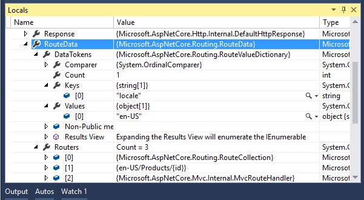

# Routing in ASP.NET Core

By [Ryan Nowak](https://github.com/rynowak), [Kirk Larkin](https://twitter.com/serpent5), and [Rick Anderson](https://twitter.com/RickAndMSFT)

::: moniker range=">= aspnetcore-3.0"

Routing is responsible for matching incoming HTTP requests and dispatching those requests to the app's executable endpoints. [Endpoints](#endpoint) are the app's units of executable request-handling code. Endpoints are defined in the app and configured when the app starts. The endpoint matching process can extract values from the request's URL and provide those values for request processing. Using endpoint information from the app, routing is also able to generate URLs that map to endpoints.

Apps can configure routing using:

- Controllers
- Razor Pages
- SignalR
- gRPC Services
- Endpoint-enabled [middleware](xref:fundamentals/middleware/index) such as [Health Checks](xref:host-and-deploy/health-checks).
- Delegates and lambdas registered with routing.

This document covers low-level details of ASP.NET Core routing. For information on configuring routing:

* For controllers, see <xref:mvc/controllers/routing>.
* For Razor Pages conventions, see <xref:razor-pages/razor-pages-conventions>.

The endpoint routing system described in this document applies to ASP.NET Core 3.0 and later. For information on the previous routing system based on <xref:Microsoft.AspNetCore.Routing.IRouter>, select the ASP.NET Core 2.1 version using one of the following approaches:

* The version selector for a previous version.
* Select [ASP.NET Core 2.1 routing](https://docs.microsoft.com/aspnet/core/fundamentals/routing?view=aspnetcore-2.1).

[View or download sample code](https://github.com/aspnet/AspNetCore.Docs/tree/master/aspnetcore/fundamentals/routing/samples/3.x) ([how to download](xref:index#how-to-download-a-sample))

The download samples for this document are enabled by a specific `Startup` class. To run a specific sample, modify *Program.cs* to call the desired `Startup` class.

## Routing basics

All ASP.NET Core templates include routing in the generated code. Routing is registered in the [middleware](xref:fundamentals/middleware/index) pipeline in `Startup.Configure`.

The following code shows a basic example of routing:

[!code-csharp[](routing/samples/3.x/RoutingSample/Startup.cs?name=snippet&highlight=8,10)]

Routing uses a pair of middleware, registered by <xref:Microsoft.AspNetCore.Builder.EndpointRoutingApplicationBuilderExtensions.UseRouting*> and <xref:Microsoft.AspNetCore.Builder.EndpointRoutingApplicationBuilderExtensions.UseEndpoints*>:

* `UseRouting` adds route matching to the middleware pipeline. This middleware looks at the set of endpoints defined in the app, and selects the [best match](#urlm) based on the request.
* `UseEndpoints` adds endpoint execution to the middleware pipeline. It runs the delegate associated with the selected endpoint.

The preceding example includes a single *route to code* endpoint using the [MapGet](xref:Microsoft.AspNetCore.Builder.EndpointRouteBuilderExtensions.MapGet*) method:

* When an HTTP `GET` request is sent to the root URL `/`:
  * The request delegate shown executes.
  * `Hello World!` is written to the HTTP response. By default, the root URL `/` is `https://localhost:5001/`.
* If the request method is not `GET` or the root URL is not `/`, no route matches and an HTTP 404 is returned.

### Endpoint

<a name="endpoint"></a>

The `MapGet` method is used to define an **endpoint**. An endpoint is something that can be:

* Selected, by matching the URL and HTTP method.
* Executed, by running the delegate.

Endpoints that can be matched and executed by the app are configured in `UseEndpoints`. For example, <xref:Microsoft.AspNetCore.Builder.EndpointRouteBuilderExtensions.MapGet*>, <xref:Microsoft.AspNetCore.Builder.EndpointRouteBuilderExtensions.MapPost*>, and [similar methods](xref:Microsoft.AspNetCore.Builder.EndpointRouteBuilderExtensions) connect request delegates to the routing system.
Additional methods can be used to connect ASP.NET Core framework features to the routing system:
- [MapRazorPages for Razor Pages](xref:Microsoft.AspNetCore.Builder.RazorPagesEndpointRouteBuilderExtensions.MapRazorPages*)
- [MapControllers for controllers](xref:Microsoft.AspNetCore.Builder.ControllerEndpointRouteBuilderExtensions.MapControllers*)
- [MapHub\<THub> for SignalR](xref:Microsoft.AspNetCore.SignalR.HubRouteBuilder.MapHub*) 
- [MapGrpcService\<TService> for gRPC](xref:grpc/aspnetcore)

The following example shows routing with a more sophisticated route template:

[!code-csharp[](routing/samples/3.x/RoutingSample/RouteTemplateStartup.cs?name=snippet)]

The string `/hello/{name:alpha}` is a **route template**. It is used to configure how the endpoint is matched. In this case, the template matches:

* A URL like `/hello/Ryan`
* Any URL path that begins with `/hello/` followed by a sequence of alphabetic characters.  `:alpha` applies a route constraint that matches only alphabetic characters. [Route constraints](#route-constraint-reference) are explained later in this document.

The second segment of the URL path, `{name:alpha}`:

* Is bound to the `name` parameter.
* Is captured and stored in [HttpRequest.RouteValues](xref:Microsoft.AspNetCore.Http.HttpRequest.RouteValues*).

The endpoint routing system described in this document is new as of ASP.NET Core 3.0. However, all versions of ASP.NET Core support the same set of route template features and route constraints.

The following example shows routing with [health checks](xref:host-and-deploy/health-checks) and authorization:

[!code-csharp[](routing/samples/3.x/RoutingSample/AuthorizationStartup.cs?name=snippet)]

[!INCLUDE[request localized comments](~/includes/code-comments-loc.md)]

The preceding example demonstrates how:

* The authorization middleware can be used with routing.
* Endpoints can be used to configure authorization behavior.

The <xref:Microsoft.AspNetCore.Builder.HealthCheckEndpointRouteBuilderExtensions.MapHealthChecks*> call adds a health check endpoint. Chaining <xref:Microsoft.AspNetCore.Builder.AuthorizationEndpointConventionBuilderExtensions.RequireAuthorization*> on to this call attaches an authorization policy to the endpoint.

Calling <xref:Microsoft.AspNetCore.Builder.AuthAppBuilderExtensions.UseAuthentication*> and <xref:Microsoft.AspNetCore.Builder.AuthorizationAppBuilderExtensions.UseAuthorization*> adds the authentication and authorization middleware. These middleware are placed between <xref:Microsoft.AspNetCore.Builder.EndpointRoutingApplicationBuilderExtensions.UseRouting*> and `UseEndpoints` so that they can:

* See which endpoint was selected by `UseRouting`.
* Apply an authorization policy before <xref:Microsoft.AspNetCore.Builder.EndpointRoutingApplicationBuilderExtensions.UseEndpoints*> dispatches to the endpoint.

<a name="metadata"></a>

### Endpoint metadata

In the preceding example, there are two endpoints, but only the health check endpoint has an authorization policy attached. If the request matches the health check endpoint, `/healthz`, an authorization check is performed. This demonstrates that endpoints can have extra data attached to them. This extra data is called endpoint **metadata**:

* The metadata can be processed by routing-aware middleware.
* The metadata can be of any .NET type.

## Routing concepts

The routing system builds on top of the middleware pipeline by adding the powerful **endpoint** concept. Endpoints represent units of the app's functionality that are distinct from each other in terms of routing, authorization, and any number of ASP.NET Core's systems.

<a name="endpoint"></a>

### ASP.NET Core endpoint definition

An ASP.NET Core endpoint is:

* Executable: Has a <xref:Microsoft.AspNetCore.Http.Endpoint.RequestDelegate>.
* Extensible: Has a [Metadata](xref:Microsoft.AspNetCore.Http.Endpoint.Metadata*) collection.
* Selectable: Optionally, has [routing information](xref:Microsoft.AspNetCore.Routing.RouteEndpoint.RoutePattern*).
* Enumerable: The collection of endpoints can be listed by retrieving the <xref:Microsoft.AspNetCore.Routing.EndpointDataSource> from [DI](xref:fundamentals/dependency-injection).

The following code shows how to retrieve and inspect the endpoint matching the current request:

[!code-csharp[](routing/samples/3.x/RoutingSample/EndpointInspectorStartup.cs?name=snippet)]

The endpoint, if selected, can be retrieved from the `HttpContext`. Its properties can be inspected. Endpoint objects are immutable and cannot be modified after creation. The most common type of endpoint is a <xref:Microsoft.AspNetCore.Routing.RouteEndpoint>. `RouteEndpoint` includes information that allows it to be to selected by the routing system.

In the preceding code, [app.Use](xref:Microsoft.AspNetCore.Builder.UseExtensions.Use*) configures an in-line [middleware](xref:fundamentals/middleware/index).

<a name="mt"></a>

The following code shows that, depending on where `app.Use` is called in the pipeline, there may not be an endpoint:

[!code-csharp[](routing/samples/3.x/RoutingSample/MiddlewareFlowStartup.cs?name=snippet)]

This preceding sample adds `Console.WriteLine` statements that display whether or not an endpoint has been selected. For clarity, the sample assigns a display name to the provided `/` endpoint.

Running this code with a URL of `/` displays:

```txt
1. Endpoint: (null)
2. Endpoint: Hello
3. Endpoint: Hello
```

Running this code with any other URL displays:

```txt
1. Endpoint: (null)
2. Endpoint: (null)
4. Endpoint: (null)
```

This output demonstrates that:

* The endpoint is always null before `UseRouting` is called.
* If a match is found, the endpoint is non-null between `UseRouting` and <xref:Microsoft.AspNetCore.Builder.EndpointRoutingApplicationBuilderExtensions.UseEndpoints*>.
* The `UseEndpoints` middleware is **terminal** when a match is found. [Terminal middleware](#tm) is defined later in this document.
* The middleware after `UseEndpoints` execute only when no match is found.

The `UseRouting` middleware uses the [SetEndpoint](xref:Microsoft.AspNetCore.Http.EndpointHttpContextExtensions.SetEndpoint*) method to attach the endpoint to the current context. It's possible to replace the `UseRouting` middleware with custom logic and still get the benefits of using endpoints. Endpoints are a low-level primitive like middleware, and aren't coupled to the routing implementation. Most apps don't need to replace `UseRouting` with custom logic.

The `UseEndpoints` middleware is designed to be used in tandem with the `UseRouting` middleware. The core logic to execute an endpoint isn't complicated. Use <xref:Microsoft.AspNetCore.Http.EndpointHttpContextExtensions.GetEndpoint*> to retrieve the endpoint, and then invoke its <xref:Microsoft.AspNetCore.Http.Endpoint.RequestDelegate> property.

The following code demonstrates how middleware can influence or react to routing:

[!code-csharp[](routing/samples/3.x/RoutingSample/IntegratedMiddlewareStartup.cs?name=snippet)]

The preceding example demonstrates two important concepts:

* Middleware can run before `UseRouting` to modify the data that routing operates upon.
    * Usually middleware that appears before routing modifies some property of the request, such as <xref:Microsoft.AspNetCore.Builder.RewriteBuilderExtensions.UseRewriter*>, <xref:Microsoft.AspNetCore.Builder.HttpMethodOverrideExtensions.UseHttpMethodOverride*>, or <xref:Microsoft.AspNetCore.Builder.UsePathBaseExtensions.UsePathBase*>.
* Middleware can run between `UseRouting` and <xref:Microsoft.AspNetCore.Builder.EndpointRoutingApplicationBuilderExtensions.UseEndpoints*> to process the results of routing before the endpoint is executed.
    * Middleware that runs between `UseRouting` and `UseEndpoints`:
      * Usually inspects metadata to understand the endpoints.
      * Often makes security decisions, as done by `UseAuthorization` and `UseCors`.
    * The combination of middleware and metadata allows configuring policies per-endpoint.

The preceding code shows an example of a custom middleware that supports per-endpoint policies. The middleware writes an *audit log* of access to sensitive data to the console. The middleware can be configured to *audit* an endpoint with the `AuditPolicyAttribute` metadata. This sample demonstrates an *opt-in* pattern where only endpoints that are marked as sensitive are audited. It's possible to define this logic in reverse, auditing everything that isn't marked as safe, for example. The endpoint metadata system is flexible. This logic could be designed in whatever way suits the use case.

The preceding sample code is intended to demonstrate the basic concepts of endpoints. **The sample is not intended for production use**. A more complete version of an *audit log* middleware would:

* Log to a file or database.
* Include details such as the user, IP address, name of the sensitive endpoint, and more.

The audit policy metadata `AuditPolicyAttribute` is defined as an `Attribute` for easier use with class-based frameworks such as controllers and SignalR. When using *route to code*:

* Metadata is attached with a builder API.
* Class-based frameworks include all attributes on the corresponding method and class when creating endpoints.

The best practices for metadata types are to define them either as interfaces or attributes. Interfaces and attributes allow code reuse. The metadata system is flexible and doesn't impose any limitations.

<a name="tm"></a>

### Comparing a terminal middleware and routing

The following code sample contrasts using middleware with using routing:

[!code-csharp[](routing/samples/3.x/RoutingSample/TerminalMiddlewareStartup.cs?name=snippet)]

The style of middleware shown with `Approach 1:` is **terminal middleware**. It's called terminal middleware because it does a matching operation:

* The matching operation in the preceding sample is `Path == "/"` for the middleware and `Path == "/Movie"` for routing.
* When a match is successful, it executes some functionality and returns, rather than invoking the `next` middleware.

It's called terminal middleware because it terminates the search, executes some functionality, and then returns.

Comparing a terminal middleware and routing:
* Both approaches allow terminating the processing pipeline:
    * Middleware terminates the pipeline by returning rather than invoking `next`.
    * Endpoints are always terminal.
* Terminal middleware allows positioning the middleware at an arbitrary place in the pipeline:
    * Endpoints execute at the position of <xref:Microsoft.AspNetCore.Builder.EndpointRoutingApplicationBuilderExtensions.UseEndpoints*>.
* Terminal middleware allows arbitrary code to determine when the middleware matches:
    * Custom route matching code can be verbose and difficult to write correctly.
    * Routing provides straightforward solutions for typical apps. Most apps don't require custom route matching code.
* Endpoints interface with middleware such as `UseAuthorization` and `UseCors`.
    * Using a terminal middleware with `UseAuthorization` or `UseCors` requires manual interfacing with the authorization system.

An [endpoint](#endpoint) defines both:

* A delegate to process requests.
* A collection of arbitrary metadata. The metadata is used to implement cross-cutting concerns based on policies and configuration attached to each endpoint.

Terminal middleware can be an effective tool, but can require:

* A significant amount of coding and testing.
* Manual integration with other systems to achieve the desired level of flexibility.

Consider integrating with routing before writing a terminal middleware.

Existing terminal middleware that integrates with [Map](xref:fundamentals/middleware/index#branch-the-middleware-pipeline) or <xref:Microsoft.AspNetCore.Builder.MapWhenExtensions.MapWhen*> can usually be turned into a routing aware endpoint. [MapHealthChecks](https://github.com/aspnet/AspNetCore/blob/master/src/Middleware/HealthChecks/src/Builder/HealthCheckEndpointRouteBuilderExtensions.cs#L16) demonstrates the pattern for router-ware:
* Write an extension method on <xref:Microsoft.AspNetCore.Routing.IEndpointRouteBuilder>.
* Create a nested middleware pipeline using <xref:Microsoft.AspNetCore.Routing.IEndpointRouteBuilder.CreateApplicationBuilder*>.
* Attach the middleware to the new pipeline. In this case, <xref:Microsoft.AspNetCore.Builder.HealthCheckApplicationBuilderExtensions.UseHealthChecks*>.
* <xref:Microsoft.AspNetCore.Builder.IApplicationBuilder.Build*> the middleware pipeline into a <xref:Microsoft.AspNetCore.Http.RequestDelegate>.
* Call `Map` and provide the new middleware pipeline.
* Return the builder object provided by `Map` from the extension method.

The following code shows use of [MapHealthChecks](xref:host-and-deploy/health-checks):

[!code-csharp[](routing/samples/3.x/RoutingSample/AuthorizationStartup.cs?name=snippet)]

The preceding sample shows why returning the builder object is important. Returning the builder object allows the app developer to configure policies such as authorization for the endpoint. In this example, the health checks middleware has no direct integration with the authorization system.

The metadata system was created in response to the problems encountered by extensibility authors using terminal middleware. It's problematic for each middleware to implement its own integration with the authorization system.

<a name="urlm"></a>

### URL matching

* Is the process by which routing matches an incoming request to an [endpoint](#endpoint).
* Is based on data in the URL path and headers.
* Can be extended to consider any data in the request.

When a routing middleware executes, it sets an `Endpoint` and route values to a [request feature](xref:fundamentals/request-features) on the <xref:Microsoft.AspNetCore.Http.HttpContext> from the current request:

* Calling [HttpContext.GetEndpoint](<xref:Microsoft.AspNetCore.Http.EndpointHttpContextExtensions.GetEndpoint*>) gets the endpoint.
* `HttpRequest.RouteValues` gets the collection of route values.

[Middleware](xref:fundamentals/middleware/index) running after the routing middleware can inspect the endpoint and take action. For example, an authorization middleware can interrogate the endpoint's metadata collection for an authorization policy. After all of the middleware in the request processing pipeline is executed, the selected endpoint's delegate is invoked.

The routing system in endpoint routing is responsible for all dispatching decisions. Because the middleware applies policies based on the selected endpoint, it's important that:

* Any decision that can affect dispatching or the application of security policies is made inside the routing system.

> [!WARNING]
> For backwards-compatibility, when a Controller or Razor Pages endpoint delegate is executed, the properties of [RouteContext.RouteData](xref:Microsoft.AspNetCore.Routing.RouteContext.RouteData) are set to appropriate values based on the request processing performed thus far.
>
> The `RouteContext` type will be marked obsolete in a future release:
>
> * Migrate `RouteData.Values` to `HttpRequest.RouteValues`.
> * Migrate `RouteData.DataTokens` to retrieve [IDataTokensMetadata](xref:Microsoft.AspNetCore.Routing.IDataTokensMetadata) from the endpoint metadata.

URL matching operates in a configurable set of phases. In each phase, the output is a set of matches. The set of matches can be narrowed down further by the next phase. The routing implementation does not guarantee a processing order for matching endpoints. **All** possible matches are processed at once. The URL matching phases occur in the following order. ASP.NET Core:

1. Processes the URL path against the set of endpoints and their route templates, collecting **all** of the matches.
1. Takes the preceding list and removes matches that fail with route constraints applied.
1. Takes the preceding list and removes matches that fail the set of [MatcherPolicy](xref:Microsoft.AspNetCore.Routing.MatcherPolicy) instances.
1. Uses the [EndpointSelector](xref:Microsoft.AspNetCore.Routing.Matching.EndpointSelector) to make a final decision from the preceding list.

The list of endpoints is prioritized according to:

* The [RouteEndpoint.Order](xref:Microsoft.AspNetCore.Routing.RouteEndpoint.Order*)
* The [route template precedence](#rtp)

All matching endpoints are processed in each phase until the <xref:Microsoft.AspNetCore.Routing.Matching.EndpointSelector> is reached. The `EndpointSelector` is the final phase. It chooses the highest priority endpoint from the matches as the best match. If there are other matches with the same priority as the best match, an ambiguous match exception is thrown.

The route precedence is computed based on a **more specific** route template being given a higher priority. For example, consider the templates `/hello` and `/{message}`:

* Both match the URL path `/hello`.
* `/hello`  is more specific and therefore higher priority.

In general, route precedence does a good job of choosing the best match for the kinds of URL schemes used in practice. Use <xref:Microsoft.AspNetCore.Routing.RouteEndpoint.Order> only when necessary to avoid an ambiguity.

Due to the kinds of extensibility provided by routing, it isn't possible for the routing system to compute ahead of time the ambiguous routes. Consider an example such as the route templates `/{message:alpha}` and `/{message:int}`:

* The `alpha` constraint matches only alphabetic characters.
* The `int` constraint matches only numbers.
* These templates have the same route precedence, but there's no single URL they both match.
* If the routing system reported an ambiguity error at startup, it would block this valid use case.

> [!WARNING]
>
> The order of operations inside <xref:Microsoft.AspNetCore.Builder.EndpointRoutingApplicationBuilderExtensions.UseEndpoints*> doesn't influence the behavior of routing, with one exception. <xref:Microsoft.AspNetCore.Builder.ControllerEndpointRouteBuilderExtensions.MapControllerRoute*> and <xref:Microsoft.AspNetCore.Builder.MvcAreaRouteBuilderExtensions.MapAreaRoute*> automatically assign an order value to their endpoints based on the order they are invoked. This simulates long-time behavior of controllers without the routing system providing the same guarantees as older routing implementations.
>
> In the legacy implementation of routing, it's possible to implement routing extensibility that has a dependency on the order in which routes are processed. Endpoint routing in ASP.NET Core 3.0 and later:
> 
> * Doesn't have a concept of routes.
> * Doesn't provide ordering guarantees. All endpoints are processed at once.
>
> If this means you're stuck using the legacy routing system, [open a GitHub issue for assistance](https://github.com/dotnet/aspnetcore/issues).

<a name="rtp"></a>

### Route template precedence and endpoint selection order

[Route template precedence](https://github.com/dotnet/aspnetcore/blob/master/src/Http/Routing/src/Template/RoutePrecedence.cs#L16) is a system that assigns each route template a value based on how specific it is. Route template precedence:

* Avoids the need to adjust the order of endpoints in common cases.
* Attempts to match the common-sense expectations of routing behavior.

For example, consider templates `/Products/List` and `/Products/{id}`. It would be reasonable to assume that `/Products/List` is a better match than `/Products/{id}` for the URL path `/Products/List`. The works because the literal segment `/List` is considered to have better precedence than the parameter segment `/{id}`.

The details of how precedence works are coupled to how route templates are defined:

* Templates with more segments are considered more specific.
* A segment with literal text is considered more specific than a parameter segment.
* A parameter segment with a constraint is considered more specific than one without.
* A complex segment is considered as specific as a parameter segment with a constraint.
* Catch-all parameters are the least specific. See **catch-all** in the [Route template reference](#rtr) for important information on catch-all routes.

See the [source code on GitHub](https://github.com/dotnet/aspnetcore/blob/master/src/Http/Routing/src/Template/RoutePrecedence.cs#L189) for a reference of exact values.

<a name="lg"></a>

### URL generation concepts

URL generation:

* Is the process by which routing can create a URL path based on a set of route values.
* Allows for a logical separation between endpoints and the URLs that access them.

Endpoint routing includes the <xref:Microsoft.AspNetCore.Routing.LinkGenerator> API. `LinkGenerator` is a singleton service available from [DI](xref:fundamentals/dependency-injection). The `LinkGenerator` API can be used outside of the context of an executing request. [Mvc.IUrlHelper](xref:Microsoft.AspNetCore.Mvc.IUrlHelper) and scenarios that rely on <xref:Microsoft.AspNetCore.Mvc.IUrlHelper>, such as [Tag Helpers](xref:mvc/views/tag-helpers/intro), HTML Helpers, and [Action Results](xref:mvc/controllers/actions), use the `LinkGenerator` API internally to provide link generating capabilities.

The link generator is backed by the concept of an **address** and **address schemes**. An address scheme is a way of determining the endpoints that should be considered for link generation. For example, the route name and route values scenarios many users are familiar with from controllers and Razor Pages are implemented as an address scheme.

The link generator can link to controllers and Razor Pages via the following extension methods:

* <xref:Microsoft.AspNetCore.Routing.ControllerLinkGeneratorExtensions.GetPathByAction*>
* <xref:Microsoft.AspNetCore.Routing.ControllerLinkGeneratorExtensions.GetUriByAction*>
* <xref:Microsoft.AspNetCore.Routing.PageLinkGeneratorExtensions.GetPathByPage*>
* <xref:Microsoft.AspNetCore.Routing.PageLinkGeneratorExtensions.GetUriByPage*>

Overloads of these methods accept arguments that include the `HttpContext`. These methods are functionally equivalent to [Url.Action](xref:System.Web.Mvc.UrlHelper.Action*) and [Url.Page](xref:Microsoft.AspNetCore.Mvc.UrlHelperExtensions.Page*), but offer additional flexibility and options.

The `GetPath*` methods are most similar to `Url.Action` and `Url.Page`, in that they generate a URI containing an absolute path. The `GetUri*` methods always generate an absolute URI containing a scheme and host. The methods that accept an `HttpContext` generate a URI in the context of the executing request. The [ambient](#ambient) route values, URL base path, scheme, and host from the executing request are used unless overridden.

<xref:Microsoft.AspNetCore.Routing.LinkGenerator> is called with an address. Generating a URI occurs in two steps:

1. An address is bound to a list of endpoints that match the address.
1. Each endpoint's <xref:Microsoft.AspNetCore.Routing.RouteEndpoint.RoutePattern> is evaluated until a route pattern that matches the supplied values is found. The resulting output is combined with the other URI parts supplied to the link generator and returned.

The methods provided by <xref:Microsoft.AspNetCore.Routing.LinkGenerator> support standard link generation capabilities for any type of address. The most convenient way to use the link generator is through extension methods that perform operations for a specific address type:

| Extension Method | Description |
| ---------------- | ----------- |
| <xref:Microsoft.AspNetCore.Routing.LinkGenerator.GetPathByAddress*> | Generates a URI with an absolute path based on the provided values. |
| <xref:Microsoft.AspNetCore.Routing.LinkGenerator.GetUriByAddress*> | Generates an absolute URI based on the provided values.             |

> [!WARNING]
> Pay attention to the following implications of calling <xref:Microsoft.AspNetCore.Routing.LinkGenerator> methods:
>
> * Use `GetUri*` extension methods with caution in an app configuration that doesn't validate the `Host` header of incoming requests. If the `Host` header of incoming requests isn't validated, untrusted request input can be sent back to the client in URIs in a view or page. We recommend that all production apps configure their server to validate the `Host` header against known valid values.
>
> * Use <xref:Microsoft.AspNetCore.Routing.LinkGenerator> with caution in middleware in combination with `Map` or `MapWhen`. `Map*` changes the base path of the executing request, which affects the output of link generation. All of the <xref:Microsoft.AspNetCore.Routing.LinkGenerator> APIs allow specifying a base path. Specify an empty base path to undo the `Map*` affect on link generation.

### Middleware example

In the following example, a middleware uses the <xref:Microsoft.AspNetCore.Routing.LinkGenerator> API to create a link to an action method that lists store products. Using the link generator by injecting it into a class and calling `GenerateLink` is available to any class in an app:

[!code-csharp[](routing/samples/3.x/RoutingSample/Middleware/ProductsLinkMiddleware.cs?name=snippet)]

<a name="rtr"></a>

## Route template reference

Tokens within `{}` define route parameters that are bound if the route is matched. More than one route parameter can be defined in a route segment, but route parameters  must be separated by a literal value. For example, `{controller=Home}{action=Index}` isn't a valid route, since there's no literal value between `{controller}` and `{action}`.  Route parameters must have a name and may have additional attributes specified.

Literal text other than route parameters (for example, `{id}`) and the path separator `/` must match the text in the URL. Text matching is case-insensitive and based on the decoded representation of the URL's path. To match a literal route parameter delimiter `{` or `}`, escape the delimiter by repeating the character. For example `{{` or `}}`.

Asterisk `*` or double asterisk `**`:

* Can be used as a prefix to a route parameter to bind to the rest of the URI.
* Are called a **catch-all** parameters. For example, `blog/{**slug}`:
  * Matches any URI that starts with `/blog` and has any value following it.
  * The value following `/blog` is assigned to the [slug](https://developer.mozilla.org/docs/Glossary/Slug) route value.

[!INCLUDE[](~/includes/catchall.md)]

Catch-all parameters can also match the empty string.

The catch-all parameter escapes the appropriate characters when the route is used to generate a URL, including path separator `/` characters. For example, the route `foo/{*path}` with route values `{ path = "my/path" }` generates `foo/my%2Fpath`. Note the escaped forward slash. To round-trip path separator characters, use the `**` route parameter prefix. The route `foo/{**path}` with `{ path = "my/path" }` generates `foo/my/path`.

URL patterns that attempt to capture a file name with an optional file extension have additional considerations. For example, consider the template `files/{filename}.{ext?}`. When values for both `filename` and `ext` exist, both values are populated. If only a value for `filename` exists in the URL, the route matches because the trailing `.` is  optional. The following URLs match this route:

* `/files/myFile.txt`
* `/files/myFile`

Route parameters may have **default values** designated by specifying the default value after the parameter name separated by an equals sign (`=`). For example, `{controller=Home}` defines `Home` as the default value for `controller`. The default value is used if no value is present in the URL for the parameter. Route parameters are made optional by appending a question mark (`?`) to the end of the parameter name. For example, `id?`. The difference between optional values and default route parameters is:

* A route parameter with a default value always produces a value.
* An optional parameter has a value only when a value is provided by the request URL.

Route parameters may have constraints that must match the route value bound from the URL. Adding `:` and constraint name after the route parameter name specifies an inline constraint on a route parameter. If the constraint requires arguments, they're enclosed in parentheses `(...)` after the constraint name. Multiple *inline constraints* can be specified by appending another `:` and constraint name.

The constraint name and arguments are passed to the <xref:Microsoft.AspNetCore.Routing.IInlineConstraintResolver> service to create an instance of <xref:Microsoft.AspNetCore.Routing.IRouteConstraint> to use in URL processing. For example, the route template `blog/{article:minlength(10)}` specifies a `minlength` constraint with the argument `10`. For more information on route constraints and a list of the constraints provided by the framework, see the [Route constraint reference](#route-constraint-reference) section.

Route parameters may also have parameter transformers. Parameter transformers transform a parameter's value when generating links and matching actions and pages to URLs. Like constraints, parameter transformers can be added inline to a route parameter by adding a `:` and transformer name after the route parameter name. For example, the route template `blog/{article:slugify}` specifies a `slugify` transformer. For more information on parameter transformers, see the [Parameter transformer reference](#parameter-transformer-reference) section.

The following table demonstrates example route templates and their behavior:

| Route Template                           | Example Matching URI    | The request URI&hellip;                                                    |
| ---------------------------------------- | ----------------------- | -------------------------------------------------------------------------- |
| `hello`                                  | `/hello`                | Only matches the single path `/hello`.                                     |
| `{Page=Home}`                            | `/`                     | Matches and sets `Page` to `Home`.                                         |
| `{Page=Home}`                            | `/Contact`              | Matches and sets `Page` to `Contact`.                                      |
| `{controller}/{action}/{id?}`            | `/Products/List`        | Maps to the `Products` controller and `List` action.                       |
| `{controller}/{action}/{id?}`            | `/Products/Details/123` | Maps to the `Products` controller and  `Details` action with`id` set to 123. |
| `{controller=Home}/{action=Index}/{id?}` | `/`                     | Maps to the `Home` controller and `Index` method. `id` is ignored.        |
| `{controller=Home}/{action=Index}/{id?}` | `/Products`         | Maps to the `Products` controller and `Index` method. `id` is ignored.        |

Using a template is generally the simplest approach to routing. Constraints and defaults can also be specified outside the route template.

### Complex segments

Complex segments are processed by matching up literal delimiters from right to left in a [non-greedy](#greedy) way. For example, `[Route("/a{b}c{d}")]` is a complex segment.
Complex segments work in a particular way that must be understood to use them successfully. The example in this section demonstrates why complex segments only really work well when the delimiter text doesn't appear inside the parameter values. Using a [regex](/dotnet/standard/base-types/regular-expressions) and then manually extracting the values is needed for more complex cases.

[!INCLUDE[](~/includes/regex.md)]

This is a summary of the steps that routing performs with the template `/a{b}c{d}` and the URL path `/abcd`. The `|` is used to help visualize how the algorithm works:

* The first literal, right to left, is `c`. So `/abcd` is searched from right and finds `/ab|c|d`.
* Everything to the right (`d`) is now matched to the route parameter `{d}`.
* The next literal, right to left, is `a`. So `/ab|c|d` is searched starting where we left off, then `a` is found `/|a|b|c|d`.
* The value to the right (`b`) is now matched to the route parameter `{b}`.
* There is no remaining text and no remaining route template, so this is a match.

Here's an example of a negative case using the same template `/a{b}c{d}` and the URL path `/aabcd`. The `|` is used to help visualize how the algorithm works. This case isn't a match, which is explained by the same algorithm:
* The first literal, right to left, is `c`. So `/aabcd` is searched from right and finds `/aab|c|d`.
* Everything to the right (`d`) is now matched to the route parameter `{d}`.
* The next literal, right to left, is `a`. So `/aab|c|d` is searched starting where we left off, then `a` is found `/a|a|b|c|d`.
* The value to the right (`b`) is now matched to the route parameter `{b}`.
* At this point there is remaining text `a`, but the algorithm has run out of route template to parse, so this is not a match.

Since the matching algorithm is [non-greedy](#greedy):

* It matches the smallest amount of text possible in each step.
* Any case where the delimiter value appears inside the parameter values results in not matching.

Regular expressions provide much more control over their matching behavior.

<a name="greedy"></a>

Greedy matching, also know as [lazy matching](https://wikipedia.org/wiki/Regular_expression#Lazy_matching), matches the largest possible string. Non-greedy matches the smallest possible string.

## Route constraint reference

Route constraints execute when a match has occurred to the incoming URL and the URL path is tokenized into route values. Route constraints generally inspect the route value associated via the route template and make a true or false decision about whether the value is acceptable. Some route constraints use data outside the route value to consider whether the request can be routed. For example, the <xref:Microsoft.AspNetCore.Routing.Constraints.HttpMethodRouteConstraint> can accept or reject a request based on its HTTP verb. Constraints are used in routing requests and link generation.

> [!WARNING]
> Don't use constraints for input validation. If constraints are used for input validation, invalid input results in a `404` Not Found response. Invalid input should produce a `400` Bad Request with an appropriate error message. Route constraints are used to disambiguate similar routes, not to validate the inputs for a particular route.

The following table demonstrates example route constraints and their expected behavior:

| constraint | Example | Example Matches | Notes |
| ---------- | ------- | --------------- | ----- |
| `int` | `{id:int}` | `123456789`, `-123456789` | Matches any integer |
| `bool` | `{active:bool}` | `true`, `FALSE` | Matches `true` or `false`. Case-insensitive |
| `datetime` | `{dob:datetime}` | `2016-12-31`, `2016-12-31 7:32pm` | Matches a valid `DateTime` value in the invariant culture. See preceding warning. |
| `decimal` | `{price:decimal}` | `49.99`, `-1,000.01` | Matches a valid `decimal` value in the invariant culture. See preceding warning.|
| `double` | `{weight:double}` | `1.234`, `-1,001.01e8` | Matches a valid `double` value in the invariant culture. See preceding warning.|
| `float` | `{weight:float}` | `1.234`, `-1,001.01e8` | Matches a valid `float` value in the invariant culture. See preceding warning.|
| `guid` | `{id:guid}` | `CD2C1638-1638-72D5-1638-DEADBEEF1638` | Matches a valid `Guid` value |
| `long` | `{ticks:long}` | `123456789`, `-123456789` | Matches a valid `long` value |
| `minlength(value)` | `{username:minlength(4)}` | `Rick` | String must be at least 4 characters |
| `maxlength(value)` | `{filename:maxlength(8)}` | `MyFile` | String must be no more than 8 characters |
| `length(length)` | `{filename:length(12)}` | `somefile.txt` | String must be exactly 12 characters long |
| `length(min,max)` | `{filename:length(8,16)}` | `somefile.txt` | String must be at least 8 and no more than 16 characters long |
| `min(value)` | `{age:min(18)}` | `19` | Integer value must be at least 18 |
| `max(value)` | `{age:max(120)}` | `91` | Integer value must be no more than 120 |
| `range(min,max)` | `{age:range(18,120)}` | `91` | Integer value must be at least 18 but no more than 120 |
| `alpha` | `{name:alpha}` | `Rick` | String must consist of one or more alphabetical characters, `a`-`z` and case-insensitive. |
| `regex(expression)` | `{ssn:regex(^\\d{{3}}-\\d{{2}}-\\d{{4}}$)}` | `123-45-6789` | String must match the regular expression. See tips about defining a regular expression. |
| `required` | `{name:required}` | `Rick` | Used to enforce that a non-parameter value is present during URL generation |

[!INCLUDE[](~/includes/regex.md)]

Multiple, colon delimited constraints can be applied to a single parameter. For example, the following constraint restricts a parameter to an integer value of 1 or greater:

```csharp
[Route("users/{id:int:min(1)}")]
public User GetUserById(int id) { }
```

> [!WARNING]
> Route constraints that verify the URL and are converted to a CLR type always use the invariant culture. For example, conversion to the CLR type `int` or `DateTime`. These constraints assume that the URL is not localizable. The framework-provided route constraints don't modify the values stored in route values. All route values parsed from the URL are stored as strings. For example, the `float` constraint attempts to convert the route value to a float, but the converted value is used only to verify it can be converted to a float.

### Regular expressions in constraints

[!INCLUDE[](~/includes/regex.md)]

Regular expressions can be specified as inline constraints using the `regex(...)` route constraint. Methods in the <xref:Microsoft.AspNetCore.Builder.ControllerEndpointRouteBuilderExtensions.MapControllerRoute*> family also accept an object literal of constraints. If that form is used, string values are interpreted as regular expressions.

The following code uses an inline regex constraint:

[!code-csharp[](routing/samples/3.x/RoutingSample/StartupRegex.cs?name=snippet)]

The following code uses an object literal to specify a regex constraint:

[!code-csharp[](routing/samples/3.x/RoutingSample/StartupRegex2.cs?name=snippet)]

The ASP.NET Core framework adds `RegexOptions.IgnoreCase | RegexOptions.Compiled | RegexOptions.CultureInvariant` to the regular expression constructor. See <xref:System.Text.RegularExpressions.RegexOptions> for a description of these members.

Regular expressions use delimiters and tokens similar to those used by routing and the C# language. Regular expression tokens must be escaped. To use the regular expression `^\d{3}-\d{2}-\d{4}$` in an inline constraint, use one of the following:

* Replace `\` characters provided in the string as `\\` characters in the C# source file in order to escape the `\` string escape character.
* [Verbatim string literals](/dotnet/csharp/language-reference/keywords/string).

To escape routing parameter delimiter characters `{`, `}`, `[`, `]`, double the characters in the expression, for example, `{{`, `}}`, `[[`, `]]`. The following table shows a regular expression and its escaped version:

| Regular expression    | Escaped regular expression     |
| --------------------- | ------------------------------ |
| `^\d{3}-\d{2}-\d{4}$` | `^\\d{{3}}-\\d{{2}}-\\d{{4}}$` |
| `^[a-z]{2}$`          | `^[[a-z]]{{2}}$`               |

Regular expressions used in routing often start with the `^` character and match the starting position of the string. The expressions often end with the `$` character and match the end of the string. The `^` and `$` characters ensure that the regular expression matches the entire route parameter value. Without the `^` and `$` characters, the regular expression matches any substring within the string, which is often undesirable. The following table provides examples and explains why they match or fail to match:

| Expression   | String    | Match | Comment               |
| ------------ | --------- | :---: |  -------------------- |
| `[a-z]{2}`   | hello     | Yes   | Substring matches     |
| `[a-z]{2}`   | 123abc456 | Yes   | Substring matches     |
| `[a-z]{2}`   | mz        | Yes   | Matches expression    |
| `[a-z]{2}`   | MZ        | Yes   | Not case sensitive    |
| `^[a-z]{2}$` | hello     | No    | See `^` and `$` above |
| `^[a-z]{2}$` | 123abc456 | No    | See `^` and `$` above |

For more information on regular expression syntax, see [.NET Framework Regular Expressions](/dotnet/standard/base-types/regular-expression-language-quick-reference).

To constrain a parameter to a known set of possible values, use a regular expression. For example, `{action:regex(^(list|get|create)$)}` only matches the `action` route value to `list`, `get`, or `create`. If passed into the constraints dictionary, the string `^(list|get|create)$` is equivalent. Constraints that are passed in the constraints dictionary that don't match one of the known constraints are also treated as regular expressions. Constraints that are passed  within a template that don't match one of the known constraints are not treated as regular expressions.

### Custom route constraints

Custom route constraints can be created by implementing the <xref:Microsoft.AspNetCore.Routing.IRouteConstraint> interface. The `IRouteConstraint` interface contains <xref:System.Web.Routing.IRouteConstraint.Match*>, which returns `true` if the constraint is satisfied and `false` otherwise.

Custom route constraints are rarely needed. Before implementing a custom route constraint, consider alternatives, such as model binding.

The ASP.NET Core [Constraints](https://github.com/dotnet/aspnetcore/tree/master/src/Http/Routing/src/Constraints) folder provides good examples of creating a constraints. For example, [GuidRouteConstraint](https://github.com/dotnet/aspnetcore/blob/master/src/Http/Routing/src/Constraints/GuidRouteConstraint.cs#L18).

To use a custom `IRouteConstraint`, the route constraint type must be registered with the app's <xref:Microsoft.AspNetCore.Routing.RouteOptions.ConstraintMap> in the service container. A `ConstraintMap` is a dictionary that maps route constraint keys to `IRouteConstraint` implementations that validate those constraints. An app's `ConstraintMap` can be updated in `Startup.ConfigureServices` either as part of a [services.AddRouting](xref:Microsoft.Extensions.DependencyInjection.RoutingServiceCollectionExtensions.AddRouting*) call or by configuring <xref:Microsoft.AspNetCore.Routing.RouteOptions> directly with `services.Configure<RouteOptions>`. For example:

[!code-csharp[](routing/samples/3.x/RoutingSample/StartupConstraint.cs?name=snippet)]

The preceding constraint is applied in the following code:

[!code-csharp[](routing/samples/3.x/RoutingSample/Controllers/TestController.cs?name=snippet&highlight=6,13)]

[!INCLUDE[](~/includes/MyDisplayRouteInfo.md)]

The implementation of `MyCustomConstraint` prevents `0` being applied to a route parameter:

[!code-csharp[](routing/samples/3.x/RoutingSample/StartupConstraint.cs?name=snippet2)]

[!INCLUDE[](~/includes/regex.md)]

The preceding code:

* Prevents `0` in the `{id}` segment of the route.
* Is shown to provide a basic example of implementing a custom constraint. It should not be used in a production app.

The following code is a better approach to preventing an `id` containing a `0` from being processed:

[!code-csharp[](routing/samples/3.x/RoutingSample/Controllers/TestController.cs?name=snippet2)]

The preceding code has the following advantages over the `MyCustomConstraint` approach:

* It doesn't require a custom constraint.
* It returns a more descriptive error when the route parameter includes `0`.

## Parameter transformer reference

Parameter transformers:

* Execute when generating a link using <xref:Microsoft.AspNetCore.Routing.LinkGenerator>.
* Implement <xref:Microsoft.AspNetCore.Routing.IOutboundParameterTransformer?displayProperty=fullName>.
* Are configured using <xref:Microsoft.AspNetCore.Routing.RouteOptions.ConstraintMap>.
* Take the parameter's route value and transform it to a new string value.
* Result in using the transformed value in the generated link.

For example, a custom `slugify` parameter transformer in route pattern `blog\{article:slugify}` with `Url.Action(new { article = "MyTestArticle" })` generates `blog\my-test-article`.

Consider the following `IOutboundParameterTransformer` implementation:

[!code-csharp[](routing/samples/3.x/RoutingSample/StartupConstraint2.cs?name=snippet2)]

To use a parameter transformer in a route pattern, configure it using <xref:Microsoft.AspNetCore.Routing.RouteOptions.ConstraintMap> in `Startup.ConfigureServices`:

[!code-csharp[](routing/samples/3.x/RoutingSample/StartupConstraint2.cs?name=snippet)]

The ASP.NET Core framework uses parameter transformers to transform the URI where an endpoint resolves. For example, parameter transformers transform the route values used to match an `area`, `controller`, `action`, and `page`.

```csharp
routes.MapControllerRoute(
    name: "default",
    template: "{controller:slugify=Home}/{action:slugify=Index}/{id?}");
```

With the preceding route template, the action `SubscriptionManagementController.GetAll` is matched with the URI `/subscription-management/get-all`. A parameter transformer doesn't change the route values used to generate a link. For example, `Url.Action("GetAll", "SubscriptionManagement")` outputs `/subscription-management/get-all`.

ASP.NET Core provides API conventions for using parameter transformers with generated routes:

* The <xref:Microsoft.AspNetCore.Mvc.ApplicationModels.RouteTokenTransformerConvention?displayProperty=fullName> MVC convention applies a specified parameter transformer to all attribute routes in the app. The parameter transformer transforms attribute route tokens as they are replaced. For more information, see [Use a parameter transformer to customize token replacement](xref:mvc/controllers/routing#use-a-parameter-transformer-to-customize-token-replacement).
* Razor Pages uses the <xref:Microsoft.AspNetCore.Mvc.ApplicationModels.PageRouteTransformerConvention> API convention. This convention applies a specified parameter transformer to all automatically discovered Razor Pages. The parameter transformer transforms the folder and file name segments of Razor Pages routes. For more information, see [Use a parameter transformer to customize page routes](xref:razor-pages/razor-pages-conventions#use-a-parameter-transformer-to-customize-page-routes).

<a name="ugr"></a>

## URL generation reference

This section contains a reference for the algorithm implemented by URL generation. In practice, most complex examples of URL generation use controllers or Razor Pages. See  [routing in controllers](xref:mvc/controllers/routing) for additional information.

The URL generation process begins with a call to [LinkGenerator.GetPathByAddress](xref:Microsoft.AspNetCore.Routing.LinkGenerator.GetPathByAddress*) or a similar method. The method is provided with an address, a set of route values, and optionally information about the current request from `HttpContext`.

The first step is to use the address to resolve a set of candidate endpoints using an [`IEndpointAddressScheme<TAddress>`](xref:Microsoft.AspNetCore.Routing.IEndpointAddressScheme`1) that matches the address's type.

Once of set of candidates is found by the address scheme, the endpoints are ordered and processed iteratively until a URL generation operation succeeds. URL generation does **not** check for ambiguities, the first result returned is the final result.

### Troubleshooting URL generation with logging

The first step in troubleshooting URL generation is setting the logging level of `Microsoft.AspNetCore.Routing` to `TRACE`. `LinkGenerator` logs many details about its processing which can be useful to troubleshoot problems.

See [URL generation reference](#ugr) for details on URL generation.

### Addresses

Addresses are the concept in URL generation used to bind a call into the link generator to a set of candidate endpoints.

Addresses are an extensible concept that come with two implementations by default:

* Using *endpoint name* (`string`) as the address:
    * Provides similar functionality to MVC's route name.
    * Uses the <xref:Microsoft.AspNetCore.Routing.IEndpointNameMetadata> metadata type.
    * Resolves the provided string against the metadata of all registered endpoints.
    * Throws an exception on startup if multiple endpoints use the same name.
    * Recommended for general-purpose use outside of controllers and Razor Pages.
* Using *route values* (<xref:Microsoft.AspNetCore.Routing.RouteValuesAddress>) as the address:
    * Provides similar functionality to controllers and Razor Pages legacy URL generation.
    * Very complex to extend and debug.
    * Provides the implementation used by `IUrlHelper`, Tag Helpers, HTML Helpers, Action Results, etc.

The role of the address scheme is to make the association between the address and matching endpoints by arbitrary criteria:

* The endpoint name scheme performs a basic dictionary lookup.
* The route values scheme has a complex best subset of set algorithm.

<a name="ambient"></a>

### Ambient values and explicit values

From the current request, routing accesses the route values of the current request `HttpContext.Request.RouteValues`. The values associated with the current request are referred to as the **ambient values**. For the purpose of clarity, the documentation refers to the route values passed in to methods as **explicit values**.

The following example shows ambient values and explicit values. It provides ambient values from the current request and explicit values: `{ id = 17, }`:

[!code-csharp[](routing/samples/3.x/RoutingSample/Controllers/WidgetController.cs?name=snippet)]

The preceding code:

* Returns `/Widget/Index/17`
* Gets <xref:Microsoft.AspNetCore.Routing.LinkGenerator> via [DI](xref:fundamentals/dependency-injection).

The following code provides no ambient values and explicit values: `{ controller = "Home", action = "Subscribe", id = 17, }`:

[!code-csharp[](routing/samples/3.x/RoutingSample/Controllers/WidgetController.cs?name=snippet2)]

The preceding  method returns `/Home/Subscribe/17`

The following code in the `WidgetController` returns `/Widget/Subscribe/17`:

[!code-csharp[](routing/samples/3.x/RoutingSample/Controllers/WidgetController.cs?name=snippet3)]

The following code provides the controller from ambient values in the current request and explicit values: `{ action = "Edit", id = 17, }`:

[!code-csharp[](routing/samples/3.x/RoutingSample/Controllers/GadgetController.cs?name=snippet)]

In the preceding code:

* `/Gadget/Edit/17` is returned.
* <xref:Microsoft.AspNetCore.Mvc.ControllerBase.Url> gets the <xref:Microsoft.AspNetCore.Mvc.IUrlHelper>.
* <xref:Microsoft.AspNetCore.Mvc.UrlHelperExtensions.Action*> 	
generates a URL with an absolute path for an action method. The URL contains the specified `action` name and `route` values.

The following code provides ambient values from the current request and explicit values: `{ page = "./Edit, id = 17, }`:

[!code-csharp[](routing/samples/3.x/RoutingSample/Pages/Index.cshtml.cs?name=snippet)]

The preceding code sets `url` to  `/Edit/17` when the Edit Razor Page contains the following page directive:

 `@page "{id:int}"`

If the Edit page doesn't contain the `"{id:int}"` route template, `url` is `/Edit?id=17`.

The behavior of MVC's <xref:Microsoft.AspNetCore.Mvc.IUrlHelper> adds a layer of complexity in addition to the rules described here:

* `IUrlHelper` always provides the route values from the current request as ambient values.
* [IUrlHelper.Action](xref:Microsoft.AspNetCore.Mvc.UrlHelperExtensions.Action*) always copies the current `action` and `controller` route values as explicit values unless overridden by the developer.
* [IUrlHelper.Page](xref:Microsoft.AspNetCore.Mvc.UrlHelperExtensions.Page*) always copies the current `page` route value as an explicit value unless overridden. <!--by the user-->
* `IUrlHelper.Page` always overrides the current `handler` route value with `null` as an explicit values unless overridden.

Users are often surprised by the behavioral details of ambient values, because MVC doesn't seem to follow its own rules. For historical and compatibility reasons, certain route values such as `action`, `controller`, `page`, and `handler` have their own special-case behavior.

The equivalent functionality provided by `LinkGenerator.GetPathByAction` and `LinkGenerator.GetPathByPage` duplicates these anomalies of `IUrlHelper` for compatibility.

### URL generation process

Once the set of candidate endpoints are found, the URL generation algorithm:

* Processes the endpoints iteratively.
* Returns the first successful result.

The first step in this process is called **route value invalidation**.  Route value invalidation is the process by which routing decides which route values from the ambient values should be used and which should be ignored. Each ambient value is considered and either combined with the explicit values, or ignored.

The best way to think about the role of ambient values is that they attempt to save application developers typing, in some common cases. Traditionally, the scenarios where ambient values are helpful are related to MVC:

* When linking to another action in the same controller, the controller name doesn't need to be specified.
* When linking to another controller in the same area, the area name doesn't need to be specified.
* When linking to the same action method, route values don't need to be specified.
* When linking to another part of the app, you don't want to carry over route values that have no meaning in that part of the app.

Calls to `LinkGenerator` or `IUrlHelper` that return `null` are usually caused by not understanding route value invalidation. Troubleshoot route value invalidation by explicitly specifying more of the route values to see if that solves the problem.

Route value invalidation works on the assumption that the app's URL scheme is hierarchical, with a hierarchy formed from left-to-right. Consider the basic controller route template `{controller}/{action}/{id?}` to get an intuitive sense of how this works in practice. A **change** to a value **invalidates** all of the route values that appear to the right. This reflects the assumption about hierarchy. If the app has an ambient value for `id`, and the operation specifies a different value for the `controller`:

* `id` won't be reused because `{controller}` is to the left of `{id?}`.

Some examples demonstrating this principle:

* If the explicit values contain a value for `id`, the ambient value for `id` is ignored. The ambient values for `controller` and `action` can be used.
* If the explicit values contain a value for `action`, any ambient value for `action` is ignored. The ambient values for `controller` can be used. If the explicit value for `action` is different from the ambient value for `action`, the `id` value won't be used.  If the explicit value for `action` is the same as the ambient value for `action`, the `id` value can be used.
* If the explicit values contain a value for `controller`, any ambient value for `controller` is ignored. If the explicit value for `controller` is different from the ambient value for `controller`, the `action` and `id` values won't be used. If the explicit value for `controller` is the same as the ambient value for `controller`, the `action` and `id` values can be used.

This process is further complicated by the existence of attribute routes and dedicated conventional routes. Controller conventional routes such as `{controller}/{action}/{id?}` specify a hierarchy using route parameters. For [dedicated conventional routes](xref:mvc/controllers/routing#dcr) and [attribute routes](xref:mvc/controllers/routing#ar) to controllers and Razor Pages:

* There is a hierarchy of route values.
* They don't appear in the template.

For these cases, URL generation defines the **required values** concept. Endpoints created by controllers and Razor Pages have required values specified that allow route value invalidation to work.

The route value invalidation algorithm in detail:

* The required value names are combined with the route parameters, then processed from left-to-right.
* For each parameter, the ambient value and explicit value are compared:
    * If the ambient value and explicit value are the same, the process continues.
    * If the ambient value is present and the explicit value isn't, the ambient value is used when generating the URL.
    * If the ambient value isn't present and the explicit value is, reject the ambient value and all subsequent ambient values.
    * If the ambient value and the explicit value are present, and the two values are different, reject the ambient value and all subsequent ambient values.

At this point, the URL generation operation is ready to evaluate route constraints. The set of accepted values is combined with the parameter default values, which is provided to constraints. If the constraints all pass, the operation continues.

Next, the **accepted values** can be used to expand the route template. The route template is processed:

* From left-to-right.
* Each parameter has its accepted value substituted.
* With the following special cases:
  * If the accepted values is missing a value and the parameter has a default value, the default value is used.
  * If the accepted values is missing a value and the parameter is optional, processing continues.
  * If any route parameter to the right of a missing optional parameter has a value, the operation fails.
  * <!-- review default-valued parameters optional parameters --> Contiguous default-valued parameters and optional parameters are collapsed where possible.

Values explicitly provided that don't match a segment of the route are added to the query string. The following table shows the result when using the route template `{controller}/{action}/{id?}`.

| Ambient Values                     | Explicit Values                        | Result                  |
| ---------------------------------- | -------------------------------------- | ----------------------- |
| controller = "Home"                | action = "About"                       | `/Home/About`           |
| controller = "Home"                | controller = "Order", action = "About" | `/Order/About`          |
| controller = "Home", color = "Red" | action = "About"                       | `/Home/About`           |
| controller = "Home"                | action = "About", color = "Red"        | `/Home/About?color=Red` |

### Problems with route value invalidation

As of ASP.NET Core 3.0, some URL generation schemes used in earlier ASP.NET Core versions don't work well with URL generation. The ASP.NET Core team plans to add features to address these needs in a future release. For now the best solution is to use legacy routing.

The following code shows an example of a URL generation scheme that's not supported by routing.

[!code-csharp[](routing/samples/3.x/RoutingSample/StartupUnsupported.cs?name=snippet)]

In the preceding code, the `culture` route parameter is used for localization. The desire is to have the `culture` parameter always accepted as an ambient value. However, the `culture` parameter is not accepted as an ambient value because of the way required values work:

* In the `"default"` route template, the `culture` route parameter is to the left of `controller`, so changes to `controller` won't invalidate `culture`.
* In the `"blog"` route template, the `culture` route parameter is considered to be to the right of `controller`, which appears in the required values.

## Configuring endpoint metadata

The following links provide information on configuring endpoint metadata:

* [Enable Cors with endpoint routing](xref:security/cors#enable-cors-with-endpoint-routing)
* [IAuthorizationPolicyProvider sample](https://github.com/dotnet/AspNetCore/tree/release/3.0/src/Security/samples/CustomPolicyProvider) using a custom `[MinimumAgeAuthorize]` attribute
* [Test authentication with the [Authorize] attribute](xref:security/authentication/identity#test-identity)
* <xref:Microsoft.AspNetCore.Builder.AuthorizationEndpointConventionBuilderExtensions.RequireAuthorization*>
* [Selecting the scheme with the [Authorize] attribute](xref:security/authorization/limitingidentitybyscheme#selecting-the-scheme-with-the-authorize-attribute)
* [Applying policies using the [Authorize] attribute](xref:security/authorization/policies#applying-policies-to-mvc-controllers)
* <xref:security/authorization/roles>

<a name="hostmatch"></a>

## Host matching in routes with RequireHost

<xref:Microsoft.AspNetCore.Builder.RoutingEndpointConventionBuilderExtensions.RequireHost*> applies a constraint to the route which requires the specified host. The `RequireHost` or [[Host]](xref:Microsoft.AspNetCore.Routing.HostAttribute) parameter can be:

* Host: `www.domain.com`, matches `www.domain.com` with any port.
* Host with wildcard: `*.domain.com`, matches `www.domain.com`, `subdomain.domain.com`, or `www.subdomain.domain.com` on any port.
* Port: `*:5000`, matches port 5000 with any host.
* Host and port: `www.domain.com:5000` or `*.domain.com:5000`, matches host and port.

Multiple parameters can be specified using `RequireHost` or `[Host]`. The constraint  matches hosts valid for any of the parameters. For example, `[Host("domain.com", "*.domain.com")]` matches `domain.com`, `www.domain.com`, and `subdomain.domain.com`.

The following code uses `RequireHost` to require the specified host on the route:

[!code-csharp[](routing/samples/3.x/RoutingSample/StartupRequireHost.cs?name=snippet)]

The following code uses the `[Host]` attribute on the controller to require any of the specified hosts:

[!code-csharp[](routing/samples/3.x/RoutingSample/Controllers/ProductController.cs?name=snippet)]

When the `[Host]` attribute is applied to both the controller and action method:

* The attribute on the action is used.
* The controller attribute is ignored.

## Performance guidance for routing

Most of routing was updated in ASP.NET Core 3.0 to increase performance.

When an app has performance problems, routing is often suspected as the problem. The reason routing is suspected is that frameworks like controllers and Razor Pages report the amount of time spent inside the framework in their logging messages. When there's a significant difference between the time reported by controllers and the total time of the request:

* Developers eliminate their app code as the source of the problem.
* It's common to assume routing is the cause.

Routing is performance tested using thousands of endpoints. It's unlikely that a typical app will encounter a performance problem just by being too large. The most common root cause of slow routing performance is usually a badly-behaving custom middleware.

This following code sample demonstrates a basic technique for narrowing down the source of delay:

[!code-csharp[](routing/samples/3.x/RoutingSample/StartupDelay.cs?name=snippet)]

To time routing:

* Interleave each middleware with a copy of the timing middleware shown in the preceding code.
* Add a unique identifier to correlate the timing data with the code.

This is a basic way to narrow down the delay when it's significant, for example, more than `10ms`.  Subtracting `Time 2` from `Time 1` reports the time spent inside the `UseRouting` middleware.

The following code uses a more compact approach to the preceding timing code:

[!code-csharp[](routing/samples/3.x/RoutingSample/StartupSW.cs?name=snippetSW)]

[!code-csharp[](routing/samples/3.x/RoutingSample/StartupSW.cs?name=snippet)]

### Potentially expensive routing features

The following list provides some insight into routing features that are relatively expensive compared with basic route templates:

* Regular expressions: It's possible to write regular expressions that are complex, or have long running time with a small amount of input.

* Complex segments (`{x}-{y}-{z}`): 
  * Are significantly more expensive than parsing a regular URL path segment.
  * Result in many more substrings being allocated.
  * The complex segment logic was not updated in ASP.NET Core 3.0 routing performance update.

* Synchronous data access: Many complex apps have database access as part of their routing. ASP.NET Core 2.2 and earlier routing might not provide the right extensibility points to support database access routing. For example, <xref:Microsoft.AspNetCore.Routing.IRouteConstraint>, and <xref:Microsoft.AspNetCore.Mvc.ActionConstraints.IActionConstraint> are synchronous. Extensibility points such as <xref:Microsoft.AspNetCore.Routing.MatcherPolicy> and <xref:Microsoft.AspNetCore.Routing.EndpointSelectorContext> are asynchronous.

## Guidance for library authors

This section contains guidance for library authors building on top of routing. These details are intended to ensure that app developers have a good experience using libraries and frameworks that extend routing.

### Define endpoints

To create a framework that uses routing for URL matching, start by defining a user experience that builds on top of <xref:Microsoft.AspNetCore.Builder.EndpointRoutingApplicationBuilderExtensions.UseEndpoints*>.

**DO** build on top of <xref:Microsoft.AspNetCore.Routing.IEndpointRouteBuilder>. This allows users to compose your framework with other ASP.NET Core features without confusion. Every ASP.NET Core template includes routing. Assume routing is present and familiar for users.

```csharp
app.UseEndpoints(endpoints =>
{
    // Your framework
    endpoints.MapMyFramework(...);

    endpoints.MapHealthChecks("/healthz");
});
```

**DO** return a sealed concrete type from a call to `MapMyFramework(...)` that implements <xref:Microsoft.AspNetCore.Builder.IEndpointConventionBuilder>. Most framework `Map...` methods follow this pattern. The `IEndpointConventionBuilder` interface:

* Allows composability of metadata.
* Is targeted by a variety of extension methods.

Declaring your own type allows you to add your own framework-specific functionality to the builder. It's ok to wrap a framework-declared builder and forward calls to it.

```csharp
app.UseEndpoints(endpoints =>
{
    // Your framework
    endpoints.MapMyFramework(...).RequrireAuthorization()
                                 .WithMyFrameworkFeature(awesome: true);

    endpoints.MapHealthChecks("/healthz");
});
```

**CONSIDER** writing your own <xref:Microsoft.AspNetCore.Routing.EndpointDataSource>. `EndpointDataSource` is the low-level primitive for declaring and updating a collection of endpoints. `EndpointDataSource` is a powerful API used by controllers and Razor Pages.

The routing tests have a [basic example](https://github.com/aspnet/AspNetCore/blob/master/src/Http/Routing/test/testassets/RoutingSandbox/Framework/FrameworkEndpointDataSource.cs#L17) of a non-updating data source.

**DO NOT** attempt to register an `EndpointDataSource` by default. Require users to register your framework in <xref:Microsoft.AspNetCore.Builder.EndpointRoutingApplicationBuilderExtensions.UseEndpoints*>. The philosophy of routing is that nothing is included by default, and that `UseEndpoints` is the place to register endpoints.

### Creating routing-integrated middleware

**CONSIDER** defining metadata types as an interface.

**DO** make it possible to use metadata types as an attribute on classes and methods.

[!code-csharp[](routing/samples/3.x/RoutingSample/ICoolMetadata.cs?name=snippet2)]

Frameworks like controllers and Razor Pages support applying metadata attributes to types and methods. If you declare metadata types:

* Make them accessible as [attributes](/dotnet/csharp/programming-guide/concepts/attributes/).
* Most users are familiar with applying attributes.

Declaring a metadata type as an interface adds another layer of flexibility:

* Interfaces are composable.
* Developers can declare their own types that combine multiple policies.

**DO** make it possible to override metadata, as shown in the following example:

[!code-csharp[](routing/samples/3.x/RoutingSample/ICoolMetadata.cs?name=snippet)]

The best way to follow these guidelines is to avoid defining **marker metadata**:

* Don't just look for the presence of a metadata type.
* Define a property on the metadata and check the property.

The metadata collection is ordered and supports overriding by priority. In the case of controllers, metadata on the action method is most specific.

**DO** make middleware useful with and without routing.

```csharp
app.UseRouting();

app.UseAuthorization(new AuthorizationPolicy() { ... });

app.UseEndpoints(endpoints =>
{
    // Your framework
    endpoints.MapMyFramework(...).RequrireAuthorization();
});
```

As an example of this guideline, consider the `UseAuthorization` middleware. The authorization middleware allows you to pass in a fallback policy. <!-- shown where?  (shown here) --> The fallback policy, if specified, applies to both:

* Endpoints without a specified policy.
* Requests that don't match an endpoint.

This makes the authorization middleware useful outside of the context of routing. The authorization middleware can be used for traditional middleware programming.

[!INCLUDE[](~/includes/dbg-route.md)]

::: moniker-end

::: moniker range="= aspnetcore-2.2"

Routing is responsible for mapping request URIs to endpoints and dispatching incoming requests to those endpoints. Routes are defined in the app and configured when the app starts. A route can optionally extract values from the URL contained in the request, and these values can then be used for request processing. Using route information from the app, routing is also able to generate URLs that map to endpoints.

To use the latest routing scenarios in ASP.NET Core 2.2, specify the [compatibility version](xref:mvc/compatibility-version) to the MVC services registration in `Startup.ConfigureServices`:

```csharp
services.AddMvc()
    .SetCompatibilityVersion(CompatibilityVersion.Version_2_2);
```

The <xref:Microsoft.AspNetCore.Mvc.MvcOptions.EnableEndpointRouting> option determines if routing should internally use endpoint-based logic or the <xref:Microsoft.AspNetCore.Routing.IRouter>-based logic of ASP.NET Core 2.1 or earlier. When the compatibility version is set to 2.2 or later, the default value is `true`. Set the value to `false` to use the prior routing logic:

```csharp
// Use the routing logic of ASP.NET Core 2.1 or earlier:
services.AddMvc(options => options.EnableEndpointRouting = false)
    .SetCompatibilityVersion(CompatibilityVersion.Version_2_2);
```

For more information on <xref:Microsoft.AspNetCore.Routing.IRouter>-based routing, see the [ASP.NET Core 2.1 version of this topic](/aspnet/core/fundamentals/routing?view=aspnetcore-2.1).

> [!IMPORTANT]
> This document covers low-level ASP.NET Core routing. For information on ASP.NET Core MVC routing, see <xref:mvc/controllers/routing>. For information on routing conventions in Razor Pages, see <xref:razor-pages/razor-pages-conventions>.

[View or download sample code](https://github.com/dotnet/AspNetCore.Docs/tree/master/aspnetcore/fundamentals/routing/samples) ([how to download](xref:index#how-to-download-a-sample))

## Routing basics

Most apps should choose a basic and descriptive routing scheme so that URLs are readable and meaningful. The default conventional route `{controller=Home}/{action=Index}/{id?}`:

* Supports a basic and descriptive routing scheme.
* Is a useful starting point for UI-based apps.

Developers commonly add additional terse routes to high-traffic areas of an app in specialized situations using [attribute routing](xref:mvc/controllers/routing#attribute-routing) or dedicated conventional routes. Specialized situations examples include, blog and ecommerce endpoints.

Web APIs should use attribute routing to model the app's functionality as a set of resources where operations are represented by HTTP verbs. This means that many operations, for example, GET, and POST, on the same logical resource use the same URL. Attribute routing provides a level of control that's needed to carefully design an API's public endpoint layout.

Razor Pages apps use default conventional routing to serve named resources in the *Pages* folder of an app. Additional conventions are available that allow you to customize Razor Pages routing behavior. For more information, see <xref:razor-pages/index> and <xref:razor-pages/razor-pages-conventions>.

URL generation support allows the app to be developed without hard-coding URLs to link the app together. This support allows for starting with a basic routing configuration and modifying the routes after the app's resource layout is determined.

Routing uses *endpoints* (`Endpoint`) to represent logical endpoints in an app.

An endpoint defines a delegate to process requests and a collection of arbitrary metadata. The metadata is used implement cross-cutting concerns based on policies and configuration attached to each endpoint.

The routing system has the following characteristics:

* Route template syntax is used to define routes with tokenized route parameters.
* Conventional-style and attribute-style endpoint configuration is permitted.
* <xref:Microsoft.AspNetCore.Routing.IRouteConstraint> is used to determine whether a URL parameter contains a valid value for a given endpoint constraint.
* App models, such as MVC/Razor Pages, register all of their endpoints, which have a predictable implementation of routing scenarios.
* The routing implementation makes routing decisions wherever desired in the middleware pipeline.
* Middleware that appears after a Routing Middleware can inspect the result of the Routing Middleware's endpoint decision for a given request URI.
* It's possible to enumerate all of the endpoints in the app anywhere in the middleware pipeline.
* An app can use routing to generate URLs (for example, for redirection or links) based on endpoint information and thus avoid hard-coded URLs, which helps maintainability.
* URL generation is based on addresses, which support arbitrary extensibility:

  * The Link Generator API (<xref:Microsoft.AspNetCore.Routing.LinkGenerator>) can be resolved anywhere using [dependency injection (DI)](xref:fundamentals/dependency-injection) to generate URLs.
  * Where the Link Generator API isn't available via DI, <xref:Microsoft.AspNetCore.Mvc.IUrlHelper> offers methods to build URLs.

> [!NOTE]
> With the release of endpoint routing in ASP.NET Core 2.2, endpoint linking is limited to MVC/Razor Pages actions and pages. The expansions of endpoint-linking capabilities is planned for future releases.

Routing is connected to the [middleware](xref:fundamentals/middleware/index) pipeline by the <xref:Microsoft.AspNetCore.Builder.RouterMiddleware> class. [ASP.NET Core MVC](xref:mvc/overview) adds routing to the middleware pipeline as part of its configuration and handles routing in MVC and Razor Pages apps. To learn how to use routing as a standalone component, see the [Use Routing Middleware](#use-routing-middleware) section.

### URL matching

URL matching is the process by which routing dispatches an incoming request to an *endpoint*. This process is based on data in the URL path but can be extended to consider any data in the request. The ability to dispatch requests to separate handlers is key to scaling the size and complexity of an app.

The routing system in endpoint routing is responsible for all dispatching decisions. Since the middleware applies policies based on the selected endpoint, it's important that any decision that can affect dispatching or the application of security policies is made inside the routing system.

When the endpoint delegate is executed, the properties of [RouteContext.RouteData](xref:Microsoft.AspNetCore.Routing.RouteContext.RouteData) are set to appropriate values based on the request processing performed thus far.

[RouteData.Values](xref:Microsoft.AspNetCore.Routing.RouteData.Values*) is a dictionary of *route values* produced from the route. These values are usually determined by tokenizing the URL and can be used to accept user input or to make further dispatching decisions inside the app.

[RouteData.DataTokens](xref:Microsoft.AspNetCore.Routing.RouteData.DataTokens*) is a property bag of additional data related to the matched route. <xref:Microsoft.AspNetCore.Routing.RouteData.DataTokens*> are provided to support associating state data with each route so that the app can make decisions based on which route matched. These values are developer-defined and do **not** affect the behavior of routing in any way. Additionally, values stashed in [RouteData.DataTokens](xref:Microsoft.AspNetCore.Routing.RouteData.DataTokens*) can be of any type, in contrast to [RouteData.Values](xref:Microsoft.AspNetCore.Routing.RouteData.Values), which must be convertible to and from strings.

[RouteData.Routers](xref:Microsoft.AspNetCore.Routing.RouteData.Routers) is a list of the routes that took part in successfully matching the request. Routes can be nested inside of one another. The <xref:Microsoft.AspNetCore.Routing.RouteData.Routers> property reflects the path through the logical tree of routes that resulted in a match. Generally, the first item in <xref:Microsoft.AspNetCore.Routing.RouteData.Routers> is the route collection and should be used for URL generation. The last item in <xref:Microsoft.AspNetCore.Routing.RouteData.Routers> is the route handler that matched.

<a name="lg"></a>

### URL generation with LinkGenerator

URL generation is the process by which routing can create a URL path based on a set of route values. This allows for a logical separation between your endpoints and the URLs that access them.

Endpoint routing includes the Link Generator API (<xref:Microsoft.AspNetCore.Routing.LinkGenerator>). <xref:Microsoft.AspNetCore.Routing.LinkGenerator> is a singleton service that can be retrieved from [DI](xref:fundamentals/dependency-injection). The API can be used outside of the context of an executing request. MVC's <xref:Microsoft.AspNetCore.Mvc.IUrlHelper> and scenarios that rely on <xref:Microsoft.AspNetCore.Mvc.IUrlHelper>, such as [Tag Helpers](xref:mvc/views/tag-helpers/intro), HTML Helpers, and [Action Results](xref:mvc/controllers/actions), use the link generator to provide link generating capabilities.

The link generator is backed by the concept of an *address* and *address schemes*. An address scheme is a way of determining the endpoints that should be considered for link generation. For example, the route name and route values scenarios many users are familiar with from MVC/Razor Pages are implemented as an address scheme.

The link generator can link to MVC/Razor Pages actions and pages via the following extension methods:

* <xref:Microsoft.AspNetCore.Routing.ControllerLinkGeneratorExtensions.GetPathByAction*>
* <xref:Microsoft.AspNetCore.Routing.ControllerLinkGeneratorExtensions.GetUriByAction*>
* <xref:Microsoft.AspNetCore.Routing.PageLinkGeneratorExtensions.GetPathByPage*>
* <xref:Microsoft.AspNetCore.Routing.PageLinkGeneratorExtensions.GetUriByPage*>

An overload of these methods accepts arguments that include the `HttpContext`. These methods are functionally equivalent to `Url.Action` and `Url.Page` but offer additional flexibility and options.

The `GetPath*` methods are most similar to `Url.Action` and `Url.Page` in that they generate a URI containing an absolute path. The `GetUri*` methods always generate an absolute URI containing a scheme and host. The methods that accept an `HttpContext` generate a URI in the context of the executing request. The ambient route values, URL base path, scheme, and host from the executing request are used unless overridden.

<xref:Microsoft.AspNetCore.Routing.LinkGenerator> is called with an address. Generating a URI occurs in two steps:

1. An address is bound to a list of endpoints that match the address.
1. Each endpoint's `RoutePattern` is evaluated until a route pattern that matches the supplied values is found. The resulting output is combined with the other URI parts supplied to the link generator and returned.

The methods provided by <xref:Microsoft.AspNetCore.Routing.LinkGenerator> support standard link generation capabilities for any type of address. The most convenient way to use the link generator is through extension methods that perform operations for a specific address type.

| Extension Method   | Description                                                         |
| ------------------ | ------------------------------------------------------------------- |
| <xref:Microsoft.AspNetCore.Routing.LinkGenerator.GetPathByAddress*> | Generates a URI with an absolute path based on the provided values. |
| <xref:Microsoft.AspNetCore.Routing.LinkGenerator.GetUriByAddress*> | Generates an absolute URI based on the provided values.             |

> [!WARNING]
> Pay attention to the following implications of calling <xref:Microsoft.AspNetCore.Routing.LinkGenerator> methods:
>
> * Use `GetUri*` extension methods with caution in an app configuration that doesn't validate the `Host` header of incoming requests. If the `Host` header of incoming requests isn't validated, untrusted request input can be sent back to the client in URIs in a view/page. We recommend that all production apps configure their server to validate the `Host` header against known valid values.
>
> * Use <xref:Microsoft.AspNetCore.Routing.LinkGenerator> with caution in middleware in combination with `Map` or `MapWhen`. `Map*` changes the base path of the executing request, which affects the output of link generation. All of the <xref:Microsoft.AspNetCore.Routing.LinkGenerator> APIs allow specifying a base path. Always specify an empty base path to undo `Map*`'s affect on link generation.

## Differences from earlier versions of routing

A few differences exist between endpoint routing in ASP.NET Core 2.2 or later and earlier versions of routing in ASP.NET Core:

* The endpoint routing system doesn't support <xref:Microsoft.AspNetCore.Routing.IRouter>-based extensibility, including inheriting from <xref:Microsoft.AspNetCore.Routing.Route>.

* Endpoint routing doesn't support [WebApiCompatShim](https://www.nuget.org/packages/Microsoft.AspNetCore.Mvc.WebApiCompatShim). Use the 2.1 [compatibility version](xref:mvc/compatibility-version) (`.SetCompatibilityVersion(CompatibilityVersion.Version_2_1)`) to continue using the compatibility shim.

* Endpoint Routing has different behavior for the casing of generated URIs when using conventional routes.

  Consider the following default route template:

  ```csharp
  app.UseMvc(routes =>
  {
      routes.MapRoute("default", "{controller=Home}/{action=Index}/{id?}");
  });
  ```

  Suppose you generate a link to an action using the following route:

  ```csharp
  var link = Url.Action("ReadPost", "blog", new { id = 17, });
  ```

  With <xref:Microsoft.AspNetCore.Routing.IRouter>-based routing, this code generates a URI of `/blog/ReadPost/17`, which respects the casing of the provided route value. Endpoint routing in ASP.NET Core 2.2 or later produces `/Blog/ReadPost/17` ("Blog" is capitalized). Endpoint routing provides the `IOutboundParameterTransformer` interface that can be used to customize this behavior globally or to apply different conventions for mapping URLs.

  For more information, see the [Parameter transformer reference](#parameter-transformer-reference) section.

* Link Generation used by MVC/Razor Pages with conventional routes behaves differently when attempting to link to an controller/action or page that doesn't exist.

  Consider the following default route template:

  ```csharp
  app.UseMvc(routes =>
  {
      routes.MapRoute("default", "{controller=Home}/{action=Index}/{id?}");
  });
  ```

  Suppose you generate a link to an action using the default template with the following:

  ```csharp
  var link = Url.Action("ReadPost", "Blog", new { id = 17, });
  ```

  With `IRouter`-based routing, the result is always `/Blog/ReadPost/17`, even if the `BlogController` doesn't exist or doesn't have a `ReadPost` action method. As expected, endpoint routing in ASP.NET Core 2.2 or later produces `/Blog/ReadPost/17` if the action method exists. *However, endpoint routing produces an empty string if the action doesn't exist.* Conceptually, endpoint routing doesn't assume that the endpoint exists if the action doesn't exist.

* The link generation *ambient value invalidation algorithm* behaves differently when used with endpoint routing.

  *Ambient value invalidation* is the algorithm that decides which route values from the currently executing request (the ambient values) can be used in link generation operations. Conventional routing always invalidated extra route values when linking to a different action. Attribute routing didn't have this behavior prior to the release of ASP.NET Core 2.2. In earlier versions of ASP.NET Core, links to another action that use the same route parameter names resulted in link generation errors. In ASP.NET Core 2.2 or later, both forms of routing invalidate values when linking to another action.

  Consider the following example in ASP.NET Core 2.1 or earlier. When linking to another action (or another page), route values can be reused in undesirable ways.

  In */Pages/Store/Product.cshtml*:

  ```cshtml
  @page "{id}"
  @Url.Page("/Login")
  ```

  In */Pages/Login.cshtml*:

  ```cshtml
  @page "{id?}"
  ```

  If the URI is `/Store/Product/18` in ASP.NET Core 2.1 or earlier, the link generated on the Store/Info page by `@Url.Page("/Login")` is `/Login/18`. The `id` value of 18 is reused, even though the link destination is different part of the app entirely. The `id` route value in the context of the `/Login` page is probably a user ID value, not a store product ID value.

  In endpoint routing with ASP.NET Core 2.2 or later, the result is `/Login`. Ambient values aren't reused when the linked destination is a different action or page.

* Round-tripping route parameter syntax: Forward slashes aren't encoded when using a double-asterisk (`**`) catch-all parameter syntax.

  During link generation, the routing system encodes the value captured in a double-asterisk (`**`) catch-all parameter (for example, `{**myparametername}`) except the forward slashes. The double-asterisk catch-all is supported with `IRouter`-based routing in ASP.NET Core 2.2 or later.

  The single asterisk catch-all parameter syntax in prior versions of ASP.NET Core (`{*myparametername}`) remains supported, and forward slashes are encoded.

  | Route              | Link generated with<br>`Url.Action(new { category = "admin/products" })`&hellip; |
  | ------------------ | --------------------------------------------------------------------- |
  | `/search/{*page}`  | `/search/admin%2Fproducts` (the forward slash is encoded)             |
  | `/search/{**page}` | `/search/admin/products`                                              |

### Middleware example

In the following example, a middleware uses the <xref:Microsoft.AspNetCore.Routing.LinkGenerator> API to create link to an action method that lists store products. Using the link generator by injecting it into a class and calling `GenerateLink` is available to any class in an app.

```csharp
using Microsoft.AspNetCore.Routing;

public class ProductsLinkMiddleware
{
    private readonly LinkGenerator _linkGenerator;

    public ProductsLinkMiddleware(RequestDelegate next, LinkGenerator linkGenerator)
    {
        _linkGenerator = linkGenerator;
    }

    public async Task InvokeAsync(HttpContext httpContext)
    {
        var url = _linkGenerator.GetPathByAction("ListProducts", "Store");

        httpContext.Response.ContentType = "text/plain";

        await httpContext.Response.WriteAsync($"Go to {url} to see our products.");
    }
}
```

### Create routes

Most apps create routes by calling <xref:Microsoft.AspNetCore.Builder.MapRouteRouteBuilderExtensions.MapRoute*> or one of the similar extension methods defined on <xref:Microsoft.AspNetCore.Routing.IRouteBuilder>. Any of the <xref:Microsoft.AspNetCore.Routing.IRouteBuilder> extension methods create an instance of <xref:Microsoft.AspNetCore.Routing.Route> and add it to the route collection.

<xref:Microsoft.AspNetCore.Builder.MapRouteRouteBuilderExtensions.MapRoute*> doesn't accept a route handler parameter. <xref:Microsoft.AspNetCore.Builder.MapRouteRouteBuilderExtensions.MapRoute*> only adds routes that are handled by the <xref:Microsoft.AspNetCore.Routing.RouteBuilder.DefaultHandler*>. To learn more about routing in MVC, see <xref:mvc/controllers/routing>.

The following code example is an example of a <xref:Microsoft.AspNetCore.Builder.MapRouteRouteBuilderExtensions.MapRoute*> call used by a typical ASP.NET Core MVC route definition:

```csharp
routes.MapRoute(
    name: "default",
    template: "{controller=Home}/{action=Index}/{id?}");
```

This template matches a URL path and extracts the route values. For example, the path `/Products/Details/17` generates the following route values: `{ controller = Products, action = Details, id = 17 }`.

Route values are determined by splitting the URL path into segments and matching each segment with the *route parameter* name in the route template. Route parameters are named. The parameters defined by enclosing the parameter name in braces `{ ... }`.

The preceding template could also match the URL path `/` and produce the values `{ controller = Home, action = Index }`. This occurs because the `{controller}` and `{action}` route parameters have default values and the `id` route parameter is optional. An equals sign (`=`) followed by a value after the route parameter name defines a default value for the parameter. A question mark (`?`) after the route parameter name defines an optional parameter.

Route parameters with a default value *always* produce a route value when the route matches. Optional parameters don't produce a route value if there is no corresponding URL path segment. See the [Route template reference](#route-template-reference) section for a thorough description of route template scenarios and syntax.

In the following example, the route parameter definition `{id:int}` defines a [route constraint](#route-constraint-reference) for the `id` route parameter:

```csharp
routes.MapRoute(
    name: "default",
    template: "{controller=Home}/{action=Index}/{id:int}");
```

This template matches a URL path like `/Products/Details/17` but not `/Products/Details/Apples`. Route constraints implement <xref:Microsoft.AspNetCore.Routing.IRouteConstraint> and inspect route values to verify them. In this example, the route value `id` must be convertible to an integer. See [route-constraint-reference](#route-constraint-reference) for an explanation of route constraints provided by the framework.

Additional overloads of <xref:Microsoft.AspNetCore.Builder.MapRouteRouteBuilderExtensions.MapRoute*> accept values for `constraints`, `dataTokens`, and `defaults`. The typical usage of these parameters is to pass an anonymously typed object, where the property names of the anonymous type match route parameter names.

The following <xref:Microsoft.AspNetCore.Builder.MapRouteRouteBuilderExtensions.MapRoute*> examples create equivalent routes:

```csharp
routes.MapRoute(
    name: "default_route",
    template: "{controller}/{action}/{id?}",
    defaults: new { controller = "Home", action = "Index" });

routes.MapRoute(
    name: "default_route",
    template: "{controller=Home}/{action=Index}/{id?}");
```

> [!TIP]
> The inline syntax for defining constraints and defaults can be convenient for simple routes. However, there are scenarios, such as data tokens, that aren't supported by inline syntax.

The following example demonstrates a few additional scenarios:

```csharp
routes.MapRoute(
    name: "blog",
    template: "Blog/{**article}",
    defaults: new { controller = "Blog", action = "ReadArticle" });
```

The preceding template matches a URL path like `/Blog/All-About-Routing/Introduction` and extracts the values `{ controller = Blog, action = ReadArticle, article = All-About-Routing/Introduction }`. The default route values for `controller` and `action` are produced by the route even though there are no corresponding route parameters in the template. Default values can be specified in the route template. The `article` route parameter is defined as a *catch-all* by the appearance of an double asterisk (`**`) before the route parameter name. Catch-all route parameters capture the remainder of the URL path and can also match the empty string.

The following example adds route constraints and data tokens:

```csharp
routes.MapRoute(
    name: "us_english_products",
    template: "en-US/Products/{id}",
    defaults: new { controller = "Products", action = "Details" },
    constraints: new { id = new IntRouteConstraint() },
    dataTokens: new { locale = "en-US" });
```

The preceding template matches a URL path like `/en-US/Products/5` and extracts the values `{ controller = Products, action = Details, id = 5 }` and the data tokens `{ locale = en-US }`.



### Route class URL generation

The <xref:Microsoft.AspNetCore.Routing.Route> class can also perform URL generation by combining a set of route values with its route template. This is logically the reverse process of matching the URL path.

> [!TIP]
> To better understand URL generation, imagine what URL you want to generate and then think about how a route template would match that URL. What values would be produced? This is the rough equivalent of how URL generation works in the <xref:Microsoft.AspNetCore.Routing.Route> class.

The following example uses a general ASP.NET Core MVC default route:

```csharp
routes.MapRoute(
    name: "default",
    template: "{controller=Home}/{action=Index}/{id?}");
```

With the route values `{ controller = Products, action = List }`, the URL `/Products/List` is generated. The route values are substituted for the corresponding route parameters to form the URL path. Since `id` is an optional route parameter, the URL is successfully generated without a value for `id`.

With the route values `{ controller = Home, action = Index }`, the URL `/` is generated. The provided route values match the default values, and the segments corresponding to the default values are safely omitted.

Both URLs generated round-trip with the following route definition (`/Home/Index` and `/`) produce the same route values that were used to generate the URL.

> [!NOTE]
> An app using ASP.NET Core MVC should use <xref:Microsoft.AspNetCore.Mvc.Routing.UrlHelper> to generate URLs instead of calling into routing directly.

For more information on URL generation, see the [Url generation reference](#url-generation-reference) section.

## Use Routing Middleware

Reference the [Microsoft.AspNetCore.App metapackage](xref:fundamentals/metapackage-app) in the app's project file.

Add routing to the service container in `Startup.ConfigureServices`:

[!code-csharp[](routing/samples/2.x/RoutingSample/Startup.cs?name=snippet_ConfigureServices&highlight=3)]

Routes must be configured in the `Startup.Configure` method. The sample app uses the following APIs:

* <xref:Microsoft.AspNetCore.Routing.RouteBuilder>
* <xref:Microsoft.AspNetCore.Routing.RequestDelegateRouteBuilderExtensions.MapGet*>: Matches only HTTP GET requests.
* <xref:Microsoft.AspNetCore.Builder.RoutingBuilderExtensions.UseRouter*>

[!code-csharp[](routing/samples/2.x/RoutingSample/Startup.cs?name=snippet_RouteHandler)]

The following table shows the responses with the given URIs.

| URI                    | Response                                          |
| ---------------------- | ------------------------------------------------- |
| `/package/create/3`    | Hello! Route values: [operation, create], [id, 3] |
| `/package/track/-3`    | Hello! Route values: [operation, track], [id, -3] |
| `/package/track/-3/`   | Hello! Route values: [operation, track], [id, -3] |
| `/package/track/`      | The request falls through, no match.              |
| `GET /hello/Joe`       | Hi, Joe!                                          |
| `POST /hello/Joe`      | The request falls through, matches HTTP GET only. |
| `GET /hello/Joe/Smith` | The request falls through, no match.              |

The framework provides a set of extension methods for creating routes (<xref:Microsoft.AspNetCore.Routing.RequestDelegateRouteBuilderExtensions>):

* <xref:Microsoft.AspNetCore.Routing.RequestDelegateRouteBuilderExtensions.MapDelete*>
* <xref:Microsoft.AspNetCore.Routing.RequestDelegateRouteBuilderExtensions.MapGet*>
* <xref:Microsoft.AspNetCore.Routing.RequestDelegateRouteBuilderExtensions.MapMiddlewareDelete*>
* <xref:Microsoft.AspNetCore.Routing.RequestDelegateRouteBuilderExtensions.MapMiddlewareGet*>
* <xref:Microsoft.AspNetCore.Routing.RequestDelegateRouteBuilderExtensions.MapMiddlewarePost*>
* <xref:Microsoft.AspNetCore.Routing.RequestDelegateRouteBuilderExtensions.MapMiddlewarePut*>
* <xref:Microsoft.AspNetCore.Routing.RequestDelegateRouteBuilderExtensions.MapMiddlewareRoute*>
* <xref:Microsoft.AspNetCore.Routing.RequestDelegateRouteBuilderExtensions.MapMiddlewareVerb*>
* <xref:Microsoft.AspNetCore.Routing.RequestDelegateRouteBuilderExtensions.MapPost*>
* <xref:Microsoft.AspNetCore.Routing.RequestDelegateRouteBuilderExtensions.MapPut*>
* <xref:Microsoft.AspNetCore.Routing.RequestDelegateRouteBuilderExtensions.MapRoute*>
* <xref:Microsoft.AspNetCore.Routing.RequestDelegateRouteBuilderExtensions.MapVerb*>

The `Map[Verb]` methods use constraints to limit the route to the HTTP Verb in the method name. For example, see <xref:Microsoft.AspNetCore.Routing.RequestDelegateRouteBuilderExtensions.MapGet*> and <xref:Microsoft.AspNetCore.Routing.RequestDelegateRouteBuilderExtensions.MapVerb*>.

## Route template reference

Tokens within curly braces (`{ ... }`) define *route parameters* that are bound if the route is matched. You can define more than one route parameter in a route segment, but they must be separated by a literal value. For example, `{controller=Home}{action=Index}` isn't a valid route, since there's no literal value between `{controller}` and `{action}`. These route parameters must have a name and may have additional attributes specified.

Literal text other than route parameters (for example, `{id}`) and the path separator `/` must match the text in the URL. Text matching is case-insensitive and based on the decoded representation of the URLs path. To match a literal route parameter delimiter (`{` or `}`), escape the delimiter by repeating the character (`{{` or `}}`).

URL patterns that attempt to capture a file name with an optional file extension have additional considerations. For example, consider the template `files/{filename}.{ext?}`. When values for both `filename` and `ext` exist, both values are populated. If only a value for `filename` exists in the URL, the route matches because the trailing period (`.`) is  optional. The following URLs match this route:

* `/files/myFile.txt`
* `/files/myFile`

You can use an asterisk (`*`) or double asterisk (`**`) as a prefix to a route parameter to bind to the rest of the URI. These are called a *catch-all* parameters. For example, `blog/{**slug}` matches any URI that starts with `/blog` and has any value following it, which is assigned to the `slug` route value. Catch-all parameters can also match the empty string.

The catch-all parameter escapes the appropriate characters when the route is used to generate a URL, including path separator (`/`) characters. For example, the route `foo/{*path}` with route values `{ path = "my/path" }` generates `foo/my%2Fpath`. Note the escaped forward slash. To round-trip path separator characters, use the `**` route parameter prefix. The route `foo/{**path}` with `{ path = "my/path" }` generates `foo/my/path`.

Route parameters may have *default values* designated by specifying the default value after the parameter name separated by an equals sign (`=`). For example, `{controller=Home}` defines `Home` as the default value for `controller`. The default value is used if no value is present in the URL for the parameter. Route parameters are made optional by appending a question mark (`?`) to the end of the parameter name, as in `id?`. The difference between optional values and default route parameters is that a route parameter with a default value always produces a value&mdash;an optional parameter has a value only when a value is provided by the request URL.

Route parameters may have constraints that must match the route value bound from the URL. Adding a colon (`:`) and constraint name after the route parameter name specifies an *inline constraint* on a route parameter. If the constraint requires arguments, they're enclosed in parentheses (`(...)`) after the constraint name. Multiple inline constraints can be specified by appending another colon (`:`) and constraint name.

The constraint name and arguments are passed to the <xref:Microsoft.AspNetCore.Routing.IInlineConstraintResolver> service to create an instance of <xref:Microsoft.AspNetCore.Routing.IRouteConstraint> to use in URL processing. For example, the route template `blog/{article:minlength(10)}` specifies a `minlength` constraint with the argument `10`. For more information on route constraints and a list of the constraints provided by the framework, see the [Route constraint reference](#route-constraint-reference) section.

Route parameters may also have parameter transformers, which transform a parameter's value when generating links and matching actions and pages to URLs. Like constraints, parameter transformers can be added inline to a route parameter by adding a colon (`:`) and transformer name after the route parameter name. For example, the route template `blog/{article:slugify}` specifies a `slugify` transformer. For more information on parameter transformers, see the [Parameter transformer reference](#parameter-transformer-reference) section.

The following table demonstrates example route templates and their behavior.

| Route Template                           | Example Matching URI    | The request URI&hellip;                                                    |
| ---------------------------------------- | ----------------------- | -------------------------------------------------------------------------- |
| `hello`                                  | `/hello`                | Only matches the single path `/hello`.                                     |
| `{Page=Home}`                            | `/`                     | Matches and sets `Page` to `Home`.                                         |
| `{Page=Home}`                            | `/Contact`              | Matches and sets `Page` to `Contact`.                                      |
| `{controller}/{action}/{id?}`            | `/Products/List`        | Maps to the `Products` controller and `List` action.                       |
| `{controller}/{action}/{id?}`            | `/Products/Details/123` | Maps to the `Products` controller and  `Details` action (`id` set to 123). |
| `{controller=Home}/{action=Index}/{id?}` | `/`                     | Maps to the `Home` controller and `Index` method (`id` is ignored).        |

Using a template is generally the simplest approach to routing. Constraints and defaults can also be specified outside the route template.

> [!TIP]
> Enable [Logging](xref:fundamentals/logging/index) to see how the built-in routing implementations, such as <xref:Microsoft.AspNetCore.Routing.Route>, match requests.

## Reserved routing names

The following keywords are reserved names and can't be used as route names or parameters:

* `action`
* `area`
* `controller`
* `handler`
* `page`

## Route constraint reference

Route constraints execute when a match has occurred to the incoming URL and the URL path is tokenized into route values. Route constraints generally inspect the route value associated via the route template and make a yes/no decision about whether or not the value is acceptable. Some route constraints use data outside the route value to consider whether the request can be routed. For example, the <xref:Microsoft.AspNetCore.Routing.Constraints.HttpMethodRouteConstraint> can accept or reject a request based on its HTTP verb. Constraints are used in routing requests and link generation.

> [!WARNING]
> Don't use constraints for **input validation**. If constraints are used for **input validation**, invalid input results in a *404 - Not Found* response instead of a *400 - Bad Request* with an appropriate error message. Route constraints are used to **disambiguate** similar routes, not to validate the inputs for a particular route.

The following table demonstrates example route constraints and their expected behavior.

| constraint | Example | Example Matches | Notes |
| ---------- | ------- | --------------- | ----- |
| `int` | `{id:int}` | `123456789`, `-123456789` | Matches any integer. |
| `bool` | `{active:bool}` | `true`, `FALSE` | Matches `true` or `false. Case-insensitive. |
| `datetime` | `{dob:datetime}` | `2016-12-31`, `2016-12-31 7:32pm` | Matches a valid `DateTime` value in the invariant culture. See  preceding warning.|
| `decimal` | `{price:decimal}` | `49.99`, `-1,000.01` | Matches a valid `decimal` value in the invariant culture. See  preceding warning.|
| `double` | `{weight:double}` | `1.234`, `-1,001.01e8` | Matches a valid `double` value in the invariant culture. See  preceding warning.|
| `float` | `{weight:float}` | `1.234`, `-1,001.01e8` | Matches a valid `float` value in the invariant culture. See  preceding warning.|
| `guid` | `{id:guid}` | `CD2C1638-1638-72D5-1638-DEADBEEF1638`, `{CD2C1638-1638-72D5-1638-DEADBEEF1638}` | Matches a valid `Guid` value. |
| `long` | `{ticks:long}` | `123456789`, `-123456789` | Matches a valid `long` value. |
| `minlength(value)` | `{username:minlength(4)}` | `Rick` | String must be at least 4 characters. |
| `maxlength(value)` | `{filename:maxlength(8)}` | `MyFile` | String has maximum of 8 characters. |
| `length(length)` | `{filename:length(12)}` | `somefile.txt` | String must be exactly 12 characters long. |
| `length(min,max)` | `{filename:length(8,16)}` | `somefile.txt` | String must be at least 8 and has maximum of 16 characters. |
| `min(value)` | `{age:min(18)}` | `19` | Integer value must be at least 18. |
| `max(value)` | `{age:max(120)}` | `91` | Integer value maximum of 120. |
| `range(min,max)` | `{age:range(18,120)}` | `91` | Integer value must be at least 18 and maximum of 120. |
| `alpha` | `{name:alpha}` | `Rick` | String must consist of one or more alphabetical characters `a`-`z`.  Case-insensitive. |
| `regex(expression)` | `{ssn:regex(^\\d{{3}}-\\d{{2}}-\\d{{4}}$)}` | `123-45-6789` | String must match the regular expression. See tips about defining a regular expression. |
| `required` | `{name:required}` | `Rick` | Used to enforce that a non-parameter value is present during URL generation. |

Multiple, colon-delimited constraints can be applied to a single parameter. For example, the following constraint restricts a parameter to an integer value of 1 or greater:

```csharp
[Route("users/{id:int:min(1)}")]
public User GetUserById(int id) { }
```

> [!WARNING]
> Route constraints that verify the URL and are converted to a CLR type (such as `int` or `DateTime`) always use the invariant culture. These constraints assume that the URL is non-localizable. The framework-provided route constraints don't modify the values stored in route values. All route values parsed from the URL are stored as strings. For example, the `float` constraint attempts to convert the route value to a float, but the converted value is used only to verify it can be converted to a float.

## Regular expressions

The ASP.NET Core framework adds `RegexOptions.IgnoreCase | RegexOptions.Compiled | RegexOptions.CultureInvariant` to the regular expression constructor. See <xref:System.Text.RegularExpressions.RegexOptions> for a description of these members.

Regular expressions use delimiters and tokens similar to those used by routing and the C# language. Regular expression tokens must be escaped. To use the regular expression `^\d{3}-\d{2}-\d{4}$` in routing:

* The expression must have the single backslash `\` characters provided in the string as double backslash `\\` characters in the source code.
* The regular expression must us `\\` in order to escape the `\` string escape character.
* The regular expression doesn't require `\\` when using [verbatim string literals](/dotnet/csharp/language-reference/keywords/string).

To escape routing parameter delimiter characters `{`, `}`, `[`, `]`, double the characters in the expression `{{`, `}`, `[[`, `]]`. The following table shows a regular expression and the escaped version:

| Regular Expression    | Escaped Regular Expression     |
| --------------------- | ------------------------------ |
| `^\d{3}-\d{2}-\d{4}$` | `^\\d{{3}}-\\d{{2}}-\\d{{4}}$` |
| `^[a-z]{2}$`          | `^[[a-z]]{{2}}$`               |

Regular expressions used in routing often start with the caret `^` character and match starting position of the string. The expressions often end with the dollar sign `$` character and match end of the string. The `^` and `$` characters ensure that the regular expression match the entire route parameter value. Without the `^` and `$` characters, the regular expression match any substring within the string, which is often undesirable. The following table provides examples and explains why they match or fail to match.

| Expression   | String    | Match | Comment               |
| ------------ | --------- | :---: |  -------------------- |
| `[a-z]{2}`   | hello     | Yes   | Substring matches     |
| `[a-z]{2}`   | 123abc456 | Yes   | Substring matches     |
| `[a-z]{2}`   | mz        | Yes   | Matches expression    |
| `[a-z]{2}`   | MZ        | Yes   | Not case sensitive    |
| `^[a-z]{2}$` | hello     | No    | See `^` and `$` above |
| `^[a-z]{2}$` | 123abc456 | No    | See `^` and `$` above |

For more information on regular expression syntax, see [.NET Framework Regular Expressions](/dotnet/standard/base-types/regular-expression-language-quick-reference).

To constrain a parameter to a known set of possible values, use a regular expression. For example, `{action:regex(^(list|get|create)$)}` only matches the `action` route value to `list`, `get`, or `create`. If passed into the constraints dictionary, the string `^(list|get|create)$` is equivalent. Constraints that are passed in the constraints dictionary (not inline within a template) that don't match one of the known constraints are also treated as regular expressions.

## Custom route constraints

In addition to the built-in route constraints, custom route constraints can be created by implementing the <xref:Microsoft.AspNetCore.Routing.IRouteConstraint> interface. The <xref:Microsoft.AspNetCore.Routing.IRouteConstraint> interface contains a single method, `Match`, which returns `true` if the constraint is satisfied and `false` otherwise.

To use a custom <xref:Microsoft.AspNetCore.Routing.IRouteConstraint>, the route constraint type must be registered with the app's <xref:Microsoft.AspNetCore.Routing.RouteOptions.ConstraintMap> in the app's service container. A <xref:Microsoft.AspNetCore.Routing.RouteOptions.ConstraintMap> is a dictionary that maps route constraint keys to <xref:Microsoft.AspNetCore.Routing.IRouteConstraint> implementations that validate those constraints. An app's <xref:Microsoft.AspNetCore.Routing.RouteOptions.ConstraintMap> can be updated in `Startup.ConfigureServices` either as part of a [services.AddRouting](xref:Microsoft.Extensions.DependencyInjection.RoutingServiceCollectionExtensions.AddRouting*) call or by configuring <xref:Microsoft.AspNetCore.Routing.RouteOptions> directly with `services.Configure<RouteOptions>`. For example:

```csharp
services.AddRouting(options =>
{
    options.ConstraintMap.Add("customName", typeof(MyCustomConstraint));
});
```

The constraint can then be applied to routes in the usual manner, using the name specified when registering the constraint type. For example:

```csharp
[HttpGet("{id:customName}")]
public ActionResult<string> Get(string id)
```

## Parameter transformer reference

Parameter transformers:

* Execute when generating a link for a <xref:Microsoft.AspNetCore.Routing.Route>.
* Implement `Microsoft.AspNetCore.Routing.IOutboundParameterTransformer`.
* Are configured using <xref:Microsoft.AspNetCore.Routing.RouteOptions.ConstraintMap>.
* Take the parameter's route value and transform it to a new string value.
* Result in using the transformed value in the generated link.

For example, a custom `slugify` parameter transformer in route pattern `blog\{article:slugify}` with `Url.Action(new { article = "MyTestArticle" })` generates `blog\my-test-article`.

To use a parameter transformer in a route pattern, configure it first using <xref:Microsoft.AspNetCore.Routing.RouteOptions.ConstraintMap> in `Startup.ConfigureServices`:

```csharp
services.AddRouting(options =>
{
    // Replace the type and the name used to refer to it with your own
    // IOutboundParameterTransformer implementation
    options.ConstraintMap["slugify"] = typeof(SlugifyParameterTransformer);
});
```

Parameter transformers are used by the framework to transform the URI where an endpoint resolves. For example, ASP.NET Core MVC uses parameter transformers to transform the route value used to match an `area`, `controller`, `action`, and `page`.

```csharp
routes.MapRoute(
    name: "default",
    template: "{controller:slugify=Home}/{action:slugify=Index}/{id?}");
```

With the preceding route, the action `SubscriptionManagementController.GetAll` is matched with the URI `/subscription-management/get-all`. A parameter transformer doesn't change the route values used to generate a link. For example, `Url.Action("GetAll", "SubscriptionManagement")` outputs `/subscription-management/get-all`.

ASP.NET Core provides API conventions for using a parameter transformers with generated routes:

* ASP.NET Core MVC has the `Microsoft.AspNetCore.Mvc.ApplicationModels.RouteTokenTransformerConvention` API convention. This convention applies a specified parameter transformer to all attribute routes in the app. The parameter transformer transforms attribute route tokens as they are replaced. For more information, see [Use a parameter transformer to customize token replacement](/aspnet/core/mvc/controllers/routing#use-a-parameter-transformer-to-customize-token-replacement).
* Razor Pages has the `Microsoft.AspNetCore.Mvc.ApplicationModels.PageRouteTransformerConvention` API convention. This convention applies a specified parameter transformer to all automatically discovered Razor Pages. The parameter transformer transforms the folder and file name segments of Razor Pages routes. For more information, see [Use a parameter transformer to customize page routes](/aspnet/core/razor-pages/razor-pages-conventions#use-a-parameter-transformer-to-customize-page-routes).

## URL generation reference

The following example shows how to generate a link to a route given a dictionary of route values and a <xref:Microsoft.AspNetCore.Routing.RouteCollection>.

[!code-csharp[](routing/samples/2.x/RoutingSample/Startup.cs?name=snippet_Dictionary)]

The <xref:Microsoft.AspNetCore.Routing.VirtualPathData.VirtualPath> generated at the end of the preceding sample is `/package/create/123`. The dictionary supplies the `operation` and `id` route values of the "Track Package Route" template, `package/{operation}/{id}`. For details, see the sample code in the [Use Routing Middleware](#use-routing-middleware) section or the [sample app](https://github.com/dotnet/AspNetCore.Docs/tree/master/aspnetcore/fundamentals/routing/samples).

The second parameter to the <xref:Microsoft.AspNetCore.Routing.VirtualPathContext> constructor is a collection of *ambient values*. Ambient values are convenient to use because they limit the number of values a developer must specify within a request context. The current route values of the current request are considered ambient values for link generation. In an ASP.NET Core MVC app's `About` action of the `HomeController`, you don't need to specify the controller route value to link to the `Index` action&mdash;the ambient value of `Home` is used.

Ambient values that don't match a parameter are ignored. Ambient values are also ignored when an explicitly provided value overrides the ambient value. Matching occurs from left to right in the URL.

Values explicitly provided but that don't match a segment of the route are added to the query string. The following table shows the result when using the route template `{controller}/{action}/{id?}`.

| Ambient Values                     | Explicit Values                        | Result                  |
| ---------------------------------- | -------------------------------------- | ----------------------- |
| controller = "Home"                | action = "About"                       | `/Home/About`           |
| controller = "Home"                | controller = "Order", action = "About" | `/Order/About`          |
| controller = "Home", color = "Red" | action = "About"                       | `/Home/About`           |
| controller = "Home"                | action = "About", color = "Red"        | `/Home/About?color=Red` |

If a route has a default value that doesn't correspond to a parameter and that value is explicitly provided, it must match the default value:

```csharp
routes.MapRoute("blog_route", "blog/{*slug}",
    defaults: new { controller = "Blog", action = "ReadPost" });
```

Link generation only generates a link for this route when the matching values for `controller` and `action` are provided.

## Complex segments

Complex segments (for example `[Route("/x{token}y")]`) are processed by matching up literals from right to left in a non-greedy way. See [this code](https://github.com/dotnet/AspNetCore/blob/release/2.2/src/Http/Routing/src/Patterns/RoutePatternMatcher.cs#L293) for a detailed explanation of how complex segments are matched. The [code sample](https://github.com/dotnet/AspNetCore/blob/release/2.2/src/Http/Routing/src/Patterns/RoutePatternMatcher.cs#L293) is not used by ASP.NET Core, but it provides a good explanation of complex segments.
<!-- While that code is no longer used by ASP.NET Core for complex segment matching, it provides a good match to the current algorithm. The [current code](https://github.com/dotnet/AspNetCore/blob/91514c9af7e0f4c44029b51f05a01c6fe4c96e4c/src/Http/Routing/src/Matching/DfaMatcherBuilder.cs#L227-L244) is too abstracted from matching to be useful for understanding complex segment matching.
-->

::: moniker-end

::: moniker range="< aspnetcore-2.2"

Routing is responsible for mapping request URIs to route handlers and dispatching an incoming requests. Routes are defined in the app and configured when the app starts. A route can optionally extract values from the URL contained in the request, and these values can then be used for request processing. Using configured routes from the app, routing is able to generate URLs that map to route handlers.

To use the latest routing scenarios in ASP.NET Core 2.1, specify the [compatibility version](xref:mvc/compatibility-version) to the MVC services registration in `Startup.ConfigureServices`:

```csharp
services.AddMvc()
    .SetCompatibilityVersion(CompatibilityVersion.Version_2_1);
```

> [!IMPORTANT]
> This document covers low-level ASP.NET Core routing. For information on ASP.NET Core MVC routing, see <xref:mvc/controllers/routing>. For information on routing conventions in Razor Pages, see <xref:razor-pages/razor-pages-conventions>.

[View or download sample code](https://github.com/dotnet/AspNetCore.Docs/tree/master/aspnetcore/fundamentals/routing/samples) ([how to download](xref:index#how-to-download-a-sample))

## Routing basics

Most apps should choose a basic and descriptive routing scheme so that URLs are readable and meaningful. The default conventional route `{controller=Home}/{action=Index}/{id?}`:

* Supports a basic and descriptive routing scheme.
* Is a useful starting point for UI-based apps.

Developers commonly add additional terse routes to high-traffic areas of an app in specialized situations (for example, blog and ecommerce endpoints) using [attribute routing](xref:mvc/controllers/routing#attribute-routing) or dedicated conventional routes.

Web APIs should use attribute routing to model the app's functionality as a set of resources where operations are represented by HTTP verbs. This means that many operations (for example, GET, POST) on the same logical resource will use the same URL. Attribute routing provides a level of control that's needed to carefully design an API's public endpoint layout.

Razor Pages apps use default conventional routing to serve named resources in the *Pages* folder of an app. Additional conventions are available that allow you to customize Razor Pages routing behavior. For more information, see <xref:razor-pages/index> and <xref:razor-pages/razor-pages-conventions>.

URL generation support allows the app to be developed without hard-coding URLs to link the app together. This support allows for starting with a basic routing configuration and modifying the routes after the app's resource layout is determined.

Routing uses routes implementations of <xref:Microsoft.AspNetCore.Routing.IRouter> to:

* Map incoming requests to *route handlers*.
* Generate the URLs used in responses.

By default, an app has a single collection of routes. When a request arrives, the routes in the collection are processed in the order that they exist in the collection. The framework attempts to match an incoming request URL to a route in the collection by calling the <xref:Microsoft.AspNetCore.Routing.IRouter.RouteAsync*> method on each route in the collection. A response can use routing to generate URLs (for example, for redirection or links) based on route information and thus avoid hard-coded URLs, which helps maintainability.

The routing system has the following characteristics:

* Route template syntax is used to define routes with tokenized route parameters.
* Conventional-style and attribute-style endpoint configuration is permitted.
* <xref:Microsoft.AspNetCore.Routing.IRouteConstraint> is used to determine whether a URL parameter contains a valid value for a given endpoint constraint.
* App models, such as MVC/Razor Pages, register all of their routes, which have a predictable implementation of routing scenarios.
* A response can use routing to generate URLs (for example, for redirection or links) based on route information and thus avoid hard-coded URLs, which helps maintainability.
* URL generation is based on routes, which support arbitrary extensibility. <xref:Microsoft.AspNetCore.Mvc.IUrlHelper> offers methods to build URLs.
<!-- fix [middleware](xref:fundamentals/middleware/index) -->
Routing is connected to the [middleware](xref:fundamentals/middleware/index) pipeline by the <xref:Microsoft.AspNetCore.Builder.RouterMiddleware> class. [ASP.NET Core MVC](xref:mvc/overview) adds routing to the middleware pipeline as part of its configuration and handles routing in MVC and Razor Pages apps. To learn how to use routing as a standalone component, see the [Use Routing Middleware](#use-routing-middleware) section.

### URL matching

URL matching is the process by which routing dispatches an incoming request to a *handler*. This process is based on data in the URL path but can be extended to consider any data in the request. The ability to dispatch requests to separate handlers is key to scaling the size and complexity of an app.

Incoming requests enter the <xref:Microsoft.AspNetCore.Builder.RouterMiddleware>, which calls the <xref:Microsoft.AspNetCore.Routing.IRouter.RouteAsync*> method on each route in sequence. The <xref:Microsoft.AspNetCore.Routing.IRouter> instance chooses whether to *handle* the request by setting the [RouteContext.Handler](xref:Microsoft.AspNetCore.Routing.RouteContext.Handler*) to a non-null <xref:Microsoft.AspNetCore.Http.RequestDelegate>. If a route sets a handler for the request, route processing stops, and the handler is invoked to process the request. If no route handler is found to process the request, the middleware hands the request off to the next middleware in the request pipeline.

The primary input to <xref:Microsoft.AspNetCore.Routing.IRouter.RouteAsync*> is the [RouteContext.HttpContext](xref:Microsoft.AspNetCore.Routing.RouteContext.HttpContext*) associated with the current request. The [RouteContext.Handler](xref:Microsoft.AspNetCore.Routing.RouteContext.Handler) and [RouteContext.RouteData](xref:Microsoft.AspNetCore.Routing.RouteContext.RouteData*) are outputs set after a route is matched.

A match that calls <xref:Microsoft.AspNetCore.Routing.IRouter.RouteAsync*> also sets the properties of the [RouteContext.RouteData](xref:Microsoft.AspNetCore.Routing.RouteContext.RouteData) to appropriate values based on the request processing performed thus far.

[RouteData.Values](xref:Microsoft.AspNetCore.Routing.RouteData.Values*) is a dictionary of *route values* produced from the route. These values are usually determined by tokenizing the URL and can be used to accept user input or to make further dispatching decisions inside the app.

[RouteData.DataTokens](xref:Microsoft.AspNetCore.Routing.RouteData.DataTokens*) is a property bag of additional data related to the matched route. <xref:Microsoft.AspNetCore.Routing.RouteData.DataTokens*> are provided to support associating state data with each route so that the app can make decisions based on which route matched. These values are developer-defined and do **not** affect the behavior of routing in any way. Additionally, values stashed in [RouteData.DataTokens](xref:Microsoft.AspNetCore.Routing.RouteData.DataTokens*) can be of any type, in contrast to [RouteData.Values](xref:Microsoft.AspNetCore.Routing.RouteData.Values), which must be convertible to and from strings.

[RouteData.Routers](xref:Microsoft.AspNetCore.Routing.RouteData.Routers) is a list of the routes that took part in successfully matching the request. Routes can be nested inside of one another. The <xref:Microsoft.AspNetCore.Routing.RouteData.Routers> property reflects the path through the logical tree of routes that resulted in a match. Generally, the first item in <xref:Microsoft.AspNetCore.Routing.RouteData.Routers> is the route collection and should be used for URL generation. The last item in <xref:Microsoft.AspNetCore.Routing.RouteData.Routers> is the route handler that matched.

<a name="lg"></a>

### URL generation

URL generation is the process by which routing can create a URL path based on a set of route values. This allows for a logical separation between route handlers and the URLs that access them.

URL generation follows a similar iterative process, but it starts with user or framework code calling into the <xref:Microsoft.AspNetCore.Routing.IRouter.GetVirtualPath*> method of the route collection. Each *route* has its <xref:Microsoft.AspNetCore.Routing.IRouter.GetVirtualPath*> method called in sequence until a non-null <xref:Microsoft.AspNetCore.Routing.VirtualPathData> is returned.

The primary inputs to <xref:Microsoft.AspNetCore.Routing.IRouter.GetVirtualPath*> are:

* [VirtualPathContext.HttpContext](xref:Microsoft.AspNetCore.Routing.VirtualPathContext.HttpContext)
* [VirtualPathContext.Values](xref:Microsoft.AspNetCore.Routing.VirtualPathContext.Values)
* [VirtualPathContext.AmbientValues](xref:Microsoft.AspNetCore.Routing.VirtualPathContext.AmbientValues)

Routes primarily use the route values provided by <xref:Microsoft.AspNetCore.Routing.VirtualPathContext.Values> and <xref:Microsoft.AspNetCore.Routing.VirtualPathContext.AmbientValues> to decide whether it's possible to generate a URL and what values to include. The <xref:Microsoft.AspNetCore.Routing.VirtualPathContext.AmbientValues> are the set of route values that were produced from matching the current request. In contrast, <xref:Microsoft.AspNetCore.Routing.VirtualPathContext.Values> are the route values that specify how to generate the desired URL for the current operation. The <xref:Microsoft.AspNetCore.Routing.VirtualPathContext.HttpContext> is provided in case a route should obtain services or additional data associated with the current context.

> [!TIP]
> Think of [VirtualPathContext.Values](xref:Microsoft.AspNetCore.Routing.VirtualPathContext.Values*) as a set of overrides for the [VirtualPathContext.AmbientValues](xref:Microsoft.AspNetCore.Routing.VirtualPathContext.AmbientValues*). URL generation attempts to reuse route values from the current request to generate URLs for links using the same route or route values.

The output of <xref:Microsoft.AspNetCore.Routing.IRouter.GetVirtualPath*> is a <xref:Microsoft.AspNetCore.Routing.VirtualPathData>. <xref:Microsoft.AspNetCore.Routing.VirtualPathData> is a parallel of <xref:Microsoft.AspNetCore.Routing.RouteData>. <xref:Microsoft.AspNetCore.Routing.VirtualPathData> contains the <xref:Microsoft.AspNetCore.Routing.VirtualPathData.VirtualPath> for the output URL and some additional properties that should be set by the route.

The [VirtualPathData.VirtualPath](xref:Microsoft.AspNetCore.Routing.VirtualPathData.VirtualPath*) property contains the *virtual path* produced by the route. Depending on your needs, you may need to process the path further. If you want to render the generated URL in HTML, prepend the base path of the app.

The [VirtualPathData.Router](xref:Microsoft.AspNetCore.Routing.VirtualPathData.Router*) is a reference to the route that successfully generated the URL.

The [VirtualPathData.DataTokens](xref:Microsoft.AspNetCore.Routing.VirtualPathData.DataTokens*) properties is a dictionary of additional data related to the route that generated the URL. This is the parallel of [RouteData.DataTokens](xref:Microsoft.AspNetCore.Routing.RouteData.DataTokens*).

### Create routes

Routing provides the <xref:Microsoft.AspNetCore.Routing.Route> class as the standard implementation of <xref:Microsoft.AspNetCore.Routing.IRouter>. <xref:Microsoft.AspNetCore.Routing.Route> uses the *route template* syntax to define patterns to match against the URL path when <xref:Microsoft.AspNetCore.Routing.IRouter.RouteAsync*> is called. <xref:Microsoft.AspNetCore.Routing.Route> uses the same route template to generate a URL when <xref:Microsoft.AspNetCore.Routing.IRouter.GetVirtualPath*> is called.

Most apps create routes by calling <xref:Microsoft.AspNetCore.Builder.MapRouteRouteBuilderExtensions.MapRoute*> or one of the similar extension methods defined on <xref:Microsoft.AspNetCore.Routing.IRouteBuilder>. Any of the <xref:Microsoft.AspNetCore.Routing.IRouteBuilder> extension methods create an instance of <xref:Microsoft.AspNetCore.Routing.Route> and add it to the route collection.

<xref:Microsoft.AspNetCore.Builder.MapRouteRouteBuilderExtensions.MapRoute*> doesn't accept a route handler parameter. <xref:Microsoft.AspNetCore.Builder.MapRouteRouteBuilderExtensions.MapRoute*> only adds routes that are handled by the <xref:Microsoft.AspNetCore.Routing.RouteBuilder.DefaultHandler*>. The default handler is an `IRouter`, and the handler might not handle the request. For example, ASP.NET Core MVC is typically configured as a default handler that only handles requests that match an available controller and action. To learn more about routing in MVC, see <xref:mvc/controllers/routing>.

The following code example is an example of a <xref:Microsoft.AspNetCore.Builder.MapRouteRouteBuilderExtensions.MapRoute*> call used by a typical ASP.NET Core MVC route definition:

```csharp
routes.MapRoute(
    name: "default",
    template: "{controller=Home}/{action=Index}/{id?}");
```

This template matches a URL path and extracts the route values. For example, the path `/Products/Details/17` generates the following route values: `{ controller = Products, action = Details, id = 17 }`.

Route values are determined by splitting the URL path into segments and matching each segment with the *route parameter* name in the route template. Route parameters are named. The parameters defined by enclosing the parameter name in braces `{ ... }`.

The preceding template could also match the URL path `/` and produce the values `{ controller = Home, action = Index }`. This occurs because the `{controller}` and `{action}` route parameters have default values and the `id` route parameter is optional. An equals sign (`=`) followed by a value after the route parameter name defines a default value for the parameter. A question mark (`?`) after the route parameter name defines an optional parameter.

Route parameters with a default value *always* produce a route value when the route matches. Optional parameters don't produce a route value if there is no corresponding URL path segment. See the [Route template reference](#route-template-reference) section for a thorough description of route template scenarios and syntax.

In the following example, the route parameter definition `{id:int}` defines a [route constraint](#route-constraint-reference) for the `id` route parameter:

```csharp
routes.MapRoute(
    name: "default",
    template: "{controller=Home}/{action=Index}/{id:int}");
```

This template matches a URL path like `/Products/Details/17` but not `/Products/Details/Apples`. Route constraints implement <xref:Microsoft.AspNetCore.Routing.IRouteConstraint> and inspect route values to verify them. In this example, the route value `id` must be convertible to an integer. See [route-constraint-reference](#route-constraint-reference) for an explanation of route constraints provided by the framework.

Additional overloads of <xref:Microsoft.AspNetCore.Builder.MapRouteRouteBuilderExtensions.MapRoute*> accept values for `constraints`, `dataTokens`, and `defaults`. The typical usage of these parameters is to pass an anonymously typed object, where the property names of the anonymous type match route parameter names.

The following <xref:Microsoft.AspNetCore.Builder.MapRouteRouteBuilderExtensions.MapRoute*> examples create equivalent routes:

```csharp
routes.MapRoute(
    name: "default_route",
    template: "{controller}/{action}/{id?}",
    defaults: new { controller = "Home", action = "Index" });

routes.MapRoute(
    name: "default_route",
    template: "{controller=Home}/{action=Index}/{id?}");
```

> [!TIP]
> The inline syntax for defining constraints and defaults can be convenient for simple routes. However, there are scenarios, such as data tokens, that aren't supported by inline syntax.

The following example demonstrates a few additional scenarios:

```csharp
routes.MapRoute(
    name: "blog",
    template: "Blog/{*article}",
    defaults: new { controller = "Blog", action = "ReadArticle" });
```

The preceding template matches a URL path like `/Blog/All-About-Routing/Introduction` and extracts the values `{ controller = Blog, action = ReadArticle, article = All-About-Routing/Introduction }`. The default route values for `controller` and `action` are produced by the route even though there are no corresponding route parameters in the template. Default values can be specified in the route template. The `article` route parameter is defined as a *catch-all* by the appearance of an asterisk (`*`) before the route parameter name. Catch-all route parameters capture the remainder of the URL path and can also match the empty string.

The following example adds route constraints and data tokens:

```csharp
routes.MapRoute(
    name: "us_english_products",
    template: "en-US/Products/{id}",
    defaults: new { controller = "Products", action = "Details" },
    constraints: new { id = new IntRouteConstraint() },
    dataTokens: new { locale = "en-US" });
```

The preceding template matches a URL path like `/en-US/Products/5` and extracts the values `{ controller = Products, action = Details, id = 5 }` and the data tokens `{ locale = en-US }`.


### Route class URL generation

The <xref:Microsoft.AspNetCore.Routing.Route> class can also perform URL generation by combining a set of route values with its route template. This is logically the reverse process of matching the URL path.

> [!TIP]
> To better understand URL generation, imagine what URL you want to generate and then think about how a route template would match that URL. What values would be produced? This is the rough equivalent of how URL generation works in the <xref:Microsoft.AspNetCore.Routing.Route> class.

The following example uses a general ASP.NET Core MVC default route:

```csharp
routes.MapRoute(
    name: "default",
    template: "{controller=Home}/{action=Index}/{id?}");
```

With the route values `{ controller = Products, action = List }`, the URL `/Products/List` is generated. The route values are substituted for the corresponding route parameters to form the URL path. Since `id` is an optional route parameter, the URL is successfully generated without a value for `id`.

With the route values `{ controller = Home, action = Index }`, the URL `/` is generated. The provided route values match the default values, and the segments corresponding to the default values are safely omitted.

Both URLs generated round-trip with the following route definition (`/Home/Index` and `/`) produce the same route values that were used to generate the URL.

> [!NOTE]
> An app using ASP.NET Core MVC should use <xref:Microsoft.AspNetCore.Mvc.Routing.UrlHelper> to generate URLs instead of calling into routing directly.

For more information on URL generation, see the [Url generation reference](#url-generation-reference) section.

## Use routing middleware

Reference the [Microsoft.AspNetCore.App metapackage](xref:fundamentals/metapackage-app) in the app's project file.

Add routing to the service container in `Startup.ConfigureServices`:

[!code-csharp[](routing/samples/2.x/RoutingSample/Startup.cs?name=snippet_ConfigureServices&highlight=3)]

Routes must be configured in the `Startup.Configure` method. The sample app uses the following APIs:

* <xref:Microsoft.AspNetCore.Routing.RouteBuilder>
* <xref:Microsoft.AspNetCore.Routing.RequestDelegateRouteBuilderExtensions.MapGet*>: Matches only HTTP GET requests.
* <xref:Microsoft.AspNetCore.Builder.RoutingBuilderExtensions.UseRouter*>

[!code-csharp[](routing/samples/2.x/RoutingSample/Startup.cs?name=snippet_RouteHandler)]

The following table shows the responses with the given URIs.

| URI                    | Response                                          |
| ---------------------- | ------------------------------------------------- |
| `/package/create/3`    | Hello! Route values: [operation, create], [id, 3] |
| `/package/track/-3`    | Hello! Route values: [operation, track], [id, -3] |
| `/package/track/-3/`   | Hello! Route values: [operation, track], [id, -3] |
| `/package/track/`      | The request falls through, no match.              |
| `GET /hello/Joe`       | Hi, Joe!                                          |
| `POST /hello/Joe`      | The request falls through, matches HTTP GET only. |
| `GET /hello/Joe/Smith` | The request falls through, no match.              |

If you're configuring a single route, call <xref:Microsoft.AspNetCore.Builder.RoutingBuilderExtensions.UseRouter*> passing in an `IRouter` instance. You won't need to use <xref:Microsoft.AspNetCore.Routing.RouteBuilder>.

The framework provides a set of extension methods for creating routes (<xref:Microsoft.AspNetCore.Routing.RequestDelegateRouteBuilderExtensions>):

* <xref:Microsoft.AspNetCore.Routing.RequestDelegateRouteBuilderExtensions.MapDelete*>
* <xref:Microsoft.AspNetCore.Routing.RequestDelegateRouteBuilderExtensions.MapGet*>
* <xref:Microsoft.AspNetCore.Routing.RequestDelegateRouteBuilderExtensions.MapMiddlewareDelete*>
* <xref:Microsoft.AspNetCore.Routing.RequestDelegateRouteBuilderExtensions.MapMiddlewareGet*>
* <xref:Microsoft.AspNetCore.Routing.RequestDelegateRouteBuilderExtensions.MapMiddlewarePost*>
* <xref:Microsoft.AspNetCore.Routing.RequestDelegateRouteBuilderExtensions.MapMiddlewarePut*>
* <xref:Microsoft.AspNetCore.Routing.RequestDelegateRouteBuilderExtensions.MapMiddlewareRoute*>
* <xref:Microsoft.AspNetCore.Routing.RequestDelegateRouteBuilderExtensions.MapMiddlewareVerb*>
* <xref:Microsoft.AspNetCore.Routing.RequestDelegateRouteBuilderExtensions.MapPost*>
* <xref:Microsoft.AspNetCore.Routing.RequestDelegateRouteBuilderExtensions.MapPut*>
* <xref:Microsoft.AspNetCore.Routing.RequestDelegateRouteBuilderExtensions.MapRoute*>
* <xref:Microsoft.AspNetCore.Routing.RequestDelegateRouteBuilderExtensions.MapVerb*>

Some of listed methods, such as <xref:Microsoft.AspNetCore.Routing.RequestDelegateRouteBuilderExtensions.MapGet*>, require a <xref:Microsoft.AspNetCore.Http.RequestDelegate>. The <xref:Microsoft.AspNetCore.Http.RequestDelegate> is used as the *route handler* when the route matches. Other methods in this family allow configuring a middleware pipeline for use as the route handler. If the `Map*` method doesn't accept a handler, such as <xref:Microsoft.AspNetCore.Routing.RequestDelegateRouteBuilderExtensions.MapRoute*>, it uses the <xref:Microsoft.AspNetCore.Routing.RouteBuilder.DefaultHandler*>.

The `Map[Verb]` methods use constraints to limit the route to the HTTP Verb in the method name. For example, see <xref:Microsoft.AspNetCore.Routing.RequestDelegateRouteBuilderExtensions.MapGet*> and <xref:Microsoft.AspNetCore.Routing.RequestDelegateRouteBuilderExtensions.MapVerb*>.

## Route template reference

Tokens within curly braces (`{ ... }`) define *route parameters* that are bound if the route is matched. You can define more than one route parameter in a route segment, but they must be separated by a literal value. For example, `{controller=Home}{action=Index}` isn't a valid route, since there's no literal value between `{controller}` and `{action}`. These route parameters must have a name and may have additional attributes specified.

Literal text other than route parameters (for example, `{id}`) and the path separator `/` must match the text in the URL. Text matching is case-insensitive and based on the decoded representation of the URLs path. To match a literal route parameter delimiter (`{` or `}`), escape the delimiter by repeating the character (`{{` or `}}`).

URL patterns that attempt to capture a file name with an optional file extension have additional considerations. For example, consider the template `files/{filename}.{ext?}`. When values for both `filename` and `ext` exist, both values are populated. If only a value for `filename` exists in the URL, the route matches because the trailing period (`.`) is  optional. The following URLs match this route:

* `/files/myFile.txt`
* `/files/myFile`

You can use the asterisk (`*`) as a prefix to a route parameter to bind to the rest of the URI. This is called a *catch-all* parameter. For example, `blog/{*slug}` matches any URI that starts with `/blog` and has any value following it, which is assigned to the `slug` route value. Catch-all parameters can also match the empty string.

The catch-all parameter escapes the appropriate characters when the route is used to generate a URL, including path separator (`/`) characters. For example, the route `foo/{*path}` with route values `{ path = "my/path" }` generates `foo/my%2Fpath`. Note the escaped forward slash.

Route parameters may have *default values* designated by specifying the default value after the parameter name separated by an equals sign (`=`). For example, `{controller=Home}` defines `Home` as the default value for `controller`. The default value is used if no value is present in the URL for the parameter. Route parameters are made optional by appending a question mark (`?`) to the end of the parameter name, as in `id?`. The difference between optional values and default route parameters is that a route parameter with a default value always produces a value&mdash;an optional parameter has a value only when a value is provided by the request URL.

Route parameters may have constraints that must match the route value bound from the URL. Adding a colon (`:`) and constraint name after the route parameter name specifies an *inline constraint* on a route parameter. If the constraint requires arguments, they're enclosed in parentheses (`(...)`) after the constraint name. Multiple inline constraints can be specified by appending another colon (`:`) and constraint name.

The constraint name and arguments are passed to the <xref:Microsoft.AspNetCore.Routing.IInlineConstraintResolver> service to create an instance of <xref:Microsoft.AspNetCore.Routing.IRouteConstraint> to use in URL processing. For example, the route template `blog/{article:minlength(10)}` specifies a `minlength` constraint with the argument `10`. For more information on route constraints and a list of the constraints provided by the framework, see the [Route constraint reference](#route-constraint-reference) section.

The following table demonstrates example route templates and their behavior.

| Route Template                           | Example Matching URI    | The request URI&hellip;                                                    |
| ---------------------------------------- | ----------------------- | -------------------------------------------------------------------------- |
| `hello`                                  | `/hello`                | Only matches the single path `/hello`.                                     |
| `{Page=Home}`                            | `/`                     | Matches and sets `Page` to `Home`.                                         |
| `{Page=Home}`                            | `/Contact`              | Matches and sets `Page` to `Contact`.                                      |
| `{controller}/{action}/{id?}`            | `/Products/List`        | Maps to the `Products` controller and `List` action.                       |
| `{controller}/{action}/{id?}`            | `/Products/Details/123` | Maps to the `Products` controller and  `Details` action (`id` set to 123). |
| `{controller=Home}/{action=Index}/{id?}` | `/`                     | Maps to the `Home` controller and `Index` method (`id` is ignored).        |

Using a template is generally the simplest approach to routing. Constraints and defaults can also be specified outside the route template.

> [!TIP]
> Enable [Logging](xref:fundamentals/logging/index) to see how the built-in routing implementations, such as <xref:Microsoft.AspNetCore.Routing.Route>, match requests.

## Route constraint reference

Route constraints execute when a match has occurred to the incoming URL and the URL path is tokenized into route values. Route constraints generally inspect the route value associated via the route template and make a yes/no decision about whether or not the value is acceptable. Some route constraints use data outside the route value to consider whether the request can be routed. For example, the <xref:Microsoft.AspNetCore.Routing.Constraints.HttpMethodRouteConstraint> can accept or reject a request based on its HTTP verb. Constraints are used in routing requests and link generation.

> [!WARNING]
> Don't use constraints for **input validation**. If constraints are used for **input validation**, invalid input results in a *404 - Not Found* response instead of a *400 - Bad Request* with an appropriate error message. Route constraints are used to **disambiguate** similar routes, not to validate the inputs for a particular route.

The following table demonstrates example route constraints and their expected behavior.

| constraint | Example | Example Matches | Notes |
| ---------- | ------- | --------------- | ----- |
| `int` | `{id:int}` | `123456789`, `-123456789` | Matches any integer |
| `bool` | `{active:bool}` | `true`, `FALSE` | Matches `true` or `false` (case-insensitive) |
| `datetime` | `{dob:datetime}` | `2016-12-31`, `2016-12-31 7:32pm` | Matches a valid `DateTime` value in the invariant culture. See  preceding warning.|
| `decimal` | `{price:decimal}` | `49.99`, `-1,000.01` | Matches a valid `decimal` value in the invariant culture. See  preceding warning.|
| `double` | `{weight:double}` | `1.234`, `-1,001.01e8` | Matches a valid `double` value in the invariant culture. See  preceding warning.|
| `float` | `{weight:float}` | `1.234`, `-1,001.01e8` | Matches a valid `float` value in the invariant culture. See  preceding warning.|
| `guid` | `{id:guid}` | `CD2C1638-1638-72D5-1638-DEADBEEF1638`, `{CD2C1638-1638-72D5-1638-DEADBEEF1638}` | Matches a valid `Guid` value |
| `long` | `{ticks:long}` | `123456789`, `-123456789` | Matches a valid `long` value |
| `minlength(value)` | `{username:minlength(4)}` | `Rick` | String must be at least 4 characters |
| `maxlength(value)` | `{filename:maxlength(8)}` | `Richard` | String must be no more than 8 characters |
| `length(length)` | `{filename:length(12)}` | `somefile.txt` | String must be exactly 12 characters long |
| `length(min,max)` | `{filename:length(8,16)}` | `somefile.txt` | String must be at least 8 and no more than 16 characters long |
| `min(value)` | `{age:min(18)}` | `19` | Integer value must be at least 18 |
| `max(value)` | `{age:max(120)}` | `91` | Integer value must be no more than 120 |
| `range(min,max)` | `{age:range(18,120)}` | `91` | Integer value must be at least 18 but no more than 120 |
| `alpha` | `{name:alpha}` | `Rick` | String must consist of one or more alphabetical characters (`a`-`z`, case-insensitive) |
| `regex(expression)` | `{ssn:regex(^\\d{{3}}-\\d{{2}}-\\d{{4}}$)}` | `123-45-6789` | String must match the regular expression (see tips about defining a regular expression) |
| `required` | `{name:required}` | `Rick` | Used to enforce that a non-parameter value is present during URL generation |

Multiple, colon-delimited constraints can be applied to a single parameter. For example, the following constraint restricts a parameter to an integer value of 1 or greater:

```csharp
[Route("users/{id:int:min(1)}")]
public User GetUserById(int id) { }
```

> [!WARNING]
> Route constraints that verify the URL and are converted to a CLR type (such as `int` or `DateTime`) always use the invariant culture. These constraints assume that the URL is non-localizable. The framework-provided route constraints don't modify the values stored in route values. All route values parsed from the URL are stored as strings. For example, the `float` constraint attempts to convert the route value to a float, but the converted value is used only to verify it can be converted to a float.

## Regular expressions

The ASP.NET Core framework adds `RegexOptions.IgnoreCase | RegexOptions.Compiled | RegexOptions.CultureInvariant` to the regular expression constructor. See <xref:System.Text.RegularExpressions.RegexOptions> for a description of these members.

Regular expressions use delimiters and tokens similar to those used by Routing and the C# language. Regular expression tokens must be escaped. To use the regular expression `^\d{3}-\d{2}-\d{4}$` in routing, the expression must have the `\` (single backslash) characters provided in the string as `\\` (double backslash) characters in the C# source file in order to escape the `\` string escape character (unless using [verbatim string literals](/dotnet/csharp/language-reference/keywords/string)). To escape routing parameter delimiter characters (`{`, `}`, `[`, `]`), double the characters in the expression (`{{`, `}`, `[[`, `]]`). The following table shows a regular expression and the escaped version.

| Regular Expression    | Escaped Regular Expression     |
| --------------------- | ------------------------------ |
| `^\d{3}-\d{2}-\d{4}$` | `^\\d{{3}}-\\d{{2}}-\\d{{4}}$` |
| `^[a-z]{2}$`          | `^[[a-z]]{{2}}$`               |

Regular expressions used in routing often start with the caret (`^`) character and match starting position of the string. The expressions often end with the dollar sign (`$`) character and match end of the string. The `^` and `$` characters ensure that the regular expression match the entire route parameter value. Without the `^` and `$` characters, the regular expression match any substring within the string, which is often undesirable. The following table provides examples and explains why they match or fail to match.

| Expression   | String    | Match | Comment               |
| ------------ | --------- | :---: |  -------------------- |
| `[a-z]{2}`   | hello     | Yes   | Substring matches     |
| `[a-z]{2}`   | 123abc456 | Yes   | Substring matches     |
| `[a-z]{2}`   | mz        | Yes   | Matches expression    |
| `[a-z]{2}`   | MZ        | Yes   | Not case sensitive    |
| `^[a-z]{2}$` | hello     | No    | See `^` and `$` above |
| `^[a-z]{2}$` | 123abc456 | No    | See `^` and `$` above |

For more information on regular expression syntax, see [.NET Framework Regular Expressions](/dotnet/standard/base-types/regular-expression-language-quick-reference).

To constrain a parameter to a known set of possible values, use a regular expression. For example, `{action:regex(^(list|get|create)$)}` only matches the `action` route value to `list`, `get`, or `create`. If passed into the constraints dictionary, the string `^(list|get|create)$` is equivalent. Constraints that are passed in the constraints dictionary (not inline within a template) that don't match one of the known constraints are also treated as regular expressions.

## Custom Route Constraints

In addition to the built-in route constraints, custom route constraints can be created by implementing the <xref:Microsoft.AspNetCore.Routing.IRouteConstraint> interface. The <xref:Microsoft.AspNetCore.Routing.IRouteConstraint> interface contains a single method, `Match`, which returns `true` if the constraint is satisfied and `false` otherwise.

To use a custom <xref:Microsoft.AspNetCore.Routing.IRouteConstraint>, the route constraint type must be registered with the app's <xref:Microsoft.AspNetCore.Routing.RouteOptions.ConstraintMap> in the app's service container. A <xref:Microsoft.AspNetCore.Routing.RouteOptions.ConstraintMap> is a dictionary that maps route constraint keys to <xref:Microsoft.AspNetCore.Routing.IRouteConstraint> implementations that validate those constraints. An app's <xref:Microsoft.AspNetCore.Routing.RouteOptions.ConstraintMap> can be updated in `Startup.ConfigureServices` either as part of a [services.AddRouting](xref:Microsoft.Extensions.DependencyInjection.RoutingServiceCollectionExtensions.AddRouting*) call or by configuring <xref:Microsoft.AspNetCore.Routing.RouteOptions> directly with `services.Configure<RouteOptions>`. For example:

```csharp
services.AddRouting(options =>
{
    options.ConstraintMap.Add("customName", typeof(MyCustomConstraint));
});
```

The constraint can then be applied to routes in the usual manner, using the name specified when registering the constraint type. For example:

```csharp
[HttpGet("{id:customName}")]
public ActionResult<string> Get(string id)
```

## URL generation reference

The following example shows how to generate a link to a route given a dictionary of route values and a <xref:Microsoft.AspNetCore.Routing.RouteCollection>.

[!code-csharp[](routing/samples/2.x/RoutingSample/Startup.cs?name=snippet_Dictionary)]

The <xref:Microsoft.AspNetCore.Routing.VirtualPathData.VirtualPath> generated at the end of the preceding sample is `/package/create/123`. The dictionary supplies the `operation` and `id` route values of the "Track Package Route" template, `package/{operation}/{id}`. For details, see the sample code in the [Use Routing Middleware](#use-routing-middleware) section or the [sample app](https://github.com/dotnet/AspNetCore.Docs/tree/master/aspnetcore/fundamentals/routing/samples).

The second parameter to the <xref:Microsoft.AspNetCore.Routing.VirtualPathContext> constructor is a collection of *ambient values*. Ambient values are convenient to use because they limit the number of values a developer must specify within a request context. The current route values of the current request are considered ambient values for link generation. In an ASP.NET Core MVC app's `About` action of the `HomeController`, you don't need to specify the controller route value to link to the `Index` action&mdash;the ambient value of `Home` is used.

Ambient values that don't match a parameter are ignored. Ambient values are also ignored when an explicitly provided value overrides the ambient value. Matching occurs from left to right in the URL.

Values explicitly provided but that don't match a segment of the route are added to the query string. The following table shows the result when using the route template `{controller}/{action}/{id?}`.

| Ambient Values                     | Explicit Values                        | Result                  |
| ---------------------------------- | -------------------------------------- | ----------------------- |
| controller = "Home"                | action = "About"                       | `/Home/About`           |
| controller = "Home"                | controller = "Order", action = "About" | `/Order/About`          |
| controller = "Home", color = "Red" | action = "About"                       | `/Home/About`           |
| controller = "Home"                | action = "About", color = "Red"        | `/Home/About?color=Red` |

If a route has a default value that doesn't correspond to a parameter and that value is explicitly provided, it must match the default value:

```csharp
routes.MapRoute("blog_route", "blog/{*slug}",
    defaults: new { controller = "Blog", action = "ReadPost" });
```

Link generation only generates a link for this route when the matching values for `controller` and `action` are provided.

## Complex segments

Complex segments (for example `[Route("/x{token}y")]`) are processed by matching up literals from right to left in a non-greedy way. See [this code](https://github.com/aspnet/AspNetCore/blob/release/2.2/src/Http/Routing/src/Patterns/RoutePatternMatcher.cs#L293) for a detailed explanation of how complex segments are matched. The [code sample](https://github.com/aspnet/AspNetCore/blob/release/2.2/src/Http/Routing/src/Patterns/RoutePatternMatcher.cs#L293) is not used by ASP.NET Core, but it provides a good explanation of complex segments.

::: moniker-end
