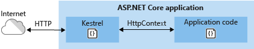

# Web server implementations in ASP.NET Core

By [Tom Dykstra](https://github.com/tdykstra), [Steve Smith](https://ardalis.com/), [Stephen Halter](https://twitter.com/halter73), and [Chris Ross](https://github.com/Tratcher)

An ASP.NET Core app runs with an in-process HTTP server implementation. The server implementation listens for HTTP requests and surfaces them to the app as sets of [request features](xref:fundamentals/request-features) composed into an <xref:Microsoft.AspNetCore.Http.HttpContext>.

::: moniker range=">= aspnetcore-2.2"

# [Windows](#tab/windows)

ASP.NET Core ships with the following:

* [Kestrel server](xref:fundamentals/servers/kestrel) is the default, cross-platform HTTP server.
* IIS HTTP Server (`IISHttpServer`) is an [IIS in-process server](xref:host-and-deploy/aspnet-core-module#in-process-hosting-model) implementation used with the [ASP.NET Core Module](xref:host-and-deploy/aspnet-core-module).
* [HTTP.sys server](xref:fundamentals/servers/httpsys) is a Windows-only HTTP server based on the [HTTP.sys kernel driver and HTTP Server API](https://msdn.microsoft.com/library/windows/desktop/aa364510.aspx).

# [macOS](#tab/macos)

ASP.NET Core ships with [Kestrel server](xref:fundamentals/servers/kestrel), which is the default, cross-platform HTTP server.

# [Linux](#tab/linux)

ASP.NET Core ships with [Kestrel server](xref:fundamentals/servers/kestrel), which is the default, cross-platform HTTP server.

---

::: moniker-end

::: moniker range="< aspnetcore-2.2"

# [Windows](#tab/windows)

ASP.NET Core ships with the following:

* [Kestrel server](xref:fundamentals/servers/kestrel) is the default, cross-platform HTTP server.
* [HTTP.sys server](xref:fundamentals/servers/httpsys) is a Windows-only HTTP server based on the [HTTP.sys kernel driver and HTTP Server API](https://msdn.microsoft.com/library/windows/desktop/aa364510.aspx).

# [macOS](#tab/macos)

ASP.NET Core ships with [Kestrel server](xref:fundamentals/servers/kestrel), which is the default, cross-platform HTTP server.

# [Linux](#tab/linux)

ASP.NET Core ships with [Kestrel server](xref:fundamentals/servers/kestrel), which is the default, cross-platform HTTP server.

---

::: moniker-end

## Kestrel

Kestrel is the default web server included in ASP.NET Core project templates.

::: moniker range=">= aspnetcore-2.0"

Kestrel can be used:

* By itself as an edge server processing requests directly from a network, including the Internet.
* With a *reverse proxy server*, such as [Internet Information Services (IIS)](https://www.iis.net/), [Nginx](http://nginx.org), or [Apache](https://httpd.apache.org/). A reverse proxy server receives HTTP requests from the Internet and forwards them to Kestrel.

Either configuration&mdash;with or without a reverse proxy server&mdash;is a valid and supported hosting configuration for ASP.NET Core 2.0 or later apps.

::: moniker-end

::: moniker range="< aspnetcore-2.0"

If the app only accepts requests from an internal network, Kestrel can be used by itself.

If the app is exposed to the Internet, Kestrel must use a *reverse proxy server*, such as [Internet Information Services (IIS)](https://www.iis.net/), [Nginx](http://nginx.org), or [Apache](https://httpd.apache.org/). A reverse proxy server receives HTTP requests from the Internet and forwards them to Kestrel.

The most important reason for using a reverse proxy for public-facing edge server deployments that are exposed directly the Internet is security. The 1.x versions of Kestrel don't include important security features to defend against attacks from the Internet. This includes, but isn't limited to, appropriate timeouts, request size limits, and concurrent connection limits.

::: moniker-end

For Kestrel configuration guidance and information on when to use Kestrel in a reverse proxy configuration, see <xref:fundamentals/servers/kestrel>.

### IIS with Kestrel

::: moniker range=">= aspnetcore-2.2"

When using [IIS](/iis/get-started/introduction-to-iis/introduction-to-iis-architecture) or [IIS Express](/iis/extensions/introduction-to-iis-express/iis-express-overview), the ASP.NET Core app either runs in the same process as the IIS worker process (the *in-process* hosting model) or in a process separate from the IIS worker process (the *out-of-process* hosting model).

The [ASP.NET Core Module](xref:host-and-deploy/aspnet-core-module) is a native IIS module that handles native IIS requests between either the in-process IIS HTTP Server or the out-of-process Kestrel server. For more information, see <xref:host-and-deploy/aspnet-core-module>.

::: moniker-end

::: moniker range="< aspnetcore-2.2"

When using [IIS](/iis/get-started/introduction-to-iis/introduction-to-iis-architecture) or [IIS Express](/iis/extensions/introduction-to-iis-express/iis-express-overview) as a reverse proxy for ASP.NET Core, the ASP.NET Core app runs in a process separate from the IIS worker process. In the IIS process, the [ASP.NET Core Module](xref:host-and-deploy/aspnet-core-module) coordinates the reverse proxy relationship. The primary functions of the ASP.NET Core Module are to start the app, restart the app when it crashes, and forward HTTP traffic to the app. For more information, see <xref:host-and-deploy/aspnet-core-module>.

::: moniker-end

For IIS and ASP.NET Core Module configuration guidance, see the following topics:

* <xref:host-and-deploy/iis/index>
* <xref:host-and-deploy/aspnet-core-module>

### Nginx with Kestrel

For information on how to use Nginx on Linux as a reverse proxy server for Kestrel, see <xref:host-and-deploy/linux-nginx>.

### Apache with Kestrel

For information on how to use Apache on Linux as a reverse proxy server for Kestrel, see <xref:host-and-deploy/linux-apache>.

## HTTP.sys

If ASP.NET Core apps are run on Windows, HTTP.sys is an alternative to Kestrel. Kestrel is generally recommended for best performance. HTTP.sys can be used in scenarios where the app is exposed to the Internet and required capabilities are supported by HTTP.sys but not Kestrel. For more information, see <xref:fundamentals/servers/httpsys>.

HTTP.sys can also be used for apps that are only exposed to an internal network.

For HTTP.sys configuration guidance, see <xref:fundamentals/servers/httpsys>.

## ASP.NET Core server infrastructure

The [IApplicationBuilder](/dotnet/api/microsoft.aspnetcore.builder.iapplicationbuilder) available in the `Startup.Configure` method exposes the [ServerFeatures](/dotnet/api/microsoft.aspnetcore.builder.iapplicationbuilder.serverfeatures) property of type [IFeatureCollection](/dotnet/api/microsoft.aspnetcore.http.features.ifeaturecollection). Kestrel and HTTP.sys only expose a single feature each, [IServerAddressesFeature](/dotnet/api/microsoft.aspnetcore.hosting.server.features.iserveraddressesfeature), but different server implementations may expose additional functionality.

`IServerAddressesFeature` can be used to find out which port the server implementation has bound at runtime.

## Custom servers

If the built-in servers don't meet the app's requirements, a custom server implementation can be created. The [Open Web Interface for .NET (OWIN) guide](xref:fundamentals/owin) demonstrates how to write a [Nowin](https://github.com/Bobris/Nowin)-based [IServer](/dotnet/api/microsoft.aspnetcore.hosting.server.iserver) implementation. Only the feature interfaces that the app uses require implementation, though at a minimum [IHttpRequestFeature](/dotnet/api/microsoft.aspnetcore.http.features.ihttprequestfeature) and [IHttpResponseFeature](/dotnet/api/microsoft.aspnetcore.http.features.ihttpresponsefeature) must be supported.

## Server startup

When using [Visual Studio](https://www.visualstudio.com/vs/), [Visual Studio for Mac](https://www.visualstudio.com/vs/mac/), or [Visual Studio Code](https://code.visualstudio.com/), the server is launched when the app is started by the Integrated Development Environment (IDE). In Visual Studio on Windows, launch profiles can be used to start the app and server with either [IIS Express](/iis/extensions/introduction-to-iis-express/iis-express-overview)/[ASP.NET Core Module](xref:host-and-deploy/aspnet-core-module) or the console. In Visual Studio Code, the app and server are started by [Omnisharp](https://github.com/OmniSharp/omnisharp-vscode), which activates the CoreCLR debugger. Using Visual Studio for Mac, the app and server are started by the [Mono Soft-Mode Debugger](http://www.mono-project.com/docs/advanced/runtime/docs/soft-debugger/).

When launching an app from a command prompt in the project's folder, [dotnet run](/dotnet/core/tools/dotnet-run) launches the app and server (Kestrel and HTTP.sys only). The configuration is specified by the `-c|--configuration` option, which is set to either `Debug` (default) or `Release`. If launch profiles are present in a *launchSettings.json* file, use the `--launch-profile <NAME>` option to set the launch profile (for example, `Development` or `Production`). For more information, see the [dotnet run](/dotnet/core/tools/dotnet-run) and [.NET Core distribution packaging](/dotnet/core/build/distribution-packaging) topics.

## HTTP/2 support

[HTTP/2](https://httpwg.org/specs/rfc7540.html) is supported with ASP.NET Core in the following deployment scenarios:

::: moniker range=">= aspnetcore-2.2"

* [Kestrel](xref:fundamentals/servers/kestrel#http2-support)
  * Operating system
    * Windows Server 2016/Windows 10 or later&dagger;
    * Linux with OpenSSL 1.0.2 or later (for example, Ubuntu 16.04 or later)
    * HTTP/2 will be supported on macOS in a future release.
  * Target framework: .NET Core 2.2 or later
* [HTTP.sys](xref:fundamentals/servers/httpsys#http2-support)
  * Windows Server 2016/Windows 10 or later
  * Target framework: Not applicable to HTTP.sys deployments.
* [IIS (in-process)](xref:host-and-deploy/iis/index#http2-support)
  * Windows Server 2016/Windows 10 or later; IIS 10 or later
  * Target framework: .NET Core 2.2 or later
* [IIS (out-of-process)](xref:host-and-deploy/iis/index#http2-support)
  * Windows Server 2016/Windows 10 or later; IIS 10 or later
  * Public-facing edge server connections use HTTP/2, but the reverse proxy connection to Kestrel uses HTTP/1.1.
  * Target framework: Not applicable to IIS out-of-process deployments.

&dagger;Kestrel has limited support for HTTP/2 on Windows Server 2012 R2 and Windows 8.1. Support is limited because the list of supported TLS cipher suites available on these operating systems is limited. A certificate generated using an Elliptic Curve Digital Signature Algorithm (ECDSA) may be required to secure TLS connections.

::: moniker-end

::: moniker range="< aspnetcore-2.2"

* [HTTP.sys](xref:fundamentals/servers/httpsys#http2-support)
  * Windows Server 2016/Windows 10 or later
  * Target framework: Not applicable to HTTP.sys deployments.
* [IIS (out-of-process)](xref:host-and-deploy/iis/index#http2-support)
  * Windows Server 2016/Windows 10 or later; IIS 10 or later
  * Public-facing edge server connections use HTTP/2, but the reverse proxy connection to Kestrel uses HTTP/1.1.
  * Target framework: Not applicable to IIS out-of-process deployments.

::: moniker-end

An HTTP/2 connection must use [Application-Layer Protocol Negotiation (ALPN)](https://tools.ietf.org/html/rfc7301#section-3) and TLS 1.2 or later. For more information, see the topics that pertain to your server deployment scenarios.

## Additional resources

* <xref:fundamentals/servers/kestrel>
* <xref:host-and-deploy/aspnet-core-module>
* <xref:host-and-deploy/iis/index>
* <xref:host-and-deploy/azure-apps/index>
* <xref:host-and-deploy/linux-nginx>
* <xref:host-and-deploy/linux-apache>
* <xref:fundamentals/servers/httpsys>
