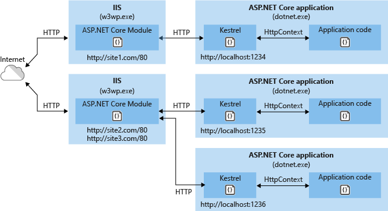

# Introduction to ASP.NET Core Module

By [Tom Dykstra](https://github.com/tdykstra), [Rick Strahl](https://github.com/RickStrahl), and [Chris Ross](https://github.com/Tratcher) 

ASP.NET Core Module (ANCM) lets you run ASP.NET Core applications behind IIS, using IIS for what it's good at (security, manageability, and lots more) and using [Kestrel](kestrel.md) for what it's good at (being really fast), and getting the benefits from both technologies at once. **ANCM works only with Kestrel; it isn't compatible with WebListener (in ASP.NET Core 1.x) or HTTP.sys (in 2.x).** 

Supported Windows versions:

* Windows 7 and Windows Server 2008 R2 and later

[View or download sample code](https://github.com/aspnet/Docs/tree/master/aspnetcore/fundamentals/servers/aspnet-core-module/sample)

## What ASP.NET Core Module does

ANCM is a native IIS module that hooks into the IIS pipeline and redirects traffic to the backend ASP.NET Core application. Most other modules, such as windows authentication, still get a chance to run. ANCM only takes control when a handler is selected for the request, and handler mapping is defined in the application *web.config* file.

Because ASP.NET Core applications run in a process separate from the IIS worker process, ANCM also does process management. ANCM starts the process for the ASP.NET Core application when the first request comes in and restarts it when it crashes. This is essentially the same behavior as classic ASP.NET applications that run in-process in IIS and are managed by WAS (Windows Activation Service).

Here's a diagram that illustrates the relationship between IIS, ANCM, and ASP.NET Core applications.

Requests come in from the Web and hit the kernel mode Http.Sys driver which routes them into IIS on the primary port (80) or SSL port (443). ANCM forwards the requests to the ASP.NET Core application on the HTTP port configured for the application, which is not port 80/443.

Kestrel listens for traffic coming from ANCM.  ANCM specifies the port via environment variable at startup, and the [UseIISIntegration](#call-useiisintegration) method configures the server to listen on `http://localhost:{port}`. There are additional checks to reject requests not from ANCM. (ANCM does not support HTTPS forwarding, so requests are forwarded over HTTP even if received by IIS over HTTPS.)

Kestrel picks up requests from ANCM and pushes them into the ASP.NET Core middleware pipeline, which then handles them and passes them on as `HttpContext` instances to application logic. The application's responses are then passed back to IIS, which pushes them back out to the HTTP client that initiated the requests.

ANCM has a few other functions as well:

* Sets environment variables.
* Logs `stdout` output to file storage.
* Forwards Windows authentication tokens.

## How to use ANCM in ASP.NET Core apps

This section provides an overview of the process for setting up an IIS server and ASP.NET Core application. For detailed instructions, see [Publishing to IIS](../../publishing/iis.md).

### Install ANCM

The ASP.NET Core Module has to be installed in IIS on your servers and in IIS Express on your development machines. For servers, ANCM is included in the [.NET Core Windows Server Hosting bundle](https://aka.ms/dotnetcore.2.0.0-windowshosting). For development machines, Visual Studio automatically installs ANCM in IIS Express, and in IIS if it is already installed on the machine.

### Install the IISIntegration NuGet package

# [ASP.NET Core 2.x](#tab/aspnetcore2x)

The [Microsoft.AspNetCore.Server.IISIntegration](https://www.nuget.org/packages/Microsoft.AspNetCore.Server.IISIntegration/) package is included in the ASP.NET Core metapackages ([Microsoft.AspNetCore](https://www.nuget.org/packages/Microsoft.AspNetCore/) and [Microsoft.AspNetCore.All](xref:fundamentals/metapackage)). If you don't use one of the metapackages, install `Microsoft.AspNetCore.Server.IISIntegration` separately. The `IISIntegration` package is an interoperability pack that reads environment variables broadcast by ANCM to set up your app. The environment variables provide configuration information, such as the port to listen on. 

# [ASP.NET Core 1.x](#tab/aspnetcore1x)

In your application, install [Microsoft.AspNetCore.Server.IISIntegration](https://www.nuget.org/packages/Microsoft.AspNetCore.Server.IISIntegration/). The `IISIntegration` package  is an interoperability pack that reads environment variables broadcast by ANCM to set up your app. The environment variables provide configuration information, such as the port to listen on. 

---

### Call UseIISIntegration

# [ASP.NET Core 2.x](#tab/aspnetcore2x)

The `UseIISIntegration` extension method on [`WebHostBuilder`](https://docs.microsoft.com/aspnet/core/api/microsoft.aspnetcore.hosting.webhostbuilder) is called automatically when you run with IIS.

If you aren't using one of the ASP.NET Core metapackages and haven't installed the  `Microsoft.AspNetCore.Server.IISIntegration` package, you get a runtime error. If you call `UseIISIntegration` explicitly, you get a compile time error if the package isn't installed.

# [ASP.NET Core 1.x](#tab/aspnetcore1x)

In your application's `Main` method, call the `UseIISIntegration` extension method on [`WebHostBuilder`](https://docs.microsoft.com/aspnet/core/api/microsoft.aspnetcore.hosting.webhostbuilder). 

[!code-csharp]

---

The `UseIISIntegration` method looks for environment variables that ANCM sets, and it no-ops if they aren't found. This behavior facilitates scenarios like developing and testing on macOS or Linux and deploying to a server that runs IIS. While running on macOS or Linux, Kestrel acts as the web server; but when the app is deployed to the IIS environment, it automatically uses ANCM and IIS.

### ANCM port binding overrides other port bindings

# [ASP.NET Core 2.x](#tab/aspnetcore2x)

ANCM generates a dynamic port to assign to the back-end process. The `UseIISIntegration` method picks up this dynamic port and configures Kestrel to listen on `http://locahost:{dynamicPort}/`. This overrides other URL configurations, such as calls to `UseUrls` or [Kestrel's Listen API](xref:fundamentals/servers/kestrel?tabs=aspnetcore2x#endpoint-configuration). Therefore, you don't need to call `UseUrls` or Kestrel's `Listen` API when you use ANCM. If you do call `UseUrls` or `Listen`, Kestrel listens on the port you specify when you run the app without IIS.

# [ASP.NET Core 1.x](#tab/aspnetcore1x)

ANCM generates a dynamic port to assign to the back-end process. The `UseIISIntegration` method picks up this dynamic port and configures Kestrel to listen on `http://locahost:{dynamicPort}/`. This overrides other URL configurations, such as calls to `UseUrls`. Therefore, you don't need to call `UseUrls` when you use ANCM. If you do call `UseUrls`, Kestrel listens on the port you specify when you run the app without IIS.

In ASP.NET Core 1.0, if you call `UseUrls`, call it **before** you call `UseIISIntegration` so that the ANCM-configured port doesn't get overwritten. This calling order isn't required in ASP.NET Core 1.1, because the ANCM setting overrides `UseUrls`.

---

### Configure ANCM options in Web.config

Configuration for the ASP.NET Core Module is stored in the *Web.config* file that is located in the application's root folder. Settings in this file point to the startup command and arguments that start your ASP.NET Core app. For sample Web.config code and guidance on configuration options, see [ASP.NET Core Module Configuration Reference](../../hosting/aspnet-core-module.md).

### Run with IIS Express in development

IIS Express can be launched by Visual Studio using the default profile defined by the ASP.NET Core templates.

## Next steps

For more information, see the following resources:

* [Sample app for this article](https://github.com/aspnet/Docs/tree/master/aspnetcore/fundamentals/servers/aspnet-core-module/sample)
* [ASP.NET Core Module source code](https://github.com/aspnet/AspNetCoreModule)
* [ASP.NET Core Module Configuration Reference](../../hosting/aspnet-core-module.md)
* [Publishing to IIS](../../publishing/iis.md)
