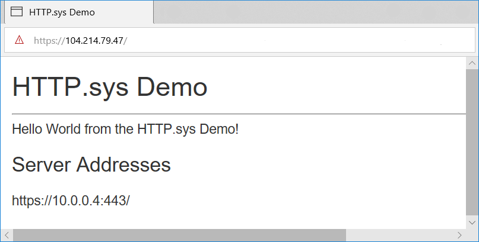

# HTTP.sys web server implementation in ASP.NET Core

By [Tom Dykstra](https://github.com/tdykstra) and [Chris Ross](https://github.com/Tratcher)

:::moniker range=">= aspnetcore-8.0"

[HTTP.sys](/iis/get-started/introduction-to-iis/introduction-to-iis-architecture#hypertext-transfer-protocol-stack-httpsys) is a [web server for ASP.NET Core](xref:fundamentals/servers/index) that only runs on Windows. HTTP.sys is an alternative to [Kestrel](xref:fundamentals/servers/kestrel) server and offers some features that Kestrel doesn't provide.

> [!IMPORTANT]
> HTTP.sys isn't compatible with the [ASP.NET Core Module](xref:host-and-deploy/aspnet-core-module) and can't be used with IIS or IIS Express.

HTTP.sys supports the following features:

* [Windows Authentication](xref:security/authentication/windowsauth)
* Port sharing
* HTTPS with SNI
* HTTP/2 over TLS (Windows 10 or later)
* Direct file transmission
* Response caching
* WebSockets (Windows 8 or later)

Supported Windows versions:

* Windows 7 or later
* Windows Server 2008 R2 or later

[View or download sample code](https://github.com/dotnet/AspNetCore.Docs/tree/main/aspnetcore/fundamentals/servers/httpsys/samples) ([how to download](xref:index#how-to-download-a-sample))

## When to use HTTP.sys

HTTP.sys is useful for deployments where:

* There's a need to expose the server directly to the Internet without using IIS.

  

* An internal deployment requires a feature not available in Kestrel. For more information, see [Kestrel vs. HTTP.sys](xref:fundamentals/servers/index#kestrel-vs-httpsys)

  

HTTP.sys is mature technology that protects against many types of attacks and provides the robustness, security, and scalability of a full-featured web server. IIS itself runs as an HTTP listener on top of HTTP.sys.

## HTTP/2 support

[HTTP/2](https://httpwg.org/specs/rfc7540.html) is enabled for ASP.NET Core apps when the following base requirements are met:

* Windows Server 2016/Windows 10 or later
* [Application-Layer Protocol Negotiation (ALPN)](https://tools.ietf.org/html/rfc7301#section-3) connection
* TLS 1.2 or later connection

If an HTTP/2 connection is established, [HttpRequest.Protocol](xref:Microsoft.AspNetCore.Http.HttpRequest.Protocol*) reports `HTTP/2`.

HTTP/2 is enabled by default. If an HTTP/2 connection isn't established, the connection falls back to HTTP/1.1. In a future release of Windows, HTTP/2 configuration flags will be available, including the ability to disable HTTP/2 with HTTP.sys.

## HTTP/3 support

[HTTP/3](https://datatracker.ietf.org/doc/rfc9114/) is enabled for ASP.NET Core apps when the following base requirements are met:

* Windows Server 2022/Windows 11 or later
* An `https` url binding is used.
* The [EnableHttp3 registry key](https://techcommunity.microsoft.com/t5/networking-blog/enabling-http-3-support-on-windows-server-2022/ba-p/2676880) is set.

The preceding Windows 11 Build versions may require the use of a [Windows Insider](https://insider.windows.com) build.

HTTP/3 is discovered as an upgrade from HTTP/1.1 or HTTP/2 via the `alt-svc` header. That means the first request will normally use HTTP/1.1 or HTTP/2 before switching to HTTP/3. Http.Sys doesn't automatically add the `alt-svc` header, it must be added by the application. The following code is a middleware example that adds the `alt-svc` response header.

```C#
app.Use((context, next) =>
{
    context.Response.Headers.AltSvc = "h3=\":443\"";
    return next(context);
});
```

Place the preceding code early in the request pipeline.

Http.Sys also supports sending an AltSvc HTTP/2 protocol message rather than a response header to notify the client that HTTP/3 is available. See the [EnableAltSvc registry key](https://techcommunity.microsoft.com/t5/networking-blog/enabling-http-3-support-on-windows-server-2022/ba-p/2676880). This requires netsh sslcert bindings that use host names rather than IP addresses.

## Kernel mode authentication with Kerberos

HTTP.sys delegates to kernel mode authentication with the Kerberos authentication protocol. User mode authentication isn't supported with Kerberos and HTTP.sys. The machine account must be used to decrypt the Kerberos token/ticket that's obtained from Active Directory and forwarded by the client to the server to authenticate the user. Register the Service Principal Name (SPN) for the host, not the user of the app.

### Support for kernel-mode response buffering

In some scenarios, high volumes of small writes with high latency can cause significant performance impact to `HTTP.sys`. This impact is due to the lack of a <xref:System.IO.Pipelines.Pipe> buffer in the `HTTP.sys` implementation. To improve performance in these scenarios, support for response buffering is included in `HTTP.sys`. Enable buffering by setting [HttpSysOptions.EnableKernelResponseBuffering](https://github.com/dotnet/aspnetcore/blob/main/src/Servers/HttpSys/src/HttpSysOptions.cs#L120) to `true`.

Response buffering should be enabled by an app that does synchronous I/O, or asynchronous I/O with no more than one outstanding write at a time. In these scenarios, response buffering can significantly improve throughput over high-latency connections.

Apps that use asynchronous I/O and that may have more than one write outstanding at a time should **_not_** use this flag. Enabling this flag can result in higher CPU and memory usage by HTTP.Sys.

## How to use HTTP.sys

### Configure the ASP.NET Core app to use HTTP.sys

Call the <xref:Microsoft.AspNetCore.Hosting.WebHostBuilderHttpSysExtensions.UseHttpSys%2A> extension method when building the host, specifying any required <xref:Microsoft.AspNetCore.Server.HttpSys.HttpSysOptions>. The following example sets options to their default values:

:::code language="csharp" source="~/fundamentals/servers/httpsys/samples/8.x/SampleApp/Program.cs" id="snippet_1" highlight="8-16":::

Additional HTTP.sys configuration is handled through [registry settings](https://support.microsoft.com/help/820129/http-sys-registry-settings-for-windows).

For more information about HTTP.sys options, see <xref:Microsoft.AspNetCore.Server.HttpSys.HttpSysOptions>.

<a name="maxrequestbodysize"></a>

**MaxRequestBodySize**

The maximum allowed size of any request body in bytes. When set to `null`, the maximum request body size is unlimited. This limit has no effect on upgraded connections, which are always unlimited.

The recommended method to override the limit in an ASP.NET Core MVC app for a single `IActionResult` is to use the <xref:Microsoft.AspNetCore.Mvc.RequestSizeLimitAttribute> attribute on an action method:

```csharp
[RequestSizeLimit(100000000)]
public IActionResult MyActionMethod()
```

An exception is thrown if the app attempts to configure the limit on a request after the app has started reading the request. An `IsReadOnly` property can be used to indicate if the `MaxRequestBodySize` property is in a read-only state, meaning it's too late to configure the limit.

If the app should override <xref:Microsoft.AspNetCore.Server.HttpSys.HttpSysOptions.MaxRequestBodySize> per-request, use the <xref:Microsoft.AspNetCore.Http.Features.IHttpMaxRequestBodySizeFeature>:

:::code language="csharp" source="~/fundamentals/servers/httpsys/samples/8.x/SampleApp/Program.cs" id="snippet_12" highlight="3-4":::

If using Visual Studio, make sure the app isn't configured to run IIS or IIS Express.

In Visual Studio, the default launch profile is for IIS Express. To run the project as a console app, manually change the selected profile, as shown in the following screenshot:

:::image type="content" source="~/fundamentals/servers/httpsys/_static/vs-choose-profile.png" alt-text="Select console app profile":::

### Configure Windows Server

1. Determine the ports to open for the app and use [Windows Firewall](/windows/security/threat-protection/windows-firewall/create-an-inbound-port-rule) or the [New-NetFirewallRule](/powershell/module/netsecurity/new-netfirewallrule) PowerShell cmdlet to open firewall ports to allow traffic to reach HTTP.sys. In the following commands and app configuration, port 443 is used.

1. When deploying to an Azure VM, open the ports in the [Network Security Group](/azure/virtual-machines/windows/nsg-quickstart-portal). In the following commands and app configuration, port 443 is used.

1. Obtain and install X.509 certificates, if required.

   On Windows, create self-signed certificates using the [New-SelfSignedCertificate PowerShell cmdlet](/powershell/module/pki/new-selfsignedcertificate). For an unsupported example, see [UpdateIISExpressSSLForChrome.ps1](https://github.com/dotnet/AspNetCore.Docs/tree/main/aspnetcore/includes/make-x509-cert/UpdateIISExpressSSLForChrome.ps1).

   Install either self-signed or CA-signed certificates in the server's **Local Machine** > **Personal** store.

1. If the app is a [framework-dependent deployment](/dotnet/core/deploying/#framework-dependent-deployments-fdd), install .NET Core, .NET Framework, or both (if the app is a .NET Core app targeting the .NET Framework).

   * **.NET Core**: If the app requires .NET Core, obtain and run the **.NET Core Runtime** installer from [.NET Core Downloads](https://dotnet.microsoft.com/download). Don't install the full SDK on the server.
   * **.NET Framework**: If the app requires .NET Framework, see the [.NET Framework installation guide](/dotnet/framework/install/). Install the required .NET Framework. The installer for the latest .NET Framework is available from the [.NET Core Downloads](https://dotnet.microsoft.com/download) page.

   If the app is a [self-contained deployment](/dotnet/core/deploying/#self-contained-deployments-scd), the app includes the runtime in its deployment. No framework installation is required on the server.

1. Configure URLs and ports in the app.

   By default, ASP.NET Core binds to `http://localhost:5000`. To configure URL prefixes and ports, options include:

   * <xref:Microsoft.AspNetCore.Hosting.HostingAbstractionsWebHostBuilderExtensions.UseUrls*>
   * `urls` command-line argument
   * `ASPNETCORE_URLS` environment variable
   * <xref:Microsoft.AspNetCore.Server.HttpSys.HttpSysOptions.UrlPrefixes>

   The following code example shows how to use <xref:Microsoft.AspNetCore.Server.HttpSys.HttpSysOptions.UrlPrefixes> with the server's local IP address `10.0.0.4` on port 443:

   :::code language="csharp" source="~/fundamentals/servers/httpsys/samples/8.x/SampleApp/Program.cs" id="snippet_11" highlight="5":::

   An advantage of `UrlPrefixes` is that an error message is generated immediately for improperly formatted prefixes.

   The settings in `UrlPrefixes` override `UseUrls`/`urls`/`ASPNETCORE_URLS` settings. Therefore, an advantage of `UseUrls`, `urls`, and the `ASPNETCORE_URLS` environment variable is that it's easier to switch between Kestrel and HTTP.sys.

   HTTP.sys recognizes two types of wild cards in URL prefixes:   

   * `*` is a *weak binding*, also known as a *fallback binding*. If the URL prefix is `http://*:5000`, and something else is bound to port 5000, this binding won't be used.
   * `+` is a *strong binding*. If the URL prefix is `http://+:5000`, this binding will be used before other port 5000 bindings.

   For more information, see [UrlPrefix Strings](/windows/win32/http/urlprefix-strings).

   > [!WARNING]
   > Top-level wildcard bindings (`http://*:80/` and `http://+:80`) should **not** be used. Top-level wildcard bindings create app security vulnerabilities. This applies to both strong and weak wildcards. Use explicit host names or IP addresses rather than wildcards. Subdomain wildcard binding (for example, `*.mysub.com`) isn't a security risk if you control the entire parent domain (as opposed to `*.com`, which is vulnerable). For more information, see [RFC 9110: Section 7.2: Host and :authority](https://www.rfc-editor.org/rfc/rfc9110#field.host).

   [!INCLUDE [http-ports](~/includes/http-ports.md)]

   These configuration keys are equivalent to top-level wildcard bindings. They're convenient for development and container scenarios, but avoid wildcards when running on a machine that may also host other services.

1. Preregister URL prefixes on the server.

   The built-in tool for configuring HTTP.sys is *netsh.exe*. *netsh.exe* is used to reserve URL prefixes and assign X.509 certificates. The tool requires administrator privileges.

   Use the *netsh.exe* tool to register URLs for the app:

   ```console
   netsh http add urlacl url=<URL> user=<USER>
   ```

   * `<URL>`: The fully qualified Uniform Resource Locator (URL). Don't use a wildcard binding. Use a valid hostname or local IP address. *The URL must include a trailing slash.*
   * `<USER>`: Specifies the user or user-group name.

   In the following example, the local IP address of the server is `10.0.0.4`:

   ```console
   netsh http add urlacl url=https://10.0.0.4:443/ user=Users
   ```

   When a URL is registered, the tool responds with `URL reservation successfully added`.

   To delete a registered URL, use the `delete urlacl` command:

   ```console
   netsh http delete urlacl url=<URL>
   ```

1. Register X.509 certificates on the server.

   Use the *netsh.exe* tool to register certificates for the app:

   ```console
   netsh http add sslcert ipport=<IP>:<PORT> certhash=<THUMBPRINT> appid="{<GUID>}"
   ```

   * `<IP>`: Specifies the local IP address for the binding. Don't use a wildcard binding. Use a valid IP address.
   * `<PORT>`: Specifies the port for the binding.
   * `<THUMBPRINT>`: The X.509 certificate thumbprint.
   * `<GUID>`: A developer-generated GUID to represent the app for informational purposes.

   For reference purposes, store the GUID in the app as a package tag:

   * In Visual Studio:
     * Open the app's project properties by right-clicking on the app in **Solution Explorer** and selecting **Properties**.
     * Select the **Package** tab.
     * Enter the GUID that you created in the **Tags** field.
   * When not using Visual Studio:
     * Open the app's project file.
     * Add a `<PackageTags>` property to a new or existing `<PropertyGroup>` with the GUID that you created:

       ```xml
       <PropertyGroup>
         <PackageTags>9412ee86-c21b-4eb8-bd89-f650fbf44931</PackageTags>
       </PropertyGroup>
       ```

   In the following example:

   * The local IP address of the server is `10.0.0.4`.
   * An online random GUID generator provides the `appid` value.

   ```console
   netsh http add sslcert 
       ipport=10.0.0.4:443 
       certhash=b66ee04419d4ee37464ab8785ff02449980eae10 
       appid="{9412ee86-c21b-4eb8-bd89-f650fbf44931}"
   ```

   When a certificate is registered, the tool responds with `SSL Certificate successfully added`.

   To delete a certificate registration, use the `delete sslcert` command:

   ```console
   netsh http delete sslcert ipport=<IP>:<PORT>
   ```

   Reference documentation for *netsh.exe*:

   * [Netsh Commands for Hypertext Transfer Protocol (HTTP)](/previous-versions/windows/it-pro/windows-server-2008-R2-and-2008/cc725882(v=ws.10))
   * [UrlPrefix Strings](/windows/win32/http/urlprefix-strings)

1. Run the app.

   Administrator privileges aren't required to run the app when binding to localhost using HTTP (not HTTPS) with a port number greater than 1024. For other configurations (for example, using a local IP address or binding to port 443), run the app with administrator privileges.

   The app responds at the server's public IP address. In this example, the server is reached from the Internet at its public IP address of `104.214.79.47`.

   A development certificate is used in this example. The page loads securely after bypassing the browser's untrusted certificate warning.

   

## Proxy server and load balancer scenarios

For apps hosted by HTTP.sys that interact with requests from the Internet or a corporate network, additional configuration might be required when hosting behind proxy servers and load balancers. For more information, see [Configure ASP.NET Core to work with proxy servers and load balancers](xref:host-and-deploy/proxy-load-balancer).

<a name="ihsrtf8"></a>

## Get detailed timing information with IHttpSysRequestTimingFeature
<!--
<xref:Microsoft.AspNetCore.Server.HttpSys.IHttpSysRequestTimingFeature> 
-->
[IHttpSysRequestTimingFeature](https://source.dot.net/#Microsoft.AspNetCore.Server.HttpSys/IHttpSysRequestTimingFeature.cs,3c5dc86dc837b1f4) provides detailed timing information for requests:

* Timestamps are obtained using [QueryPerformanceCounter](/windows/win32/api/profileapi/nf-profileapi-queryperformancecounter).
* The timestamp frequency can be obtained via [QueryPerformanceFrequency](/windows/win32/api/profileapi/nf-profileapi-queryperformancefrequency).
* The index of the timing can be cast to [HttpSysRequestTimingType](https://source.dot.net/#Microsoft.AspNetCore.Server.HttpSys/HttpSysRequestTimingType.cs,e62e7bcd02f8589e) to know what the timing represents.
* The value may be 0 if the timing isn't available for the current request.

:::code language="csharp" source="~/fundamentals/request-features/samples/8.x/IHttpSysRequestTimingFeature/Program.cs" id="snippet_WithTimestamps":::

[IHttpSysRequestTimingFeature.TryGetTimestamp](xref:Microsoft.AspNetCore.Server.HttpSys.IHttpSysRequestTimingFeature.TryGetTimestamp%2A) retrieves the timestamp for the provided timing type:

:::code language="csharp" source="~/fundamentals/request-features/samples/8.x/IHttpSysRequestTimingFeature/Program.cs" id="snippet_WithTryGetTimestamp":::

[IHttpSysRequestTimingFeature.TryGetElapsedTime](https://source.dot.net/#Microsoft.AspNetCore.Server.HttpSys/IHttpSysRequestTimingFeature.cs,3c5dc86dc837b1f4) gives the elapsed time between two specified timings:

:::code language="csharp" source="~/fundamentals/request-features/samples/8.x/IHttpSysRequestTimingFeature/Program.cs" id="snippet_WithTryGetElapsedTime":::

## Advanced HTTP/2 features to support gRPC

Additional HTTP/2 features in HTTP.sys support gRPC, including support for response trailers and sending reset frames.

Requirements to run gRPC with HTTP.sys:

* Windows 11 Build 22000 or later, Windows Server 2022 Build 20348 or later.
* TLS 1.2 or later connection.

### Trailers

[!INCLUDE[](~/includes/trailers.md)]

### Reset

[!INCLUDE[](~/includes/reset.md)]

## Tracing

For information about how to get traces from HTTP.sys, see [HTTP.sys Manageability Scenarios](/windows/win32/http/http-sys-manageability-scenarios).

## Additional resources

* [Enable Windows Authentication with HTTP.sys](xref:security/authentication/windowsauth#httpsys)
* [HTTP Server API](/windows/win32/http/http-api-start-page)
* [aspnet/HttpSysServer GitHub repository (source code)](https://github.com/aspnet/HttpSysServer/)
* [The host](xref:fundamentals/index#host)
* <xref:test/troubleshoot>

:::moniker-end

[!INCLUDE [httpsys5-7](~/fundamentals/servers/httpsys/includes/httpsys5-7.md)]
