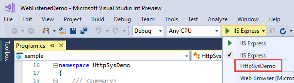

# HTTP.sys web server implementation in ASP.NET Core

By [Tom Dykstra](https://github.com/tdykstra) and [Chris Ross](https://github.com/Tratcher)

> [!NOTE]
> This topic applies only to ASP.NET Core 2.0 and later. In earlier versions of ASP.NET Core, HTTP.sys is named [WebListener](xref:fundamentals/servers/weblistener).

HTTP.sys is a [web server for ASP.NET Core](index.md) that runs only on Windows. It's built on the [Http.Sys kernel mode driver](https://msdn.microsoft.com/library/windows/desktop/aa364510.aspx). HTTP.sys is an alternative to [Kestrel](kestrel.md) that offers some features that Kestel doesn't. **HTTP.sys can't be used with IIS or IIS Express, as it isn't compatible with the [ASP.NET Core Module](aspnet-core-module.md).**

HTTP.sys supports the following features:

- [Windows Authentication](xref:security/authentication/windowsauth)
- Port sharing
- HTTPS with SNI
- HTTP/2 over TLS (Windows 10)
- Direct file transmission
- Response caching
- WebSockets (Windows 8)

Supported Windows versions:

- Windows 7 and Windows Server 2008 R2 and later

[View or download sample code](https://github.com/aspnet/Docs/tree/master/aspnetcore/fundamentals/servers/httpsys/sample)

## When to use HTTP.sys

HTTP.sys is useful for deployments where you need to expose the server directly to the Internet without using IIS.


Because it's built on Http.Sys, HTTP.sys doesn't require a reverse proxy server for protection against attacks. Http.Sys is mature technology that protects against many kinds of attacks and provides the robustness, security, and scalability of a full-featured web server. IIS itself runs as an HTTP listener on top of Http.Sys. 

HTTP.sys is a good choice for internal deployments when you need a feature not available in Kestrel, such as Windows authentication.


## How to use HTTP.sys

Here's an overview of setup tasks for the host OS and your ASP.NET Core application.

### Configure Windows Server

* Install the version of .NET that your application requires, such as [.NET Core](https://www.microsoft.com/net/download/core) or [.NET Framework](https://www.microsoft.com/net/download/framework).

* Preregister URL prefixes to bind to HTTP.sys, and set up SSL certificates

   If you don't preregister URL prefixes in Windows, you have to run your application with administrator privileges. The only exception is if you bind to localhost using HTTP (not HTTPS) with a port number greater than 1024; in that case, administrator privileges aren't required.

   For details, see [How to preregister prefixes and configure SSL](#preregister-url-prefixes-and-configure-ssl) later in this article.

* Open firewall ports to allow traffic to reach HTTP.sys.

   You can use *netsh.exe* or [PowerShell cmdlets](https://technet.microsoft.com/library/jj554906).

There are also [Http.Sys registry settings](https://support.microsoft.com/kb/820129).

### Configure your ASP.NET Core application to use HTTP.sys

* No package install is needed if you use the [Microsoft.AspNetCore.All](xref:fundamentals/metapackage) metapackage. The [Microsoft.AspNetCore.Server.HttpSys](https://www.nuget.org/packages/Microsoft.AspNetCore.Server.HttpSys/) package is included in the metapackage.

* Call the `UseHttpSys` extension method on `WebHostBuilder` in your `Main` method, specifying any [HTTP.sys options](https://github.com/aspnet/HttpSysServer/blob/rel/2.0.0/src/Microsoft.AspNetCore.Server.HttpSys/HttpSysOptions.cs) that you need, as shown in the following example:

  [!code-csharp[](httpsys/sample/Program.cs?name=snippet_Main&highlight=11-19)]

### Configure HTTP.sys options

Here are some of the HTTP.sys settings and limits that you can configure.

**Maximum client connections**

The maximum number of concurrent open TCP connections can be set for the entire application with the following code in *Program.cs*:

[!code-csharp[](httpsys/sample/Program.cs?name=snippet_Options&highlight=5)]

The maximum number of connections is unlimited (null) by default.

**Maximum request body size**

The default maximum request body size is 30,000,000 bytes, which is approximately 28.6MB.

The recommended way to override the limit in an ASP.NET Core MVC app is to use the [RequestSizeLimit](https://github.com/aspnet/Mvc/blob/rel/2.0.0/src/Microsoft.AspNetCore.Mvc.Core/RequestSizeLimitAttribute.cs) attribute on an action method:

```csharp
[RequestSizeLimit(100000000)]
public IActionResult MyActionMethod()
```

Here's an example that shows how to configure the constraint for the entire application, every request:

[!code-csharp[](httpsys/sample/Program.cs?name=snippet_Options&highlight=6)]

You can override the setting on a specific request in *Startup.cs*:

[!code-csharp[](httpsys/sample/Startup.cs?name=snippet_Configure&highlight=9-10)]
 
An exception is thrown if you try to configure the limit on a request after the application has started reading the request. There's an `IsReadOnly` property that tells you if the `MaxRequestBodySize` property is in read-only state, meaning it's too late to configure the limit.

For information about other HTTP.sys options, see [HttpSysOptions](https://github.com/aspnet/HttpSysServer/blob/rel/2.0.0/src/Microsoft.AspNetCore.Server.HttpSys/HttpSysOptions.cs). 

### Configure URLs and ports to listen on 

By default ASP.NET Core binds to `http://localhost:5000`. To configure URL prefixes and ports, you can use the `UseUrls` extension method, the `urls` command-line argument, the ASPNETCORE_URLS environment variable, or the `UrlPrefixes` property on [HttpSysOptions](https://github.com/aspnet/HttpSysServer/blob/rel/2.0.0/src/Microsoft.AspNetCore.Server.HttpSys/HttpSysOptions.cs). The following code example uses `UrlPrefixes`.

[!code-csharp[](httpsys/sample/Program.cs?name=snippet_Main&highlight=17)]

An advantage of `UrlPrefixes` is that you get an error message immediately if you try to add a prefix that is formatted wrong. An advantage of `UseUrls` (shared with `urls` and ASPNETCORE_URLS) is that you can more easily switch between Kestrel and HTTP.sys.

If you use both `UseUrls` (or `urls` or ASPNETCORE_URLS) and `UrlPrefixes`, the settings in `UrlPrefixes` override the ones in `UseUrls`. For more information, see [Hosting](xref:fundamentals/hosting).

HTTP.sys uses the [HTTP Server API UrlPrefix string formats](https://msdn.microsoft.com/library/windows/desktop/aa364698.aspx).

> [!NOTE]
> Make sure that you specify the same prefix strings in `UseUrls` or `UrlPrefixes` that you preregister on the server. 

### Don't use IIS

Make sure your application isn't configured to run IIS or IIS Express.

In Visual Studio, the default launch profile is for IIS Express. To run the project as a console application, manually change the selected profile, as shown in the following screen shot.



## Preregister URL prefixes and configure SSL

Both IIS and HTTP.sys rely on the underlying Http.Sys kernel mode driver to listen for requests and do initial processing. In IIS, the management UI gives you a relatively easy way to configure everything. However, you need to configure Http.Sys yourself. The built-in tool for doing that is *netsh.exe*. 

With *netsh.exe* you can reserve URL prefixes and assign SSL certificates. The tool requires administrative privileges.

The following example shows the minimum needed to reserve URL prefixes for ports 80 and 443:

```console
netsh http add urlacl url=http://+:80/ user=Users
netsh http add urlacl url=https://+:443/ user=Users
```

The following example shows how to assign an SSL certificate:

```console
netsh http add sslcert ipport=0.0.0.0:443 certhash=MyCertHash_Here appid={00000000-0000-0000-0000-000000000000}"
```

Here is the reference documentation for *netsh.exe*:

* [Netsh Commands for Hypertext Transfer Protocol (HTTP)](https://technet.microsoft.com/library/cc725882.aspx)
* [UrlPrefix Strings](https://msdn.microsoft.com/library/windows/desktop/aa364698.aspx)

The following resources provide detailed instructions for several scenarios. Articles that refer to HttpListener apply equally to HTTP.sys, as both are based on Http.Sys.

* [How to: Configure a Port with an SSL Certificate](https://docs.microsoft.com/dotnet/framework/wcf/feature-details/how-to-configure-a-port-with-an-ssl-certificate)
* [HTTPS Communication - HttpListener based Hosting and Client Certification](http://sunshaking.blogspot.com/2012/11/https-communication-httplistener-based.html) This is a third-party blog and is fairly old but still has useful information.
* [How To: Walkthrough Using HttpListener or Http Server unmanaged code (C++) as an SSL Simple Server](https://blogs.msdn.microsoft.com/jpsanders/2009/09/29/how-to-walkthrough-using-httplistener-or-http-server-unmanaged-code-c-as-an-ssl-simple-server/) This too is an older blog with useful information.

Here are some third-party tools that can be easier to use than the *netsh.exe* command line. These are not provided by or endorsed by Microsoft. The tools run as administrator by default, since *netsh.exe* itself requires administrator privileges.

* [http.sys Manager](http://httpsysmanager.codeplex.com/) provides UI for listing and configuring SSL certificates and options, prefix reservations, and certificate trust lists. 
* [HttpConfig](http://www.stevestechspot.com/ABetterHttpcfg.aspx) lets you list or configure SSL certificates and URL prefixes. The UI is more refined than http.sys Manager and exposes a few more configuration options, but otherwise it provides similar functionality. It cannot create a new certificate trust list (CTL), but can assign existing ones.

[!INCLUDE[How to make an SSL cert](../../includes/make-ssl-cert.md)]

## Next steps

For more information, see the following resources:

* [Sample app for this article](https://github.com/aspnet/Docs/tree/master/aspnetcore/fundamentals/servers/httpsys/sample)
* [HTTP.sys source code](https://github.com/aspnet/HttpSysServer/)
* [Hosting](xref:fundamentals/hosting)
