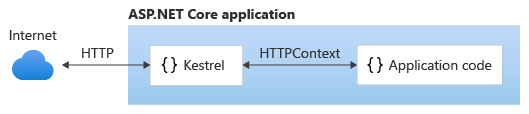
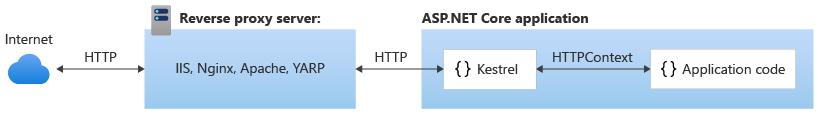
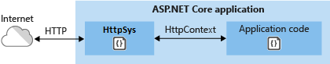
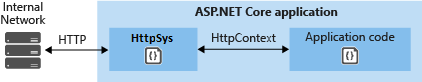

# Web server implementations in ASP.NET Core

By [Tom Dykstra](https://github.com/tdykstra), [Steve Smith](https://ardalis.com/), [Stephen Halter](https://twitter.com/halter73), and [Chris Ross](https://github.com/Tratcher)

An ASP.NET Core app runs with an in-process HTTP server implementation. The server implementation listens for HTTP requests and surfaces them to the app as a set of [request features](xref:fundamentals/request-features) composed into an <xref:Microsoft.AspNetCore.Http.HttpContext>.

:::moniker range=">= aspnetcore-2.2"

# [Windows](#tab/windows)

ASP.NET Core ships with the following:

* [Kestrel server](xref:fundamentals/servers/kestrel) is the default, cross-platform HTTP server implementation. Kestrel provides the best performance and memory utilization, but it doesn't have some of the advanced features in HTTP.sys. For more information, see [Kestrel vs. HTTP.sys](#korh) in the next section.
* IIS HTTP Server is an [in-process server](#hosting-models) for IIS.
* [HTTP.sys server](xref:fundamentals/servers/httpsys) is a Windows-only HTTP server based on the [HTTP.sys kernel driver and HTTP Server API](/windows/desktop/Http/http-api-start-page).

When using [IIS](/iis/get-started/introduction-to-iis/introduction-to-iis-architecture) or [IIS Express](/iis/extensions/introduction-to-iis-express/iis-express-overview), the app either runs:

* In the same process as the IIS worker process (the [in-process hosting model](#hosting-models)) with the IIS HTTP Server. *In-process* is the recommended configuration.
* In a process separate from the IIS worker process (the [out-of-process hosting model](#hosting-models)) with the [Kestrel server](#kestrel).

The [ASP.NET Core Module](xref:host-and-deploy/aspnet-core-module) is a native IIS module that handles native IIS requests between IIS and the in-process IIS HTTP Server or Kestrel. For more information, see <xref:host-and-deploy/aspnet-core-module>.

## Kestrel vs. HTTP.sys

Kestrel has the following advantages over HTTP.sys:

  * Better performance and memory utilization.
  * Cross platform
  * Agility, it's developed and patched independent of the OS.
  * Programmatic port and TLS configuration
  * Extensibility that allows for protocols like [PPv2](https://github.com/aspnet/AspLabs/blob/main/src/ProxyProtocol/ProxyProtocol.Sample/ProxyProtocol.cs) and alternate transports.

Http.Sys operates as a shared kernel mode component with the following features that kestrel does not have:

  * Port sharing
  * Kernel mode windows authentication. [Kestrel supports only user-mode authentication](xref:security/authentication/windowsauth#kestrel).
  * Fast proxying via queue transfers
  * Direct file transmission
  * Response caching

## Hosting models

Using in-process hosting, an ASP.NET Core app runs in the same process as its IIS worker process. In-process hosting provides improved performance over out-of-process hosting because requests aren't proxied over the loopback adapter, a network interface that returns outgoing network traffic back to the same machine. IIS handles process management with the [Windows Process Activation Service (WAS)](/iis/manage/provisioning-and-managing-iis/features-of-the-windows-process-activation-service-was).

Using out-of-process hosting, ASP.NET Core apps run in a process separate from the IIS worker process, and the module handles process management. The module starts the process for the ASP.NET Core app when the first request arrives and restarts the app if it shuts down or crashes. This is essentially the same behavior as seen with apps that run in-process that are managed by the [Windows Process Activation Service (WAS)](/iis/manage/provisioning-and-managing-iis/features-of-the-windows-process-activation-service-was). Using a separate process also enables hosting more than one app from the same app pool.

For more information and configuration guidance, see the following topics:

* <xref:host-and-deploy/iis/index>
* <xref:host-and-deploy/aspnet-core-module>

# [macOS](#tab/macos)

ASP.NET Core ships with [Kestrel server](xref:fundamentals/servers/kestrel), which is the default, cross-platform HTTP server.

# [Linux](#tab/linux)

ASP.NET Core ships with [Kestrel server](xref:fundamentals/servers/kestrel), which is the default, cross-platform HTTP server.

---

:::moniker-end

## Kestrel

 [Kestrel server](xref:fundamentals/servers/kestrel) is the default, cross-platform HTTP server implementation. Kestrel provides the best performance and memory utilization, but it doesn't have some of the advanced features in HTTP.sys. For more information, see [Kestrel vs. HTTP.sys](#korh) in this document.

Use Kestrel:

* By itself as an edge server processing requests directly from a network, including the Internet.

  

* With a *reverse proxy server*, such as [Internet Information Services (IIS)](https://www.iis.net/), [Nginx](https://nginx.org), or [Apache](https://httpd.apache.org/). A reverse proxy server receives HTTP requests from the Internet and forwards them to Kestrel.

  

Either hosting configuration&mdash;with or without a reverse proxy server&mdash;is supported.

For Kestrel configuration guidance and information on when to use Kestrel in a reverse proxy configuration, see <xref:fundamentals/servers/kestrel>.

:::moniker range="< aspnetcore-2.2"

# [Windows](#tab/windows)

ASP.NET Core ships with the following:

* [Kestrel server](xref:fundamentals/servers/kestrel) is the default, cross-platform HTTP server.
* [HTTP.sys server](xref:fundamentals/servers/httpsys) is a Windows-only HTTP server based on the [HTTP.sys kernel driver and HTTP Server API](/windows/desktop/Http/http-api-start-page).

When using [IIS](/iis/get-started/introduction-to-iis/introduction-to-iis-architecture) or [IIS Express](/iis/extensions/introduction-to-iis-express/iis-express-overview), the app runs in a process separate from the IIS worker process (*out-of-process*) with the [Kestrel server](#kestrel).

Because ASP.NET Core apps run in a process separate from the IIS worker process, the module handles process management. The module starts the process for the ASP.NET Core app when the first request arrives and restarts the app if it shuts down or crashes. This is essentially the same behavior as seen with apps that run in-process that are managed by the [Windows Process Activation Service (WAS)](/iis/manage/provisioning-and-managing-iis/features-of-the-windows-process-activation-service-was).

The following diagram illustrates the relationship between IIS, the ASP.NET Core Module, and an app hosted out-of-process:

Requests arrive from the web to the kernel-mode HTTP.sys driver. The driver routes the requests to IIS on the website's configured port, usually 80 (HTTP) or 443 (HTTPS). The module forwards the requests to Kestrel on a random port for the app, which isn't port 80 or 443.

The module specifies the port via an environment variable at startup, and the [IIS Integration Middleware](xref:host-and-deploy/iis/index#enable-the-iisintegration-components) configures the server to listen on `http://localhost:{port}`. Additional checks are performed, and requests that don't originate from the module are rejected. The module doesn't support HTTPS forwarding, so requests are forwarded over HTTP even if received by IIS over HTTPS.

After Kestrel picks up the request from the module, the request is pushed into the ASP.NET Core middleware pipeline. The middleware pipeline handles the request and passes it on as an `HttpContext` instance to the app's logic. Middleware added by IIS Integration updates the scheme, remote IP, and pathbase to account for forwarding the request to Kestrel. The app's response is passed back to IIS, which pushes it back out to the HTTP client that initiated the request.

For IIS and ASP.NET Core Module configuration guidance, see the following topics:

* <xref:host-and-deploy/iis/index>
* <xref:host-and-deploy/aspnet-core-module>

# [macOS](#tab/macos)

ASP.NET Core ships with [Kestrel server](xref:fundamentals/servers/kestrel), which is the default, cross-platform HTTP server.

# [Linux](#tab/linux)

ASP.NET Core ships with [Kestrel server](xref:fundamentals/servers/kestrel), which is the default, cross-platform HTTP server.

---

:::moniker-end

### Nginx with Kestrel

For information on how to use Nginx on Linux as a reverse proxy server for Kestrel, see <xref:host-and-deploy/linux-nginx>.

### Apache with Kestrel

For information on how to use Apache on Linux as a reverse proxy server for Kestrel, see <xref:host-and-deploy/linux-apache>.

## HTTP.sys

If ASP.NET Core apps are run on Windows, HTTP.sys is an alternative to Kestrel. Kestrel is recommended over HTTP.sys unless the app requires features not available in Kestrel. For more information, see <xref:fundamentals/servers/httpsys>.

HTTP.sys can also be used for apps that are only exposed to an internal network.

For HTTP.sys configuration guidance, see <xref:fundamentals/servers/httpsys>.

## ASP.NET Core server infrastructure

The <xref:Microsoft.AspNetCore.Builder.IApplicationBuilder> available in the `Startup.Configure` method exposes the <xref:Microsoft.AspNetCore.Builder.IApplicationBuilder.ServerFeatures> property of type <xref:Microsoft.AspNetCore.Http.Features.IFeatureCollection>. Kestrel and HTTP.sys only expose a single feature each, <xref:Microsoft.AspNetCore.Hosting.Server.Features.IServerAddressesFeature>, but different server implementations may expose additional functionality.

`IServerAddressesFeature` can be used to find out which port the server implementation has bound at runtime.

## Custom servers

If the built-in servers don't meet the app's requirements, a custom server implementation can be created. The [Open Web Interface for .NET (OWIN) guide](xref:fundamentals/owin) demonstrates how to write a [Nowin](https://github.com/Bobris/Nowin)-based <xref:Microsoft.AspNetCore.Hosting.Server.IServer> implementation. Only the feature interfaces that the app uses require implementation, though at a minimum <xref:Microsoft.AspNetCore.Http.Features.IHttpRequestFeature> and <xref:Microsoft.AspNetCore.Http.Features.IHttpResponseFeature> must be supported.

## Server startup

The server is launched when the Integrated Development Environment (IDE) or editor starts the app:

* [Visual Studio](https://visualstudio.microsoft.com): Launch profiles can be used to start the app and server with either [IIS Express](/iis/extensions/introduction-to-iis-express/iis-express-overview)/[ASP.NET Core Module](xref:host-and-deploy/aspnet-core-module) or the console.
* [Visual Studio Code](https://code.visualstudio.com/): The app and server are started by [Omnisharp](https://github.com/OmniSharp/omnisharp-vscode), which activates the CoreCLR debugger.
* [Visual Studio for Mac](https://visualstudio.microsoft.com/vs/mac/): The app and server are started by the [Mono Soft-Mode Debugger](https://www.mono-project.com/docs/advanced/runtime/docs/soft-debugger/).

When launching the app from a command prompt in the project's folder, [dotnet run](/dotnet/core/tools/dotnet-run) launches the app and server (Kestrel and HTTP.sys only). The configuration is specified by the `-c|--configuration` option, which is set to either `Debug` (default) or `Release`.

A `launchSettings.json` file provides configuration when launching an app with `dotnet run` or with a debugger built into tooling, such as Visual Studio. If launch profiles are present in a `launchSettings.json` file, use the `--launch-profile {PROFILE NAME}` option with the `dotnet run` command or select the profile in Visual Studio. For more information, see [dotnet run](/dotnet/core/tools/dotnet-run) and [.NET Core distribution packaging](/dotnet/core/build/distribution-packaging).

## HTTP/2 support

[HTTP/2](https://httpwg.org/specs/rfc7540.html) is supported with ASP.NET Core in the following deployment scenarios:

:::moniker range=">= aspnetcore-5.0"

* [Kestrel](xref:fundamentals/servers/kestrel/http2)
  * Operating system
    * Windows Server 2016/Windows 10 or later&dagger;
    * Linux with OpenSSL 1.0.2 or later (for example, Ubuntu 16.04 or later)
    * HTTP/2 will be supported on macOS in a future release.
  * Target framework: .NET Core 2.2 or later
* [HTTP.sys](xref:fundamentals/servers/httpsys#http2-support)
  * Windows Server 2016/Windows 10 or later
  * Target framework: Not applicable to HTTP.sys deployments.
* [IIS (in-process)](xref:host-and-deploy/iis/index#http2-support)
  * Windows Server 2016/Windows 10 or later; IIS 10 or later
  * Target framework: .NET Core 2.2 or later
* [IIS (out-of-process)](xref:host-and-deploy/iis/index#http2-support)
  * Windows Server 2016/Windows 10 or later; IIS 10 or later
  * Public-facing edge server connections use HTTP/2, but the reverse proxy connection to Kestrel uses HTTP/1.1.
  * Target framework: Not applicable to IIS out-of-process deployments.

&dagger;Kestrel has limited support for HTTP/2 on Windows Server 2012 R2 and Windows 8.1. Support is limited because the list of supported TLS cipher suites available on these operating systems is limited. A certificate generated using an Elliptic Curve Digital Signature Algorithm (ECDSA) may be required to secure TLS connections.

:::moniker-end

:::moniker range=">= aspnetcore-2.2 < aspnetcore-5.0"

* [Kestrel](xref:fundamentals/servers/kestrel#http2-support)
  * Operating system
    * Windows Server 2016/Windows 10 or later&dagger;
    * Linux with OpenSSL 1.0.2 or later (for example, Ubuntu 16.04 or later)
    * HTTP/2 will be supported on macOS in a future release.
  * Target framework: .NET Core 2.2 or later
* [HTTP.sys](xref:fundamentals/servers/httpsys#http2-support)
  * Windows Server 2016/Windows 10 or later
  * Target framework: Not applicable to HTTP.sys deployments.
* [IIS (in-process)](xref:host-and-deploy/iis/index#http2-support)
  * Windows Server 2016/Windows 10 or later; IIS 10 or later
  * Target framework: .NET Core 2.2 or later
* [IIS (out-of-process)](xref:host-and-deploy/iis/index#http2-support)
  * Windows Server 2016/Windows 10 or later; IIS 10 or later
  * Public-facing edge server connections use HTTP/2, but the reverse proxy connection to Kestrel uses HTTP/1.1.
  * Target framework: Not applicable to IIS out-of-process deployments.

&dagger;Kestrel has limited support for HTTP/2 on Windows Server 2012 R2 and Windows 8.1. Support is limited because the list of supported TLS cipher suites available on these operating systems is limited. A certificate generated using an Elliptic Curve Digital Signature Algorithm (ECDSA) may be required to secure TLS connections.

:::moniker-end

:::moniker range="< aspnetcore-2.2"

* [HTTP.sys](xref:fundamentals/servers/httpsys#http2-support)
  * Windows Server 2016/Windows 10 or later
  * Target framework: Not applicable to HTTP.sys deployments.
* [IIS (out-of-process)](xref:host-and-deploy/iis/index#http2-support)
  * Windows Server 2016/Windows 10 or later; IIS 10 or later
  * Public-facing edge server connections use HTTP/2, but the reverse proxy connection to Kestrel uses HTTP/1.1.
  * Target framework: Not applicable to IIS out-of-process deployments.

:::moniker-end

An HTTP/2 connection must use [Application-Layer Protocol Negotiation (ALPN)](https://tools.ietf.org/html/rfc7301#section-3) and TLS 1.2 or later. For more information, see the topics that pertain to your server deployment scenarios.

## Additional resources

* <xref:fundamentals/servers/kestrel>
* <xref:host-and-deploy/aspnet-core-module>
* <xref:host-and-deploy/iis/index>
* <xref:host-and-deploy/azure-apps/index>
* <xref:host-and-deploy/linux-nginx>
* <xref:host-and-deploy/linux-apache>
* <xref:fundamentals/servers/httpsys>
