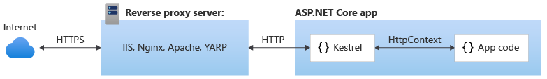

# Introduction to Kestrel web server implementation in ASP.NET Core

By [Tom Dykstra](https://github.com/tdykstra), [Chris Ross](https://github.com/Tratcher), and [Stephen Halter](https://twitter.com/halter73)

Kestrel is a cross-platform [web server for ASP.NET Core](index.md) based on [libuv](https://github.com/libuv/libuv), a cross-platform asynchronous I/O library. Kestrel is the web server that is included by default in ASP.NET Core project templates. 

Kestrel supports the following features:

  * HTTPS
  * Opaque upgrade used to enable [WebSockets](https://github.com/aspnet/websockets)
  * Unix sockets for high performance behind Nginx 

Kestrel is supported on all platforms and versions that .NET Core supports.

# [ASP.NET Core 2.x](#tab/aspnetcore2x)

[View or download sample code for 2.x](https://github.com/aspnet/Docs/tree/master/aspnetcore/fundamentals/servers/kestrel/sample2)

# [ASP.NET Core 1.x](#tab/aspnetcore1x)

[View or download sample code for 1.x](https://github.com/aspnet/Docs/tree/master/aspnetcore/fundamentals/servers/kestrel/sample1)

---

## When to use Kestrel with a reverse proxy

# [ASP.NET Core 2.x](#tab/aspnetcore2x)

You can use Kestrel by itself or with a *reverse proxy server*, such as IIS, Nginx, or Apache. A reverse proxy server receives HTTP requests from the Internet and forwards them to Kestrel after some preliminary handling.




Either configuration &mdash; with or without a reverse proxy server &mdash; can also be used if Kestrel is exposed only to an internal network.

# [ASP.NET Core 1.x](#tab/aspnetcore1x)

If your application accepts requests only from an internal network, you can use Kestrel by itself.


If you expose your application to the Internet, you must use IIS, Nginx, or Apache as a *reverse proxy server*. A reverse proxy server receives HTTP requests from the Internet and forwards them to Kestrel after some preliminary handling.


A reverse proxy is required for edge deployments (exposed to traffic from the Internet) for security reasons. The 1.x versions of Kestrel don't have a full complement of defenses against attacks. This includes but isn't limited to appropriate timeouts, size limits, and concurrent connection limits.

---

A scenario that requires a reverse proxy is when you have multiple applications that share the same IP and port running on a single server. That doesn't work with Kestrel directly because Kestrel doesn't support sharing the same IP and port between multiple processes. When you configure Kestrel to listen on a port, it handles all traffic for that port regardless of host header. A reverse proxy that can share ports must then forward to Kestrel on a unique IP and port.

Even if a reverse proxy server isn't required, using one might be a good choice for other reasons:

* It can limit your exposed surface area.
* It provides an optional additional layer of configuration and defense.
* It might integrate better with existing infrastructure.
* It simplifies load balancing and SSL set-up. Only your reverse proxy server requires an SSL certificate, and that server can communicate with your application servers on the internal network using plain HTTP.

## How to use Kestrel in ASP.NET Core apps

# [ASP.NET Core 2.x](#tab/aspnetcore2x)

The [Microsoft.AspNetCore.Server.Kestrel](https://www.nuget.org/packages/Microsoft.AspNetCore.Server.Kestrel/) package is included in the [Microsoft.AspNetCore.All metapackage](xref:fundamentals/metapackage).

ASP.NET Core project templates use Kestrel by default. In *Program.cs*, the template code calls `CreateDefaultBuilder`, which calls [UseKestrel](https://docs.microsoft.com/aspnet/core/api/microsoft.aspnetcore.hosting.webhostbuilderkestrelextensions#Microsoft_AspNetCore_Hosting_WebHostBuilderKestrelExtensions_UseKestrel_Microsoft_AspNetCore_Hosting_IWebHostBuilder_) behind the scenes.

[!code-csharp[](kestrel/sample2/Program.cs?name=snippet_DefaultBuilder&highlight=7)]

If you need to configure Kestrel options, call `UseKestrel` in *Program.cs* as shown in the following example:

[!code-csharp[](kestrel/sample2/Program.cs?name=snippet_DefaultBuilder&highlight=9-16)]

# [ASP.NET Core 1.x](#tab/aspnetcore1x)

Install the [Microsoft.AspNetCore.Server.Kestrel](https://www.nuget.org/packages/Microsoft.AspNetCore.Server.Kestrel/) NuGet package.

Call the [UseKestrel](https://docs.microsoft.com/aspnet/core/api/microsoft.aspnetcore.hosting.webhostbuilderkestrelextensions#Microsoft_AspNetCore_Hosting_WebHostBuilderKestrelExtensions_UseKestrel_Microsoft_AspNetCore_Hosting_IWebHostBuilder_) extension method on `WebHostBuilder` in your `Main` method, specifying any [Kestrel options](https://docs.microsoft.com/aspnet/core/api/microsoft.aspnetcore.server.kestrel.kestrelserveroptions) that you need, as shown in the next section.

[!code-csharp[](kestrel/sample1/Program.cs?name=snippet_Main&highlight=13-19)]

---

### Kestrel options

# [ASP.NET Core 2.x](#tab/aspnetcore2x)

The Kestrel web server has constraint configuration options that are especially useful in Internet-facing deployments. Here are some of the limits you can set:

- Maximum client connections
- Maximum request body size
- Minimum request body data rate

You set these constraints and others in the `Limits` property of the [KestrelServerOptions](https://github.com/aspnet/KestrelHttpServer/blob/rel/2.0.0/src/Microsoft.AspNetCore.Server.Kestrel.Core/KestrelServerOptions.cs) class. The `Limits` property holds an instance of the [KestrelServerLimits](https://github.com/aspnet/KestrelHttpServer/blob/rel/2.0.0/src/Microsoft.AspNetCore.Server.Kestrel.Core/KestrelServerLimits.cs) class. 

**Maximum client connections**

The maximum number of concurrent open TCP connections can be set for the entire application with the following code:

[!code-csharp[](kestrel/sample2/Program.cs?name=snippet_Limits&highlight=3-4)]

There's a separate limit for connections that have been upgraded from HTTP or HTTPS to another protocol (for example, on a WebSockets request). After a connection is upgraded, it isn't counted against the `MaxConcurrentConnections` limit. 

The maximum number of connections is unlimited (null) by default.

**Maximum request body size**

The default maximum request body size is 30,000,000 bytes, which is approximately 28.6MB. 

The recommended way to override the limit in an ASP.NET Core MVC app is to use the [RequestSizeLimit](https://github.com/aspnet/Mvc/blob/rel/2.0.0/src/Microsoft.AspNetCore.Mvc.Core/RequestSizeLimitAttribute.cs) attribute on an action method:

```csharp
[RequestSizeLimit(100000000)]
public IActionResult MyActionMethod()
```

Here's an example that shows how to configure the constraint for the entire application, every request:

[!code-csharp[](kestrel/sample2/Program.cs?name=snippet_Limits&highlight=5)]

You can override the setting on a specific request in middleware:

[!code-csharp[](kestrel/sample2/Startup.cs?name=snippet_Limits&highlight=3-4)]
 
An exception is thrown if you try to configure the limit on a request after the application has started reading the request. There's an `IsReadOnly` property that tells you if the `MaxRequestBodySize` property is in read-only state, meaning it's too late to configure the limit.

**Minimum request body data rate**

Kestrel checks every second if data is coming in at the specified rate in bytes/second. If the rate drops below the minimum, the connection is timed out. The grace period is the amount of time that Kestrel gives the client to increase its send rate up to the minimum; the rate is not checked during that time. The grace period helps avoid dropping connections that are initially sending data at a slow rate due to TCP slow-start.

The default minimum rate is 240 bytes/second, with a 5 second grace period.

A minimum rate also applies to the response. The code to set the request limit and the response limit is the same except for having `RequestBody` or `Response` in the property and interface names. 

Here's an example that shows how to configure the minimum data rates in *Program.cs*:

[!code-csharp[](kestrel/sample2/Program.cs?name=snippet_Limits&highlight=6-9)]

You can configure the rates per request in middleware:

[!code-csharp[](kestrel/sample2/Startup.cs?name=snippet_Limits&highlight=5-8)]

For information about other Kestrel options, see the following classes:

* [KestrelServerOptions](https://github.com/aspnet/KestrelHttpServer/blob/rel/2.0.0/src/Microsoft.AspNetCore.Server.Kestrel.Core/KestrelServerOptions.cs)
* [KestrelServerLimits](https://github.com/aspnet/KestrelHttpServer/blob/rel/2.0.0/src/Microsoft.AspNetCore.Server.Kestrel.Core/KestrelServerLimits.cs)
* [ListenOptions](https://github.com/aspnet/KestrelHttpServer/blob/rel/2.0.0/src/Microsoft.AspNetCore.Server.Kestrel.Core/ListenOptions.cs)

# [ASP.NET Core 1.x](#tab/aspnetcore1x)

For information about Kestrel options, see [KestrelServerOptions class](https://docs.microsoft.com/aspnet/core/api/microsoft.aspnetcore.server.kestrel.kestrelserveroptions).

---

### Endpoint configuration

# [ASP.NET Core 2.x](#tab/aspnetcore2x)

By default ASP.NET Core binds to `http://localhost:5000`. You configure URL prefixes and ports for Kestrel to listen on by calling `Listen` or `ListenUnixSocket` methods on `KestrelServerOptions`. (`UseUrls`, the `urls` command-line argument, and the ASPNETCORE_URLS environment variable also work but have the limitations noted [later in this article](#useurls-limitations).)

**Bind to a TCP socket**

The `Listen` method binds to a TCP socket, and an options lambda lets you configure an SSL certificate:

[!code-csharp[](kestrel/sample2/Program.cs?name=snippet_DefaultBuilder&highlight=9-16)]

Notice how this example configures SSL for a particular endpoint by using [ListenOptions](https://github.com/aspnet/KestrelHttpServer/blob/rel/2.0.0/src/Microsoft.AspNetCore.Server.Kestrel.Core/ListenOptions.cs). You can use the same API to configure other Kestrel settings for particular endpoints.

[!INCLUDE[How to make an SSL cert](../../includes/make-ssl-cert.md)]

**Bind to a Unix socket**

You can listen on a Unix socket for improved performance with Nginx, as shown in this example:

[!code-csharp[](kestrel/sample2/Program.cs?name=snippet_UnixSocket)]

**Port 0**

If you specify port number 0, Kestrel dynamically binds to an available port. The following example shows how to determine which port Kestrel actually bound to at runtime:

[!code-csharp[](kestrel/sample2/Startup.cs?name=snippet_Configure&highlight=3,13,16-17)]

<a id="useurls-limitations"></a>

**UseUrls limitations**

You can configure endpoints by calling the `UseUrls` method or using the `urls` command-line argument or the ASPNETCORE_URLS environment variable. These methods are useful if you want your code to work with servers other than Kestrel. However, be aware of these limitations:

* You can't use SSL with these methods.
* If you use both the `Listen` method and `UseUrls`, the `Listen` endpoints override the `UseUrls` endpoints.

**Endpoint configuration for IIS**

If you use IIS, the URL bindings for IIS override any bindings that you set by calling either `Listen` or `UseUrls`. For more information, see [Introduction to ASP.NET Core Module](aspnet-core-module.md).

# [ASP.NET Core 1.x](#tab/aspnetcore1x)

By default ASP.NET Core binds to `http://localhost:5000`. You can configure URL prefixes and ports for Kestrel to listen on by using the `UseUrls` extension method, the `urls` command-line argument, or the ASP.NET Core configuration system. For more information about these methods, see [Hosting](../../fundamentals/hosting.md). For information about how URL binding works when you use IIS as a reverse proxy, see [ASP.NET Core Module](aspnet-core-module.md). 

---

### URL prefixes

If you call `UseUrls` or use the `urls` command-line argument or ASPNETCORE_URLS environment variable, the URL prefixes can be in any of the following formats. 

# [ASP.NET Core 2.x](#tab/aspnetcore2x)

Only HTTP URL prefixes are valid; Kestrel does not support SSL when you configure URL bindings by using `UseUrls`.

* IPv4 address with port number

  ```
  http://65.55.39.10:80/
  ```

  0.0.0.0 is a special case that binds to all IPv4 addresses.


* IPv6 address with port number

  ```
  http://[0:0:0:0:0:ffff:4137:270a]:80/ 
  ```

  [::] is the IPv6 equivalent of IPv4 0.0.0.0.


* Host name with port number

  ```
  http://contoso.com:80/
  http://*:80/
  ```

  Host names, *, and +, are not special. Anything that is not a recognized IP address or "localhost" will bind to all IPv4 and IPv6 IPs. If you need to bind different host names to different ASP.NET Core applications on the same port, use [HTTP.sys](httpsys.md) or a reverse proxy server such as IIS, Nginx, or Apache.

* "Localhost" name with port number or loopback IP with port number

  ```
  http://localhost:5000/
  http://127.0.0.1:5000/
  http://[::1]:5000/
  ```

  When `localhost` is specified, Kestrel tries to bind to both IPv4 and IPv6 loopback interfaces. If the requested port is in use by another service on either loopback interface, Kestrel fails to start. If either loopback interface is unavailable for any other reason (most commonly because IPv6 is not supported), Kestrel logs a warning. 

# [ASP.NET Core 1.x](#tab/aspnetcore1x)

* IPv4 address with port number

  ```
  http://65.55.39.10:80/
  https://65.55.39.10:443/
  ```

  0.0.0.0 is a special case that binds to all IPv4 addresses.


* IPv6 address with port number

  ```
  http://[0:0:0:0:0:ffff:4137:270a]:80/ 
  https://[0:0:0:0:0:ffff:4137:270a]:443/ 
  ```

  [::] is the IPv6 equivalent of IPv4 0.0.0.0.


* Host name with port number

  ```
  http://contoso.com:80/
  http://*:80/
  https://contoso.com:443/
  https://*:443/
  ```

  Host names, \*, and + aren't special. Anything that isn't a recognized IP address or "localhost" binds to all IPv4 and IPv6 IPs. If you need to bind different host names to different ASP.NET Core applications on the same port, use [WebListener](weblistener.md) or a reverse proxy server such as IIS, Nginx, or Apache.

* "Localhost" name with port number or loopback IP with port number

  ```
  http://localhost:5000/
  http://127.0.0.1:5000/
  http://[::1]:5000/
  ```

  When `localhost` is specified, Kestrel tries to bind to both IPv4 and IPv6 loopback interfaces. If the requested port is in use by another service on either loopback interface, Kestrel fails to start. If either loopback interface is unavailable for any other reason (most commonly because IPv6 is not supported), Kestrel logs a warning. 

* Unix socket

  ```
  http://unix:/run/dan-live.sock  
  ```

**Port 0**

If you specify port number 0, Kestrel dynamically binds to an available port. Binding to port 0 is allowed for any host name or IP except for `localhost` name.

The following example shows how to determine which port Kestrel actually bound to at runtime:

[!code-csharp[](kestrel/sample1/Startup.cs?name=snippet_Configure)]

**URL prefixes for SSL**

Be sure to include URL prefixes with `https:` if you call the `UseHttps` extension method, as shown below.

```csharp
var host = new WebHostBuilder() 
    .UseKestrel(options => 
    { 
        options.UseHttps("testCert.pfx", "testPassword"); 
    }) 
   .UseUrls("http://localhost:5000", "https://localhost:5001") 
   .UseContentRoot(Directory.GetCurrentDirectory()) 
   .UseStartup<Startup>() 
   .Build(); 
```

> [!NOTE]
> HTTPS and HTTP cannot be hosted on the same port.

[!INCLUDE[How to make an SSL cert](../../includes/make-ssl-cert.md)]

---
## Next steps

For more information, see the following resources:

# [ASP.NET Core 2.x](#tab/aspnetcore2x)

* [Sample app for 2.x](https://github.com/aspnet/Docs/tree/master/aspnetcore/fundamentals/servers/kestrel/sample2)
* [Kestrel source code](https://github.com/aspnet/KestrelHttpServer)

# [ASP.NET Core 1.x](#tab/aspnetcore1x)

* [Sample app for 1.x](https://github.com/aspnet/Docs/tree/master/aspnetcore/fundamentals/servers/kestrel/sample1)
* [Kestrel source code](https://github.com/aspnet/KestrelHttpServer)

---
