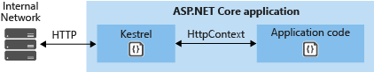
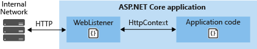

# Servers overview for ASP.NET Core

By [Tom Dykstra](http://github.com/tdykstra), [Steve Smith](http://ardalis.com), [Stephen Halter](https://twitter.com/halter73), and [Chris Ross](https://github.com/Tratcher) 

An ASP.NET Core application runs with an in-process HTTP server implementation. The server implementation listens for HTTP requests and surfaces them to the application as sets of [request features](https://docs.asp.net/en/latest/fundamentals/request-features.html) composed into an `HttpContext`.

ASP.NET Core ships two server implementations:

* [Kestrel](kestrel.md) is a cross-platform HTTP server based on [libuv](https://github.com/libuv/libuv), a cross-platform asynchronous I/O library.

* [WebListener](weblistener.md) is a Windows-only HTTP server based on the [Http.Sys kernel driver](https://msdn.microsoft.com/en-us/library/windows/desktop/aa364510.aspx).

## Kestrel

Kestrel is the web server that is included by default in ASP.NET Core new-project templates. If your application accepts requests only from an internal network, you can use Kestrel by itself.

If you expose your application to the Internet, we recommend that you use IIS, Nginx, or Apache as a *reverse proxy server*. A reverse proxy server receives HTTP requests from the Internet and forwards them to Kestrel after some preliminary handling, as shown in the following diagram.

The most important reason for using a reverse proxy for edge deployments (exposed to traffic from the Internet) is security. Kestrel is relatively new and does not yet have a full complement of defenses against attacks. This includes but isn't limited to appropriate timeouts, size limits, and concurrent connection limits. For more information about when to use Kestrel with a reverse proxy, see [Kestrel](kestrel.md).

### IIS with Kestrel

When you use IIS or IIS Express as a reverse proxy for ASP.NET Core, the ASP.NET Core application runs in a process separate from the IIS worker process. In the IIS process, a special IIS module runs to coordinate the reverse proxy relationship.  This is the *ASP.NET Core Module*. The primary functions of the ASP.NET Core Module are to start the ASP.NET Core application, restart it when it crashes, and forward HTTP traffic to it. For more information, see [ASP.NET Core Module](aspnet-core-module.md). 

### Nginx with Kestrel

For information about how to use Nginx on Linux as a reverse proxy server for Kestrel, see [Publish to a Linux Production Environment](../../publishing/linuxproduction.md).

### Apache with Kestrel

For information about how to use Apache on Linux as a reverse proxy server for Kestrel, see [Using Apache Web Server as a reverse proxy](../../publishing/apache-proxy.md).

## WebListener

If you run your ASP.NET Core app on Windows, WebListener is an alternative that you can use for scenarios where you want to expose your app to the Internet but you can't use IIS. 

WebListener can also be used in place of Kestrel for applications that are exposed only to an internal network, if you need one of its features that Kestrel doesn't support. 

For internal network scenarios, Kestrel is generally recommended for best performance, but in some scenarios you might want to use a feature that only WebListener offers. For information about WebListener features, see [WebListener](weblistener.md).

## Notes about ASP.NET Core server infrastructure

The [`IApplicationBuilder`](http://docs.asp.net/projects/api/en/latest/autoapi/Microsoft/AspNetCore/Builder/IApplicationBuilder/index.html#Microsoft.AspNetCore.Builder.IApplicationBuilder.md) available in the `Startup` class `Configure` method exposes the `ServerFeatures` property of type [`IFeatureCollection`](http://docs.asp.net/projects/api/en/latest/autoapi/Microsoft/AspNetCore/Http/Features/IFeatureCollection/index.html#Microsoft.AspNetCore.Http.Features.IFeatureCollection.md). Kestrel and WebListener both expose only a single feature, [`IServerAddressesFeature`](http://docs.asp.net/projects/api/en/latest/autoapi/Microsoft/AspNetCore/Hosting/Server/Features/IServerAddressesFeature/index.html#Microsoft.AspNetCore.Hosting.Server.Features.IServerAddressesFeature.md), but different server implementations may expose additional functionality.

`IServerAddressesFeature` can be used to find out which port the server implementation has bound to at runtime.

## Custom servers

You can create custom server implementations to use in place of Kestrel or WebListener. The [Open Web Interface for .NET (OWIN) guide](../owin.md) demonstrates how to write a [Nowin](https://github.com/Bobris/Nowin)-based [`IServer`](http://docs.asp.net/projects/api/en/latest/autoapi/Microsoft/AspNetCore/Hosting/Server/IServer/index.html#Microsoft.AspNetCore.Hosting.Server.IServer.md) implementation. You're free to implement just the feature interfaces your application needs, though at a minimum you must support [`IHttpRequestFeature`](http://docs.asp.net/projects/api/en/latest/autoapi/Microsoft/AspNetCore/Http/Features/IHttpRequestFeature/index.html#Microsoft.AspNetCore.Http.Features.IHttpRequestFeature.md) and [`IHttpResponseFeature`](http://docs.asp.net/projects/api/en/latest/autoapi/Microsoft/AspNetCore/Http/Features/IHttpResponseFeature/index.html#Microsoft.AspNetCore.Http.Features.IHttpResponseFeature.md).

## Next steps

For more information, see the following resources:

- [Kestrel](kestrel.md)
- [Kestrel with IIS](aspnet-core-module.md)
- [Kestrel with Nginx](../../publishing/linuxproduction.md)
- [Kestrel with Apache](../../publishing/apache-proxy.md)
- [WebListener](weblistener.md)
