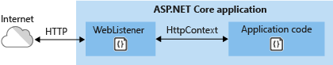

# WebListener web server implementation in ASP.NET Core

By [Tom Dykstra](https://github.com/tdykstra) and [Chris Ross](https://github.com/Tratcher)

> [!NOTE]
> This topic applies only to ASP.NET Core 1.x. In ASP.NET Core 2.0, WebListener is named [HTTP.sys](httpsys.md).

WebListener is a [web server for ASP.NET Core](index.md) that runs only on Windows. It's built on the [Http.Sys kernel mode driver](https://msdn.microsoft.com/library/windows/desktop/aa364510.aspx). WebListener is an alternative to [Kestrel](kestrel.md) that can be used for direct connection to the Internet without relying on IIS as a reverse proxy server. In fact, **WebListener can't be used with IIS or IIS Express, as it isn't compatible with the [ASP.NET Core Module](aspnet-core-module.md).**

Although WebListener was developed for ASP.NET Core, it can be used directly in any .NET Core or .NET Framework application via the [Microsoft.Net.Http.Server](https://www.nuget.org/packages/Microsoft.Net.Http.Server/) NuGet package.

WebListener supports the following features:

- [Windows Authentication](xref:security/authentication/windowsauth)
- Port sharing
- HTTPS with SNI
- HTTP/2 over TLS (Windows 10)
- Direct file transmission
- Response caching
- WebSockets (Windows 8)

Supported Windows versions:

- Windows 7 and Windows Server 2008 R2 and later

[View or download sample code](https://github.com/aspnet/Docs/tree/master/aspnetcore/fundamentals/servers/weblistener/sample)

## When to use WebListener

WebListener is useful for deployments where you need to expose the server directly to the Internet without using IIS.



Because it's built on Http.Sys, WebListener doesn't require a reverse proxy server for protection against attacks. Http.Sys is mature technology that protects against many kinds of attacks and provides the robustness, security, and scalability of a full-featured web server. IIS itself runs as an HTTP listener on top of Http.Sys. 

WebListener is also a good choice for internal deployments when you need one of the features it offers that you can't get by using Kestrel.


## How to use WebListener

Here's an overview of setup tasks for the host OS and your ASP.NET Core application.

### Configure Windows Server

* Install the version of .NET that your application requires, such as [.NET Core](https://download.microsoft.com/download/0/A/3/0A372822-205D-4A86-BFA7-084D2CBE9EDF/DotNetCore.1.0.1-SDK.1.0.0.Preview2-003133-x64.exe) or .NET Framework 4.5.1.

* Preregister URL prefixes to bind to WebListener, and set up SSL certificates

   If you don't preregister URL prefixes in Windows, you have to run your application with administrator privileges. The only exception is if you bind to localhost using HTTP (not HTTPS) with a port number greater than 1024; in that case administrator privileges aren't required.

   For details, see [How to preregister prefixes and configure SSL](#preregister-url-prefixes-and-configure-ssl) later in this article.

* Open firewall ports to allow traffic to reach WebListener.

   You can use netsh.exe or [PowerShell cmdlets](https://technet.microsoft.com/library/jj554906).

There are also [Http.Sys registry settings](https://support.microsoft.com/kb/820129).

### Configure your ASP.NET Core application

* Install the NuGet package [Microsoft.AspNetCore.Server.WebListener](https://www.nuget.org/packages/Microsoft.AspNetCore.Server.WebListener/). This also installs [Microsoft.Net.Http.Server](https://www.nuget.org/packages/Microsoft.Net.Http.Server/) as a dependency.

* Call the [`UseWebListener`](https://docs.microsoft.com/aspnet/core/api) extension method on [WebHostBuilder](https://docs.microsoft.com/aspnet/core/api) in your `Main` method, specifying any WebListener [options](https://github.com/aspnet/HttpSysServer/blob/rel/1.1.2/src/Microsoft.AspNetCore.Server.WebListener/WebListenerOptions.cs) and [settings](https://github.com/aspnet/HttpSysServer/blob/rel/1.1.2/src/Microsoft.Net.Http.Server/WebListenerSettings.cs) that you need, as shown in the following example:

  [!code-csharp[](weblistener/sample/Program.cs?name=snippet_Main&highlight=13-17)]

* Configure URLs and ports to listen on 

  By default ASP.NET Core binds to `http://localhost:5000`. To configure URL prefixes and ports, you can use the `UseURLs` extension method, the `urls` command-line argument or the ASP.NET Core configuration system. For more information, see [Hosting](../../fundamentals/hosting.md).

  Web Listener uses the [Http.Sys prefix string formats](https://msdn.microsoft.com/library/windows/desktop/aa364698.aspx). There are no prefix string format requirements that are specific to WebListener.

  > [!NOTE]
  > Make sure that you specify the same prefix strings in `UseUrls` that you preregister on the server. 

* Make sure your application is not configured to run IIS or IIS Express.

  In Visual Studio, the default launch profile is for IIS Express.  To run the project as a console application you have to manually change the selected profile, as shown in the following screen shot.

  

## How to use WebListener outside of ASP.NET Core

* Install the [Microsoft.Net.Http.Server](https://www.nuget.org/packages/Microsoft.Net.Http.Server/) NuGet package.

* [Preregister URL prefixes to bind to WebListener, and set up SSL certificates](#preregister-url-prefixes-and-configure-ssl) as you would for use in ASP.NET Core.

There are also [Http.Sys registry settings](https://support.microsoft.com/kb/820129).


Here's a code sample that demonstrates WebListener use outside of ASP.NET Core:

```csharp
var settings = new WebListenerSettings();
settings.UrlPrefixes.Add("http://localhost:8080");

using (WebListener listener = new WebListener(settings))
{
    listener.Start();

    while (true)
    {
        var context = await listener.AcceptAsync();
        byte[] bytes = Encoding.ASCII.GetBytes("Hello World: " + DateTime.Now);
        context.Response.ContentLength = bytes.Length;
        context.Response.ContentType = "text/plain";

        await context.Response.Body.WriteAsync(bytes, 0, bytes.Length);
        context.Dispose();
    }
}
```

## Preregister URL prefixes and configure SSL

Both IIS and WebListener rely on the underlying Http.Sys kernel mode driver to listen for requests and do initial processing. In IIS, the management UI gives you a relatively easy way to configure everything. However, if you're using WebListener you need to configure Http.Sys yourself. The built-in tool for doing that is netsh.exe. 

The most common tasks you need to use netsh.exe for are reserving URL prefixes and assigning SSL certificates.

NetSh.exe is not an easy tool to use for beginners. The following example shows the bare minimum needed to reserve URL prefixes for ports 80 and 443:

```console
netsh http add urlacl url=http://+:80/ user=Users
netsh http add urlacl url=https://+:443/ user=Users
```

The following example shows how to assign an SSL certificate:

```console
netsh http add sslcert ipport=0.0.0.0:443 certhash=MyCertHash_Here appid={00000000-0000-0000-0000-000000000000}".
```

Here is the official reference documentation:

* [Netsh Commands for Hypertext Transfer Protocol (HTTP)](https://technet.microsoft.com/library/cc725882.aspx)
* [UrlPrefix Strings](https://msdn.microsoft.com/library/windows/desktop/aa364698.aspx)

The following resources provide detailed instructions for several scenarios. Articles that refer to `HttpListener` apply equally to `WebListener`, as both are based on Http.Sys.

* [How to: Configure a Port with an SSL Certificate](https://docs.microsoft.com/dotnet/framework/wcf/feature-details/how-to-configure-a-port-with-an-ssl-certificate)
* [HTTPS Communication - HttpListener based Hosting and Client Certification](http://sunshaking.blogspot.com/2012/11/https-communication-httplistener-based.html) This is a third-party blog and is fairly old but still has useful information.
* [How To: Walkthrough Using HttpListener or Http Server unmanaged code (C++) as an SSL Simple Server](https://blogs.msdn.microsoft.com/jpsanders/2009/09/29/how-to-walkthrough-using-httplistener-or-http-server-unmanaged-code-c-as-an-ssl-simple-server/) This too is an older blog with useful information.
* [How Do I Set Up A .NET Core WebListener With SSL?](https://blogs.msdn.microsoft.com/timomta/2016/11/04/how-do-i-set-up-a-net-core-weblistener-with-ssl/)

Here are some third-party tools that can be easier to use than the netsh.exe command line. These are not provided by or endorsed by Microsoft. The tools run as administrator by default, since netsh.exe itself requires administrator privileges.

* [http.sys Manager](http://httpsysmanager.codeplex.com/) provides UI for listing and configuring SSL certificates and options, prefix reservations, and certificate trust lists. 
* [HttpConfig](http://www.stevestechspot.com/ABetterHttpcfg.aspx) lets you list or configure SSL certificates and URL prefixes. The UI is more refined than http.sys Manager and exposes a few more configuration options, but otherwise it provides similar functionality. It cannot create a new certificate trust list (CTL), but can assign existing ones.

For generating self-signed SSL certificates, Microsoft provides command-line tools: [MakeCert.exe](https://msdn.microsoft.com/library/windows/desktop/aa386968) and the PowerShell cmdlet [New-SelfSignedCertificate](https://technet.microsoft.com/itpro/powershell/windows/pki/new-selfsignedcertificate). There are also third-party UI tools that make it easier for you to generate self-signed SSL certificates:

* [SelfCert](https://www.pluralsight.com/blog/software-development/selfcert-create-a-self-signed-certificate-interactively-gui-or-programmatically-in-net)
* [Makecert UI](http://makecertui.codeplex.com/)

## Next steps

For more information, see the following resources:

* [Sample app for this article](https://github.com/aspnet/Docs/tree/master/aspnetcore/fundamentals/servers/weblistener/sample)
* [WebListener source code](https://github.com/aspnet/HttpSysServer/)
* [Hosting](../hosting.md)
