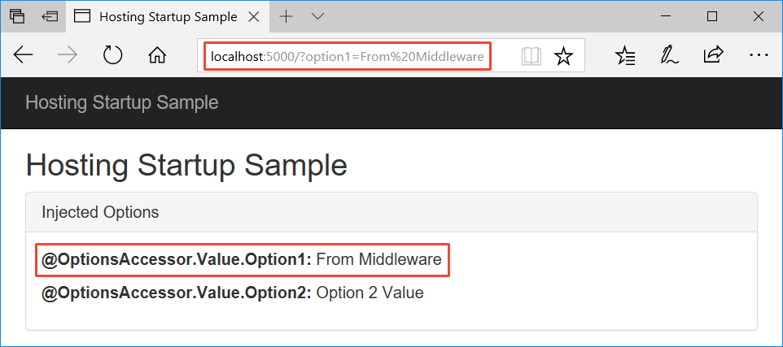

# Application Startup in ASP.NET Core

By [Steve Smith](https://ardalis.com), [Tom Dykstra](https://github.com/tdykstra), and [Luke Latham](https://github.com/guardrex)

The `Startup` class configures services and the application's request pipeline.

## The Startup class

ASP.NET Core apps require a `Startup` class, which is named `Startup` by convention. You specify the startup class name in the `Main` program's [WebHostBuilderExtensions](https://docs.microsoft.com/aspnet/core/api/microsoft.aspnetcore.hosting.webhostbuilderextensions) [`UseStartup<TStartup>`](https://docs.microsoft.com/aspnet/core/api/microsoft.aspnetcore.hosting.webhostbuilderextensions#Microsoft_AspNetCore_Hosting_WebHostBuilderExtensions_UseStartup__1_Microsoft_AspNetCore_Hosting_IWebHostBuilder_) method. See [Hosting](xref:fundamentals/hosting) to learn more about `WebHostBuilder`, which runs before `Startup`.

You can define separate `Startup` classes for different environments, and the appropriate one will be selected at runtime. If you specify `startupAssembly` in the [WebHost configuration](https://docs.microsoft.com/aspnet/core/fundamentals/hosting?tabs=aspnetcore2x#configuring-a-host) or options, hosting will load that startup assembly and search for a `Startup` or `Startup[Environment]` type. The class whose name suffix matches the current environment will be prioritized, so if the app is run in the *Development* environment, and includes both a `Startup` and a `StartupDevelopment` class, the `StartupDevelopment` class will be used. See [FindStartupType](https://github.com/aspnet/Hosting/blob/rel/1.1.0/src/Microsoft.AspNetCore.Hosting/Internal/StartupLoader.cs) in `StartupLoader` and [Working with multiple environments](environments.md#startup-conventions).

Alternatively, you can define a fixed `Startup` class that will be used regardless of the environment by calling `UseStartup<TStartup>`. This is the recommended approach.

The `Startup` class constructor can accept dependencies that are provided through [dependency injection](xref:fundamentals/dependency-injection). A common approach is to use `IHostingEnvironment` to set up [configuration](xref:fundamentals/configuration) sources.

The `Startup` class must include a `Configure` method and can optionally include a `ConfigureServices` method, both of which are called when the application starts. The class can also include [environment-specific versions of these methods](xref:fundamentals/environments#startup-conventions). `ConfigureServices`, if present, is called before `Configure`.

Learn about [handling exceptions during application startup](xref:fundamentals/error-handling#startup-exception-handling).

## The ConfigureServices method

The [ConfigureServices](https://docs.microsoft.com/aspnet/core/api/microsoft.aspnetcore.hosting.startupbase#Microsoft_AspNetCore_Hosting_StartupBase_ConfigureServices_Microsoft_Extensions_DependencyInjection_IServiceCollection_) method is optional; but if used, it's called before the `Configure` method by the web host. The web host may configure some services before ``Startup`` methods are called (see [hosting](xref:fundamentals/hosting)). By convention, [Configuration options](xref:fundamentals/configuration) are set in this method.

For features that require substantial setup there are `Add[Service]` extension methods on [IServiceCollection](https://docs.microsoft.com/aspnet/core/api/microsoft.extensions.dependencyinjection.iservicecollection). This example from the default web site template configures the app to use services for Entity Framework, Identity, and MVC:

[!code-csharp[Main](../common/samples/WebApplication1/Startup.cs?highlight=4,7,11&start=40&end=55)]

Adding services to the services container makes them available within your application via [dependency injection](xref:fundamentals/dependency-injection).

## Services Available in Startup

ASP.NET Core dependency injection provides services during an application's startup. You can request these services by including the appropriate interface as a parameter on your `Startup` class's constructor or its `Configure` method. The `ConfigureServices` method only takes an `IServiceCollection` parameter (but any registered service can be retrieved from this collection, so additional parameters are not necessary).

Below are some of the services typically requested by `Startup` methods:

* In the constructor:  `IHostingEnvironment`, `ILogger<Startup>`
* In `ConfigureServices`:  `IServiceCollection`
* In `Configure`:  `IApplicationBuilder`, `IHostingEnvironment`, `ILoggerFactory`

Any services added by the ``WebHostBuilder`` ``ConfigureServices`` method may be requested by the ``Startup`` class constructor or its ``Configure`` method. Use `WebHostBuilder` to provide any services you need during `Startup` methods.

## The Configure method

The `Configure` method is used to specify how the ASP.NET application will respond to HTTP requests. The request pipeline is configured by adding [middleware](middleware.md) components to an `IApplicationBuilder` instance that is provided by dependency injection.

In the following example from the default web site template, several extension methods are used to configure the pipeline with support for [BrowserLink](http://vswebessentials.com/features/browserlink), error pages, static files, ASP.NET MVC, and Identity.

[!code-csharp[Main](../common/samples/WebApplication1/Startup.cs?highlight=8,9,10,14,17,19,21&start=58&end=84)]

Each `Use` extension method adds a [middleware](xref:fundamentals/middleware) component to the request pipeline. For instance, the `UseMvc` extension method adds the [routing](routing.md) middleware to the request pipeline and configures [MVC](xref:mvc/overview) as the default handler.

For more information about how to use `IApplicationBuilder`, see [Middleware](xref:fundamentals/middleware).

Additional services, like `IHostingEnvironment` and `ILoggerFactory` may also be specified in the method signature, in which case these services will be [injected](dependency-injection.md) if they are available.

## Hosting startup light up feature

An [IHostingStartup](/dotnet/api/microsoft.aspnetcore.hosting.ihostingstartup) implementation allows adding features to an app at startup outside of the app's `Startup` class. For example, tooling can use an `IHostingStartup` implementation to provide additional configuration providers or services to an app on startup.

The [HostingStartupSample app](https://github.com/aspnet/Docs/tree/master/aspnetcore/fundamentals/startup/sample/) ([how to download](xref:tutorials/index#how-to-download-a-sample)) uses `IHostingStartup` to configure [options](xref:fundamentals/configuration/options) in the app's service container.

The sample app's `StartupInjection` class implements `IHostingStartup`. The [Configure](/dotnet/api/microsoft.aspnetcore.hosting.ihostingstartup.configure) method uses an [IWebHostBuilder](/dotnet/api/microsoft.aspnetcore.hosting.iwebhostbuilder) to add an `InjectedOptions` class to the app's service container with assigned values. The [HostingStartupAttribute](/dotnet/api/microsoft.aspnetcore.hosting.hostingstartupattribute) identifies the `StartupInjection` class as an implementation of `IHostingStartup` for loading and execution when building the [IWebHost](/dotnet/api/microsoft.aspnetcore.hosting.iwebhost):

[!code-csharp[Main](startup/sample/StartupInjection.cs?name=snippet1&highlight=1)]

The sample app's Index page injects the options directly into the page for rendering:

[!code-cshtml[Main](startup/sample/Pages/Index.cshtml?highlight=3-4,19-20,23-24)]

When the app is run, the Index page displays the values:

## Startup filters

Use [IStartupFilter](/dotnet/api/microsoft.aspnetcore.hosting.istartupfilter) to configure and control the order of middleware at the beginning or end of an app's [Configure](#the-configure-method) middleware pipeline.

`IStartupFilter` implements a single method, [Configure](/dotnet/api/microsoft.aspnetcore.hosting.istartupfilter.configure), which receives and returns an `Action<IApplicationBuilder>`. An [IApplicationBuilder](/dotnet/api/microsoft.aspnetcore.builder.iapplicationbuilder) defines a class to configure an app's request pipeline. For more information, see [Creating a middleware pipeline with IApplicationBuilder](xref:fundamentals/middleware#creating-a-middleware-pipeline-with-iapplicationbuilder).

Each `IStartupFilter` implements one or more middlewares in the request pipeline. The middlewares are invoked in the order that the `IStartupFilter` implementations are added to the service container.

The [HostingStartupSample app](https://github.com/aspnet/Docs/tree/master/aspnetcore/fundamentals/startup/sample/) ([how to download](xref:tutorials/index#how-to-download-a-sample)) demonstrates how to register a middleware with `IHostingStartup`.

The sample app includes a middleware that sets an options value from a query string parameter:

[!code-csharp[Main](startup/sample/RequestSetOptionsMiddleware.cs?name=snippet1)]

The `RequestSetOptionsMiddleware` is configured in the `RequestSetOptionsStartupFilter` class:

[!code-csharp[Main](startup/sample/RequestSetOptionsStartupFilter.cs?name=snippet1&highlight=7)]

The `IStartupFilter` is registered in the service container in `ConfigureServices`:

[!code-csharp[Main](startup/sample/Startup.cs?name=snippet1&highlight=5)]

When the app is run and a query string parameter for `option1` is provided, the middleware processes the value assignment before the MVC middleware renders the response:

Middleware execution order is set by the order of `IStartupFilter` registrations:

* Multiple `IStartupFilter` implementations may interact with the same objects. If ordering is important, order their `IStartupFilter` service registrations to match the order that their middlewares should run.
* Libraries may add middleware with one or more `IStartupFilter` implementations that run before or after other middleware registered with `IStartupFilter` in the app. To invoke an `IStartupFilter` middleware before a middleware added by a library's `IStartupFilter`, position the service registration before the library is added to the service container. To invoke it afterward, position the service registration after the library is added.
* Middleware specified with `IStartupFilter` may short-circuit requests before higher priority middleware runs. Register the `IStartupFilter` for the short-circuited middleware earlier in the service registrations to ensure that it runs before short-circuiting can occur.

## Additional Resources

* [Working with Multiple Environments](xref:fundamentals/environments)
* [Middleware](xref:fundamentals/middleware)
* [Logging](xref:fundamentals/logging/index)
* [Configuration](xref:fundamentals/configuration)
