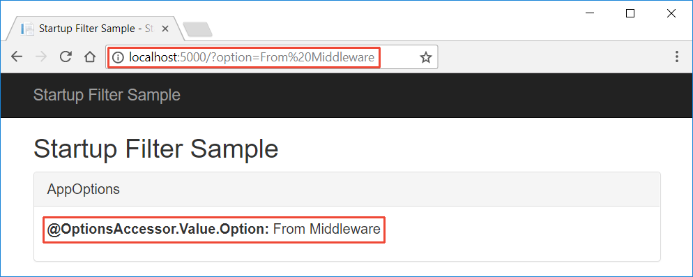

# Application startup in ASP.NET Core

By [Steve Smith](https://ardalis.com), [Tom Dykstra](https://github.com/tdykstra), and [Luke Latham](https://github.com/guardrex)

The `Startup` class configures services and the app's request pipeline.

## The Startup class

ASP.NET Core apps use a `Startup` class, which is named `Startup` by convention. The `Startup` class:

* Can optionally include a [ConfigureServices](/dotnet/api/microsoft.aspnetcore.hosting.startupbase.configureservices) method to configure the app's services.
* Must include a [Configure](/dotnet/api/microsoft.aspnetcore.hosting.startupbase.configure) method to create the app's request processing pipeline.

`ConfigureServices` and `Configure` are called by the runtime when the app starts:

[!code-csharp]

Specify the `Startup` class with the [WebHostBuilderExtensions](/dotnet/api/Microsoft.AspNetCore.Hosting.WebHostBuilderExtensions) [UseStartup&lt;TStartup&gt;](/dotnet/api/microsoft.aspnetcore.hosting.webhostbuilderextensions.usestartup#Microsoft_AspNetCore_Hosting_WebHostBuilderExtensions_UseStartup__1_Microsoft_AspNetCore_Hosting_IWebHostBuilder_) method:

[!code-csharp]

The web host provides some services that are available to the `Startup` class constructor. The app adds additional services via `ConfigureServices`. Both the host and app services are then available in `Configure` and throughout the app.

A common use of [dependency injection](xref:fundamentals/dependency-injection) into the `Startup` class is to inject:

* [IHostingEnvironment](/dotnet/api/Microsoft.AspNetCore.Hosting.IHostingEnvironment) to configure services by environment.
* [IConfiguration](/dotnet/api/microsoft.extensions.configuration.iconfiguration) to read configuration.
* [ILoggerFactory](/dotnet/api/microsoft.extensions.logging.iloggerfactory) to create a logger in `Startup.ConfigureServices`.

[!code-csharp]

An alternative to injecting `IHostingEnvironment` is to use a conventions-based approach. The app can define separate `Startup` classes for different environments (for example, `StartupDevelopment`), and the appropriate `Startup` class is selected at runtime. The class whose name suffix matches the current environment is prioritized. If the app is run in the Development environment and includes both a `Startup` class and a `StartupDevelopment` class, the `StartupDevelopment` class is used. For more information, see [Use multiple environments](xref:fundamentals/environments#environment-based-startup-class-and-methods).

To learn more about `WebHostBuilder`, see the [Hosting](xref:fundamentals/host/index) topic. For information on handling errors during startup, see [Startup exception handling](xref:fundamentals/error-handling#startup-exception-handling).

## The ConfigureServices method

The [ConfigureServices](/dotnet/api/microsoft.aspnetcore.hosting.startupbase.configureservices) method is:

* Optional
* Called by the web host before the `Configure` method to configure the app's services.
* Where [configuration options](xref:fundamentals/configuration/index) are set by convention.

Adding services to the service container makes them available within the app and in the `Configure` method. The services are resolved via [dependency injection](xref:fundamentals/dependency-injection) or from [IApplicationBuilder.ApplicationServices](/dotnet/api/microsoft.aspnetcore.builder.iapplicationbuilder.applicationservices).

The web host may configure some services before `Startup` methods are called. Details are available in the [Host in ASP.NET Core](xref:fundamentals/host/index) topic.

For features that require substantial setup, there are `Add[Service]` extension methods on [IServiceCollection](/dotnet/api/Microsoft.Extensions.DependencyInjection.IServiceCollection). A typical web app registers services for Entity Framework, Identity, and MVC:

[!code-csharp]

::: moniker range=">= aspnetcore-2.1"

### SetCompatibilityVersion for ASP.NET Core MVC

The `SetCompatibilityVersion` method allows an app to opt-in or opt-out of potentially breaking behavior changes introduced in ASP.NET MVC Core 2.1+. These potentially breaking behavior changes are generally in how the MVC subsystem behaves and how **your code** is called by the runtime. By opting in, you get the latest behavior, and the long-term behavior of ASP.NET Core.

The following code sets the compatibility mode to ASP.NET Core 2.1:

[!code-csharp[Main](startup/sampleCompatibility/Startup.cs?name=snippet1)]

We recommend you test your app using the latest version (`CompatibilityVersion.Version_2_1`). We anticipate that most apps won't have breaking behavior changes using the latest version.

Apps that call `SetCompatibilityVersion(CompatibilityVersion.Version_2_0)` are protected from potentially breaking behavior changes introduced in the ASP.NET Core 2.1 MVC and later 2.x versions. This protection:

* Does not apply to all 2.1 and later changes, it's targeted to potentially breaking ASP.NET Core runtime behavior changes in the MVC subsystem.
* Does not extend to the next major version.

The default compatibility for ASP.NET Core 2.1 and later 2.x apps that do **not** call `SetCompatibilityVersion` is 2.0 compatibility. That is, not calling `SetCompatibilityVersion` is the same as calling `SetCompatibilityVersion(CompatibilityVersion.Version_2_0)`.

The following code sets the compatibility mode to ASP.NET Core 2.1, except for the following behaviors:

* [AllowCombiningAuthorizeFilters](https://github.com/aspnet/Mvc/blob/master/src/Microsoft.AspNetCore.Mvc.Core/MvcOptions.cs)
* [InputFormatterExceptionPolicy](https://github.com/aspnet/Mvc/blob/master/src/Microsoft.AspNetCore.Mvc.Core/MvcOptions.cs)

[!code-csharp[Main](startup/sampleCompatibility/Startup2.cs?name=snippet1)]

For apps that encounter breaking behavior changes, using the appropriate compatibility switches:

* Allows you to use the latest release and opt out of specific breaking behavior changes.
* Gives you time to update your app so it works with the latest changes.

The [MvcOptions](https://github.com/aspnet/Mvc/blob/master/src/Microsoft.AspNetCore.Mvc.Core/MvcOptions.cs) class source comments have a good explanation of what changed and why the changes are an improvement for most users.

At some future date, there will be an [ASP.NET Core 3.0 version](https://github.com/aspnet/Home/wiki/Roadmap). Old behaviors supported by compatibility switches will be removed in the 3.0 version. We feel these are positive changes benefitting nearly all users. By introducing these changes now, most apps can benefit now, and the others will have time to update their apps.

::: moniker-end

## The Configure method

The [Configure](/dotnet/api/microsoft.aspnetcore.hosting.startupbase.configure) method is used to specify how the app responds to HTTP requests. The request pipeline is configured by adding [middleware](xref:fundamentals/middleware/index) components to an [IApplicationBuilder](/dotnet/api/microsoft.aspnetcore.builder.iapplicationbuilder) instance. `IApplicationBuilder` is available to the `Configure` method, but it isn't registered in the service container. Hosting creates an `IApplicationBuilder` and passes it directly to `Configure` ([reference source](https://github.com/aspnet/Hosting/blob/release/2.0.0/src/Microsoft.AspNetCore.Hosting/Internal/WebHost.cs#L179-L192)).

The [ASP.NET Core templates](/dotnet/core/tools/dotnet-new) configure the pipeline with support for a developer exception page, [BrowserLink](http://vswebessentials.com/features/browserlink), error pages, static files, and ASP.NET MVC:

[!code-csharp]

Each `Use` extension method adds a middleware component to the request pipeline. For instance, the `UseMvc` extension method adds the [Routing Middleware](xref:fundamentals/routing) to the request pipeline and configures [MVC](xref:mvc/overview) as the default handler.

Each middleware component in the request pipeline is responsible for invoking the next component in the pipeline or short-circuiting the chain, if appropriate. If short-circuiting doesn't occur along the middleware chain, each middleware has a second chance to process the request before it's sent to the client.

Additional services, such as `IHostingEnvironment` and `ILoggerFactory`, may also be specified in the method signature. When specified, additional services are injected if they're available.

For more information on how to use `IApplicationBuilder` and the order of middleware processing, see [Middleware](xref:fundamentals/middleware/index).

## Convenience methods

[ConfigureServices](/dotnet/api/microsoft.aspnetcore.hosting.iwebhostbuilder.configureservices) and [Configure](/dotnet/api/microsoft.aspnetcore.hosting.webhostbuilderextensions.configure) convenience methods can be used instead of specifying a `Startup` class. Multiple calls to `ConfigureServices` append to one another. Multiple calls to `Configure` use the last method call.

[!code-csharp]

## Startup filters

Use [IStartupFilter](/dotnet/api/microsoft.aspnetcore.hosting.istartupfilter) to configure middleware at the beginning or end of an app's [Configure](#the-configure-method) middleware pipeline. `IStartupFilter` is useful to ensure that a middleware runs before or after middleware added by libraries at the start or end of the app's request processing pipeline.

`IStartupFilter` implements a single method, [Configure](/dotnet/api/microsoft.aspnetcore.hosting.istartupfilter.configure), which receives and returns an `Action<IApplicationBuilder>`. An [IApplicationBuilder](/dotnet/api/microsoft.aspnetcore.builder.iapplicationbuilder) defines a class to configure an app's request pipeline. For more information, see [Create a middleware pipeline with IApplicationBuilder](xref:fundamentals/middleware/index#creating-a-middleware-pipeline-with-iapplicationbuilder).

Each `IStartupFilter` implements one or more middlewares in the request pipeline. The filters are invoked in the order they were added to the service container. Filters may add middleware before or after passing control to the next filter, thus they append to the beginning or end of the app pipeline.

The [sample app](https://github.com/aspnet/Docs/tree/master/aspnetcore/fundamentals/startup/sample/) ([how to download](xref:tutorials/index#how-to-download-a-sample)) demonstrates how to register a middleware with `IStartupFilter`. The sample app includes a middleware that sets an options value from a query string parameter:

[!code-csharp]

The `RequestSetOptionsMiddleware` is configured in the `RequestSetOptionsStartupFilter` class:

[!code-csharp]

The `IStartupFilter` is registered in the service container in `ConfigureServices`:

[!code-csharp]

When a query string parameter for `option` is provided, the middleware processes the value assignment before the MVC middleware renders the response:

Middleware execution order is set by the order of `IStartupFilter` registrations:

* Multiple `IStartupFilter` implementations may interact with the same objects. If ordering is important, order their `IStartupFilter` service registrations to match the order that their middlewares should run.
* Libraries may add middleware with one or more `IStartupFilter` implementations that run before or after other app middleware registered with `IStartupFilter`. To invoke an `IStartupFilter` middleware before a middleware added by a library's `IStartupFilter`, position the service registration before the library is added to the service container. To invoke it afterward, position the service registration after the library is added.

## Adding configuration at startup from an external assembly

An [IHostingStartup](/dotnet/api/microsoft.aspnetcore.hosting.ihostingstartup) implementation allows adding enhancements to an app at startup from an external assembly outside of the app's `Startup` class. For more information, see [Enhance an app from an external assembly](xref:fundamentals/configuration/platform-specific-configuration).

## Additional resources

* <xref:fundamentals/host/index>
* <xref:fundamentals/environments>
* <xref:fundamentals/middleware/index>
* <xref:fundamentals/logging/index>
* <xref:fundamentals/configuration/index>
* [StartupLoader class: FindStartupType method (reference source)](https://github.com/aspnet/Hosting/blob/rel/2.0.0/src/Microsoft.AspNetCore.Hosting/Internal/StartupLoader.cs#L66-L116)
