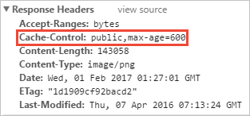
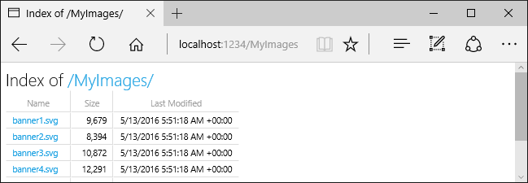

# Static files in ASP.NET Core

:::moniker range=">= aspnetcore-6.0"

By [Rick Anderson](https://twitter.com/RickAndMSFT) and [Kirk Larkin](https://twitter.com/serpent5)

Static files, such as HTML, CSS, images, and JavaScript, are assets an ASP.NET Core app serves directly to clients by default.

## Serve static files

Static files are stored within the project's [web root](xref:fundamentals/index#web-root) directory. The default directory is `{content root}/wwwroot`, but it can be changed with the <xref:Microsoft.AspNetCore.Hosting.HostingAbstractionsWebHostBuilderExtensions.UseWebRoot%2A> method. For more information, see [Content root](xref:fundamentals/index#content-root) and [Web root](xref:fundamentals/index#web-root).

The <xref:Microsoft.AspNetCore.Builder.WebApplication.CreateBuilder%2A> method sets the content root to the current directory:

[!code-csharp[](~/fundamentals/static-files/samples/6.x/StaticFilesSample/Program.cs?name=snippet&highlight=1)]

Static files are accessible via a path relative to the [web root](xref:fundamentals/index#web-root). For example, the **Web Application** project templates contain several folders within the `wwwroot` folder:

* `wwwroot`
  * `css`
  * `js`
  * `lib`

Consider creating the *wwwroot/images* folder and adding the `wwwroot/images/MyImage.jpg` file. The URI format to access a file in the `images` folder is `https://<hostname>/images/<image_file_name>`. For example, `https://localhost:5001/images/MyImage.jpg`

### Serve files in web root

The default web app templates call the <xref:Microsoft.AspNetCore.Builder.StaticFileExtensions.UseStaticFiles%2A> method in `Program.cs`, which enables static files to be served:

[!code-csharp[](~/fundamentals/static-files/samples/6.x/StaticFilesSample/Program.cs?name=snippet&highlight=15)]

The parameterless `UseStaticFiles` method overload marks the files in [web root](xref:fundamentals/index#web-root) as servable. The following markup references `wwwroot/images/MyImage.jpg`:

```html

```

In the preceding markup, the tilde character `~` points to the [web root](xref:fundamentals/index#web-root).

### Serve files outside of web root

Consider a directory hierarchy in which the static files to be served reside outside of the [web root](xref:fundamentals/index#web-root):

* `wwwroot`
  * `css`
  * `images`
  * `js`
* `MyStaticFiles`
  * `images`
    * `red-rose.jpg`

A request can access the `red-rose.jpg` file by configuring the Static File Middleware as follows:

[!code-csharp[](~/fundamentals/static-files/samples/6.x/StaticFilesSample/Program.cs?name=snippet_rr&highlight=1,18-23)]

In the preceding code, the *MyStaticFiles* directory hierarchy is exposed publicly via the *StaticFiles* URI segment. A request to `https://<hostname>/StaticFiles/images/red-rose.jpg` serves the `red-rose.jpg` file.

The following markup references `MyStaticFiles/images/red-rose.jpg`:
<!-- zz test via /Home2/MyStaticFilesRR -->
[!code-html[](~/fundamentals/static-files/samples/6.x/StaticFilesSample/Views/Home2/MyStaticFilesRR.cshtml?range=1)]

To serve files from multiple locations, see [Serve files from multiple locations](#serve-files-from-multiple-locations).

### Set HTTP response headers

A <xref:Microsoft.AspNetCore.Builder.StaticFileOptions> object can be used to set HTTP response headers. In addition to configuring static file serving from the [web root](xref:fundamentals/index#web-root), the following code sets the [Cache-Control](https://developer.mozilla.org/docs/Web/HTTP/Headers/Cache-Control) header:

[!code-csharp[](~/fundamentals/static-files/samples/6.x/StaticFilesSample/Program.cs?name=snippet_rh&highlight=16-24)]

The preceding code makes static files publicly available in the local cache for one week (604800 seconds):



## Static file authorization

The ASP.NET Core templates call <xref:Microsoft.AspNetCore.Builder.StaticFileExtensions.UseStaticFiles%2A> before calling <xref:Microsoft.AspNetCore.Builder.AuthorizationAppBuilderExtensions.UseAuthorization%2A>. Most apps follow this pattern. When the Static File Middleware is called before the authorization middleware:

  * No authorization checks are performed on the static files.
  * Static files served by the Static File Middleware, such as those under `wwwroot`, are publicly accessible.
  
To serve static files based on authorization:

  * Store them outside of `wwwroot`.
  * Call `UseStaticFiles`, specifying a path, after calling `UseAuthorization`.
  * Set the [fallback authorization policy](xref:Microsoft.AspNetCore.Authorization.AuthorizationOptions.FallbackPolicy).

[!code-csharp[](~/fundamentals/static-files/samples/6.x/StaticFileAuth/Program.cs?name=snippet_auth&highlight=18-23,38,45-50)]
  
  In the preceding code, the fallback authorization policy requires ***all*** users to be authenticated. Endpoints such as controllers, Razor Pages, etc that specify their own authorization requirements don't use the fallback authorization policy. For example, Razor Pages, controllers, or action methods with `[AllowAnonymous]` or `[Authorize(PolicyName="MyPolicy")]` use the applied authorization attribute rather than the fallback authorization policy.

  <xref:Microsoft.AspNetCore.Authorization.AuthorizationPolicyBuilder.RequireAuthenticatedUser%2A> adds <xref:Microsoft.AspNetCore.Authorization.Infrastructure.DenyAnonymousAuthorizationRequirement> to the current instance, which enforces that the current user is authenticated.

  Static assets under `wwwroot` are publicly accessible because the default Static File Middleware (`app.UseStaticFiles();`) is called before `UseAuthentication`. Static assets in the ***MyStaticFiles*** folder require authentication. The [sample code](https://github.com/dotnet/AspNetCore.Docs/tree/main/aspnetcore/fundamentals/static-files/samples/6.x) demonstrates this.

An alternative approach to serve files based on authorization is to:

  * Store them outside of `wwwroot` and any directory accessible to the Static File Middleware.
  * Serve them via an action method to which authorization is applied and return a <xref:Microsoft.AspNetCore.Mvc.FileResult> object:

  [!code-csharp[](~/fundamentals/static-files/samples/6.x/StaticFileAuth/Pages/BannerImage.cshtml.cs?name=snippet)]

## Directory browsing

Directory browsing allows directory listing within specified directories.

Directory browsing is disabled by default for security reasons. For more information, see [Security considerations for static files](#security-considerations-for-static-files).

Enable directory browsing with <xref:Microsoft.Extensions.DependencyInjection.DirectoryBrowserServiceExtensions.AddDirectoryBrowser%2A> and <xref:Microsoft.AspNetCore.Builder.DirectoryBrowserExtensions.UseDirectoryBrowser%2A>:

[!code-csharp[](~/fundamentals/static-files/samples/6.x/StaticFilesSample/Program.cs?name=snippet_db&highlight=9,23-37)]  

<!-- Select RP Home > Directory browsing -->
The preceding code allows directory browsing of the *wwwroot/images* folder using the URL `https://<hostname>/MyImages`, with links to each file and folder:



`AddDirectoryBrowser` [adds services](https://github.com/dotnet/aspnetcore/blob/fc4e391aa58a9fa67fdc3a96da6cfcadd0648b17/src/Middleware/StaticFiles/src/DirectoryBrowserServiceExtensions.cs#L25) required by the directory browsing middleware, including <xref:System.Text.Encodings.Web.HtmlEncoder>. These services may be added by other calls, such as <xref:Microsoft.Extensions.DependencyInjection.MvcServiceCollectionExtensions.AddRazorPages%2A>, but we recommend calling `AddDirectoryBrowser` to ensure the services are added in all apps.

## Serve default documents

<!-- Comment out  @*@page*@  default RP file -->

Setting a default page provides visitors a starting point on a site. To serve a default file from `wwwroot` without requiring the request URL to include the file's name, call the <xref:Microsoft.AspNetCore.Builder.DefaultFilesExtensions.UseDefaultFiles%2A> method:

[!code-csharp[](~/fundamentals/static-files/samples/6.x/StaticFilesSample/Program.cs?name=snippet_df&highlight=16)]  

`UseDefaultFiles` must be called before `UseStaticFiles` to serve the default file. `UseDefaultFiles` is a URL rewriter that doesn't serve the file.

With `UseDefaultFiles`, requests to a folder in `wwwroot` search for:

* `default.htm`
* `default.html`
* `index.htm`
* `index.html`

The first file found from the list is served as though the request included the file's name. The browser URL continues to reflect the URI requested.

The following code changes the default file name to `mydefault.html`:

[!code-csharp[](~/fundamentals/static-files/samples/6.x/StaticFilesSample/Program.cs?name=snippet_df2&highlight=16-19)] 

### UseFileServer for default documents

<xref:Microsoft.AspNetCore.Builder.FileServerExtensions.UseFileServer*> combines the functionality of `UseStaticFiles`, `UseDefaultFiles`, and optionally `UseDirectoryBrowser`.

Call `app.UseFileServer` to enable the serving of static files and the default file. Directory browsing isn't enabled:

[!code-csharp[](~/fundamentals/static-files/samples/6.x/StaticFilesSample/Program.cs?name=snippet_ufs&highlight=16)] 

The following code enables the serving of static files, the default file, and directory browsing:

<!--  app.UseFileServer(enableDirectoryBrowsing: true); returns the default HTML doc before the default Razor Page - ie, / returns the default HTML file, not Pages/Index.cshtml --
But when using app.UseDefaultFiles();, I need to comment out Pages/Index.cshtml or / returns  Pages/Index.cshtml, not the default HTML file.
-->
[!code-csharp[](~/fundamentals/static-files/samples/6.x/StaticFilesSample/Program.cs?name=snippet_ufs2&highlight=16)] 

Consider the following directory hierarchy:

* `wwwroot`
  * `css`
  * `images`
  * `js`
* `MyStaticFiles`
  * `images`
    * `MyImage.jpg`
  * `default.html`

The following code enables the serving of static files, the default file, and directory browsing of `MyStaticFiles`:

<!-- https://localhost:44391/StaticFiles/ or the link on https://localhost:44391/Home2/MyStaticFilesRR -->

[!code-csharp[](~/fundamentals/static-files/samples/6.x/StaticFilesSample/Program.cs?name=snippet_tree&highlight=1,8,22-28)]

<xref:Microsoft.Extensions.DependencyInjection.DirectoryBrowserServiceExtensions.AddDirectoryBrowser%2A> must be called when the `EnableDirectoryBrowsing` property value is `true`.

Using the preceding file hierarchy and code, URLs resolve as follows:

| URI            |      Response  |
| ------- | ------|
| `https://<hostname>/StaticFiles/images/MyImage.jpg` | `MyStaticFiles/images/MyImage.jpg` |
| `https://<hostname>/StaticFiles` | `MyStaticFiles/default.html` |

If no default-named file exists in the *MyStaticFiles* directory, `https://<hostname>/StaticFiles` returns the directory listing with clickable links:


<xref:Microsoft.AspNetCore.Builder.DefaultFilesExtensions.UseDefaultFiles*> and <xref:Microsoft.AspNetCore.Builder.DirectoryBrowserExtensions.UseDirectoryBrowser*> perform a client-side redirect from the target URI without a trailing `/`  to the target URI with a trailing `/`. For example, from `https://<hostname>/StaticFiles` to `https://<hostname>/StaticFiles/`. Relative URLs within the *StaticFiles* directory are invalid without a trailing slash (`/`).

## FileExtensionContentTypeProvider

The <xref:Microsoft.AspNetCore.StaticFiles.FileExtensionContentTypeProvider> class contains a `Mappings` property that serves as a mapping of file extensions to MIME content types. In the following sample, several file extensions are mapped to known MIME types. The *.rtf* extension is replaced, and *.mp4* is removed:

<!-- test via /mapTest/image1.image and mapTest/test.htm3 /mapTest/TextFile.rtf -->
[!code-csharp[](~/fundamentals/static-files/samples/6.x/StaticFilesSample/Program.cs?name=snippet_fec&highlight=19-33)] 

See [MIME content types](https://www.iana.org/assignments/media-types/media-types.xhtml).

## Non-standard content types

The Static File Middleware understands almost 400 known file content types. If the user requests a file with an unknown file type, the Static File Middleware passes the request to the next middleware in the pipeline. If no middleware handles the request, a *404 Not Found* response is returned. If directory browsing is enabled, a link to the file is displayed in a directory listing.

The following code enables serving unknown types and renders the unknown file as an image:

[!code-csharp[](~/fundamentals/static-files/samples/6.x/StaticFilesSample/Program.cs?name=snippet_ns&highlight=16-20)]

With the preceding code, a request for a file with an unknown content type is returned as an image.

> [!WARNING]
> Enabling <xref:Microsoft.AspNetCore.Builder.StaticFileOptions.ServeUnknownFileTypes> is a security risk. It's disabled by default, and its use is discouraged. [FileExtensionContentTypeProvider](#fileextensioncontenttypeprovider) provides a safer alternative to serving files with non-standard extensions.

## Serve files from multiple locations

Consider the following Razor page which displays the `/MyStaticFiles/image3.png` file:

[!code-cshtml[](~/fundamentals/static-files/samples/6.x/StaticFilesSample/Pages/Test.cshtml?highlight=5)]

`UseStaticFiles` and `UseFileServer` default to the file provider pointing at `wwwroot`. Additional instances of `UseStaticFiles` and `UseFileServer` can be provided with other file providers to serve files from other locations. The following example calls `UseStaticFiles` twice to serve files from both `wwwroot` and `MyStaticFiles`:

[!code-csharp[](~/fundamentals/static-files/samples/6.x/StaticFilesSample/Program.cs?name=snippet_mul)]

Using the preceding code:

* The `/MyStaticFiles/image3.png` file is displayed.
* The [Image Tag Helpers](xref:mvc/views/tag-helpers/builtin-th/image-tag-helper) <xref:Microsoft.AspNetCore.Mvc.TagHelpers.ImageTagHelper.AppendVersion> is not applied because the Tag Helpers depend on <xref:Microsoft.AspNetCore.Hosting.IWebHostEnvironment.WebRootFileProvider>. `WebRootFileProvider` has not been updated to include the `MyStaticFiles` folder.

The following code updates the `WebRootFileProvider`, which enables the Image Tag Helper to provide a version:

[!code-csharp[](~/fundamentals/static-files/samples/6.x/StaticFilesSample/Program.cs?name=snippet_mult2)]

<a name="sc"></a>

### Security considerations for static files

> [!WARNING]
> `UseDirectoryBrowser` and `UseStaticFiles` can leak secrets. Disabling directory browsing in production is highly recommended. Carefully review which directories are enabled via `UseStaticFiles` or `UseDirectoryBrowser`. The entire directory and its sub-directories become publicly accessible. Store files suitable for serving to the public in a dedicated directory, such as `<content_root>/wwwroot`. Separate these files from MVC views, Razor Pages, configuration files, etc.

* The URLs for content exposed with `UseDirectoryBrowser` and `UseStaticFiles` are subject to the case sensitivity and character restrictions of the underlying file system. For example, Windows is case insensitive, but macOS and Linux aren't.

* ASP.NET Core apps hosted in IIS use the [ASP.NET Core Module](xref:host-and-deploy/aspnet-core-module) to forward all requests to the app, including static file requests. The IIS static file handler isn't used and has no chance to handle requests.

* Complete the following steps in IIS Manager to remove the IIS static file handler at the server or website level:
    1. Navigate to the **Modules** feature.
    1. Select **StaticFileModule** in the list.
    1. Click **Remove** in the **Actions** sidebar.

> [!WARNING]
> If the IIS static file handler is enabled **and** the ASP.NET Core Module is configured incorrectly, static files are served. This happens, for example, if the *web.config* file isn't deployed.

* Place code files, including `.cs` and `.cshtml`, outside of the app project's [web root](xref:fundamentals/index#web-root). A logical separation is therefore created between the app's client-side content and server-based code. This prevents server-side code from being leaked.

## Serve files outside wwwroot by updating IWebHostEnvironment.WebRootPath

When <xref:Microsoft.AspNetCore.Hosting.IWebHostEnvironment.WebRootPath%2A?displayProperty=nameWithType> is set to a folder other than `wwwroot`:

* In the development environment, static assets found in both `wwwroot` and the updated `IWebHostEnvironment.WebRootPath` are served from `wwwroot`.
* In any environment other than development, duplicate static assets are served from the updated `IWebHostEnvironment.WebRootPath` folder.

Consider a web app created with the empty web template:

* Containing an `Index.html` file in `wwwroot` and `wwwroot-custom`.
* With the following updated `Program.cs` file that sets `WebRootPath = "wwwroot-custom"`:

  [!code-csharp[](~/fundamentals/static-files/samples/6.x/WebRoot/Program.cs?name=snippet1)]

In the preceding code, requests to `/`:

* In the development environment return `wwwroot/Index.html`
* In any environment other than development return `wwwroot-custom/Index.html`

To ensure assets from `wwwroot-custom` are returned, use one of the following approaches:

* Delete duplicate named assets in `wwwroot`.
* Set `"ASPNETCORE_ENVIRONMENT"` in `Properties/launchSettings.json` to any value other than `"Development"`.
* Completely disable static web assets by setting `<StaticWebAssetsEnabled>false</StaticWebAssetsEnabled>` in the project file. ***WARNING, disabling static web assets disables [Razor Class Libraries](xref:razor-pages/ui-class)***.
* Add the following JSON to the project file:

  ```xml
  <ItemGroup>
	  <Content Remove="wwwroot\**" />
  </ItemGroup>
  ```

The following code updates `IWebHostEnvironment.WebRootPath` to a non development value, guaranteeing duplicate content is returned from `wwwroot-custom` rather than `wwwroot`:

[!code-csharp[](~/fundamentals/static-files/samples/6.x/WebRoot/Program.cs?name=snippet2&highlight=5)]

## Additional resources

* [View or download sample code](https://github.com/dotnet/AspNetCore.Docs/tree/main/aspnetcore/fundamentals/static-files/samples) ([how to download](xref:index#how-to-download-a-sample))
* [Middleware](xref:fundamentals/middleware/index)
* [Introduction to ASP.NET Core](xref:index)

:::moniker-end

:::moniker range="< aspnetcore-6.0"

By [Rick Anderson](https://twitter.com/RickAndMSFT) and [Kirk Larkin](https://twitter.com/serpent5)

Static files, such as HTML, CSS, images, and JavaScript, are assets an ASP.NET Core app serves directly to clients by default.

[View or download sample code](https://github.com/dotnet/AspNetCore.Docs/tree/main/aspnetcore/fundamentals/static-files/samples) ([how to download](xref:index#how-to-download-a-sample))

## Serve static files

Static files are stored within the project's [web root](xref:fundamentals/index#web-root) directory. The default directory is `{content root}/wwwroot`, but it can be changed with the <xref:Microsoft.AspNetCore.Hosting.HostingAbstractionsWebHostBuilderExtensions.UseWebRoot%2A> method. For more information, see [Content root](xref:fundamentals/index#content-root) and [Web root](xref:fundamentals/index#web-root).

The <xref:Microsoft.AspNetCore.WebHost.CreateDefaultBuilder%2A> method sets the content root to the current directory:

:::code language="csharp" source="~/fundamentals/static-files/samples/3.x/StaticFilesSample/Program2.cs" id="snippet_Program":::

The preceding code was created with the web app template.

Static files are accessible via a path relative to the [web root](xref:fundamentals/index#web-root). For example, the **Web Application** project templates contain several folders within the `wwwroot` folder:

* `wwwroot`
  * `css`
  * `js`
  * `lib`

Consider creating the *wwwroot/images* folder and adding the `wwwroot/images/MyImage.jpg` file. The URI format to access a file in the `images` folder is `https://<hostname>/images/<image_file_name>`. For example, `https://localhost:5001/images/MyImage.jpg`

### Serve files in web root

The default web app templates call the <xref:Microsoft.AspNetCore.Builder.StaticFileExtensions.UseStaticFiles%2A> method in `Startup.Configure`, which enables static files to be served:

[!code-csharp[](~/fundamentals/static-files/samples/3.x/StaticFilesSample/Startup.cs?name=snippet_Configure&highlight=15)]

The parameterless `UseStaticFiles` method overload marks the files in [web root](xref:fundamentals/index#web-root) as servable. The following markup references `wwwroot/images/MyImage.jpg`:

```html

```

In the preceding code, the tilde character `~/` points to the [web root](xref:fundamentals/index#web-root).

### Serve files outside of web root

Consider a directory hierarchy in which the static files to be served reside outside of the [web root](xref:fundamentals/index#web-root):

* `wwwroot`
  * `css`
  * `images`
  * `js`
* `MyStaticFiles`
  * `images`
    * `red-rose.jpg`

A request can access the `red-rose.jpg` file by configuring the Static File Middleware as follows:

[!code-csharp[](~/fundamentals/static-files/samples/3.x/StaticFilesSample/StartupRose.cs?name=snippet_Configure&highlight=15-22)]

In the preceding code, the *MyStaticFiles* directory hierarchy is exposed publicly via the *StaticFiles* URI segment. A request to `https://<hostname>/StaticFiles/images/red-rose.jpg` serves the `red-rose.jpg` file.

The following markup references `MyStaticFiles/images/red-rose.jpg`:

```html

```

### Set HTTP response headers

A <xref:Microsoft.AspNetCore.Builder.StaticFileOptions> object can be used to set HTTP response headers. In addition to configuring static file serving from the [web root](xref:fundamentals/index#web-root), the following code sets the `Cache-Control` header:

[!code-csharp[](~/fundamentals/static-files/samples/3.x/StaticFilesSample/StartupAddHeader.cs?name=snippet_Configure&highlight=15-24)]

The preceding code sets max-age to 604800 seconds (7 days).


## Static file authorization

The ASP.NET Core templates call <xref:Microsoft.AspNetCore.Builder.StaticFileExtensions.UseStaticFiles%2A> before calling <xref:Microsoft.AspNetCore.Builder.AuthorizationAppBuilderExtensions.UseAuthorization%2A>. Most apps follow this pattern. When the Static File Middleware is called before the authorization middleware:

  * No authorization checks are performed on the static files.
  * Static files served by the Static File Middleware, such as those under `wwwroot`, are publicly accessible.
  
To serve static files based on authorization:

  * Store them outside of `wwwroot`.
  * Call `UseStaticFiles`, specifying a path, after calling `UseAuthorization`.
  * Set the [fallback authorization policy](xref:Microsoft.AspNetCore.Authorization.AuthorizationOptions.FallbackPolicy).

  [!code-csharp[](static-files/samples/3.x/StaticFileAuth/Startup.cs?name=snippet2&highlight=24-29)]
  
  [!code-csharp[](static-files/samples/3.x/StaticFileAuth/Startup.cs?name=snippet1&highlight=20-25)]

  In the preceding code, the fallback authorization policy requires ***all*** users to be authenticated. Endpoints such as controllers, Razor Pages, etc that specify their own authorization requirements don't use the fallback authorization policy. For example, Razor Pages, controllers, or action methods with `[AllowAnonymous]` or `[Authorize(PolicyName="MyPolicy")]` use the applied authorization attribute rather than the fallback authorization policy.

  <xref:Microsoft.AspNetCore.Authorization.AuthorizationPolicyBuilder.RequireAuthenticatedUser%2A> adds <xref:Microsoft.AspNetCore.Authorization.Infrastructure.DenyAnonymousAuthorizationRequirement> to the current instance, which enforces that the current user is authenticated.

  Static assets under `wwwroot` are publicly accessible because the default Static File Middleware (`app.UseStaticFiles();`) is called before `UseAuthentication`. Static assets in the *MyStaticFiles* folder require authentication. The [sample code](https://github.com/dotnet/AspNetCore.Docs/tree/main/aspnetcore/fundamentals/static-files/samples) demonstrates this.

An alternative approach to serve files based on authorization is to:

  * Store them outside of `wwwroot` and any directory accessible to the Static File Middleware.
  * Serve them via an action method to which authorization is applied and return a <xref:Microsoft.AspNetCore.Mvc.FileResult> object:

  [!code-csharp[](static-files/samples/3.x/StaticFilesSample/Controllers/HomeController.cs?name=snippet_BannerImage)]

## Directory browsing

Directory browsing allows directory listing within specified directories.

Directory browsing is disabled by default for security reasons. For more information, see [Security considerations for static files](#security-considerations-for-static-files).

Enable directory browsing with:

* <xref:Microsoft.Extensions.DependencyInjection.DirectoryBrowserServiceExtensions.AddDirectoryBrowser%2A> in `Startup.ConfigureServices`.
* <xref:Microsoft.AspNetCore.Builder.DirectoryBrowserExtensions.UseDirectoryBrowser%2A> in `Startup.Configure`.

[!code-csharp[](~/fundamentals/static-files/samples/3.x/StaticFilesSample/StartupBrowse.cs?name=snippet_ClassMembers&highlight=4,21-35)]

The preceding code allows directory browsing of the *wwwroot/images* folder using the URL `https://<hostname>/MyImages`, with links to each file and folder:


## Serve default documents

Setting a default page provides visitors a starting point on a site. To serve a default file from `wwwroot` without requiring the request URL to include the file's name, call the <xref:Microsoft.AspNetCore.Builder.DefaultFilesExtensions.UseDefaultFiles%2A> method:

[!code-csharp[](~/fundamentals/static-files/samples/3.x/StaticFilesSample/StartupEmpty.cs?name=snippet_Configure&highlight=15)]

`UseDefaultFiles` must be called before `UseStaticFiles` to serve the default file. `UseDefaultFiles` is a URL rewriter that doesn't serve the file.

With `UseDefaultFiles`, requests to a folder in `wwwroot` search for:

* `default.htm`
* `default.html`
* `index.htm`
* `index.html`

The first file found from the list is served as though the request included the file's name. The browser URL continues to reflect the URI requested.

The following code changes the default file name to `mydefault.html`:

[!code-csharp[](~/fundamentals/static-files/samples/3.x/StaticFilesSample/StartupDefault.cs?name=snippet_DefaultFiles)]

The following code shows `Startup.Configure` with the preceding code:

[!code-csharp[](~/fundamentals/static-files/samples/3.x/StaticFilesSample/StartupDefault.cs?name=snippet_Configure&highlight=15-19)]

### UseFileServer for default documents

<xref:Microsoft.AspNetCore.Builder.FileServerExtensions.UseFileServer*> combines the functionality of `UseStaticFiles`, `UseDefaultFiles`, and optionally `UseDirectoryBrowser`.

Call `app.UseFileServer` to enable the serving of static files and the default file. Directory browsing isn't enabled. The following code shows `Startup.Configure` with `UseFileServer`:

[!code-csharp[](~/fundamentals/static-files/samples/3.x/StaticFilesSample/StartupEmpty2.cs?name=snippet_Configure&highlight=15)]

The following code enables the serving of static files, the default file, and directory browsing:

```csharp
app.UseFileServer(enableDirectoryBrowsing: true);
```

The following code shows `Startup.Configure` with the preceding code:

[!code-csharp[](~/fundamentals/static-files/samples/3.x/StaticFilesSample/StartupEmpty3.cs?name=snippet_Configure&highlight=15)]

Consider the following directory hierarchy:

* `wwwroot`
  * `css`
  * `images`
  * `js`
* `MyStaticFiles`
  * `images`
    * `MyImage.jpg`
  * `default.html`

The following code enables the serving of static files, the default file, and directory browsing of `MyStaticFiles`:

[!code-csharp[](~/fundamentals/static-files/samples/3.x/StaticFilesSample/StartupFileServer.cs?name=snippet_ClassMembers&highlight=4,21-31)]

<xref:Microsoft.Extensions.DependencyInjection.DirectoryBrowserServiceExtensions.AddDirectoryBrowser%2A> must be called when the `EnableDirectoryBrowsing` property value is `true`.

Using the file hierarchy and preceding code, URLs resolve as follows:

| URI            |      Response  |
| ------- | ------|
| `https://<hostname>/StaticFiles/images/MyImage.jpg` | `MyStaticFiles/images/MyImage.jpg` |
| `https://<hostname>/StaticFiles` | `MyStaticFiles/default.html` |

If no default-named file exists in the *MyStaticFiles* directory, `https://<hostname>/StaticFiles` returns the directory listing with clickable links:


<xref:Microsoft.AspNetCore.Builder.DefaultFilesExtensions.UseDefaultFiles*> and <xref:Microsoft.AspNetCore.Builder.DirectoryBrowserExtensions.UseDirectoryBrowser*> perform a client-side redirect from the target URI without a trailing `/`  to the target URI with a trailing `/`. For example, from `https://<hostname>/StaticFiles` to `https://<hostname>/StaticFiles/`. Relative URLs within the *StaticFiles* directory are invalid without a trailing slash (`/`).

## FileExtensionContentTypeProvider

The <xref:Microsoft.AspNetCore.StaticFiles.FileExtensionContentTypeProvider> class contains a `Mappings` property that serves as a mapping of file extensions to MIME content types. In the following sample, several file extensions are mapped to known MIME types. The *.rtf* extension is replaced, and *.mp4* is removed:

[!code-csharp[](~/fundamentals/static-files/samples/3.x/StaticFilesSample/StartupFileExtensionContentTypeProvider.cs?name=snippet_Provider)]

The following code shows `Startup.Configure` with the preceding code:

[!code-csharp[](~/fundamentals/static-files/samples/3.x/StaticFilesSample/StartupFileExtensionContentTypeProvider.cs?name=snippet_Configure&highlight=15-43)]

See [MIME content types](https://www.iana.org/assignments/media-types/media-types.xhtml).

## Non-standard content types

The Static File Middleware understands almost 400 known file content types. If the user requests a file with an unknown file type, the Static File Middleware passes the request to the next middleware in the pipeline. If no middleware handles the request, a *404 Not Found* response is returned. If directory browsing is enabled, a link to the file is displayed in a directory listing.

The following code enables serving unknown types and renders the unknown file as an image:

[!code-csharp[](~/fundamentals/static-files/samples/3.x/StaticFilesSample/StartupServeUnknownFileTypes.cs?name=snippet_UseStaticFiles)]

The following code shows `Startup.Configure` with the preceding code:

[!code-csharp[](~/fundamentals/static-files/samples/3.x/StaticFilesSample/StartupServeUnknownFileTypes.cs?name=snippet_Configure&highlight=15-19)]

With the preceding code, a request for a file with an unknown content type is returned as an image.

> [!WARNING]
> Enabling <xref:Microsoft.AspNetCore.Builder.StaticFileOptions.ServeUnknownFileTypes> is a security risk. It's disabled by default, and its use is discouraged. [FileExtensionContentTypeProvider](#fileextensioncontenttypeprovider) provides a safer alternative to serving files with non-standard extensions.

## Serve files from multiple locations

`UseStaticFiles` and `UseFileServer` default to the file provider pointing at `wwwroot`. Additional instances of `UseStaticFiles` and `UseFileServer` can be provided with other file providers to serve files from other locations. For more information, see [this GitHub issue](https://github.com/dotnet/AspNetCore.Docs/issues/15578).

<a name="sc"></a>

### Security considerations for static files

> [!WARNING]
> `UseDirectoryBrowser` and `UseStaticFiles` can leak secrets. Disabling directory browsing in production is highly recommended. Carefully review which directories are enabled via `UseStaticFiles` or `UseDirectoryBrowser`. The entire directory and its sub-directories become publicly accessible. Store files suitable for serving to the public in a dedicated directory, such as `<content_root>/wwwroot`. Separate these files from MVC views, Razor Pages, configuration files, etc.

* The URLs for content exposed with `UseDirectoryBrowser` and `UseStaticFiles` are subject to the case sensitivity and character restrictions of the underlying file system. For example, Windows is case insensitive, but macOS and Linux aren't.

* ASP.NET Core apps hosted in IIS use the [ASP.NET Core Module](xref:host-and-deploy/aspnet-core-module) to forward all requests to the app, including static file requests. The IIS static file handler isn't used and has no chance to handle requests.

* Complete the following steps in IIS Manager to remove the IIS static file handler at the server or website level:
    1. Navigate to the **Modules** feature.
    1. Select **StaticFileModule** in the list.
    1. Click **Remove** in the **Actions** sidebar.

> [!WARNING]
> If the IIS static file handler is enabled **and** the ASP.NET Core Module is configured incorrectly, static files are served. This happens, for example, if the *web.config* file isn't deployed.

* Place code files, including `.cs` and `.cshtml`, outside of the app project's [web root](xref:fundamentals/index#web-root). A logical separation is therefore created between the app's client-side content and server-based code. This prevents server-side code from being leaked.

## Additional resources

* [Middleware](xref:fundamentals/middleware/index)
* [Introduction to ASP.NET Core](xref:index)

:::moniker-end
