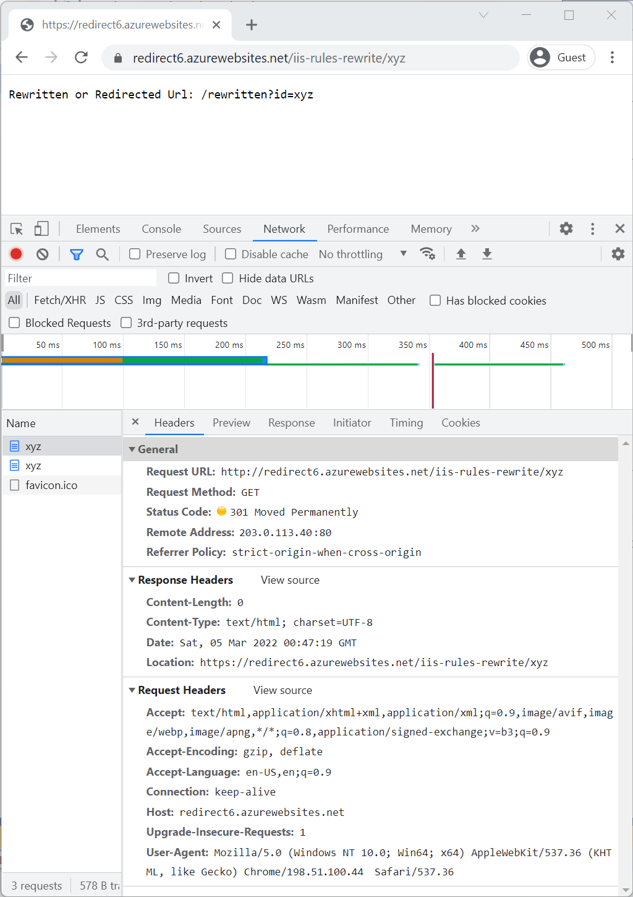

# URL Rewriting Middleware in ASP.NET Core

By [Kirk Larkin](https://twitter.com/serpent5) and [Rick Anderson](https://twitter.com/RickAndMSFT) 

:::moniker range=">= aspnetcore-6.0"

This article introduces URL rewriting with instructions on how to use URL Rewriting Middleware in ASP.NET Core apps.

URL rewriting is the act of modifying request URLs based on one or more predefined rules. URL rewriting creates an abstraction between resource locations and their addresses so that the locations and addresses aren't tightly linked. URL rewriting is valuable in several scenarios to:

* Move or replace server resources temporarily or permanently and maintain stable locators for those resources.
* Split request processing across different apps or across areas of one app.
* Remove, add, or reorganize URL segments on incoming requests.
* Optimize public URLs for Search Engine Optimization (SEO).
* Permit the use of friendly public URLs to help visitors predict the content returned by requesting a resource.
* Redirect insecure requests to secure endpoints.
* Prevent hotlinking, where an external site uses a hosted static asset on another site by linking the asset into its own content.

***URL rewriting can reduce the performance of an app***. Limit the number and complexity of rules.

## URL redirect and URL rewrite

The difference in wording between *URL redirect* and *URL rewrite* is subtle but has important implications for providing resources to clients. ASP.NET Core's URL Rewriting Middleware is capable of meeting the need for both.

A *URL redirect* involves a client-side operation, where the client is instructed to access a resource at a different address than the client originally requested. This requires a round trip to the server. The redirect URL returned to the client appears in the browser's address bar when the client makes a new request for the resource.

If `/resource` is *redirected* to `/different-resource`, the server responds that the client should obtain the resource at `/different-resource` with a status code indicating that the redirect is either temporary or permanent.


When redirecting requests to a different URL, indicate whether the redirect is permanent or temporary by specifying the status code with the response:

* The [`301 - Moved Permanently`](https://developer.mozilla.org/docs/Web/HTTP/Status/301) status code is used where the resource has a new, permanent URL and that all future requests for the resource should use the new URL. *The client may cache and reuse the response when a 301 status code is received.*

* The [`302 - Found`](https://developer.mozilla.org/en-US/docs/Web/HTTP/Status/302) status code is used where the redirection is temporary or generally subject to change. The 302 status code indicates to the client not to store the URL and use it in the future.

For more information on status codes, see [RFC 2616: Status Code Definitions](https://www.w3.org/Protocols/rfc2616/rfc2616-sec10.html).

A *URL rewrite* is a server-side operation that provides a resource from a different resource address than the client requested. Rewriting a URL doesn't require a round trip to the server. The rewritten URL isn't returned to the client and doesn't appear in the browser's address bar.

If `/resource` is *rewritten* to `/different-resource`, the server *internally* fetches and returns the resource at `/different-resource`.

Although the client might be able to retrieve the resource at the rewritten URL, the client isn't informed that the resource exists at the rewritten URL when it makes its request and receives the response.


## URL rewriting sample app

Explore the features of the URL Rewriting Middleware with the [sample app](https://github.com/dotnet/AspNetCore.Docs/tree/main/aspnetcore/fundamentals/url-rewriting/samples/). The app applies redirect and rewrite rules and shows the redirected or rewritten URL for several scenarios. The [sample app, deployed to Azure](https://redirect6.azurewebsites.net), can be used for testing.

## When to use URL rewriting middleware

Use URL Rewriting Middleware when the following approaches aren't satisfactory:

* [URL Rewrite module with IIS on Windows Server](https://www.iis.net/downloads/microsoft/url-rewrite)
* [Apache mod_rewrite module on Apache Server](https://httpd.apache.org/docs/2.4/rewrite/)
* [URL rewriting on Nginx](https://www.nginx.com/blog/creating-nginx-rewrite-rules/)

Use the URL rewriting middleware when the app is hosted on [HTTP.sys server](xref:fundamentals/servers/httpsys).

The main reasons to use the server-based URL rewriting technologies in IIS, Apache, and Nginx are:

* The middleware doesn't support the full features of these modules.

  Some of the features of the server modules don't work with ASP.NET Core projects, such as the `IsFile` and `IsDirectory` constraints of the IIS Rewrite module. In these scenarios, use the middleware instead.
* The performance of the middleware probably doesn't match that of the modules.

  Benchmarking is the only way to know with certainty which approach degrades performance the most or if degraded performance is negligible.

## Extension and options

Establish URL rewrite and redirect rules by creating an instance of the [RewriteOptions](xref:Microsoft.AspNetCore.Rewrite.RewriteOptions) class with extension methods for each of the rewrite rules. Chain multiple rules ***in the order that they should be processed***. The `RewriteOptions` are passed into the URL Rewriting Middleware as it's added to the request pipeline with <xref:Microsoft.AspNetCore.Builder.RewriteBuilderExtensions.UseRewriter*>:

[!code-csharp[](url-rewriting/samples/6.x/SampleApp/Program.cs?name=snippet1&highlight=7-24)]

### Redirect non-www to www

Three options permit the app to redirect non-`www` requests to `www`:

* <xref:Microsoft.AspNetCore.Rewrite.RewriteOptionsExtensions.AddRedirectToWwwPermanent*>: Permanently redirect the request to the `www` subdomain if the request is non-`www`. Redirects with a [Status308PermanentRedirect](xref:Microsoft.AspNetCore.Http.StatusCodes.Status308PermanentRedirect) status code.

* <xref:Microsoft.AspNetCore.Rewrite.RewriteOptionsExtensions.AddRedirectToWww*>: Redirect the request to the `www` subdomain if the incoming request is non-`www`. Redirects with a [Status307TemporaryRedirect](xref:Microsoft.AspNetCore.Http.StatusCodes.Status307TemporaryRedirect) status code. An overload permits  providing the status code for the response. Use a field of the <xref:Microsoft.AspNetCore.Http.StatusCodes> class for a status code assignment.

### URL redirect

Use <xref:Microsoft.AspNetCore.Rewrite.RewriteOptionsExtensions.AddRedirect*> to redirect requests. The first parameter contains the [.NET regular expression](/dotnet/standard/base-types/regular-expressions) (Regex) for matching on the path of the incoming URL. The second parameter is the replacement string. The third parameter, if present, specifies the status code. If the status code isn't specified, the status code defaults to [302 - Found](https://developer.mozilla.org/docs/Web/HTTP/Status/302), which indicates that the resource is temporarily moved or replaced.

[!code-csharp[](url-rewriting/samples/6.x/SampleApp/Program.cs?name=snippet1&highlight=13)]

In a browser with developer tools enabled, make a request to the sample app with the path [`/redirect-rule/1234/5678`](https://redirect6.azurewebsites.net/redirect-rule/1234/5678). The regular expression matches the request path on `redirect-rule/(.*)`, and the path is replaced with `/redirected/1234/5678`. The redirect URL is sent back to the client with a *302 - Found* status code. The browser makes a new request at the redirect URL, which appears in the browser's address bar. Since no rules in the sample app match on the redirect URL:

* The second request receives a *200 - OK* response from the app.
* The body of the response shows the redirect URL.

A round trip is made to the server when a URL is *redirected*.

> [!WARNING]
> Be cautious when establishing redirect rules. Redirect rules are evaluated on every request to the app, including after a redirect. It's easy to accidentally create a loop of ***infinite*** redirects.

The part of the expression contained within parentheses is called a [capture group](/dotnet/standard/base-types/grouping-constructs-in-regular-expressions). The dot (`.`) of the expression means *match any character*. The asterisk (`*`) indicates *match the preceding character zero or more times*. Therefore, the last two path segments of the URL, `1234/5678`, are captured by capture group `(.*)`. Any value provided in the request URL after `redirect-rule/` is captured by this single capture group.

In the replacement string, captured groups are injected into the string with the dollar sign (`$`) followed by the sequence number of the capture. The first capture group value is obtained with `$1`, the second with `$2`, and they continue in sequence for the capture groups in the regular expression. There's only one captured group in the redirect rule regular expression in `redirect-rule/(.*)`, so there's only one injected group in the replacement string, which is `$1`. When the rule is applied, the URL becomes `/redirected/1234/5678`.

Try [`/redirect-rule/1234/5678`](https://redirect6.azurewebsites.net/redirect-rule/1234/5678) with the browser tools on the network tab.

### URL redirect to a secure endpoint

Use <xref:Microsoft.AspNetCore.Rewrite.RewriteOptionsExtensions.AddRedirectToHttps*> to redirect HTTP requests to the same host and path using the HTTPS protocol. If the status code isn't supplied, the middleware defaults to *302 - Found*. If the port isn't supplied:

* The middleware defaults to `null`.
* The scheme changes to `https` (HTTPS protocol), and the client accesses the resource on port 443.

The following example shows how to set the status code to `301 - Moved Permanently` and change the port to the HTTPS port used by Kestrel on localhost. In production, the HTTPS port is set to null:

[!code-csharp[](url-rewriting/samples/6.x/SampleApp/Program.cs?name=snippet_redirect&highlight=7-12,20-21)]

Use <xref:Microsoft.AspNetCore.Rewrite.RewriteOptionsExtensions.AddRedirectToHttpsPermanent*> to redirect insecure requests to the same host and path with secure HTTPS protocol on port 443. The middleware sets the status code to `301 - Moved Permanently`.

[!code-csharp[](url-rewriting/samples/6.x/SampleApp/Program.cs?name=snippet_redirect2&highlight=13)]

<!-- Note: something wrong with project because the localhostHTTPSport is correctly calculated but not used in the redirect. The exact same code at https://github.com/Rick-Anderson/WebRedirect does work. -->

> [!NOTE]
> When redirecting to a secure endpoint without the requirement for additional redirect rules, we recommend using HTTPS Redirection Middleware. For more information, see [Enforce HTTPS](xref:security/enforcing-ssl#require-https).

The sample app demonstrates how to use `AddRedirectToHttps` or `AddRedirectToHttpsPermanent`. Make an [insecure HTTP request to the app](http://redirect6.azurewebsites.net/iis-rules-rewrite/xyz). When testing HTTP to HTTPS redirection with localhost:

* Use the HTTP URL, which has a different port than the HTTPS URL. The HTTP URL is in the `Properties/launchSettings.json` file.
* Removing the `s` from `https://localhost/{port}` fails because localhost doesn't respond on HTTP to the HTTPS port.

The following image shows the F12 browser tools image of a request to [http://redirect6.azurewebsites.net/iis-rules-rewrite/xyz](http://redirect6.azurewebsites.net/iis-rules-rewrite/xyz) using the preceding code:



### URL rewrite

Use <xref:Microsoft.AspNetCore.Rewrite.RewriteOptionsExtensions.AddRewrite*> to create a rule for rewriting URLs. The first parameter contains the regular expression for matching on the incoming URL path. The second parameter is the replacement string. The third parameter, `skipRemainingRules: {true|false}`, indicates to the middleware whether or not to skip additional rewrite rules if the current rule is applied.

[!code-csharp[](url-rewriting/samples/6.x/SampleApp/Program.cs?name=snippet_redirect2&highlight=15-16)]

Try the request to https://redirect6.azurewebsites.net/rewrite-rule/1234/5678

The caret (`^`) at the beginning of the expression means that matching starts at the beginning of the URL path.

In the earlier example with the redirect rule, `redirect-rule/(.*)`, there's no caret (`^`) at the start of the regular expression. Therefore, any characters may precede `redirect-rule/` in the path for a successful match.

| Path                               | Match |
| ---------------------------------- | :---: |
| [`/redirect-rule/1234/5678`](https://redirect6.azurewebsites.net/redirect-rule/1234/5678)         | Yes   |
| [`/my-cool-redirect-rule/1234/5678`](https://redirect6.azurewebsites.net/my-cool-redirect-rule/1234/5678) | Yes   |
| [`/anotherredirect-rule/1234/5678`](https://redirect6.azurewebsites.net/anotherredirect-rule/1234/5678)  | Yes   |

The rewrite rule, `^rewrite-rule/(\d+)/(\d+)`, only matches paths if they start with `rewrite-rule/`. In the following table, note the difference in matching.

| Path                              | Match |
| --------------------------------- | :---: |
| [`/rewrite-rule/1234/5678`](https://redirect6.azurewebsites.net/rewrite-rule/1234/5678)         | Yes   |
| [`/my-cool-rewrite-rule/1234/5678`](https://redirect6.azurewebsites.net/my-cool-rewrite-rule/1234/5678) | No    |
| [`/anotherrewrite-rule/1234/5678`](https://redirect6.azurewebsites.net/anotherrewrite-rule/1234/5678)  | No    |

Following the `^rewrite-rule/` portion of the expression, there are two capture groups, `(\d+)/(\d+)`. The `\d` signifies *match a digit (number)*. The plus sign (`+`) means *match one or more of the preceding character*. Therefore, the URL must contain a number followed by a forward-slash followed by another number. These capture groups are injected into the rewritten URL as `$1` and `$2`. The rewrite rule replacement string places the captured groups into the query string. The requested path [`/rewrite-rule/1234/5678`](https://redirect6.azurewebsites.net/rewrite-rule/1234/5678) is rewritten to return the resource at `/rewritten?var1=1234&var2=5678`. If a query string is present on the original request, it's preserved when the URL is rewritten.

There's no round trip to the server to return the resource. If the resource exists, it's fetched and returned to the client with a *200 - OK* status code. Because the client isn't redirected, the URL in the browser's address bar doesn't change. Clients can't detect that a URL rewrite operation occurred on the server.

### Performance tips for URL rewrite and redirect

For the fastest response:

* Order rewrite rules from the most frequently matched rule to the least frequently matched rule.
* Use `skipRemainingRules: true` whenever possible because matching rules is computationally expensive and increases app response time. Skip the processing of the remaining rules when a match occurs and no additional rule processing is required.

> [!WARNING]
> A malicious user can provide expensive to process input to `RegularExpressions` causing a [Denial-of-Service attack](https://www.us-cert.gov/ncas/tips/ST04-015). ASP.NET Core framework APIs that use `RegularExpressions` pass a timeout. For example, the [RedirectRule](https://github.com/dotnet/aspnetcore/blob/v6.0.2/src/Middleware/Rewrite/src/RedirectRule.cs#L15) and [RewriteRule](https://github.com/dotnet/aspnetcore/blob/v6.0.2/src/Middleware/Rewrite/src/RewriteRule.cs#L14) classes both pass in a one second timeout.

### Apache mod_rewrite

Apply Apache mod_rewrite rules with <xref:Microsoft.AspNetCore.Rewrite.ApacheModRewriteOptionsExtensions.AddApacheModRewrite*>. Make sure that the rules file is deployed with the app. For more information and examples of mod_rewrite rules, see [Apache mod_rewrite](https://httpd.apache.org/docs/2.4/rewrite/).

A <xref:System.IO.StreamReader> is used to read the rules from the *ApacheModRewrite.txt* rules file:

[!code-csharp[](url-rewriting/samples/6.x/SampleApp/Program.cs?name=snippet_redirect2&highlight=7-8,17)]

The sample app redirects requests from `/apache-mod-rules-redirect/(.\*)` to `/redirected?id=$1`. The response status code is *302 - Found*.

[!code[](url-rewriting/samples/6.x/SampleApp/ApacheModRewrite.txt)]

Try the request to https://redirect6.azurewebsites.net/apache-mod-rules-redirect/1234

The [Apache middleware](https://github.com/dotnet/aspnetcore/blob/v6.0.2/src/Middleware/Rewrite/src/ApacheModRewrite/ServerVariables.cs) supports the following Apache mod_rewrite server variables:

* CONN_REMOTE_ADDR
* HTTP_ACCEPT
* HTTP_CONNECTION
* HTTP_COOKIE
* HTTP_FORWARDED
* HTTP_HOST
* HTTP_REFERER
* HTTP_USER_AGENT
* HTTPS
* IPV6
* QUERY_STRING
* REMOTE_ADDR
* REMOTE_PORT
* REQUEST_FILENAME
* REQUEST_METHOD
* REQUEST_SCHEME
* REQUEST_URI
* SCRIPT_FILENAME
* SERVER_ADDR
* SERVER_PORT
* SERVER_PROTOCOL
* TIME
* TIME_DAY
* TIME_HOUR
* TIME_MIN
* TIME_MON
* TIME_SEC
* TIME_WDAY
* TIME_YEAR

### IIS URL Rewrite Module rules

To use the same rule set that applies to the IIS URL Rewrite Module, use <xref:Microsoft.AspNetCore.Rewrite.IISUrlRewriteOptionsExtensions.AddIISUrlRewrite*>. Make sure that the rules file is deployed with the app. Don't direct the middleware to use the app's *web.config* file when running on Windows Server IIS. With IIS, these rules should be stored outside of the app's *web.config* file in order to avoid conflicts with the IIS Rewrite module. For more information and examples of IIS URL Rewrite Module rules, see [Using Url Rewrite Module 2.0](/iis/extensions/url-rewrite-module/using-url-rewrite-module-20) and [URL Rewrite Module Configuration Reference](/iis/extensions/url-rewrite-module/url-rewrite-module-configuration-reference).

A <xref:System.IO.StreamReader> is used to read the rules from the `IISUrlRewrite.xml` rules file:

[!code-csharp[](url-rewriting/samples/6.x/SampleApp/Program.cs?name=snippet_redirect2&highlight=9-10,18)]

The sample app rewrites requests from `/iis-rules-rewrite/(.*)` to `/rewritten?id=$1`. The response is sent to the client with a *200 - OK* status code.

[!code-xml[](url-rewriting/samples/6.x/SampleApp/IISUrlRewrite.xml)]

Try the request to https://redirect6.azurewebsites.net/iis-rules-rewrite/xyz 

Apps that have an active IIS Rewrite Module with server-level rules configured that impacts the app in undesirable ways:

* Consider disabling the IIS Rewrite Module for the app.
* For more information, see [Disabling IIS modules](xref:host-and-deploy/iis/modules#disabling-iis-modules).

#### Unsupported features

The middleware doesn't support the following IIS URL Rewrite Module features:

* Outbound Rules
* Custom Server Variables
* Wildcards
* LogRewrittenUrl

#### Supported server variables

The [middleware](https://github.com/dotnet/aspnetcore/blob/v6.0.2/src/Middleware/Rewrite/src/IISUrlRewrite/ServerVariables.cs) supports the following IIS URL Rewrite Module server variables:

* CONTENT_LENGTH
* CONTENT_TYPE
* HTTP_ACCEPT
* HTTP_CONNECTION
* HTTP_COOKIE
* HTTP_HOST
* HTTP_REFERER
* HTTP_URL
* HTTP_USER_AGENT
* HTTPS
* LOCAL_ADDR
* QUERY_STRING
* REMOTE_ADDR
* REMOTE_PORT
* REQUEST_FILENAME
* REQUEST_URI

<xref:Microsoft.Extensions.FileProviders.IFileProvider> can be obtained via a <xref:Microsoft.Extensions.FileProviders.PhysicalFileProvider>. This approach may provide greater flexibility for the location of rewrite rules files. Make sure that the rewrite rules files are deployed to the server at the path provided.

 ```csharp
 var fileProvider = new PhysicalFileProvider(Directory.GetCurrentDirectory());
 ```

### Method-based rule

Use <xref:Microsoft.AspNetCore.Rewrite.RewriteOptionsExtensions.Add*> to implement custom rule logic in a method. `Add` exposes the <xref:Microsoft.AspNetCore.Rewrite.RewriteContext>, which makes available the <xref:Microsoft.AspNetCore.Http.HttpContext> for use in redirect methods. The <xref:Microsoft.AspNetCore.Rewrite.RewriteContext.Result%2A?displayProperty=nameWithType> property determines how additional pipeline processing is handled. Set the value to one of the <xref:Microsoft.AspNetCore.Rewrite.RuleResult> fields described in the following table.

| Rewrite context result               | Action                                                           |
| ------------------------------------ | ---------------------------------------------------------------- |
| `RuleResult.ContinueRules` (default) | Continue applying rules.                                         |
| `RuleResult.EndResponse`             | Stop applying rules and send the response.                       |
| `RuleResult.SkipRemainingRules`      | Stop applying rules and send the context to the next middleware. |

[!code-csharp[](url-rewriting/samples/6.x/SampleApp/Program.cs?name=snippet_redirect2&highlight=19)]

The sample app demonstrates a method that redirects requests for paths that end with `.xml`. When a request is made for [`/file.xml`](https://redirect6.azurewebsites.net/file.xml):

* The request is redirected to `/xmlfiles/file.xml`
* The status code is set to `301 - Moved Permanently`. When the browser makes a new request for `/xmlfiles/file.xml`, Static File Middleware serves the file to the client from the *wwwroot/xmlfiles* folder. For a redirect, explicitly set the status code of the response. Otherwise, a *200 - OK* status code is returned, and the redirect doesn't occur on the client.

`RewriteRules.cs`:

[!code-csharp[](url-rewriting/samples/6.x/SampleApp/RewriteRules.cs?name=snippet_RedirectXmlFileRequests&highlight=15-19)]

This approach can also rewrite requests. The sample app demonstrates rewriting the path for any text file request to serve the *file.txt* text file from the *wwwroot* folder. Static File Middleware serves the file based on the updated request path:

[!code-csharp[](url-rewriting/samples/6.x/SampleApp/Program.cs?name=snippet_redirect2&highlight=20,27)]

`RewriteRules.cs`:

[!code-csharp[](url-rewriting/samples/6.x/SampleApp/RewriteRules.cs?name=snippet_RewriteTextFileRequests&highlight=8-9)]

### IRule-based rule

Use <xref:Microsoft.AspNetCore.Rewrite.RewriteOptionsExtensions.Add*> to use rule logic in a class that implements the <xref:Microsoft.AspNetCore.Rewrite.IRule> interface. `IRule` provides greater flexibility over using the method-based rule approach. The implementation class may include a constructor that allows passing in parameters for the <xref:Microsoft.AspNetCore.Rewrite.IRule.ApplyRule*> method.

[!code-csharp[](url-rewriting/samples/6.x/SampleApp/Program.cs?name=snippet_redirect2&highlight=21-22)]

The values of the parameters in the sample app for the `extension` and the `newPath` are checked to meet several conditions. The `extension` must contain a value, and the value must be `.png`, `.jpg`, or `.gif`. If the `newPath` isn't valid, an <xref:System.ArgumentException> is thrown. If a request is made for `image.png`, the request is redirected to `/png-images/image.png`. If a request is made for `image.jpg`, the request is redirected to `/jpg-images/image.jpg`. The status code is set to `301 - Moved Permanently`, and the `context.Result` is set to stop processing rules and send the response.

[!code-csharp[](url-rewriting/samples/6.x/SampleApp/RewriteRules.cs?name=snippet_RedirectImageRequests)]

Try:

* PNG request: https://redirect6.azurewebsites.net/image.png
* JPG request: https://redirect6.azurewebsites.net/image.jpg

<a name="regex6"></a>

## Regex examples

| Goal | Regex String &<br>Match Example | Replacement String &<br>Output Example |
| ---- | ------------------------------- | -------------------------------------- |
| Rewrite path into querystring | `^path/(.*)/(.*)`<br>[`/path/abc/123`](https://redirect6.azurewebsites.net/path/abc/123) | `path?var1=$1&var2=$2`<br>`/path?var1=abc&var2=123` |
| Strip trailing slash | `^path2/(.*)/$`<br>[`/path2/xyz/`](https://redirect6.azurewebsites.net/path2/xyz/) | `$1`<br>`/path2/xyz` |
| Enforce trailing slash | `^path3/(.*[^/])$`<br>[`/path3/xyz`](https://redirect6.azurewebsites.net/path3/xyz) | `$1/`<br>`/path3/xyz/` |
| Avoid rewriting specific requests | `^(.*)(?<!\.axd)$` or <br> `^(?!.*\.axd$)(.*)$`<br>Yes: [`/path4/resource.htm`](https://redirect6.azurewebsites.net/path4/resource.htm)<br>No: [`/path4/resource.axd`](https://redirect6.azurewebsites.net/path4/resource.axd) | `rewritten/$1`<br>`/rewritten/resource.htm`<br>`/resource.axd` |
| Rearrange URL segments | `path5/(.*)/(.*)/(.*)`<br>[`path5/1/2/3`](https://redirect6.azurewebsites.net/path5/1/2/3) | `path5/$3/$2/$1`<br>`path5/3/2/1` |
| Replace a URL segment | `^path6/(.*)/segment2/(.*)`<br>[`^path6/segment1/segment2/segment3`](https://redirect6.azurewebsites.net/path6/segment1/segment2/segment3) | `path6/$1/replaced/$2`<br>`/path6/segment1/replaced/segment3` |

The links in the preceding table use the following code deployed to Azure:

[!code-csharp[](url-rewriting/samples/6.x/SampleApp/Program.cs?name=snippet_redirect3&highlight=18-35)]

In most of the preceding regular expression samples, the literal `path` is used to make unique testable rewrite rules for the deployed sample. Typically the regular expression wouldn't include `path`. For example, see these [regular expression examples](?view=aspnetcore-5.0&preserve-view=true#regex5) table.

:::moniker-end

:::moniker range=">= aspnetcore-3.0 < aspnetcore-6.0"

This document introduces URL rewriting with instructions on how to use URL Rewriting Middleware in ASP.NET Core apps.

URL rewriting is the act of modifying request URLs based on one or more predefined rules. URL rewriting creates an abstraction between resource locations and their addresses so that the locations and addresses aren't tightly linked. URL rewriting is valuable in several scenarios to:

* Move or replace server resources temporarily or permanently and maintain stable locators for those resources.
* Split request processing across different apps or across areas of one app.
* Remove, add, or reorganize URL segments on incoming requests.
* Optimize public URLs for Search Engine Optimization (SEO).
* Permit the use of friendly public URLs to help visitors predict the content returned by requesting a resource.
* Redirect insecure requests to secure endpoints.
* Prevent hotlinking, where an external site uses a hosted static asset on another site by linking the asset into its own content.

> [!NOTE]
> URL rewriting can reduce the performance of an app. Where feasible, limit the number and complexity of rules.

[View or download sample code](https://github.com/dotnet/AspNetCore.Docs/tree/main/aspnetcore/fundamentals/url-rewriting/samples/) ([how to download](xref:index#how-to-download-a-sample))

## URL redirect and URL rewrite

The difference in wording between *URL redirect* and *URL rewrite* is subtle but has important implications for providing resources to clients. ASP.NET Core's URL Rewriting Middleware is capable of meeting the need for both.

A *URL redirect* involves a client-side operation, where the client is instructed to access a resource at a different address than the client originally requested. This requires a round trip to the server. The redirect URL returned to the client appears in the browser's address bar when the client makes a new request for the resource.

If `/resource` is *redirected* to `/different-resource`, the server responds that the client should obtain the resource at `/different-resource` with a status code indicating that the redirect is either temporary or permanent.


When redirecting requests to a different URL, indicate whether the redirect is permanent or temporary by specifying the status code with the response:

* The `301 - Moved Permanently` status code is used where the resource has a new, permanent URL and you wish to instruct the client that all future requests for the resource should use the new URL. *The client may cache and reuse the response when a 301 status code is received.*

* The *302 - Found* status code is used where the redirection is temporary or generally subject to change. The 302 status code indicates to the client not to store the URL and use it in the future.

For more information on status codes, see [RFC 2616: Status Code Definitions](https://www.w3.org/Protocols/rfc2616/rfc2616-sec10.html).

A *URL rewrite* is a server-side operation that provides a resource from a different resource address than the client requested. Rewriting a URL doesn't require a round trip to the server. The rewritten URL isn't returned to the client and doesn't appear in the browser's address bar.

If `/resource` is *rewritten* to `/different-resource`, the server *internally* fetches and returns the resource at `/different-resource`.

Although the client might be able to retrieve the resource at the rewritten URL, the client isn't informed that the resource exists at the rewritten URL when it makes its request and receives the response.


## URL rewriting sample app

You can explore the features of the URL Rewriting Middleware with the [sample app](https://github.com/dotnet/AspNetCore.Docs/tree/main/aspnetcore/fundamentals/url-rewriting/samples/). The app applies redirect and rewrite rules and shows the redirected or rewritten URL for several scenarios.

## When to use URL rewriting middleware

Use URL Rewriting Middleware when you're unable to use the following approaches:

* [URL Rewrite module with IIS on Windows Server](https://www.iis.net/downloads/microsoft/url-rewrite)
* [Apache mod_rewrite module on Apache Server](https://httpd.apache.org/docs/2.4/rewrite/)
* [URL rewriting on Nginx](https://www.nginx.com/blog/creating-nginx-rewrite-rules/)

Use the URL rewriting middleware when the app is hosted on [HTTP.sys server](xref:fundamentals/servers/httpsys).

The main reasons to use the server-based URL rewriting technologies in IIS, Apache, and Nginx are:

* The middleware doesn't support the full features of these modules.

  Some of the features of the server modules don't work with ASP.NET Core projects, such as the `IsFile` and `IsDirectory` constraints of the IIS Rewrite module. In these scenarios, use the middleware instead.
* The performance of the middleware probably doesn't match that of the modules.

  Benchmarking is the only way to know for sure which approach degrades performance the most or if degraded performance is negligible.

## Package

URL Rewriting Middleware is provided by the [Microsoft.AspNetCore.Rewrite](https://www.nuget.org/packages/Microsoft.AspNetCore.Rewrite) package, which is implicitly included in ASP.NET Core apps.

## Extension and options

Establish URL rewrite and redirect rules by creating an instance of the [RewriteOptions](xref:Microsoft.AspNetCore.Rewrite.RewriteOptions) class with extension methods for each of your rewrite rules. Chain multiple rules in the order that you would like them processed. The `RewriteOptions` are passed into the URL Rewriting Middleware as it's added to the request pipeline with <xref:Microsoft.AspNetCore.Builder.RewriteBuilderExtensions.UseRewriter*>:

[!code-csharp[](url-rewriting/samples/3.x/SampleApp/Startup.cs?name=snippet1)]

### Redirect non-www to www

Three options permit the app to redirect non-`www` requests to `www`:

* <xref:Microsoft.AspNetCore.Rewrite.RewriteOptionsExtensions.AddRedirectToWwwPermanent*>: Permanently redirect the request to the `www` subdomain if the request is non-`www`. Redirects with a [Status308PermanentRedirect](xref:Microsoft.AspNetCore.Http.StatusCodes.Status308PermanentRedirect) status code.

* <xref:Microsoft.AspNetCore.Rewrite.RewriteOptionsExtensions.AddRedirectToWww*>: Redirect the request to the `www` subdomain if the incoming request is non-`www`. Redirects with a [Status307TemporaryRedirect](xref:Microsoft.AspNetCore.Http.StatusCodes.Status307TemporaryRedirect) status code. An overload permits you to provide the status code for the response. Use a field of the <xref:Microsoft.AspNetCore.Http.StatusCodes> class for a status code assignment.

### URL redirect

Use <xref:Microsoft.AspNetCore.Rewrite.RewriteOptionsExtensions.AddRedirect*> to redirect requests. The first parameter contains your Regex for matching on the path of the incoming URL. The second parameter is the replacement string. The third parameter, if present, specifies the status code. If you don't specify the status code, the status code defaults to *302 - Found*, which indicates that the resource is temporarily moved or replaced.

[!code-csharp[](url-rewriting/samples/3.x/SampleApp/Startup.cs?name=snippet1&highlight=9)]

In a browser with developer tools enabled, make a request to the sample app with the path `/redirect-rule/1234/5678`. The regex matches the request path on `redirect-rule/(.*)`, and the path is replaced with `/redirected/1234/5678`. The redirect URL is sent back to the client with a *302 - Found* status code. The browser makes a new request at the redirect URL, which appears in the browser's address bar. Since no rules in the sample app match on the redirect URL:

* The second request receives a *200 - OK* response from the app.
* The body of the response shows the redirect URL.

A round trip is made to the server when a URL is *redirected*.

> [!WARNING]
> Be cautious when establishing redirect rules. Redirect rules are evaluated on every request to the app, including after a redirect. It's easy to accidentally create a *loop of infinite redirects*.

Original Request: `/redirect-rule/1234/5678`


The part of the expression contained within parentheses is called a *capture group*. The dot (`.`) of the expression means *match any character*. The asterisk (`*`) indicates *match the preceding character zero or more times*. Therefore, the last two path segments of the URL, `1234/5678`, are captured by capture group `(.*)`. Any value you provide in the request URL after `redirect-rule/` is captured by this single capture group.

In the replacement string, captured groups are injected into the string with the dollar sign (`$`) followed by the sequence number of the capture. The first capture group value is obtained with `$1`, the second with `$2`, and they continue in sequence for the capture groups in your regex. There's only one captured group in the redirect rule regex in the sample app, so there's only one injected group in the replacement string, which is `$1`. When the rule is applied, the URL becomes `/redirected/1234/5678`.

### URL redirect to a secure endpoint

Use <xref:Microsoft.AspNetCore.Rewrite.RewriteOptionsExtensions.AddRedirectToHttps*> to redirect HTTP requests to the same host and path using the HTTPS protocol. If the status code isn't supplied, the middleware defaults to *302 - Found*. If the port isn't supplied:

* The middleware defaults to `null`.
* The scheme changes to `https` (HTTPS protocol), and the client accesses the resource on port 443.

The following example shows how to set the status code to `301 - Moved Permanently` and change the port to 5001.

```csharp
public void Configure(IApplicationBuilder app)
{
    var options = new RewriteOptions()
        .AddRedirectToHttps(301, 5001);

    app.UseRewriter(options);
}
```

Use <xref:Microsoft.AspNetCore.Rewrite.RewriteOptionsExtensions.AddRedirectToHttpsPermanent*> to redirect insecure requests to the same host and path with secure HTTPS protocol on port 443. The middleware sets the status code to `301 - Moved Permanently`.

```csharp
public void Configure(IApplicationBuilder app)
{
    var options = new RewriteOptions()
        .AddRedirectToHttpsPermanent();

    app.UseRewriter(options);
}
```

> [!NOTE]
> When redirecting to a secure endpoint without the requirement for additional redirect rules, we recommend using HTTPS Redirection Middleware. For more information, see the [Enforce HTTPS](xref:security/enforcing-ssl#require-https) topic.

The sample app is capable of demonstrating how to use `AddRedirectToHttps` or `AddRedirectToHttpsPermanent`. Add the extension method to the `RewriteOptions`. Make an insecure request to the app at any URL. Dismiss the browser security warning that the self-signed certificate is untrusted or create an exception to trust the certificate.

Original Request using `AddRedirectToHttps(301, 5001)`: `http://localhost:5000/secure`


Original Request using `AddRedirectToHttpsPermanent`: `http://localhost:5000/secure`


### URL rewrite

Use <xref:Microsoft.AspNetCore.Rewrite.RewriteOptionsExtensions.AddRewrite*> to create a rule for rewriting URLs. The first parameter contains the regex for matching on the incoming URL path. The second parameter is the replacement string. The third parameter, `skipRemainingRules: {true|false}`, indicates to the middleware whether or not to skip additional rewrite rules if the current rule is applied.

[!code-csharp[](url-rewriting/samples/3.x/SampleApp/Startup.cs?name=snippet1&highlight=10-11)]

Original Request: `/rewrite-rule/1234/5678`


The carat (`^`) at the beginning of the expression means that matching starts at the beginning of the URL path.

In the earlier example with the redirect rule, `redirect-rule/(.*)`, there's no carat (`^`) at the start of the regex. Therefore, any characters may precede `redirect-rule/` in the path for a successful match.

| Path                               | Match |
| ---------------------------------- | :---: |
| `/redirect-rule/1234/5678`         | Yes   |
| `/my-cool-redirect-rule/1234/5678` | Yes   |
| `/anotherredirect-rule/1234/5678`  | Yes   |

The rewrite rule, `^rewrite-rule/(\d+)/(\d+)`, only matches paths if they start with `rewrite-rule/`. In the following table, note the difference in matching.

| Path                              | Match |
| --------------------------------- | :---: |
| `/rewrite-rule/1234/5678`         | Yes   |
| `/my-cool-rewrite-rule/1234/5678` | No    |
| `/anotherrewrite-rule/1234/5678`  | No    |

Following the `^rewrite-rule/` portion of the expression, there are two capture groups, `(\d+)/(\d+)`. The `\d` signifies *match a digit (number)*. The plus sign (`+`) means *match one or more of the preceding character*. Therefore, the URL must contain a number followed by a forward-slash followed by another number. These capture groups are injected into the rewritten URL as `$1` and `$2`. The rewrite rule replacement string places the captured groups into the query string. The requested path of `/rewrite-rule/1234/5678` is rewritten to obtain the resource at `/rewritten?var1=1234&var2=5678`. If a query string is present on the original request, it's preserved when the URL is rewritten.

There's no round trip to the server to obtain the resource. If the resource exists, it's fetched and returned to the client with a *200 - OK* status code. Because the client isn't redirected, the URL in the browser's address bar doesn't change. Clients can't detect that a URL rewrite operation occurred on the server.

> [!NOTE]
> Use `skipRemainingRules: true` whenever possible because matching rules is computationally expensive and increases app response time. For the fastest app response:
>
> * Order rewrite rules from the most frequently matched rule to the least frequently matched rule.
> * Skip the processing of the remaining rules when a match occurs and no additional rule processing is required.

### Apache mod_rewrite

Apply Apache mod_rewrite rules with <xref:Microsoft.AspNetCore.Rewrite.ApacheModRewriteOptionsExtensions.AddApacheModRewrite*>. Make sure that the rules file is deployed with the app. For more information and examples of mod_rewrite rules, see [Apache mod_rewrite](https://httpd.apache.org/docs/2.4/rewrite/).

A <xref:System.IO.StreamReader> is used to read the rules from the *ApacheModRewrite.txt* rules file:

[!code-csharp[](url-rewriting/samples/3.x/SampleApp/Startup.cs?name=snippet1&highlight=3-4,12)]

The sample app redirects requests from `/apache-mod-rules-redirect/(.\*)` to `/redirected?id=$1`. The response status code is *302 - Found*.

[!code[](url-rewriting/samples/3.x/SampleApp/ApacheModRewrite.txt)]

Original Request: `/apache-mod-rules-redirect/1234`


The middleware supports the following Apache mod_rewrite server variables:

* CONN_REMOTE_ADDR
* HTTP_ACCEPT
* HTTP_CONNECTION
* HTTP_COOKIE
* HTTP_FORWARDED
* HTTP_HOST
* HTTP_REFERER
* HTTP_USER_AGENT
* HTTPS
* IPV6
* QUERY_STRING
* REMOTE_ADDR
* REMOTE_PORT
* REQUEST_FILENAME
* REQUEST_METHOD
* REQUEST_SCHEME
* REQUEST_URI
* SCRIPT_FILENAME
* SERVER_ADDR
* SERVER_PORT
* SERVER_PROTOCOL
* TIME
* TIME_DAY
* TIME_HOUR
* TIME_MIN
* TIME_MON
* TIME_SEC
* TIME_WDAY
* TIME_YEAR

### IIS URL Rewrite Module rules

To use the same rule set that applies to the IIS URL Rewrite Module, use <xref:Microsoft.AspNetCore.Rewrite.IISUrlRewriteOptionsExtensions.AddIISUrlRewrite*>. Make sure that the rules file is deployed with the app. Don't direct the middleware to use the app's *web.config* file when running on Windows Server IIS. With IIS, these rules should be stored outside of the app's *web.config* file in order to avoid conflicts with the IIS Rewrite module. For more information and examples of IIS URL Rewrite Module rules, see [Using Url Rewrite Module 2.0](/iis/extensions/url-rewrite-module/using-url-rewrite-module-20) and [URL Rewrite Module Configuration Reference](/iis/extensions/url-rewrite-module/url-rewrite-module-configuration-reference).

A <xref:System.IO.StreamReader> is used to read the rules from the `IISUrlRewrite.xml` rules file:

[!code-csharp[](url-rewriting/samples/3.x/SampleApp/Startup.cs?name=snippet1&highlight=5-6,13)]

The sample app rewrites requests from `/iis-rules-rewrite/(.*)` to `/rewritten?id=$1`. The response is sent to the client with a *200 - OK* status code.

[!code-xml[](url-rewriting/samples/3.x/SampleApp/IISUrlRewrite.xml)]

Original Request: `/iis-rules-rewrite/1234`


If you have an active IIS Rewrite Module with server-level rules configured that would impact your app in undesirable ways, you can disable the IIS Rewrite Module for an app. For more information, see [Disabling IIS modules](xref:host-and-deploy/iis/modules#disabling-iis-modules).

#### Unsupported features

The middleware doesn't support the following IIS URL Rewrite Module features:

* Outbound Rules
* Custom Server Variables
* Wildcards
* LogRewrittenUrl

#### Supported server variables

The middleware supports the following IIS URL Rewrite Module server variables:

* CONTENT_LENGTH
* CONTENT_TYPE
* HTTP_ACCEPT
* HTTP_CONNECTION
* HTTP_COOKIE
* HTTP_HOST
* HTTP_REFERER
* HTTP_URL
* HTTP_USER_AGENT
* HTTPS
* LOCAL_ADDR
* QUERY_STRING
* REMOTE_ADDR
* REMOTE_PORT
* REQUEST_FILENAME
* REQUEST_URI

> [!NOTE]
> You can also obtain an <xref:Microsoft.Extensions.FileProviders.IFileProvider> via a <xref:Microsoft.Extensions.FileProviders.PhysicalFileProvider>. This approach may provide greater flexibility for the location of your rewrite rules files. Make sure that your rewrite rules files are deployed to the server at the path you provide.
>
> ```csharp
> PhysicalFileProvider fileProvider = new PhysicalFileProvider(Directory.GetCurrentDirectory());
> ```

### Method-based rule

Use <xref:Microsoft.AspNetCore.Rewrite.RewriteOptionsExtensions.Add*> to implement your own rule logic in a method. `Add` exposes the <xref:Microsoft.AspNetCore.Rewrite.RewriteContext>, which makes available the <xref:Microsoft.AspNetCore.Http.HttpContext> for use in your method. The [RewriteContext.Result](xref:Microsoft.AspNetCore.Rewrite.RewriteContext.Result*) determines how additional pipeline processing is handled. Set the value to one of the <xref:Microsoft.AspNetCore.Rewrite.RuleResult> fields described in the following table.

| Rewrite context result               | Action                                                           |
| ------------------------------------ | ---------------------------------------------------------------- |
| `RuleResult.ContinueRules` (default) | Continue applying rules.                                         |
| `RuleResult.EndResponse`             | Stop applying rules and send the response.                       |
| `RuleResult.SkipRemainingRules`      | Stop applying rules and send the context to the next middleware. |

[!code-csharp[](url-rewriting/samples/3.x/SampleApp/Startup.cs?name=snippet1&highlight=14)]

The sample app demonstrates a method that redirects requests for paths that end with `.xml`. If a request is made for `/file.xml`, the request is redirected to `/xmlfiles/file.xml`. The status code is set to `301 - Moved Permanently`. When the browser makes a new request for `/xmlfiles/file.xml`, Static File Middleware serves the file to the client from the *wwwroot/xmlfiles* folder. For a redirect, explicitly set the status code of the response. Otherwise, a *200 - OK* status code is returned, and the redirect doesn't occur on the client.

`RewriteRules.cs`:

[!code-csharp[](url-rewriting/samples/3.x/SampleApp/RewriteRules.cs?name=snippet_RedirectXmlFileRequests&highlight=14-18)]

This approach can also rewrite requests. The sample app demonstrates rewriting the path for any text file request to serve the *file.txt* text file from the *wwwroot* folder. Static File Middleware serves the file based on the updated request path:

[!code-csharp[](url-rewriting/samples/3.x/SampleApp/Startup.cs?name=snippet1&highlight=15,22)]

`RewriteRules.cs`:

[!code-csharp[](url-rewriting/samples/3.x/SampleApp/RewriteRules.cs?name=snippet_RewriteTextFileRequests&highlight=7-8)]

### IRule-based rule

Use <xref:Microsoft.AspNetCore.Rewrite.RewriteOptionsExtensions.Add*> to use rule logic in a class that implements the <xref:Microsoft.AspNetCore.Rewrite.IRule> interface. `IRule` provides greater flexibility over using the method-based rule approach. Your implementation class may include a constructor that allows you can pass in parameters for the <xref:Microsoft.AspNetCore.Rewrite.IRule.ApplyRule*> method.

[!code-csharp[](url-rewriting/samples/3.x/SampleApp/Startup.cs?name=snippet1&highlight=16-17)]

The values of the parameters in the sample app for the `extension` and the `newPath` are checked to meet several conditions. The `extension` must contain a value, and the value must be `.png`, `.jpg`, or *.gif*. If the `newPath` isn't valid, an <xref:System.ArgumentException> is thrown. If a request is made for `image.png`, the request is redirected to `/png-images/image.png`. If a request is made for `image.jpg`, the request is redirected to `/jpg-images/image.jpg`. The status code is set to `301 - Moved Permanently`, and the `context.Result` is set to stop processing rules and send the response.

[!code-csharp[](url-rewriting/samples/3.x/SampleApp/RewriteRules.cs?name=snippet_RedirectImageRequests)]

Original Request: `/image.png`


Original Request: `/image.jpg`


<a name="regex5"></a>

## Regex examples

| Goal | Regex String &<br>Match Example | Replacement String &<br>Output Example |
| ---- | ------------------------------- | -------------------------------------- |
| Rewrite path into querystring | `^path/(.*)/(.*)`<br>`/path/abc/123` | `path?var1=$1&var2=$2`<br>`/path?var1=abc&var2=123` |
| Strip trailing slash | `(.*)/$`<br>`/path/` | `$1`<br>`/path` |
| Enforce trailing slash | `(.*[^/])$`<br>`/path` | `$1/`<br>`/path/` |
| Avoid rewriting specific requests | `^(.*)(?<!\.axd)$` or `^(?!.*\.axd$)(.*)$`<br>Yes: `/resource.htm`<br>No: `/resource.axd` | `rewritten/$1`<br>`/rewritten/resource.htm`<br>`/resource.axd` |
| Rearrange URL segments | `path/(.*)/(.*)/(.*)`<br>`path/1/2/3` | `path/$3/$2/$1`<br>`path/3/2/1` |
| Replace a URL segment | `^(.*)/segment2/(.*)`<br>`/segment1/segment2/segment3` | `$1/replaced/$2`<br>`/segment1/replaced/segment3` |

:::moniker-end

:::moniker range="< aspnetcore-3.0"

This document introduces URL rewriting with instructions on how to use URL Rewriting Middleware in ASP.NET Core apps.

URL rewriting is the act of modifying request URLs based on one or more predefined rules. URL rewriting creates an abstraction between resource locations and their addresses so that the locations and addresses aren't tightly linked. URL rewriting is valuable in several scenarios to:

* Move or replace server resources temporarily or permanently and maintain stable locators for those resources.
* Split request processing across different apps or across areas of one app.
* Remove, add, or reorganize URL segments on incoming requests.
* Optimize public URLs for Search Engine Optimization (SEO).
* Permit the use of friendly public URLs to help visitors predict the content returned by requesting a resource.
* Redirect insecure requests to secure endpoints.
* Prevent hotlinking, where an external site uses a hosted static asset on another site by linking the asset into its own content.

> [!NOTE]
> URL rewriting can reduce the performance of an app. Where feasible, limit the number and complexity of rules.

[View or download sample code](https://github.com/dotnet/AspNetCore.Docs/tree/main/aspnetcore/fundamentals/url-rewriting/samples/) ([how to download](xref:index#how-to-download-a-sample))

## URL redirect and URL rewrite

The difference in wording between *URL redirect* and *URL rewrite* is subtle but has important implications for providing resources to clients. ASP.NET Core's URL Rewriting Middleware is capable of meeting the need for both.

A *URL redirect* involves a client-side operation, where the client is instructed to access a resource at a different address than the client originally requested. This requires a round trip to the server. The redirect URL returned to the client appears in the browser's address bar when the client makes a new request for the resource.

If `/resource` is *redirected* to `/different-resource`, the server responds that the client should obtain the resource at `/different-resource` with a status code indicating that the redirect is either temporary or permanent.


When redirecting requests to a different URL, indicate whether the redirect is permanent or temporary by specifying the status code with the response:

* The `301 - Moved Permanently` status code is used where the resource has a new, permanent URL and you wish to instruct the client that all future requests for the resource should use the new URL. *The client may cache and reuse the response when a 301 status code is received.*

* The *302 - Found* status code is used where the redirection is temporary or generally subject to change. The 302 status code indicates to the client not to store the URL and use it in the future.

For more information on status codes, see [RFC 2616: Status Code Definitions](https://www.w3.org/Protocols/rfc2616/rfc2616-sec10.html).

A *URL rewrite* is a server-side operation that provides a resource from a different resource address than the client requested. Rewriting a URL doesn't require a round trip to the server. The rewritten URL isn't returned to the client and doesn't appear in the browser's address bar.

If `/resource` is *rewritten* to `/different-resource`, the server *internally* fetches and returns the resource at `/different-resource`.

Although the client might be able to retrieve the resource at the rewritten URL, the client isn't informed that the resource exists at the rewritten URL when it makes its request and receives the response.


## URL rewriting sample app

You can explore the features of the URL Rewriting Middleware with the [sample app](https://github.com/dotnet/AspNetCore.Docs/tree/main/aspnetcore/fundamentals/url-rewriting/samples/). The app applies redirect and rewrite rules and shows the redirected or rewritten URL for several scenarios.

## When to use URL Rewriting Middleware

Use URL Rewriting Middleware when you're unable to use the following approaches:

* [URL Rewrite module with IIS on Windows Server](https://www.iis.net/downloads/microsoft/url-rewrite)
* [Apache mod_rewrite module on Apache Server](https://httpd.apache.org/docs/2.4/rewrite/)
* [URL rewriting on Nginx](https://www.nginx.com/blog/creating-nginx-rewrite-rules/)

Also, use the middleware when the app is hosted on [HTTP.sys server](xref:fundamentals/servers/httpsys) (formerly called WebListener).

The main reasons to use the server-based URL rewriting technologies in IIS, Apache, and Nginx are:

* The middleware doesn't support the full features of these modules.

  Some of the features of the server modules don't work with ASP.NET Core projects, such as the `IsFile` and `IsDirectory` constraints of the IIS Rewrite module. In these scenarios, use the middleware instead.
* The performance of the middleware probably doesn't match that of the modules.

  Benchmarking is the only way to know for sure which approach degrades performance the most or if degraded performance is negligible.

## Package

To include the middleware in your project, add a package reference to the [Microsoft.AspNetCore.App metapackage](xref:fundamentals/metapackage-app) in the project file, which contains the [Microsoft.AspNetCore.Rewrite](https://www.nuget.org/packages/Microsoft.AspNetCore.Rewrite) package.

When not using the `Microsoft.AspNetCore.App` metapackage, add a project reference to the `Microsoft.AspNetCore.Rewrite` package.

## Extension and options

Establish URL rewrite and redirect rules by creating an instance of the [RewriteOptions](xref:Microsoft.AspNetCore.Rewrite.RewriteOptions) class with extension methods for each of your rewrite rules. Chain multiple rules in the order that you would like them processed. The `RewriteOptions` are passed into the URL Rewriting Middleware as it's added to the request pipeline with <xref:Microsoft.AspNetCore.Builder.RewriteBuilderExtensions.UseRewriter*>:

[!code-csharp[](url-rewriting/samples/2.x/SampleApp/Startup.cs?name=snippet1)]

### Redirect non-www to www

Three options permit the app to redirect non-`www` requests to `www`:

* <xref:Microsoft.AspNetCore.Rewrite.RewriteOptionsExtensions.AddRedirectToWwwPermanent*>: Permanently redirect the request to the `www` subdomain if the request is non-`www`. Redirects with a [Status308PermanentRedirect](xref:Microsoft.AspNetCore.Http.StatusCodes.Status308PermanentRedirect) status code.

* <xref:Microsoft.AspNetCore.Rewrite.RewriteOptionsExtensions.AddRedirectToWww*>: Redirect the request to the `www` subdomain if the incoming request is non-`www`. Redirects with a [Status307TemporaryRedirect](xref:Microsoft.AspNetCore.Http.StatusCodes.Status307TemporaryRedirect) status code. An overload permits you to provide the status code for the response. Use a field of the <xref:Microsoft.AspNetCore.Http.StatusCodes> class for a status code assignment.

### URL redirect

Use <xref:Microsoft.AspNetCore.Rewrite.RewriteOptionsExtensions.AddRedirect*> to redirect requests. The first parameter contains your regex for matching on the path of the incoming URL. The second parameter is the replacement string. The third parameter, if present, specifies the status code. If you don't specify the status code, the status code defaults to *302 - Found*, which indicates that the resource is temporarily moved or replaced.

[!code-csharp[](url-rewriting/samples/2.x/SampleApp/Startup.cs?name=snippet1&highlight=9)]

In a browser with developer tools enabled, make a request to the sample app with the path `/redirect-rule/1234/5678`. The regex matches the request path on `redirect-rule/(.*)`, and the path is replaced with `/redirected/1234/5678`. The redirect URL is sent back to the client with a *302 - Found* status code. The browser makes a new request at the redirect URL, which appears in the browser's address bar. Since no rules in the sample app match on the redirect URL:

* The second request receives a *200 - OK* response from the app.
* The body of the response shows the redirect URL.

A round trip is made to the server when a URL is *redirected*.

> [!WARNING]
> Be cautious when establishing redirect rules. Redirect rules are evaluated on every request to the app, including after a redirect. It's easy to accidentally create a *loop of infinite redirects*.

Original Request: `/redirect-rule/1234/5678`


The part of the expression contained within parentheses is called a *capture group*. The dot (`.`) of the expression means *match any character*. The asterisk (`*`) indicates *match the preceding character zero or more times*. Therefore, the last two path segments of the URL, `1234/5678`, are captured by capture group `(.*)`. Any value you provide in the request URL after `redirect-rule/` is captured by this single capture group.

In the replacement string, captured groups are injected into the string with the dollar sign (`$`) followed by the sequence number of the capture. The first capture group value is obtained with `$1`, the second with `$2`, and they continue in sequence for the capture groups in your regex. There's only one captured group in the redirect rule regex in the sample app, so there's only one injected group in the replacement string, which is `$1`. When the rule is applied, the URL becomes `/redirected/1234/5678`.

### URL redirect to a secure endpoint

Use <xref:Microsoft.AspNetCore.Rewrite.RewriteOptionsExtensions.AddRedirectToHttps*> to redirect HTTP requests to the same host and path using the HTTPS protocol. If the status code isn't supplied, the middleware defaults to *302 - Found*. If the port isn't supplied:

* The middleware defaults to `null`.
* The scheme changes to `https` (HTTPS protocol), and the client accesses the resource on port 443.

The following example shows how to set the status code to `301 - Moved Permanently` and change the port to 5001.

```csharp
public void Configure(IApplicationBuilder app)
{
    var options = new RewriteOptions()
        .AddRedirectToHttps(301, 5001);

    app.UseRewriter(options);
}
```

Use <xref:Microsoft.AspNetCore.Rewrite.RewriteOptionsExtensions.AddRedirectToHttpsPermanent*> to redirect insecure requests to the same host and path with secure HTTPS protocol on port 443. The middleware sets the status code to `301 - Moved Permanently`.

```csharp
public void Configure(IApplicationBuilder app)
{
    var options = new RewriteOptions()
        .AddRedirectToHttpsPermanent();

    app.UseRewriter(options);
}
```

> [!NOTE]
> When redirecting to a secure endpoint without the requirement for additional redirect rules, we recommend using HTTPS Redirection Middleware. For more information, see the [Enforce HTTPS](xref:security/enforcing-ssl#require-https) topic.

The sample app is capable of demonstrating how to use `AddRedirectToHttps` or `AddRedirectToHttpsPermanent`. Add the extension method to the `RewriteOptions`. Make an insecure request to the app at any URL. Dismiss the browser security warning that the self-signed certificate is untrusted or create an exception to trust the certificate.

Original Request using `AddRedirectToHttps(301, 5001)`: `http://localhost:5000/secure`


Original Request using `AddRedirectToHttpsPermanent`: `http://localhost:5000/secure`


### URL rewrite

Use <xref:Microsoft.AspNetCore.Rewrite.RewriteOptionsExtensions.AddRewrite*> to create a rule for rewriting URLs. The first parameter contains the regex for matching on the incoming URL path. The second parameter is the replacement string. The third parameter, `skipRemainingRules: {true|false}`, indicates to the middleware whether or not to skip additional rewrite rules if the current rule is applied.

[!code-csharp[](url-rewriting/samples/2.x/SampleApp/Startup.cs?name=snippet1&highlight=10-11)]

Original Request: `/rewrite-rule/1234/5678`


The carat (`^`) at the beginning of the expression means that matching starts at the beginning of the URL path.

In the earlier example with the redirect rule, `redirect-rule/(.*)`, there's no carat (`^`) at the start of the regex. Therefore, any characters may precede `redirect-rule/` in the path for a successful match.

| Path                               | Match |
| ---------------------------------- | :---: |
| `/redirect-rule/1234/5678`         | Yes   |
| `/my-cool-redirect-rule/1234/5678` | Yes   |
| `/anotherredirect-rule/1234/5678`  | Yes   |

The rewrite rule, `^rewrite-rule/(\d+)/(\d+)`, only matches paths if they start with `rewrite-rule/`. In the following table, note the difference in matching.

| Path                              | Match |
| --------------------------------- | :---: |
| `/rewrite-rule/1234/5678`         | Yes   |
| `/my-cool-rewrite-rule/1234/5678` | No    |
| `/anotherrewrite-rule/1234/5678`  | No    |

Following the `^rewrite-rule/` portion of the expression, there are two capture groups, `(\d+)/(\d+)`. The `\d` signifies *match a digit (number)*. The plus sign (`+`) means *match one or more of the preceding character*. Therefore, the URL must contain a number followed by a forward-slash followed by another number. These capture groups are injected into the rewritten URL as `$1` and `$2`. The rewrite rule replacement string places the captured groups into the query string. The requested path of `/rewrite-rule/1234/5678` is rewritten to obtain the resource at `/rewritten?var1=1234&var2=5678`. If a query string is present on the original request, it's preserved when the URL is rewritten.

There's no round trip to the server to obtain the resource. If the resource exists, it's fetched and returned to the client with a *200 - OK* status code. Because the client isn't redirected, the URL in the browser's address bar doesn't change. Clients can't detect that a URL rewrite operation occurred on the server.

> [!NOTE]
> Use `skipRemainingRules: true` whenever possible because matching rules is computationally expensive and increases app response time. For the fastest app response:
>
> * Order rewrite rules from the most frequently matched rule to the least frequently matched rule.
> * Skip the processing of the remaining rules when a match occurs and no additional rule processing is required.

### Apache mod_rewrite

Apply Apache mod_rewrite rules with <xref:Microsoft.AspNetCore.Rewrite.ApacheModRewriteOptionsExtensions.AddApacheModRewrite*>. Make sure that the rules file is deployed with the app. For more information and examples of mod_rewrite rules, see [Apache mod_rewrite](https://httpd.apache.org/docs/2.4/rewrite/).

A <xref:System.IO.StreamReader> is used to read the rules from the *ApacheModRewrite.txt* rules file:

[!code-csharp[](url-rewriting/samples/2.x/SampleApp/Startup.cs?name=snippet1&highlight=3-4,12)]

The sample app redirects requests from `/apache-mod-rules-redirect/(.\*)` to `/redirected?id=$1`. The response status code is *302 - Found*.

[!code[](url-rewriting/samples/2.x/SampleApp/ApacheModRewrite.txt)]

Original Request: `/apache-mod-rules-redirect/1234`


The middleware supports the following Apache mod_rewrite server variables:

* CONN_REMOTE_ADDR
* HTTP_ACCEPT
* HTTP_CONNECTION
* HTTP_COOKIE
* HTTP_FORWARDED
* HTTP_HOST
* HTTP_REFERER
* HTTP_USER_AGENT
* HTTPS
* IPV6
* QUERY_STRING
* REMOTE_ADDR
* REMOTE_PORT
* REQUEST_FILENAME
* REQUEST_METHOD
* REQUEST_SCHEME
* REQUEST_URI
* SCRIPT_FILENAME
* SERVER_ADDR
* SERVER_PORT
* SERVER_PROTOCOL
* TIME
* TIME_DAY
* TIME_HOUR
* TIME_MIN
* TIME_MON
* TIME_SEC
* TIME_WDAY
* TIME_YEAR

### IIS URL Rewrite Module rules

To use the same rule set that applies to the IIS URL Rewrite Module, use <xref:Microsoft.AspNetCore.Rewrite.IISUrlRewriteOptionsExtensions.AddIISUrlRewrite*>. Make sure that the rules file is deployed with the app. Don't direct the middleware to use the app's *web.config* file when running on Windows Server IIS. With IIS, these rules should be stored outside of the app's *web.config* file in order to avoid conflicts with the IIS Rewrite module. For more information and examples of IIS URL Rewrite Module rules, see [Using Url Rewrite Module 2.0](/iis/extensions/url-rewrite-module/using-url-rewrite-module-20) and [URL Rewrite Module Configuration Reference](/iis/extensions/url-rewrite-module/url-rewrite-module-configuration-reference).

A <xref:System.IO.StreamReader> is used to read the rules from the `IISUrlRewrite.xml` rules file:

[!code-csharp[](url-rewriting/samples/2.x/SampleApp/Startup.cs?name=snippet1&highlight=5-6,13)]

The sample app rewrites requests from `/iis-rules-rewrite/(.*)` to `/rewritten?id=$1`. The response is sent to the client with a *200 - OK* status code.

[!code-xml[](url-rewriting/samples/2.x/SampleApp/IISUrlRewrite.xml)]

Original Request: `/iis-rules-rewrite/1234`


If you have an active IIS Rewrite Module with server-level rules configured that would impact your app in undesirable ways, you can disable the IIS Rewrite Module for an app. For more information, see [Disabling IIS modules](xref:host-and-deploy/iis/modules#disabling-iis-modules).

#### Unsupported features

The middleware released with ASP.NET Core 2.x doesn't support the following IIS URL Rewrite Module features:

* Outbound Rules
* Custom Server Variables
* Wildcards
* LogRewrittenUrl

#### Supported server variables

The middleware supports the following IIS URL Rewrite Module server variables:

* CONTENT_LENGTH
* CONTENT_TYPE
* HTTP_ACCEPT
* HTTP_CONNECTION
* HTTP_COOKIE
* HTTP_HOST
* HTTP_REFERER
* HTTP_URL
* HTTP_USER_AGENT
* HTTPS
* LOCAL_ADDR
* QUERY_STRING
* REMOTE_ADDR
* REMOTE_PORT
* REQUEST_FILENAME
* REQUEST_URI

> [!NOTE]
> You can also obtain an <xref:Microsoft.Extensions.FileProviders.IFileProvider> via a <xref:Microsoft.Extensions.FileProviders.PhysicalFileProvider>. This approach may provide greater flexibility for the location of your rewrite rules files. Make sure that your rewrite rules files are deployed to the server at the path you provide.
>
> ```csharp
> PhysicalFileProvider fileProvider = new PhysicalFileProvider(Directory.GetCurrentDirectory());
> ```

### Method-based rule

Use <xref:Microsoft.AspNetCore.Rewrite.RewriteOptionsExtensions.Add*> to implement your own rule logic in a method. `Add` exposes the <xref:Microsoft.AspNetCore.Rewrite.RewriteContext>, which makes available the <xref:Microsoft.AspNetCore.Http.HttpContext> for use in your method. The [RewriteContext.Result](xref:Microsoft.AspNetCore.Rewrite.RewriteContext.Result*) determines how additional pipeline processing is handled. Set the value to one of the <xref:Microsoft.AspNetCore.Rewrite.RuleResult> fields described in the following table.

| Rewrite context result               | Action                                                           |
| ------------------------------------ | ---------------------------------------------------------------- |
| `RuleResult.ContinueRules` (default) | Continue applying rules.                                         |
| `RuleResult.EndResponse`             | Stop applying rules and send the response.                       |
| `RuleResult.SkipRemainingRules`      | Stop applying rules and send the context to the next middleware. |

[!code-csharp[](url-rewriting/samples/2.x/SampleApp/Startup.cs?name=snippet1&highlight=14)]

The sample app demonstrates a method that redirects requests for paths that end with `.xml`. If a request is made for `/file.xml`, the request is redirected to `/xmlfiles/file.xml`. The status code is set to `301 - Moved Permanently`. When the browser makes a new request for `/xmlfiles/file.xml`, Static File Middleware serves the file to the client from the *wwwroot/xmlfiles* folder. For a redirect, explicitly set the status code of the response. Otherwise, a *200 - OK* status code is returned, and the redirect doesn't occur on the client.

`RewriteRules.cs`:

[!code-csharp[](url-rewriting/samples/2.x/SampleApp/RewriteRules.cs?name=snippet_RedirectXmlFileRequests&highlight=14-18)]

This approach can also rewrite requests. The sample app demonstrates rewriting the path for any text file request to serve the *file.txt* text file from the *wwwroot* folder. Static File Middleware serves the file based on the updated request path:

[!code-csharp[](url-rewriting/samples/2.x/SampleApp/Startup.cs?name=snippet1&highlight=15,22)]

`RewriteRules.cs`:

[!code-csharp[](url-rewriting/samples/2.x/SampleApp/RewriteRules.cs?name=snippet_RewriteTextFileRequests&highlight=7-8)]

### IRule-based rule

Use <xref:Microsoft.AspNetCore.Rewrite.RewriteOptionsExtensions.Add*> to use rule logic in a class that implements the <xref:Microsoft.AspNetCore.Rewrite.IRule> interface. `IRule` provides greater flexibility over using the method-based rule approach. Your implementation class may include a constructor that allows you can pass in parameters for the <xref:Microsoft.AspNetCore.Rewrite.IRule.ApplyRule*> method.

[!code-csharp[](url-rewriting/samples/2.x/SampleApp/Startup.cs?name=snippet1&highlight=16-17)]

The values of the parameters in the sample app for the `extension` and the `newPath` are checked to meet several conditions. The `extension` must contain a value, and the value must be `.png`, `.jpg`, or *.gif*. If the `newPath` isn't valid, an <xref:System.ArgumentException> is thrown. If a request is made for `image.png`, the request is redirected to `/png-images/image.png`. If a request is made for `image.jpg`, the request is redirected to `/jpg-images/image.jpg`. The status code is set to `301 - Moved Permanently`, and the `context.Result` is set to stop processing rules and send the response.

[!code-csharp[](url-rewriting/samples/2.x/SampleApp/RewriteRules.cs?name=snippet_RedirectImageRequests)]

Original Request: `/image.png`


Original Request: `/image.jpg`


## Regex examples

| Goal | Regex String &<br>Match Example | Replacement String &<br>Output Example |
| ---- | ------------------------------- | -------------------------------------- |
| Rewrite path into querystring | `^path/(.*)/(.*)`<br>`/path/abc/123` | `path?var1=$1&var2=$2`<br>`/path?var1=abc&var2=123` |
| Strip trailing slash | `(.*)/$`<br>`/path/` | `$1`<br>`/path` |
| Enforce trailing slash | `(.*[^/])$`<br>`/path` | `$1/`<br>`/path/` |
| Avoid rewriting specific requests | `^(.*)(?<!\.axd)$` or `^(?!.*\.axd$)(.*)$`<br>Yes: `/resource.htm`<br>No: `/resource.axd` | `rewritten/$1`<br>`/rewritten/resource.htm`<br>`/resource.axd` |
| Rearrange URL segments | `path/(.*)/(.*)/(.*)`<br>`path/1/2/3` | `path/$3/$2/$1`<br>`path/3/2/1` |
| Replace a URL segment | `^(.*)/segment2/(.*)`<br>`/segment1/segment2/segment3` | `$1/replaced/$2`<br>`/segment1/replaced/segment3` |

:::moniker-end

## Additional resources

* [View or download sample code](https://github.com/dotnet/AspNetCore.Docs/tree/main/aspnetcore/fundamentals/url-rewriting/samples/) ([how to download](xref:index#how-to-download-a-sample))
* [RewriteMiddleware source on GitHub](https://github.com/dotnet/aspnetcore/blob/v6.0.2/src/Middleware/Rewrite/src/RewriteMiddleware.cs)
* <xref:fundamentals/startup>
* <xref:fundamentals/middleware/index>
* [Regular expressions in .NET](/dotnet/articles/standard/base-types/regular-expressions)
* [Regular expression language - quick reference](/dotnet/articles/standard/base-types/quick-ref)
* [Apache mod_rewrite](https://httpd.apache.org/docs/2.4/rewrite/)
* [Using Url Rewrite Module 2.0 (for IIS)](/iis/extensions/url-rewrite-module/using-url-rewrite-module-20)
* [URL Rewrite Module Configuration Reference](/iis/extensions/url-rewrite-module/url-rewrite-module-configuration-reference)
* [IIS URL Rewrite Module Forum](https://forums.iis.net/1152.aspx)
* [Keep a simple URL structure](https://support.google.com/webmasters/answer/76329?hl=en)
* [10 URL Rewriting Tips and Tricks](https://ruslany.net/2009/04/10-url-rewriting-tips-and-tricks/)
* [To slash or not to slash](https://webmasters.googleblog.com/2010/04/to-slash-or-not-to-slash.html)
