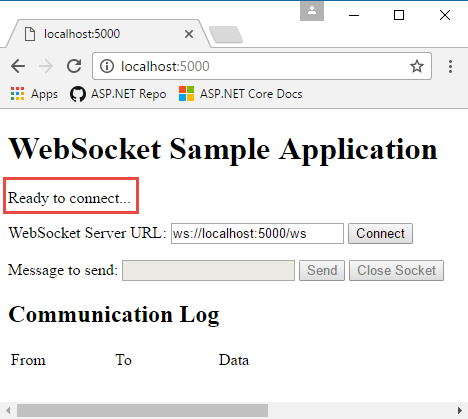
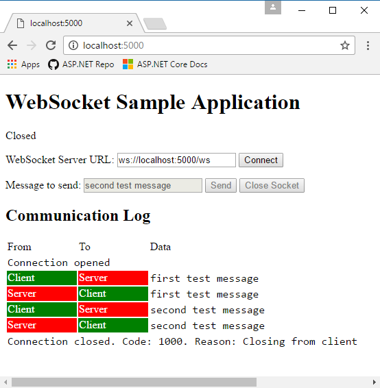

# WebSockets support in ASP.NET Core

By [Tom Dykstra](https://github.com/tdykstra) and [Andrew Stanton-Nurse](https://github.com/anurse)

This article explains how to get started with WebSockets in ASP.NET Core. [WebSocket](https://wikipedia.org/wiki/WebSocket) ([RFC 6455](https://tools.ietf.org/html/rfc6455)) is a protocol that enables two-way persistent communication channels over TCP connections. It's used in apps that benefit from fast, real-time communication, such as chat, dashboard, and game apps.

[View or download sample code](https://github.com/dotnet/AspNetCore.Docs/tree/master/aspnetcore/fundamentals/websockets/samples) ([how to download](xref:index#how-to-download-a-sample)). [How to run](#sample-app).

## SignalR

[ASP.NET Core SignalR](xref:signalr/introduction) is a library that simplifies adding real-time web functionality to apps. It uses WebSockets whenever possible.

For most applications, we recommend SignalR over raw WebSockets. SignalR provides transport fallback for environments where WebSockets is not available. It also provides a simple remote procedure call app model. And in most scenarios, SignalR has no significant performance disadvantage compared to using raw WebSockets.

## Prerequisites

* ASP.NET Core 1.1 or later
* Any OS that supports ASP.NET Core:
  
  * Windows 7 / Windows Server 2008 or later
  * Linux
  * macOS
  
* If the app runs on Windows with IIS:

  * Windows 8 / Windows Server 2012 or later
  * IIS 8 / IIS 8 Express
  * WebSockets must be enabled (See the [IIS/IIS Express support](#iisiis-express-support) section.).
  
* If the app runs on [HTTP.sys](xref:fundamentals/servers/httpsys):

  * Windows 8 / Windows Server 2012 or later

* For supported browsers, see https://caniuse.com/#feat=websockets.

::: moniker range="< aspnetcore-2.1"

## NuGet package

Install the [Microsoft.AspNetCore.WebSockets](https://www.nuget.org/packages/Microsoft.AspNetCore.WebSockets/) package.

::: moniker-end

## Configure the middleware


Add the WebSockets middleware in the `Configure` method of the `Startup` class:

[!code-csharp[](websockets/samples/2.x/WebSocketsSample/Startup.cs?name=UseWebSockets)]

::: moniker range="< aspnetcore-2.2"

The following settings can be configured:

* `KeepAliveInterval` - How frequently to send "ping" frames to the client to ensure proxies keep the connection open. The default is two minutes.
* `ReceiveBufferSize` - The size of the buffer used to receive data. Advanced users may need to change this for performance tuning based on the size of the data. The default is 4 KB.

::: moniker-end

::: moniker range=">= aspnetcore-2.2"

The following settings can be configured:

* `KeepAliveInterval` - How frequently to send "ping" frames to the client to ensure proxies keep the connection open. The default is two minutes.
* <xref:Microsoft.AspNetCore.Builder.WebSocketOptions.ReceiveBufferSize> - The size of the buffer used to receive data. Advanced users may need to change this for performance tuning based on the size of the data. The default is 4 KB.
* `AllowedOrigins` - A list of allowed Origin header values for WebSocket requests. By default, all origins are allowed. See "WebSocket origin restriction" below for details.

::: moniker-end

[!code-csharp[](websockets/samples/2.x/WebSocketsSample/Startup.cs?name=UseWebSocketsOptions)]

## Accept WebSocket requests

Somewhere later in the request life cycle (later in the `Configure` method or in an action method, for example) check if it's a WebSocket request and accept the WebSocket request.

The following example is from later in the `Configure` method:

[!code-csharp[](websockets/samples/2.x/WebSocketsSample/Startup.cs?name=AcceptWebSocket&highlight=7)]

A WebSocket request could come in on any URL, but this sample code only accepts requests for `/ws`.

When using a WebSocket, you **must** keep the middleware pipeline running for the duration of the connection. If you attempt to send or receive a WebSocket message after the middleware pipeline ends, you may get an exception like the following:

```
System.Net.WebSockets.WebSocketException (0x80004005): The remote party closed the WebSocket connection without completing the close handshake. ---> System.ObjectDisposedException: Cannot write to the response body, the response has completed.
Object name: 'HttpResponseStream'.
```

If you're using a background service to write data to a WebSocket, make sure you keep the middleware pipeline running. Do this by using a <xref:System.Threading.Tasks.TaskCompletionSource%601>. Pass the `TaskCompletionSource` to your background service and have it call <xref:System.Threading.Tasks.TaskCompletionSource%601.TrySetResult%2A> when you finish with the WebSocket. Then `await` the <xref:System.Threading.Tasks.TaskCompletionSource%601.Task> property during the request, as shown in the following example:

```csharp
app.Use(async (context, next) => {
    var socket = await context.WebSockets.AcceptWebSocketAsync();
    var socketFinishedTcs = new TaskCompletionSource<object>();

    BackgroundSocketProcessor.AddSocket(socket, socketFinishedTcs); 

    await socketFinishedTcs.Task;
});
```
The WebSocket closed exception can also happen if you return too soon from an action method. If you accept a socket in an action method, wait for the code that uses the socket to complete before returning from the action method.

Never use `Task.Wait()`, `Task.Result`, or similar blocking calls to wait for the socket to complete, as that can cause serious threading issues. Always use `await`.

## Send and receive messages

The `AcceptWebSocketAsync` method upgrades the TCP connection to a WebSocket connection and provides a [WebSocket](/dotnet/core/api/system.net.websockets.websocket) object. Use the `WebSocket` object to send and receive messages.

The code shown earlier that accepts the WebSocket request passes the `WebSocket` object to an `Echo` method. The code receives a message and immediately sends back the same message. Messages are sent and received in a loop until the client closes the connection:

[!code-csharp[](websockets/samples/2.x/WebSocketsSample/Startup.cs?name=Echo)]

When accepting the WebSocket connection before beginning the loop, the middleware pipeline ends. Upon closing the socket, the pipeline unwinds. That is, the request stops moving forward in the pipeline when the WebSocket is accepted. When the loop is finished and the socket is closed, the request proceeds back up the pipeline.

::: moniker range=">= aspnetcore-2.2"

## Handle client disconnects

The server is not automatically informed when the client disconnects due to loss of connectivity. The server receives a disconnect message only if the client sends it, which can't be done if the internet connection is lost. If you want to take some action when that happens, set a timeout after nothing is received from the client within a certain time window.

If the client isn't always sending messages and you don't want to timeout just because the connection goes idle, have the client use a timer to send a ping message every X seconds. On the server, if a message hasn't arrived within 2\*X seconds after the previous one, terminate the connection and report that the client disconnected. Wait for twice the expected time interval to leave extra time for network delays that might hold up the ping message.

## WebSocket origin restriction

The protections provided by CORS don't apply to WebSockets. Browsers do **not**:

* Perform CORS pre-flight requests.
* Respect the restrictions specified in `Access-Control` headers when making WebSocket requests.

However, browsers do send the `Origin` header when issuing WebSocket requests. Applications should be configured to validate these headers to ensure that only WebSockets coming from the expected origins are allowed.

If you're hosting your server on "https://server.com" and hosting your client on "https://client.com", add "https://client.com" to the `AllowedOrigins` list for WebSockets to verify.

[!code-csharp[](websockets/samples/2.x/WebSocketsSample/Startup.cs?name=UseWebSocketsOptionsAO&highlight=6-7)]

> [!NOTE]
> The `Origin` header is controlled by the client and, like the `Referer` header, can be faked. Do **not** use these headers as an authentication mechanism.

::: moniker-end

## IIS/IIS Express support

Windows Server 2012 or later and Windows 8 or later with IIS/IIS Express 8 or later has support for the WebSocket protocol.

> [!NOTE]
> WebSockets are always enabled when using IIS Express.

### Enabling WebSockets on IIS

To enable support for the WebSocket protocol on Windows Server 2012 or later:

> [!NOTE]
> These steps are not required when using IIS Express

1. Use the **Add Roles and Features** wizard from the **Manage** menu or the link in **Server Manager**.
1. Select **Role-based or Feature-based Installation**. Select **Next**.
1. Select the appropriate server (the local server is selected by default). Select **Next**.
1. Expand **Web Server (IIS)** in the **Roles** tree, expand **Web Server**, and then expand **Application Development**.
1. Select **WebSocket Protocol**. Select **Next**.
1. If additional features aren't needed, select **Next**.
1. Select **Install**.
1. When the installation completes, select **Close** to exit the wizard.

To enable support for the WebSocket protocol on Windows 8 or later:

> [!NOTE]
> These steps are not required when using IIS Express

1. Navigate to **Control Panel** > **Programs** > **Programs and Features** > **Turn Windows features on or off** (left side of the screen).
1. Open the following nodes: **Internet Information Services** > **World Wide Web Services** > **Application Development Features**.
1. Select the **WebSocket Protocol** feature. Select **OK**.

### Disable WebSocket when using socket.io on Node.js

If using the WebSocket support in [socket.io](https://socket.io/) on [Node.js](https://nodejs.org/), disable the default IIS WebSocket module using the `webSocket` element in *web.config* or *applicationHost.config*. If this step isn't performed, the IIS WebSocket module attempts to handle the WebSocket communication rather than Node.js and the app.

```xml
<system.webServer>
  <webSocket enabled="false" />
</system.webServer>
```

## Sample app

The [sample app](https://github.com/dotnet/AspNetCore.Docs/tree/master/aspnetcore/fundamentals/websockets/samples) that accompanies this article is an echo app. It has a web page that makes WebSocket connections, and the server resends any messages it receives back to the client. Run the app from a command prompt (it's not set up to run from Visual Studio with IIS Express) and navigate to http://localhost:5000. The web page shows the connection status in the upper left:



Select **Connect** to send a WebSocket request to the URL shown. Enter a test message and select **Send**. When done, select **Close Socket**. The **Communication Log** section reports each open, send, and close action as it happens.



