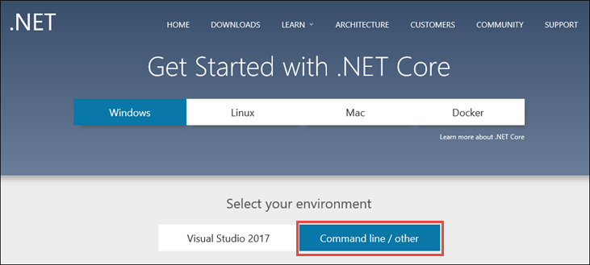

# Getting Started with ASP.NET Core 1.1

> [!NOTE]
> These instructions are for ASP.NET Core 1.1. Looking for the latest preview version? See [the 2.0 version of this tutorial](xref:getting-started).

<!-- use this #1 after RTW, check version number
1. Install the .NET Core 1.0.4 SDK from the [.NET Core downloads page](https://microsoft.com/net/download/core/).
-->

1. Install [.NET Core](https://microsoft.com/net/core).

   If you're on Windows, select the **Command line / other** environment. 
   

2. Create a folder for a new .NET Core project.

   On macOS and Linux, open a terminal window. On Windows, open a command prompt.

   ```terminal
   mkdir aspnetcoreapp
   cd aspnetcoreapp
   ```

2. If you have installed a later preview release on your machine, create a *global.json* file to select the 1.0.4 SDK.

   ```json
   {
     "sdk": { "version": "1.0.4" }
   }
   ```

2. Create a new .NET Core project.

   ```terminal
   dotnet new web
   ```
   
   <!-- commenting out for now, restore if this turns out to be a problem still 
   Note: Earlier versions of .NET Core required a `t` parameter, that is, `dotnet new -t web`. If you get an error running `dotnet new web`, run `dotnet --version` to verify that you are using version 1.1.0.
   -->

3.  Restore the packages.

    ```terminal
    dotnet restore
    ```

4. Run the app.

   The `dotnet run` command builds the app first if needed.

   ```terminal
   dotnet run
   ```

5. Browse to `http://localhost:5000`

<!-- H3 to avoid a single-entry internal TOC -->
### Next steps

For getting-started tutorials, see [ASP.NET Core Tutorials](tutorials/index.md)

For an introduction to ASP.NET Core concepts and architecture, see [ASP.NET Core Introduction](index.md) and [ASP.NET Core Fundamentals](fundamentals/index.md).

An ASP.NET Core app can use the .NET Core or .NET Framework Base Class Library and runtime. For more information, see [Choosing between .NET Core and .NET Framework](https://docs.microsoft.com/dotnet/articles/standard/choosing-core-framework-server).
