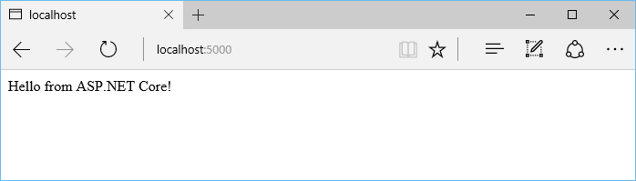

# Getting Started

1.  Install [.NET Core](https://microsoft.com/net/core)

2.  Create a new .NET Core project:

    ````console
    mkdir aspnetcoreapp
    cd aspnetcoreapp
    dotnet new
    ````

3.  Update the *project.json* file to add the Kestrel HTTP server package as a dependency:

    [!code-csharp[Main](./getting-started/sample/aspnetcoreapp/project.json?highlight=15)]

4.  Restore the packages:

    ````console
    dotnet restore
    ````
5.  Add a *Startup.cs* file that defines the request handling logic:

    [!code-csharp[Main](getting-started/sample/aspnetcoreapp/Startup.cs)]

6.  Update the code in *Program.cs* to setup and start the Web host:

    [!code-csharp[Main](./getting-started/sample/aspnetcoreapp/Program.cs?highlight=2,4,10,11,12,13,14,15)]

7.  Run the app  (the `dotnet run` command will build the app when it's out of date):

    ````console
    dotnet run
    ````

8.  Browse to http://localhost:5000:

    

## Next steps

* [Building your first ASP.NET Core MVC app with Visual Studio](tutorials/first-mvc-app/index.md)

* [Your First ASP.NET Core Application on a Mac Using Visual Studio Code](tutorials/your-first-mac-aspnet.md)

* [Building Your First Web API with ASP.NET Core MVC and Visual Studio](tutorials/first-web-api.md)

* [Fundamentals](fundamentals/index.md)
