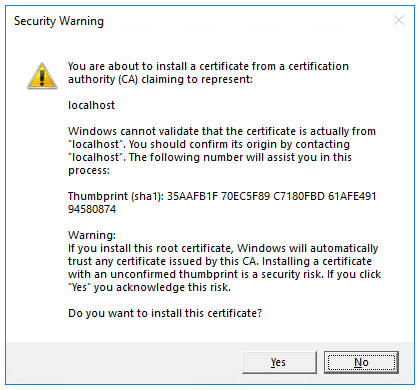

# Get started with ASP.NET Core

::: moniker range=">= aspnetcore-2.1"

1. Install the [!INCLUDE [](~/includes/2.1-SDK.md)].

2. Create an ASP.NET Core project. Open a command shell and enter the following command:

    ```console
    dotnet new webapp -o aspnetcoreapp
    ```

    [!INCLUDE [](~/includes/webapp-alias-notice.md)]

3. Trust the HTTPS development certificate:

# [Windows](#tab/windows)

    ```console
    dotnet dev-certs https --trust
    ```

   The preceding command displays the following dialog:

   

   Select **Yes** if you agree to trust the development certificate.

# [macOS](#tab/macos)

    ```console
    dotnet dev-certs https --trust
    ```

   The preceding command displays the following message:

   *Trusting the HTTPS development certificate was requested. If the certificate is not already trusted we will run the following command:*
   `'sudo security add-trusted-cert -d -r trustRoot -k /Library/Keychains/System.keychain <<certificate>>'`
   *This command might prompt you for your password to install the certificate on the system keychain.
   Password:*

   Enter your password if you agree to trust the development certificate.

# [Linux](#tab/linux)

   See the documentation for your Linux distribution on how to trust the HTTPS development certificate
---

4. Run the app:

    ```console
    cd aspnetcoreapp
    dotnet run
    ```

5. Browse to [http://localhost:5001](http://localhost:5001).  Click **Accept** to accept the privacy and cookie policy. This app doesn't keep personal information.

6. Open *Pages/About.cshtml* and modify the page with the following highlighted markup:

    [!code-cshtml[](sample/getting-started/about.cshtml?highlight=9)]

7. Browse to [http://localhost:5001/About](http://localhost:5001/About) and verify the changes are displayed.

[!INCLUDE [next steps](~/includes/getting-started/next-steps.md)]

::: moniker-end

::: moniker range="= aspnetcore-2.0"

1. Install the [!INCLUDE [](~/includes/net-core-sdk-download-link.md)].

2. Create a new ASP.NET Core project.

   Open a command shell. Enter the following command:

    ```console
    dotnet new razor -o aspnetcoreapp
    ```

3. Run the app with the following commands:

    ```console
    cd aspnetcoreapp
    dotnet run
    ```

4. Browse to [http://localhost:5000](http://localhost:5000).

5. Open *Pages/About.cshtml* and modify the page to display the message "Hello, world! The time on the server is @DateTime.Now":

    [!code-cshtml[](sample/getting-started/about.cshtml?highlight=9&range=1-9)]

6. Browse to [http://localhost:5000/About](http://localhost:5000/About) and verify the changes.

[!INCLUDE [next steps](~/includes/getting-started/next-steps.md)]

::: moniker-end

::: moniker range="<= aspnetcore-1.1"

1. Install the .NET Core **SDK Installer** for SDK 1.0.4 from the [.NET Core All Downloads page](https://www.microsoft.com/net/download/all).

2. Create a folder for a new ASP.NET Core project.

   Open a command shell. Enter the following commands:

   ```console
   mkdir aspnetcoreapp
   cd aspnetcoreapp
   ```

3. If you have installed a later SDK version on your machine, create a *global.json* file to select the 1.0.4 SDK.

   ```json
   {
     "sdk": { "version": "1.0.4" }
   }
   ```

4. Create a new ASP.NET Core project.

   ```console
   dotnet new web
   ```

5. Restore the packages.

    ```console
    dotnet restore
    ```

6. Run the app.

   ```console
   dotnet run
   ```

   The [dotnet run](/dotnet/core/tools/dotnet-run) command builds the app first, if needed.

7. Browse to `http://localhost:5000`.

[!INCLUDE [next steps](~/includes/getting-started/next-steps.md)]
::: moniker-end
