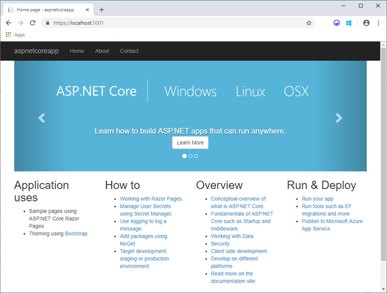

# Tutorial: Get started with ASP.NET Core

This tutorial shows how to use the .NET Core command-line interface to create and run an ASP.NET Core web app.

You'll learn how to:

> [!div class="checklist"]
> * Create a web app project.
> * Trust the development certificate.
> * Run the app.
> * Edit a Razor page.

At the end, you'll have a working web app running on your local machine.



## Prerequisites

* [.NET Core 2.2 SDK](https://www.microsoft.com/net/download/all)

## Create a web app project

Open a command shell, and enter the following command:

```dotnetcli
dotnet new webapp -o aspnetcoreapp
```

### Trust the development certificate

Trust the HTTPS development certificate:

# [Windows](#tab/windows)

```dotnetcli
dotnet dev-certs https --trust
```

The preceding command displays the following dialog:


Select **Yes** if you agree to trust the development certificate.

# [macOS](#tab/macos)

```dotnetcli
dotnet dev-certs https --trust
```

The preceding command displays the following message:

*Trusting the HTTPS development certificate was requested. If the certificate is not already trusted we will run the following command:* `'sudo security add-trusted-cert -d -r trustRoot -k /Library/Keychains/System.keychain <<certificate>>'`

This command might prompt you for your password to install the certificate on the system keychain. Enter your password if you agree to trust the development certificate.

# [Linux](#tab/linux)

For Windows Subsystem for Linux, see [Trust HTTPS certificate from Windows Subsystem for Linux](xref:security/enforcing-ssl#wsl).

See the documentation for your Linux distribution on how to trust the HTTPS development certificate.

---

For more information, see [Trust the ASP.NET Core HTTPS development certificate](xref:security/enforcing-ssl#trust-the-aspnet-core-https-development-certificate-on-windows-and-macos)

## Run the app

Run the following commands:

```dotnetcli
cd aspnetcoreapp
dotnet run
```

After the command shell indicates that the app has started, browse to [https://localhost:5001](https://localhost:5001). Click **Accept** to accept the privacy and cookie policy. This app doesn't keep personal information.

## Edit a Razor page

Open *Pages/Index.cshtml* and modify the page with the following highlighted markup:

[!code-cshtml[](sample/index.cshtml?highlight=9)]

Browse to [https://localhost:5001](https://localhost:5001), and verify the changes are displayed.

## Next steps

In this tutorial, you learned how to:

> [!div class="checklist"]
> * Create a web app project.
> * Trust the development certificate.
> * Run the project.
> * Make a change.

To learn more about ASP.NET Core, see the recommended learning path in the introduction:

> [!div class="nextstepaction"]
> <xref:index#recommended-learning-path>
