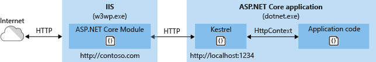

# ASP.NET Core Module (ANCM) for IIS

:::moniker range=">= aspnetcore-5.0"

The ASP.NET Core Module (ANCM) is a native IIS module that plugs into the IIS pipeline, allowing ASP.NET Core applications to work with IIS. Run ASP.NET Core apps with IIS by either: 

* Hosting an ASP.NET Core app inside of the IIS worker process (`w3wp.exe`), called the [in-process hosting model](xref:host-and-deploy/iis/in-process-hosting).
* Forwarding web requests to a backend ASP.NET Core app running the Kestrel server, called the [out-of-process hosting model](xref:host-and-deploy/iis/out-of-process-hosting).

There are trade-offs between each of the hosting models. By default, the in-process hosting model is used due to better performance and diagnostics.

For more information and configuration guidance, see the following topics:
* <xref:fundamentals/servers/index>

## Install ASP.NET Core Module (ANCM)

The ASP.NET Core Module (ANCM) is installed with the .NET Core Runtime from the [.NET Core Hosting Bundle](xref:host-and-deploy/iis/hosting-bundle). The ASP.NET Core Module is forward and backward compatible with LTS releases of .NET.

[!INCLUDE[](~/includes/announcements.md)]

Download the installer using the following link:

[Current .NET Core Hosting Bundle installer (direct download)](https://dotnet.microsoft.com/permalink/dotnetcore-current-windows-runtime-bundle-installer)

For more information, including installing an earlier version of the module, see <xref:host-and-deploy/iis/hosting-bundle>.

For a tutorial experience on publishing an ASP.NET Core app to an IIS server, see <xref:tutorials/publish-to-iis>.

:::moniker-end

:::moniker range=">= aspnetcore-3.0 < aspnetcore-5.0"

The ASP.NET Core Module (ANCM) is a native IIS module that plugs into the IIS pipeline to either:

* Host an ASP.NET Core app inside of the IIS worker process (`w3wp.exe`), called the [in-process hosting model](#in-process-hosting-model).
* Forward web requests to a backend ASP.NET Core app running the [Kestrel server](xref:fundamentals/servers/kestrel), called the [out-of-process hosting model](#out-of-process-hosting-model).

Supported Windows versions:

* Windows 7 or later
* Windows Server 2012 R2 or later

When hosting in-process, the module uses an in-process server implementation for IIS, called IIS HTTP Server (`IISHttpServer`).

When hosting out-of-process, the module only works with Kestrel. The module doesn't function with [HTTP.sys](xref:fundamentals/servers/httpsys).

## Hosting models

### In-process hosting model

ASP.NET Core apps default to the in-process hosting model.

The following characteristics apply when hosting in-process:

* IIS HTTP Server (`IISHttpServer`) is used instead of [Kestrel](xref:fundamentals/servers/kestrel) server. For in-process, [CreateDefaultBuilder](xref:fundamentals/host/generic-host#default-builder-settings) calls <xref:Microsoft.AspNetCore.Hosting.WebHostBuilderIISExtensions.UseIIS*> to:

  * Register the `IISHttpServer`.
  * Configure the port and base path the server should listen on when running behind the ASP.NET Core Module.
  * Configure the host to capture startup errors.

* The [requestTimeout attribute](#attributes-of-the-aspnetcore-element) doesn't apply to in-process hosting.

* Sharing an app pool among apps isn't supported. Use one app pool per app.

* When using [Web Deploy](/iis/publish/using-web-deploy/introduction-to-web-deploy) or manually placing an [`app_offline.htm` file in the deployment](xref:host-and-deploy/iis/index#locked-deployment-files), the app might not shut down immediately if there's an open connection. For example, a WebSocket connection may delay app shut down.

* The architecture (bitness) of the app and installed runtime (x64 or x86) must match the architecture of the app pool.

* Client disconnects are detected. The [`HttpContext.RequestAborted`](xref:Microsoft.AspNetCore.Http.HttpContext.RequestAborted*) cancellation token is cancelled when the client disconnects.

* In ASP.NET Core 2.2.1 or earlier, <xref:System.IO.Directory.GetCurrentDirectory*> returns the worker directory of the process started by IIS rather than the app's directory (for example, `C:\Windows\System32\inetsrv` for `w3wp.exe`).

  For sample code that sets the app's current directory, see the [`CurrentDirectoryHelpers` class](https://github.com/dotnet/AspNetCore.Docs/tree/main/aspnetcore/host-and-deploy/aspnet-core-module/samples_snapshot/3.x/CurrentDirectoryHelpers.cs). Call the `SetCurrentDirectory` method. Subsequent calls to <xref:System.IO.Directory.GetCurrentDirectory*> provide the app's directory.

* When hosting in-process, <xref:Microsoft.AspNetCore.Authentication.AuthenticationService.AuthenticateAsync*> isn't called internally to initialize a user. Therefore, an <xref:Microsoft.AspNetCore.Authentication.IClaimsTransformation> implementation used to transform claims after every authentication isn't activated by default. When transforming claims with an <xref:Microsoft.AspNetCore.Authentication.IClaimsTransformation> implementation, call <xref:Microsoft.Extensions.DependencyInjection.AuthenticationServiceCollectionExtensions.AddAuthentication*> to add authentication services:

  ```csharp
  public void ConfigureServices(IServiceCollection services)
  {
      services.AddTransient<IClaimsTransformation, ClaimsTransformer>();
      services.AddAuthentication(IISServerDefaults.AuthenticationScheme);
  }

  public void Configure(IApplicationBuilder app)
  {
      app.UseAuthentication();
  }
  ```
  
  * [Web Package (single-file) deployments](/aspnet/web-forms/overview/deployment/web-deployment-in-the-enterprise/deploying-web-packages) aren't supported.

### Out-of-process hosting model

To configure an app for out-of-process hosting, set the value of the `<AspNetCoreHostingModel>` property to `OutOfProcess` in the project file (`.csproj`):

```xml
<PropertyGroup>
  <AspNetCoreHostingModel>OutOfProcess</AspNetCoreHostingModel>
</PropertyGroup>
```

In-process hosting is set with `InProcess`, which is the default value.

The value of `<AspNetCoreHostingModel>` is case insensitive, so `inprocess` and `outofprocess` are valid values.

[Kestrel](xref:fundamentals/servers/kestrel) server is used instead of IIS HTTP Server (`IISHttpServer`).

For out-of-process, [`CreateDefaultBuilder`](xref:fundamentals/host/generic-host#default-builder-settings) calls <xref:Microsoft.AspNetCore.Hosting.WebHostBuilderIISExtensions.UseIISIntegration*> to:

* Configure the port and base path the server should listen on when running behind the ASP.NET Core Module.
* Configure the host to capture startup errors.

### Hosting model changes

If the `hostingModel` setting is changed in the `web.config` file (explained in the [Configuration with `web.config`](#configuration-with-webconfig) section), the module recycles the worker process for IIS.

For IIS Express, the module doesn't recycle the worker process but instead triggers a graceful shutdown of the current IIS Express process. The next request to the app spawns a new IIS Express process.

### Process name

`Process.GetCurrentProcess().ProcessName` reports `w3wp`/`iisexpress` (in-process) or `dotnet` (out-of-process).

Many native modules, such as Windows Authentication, remain active. To learn more about IIS modules active with the ASP.NET Core Module, see <xref:host-and-deploy/iis/modules>.

The ASP.NET Core Module can also:

* Set environment variables for the worker process.
* Log stdout output to file storage for troubleshooting startup issues.
* Forward Windows authentication tokens.

## How to install and use the ASP.NET Core Module (ANCM)

For instructions on how to install the ASP.NET Core Module, see [Install the .NET Core Hosting Bundle](xref:host-and-deploy/iis/index#install-the-net-core-hosting-bundle). The ASP.NET Core Module is forward and backward compatible with LTS releases of .NET.

[!INCLUDE[](~/includes/announcements.md)]

## Configuration with web.config

The ASP.NET Core Module is configured with the `aspNetCore` section of the `system.webServer` node in the site's *web.config* file.

The following `web.config` file is published for a [framework-dependent deployment](/dotnet/articles/core/deploying/#framework-dependent-deployments-fdd) and configures the ASP.NET Core Module to handle site requests:

```xml
<?xml version="1.0" encoding="utf-8"?>
<configuration>
  <location path="." inheritInChildApplications="false">
    <system.webServer>
      <handlers>
        <add name="aspNetCore" path="*" verb="*" modules="AspNetCoreModuleV2" resourceType="Unspecified" />
      </handlers>
      <aspNetCore processPath="dotnet"
                  arguments=".\MyApp.dll"
                  stdoutLogEnabled="false"
                  stdoutLogFile=".\logs\stdout"
                  hostingModel="inprocess" />
    </system.webServer>
  </location>
</configuration>
```

The following *web.config* is published for a [self-contained deployment](/dotnet/articles/core/deploying/#self-contained-deployments-scd):

```xml
<?xml version="1.0" encoding="utf-8"?>
<configuration>
  <location path="." inheritInChildApplications="false">
    <system.webServer>
      <handlers>
        <add name="aspNetCore" path="*" verb="*" modules="AspNetCoreModuleV2" resourceType="Unspecified" />
      </handlers>
      <aspNetCore processPath=".\MyApp.exe"
                  stdoutLogEnabled="false"
                  stdoutLogFile=".\logs\stdout"
                  hostingModel="inprocess" />
    </system.webServer>
  </location>
</configuration>
```

The <xref:System.Configuration.SectionInformation.InheritInChildApplications*> property is set to `false` to indicate that the settings specified within the [`<location>`](/iis/manage/managing-your-configuration-settings/understanding-iis-configuration-delegation#the-concept-of-location) element aren't inherited by apps that reside in a subdirectory of the app.

When an app is deployed to [Azure App Service](https://azure.microsoft.com/services/app-service/), the `stdoutLogFile` path is set to `\\?\%home%\LogFiles\stdout`. The path saves stdout logs to the `LogFiles` folder, which is a location automatically created by the service.

For information on IIS sub-application configuration, see <xref:host-and-deploy/iis/index#sub-applications>.

### Attributes of the aspNetCore element

| Attribute | Description | Default |
| --------- | ----------- | :-----: |
| `arguments` | <p>Optional string attribute.</p><p>Arguments to the executable specified in **processPath**.</p> | |
| `disableStartUpErrorPage` | <p>Optional Boolean attribute.</p><p>If true, the **502.5 - Process Failure** page is suppressed, and the 502 status code page configured in the *web.config* takes precedence.</p> | `false` |
| `forwardWindowsAuthToken` | <p>Optional Boolean attribute.</p><p>If true, the token is forwarded to the child process listening on `%ASPNETCORE_PORT%` as a header `'MS-ASPNETCORE-WINAUTHTOKEN'` per request. It's the responsibility of that process to call CloseHandle on this token per request.</p> | `true` |
| `hostingModel` | <p>Optional string attribute.</p><p>Specifies the hosting model as in-process (`InProcess`/`inprocess`) or out-of-process (`OutOfProcess`/`outofprocess`).</p> | `InProcess`<br>`inprocess` |
| `processesPerApplication` | <p>Optional integer attribute.</p><p>Specifies the number of instances of the process specified in the **processPath** setting that can be spun up per app.</p><p>&dagger;For in-process hosting, the value is limited to `1`.</p><p>Setting `processesPerApplication` is discouraged. This attribute will be removed in a future release.</p> | Default: `1`<br>Min: `1`<br>Max: `100`&dagger; |
| `processPath` | <p>Required string attribute.</p><p>Path to the executable that launches a process listening for HTTP requests. Relative paths are supported. If the path begins with `.`, the path is considered to be relative to the site root.</p> | |
| `rapidFailsPerMinute` | <p>Optional integer attribute.</p><p>Specifies the number of times the process specified in **processPath** is allowed to crash per minute. If this limit is exceeded, the module stops launching the process for the remainder of the minute.</p><p>Not supported with in-process hosting.</p> | Default: `10`<br>Min: `0`<br>Max: `100` |
| `requestTimeout` | <p>Optional timespan attribute.</p><p>Specifies the duration for which the ASP.NET Core Module waits for a response from the process listening on %ASPNETCORE_PORT%.</p><p>In versions of the ASP.NET Core Module that shipped with the release of ASP.NET Core 2.1 or later, the `requestTimeout` is specified in hours, minutes, and seconds.</p><p>Doesn't apply to in-process hosting. For in-process hosting, the module waits for the app to process the request.</p><p>Valid values for minutes and seconds segments of the string are in the range 0-59. Use of **60** in the value for minutes or seconds results in a *500 - Internal Server Error*.</p> | Default: `00:02:00`<br>Min: `00:00:00`<br>Max: `360:00:00` |
| `shutdownTimeLimit` | <p>Optional integer attribute.</p><p>Duration in seconds that the module waits for the executable to gracefully shutdown when the `app_offline.htm` file is detected.</p> | Default: `10`<br>Min: `0`<br>Max: `600` |
| `startupTimeLimit` | <p>Optional integer attribute.</p><p>Duration in seconds that the module waits for the executable to start a process listening on the port. If this time limit is exceeded, the module kills the process.</p><p>When hosting *in-process*: The process is **not** restarted and does **not** use the **rapidFailsPerMinute** setting.</p><p>When hosting *out-of-process*: The module attempts to relaunch the process when it receives a new request and continues to attempt to restart the process on subsequent incoming requests unless the app fails to start **rapidFailsPerMinute** number of times in the last rolling minute.</p><p>A value of 0 (zero) is **not** considered an infinite timeout.</p> | Default: `120`<br>Min: `0`<br>Max: `3600` |
| `stdoutLogEnabled` | <p>Optional Boolean attribute.</p><p>If true, **stdout** and **stderr** for the process specified in **processPath** are redirected to the file specified in **stdoutLogFile**.</p> | `false` |
| `stdoutLogFile` | <p>Optional string attribute.</p><p>Specifies the relative or absolute file path for which **stdout** and **stderr** from the process specified in **processPath** are logged. Relative paths are relative to the root of the site. Any path starting with `.` are relative to the site root and all other paths are treated as absolute paths. Any folders provided in the path are created by the module when the log file is created. Using underscore delimiters, a timestamp, process ID, and file extension (`.log`) are added to the last segment of the **stdoutLogFile** path. If `.\logs\stdout` is supplied as a value, an example stdout log is saved as `stdout_20180205194132_1934.log` in the `logs` folder when saved on 2/5/2018 at 19:41:32 with a process ID of 1934.</p> | `aspnetcore-stdout` |

### Set environment variables

Environment variables can be specified for the process in the `processPath` attribute. Specify an environment variable with the `<environmentVariable>` child element of an `<environmentVariables>` collection element. Environment variables set in this section take precedence over system environment variables.

The following example sets two environment variables in `web.config`. `ASPNETCORE_ENVIRONMENT` configures the app's environment to `Development`. A developer may temporarily set this value in the `web.config` file in order to force the [Developer Exception Page](xref:fundamentals/error-handling) to load when debugging an app exception. `CONFIG_DIR` is an example of a user-defined environment variable, where the developer has written code that reads the value on startup to form a path for loading the app's configuration file.

```xml
<aspNetCore processPath="dotnet"
      arguments=".\MyApp.dll"
      stdoutLogEnabled="false"
      stdoutLogFile=".\logs\stdout"
      hostingModel="inprocess">
  <environmentVariables>
    <environmentVariable name="ASPNETCORE_ENVIRONMENT" value="Development" />
    <environmentVariable name="CONFIG_DIR" value="f:\application_config" />
  </environmentVariables>
</aspNetCore>
```

> [!NOTE]
> An alternative to setting the environment directly in `web.config` is to include the `<EnvironmentName>` property in the [publish profile (`.pubxml`)](xref:host-and-deploy/visual-studio-publish-profiles) or project file. This approach sets the environment in `web.config` when the project is published:
>
> ```xml
> <PropertyGroup>
>   <EnvironmentName>Development</EnvironmentName>
> </PropertyGroup>
> ```

> [!WARNING]
> Only set the `ASPNETCORE_ENVIRONMENT` environment variable to `Development` on staging and testing servers that aren't accessible to untrusted networks, such as the Internet.

## `app_offline.htm`

If a file with the name `app_offline.htm` is detected in the root directory of an app, the ASP.NET Core Module attempts to gracefully shutdown the app and stop processing incoming requests. If the app is still running after the number of seconds defined in `shutdownTimeLimit`, the ASP.NET Core Module kills the running process.

While the `app_offline.htm` file is present, the ASP.NET Core Module responds to requests by sending back the contents of the `app_offline.htm` file. When the `app_offline.htm` file is removed, the next request starts the app.

When using the out-of-process hosting model, the app might not shut down immediately if there's an open connection. For example, a WebSocket connection may delay app shut down.

## Start-up error page

Both in-process and out-of-process hosting produce custom error pages when they fail to start the app.

If the ASP.NET Core Module fails to find either the in-process or out-of-process request handler, a *500.0 - In-Process/Out-Of-Process Handler Load Failure* status code page appears.

For in-process hosting if the ASP.NET Core Module fails to start the app, a *500.30 - Start Failure* status code page appears.

For out-of-process hosting if the ASP.NET Core Module fails to launch the backend process or the backend process starts but fails to listen on the configured port, a *502.5 - Process Failure* status code page appears.

To suppress this page and revert to the default IIS 5xx status code page, use the `disableStartUpErrorPage` attribute. For more information on configuring custom error messages, see [HTTP Errors `<httpErrors>`](/iis/configuration/system.webServer/httpErrors/).

## Log creation and redirection

The ASP.NET Core Module redirects stdout and stderr console output to disk if the `stdoutLogEnabled` and `stdoutLogFile` attributes of the `aspNetCore` element are set. Any folders in the `stdoutLogFile` path are created by the module when the log file is created. The app pool must have write access to the location where the logs are written (use `IIS AppPool\<app_pool_name>` to provide write permission).

Logs aren't rotated, unless process recycling/restart occurs. It's the responsibility of the hoster to limit the disk space the logs consume.

Using the stdout log is only recommended for troubleshooting app startup issues when hosting on IIS or when using [development-time support for IIS with Visual Studio](xref:host-and-deploy/iis/development-time-iis-support), not while debugging locally and running the app with IIS Express.

Don't use the stdout log for general app logging purposes. For routine logging in an ASP.NET Core app, use a logging library that limits log file size and rotates logs. For more information, see [third-party logging providers](xref:fundamentals/logging/index#third-party-logging-providers).

A timestamp and file extension are added automatically when the log file is created. The log file name is composed by appending the timestamp, process ID, and file extension (`.log`) to the last segment of the `stdoutLogFile` path (typically `stdout`) delimited by underscores. If the `stdoutLogFile` path ends with `stdout`, a log for an app with a PID of 1934 created on 2/5/2018 at 19:42:32 has the file name `stdout_20180205194132_1934.log`.

If `stdoutLogEnabled` is false, errors that occur on app startup are captured and emitted to the event log up to 30 KB. After startup, all additional logs are discarded.

The following sample `aspNetCore` element configures stdout logging at the relative path `.\log\`. Confirm that the AppPool user identity has permission to write to the path provided.

```xml
<aspNetCore processPath="dotnet"
    arguments=".\MyApp.dll"
    stdoutLogEnabled="true"
    stdoutLogFile=".\logs\stdout"
    hostingModel="inprocess">
</aspNetCore>
```

When publishing an app for Azure App Service deployment, the Web SDK sets the `stdoutLogFile` value to `\\?\%home%\LogFiles\stdout`. The `%home` environment variable is predefined for apps hosted by Azure App Service.

To create logging filter rules, see the [Apply log filter rules in code](xref:fundamentals/logging/index#apply-log-filter-rules-in-code) section of the ASP.NET Core logging documentation.

For more information on path formats, see [File path formats on Windows systems](/dotnet/standard/io/file-path-formats).

## Enhanced diagnostic logs

The ASP.NET Core Module is configurable to provide enhanced diagnostics logs. Add the `<handlerSettings>` element to the `<aspNetCore>` element in `web.config`. Setting the `debugLevel` to `TRACE` exposes a higher fidelity of diagnostic information:

```xml
<aspNetCore processPath="dotnet"
    arguments=".\MyApp.dll"
    stdoutLogEnabled="false"
    stdoutLogFile="\\?\%home%\LogFiles\stdout"
    hostingModel="inprocess">
  <handlerSettings>
    <handlerSetting name="debugFile" value=".\logs\aspnetcore-debug.log" />
    <handlerSetting name="debugLevel" value="FILE,TRACE" />
  </handlerSettings>
</aspNetCore>
```

Any folders in the path (`logs` in the preceding example) are created by the module when the log file is created. The app pool must have write access to the location where the logs are written (use `IIS AppPool\{APP POOL NAME}`, where the placeholder `{APP POOL NAME}` is the app pool name, to provide write permission).

Debug level (`debugLevel`) values can include both the level and the location.

Levels (in order from least to most verbose):

* ERROR
* WARNING
* INFO
* TRACE

Locations (multiple locations are permitted):

* CONSOLE
* EVENTLOG
* FILE

The handler settings can also be provided via environment variables:

* `ASPNETCORE_MODULE_DEBUG_FILE`: Path to the debug log file. (Default: `aspnetcore-debug.log`)
* `ASPNETCORE_MODULE_DEBUG`: Debug level setting.

> [!WARNING]
> Do **not** leave debug logging enabled in the deployment for longer than required to troubleshoot an issue. The size of the log isn't limited. Leaving the debug log enabled can exhaust the available disk space and crash the server or app service.

See [Configuration with web.config](#configuration-with-webconfig) for an example of the `aspNetCore` element in the `web.config` file.

## Modify the stack size

*Only applies when using the in-process hosting model.*

Configure the managed stack size using the `stackSize` setting in bytes in `web.config`. The default size is 1,048,576 bytes (1 MB).

```xml
<aspNetCore processPath="dotnet"
    arguments=".\MyApp.dll"
    stdoutLogEnabled="false"
    stdoutLogFile="\\?\%home%\LogFiles\stdout"
    hostingModel="inprocess">
  <handlerSettings>
    <handlerSetting name="stackSize" value="2097152" />
  </handlerSettings>
</aspNetCore>
```

## Proxy configuration uses HTTP protocol and a pairing token

*Only applies to out-of-process hosting.*

The proxy created between the ASP.NET Core Module and Kestrel uses the HTTP protocol. There's no risk of eavesdropping the traffic between the module and Kestrel from a location off of the server.

A pairing token is used to guarantee that the requests received by Kestrel were proxied by IIS and didn't come from some other source. The pairing token is created and set into an environment variable (`ASPNETCORE_TOKEN`) by the module. The pairing token is also set into a header (`MS-ASPNETCORE-TOKEN`) on every proxied request. IIS Middleware checks each request it receives to confirm that the pairing token header value matches the environment variable value. If the token values are mismatched, the request is logged and rejected. The pairing token environment variable and the traffic between the module and Kestrel aren't accessible from a location off of the server. Without knowing the pairing token value, an attacker can't submit requests that bypass the check in the IIS Middleware.

## ASP.NET Core Module with an IIS Shared Configuration

The ASP.NET Core Module installer runs with the privileges of the **TrustedInstaller** account. Because the local system account doesn't have modify permission for the share path used by the IIS Shared Configuration, the installer throws an access denied error when attempting to configure the module settings in the `applicationHost.config` file on the share.

When using an IIS Shared Configuration on the same machine as the IIS installation, run the ASP.NET Core Hosting Bundle installer with the `OPT_NO_SHARED_CONFIG_CHECK` parameter set to `1`:

```console
dotnet-hosting-{VERSION}.exe OPT_NO_SHARED_CONFIG_CHECK=1
```

When the path to the shared configuration isn't on the same machine as the IIS installation, follow these steps:

1. Disable the IIS Shared Configuration.
1. Run the installer.
1. Export the updated `applicationHost.config` file to the share.
1. Re-enable the IIS Shared Configuration.

## Module version and Hosting Bundle installer logs

To determine the version of the installed ASP.NET Core Module:

1. On the hosting system, navigate to `%windir%\System32\inetsrv`.
1. Locate the `aspnetcore.dll` file.
1. Right-click the file and select **Properties** from the contextual menu.
1. Select the **Details** tab. The **File version** and **Product version** represent the installed version of the module.

The Hosting Bundle installer logs for the module are found at `C:\Users\%UserName%\AppData\Local\Temp`. The file is named `dd_DotNetCoreWinSvrHosting__{TIMESTAMP}_000_AspNetCoreModule_x64.log`.

## Module, schema, and configuration file locations

### Module

**IIS (x86/amd64):**

* `%windir%\System32\inetsrv\aspnetcore.dll`

* `%windir%\SysWOW64\inetsrv\aspnetcore.dll`

* `%ProgramFiles%\IIS\Asp.Net Core Module\V2\aspnetcorev2.dll`

* `%ProgramFiles(x86)%\IIS\Asp.Net Core Module\V2\aspnetcorev2.dll`

**IIS Express (x86/amd64):**

* `%ProgramFiles%\IIS Express\aspnetcore.dll`

* `%ProgramFiles(x86)%\IIS Express\aspnetcore.dll`

* `%ProgramFiles%\IIS Express\Asp.Net Core Module\V2\aspnetcorev2.dll`

* `%ProgramFiles(x86)%\IIS Express\Asp.Net Core Module\V2\aspnetcorev2.dll`

### Schema

**IIS**

* `%windir%\System32\inetsrv\config\schema\aspnetcore_schema.xml`

* `%windir%\System32\inetsrv\config\schema\aspnetcore_schema_v2.xml`

**IIS Express**

* `%ProgramFiles%\IIS Express\config\schema\aspnetcore_schema.xml`

* `%ProgramFiles%\IIS Express\config\schema\aspnetcore_schema_v2.xml`

### Configuration

**IIS**

* `%windir%\System32\inetsrv\config\applicationHost.config`

**IIS Express**

* Visual Studio: `{APPLICATION ROOT}\.vs\config\applicationHost.config`

* *iisexpress.exe* CLI: `%USERPROFILE%\Documents\IISExpress\config\applicationhost.config`

The files can be found by searching for `aspnetcore` in the `applicationHost.config` file.

:::moniker-end

:::moniker range="= aspnetcore-2.2"

The ASP.NET Core Module (ANCM) is a native IIS module that plugs into the IIS pipeline to either:

* Host an ASP.NET Core app inside of the IIS worker process (`w3wp.exe`), called the [in-process hosting model](#in-process-hosting-model).
* Forward web requests to a backend ASP.NET Core app running the [Kestrel server](xref:fundamentals/servers/kestrel), called the [out-of-process hosting model](#out-of-process-hosting-model).

Supported Windows versions:

* Windows 7 or later
* Windows Server 2008 R2 or later

When hosting in-process, the module uses an in-process server implementation for IIS, called IIS HTTP Server (`IISHttpServer`).

When hosting out-of-process, the module only works with Kestrel. The module doesn't function with [HTTP.sys](xref:fundamentals/servers/httpsys).

## Hosting models

### In-process hosting model

To configure an app for in-process hosting, add the `<AspNetCoreHostingModel>` property to the app's project file with a value of `InProcess` (out-of-process hosting is set with `OutOfProcess`):

```xml
<PropertyGroup>
  <AspNetCoreHostingModel>InProcess</AspNetCoreHostingModel>
</PropertyGroup>
```

The in-process hosting model isn't supported for ASP.NET Core apps that target the .NET Framework.

The value of `<AspNetCoreHostingModel>` is case insensitive, so `inprocess` and `outofprocess` are valid values.

If the `<AspNetCoreHostingModel>` property isn't present in the file, the default value is `OutOfProcess`.

The following characteristics apply when hosting in-process:

* IIS HTTP Server (`IISHttpServer`) is used instead of [Kestrel](xref:fundamentals/servers/kestrel) server. For in-process, [CreateDefaultBuilder](xref:fundamentals/host/web-host#set-up-a-host) calls <xref:Microsoft.AspNetCore.Hosting.WebHostBuilderIISExtensions.UseIIS*> to:

  * Register the `IISHttpServer`.
  * Configure the port and base path the server should listen on when running behind the ASP.NET Core Module.
  * Configure the host to capture startup errors.

* The [requestTimeout attribute](#attributes-of-the-aspnetcore-element) doesn't apply to in-process hosting.

* Sharing an app pool among apps isn't supported. Use one app pool per app.

* When using [Web Deploy](/iis/publish/using-web-deploy/introduction-to-web-deploy) or manually placing an [app_offline.htm file in the deployment](xref:host-and-deploy/iis/index#locked-deployment-files), the app might not shut down immediately if there's an open connection. For example, a websocket connection may delay app shut down.

* The architecture (bitness) of the app and installed runtime (x64 or x86) must match the architecture of the app pool.

* Client disconnects are detected. The [HttpContext.RequestAborted](xref:Microsoft.AspNetCore.Http.HttpContext.RequestAborted*) cancellation token is cancelled when the client disconnects.

* In ASP.NET Core 2.2.1 or earlier, <xref:System.IO.Directory.GetCurrentDirectory*> returns the worker directory of the process started by IIS rather than the app's directory (for example, *C:\Windows\System32\inetsrv* for *w3wp.exe*).

  For sample code that sets the app's current directory, see the [CurrentDirectoryHelpers class](https://github.com/dotnet/AspNetCore.Docs/tree/main/aspnetcore/host-and-deploy/aspnet-core-module/samples_snapshot/2.x/CurrentDirectoryHelpers.cs). Call the `SetCurrentDirectory` method. Subsequent calls to <xref:System.IO.Directory.GetCurrentDirectory*> provide the app's directory.

* When hosting in-process, <xref:Microsoft.AspNetCore.Authentication.AuthenticationService.AuthenticateAsync*> isn't called internally to initialize a user. Therefore, an <xref:Microsoft.AspNetCore.Authentication.IClaimsTransformation> implementation used to transform claims after every authentication isn't activated by default. When transforming claims with an <xref:Microsoft.AspNetCore.Authentication.IClaimsTransformation> implementation, call <xref:Microsoft.Extensions.DependencyInjection.AuthenticationServiceCollectionExtensions.AddAuthentication*> to add authentication services:

  ```csharp
  public void ConfigureServices(IServiceCollection services)
  {
      services.AddTransient<IClaimsTransformation, ClaimsTransformer>();
      services.AddAuthentication(IISServerDefaults.AuthenticationScheme);
  }

  public void Configure(IApplicationBuilder app)
  {
      app.UseAuthentication();
  }
  ```

### Out-of-process hosting model

To configure an app for out-of-process hosting, use either of the following approaches in the project file:

* Don't specify the `<AspNetCoreHostingModel>` property. If the `<AspNetCoreHostingModel>` property isn't present in the file, the default value is `OutOfProcess`.
* Set the value of the `<AspNetCoreHostingModel>` property to `OutOfProcess` (in-process hosting is set with `InProcess`):

```xml
<PropertyGroup>
  <AspNetCoreHostingModel>OutOfProcess</AspNetCoreHostingModel>
</PropertyGroup>
```

The value is case insensitive, so `inprocess` and `outofprocess` are valid values.

[Kestrel](xref:fundamentals/servers/kestrel) server is used instead of IIS HTTP Server (`IISHttpServer`).

For out-of-process, [CreateDefaultBuilder](xref:fundamentals/host/web-host#set-up-a-host) calls <xref:Microsoft.AspNetCore.Hosting.WebHostBuilderIISExtensions.UseIISIntegration*> to:

* Configure the port and base path the server should listen on when running behind the ASP.NET Core Module.
* Configure the host to capture startup errors.

### Hosting model changes

If the `hostingModel` setting is changed in the *web.config* file (explained in the [Configuration with web.config](#configuration-with-webconfig) section), the module recycles the worker process for IIS.

For IIS Express, the module doesn't recycle the worker process but instead triggers a graceful shutdown of the current IIS Express process. The next request to the app spawns a new IIS Express process.

### Process name

`Process.GetCurrentProcess().ProcessName` reports `w3wp`/`iisexpress` (in-process) or `dotnet` (out-of-process).

Many native modules, such as Windows Authentication, remain active. To learn more about IIS modules active with the ASP.NET Core Module, see <xref:host-and-deploy/iis/modules>.

The ASP.NET Core Module can also:

* Set environment variables for the worker process.
* Log stdout output to file storage for troubleshooting startup issues.
* Forward Windows authentication tokens.

## How to install and use the ASP.NET Core Module (ANCM)

For instructions on how to install the ASP.NET Core Module, see [Install the .NET Core Hosting Bundle](xref:host-and-deploy/iis/index#install-the-net-core-hosting-bundle). The ASP.NET Core Module is forward and backward compatible with LTS releases of .NET.

[!INCLUDE[](~/includes/announcements.md)]

## Configuration with web.config

The ASP.NET Core Module is configured with the `aspNetCore` section of the `system.webServer` node in the site's *web.config* file.

The following *web.config* file is published for a [framework-dependent deployment](/dotnet/articles/core/deploying/#framework-dependent-deployments-fdd) and configures the ASP.NET Core Module to handle site requests:

```xml
<?xml version="1.0" encoding="utf-8"?>
<configuration>
  <location path="." inheritInChildApplications="false">
    <system.webServer>
      <handlers>
        <add name="aspNetCore" path="*" verb="*" modules="AspNetCoreModuleV2" resourceType="Unspecified" />
      </handlers>
      <aspNetCore processPath="dotnet"
                  arguments=".\MyApp.dll"
                  stdoutLogEnabled="false"
                  stdoutLogFile=".\logs\stdout"
                  hostingModel="inprocess" />
    </system.webServer>
  </location>
</configuration>
```

The following *web.config* is published for a [self-contained deployment](/dotnet/articles/core/deploying/#self-contained-deployments-scd):

```xml
<?xml version="1.0" encoding="utf-8"?>
<configuration>
  <location path="." inheritInChildApplications="false">
    <system.webServer>
      <handlers>
        <add name="aspNetCore" path="*" verb="*" modules="AspNetCoreModuleV2" resourceType="Unspecified" />
      </handlers>
      <aspNetCore processPath=".\MyApp.exe"
                  stdoutLogEnabled="false"
                  stdoutLogFile=".\logs\stdout"
                  hostingModel="inprocess" />
    </system.webServer>
  </location>
</configuration>
```

The <xref:System.Configuration.SectionInformation.InheritInChildApplications*> property is set to `false` to indicate that the settings specified within the [\<location>](/iis/manage/managing-your-configuration-settings/understanding-iis-configuration-delegation#the-concept-of-location) element aren't inherited by apps that reside in a subdirectory of the app.

When an app is deployed to [Azure App Service](https://azure.microsoft.com/services/app-service/), the `stdoutLogFile` path is set to `\\?\%home%\LogFiles\stdout`. The path saves stdout logs to the *LogFiles* folder, which is a location automatically created by the service.

For information on IIS sub-application configuration, see <xref:host-and-deploy/iis/index#sub-applications>.

### Attributes of the aspNetCore element

| Attribute | Description | Default |
| --------- | ----------- | :-----: |
| `arguments` | <p>Optional string attribute.</p><p>Arguments to the executable specified in `processPath`.</p> | |
| `disableStartUpErrorPage` | <p>Optional Boolean attribute.</p><p>If true, the **502.5 - Process Failure** page is suppressed, and the 502 status code page configured in the *web.config* takes precedence.</p> | `false` |
| `forwardWindowsAuthToken` | <p>Optional Boolean attribute.</p><p>If true, the token is forwarded to the child process listening on %ASPNETCORE_PORT% as a header 'MS-ASPNETCORE-WINAUTHTOKEN' per request. It's the responsibility of that process to call CloseHandle on this token per request.</p> | `true` |
| `hostingModel` | <p>Optional string attribute.</p><p>Specifies the hosting model as in-process (`InProcess`/`inprocess`) or out-of-process (`OutOfProcess`/`outofprocess`).</p> | `OutOfProcess`<br>`outofprocess` |
| `processesPerApplication` | <p>Optional integer attribute.</p><p>Specifies the number of instances of the process specified in the `processPath` setting that can be spun up per app.</p><p>&dagger;For in-process hosting, the value is limited to `1`.</p><p>Setting `processesPerApplication` is discouraged. This attribute will be removed in a future release.</p> | Default: `1`<br>Min: `1`<br>Max: `100`&dagger; |
| `processPath` | <p>Required string attribute.</p><p>Path to the executable that launches a process listening for HTTP requests. Relative paths are supported. If the path begins with `.`, the path is considered to be relative to the site root.</p> | |
| `rapidFailsPerMinute` | <p>Optional integer attribute.</p><p>Specifies the number of times the process specified in `processPath` is allowed to crash per minute. If this limit is exceeded, the module stops launching the process for the remainder of the minute.</p><p>Not supported with in-process hosting.</p> | Default: `10`<br>Min: `0`<br>Max: `100` |
| `requestTimeout` | <p>Optional timespan attribute.</p><p>Specifies the duration for which the ASP.NET Core Module waits for a response from the process listening on %ASPNETCORE_PORT%.</p><p>In versions of the ASP.NET Core Module that shipped with the release of ASP.NET Core 2.1 or later, the `requestTimeout` is specified in hours, minutes, and seconds.</p><p>Doesn't apply to in-process hosting. For in-process hosting, the module waits for the app to process the request.</p><p>Valid values for minutes and seconds segments of the string are in the range 0-59. Use of **60** in the value for minutes or seconds results in a *500 - Internal Server Error*.</p> | Default: `00:02:00`<br>Min: `00:00:00`<br>Max: `360:00:00` |
| `shutdownTimeLimit` | <p>Optional integer attribute.</p><p>Duration in seconds that the module waits for the executable to gracefully shutdown when the `app_offline.htm` file is detected.</p> | Default: `10`<br>Min: `0`<br>Max: `600` |
| `startupTimeLimit` | <p>Optional integer attribute.</p><p>Duration in seconds that the module waits for the executable to start a process listening on the port. If this time limit is exceeded, the module kills the process.</p><p>When hosting *in-process*: The process is **not** restarted and does **not** use the `rapidFailsPerMinute` setting.</p><p>When hosting *out-of-process*: The module attempts to relaunch the process when it receives a new request and continues to attempt to restart the process on subsequent incoming requests unless the app fails to start `rapidFailsPerMinute` number of times in the last rolling minute.</p><p>A value of 0 (zero) is **not** considered an infinite timeout.</p> | Default: `120`<br>Min: `0`<br>Max: `3600` |
| `stdoutLogEnabled` | <p>Optional Boolean attribute.</p><p>If true, **stdout** and **stderr** for the process specified in `processPath` are redirected to the file specified in **stdoutLogFile**.</p> | `false` |
| `stdoutLogFile` | <p>Optional string attribute.</p><p>Specifies the relative or absolute file path for which `stdout` and `stderr` from the process specified in `processPath` are logged. Relative paths are relative to the root of the site. Any path starting with `.` are relative to the site root and all other paths are treated as absolute paths. Any folders provided in the path are created by the module when the log file is created. Using underscore delimiters, a timestamp, process ID, and file extension (`.log`) are added to the last segment of the `stdoutLogFile` path. If `.\logs\stdout` is supplied as a value, an example stdout log is saved as `stdout_20180205194132_1934.log` in the `logs` folder when saved on 2/5/2018 at 19:41:32 with a process ID of 1934.</p> | `aspnetcore-stdout` |

### Setting environment variables

Environment variables can be specified for the process in the `processPath` attribute. Specify an environment variable with the `<environmentVariable>` child element of an `<environmentVariables>` collection element. Environment variables set in this section take precedence over system environment variables.

The following example sets two environment variables. `ASPNETCORE_ENVIRONMENT` configures the app's environment to `Development`. A developer may temporarily set this value in the `web.config` file in order to force the [Developer Exception Page](xref:fundamentals/error-handling) to load when debugging an app exception. `CONFIG_DIR` is an example of a user-defined environment variable, where the developer has written code that reads the value on startup to form a path for loading the app's configuration file.

```xml
<aspNetCore processPath="dotnet"
      arguments=".\MyApp.dll"
      stdoutLogEnabled="false"
      stdoutLogFile=".\logs\stdout"
      hostingModel="inprocess">
  <environmentVariables>
    <environmentVariable name="ASPNETCORE_ENVIRONMENT" value="Development" />
    <environmentVariable name="CONFIG_DIR" value="f:\application_config" />
  </environmentVariables>
</aspNetCore>
```

> [!NOTE]
> An alternative to setting the environment directly in `web.config` is to include the `<EnvironmentName>` property in the [publish profile (.pubxml)](xref:host-and-deploy/visual-studio-publish-profiles) or project file. This approach sets the environment in `web.config` when the project is published:
>
> ```xml
> <PropertyGroup>
>   <EnvironmentName>Development</EnvironmentName>
> </PropertyGroup>
> ```

> [!WARNING]
> Only set the `ASPNETCORE_ENVIRONMENT` environment variable to `Development` on staging and testing servers that aren't accessible to untrusted networks, such as the Internet.

## app_offline.htm

If a file with the name `app_offline.htm` is detected in the root directory of an app, the ASP.NET Core Module attempts to gracefully shutdown the app and stop processing incoming requests. If the app is still running after the number of seconds defined in `shutdownTimeLimit`, the ASP.NET Core Module kills the running process.

While the `app_offline.htm` file is present, the ASP.NET Core Module responds to requests by sending back the contents of the `app_offline.htm` file. When the `app_offline.htm` file is removed, the next request starts the app.

When using the out-of-process hosting model, the app might not shut down immediately if there's an open connection. For example, a websocket connection may delay app shut down.

## Start-up error page

Both in-process and out-of-process hosting produce custom error pages when they fail to start the app.

If the ASP.NET Core Module fails to find either the in-process or out-of-process request handler, a *500.0 - In-Process/Out-Of-Process Handler Load Failure* status code page appears.

For in-process hosting if the ASP.NET Core Module fails to start the app, a *500.30 - Start Failure* status code page appears.

For out-of-process hosting if the ASP.NET Core Module fails to launch the backend process or the backend process starts but fails to listen on the configured port, a *502.5 - Process Failure* status code page appears.

To suppress this page and revert to the default IIS 5xx status code page, use the `disableStartUpErrorPage` attribute. For more information on configuring custom error messages, see [HTTP Errors \<httpErrors>](/iis/configuration/system.webServer/httpErrors/).

## Log creation and redirection

The ASP.NET Core Module redirects stdout and stderr console output to disk if the `stdoutLogEnabled` and `stdoutLogFile` attributes of the `aspNetCore` element are set. Any folders in the `stdoutLogFile` path are created by the module when the log file is created. The app pool must have write access to the location where the logs are written (use `IIS AppPool\{APP POOL NAME}` to provide write permission, where the placeholder `{APP POOL NAME}` is the app pool name).

Logs aren't rotated, unless process recycling/restart occurs. It's the responsibility of the hoster to limit the disk space the logs consume.

Using the stdout log is only recommended for troubleshooting app startup issues when hosting on IIS or when using [development-time support for IIS with Visual Studio](xref:host-and-deploy/iis/development-time-iis-support), not while debugging locally and running the app with IIS Express.

Don't use the stdout log for general app logging purposes. For routine logging in an ASP.NET Core app, use a logging library that limits log file size and rotates logs. For more information, see [third-party logging providers](xref:fundamentals/logging/index#third-party-logging-providers).

A timestamp and file extension are added automatically when the log file is created. The log file name is composed by appending the timestamp, process ID, and file extension (`.log`) to the last segment of the `stdoutLogFile` path (typically `stdout`) delimited by underscores. If the `stdoutLogFile` path ends with `stdout`, a log for an app with a PID of 1934 created on 2/5/2018 at 19:42:32 has the file name `stdout_20180205194132_1934.log`.

If `stdoutLogEnabled` is false, errors that occur on app startup are captured and emitted to the event log up to 30 KB. After startup, all additional logs are discarded.

The following sample `aspNetCore` element configures stdout logging at the relative path `.\log\`. Confirm that the app pool user identity has permission to write to the path provided.

```xml
<aspNetCore processPath="dotnet"
    arguments=".\MyApp.dll"
    stdoutLogEnabled="true"
    stdoutLogFile=".\logs\stdout"
    hostingModel="inprocess">
</aspNetCore>
```

When publishing an app for Azure App Service deployment, the Web SDK sets the `stdoutLogFile` value to `\\?\%home%\LogFiles\stdout`. The `%home` environment variable is predefined for apps hosted by Azure App Service.

For more information on path formats, see [File path formats on Windows systems](/dotnet/standard/io/file-path-formats).

## Enhanced diagnostic logs

The ASP.NET Core Module is configurable to provide enhanced diagnostics logs. Add the `<handlerSettings>` element to the `<aspNetCore>` element in `web.config`. Setting the `debugLevel` to `TRACE` exposes a higher fidelity of diagnostic information:

```xml
<aspNetCore processPath="dotnet"
    arguments=".\MyApp.dll"
    stdoutLogEnabled="false"
    stdoutLogFile="\\?\%home%\LogFiles\stdout"
    hostingModel="inprocess">
  <handlerSettings>
    <handlerSetting name="debugFile" value=".\logs\aspnetcore-debug.log" />
    <handlerSetting name="debugLevel" value="FILE,TRACE" />
  </handlerSettings>
</aspNetCore>
```

Folders in the path provided to the `<handlerSetting>` value (`logs` in the preceding example) aren't created by the module automatically and should pre-exist in the deployment. The app pool must have write access to the location where the logs are written (use `IIS AppPool\{APP POOL NAME}` to provide write permission, where the placeholder `{APP POOL NAME}` is the app pool name).

Debug level (`debugLevel`) values can include both the level and the location.

Levels (in order from least to most verbose):

* ERROR
* WARNING
* INFO
* TRACE

Locations (multiple locations are permitted):

* CONSOLE
* EVENTLOG
* FILE

The handler settings can also be provided via environment variables:

* `ASPNETCORE_MODULE_DEBUG_FILE`: Path to the debug log file. (Default: `aspnetcore-debug.log`)
* `ASPNETCORE_MODULE_DEBUG`: Debug level setting.

> [!WARNING]
> Do **not** leave debug logging enabled in the deployment for longer than required to troubleshoot an issue. The size of the log isn't limited. Leaving the debug log enabled can exhaust the available disk space and crash the server or app service.

See [Configuration with web.config](#configuration-with-webconfig) for an example of the `aspNetCore` element in the `web.config` file.

## Proxy configuration uses HTTP protocol and a pairing token

*Only applies to out-of-process hosting.*

The proxy created between the ASP.NET Core Module and Kestrel uses the HTTP protocol. There's no risk of eavesdropping the traffic between the module and Kestrel from a location off of the server.

A pairing token is used to guarantee that the requests received by Kestrel were proxied by IIS and didn't come from some other source. The pairing token is created and set into an environment variable (`ASPNETCORE_TOKEN`) by the module. The pairing token is also set into a header (`MS-ASPNETCORE-TOKEN`) on every proxied request. IIS Middleware checks each request it receives to confirm that the pairing token header value matches the environment variable value. If the token values are mismatched, the request is logged and rejected. The pairing token environment variable and the traffic between the module and Kestrel aren't accessible from a location off of the server. Without knowing the pairing token value, an attacker can't submit requests that bypass the check in the IIS Middleware.

## ASP.NET Core Module with an IIS Shared Configuration

The ASP.NET Core Module installer runs with the privileges of the `TrustedInstaller` account. Because the local system account doesn't have modify permission for the share path used by the IIS Shared Configuration, the installer throws an access denied error when attempting to configure the module settings in the `applicationHost.config` file on the share.

When using an IIS Shared Configuration on the same machine as the IIS installation, run the ASP.NET Core Hosting Bundle installer with the `OPT_NO_SHARED_CONFIG_CHECK` parameter set to `1`:

```console
dotnet-hosting-{VERSION}.exe OPT_NO_SHARED_CONFIG_CHECK=1
```

When the path to the shared configuration isn't on the same machine as the IIS installation, follow these steps:

1. Disable the IIS Shared Configuration.
1. Run the installer.
1. Export the updated `applicationHost.config` file to the share.
1. Re-enable the IIS Shared Configuration.

## Module version and Hosting Bundle installer logs

To determine the version of the installed ASP.NET Core Module:

1. On the hosting system, navigate to `%windir%\System32\inetsrv`.
1. Locate the `aspnetcore.dll` file.
1. Right-click the file and select **Properties** from the contextual menu.
1. Select the **Details** tab. The **File version** and **Product version** represent the installed version of the module.

The Hosting Bundle installer logs for the module are found at `C:\\Users\\%UserName%\\AppData\\Local\\Temp`. The file is named `dd_DotNetCoreWinSvrHosting__\{TIMESTAMP}_000_AspNetCoreModule_x64.log`, where the placeholder `{TIMESTAMP}` is the timestamp.

## Module, schema, and configuration file locations

### Module

**IIS (x86/amd64)**:

* `%windir%\System32\inetsrv\aspnetcore.dll`

* `%windir%\SysWOW64\inetsrv\aspnetcore.dll`

* `%ProgramFiles%\IIS\Asp.Net Core Module\V2\aspnetcorev2.dll`

* `%ProgramFiles(x86)%\IIS\Asp.Net Core Module\V2\aspnetcorev2.dll`

**IIS Express (x86/amd64)**:

* `%ProgramFiles%\IIS Express\aspnetcore.dll`

* `%ProgramFiles(x86)%\IIS Express\aspnetcore.dll`

* `%ProgramFiles%\IIS Express\Asp.Net Core Module\V2\aspnetcorev2.dll`

* `%ProgramFiles(x86)%\IIS Express\Asp.Net Core Module\V2\aspnetcorev2.dll`

### Schema

**IIS**

* `%windir%\System32\inetsrv\config\schema\aspnetcore_schema.xml`

* `%windir%\System32\inetsrv\config\schema\aspnetcore_schema_v2.xml`

**IIS Express**

* `%ProgramFiles%\IIS Express\config\schema\aspnetcore_schema.xml`

* `%ProgramFiles%\IIS Express\config\schema\aspnetcore_schema_v2.xml`

### Configuration

**IIS**

* `%windir%\System32\inetsrv\config\applicationHost.config`

**IIS Express**

* Visual Studio: `{APPLICATION ROOT}\.vs\config\applicationHost.config`

* *iisexpress.exe* CLI: `%USERPROFILE%\Documents\IISExpress\config\applicationhost.config`

The files can be found by searching for `aspnetcore` in the `applicationHost.config` file.

:::moniker-end

:::moniker range="< aspnetcore-2.2"

The ASP.NET Core Module (ANCM) is a native IIS module that plugs into the IIS pipeline to forward web requests to backend ASP.NET Core apps.

Supported Windows versions:

* Windows 7 or later
* Windows Server 2008 R2 or later

The module only works with Kestrel. The module is incompatible with [HTTP.sys](xref:fundamentals/servers/httpsys).

Because ASP.NET Core apps run in a process separate from the IIS worker process, the module also handles process management. The module starts the process for the ASP.NET Core app when the first request arrives and restarts the app if it crashes. This is essentially the same behavior as seen with ASP.NET 4.x apps that run in-process in IIS that are managed by the [Windows Process Activation Service (WAS)](/iis/manage/provisioning-and-managing-iis/features-of-the-windows-process-activation-service-was).

The following diagram illustrates the relationship between IIS, the ASP.NET Core Module, and an app:



Requests arrive from the web to the kernel-mode HTTP.sys driver. The driver routes the requests to IIS on the website's configured port, usually 80 (HTTP) or 443 (HTTPS). The module forwards the requests to Kestrel on a random port for the app, which isn't port 80 or 443.

The module specifies the port via an environment variable at startup, and the [IIS Integration Middleware](xref:host-and-deploy/iis/index#enable-the-iisintegration-components) configures the server to listen on `http://localhost:{port}`. Additional checks are performed, and requests that don't originate from the module are rejected. The module doesn't support HTTPS forwarding, so requests are forwarded over HTTP even if received by IIS over HTTPS.

After Kestrel picks up the request from the module, the request is pushed into the ASP.NET Core middleware pipeline. The middleware pipeline handles the request and passes it on as an `HttpContext` instance to the app's logic. Middleware added by IIS Integration updates the scheme, remote IP, and pathbase to account for forwarding the request to Kestrel. The app's response is passed back to IIS, which pushes it back out to the HTTP client that initiated the request.

Many native modules, such as Windows Authentication, remain active. To learn more about IIS modules active with the ASP.NET Core Module, see <xref:host-and-deploy/iis/modules>.

The ASP.NET Core Module can also:

* Set environment variables for the worker process.
* Log stdout output to file storage for troubleshooting startup issues.
* Forward Windows authentication tokens.

## How to install and use the ASP.NET Core Module (ANCM)

For instructions on how to install the ASP.NET Core Module, see [Install the .NET Core Hosting Bundle](xref:host-and-deploy/iis/index#install-the-net-core-hosting-bundle).

## Configuration with web.config

The ASP.NET Core Module is configured with the `aspNetCore` section of the `system.webServer` node in the site's *web.config* file.

The following *web.config* file is published for a [framework-dependent deployment](/dotnet/articles/core/deploying/#framework-dependent-deployments-fdd) and configures the ASP.NET Core Module to handle site requests:

```xml
<?xml version="1.0" encoding="utf-8"?>
<configuration>
  <system.webServer>
    <handlers>
      <add name="aspNetCore" path="*" verb="*" modules="AspNetCoreModule" resourceType="Unspecified" />
    </handlers>
    <aspNetCore processPath="dotnet"
                arguments=".\MyApp.dll"
                stdoutLogEnabled="false"
                stdoutLogFile=".\logs\stdout" />
  </system.webServer>
</configuration>
```

The following *web.config* is published for a [self-contained deployment](/dotnet/articles/core/deploying/#self-contained-deployments-scd):

```xml
<?xml version="1.0" encoding="utf-8"?>
<configuration>
  <system.webServer>
    <handlers>
      <add name="aspNetCore" path="*" verb="*" modules="AspNetCoreModule" resourceType="Unspecified" />
    </handlers>
    <aspNetCore processPath=".\MyApp.exe"
                stdoutLogEnabled="false"
                stdoutLogFile=".\logs\stdout" />
  </system.webServer>
</configuration>
```

When an app is deployed to [Azure App Service](https://azure.microsoft.com/services/app-service/), the `stdoutLogFile` path is set to `\\?\%home%\LogFiles\stdout`. The path saves stdout logs to the *LogFiles* folder, which is a location automatically created by the service.

For information on IIS sub-application configuration, see <xref:host-and-deploy/iis/index#sub-applications>.

### Attributes of the aspNetCore element

| Attribute | Description | Default |
| --------- | ----------- | :-----: |
| `arguments` | <p>Optional string attribute.</p><p>Arguments to the executable specified in **processPath**.</p>| |
| `disableStartUpErrorPage` | <p>Optional Boolean attribute.</p><p>If true, the **502.5 - Process Failure** page is suppressed, and the 502 status code page configured in the *web.config* takes precedence.</p> | `false` |
| `forwardWindowsAuthToken` | <p>Optional Boolean attribute.</p><p>If true, the token is forwarded to the child process listening on %ASPNETCORE_PORT% as a header 'MS-ASPNETCORE-WINAUTHTOKEN' per request. It's the responsibility of that process to call CloseHandle on this token per request.</p> | `true` |
| `processesPerApplication` | <p>Optional integer attribute.</p><p>Specifies the number of instances of the process specified in the **processPath** setting that can be spun up per app.</p><p>Setting `processesPerApplication` is discouraged. This attribute will be removed in a future release.</p> | Default: `1`<br>Min: `1`<br>Max: `100` |
| `processPath` | <p>Required string attribute.</p><p>Path to the executable that launches a process listening for HTTP requests. Relative paths are supported. If the path begins with `.`, the path is considered to be relative to the site root.</p> | |
| `rapidFailsPerMinute` | <p>Optional integer attribute.</p><p>Specifies the number of times the process specified in **processPath** is allowed to crash per minute. If this limit is exceeded, the module stops launching the process for the remainder of the minute.</p> | Default: `10`<br>Min: `0`<br>Max: `100` |
| `requestTimeout` | <p>Optional timespan attribute.</p><p>Specifies the duration for which the ASP.NET Core Module waits for a response from the process listening on %ASPNETCORE_PORT%.</p><p>In versions of the ASP.NET Core Module that shipped with the release of ASP.NET Core 2.1 or later, the `requestTimeout` is specified in hours, minutes, and seconds.</p> | Default: `00:02:00`<br>Min: `00:00:00`<br>Max: `360:00:00` |
| `shutdownTimeLimit` | <p>Optional integer attribute.</p><p>Duration in seconds that the module waits for the executable to gracefully shutdown when the `app_offline.htm` file is detected.</p> | Default: `10`<br>Min: `0`<br>Max: `600` |
| `startupTimeLimit` | <p>Optional integer attribute.</p><p>Duration in seconds that the module waits for the executable to start a process listening on the port. If this time limit is exceeded, the module kills the process. The module attempts to relaunch the process when it receives a new request and continues to attempt to restart the process on subsequent incoming requests unless the app fails to start **rapidFailsPerMinute** number of times in the last rolling minute.</p><p>A value of 0 (zero) is **not** considered an infinite timeout.</p> | Default: `120`<br>Min: `0`<br>Max: `3600` |
| `stdoutLogEnabled` | <p>Optional Boolean attribute.</p><p>If true, **stdout** and **stderr** for the process specified in **processPath** are redirected to the file specified in **stdoutLogFile**.</p> | `false` |
| `stdoutLogFile` | <p>Optional string attribute.</p><p>Specifies the relative or absolute file path for which **stdout** and **stderr** from the process specified in **processPath** are logged. Relative paths are relative to the root of the site. Any path starting with `.` are relative to the site root and all other paths are treated as absolute paths. Any folders provided in the path must exist in order for the module to create the log file. Using underscore delimiters, a timestamp, process ID, and file extension (*.log*) are added to the last segment of the **stdoutLogFile** path. If `.\logs\stdout` is supplied as a value, an example stdout log is saved as *stdout_20180205194132_1934.log* in the *logs* folder when saved on 2/5/2018 at 19:41:32 with a process ID of 1934.</p> | `aspnetcore-stdout` |

### Setting environment variables

Environment variables can be specified for the process in the `processPath` attribute. Specify an environment variable with the `<environmentVariable>` child element of an `<environmentVariables>` collection element.

> [!WARNING]
> Environment variables set in this section conflict with system environment variables set with the same name. If an environment variable is set in both the *web.config* file and at the system level in Windows, the value from the *web.config* file becomes appended to the system environment variable value (for example, `ASPNETCORE_ENVIRONMENT: Development;Development`), which prevents the app from starting.

The following example sets two environment variables. `ASPNETCORE_ENVIRONMENT` configures the app's environment to `Development`. A developer may temporarily set this value in the *web.config* file in order to force the [Developer Exception Page](xref:fundamentals/error-handling) to load when debugging an app exception. `CONFIG_DIR` is an example of a user-defined environment variable, where the developer has written code that reads the value on startup to form a path for loading the app's configuration file.

```xml
<aspNetCore processPath="dotnet"
      arguments=".\MyApp.dll"
      stdoutLogEnabled="false"
      stdoutLogFile="\\?\%home%\LogFiles\stdout">
  <environmentVariables>
    <environmentVariable name="ASPNETCORE_ENVIRONMENT" value="Development" />
    <environmentVariable name="CONFIG_DIR" value="f:\application_config" />
  </environmentVariables>
</aspNetCore>
```

> [!WARNING]
> Only set the `ASPNETCORE_ENVIRONMENT` environment variable to `Development` on staging and testing servers that aren't accessible to untrusted networks, such as the Internet.

## app_offline.htm

If a file with the name `app_offline.htm` is detected in the root directory of an app, the ASP.NET Core Module attempts to gracefully shutdown the app and stop processing incoming requests. If the app is still running after the number of seconds defined in `shutdownTimeLimit`, the ASP.NET Core Module kills the running process.

While the `app_offline.htm` file is present, the ASP.NET Core Module responds to requests by sending back the contents of the `app_offline.htm` file. When the `app_offline.htm` file is removed, the next request starts the app.

## Start-up error page

If the ASP.NET Core Module fails to launch the backend process or the backend process starts but fails to listen on the configured port, a *502.5 - Process Failure* status code page appears. To suppress this page and revert to the default IIS 502 status code page, use the `disableStartUpErrorPage` attribute. For more information on configuring custom error messages, see [HTTP Errors \<httpErrors>](/iis/configuration/system.webServer/httpErrors/).

## Log creation and redirection

The ASP.NET Core Module redirects stdout and stderr console output to disk if the `stdoutLogEnabled` and `stdoutLogFile` attributes of the `aspNetCore` element are set. Any folders in the `stdoutLogFile` path are created by the module when the log file is created. The app pool must have write access to the location where the logs are written (use `IIS AppPool\<app_pool_name>` to provide write permission).

Logs aren't rotated, unless process recycling/restart occurs. It's the responsibility of the hoster to limit the disk space the logs consume.

Using the stdout log is only recommended for troubleshooting app startup issues when hosting on IIS or when using [development-time support for IIS with Visual Studio](xref:host-and-deploy/iis/development-time-iis-support), not while debugging locally and running the app with IIS Express.

Don't use the stdout log for general app logging purposes. For routine logging in an ASP.NET Core app, use a logging library that limits log file size and rotates logs. For more information, see [third-party logging providers](xref:fundamentals/logging/index#third-party-logging-providers).

A timestamp and file extension are added automatically when the log file is created. The log file name is composed by appending the timestamp, process ID, and file extension (*.log*) to the last segment of the `stdoutLogFile` path (typically *stdout*) delimited by underscores. If the `stdoutLogFile` path ends with *stdout*, a log for an app with a PID of 1934 created on 2/5/2018 at 19:42:32 has the file name *stdout_20180205194132_1934.log*.

The following sample `aspNetCore` element configures stdout logging at the relative path `.\log\`. Confirm that the AppPool user identity has permission to write to the path provided.

```xml
<aspNetCore processPath="dotnet"
    arguments=".\MyApp.dll"
    stdoutLogEnabled="true"
    stdoutLogFile=".\logs\stdout">
</aspNetCore>
```

When publishing an app for Azure App Service deployment, the Web SDK sets the `stdoutLogFile` value to `\\?\%home%\LogFiles\stdout`. The `%home` environment variable is predefined for apps hosted by Azure App Service.

To create logging filter rules, see the [Apply log filter rules in code](xref:fundamentals/logging/index#apply-log-filter-rules-in-code) section of the ASP.NET Core logging documentation.

For more information on path formats, see [File path formats on Windows systems](/dotnet/standard/io/file-path-formats).

## Proxy configuration uses HTTP protocol and a pairing token

The proxy created between the ASP.NET Core Module and Kestrel uses the HTTP protocol. There's no risk of eavesdropping the traffic between the module and Kestrel from a location off of the server.

A pairing token is used to guarantee that the requests received by Kestrel were proxied by IIS and didn't come from some other source. The pairing token is created and set into an environment variable (`ASPNETCORE_TOKEN`) by the module. The pairing token is also set into a header (`MS-ASPNETCORE-TOKEN`) on every proxied request. IIS Middleware checks each request it receives to confirm that the pairing token header value matches the environment variable value. If the token values are mismatched, the request is logged and rejected. The pairing token environment variable and the traffic between the module and Kestrel aren't accessible from a location off of the server. Without knowing the pairing token value, an attacker can't submit requests that bypass the check in the IIS Middleware.

## ASP.NET Core Module with an IIS Shared Configuration

The ASP.NET Core Module installer runs with the privileges of the **TrustedInstaller** account. Because the local system account doesn't have modify permission for the share path used by the IIS Shared Configuration, the installer throws an access denied error when attempting to configure the module settings in the *applicationHost.config* file on the share.

When using an IIS Shared Configuration, follow these steps:

1. Disable the IIS Shared Configuration.
1. Run the installer.
1. Export the updated *applicationHost.config* file to the share.
1. Re-enable the IIS Shared Configuration.

## Module version and Hosting Bundle installer logs

To determine the version of the installed ASP.NET Core Module:

1. On the hosting system, navigate to *%windir%\System32\inetsrv*.
1. Locate the *aspnetcore.dll* file.
1. Right-click the file and select **Properties** from the contextual menu.
1. Select the **Details** tab. The **File version** and **Product version** represent the installed version of the module.

The Hosting Bundle installer logs for the module are found at *C:\\Users\\%UserName%\\AppData\\Local\\Temp*. The file is named *dd_DotNetCoreWinSvrHosting__\<timestamp>_000_AspNetCoreModule_x64.log*.

## Module, schema, and configuration file locations

### Module

**IIS (x86/amd64):**

* %windir%\System32\inetsrv\aspnetcore.dll

* %windir%\SysWOW64\inetsrv\aspnetcore.dll

**IIS Express (x86/amd64):**

* %ProgramFiles%\IIS Express\aspnetcore.dll

* %ProgramFiles(x86)%\IIS Express\aspnetcore.dll

### Schema

**IIS**

* %windir%\System32\inetsrv\config\schema\aspnetcore_schema.xml

**IIS Express**

* %ProgramFiles%\IIS Express\config\schema\aspnetcore_schema.xml

### Configuration

**IIS**

* %windir%\System32\inetsrv\config\applicationHost.config

**IIS Express**

* Visual Studio: {APPLICATION ROOT}\\.vs\config\applicationHost.config

* *iisexpress.exe* CLI: %USERPROFILE%\Documents\IISExpress\config\applicationhost.config

The files can be found by searching for *aspnetcore* in the *applicationHost.config* file.

:::moniker-end

## Additional resources

* <xref:host-and-deploy/iis/index>
* <xref:host-and-deploy/azure-apps/index>
* [ASP.NET Core Module reference source [default branch (main)]](https://github.com/dotnet/aspnetcore/tree/main/src/Servers/IIS/AspNetCoreModuleV2): Use the **Branch** drop down list to select a specific release (for example, `release/3.1`).
* <xref:host-and-deploy/iis/modules>
