# Continuous deployment to Azure with Visual Studio and Git with ASP.NET Core

By [Erik Reitan](https://github.com/Erikre)

[!INCLUDE [Azure App Service Preview Notice](../../includes/azure-apps-preview-notice.md)]

This tutorial shows how to create an ASP.NET Core web app using Visual Studio and deploy it from Visual Studio to Azure App Service using continuous deployment.

See also [Create your first pipeline with Azure Pipelines](/azure/devops/pipelines/get-started-yaml), which shows how to configure a continuous delivery (CD) workflow for [Azure App Service](/azure/app-service/app-service-web-overview) using Azure DevOps Services. Azure Pipelines (an Azure DevOps Services service) simplifies setting up a robust deployment pipeline to publish updates for apps hosted in Azure App Service. The pipeline can be configured from the Azure portal to build, run tests, deploy to a staging slot, and then deploy to production.

> [!NOTE]
> To complete this tutorial, a Microsoft Azure account is required. To obtain an account, [activate MSDN subscriber benefits](https://azure.microsoft.com/pricing/member-offers/credit-for-visual-studio-subscribers/?WT.mc_id=A261C142F) or [sign up for a free trial](https://azure.microsoft.com/free/dotnet/?WT.mc_id=A261C142F).

## Prerequisites

This tutorial assumes the following software is installed:

* [Visual Studio](https://visualstudio.microsoft.com)
* [!INCLUDE [](~/includes/net-core-sdk-download-link.md)]
* [Git](https://git-scm.com/downloads) for Windows

## Create an ASP.NET Core web app

1. Start Visual Studio.

1. From the **File** menu, select **New** > **Project**.

1. Select the **ASP.NET Core Web Application** project template. It appears under **Installed** > **Templates** > **Visual C#** > **.NET Core**. Name the project `SampleWebAppDemo`. Select the **Create new Git repository** option and click **OK**.

   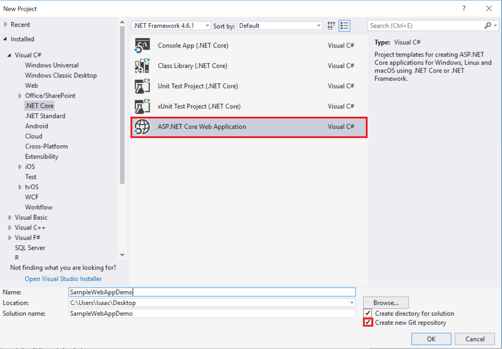

1. In the **New ASP.NET Core Project** dialog, select the ASP.NET Core **Empty** template, then click **OK**.

   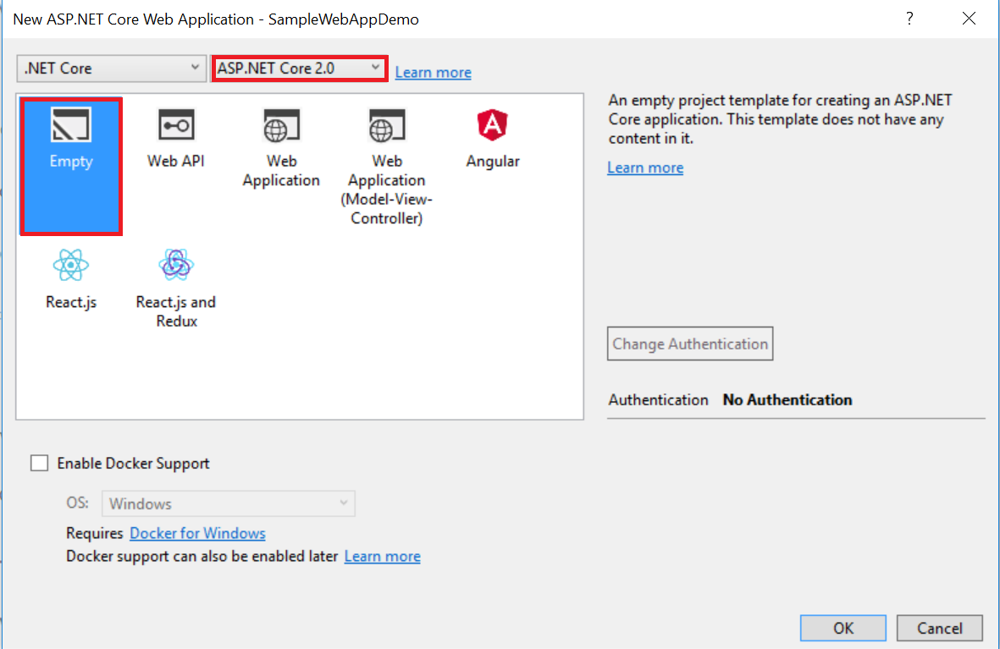

> [!NOTE]
> The most recent release of .NET Core is 2.0.

### Running the web app locally

1. Once Visual Studio finishes creating the app, run the app by selecting **Debug** > **Start Debugging**. As an alternative, press **F5**.

   It may take time to initialize Visual Studio and the new app. Once it's complete, the browser shows the running app.

   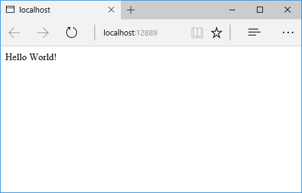

1. After reviewing the running Web app, close the browser and select the "Stop Debugging" icon in the toolbar of Visual Studio to stop the app.

## Create a web app in the Azure Portal

The following steps create a web app in the Azure Portal:

1. Log in to the [Azure Portal](https://portal.azure.com).

1. Select **NEW** at the top left of the portal interface.

1. Select **Web + Mobile** > **Web App**.

   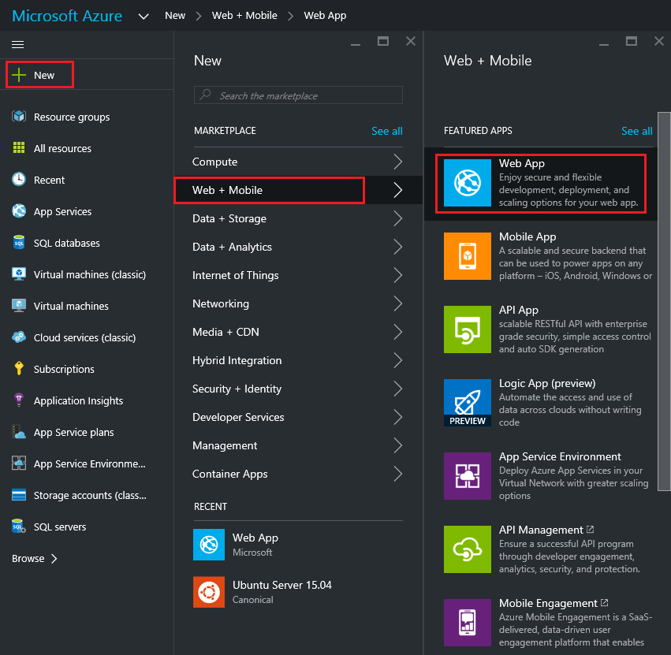

1. In the **Web App** blade, enter a unique value for the **App Service Name**.

   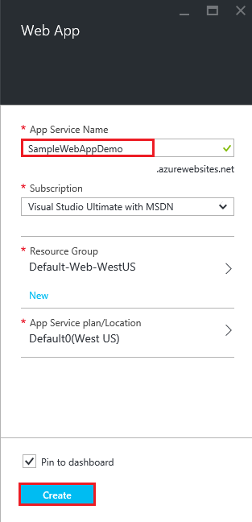

   > [!NOTE]
   > The **App Service Name** name must be unique. The portal enforces this rule when the name is provided. If providing a different value, substitute that value for each occurrence of **SampleWebAppDemo** in this tutorial.

   Also in the **Web App** blade, select an existing **App Service Plan/Location** or create a new one. If creating a new plan, select the pricing tier, location, and other options. For more information on App Service plans, see [Azure App Service plans in-depth overview](/azure/app-service/azure-web-sites-web-hosting-plans-in-depth-overview).

1. Select **Create**. Azure will provision and start the web app.

   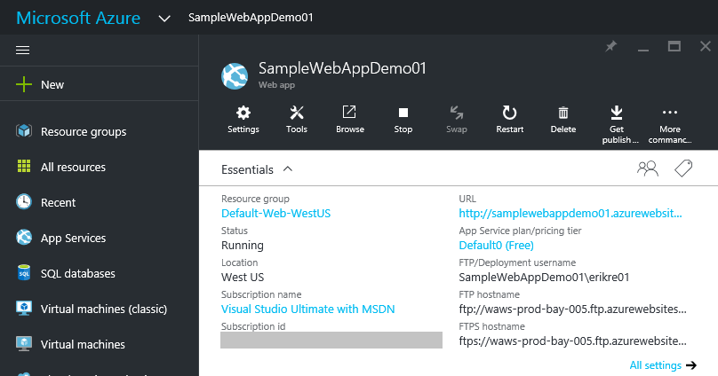

## Enable Git publishing for the new web app

Git is a distributed version control system that can be used to deploy an Azure App Service web app. Web app code is stored in a local Git repository, and the code is deployed to Azure by pushing to a remote repository.

1. Log into the [Azure Portal](https://portal.azure.com).

1. Select **App Services** to view a list of the app services associated with the Azure subscription.

1. Select the web app created in the previous section of this tutorial.

1. In the **Deployment** blade, select **Deployment options** > **Choose Source** > **Local Git Repository**.

   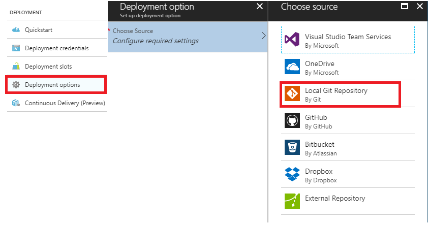

1. Select **OK**.

1. If deployment credentials for publishing a web app or other App Service app haven't previously been set up, set them up now:

   * Select **Settings** > **Deployment credentials**. The **Set deployment credentials** blade is displayed.
   * Create a user name and password. Save the password for later use when setting up Git.
   * Select **Save**.

1. In the **Web App** blade, select **Settings** > **Properties**. The URL of the remote Git repository to deploy to is shown under **GIT URL**.

1. Copy the **GIT URL** value for later use in the tutorial.

   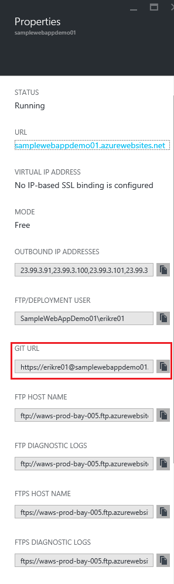

## Publish the web app to Azure App Service

In this section, create a local Git repository using Visual Studio and push from that repository to Azure to deploy the web app. The steps involved include the following:

* Add the remote repository setting using the GIT URL value, so the local repository can be deployed to Azure.
* Commit project changes.
* Push project changes from the local repository to the remote repository on Azure.

1. In **Solution Explorer** right-click **Solution 'SampleWebAppDemo'** and select **Commit**. The **Team Explorer** is displayed.

   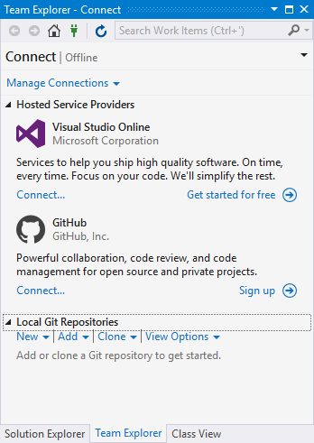

1. In **Team Explorer**, select the **Home** (home icon) > **Settings** > **Repository Settings**.

1. In the **Remotes** section of the **Repository Settings**, select **Add**. The **Add Remote** dialog box is displayed.

1. Set the **Name** of the remote to **Azure-SampleApp**.

1. Set the value for **Fetch** to the **Git URL** that copied from Azure earlier in this tutorial. Note that this is the URL that ends with **.git**.

   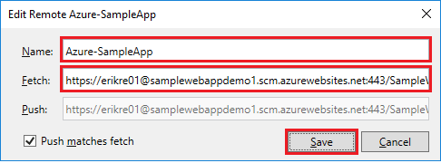

   > [!NOTE]
   > As an alternative, specify the remote repository from the **Command Window** by opening the **Command Window**, changing to the project directory, and entering the command. Example:
   >
   > `git remote add Azure-SampleApp https://me@sampleapp.scm.azurewebsites.net:443/SampleApp.git`

1. Select the **Home** (home icon) > **Settings** > **Global Settings**. Confirm that the name and email address are set. Select **Update** if required.

1. Select **Home** > **Changes** to return to the **Changes** view.

1. Enter a commit message, such as **Initial Push #1** and select **Commit**. This action creates a *commit* locally.

   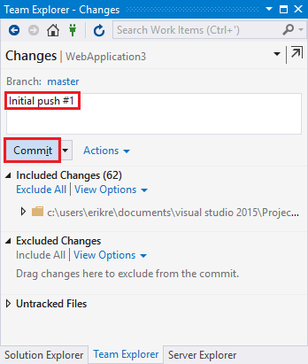

   > [!NOTE]
   > As an alternative, commit changes from the **Command Window** by opening the **Command Window**, changing to the project directory, and entering the git commands. Example:
   >
   > `git add .`
   >
   > `git commit -am "Initial Push #1"`

1. Select **Home** > **Sync** > **Actions** > **Open Command Prompt**. The command prompt opens to the project directory.

1. Enter the following command in the command window:

   `git push -u Azure-SampleApp master`

1. Enter the Azure **deployment credentials** password created earlier in Azure.

   This command starts the process of pushing the local project files to Azure. The output from the above command ends with a message that the deployment was successful.

   ```
   remote: Finished successfully.
   remote: Running post deployment command(s)...
   remote: Deployment successful.
   To https://username@samplewebappdemo01.scm.azurewebsites.net:443/SampleWebAppDemo01.git
   * [new branch]      master -> master
   Branch master set up to track remote branch master from Azure-SampleApp.
   ```

   > [!NOTE]
   > If collaboration on the project is required, consider pushing to [GitHub](https://github.com) before pushing to Azure.
 
### Verify the Active Deployment

Verify that the web app transfer from the local environment to Azure is successful.

In the [Azure Portal](https://portal.azure.com), select the web app. Select **Deployment** > **Deployment options**.

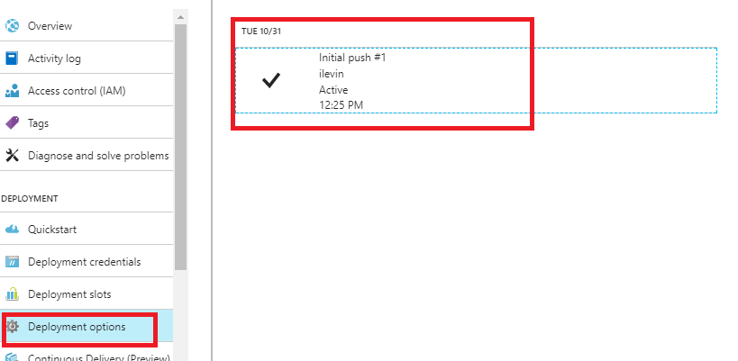

## Run the app in Azure

Now that the web app is deployed to Azure, run the app.

This can be accomplished in two ways:

* In the Azure Portal, locate the web app blade for the web app. Select **Browse** to view the app in the default browser.
* Open a browser and enter the URL for the web app. Example: `http://SampleWebAppDemo.azurewebsites.net`

## Update the web app and republish

After making changes to the local code, republish:

1. In **Solution Explorer** of Visual Studio, open the *Startup.cs* file.

1. In the `Configure` method, modify the `Response.WriteAsync` method so that it appears as follows:

   ```csharp
   await context.Response.WriteAsync("Hello World! Deploy to Azure.");
   ```

1. Save the changes to *Startup.cs*.

1. In **Solution Explorer**, right-click **Solution 'SampleWebAppDemo'** and select **Commit**. The **Team Explorer** is displayed.

1. Enter a commit message, such as `Update #2`.

1. Press the **Commit** button to commit the project changes.

1. Select **Home** > **Sync** > **Actions** > **Push**.

> [!NOTE]
> As an alternative, push the changes from the **Command Window** by opening the **Command Window**, changing to the project directory, and entering a git command. Example:
> 
> `git push -u Azure-SampleApp master`

## View the updated web app in Azure

View the updated web app by selecting **Browse** from the web app blade in the Azure Portal or by opening a browser and entering the URL for the web app. Example: `http://SampleWebAppDemo.azurewebsites.net`

## Additional resources

* [Create your first pipeline with Azure Pipelines](/azure/devops/pipelines/get-started-yaml)
* [Project Kudu](https://github.com/projectkudu/kudu/wiki)
* <xref:host-and-deploy/visual-studio-publish-profiles>
