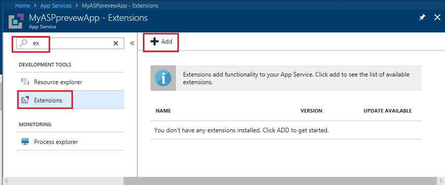
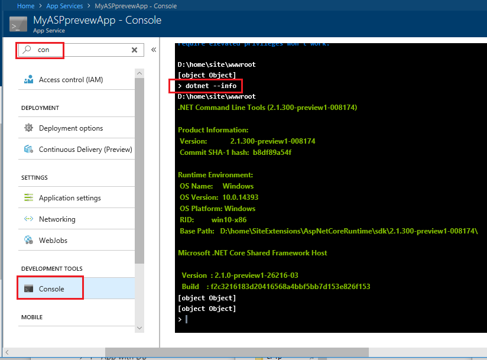

# Host ASP.NET Core on Azure App Service

[Azure App Service](https://azure.microsoft.com/services/app-service/) is a [Microsoft cloud computing platform service](https://azure.microsoft.com/) for hosting web apps, including ASP.NET Core.

## Useful resources

The Azure [Web Apps Documentation](/azure/app-service/) is the home for Azure Apps documentation, tutorials, samples, how-to guides, and other resources. Two notable tutorials that pertain to hosting ASP.NET Core apps are:

[Quickstart: Create an ASP.NET Core web app in Azure](/azure/app-service/app-service-web-get-started-dotnet)  
Use Visual Studio to create and deploy an ASP.NET Core web app to Azure App Service on Windows.

[Quickstart: Create a .NET Core web app in App Service on Linux](/azure/app-service/containers/quickstart-dotnetcore)  
Use the command line to create and deploy an ASP.NET Core web app to Azure App Service on Linux.

The following articles are available in ASP.NET Core documentation:

[Publish to Azure with Visual Studio](xref:tutorials/publish-to-azure-webapp-using-vs)  
Learn how to publish an ASP.NET Core app to Azure App Service using Visual Studio.

[Publish to Azure with CLI tools](xref:tutorials/publish-to-azure-webapp-using-cli)  
Learn how to publish an ASP.NET Core app to Azure App Service using the Git command-line client.

[Continuous deployment to Azure with Visual Studio and Git](xref:host-and-deploy/azure-apps/azure-continuous-deployment)  
Learn how to create an ASP.NET Core web app using Visual Studio and deploy it to Azure App Service using Git for continuous deployment.

[Continuous deployment to Azure with VSTS](https://www.visualstudio.com/docs/build/aspnet/core/quick-to-azure)  
Set up a CI build for an ASP.NET Core app, then create a continuous deployment release to Azure App Service.

[Azure Web App sandbox](https://github.com/projectkudu/kudu/wiki/Azure-Web-App-sandbox)  
Discover Azure App Service runtime execution limitations enforced by the Azure Apps platform.

::: moniker range=">= aspnetcore-2.0"

## Application configuration

In ASP.NET Core 2.0 or later, the following NuGet packages provide automatic logging features for apps deployed to Azure App Service:

* [Microsoft.AspNetCore.AzureAppServices.HostingStartup](https://www.nuget.org/packages/Microsoft.AspNetCore.AzureAppServices.HostingStartup/) uses [IHostingStartup](xref:fundamentals/configuration/platform-specific-configuration) to provide ASP.NET Core light-up integration with Azure App Service. The added logging features are provided by the `Microsoft.AspNetCore.AzureAppServicesIntegration` package.
* [Microsoft.AspNetCore.AzureAppServicesIntegration](https://www.nuget.org/packages/Microsoft.AspNetCore.AzureAppServicesIntegration/) executes [AddAzureWebAppDiagnostics](/dotnet/api/microsoft.extensions.logging.azureappservicesloggerfactoryextensions.addazurewebappdiagnostics) to add Azure App Service diagnostics logging providers in the `Microsoft.Extensions.Logging.AzureAppServices` package.
* [Microsoft.Extensions.Logging.AzureAppServices](https://www.nuget.org/packages/Microsoft.Extensions.Logging.AzureAppServices/) provides logger implementations to support Azure App Service diagnostics logs and log streaming features.

If targeting .NET Core and referencing the [Microsoft.AspNetCore.All metapackage](xref:fundamentals/metapackage), the packages are already included. The packages are absent from the newer [Microsoft.AspNetCore.App metapackage](xref:fundamentals/metapackage-app). If targeting .NET Framework or referencing the `Microsoft.AspNetCore.App` metapackage, reference the individual logging packages.

::: moniker-end

## Proxy server and load balancer scenarios

The IIS Integration Middleware, which configures Forwarded Headers Middleware, and the ASP.NET Core Module are configured to forward the scheme (HTTP/HTTPS) and the remote IP address where the request originated. Additional configuration might be required for apps hosted behind additional proxy servers and load balancers. For more information, see [Configure ASP.NET Core to work with proxy servers and load balancers](xref:host-and-deploy/proxy-load-balancer).

## Monitoring and logging

For monitoring, logging, and troubleshooting information, see the following articles:

[How to: Monitor Apps in Azure App Service](/azure/app-service/web-sites-monitor)  
Learn how to review quotas and metrics for apps and App Service plans.

[Enable diagnostics logging for web apps in Azure App Service](/azure/app-service/web-sites-enable-diagnostic-log)  
Discover how to enable and access diagnostic logging for HTTP status codes, failed requests, and web server activity.

[Introduction to Error Handling in ASP.NET Core](xref:fundamentals/error-handling)  
Understand common approaches to handling errors in ASP.NET Core apps.

[Troubleshoot ASP.NET Core on Azure App Service](xref:host-and-deploy/azure-apps/troubleshoot)  
Learn how to diagnose issues with Azure App Service deployments with ASP.NET Core apps.

[Common errors reference for Azure App Service and IIS with ASP.NET Core](xref:host-and-deploy/azure-iis-errors-reference)  
See the common deployment configuration errors for apps hosted by Azure App Service/IIS with troubleshooting advice.

## Data Protection key ring and deployment slots

[Data Protection keys](xref:security/data-protection/implementation/key-management#data-protection-implementation-key-management) are persisted to the *%HOME%\ASP.NET\DataProtection-Keys* folder. This folder is backed by network storage and is synchronized across all machines hosting the app. Keys aren't protected at rest. This folder supplies the key ring to all instances of an app in a single deployment slot. Separate deployment slots, such as Staging and Production, don't share a key ring.

When swapping between deployment slots, any system using data protection won't be able to decrypt stored data using the key ring inside the previous slot. ASP.NET Cookie Middleware uses data protection to protect its cookies. This leads to users being signed out of an app that uses the standard ASP.NET Cookie Middleware. For a slot-independent key ring solution, use an external key ring provider, such as:

* Azure Blob Storage
* Azure Key Vault
* SQL store
* Redis cache

For more information, see [Key storage providers](xref:security/data-protection/implementation/key-storage-providers).

## Deploy ASP.NET Core preview release to Azure App Service

ASP.NET Core preview apps can be deployed to Azure App Service with the following approaches:

* [Install the preview site extension](#install-the-preview-site-extension)
<!-- * [Deploy the app self-contained](#deploy-the-app-self-contained) -->
* [Use Docker with Web Apps for containers](#use-docker-with-web-apps-for-containers)

If a problem occurs using the preview site extension, open an issue on [GitHub](https://github.com/aspnet/azureintegration/issues/new).

### Install the preview site extension

1. From the Azure portal, navigate to the App Service blade.
1. Select the web app.
1. Enter "ex" in the search box or scroll down the list of management panes to **DEVELOPMENT TOOLS**.
1. Select **DEVELOPMENT TOOLS** > **Extensions**.
1. Select **Add**.

   

1. Select **ASP.NET Core Extensions**.
1. Select **OK** to accept the legal terms.
1. Select **OK** to install the extension.

When the add operations complete, the latest .NET Core preview is installed. Verify the installation by running `dotnet --info` in the console. From the **App Service** blade:

1. Enter "con" in the search box or scroll down the list of management panes to **DEVELOPMENT TOOLS**.
1. Select **DEVELOPMENT TOOLS** > **Console**.
1. Enter `dotnet --info` in the console.

If version `2.1.300-preview1-008174` is the latest preview release, the following output is obtained by running `dotnet --info` at the command prompt:

The version of ASP.NET Core shown in the preceding image, `2.1.300-preview1-008174`, is an example. The latest preview version of ASP.NET Core at the time the site extension is configured appears when you execute `dotnet --info`.

The `dotnet --info` displays the the path to the site extension where the Preview has been installed. It shows the app is running from the site extension instead of from the default *ProgramFiles* location. If you see *ProgramFiles*, restart the site and run `dotnet --info`.

**Use the preview site extension with an ARM template**

If an ARM template is used to create and deploy apps, the `siteextensions` resource type can be used to add the site extension to a web app. For example:

[!code-json[Main](index/sample/arm.json?highlight=2)]

<!--
### Deploy the app self-contained

A [self-contained app](/dotnet/core/deploying/#self-contained-deployments-scd) can be deployed that carries the preview runtime in the deployment. When deploying a self-contained app:

* The site doesn't need to be prepared.
* The app must be published differently than when publishing for a framework-dependent deployment with the shared runtime and host on the server.

Self-contained apps are an option for all ASP.NET Core apps.
-->

### Use Docker with Web Apps for containers

The [Docker Hub](https://hub.docker.com/r/microsoft/aspnetcore/) contains the latest preview Docker images. The images can be used as a base image. Use the image and deploy to Web Apps for Containers normally.

## Additional resources

* [Web Apps overview (5-minute overview video)](/azure/app-service/app-service-web-overview)
* [Azure App Service: The Best Place to Host your .NET Apps (55-minute overview video)](https://channel9.msdn.com/events/dotnetConf/2017/T222)
* [Azure Friday: Azure App Service Diagnostic and Troubleshooting Experience (12-minute video)](https://channel9.msdn.com/Shows/Azure-Friday/Azure-App-Service-Diagnostic-and-Troubleshooting-Experience)
* [Azure App Service diagnostics overview](/azure/app-service/app-service-diagnostics)
* <xref:host-and-deploy/web-farm>

Azure App Service on Windows Server uses [Internet Information Services (IIS)](https://www.iis.net/). The following topics pertain to the underlying IIS technology:

* <xref:host-and-deploy/iis/index>
* <xref:fundamentals/servers/aspnet-core-module>
* <xref:host-and-deploy/aspnet-core-module>
* <xref:host-and-deploy/iis/modules>
* [Microsoft TechNet Library: Windows Server](/windows-server/windows-server-versions)
