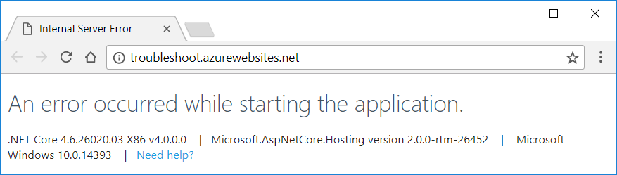
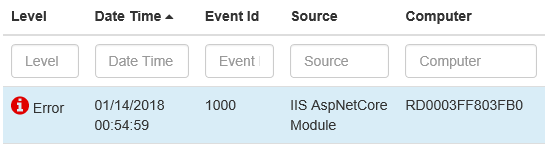
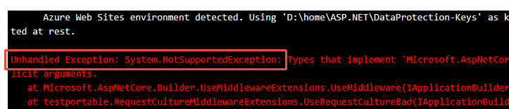
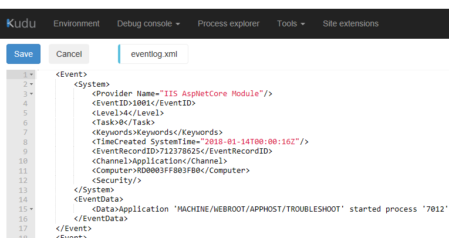
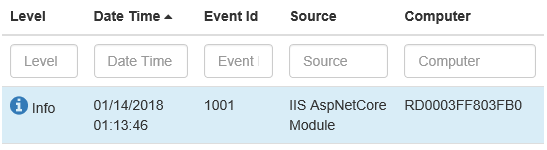
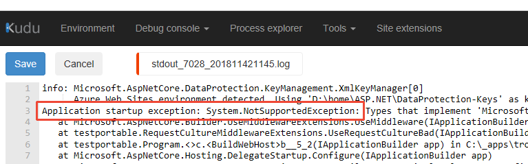
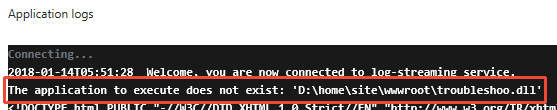
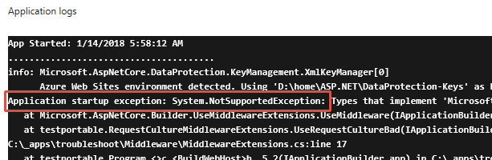

# Troubleshoot ASP.NET Core on Azure App Service

By [Luke Latham](https://github.com/guardrex)

This article provides instructions on how to diagnose an ASP.NET Core app startup issue using Azure App Service's diagnostic tools. For additional troubleshooting advice, see [Azure App Service diagnostics overview](/azure/app-service/app-service-diagnostics) and [How to: Monitor Apps in Azure App Service](/azure/app-service/web-sites-monitor) in the Azure documentation.

## App startup errors

Typical app startup errors include:

**500 Internal Server Error**  
An error prevents the server from fulfilling the request. Usually, the error is thrown from app code.

**502 Bad Gateway**  
[Internet Information Services (IIS)](https://www.iis.net/)/[ASP.NET Core Module](xref:fundamentals/servers/aspnet-core-module) receives an invalid response from the app.

**502.5 Process Failure**  
The worker process fails. The app doesn't start.

**503 Service Unavailable**  
The app doesn't respond to requests proxied by the IIS/ASP.NET Core Module.

For example, the dreaded *502.5 Process Failure* error page is returned when a misconfigured app causes the worker process to fail:


When a 500-series error occurs after the app starts but before a response is returned, it's usually caused by an error within the app. These errors often appear as a *500 Internal Server Error* or a *503 Service Unavailable* response. When the app is in its Production environment, the browser displays a friendly error page:



## Troubleshoot app startup errors

Use the **Diagnose and solve problems** blade in the Azure portal to access the Application Event Log:

1. In the Azure portal, open the app's blade in the **App Services** blade.
1. Select the **Diagnose and solve problems** blade.
1. Under **SELECT PROBLEM CATEGORY**, select the **Web App Down** button.
1. Under **Suggested Solutions**, open the pane for **Open Application Event Logs**. Select the **Open Application Event Logs** button.
1. Examine the latest error provided by the *IIS AspNetCoreModule* in the **Source** column.

For example, the log displays an error:



The error message states:

> Application 'MACHINE/WEBROOT/APPHOST/TROUBLESHOOT' with physical root 'D:\home\site\wwwroot\' failed to start process with commandline 'dotnet .\troubleshoo.dll', ErrorCode = '0x80004005 : 80008081.

The app failed to start the process with the command `dotnet .\troubleshoo.dll`. The assembly name is incorrect and should be *troubleshoot.dll*.

The most common errors that occur when starting an ASP.NET Core app are described in the [Common errors reference](xref:host-and-deploy/azure-iis-errors-reference). Compare the error message information from the app event log to the common errors listed in the topic and follow the troubleshooting advice provided. If several of the errors in the topic match based on the Application Event log alone, continue troubleshooting with this topic to enable ASP.NET Core Module stdout logging. Using the stdout log usually provides additional information that can be helpful when diagnosing startup errors. Enabling stdout logging is described later in the topic.

An alternative to using the **Diagnose and solve problems** blade is to run the app in the [Kudu](https://github.com/projectkudu/kudu/wiki) Remote Execution Console to discover the error:

1. Select the **Advanced Tools** blade in the **DEVELOPMENT TOOLS** area. Select the **Go&rarr;** button. The Kudu console opens in a new browser tab or window.
1. Using the navigation bar at the top of the page, open **Debug console** and select **CMD**.
1. Open the folders to the path **site** > **wwwroot**.
1. In the console, run the app by executing the app's assembly with *dotnet.exe*. In the command below, substitute the name of the app's assembly for `<assembly_name>`:
   ```console
   dotnet .\<assembly_name>.dll
   ```
1. The console output from the app, showing any errors, is piped to the Kudu console. Example: If the assembly name is `troubleshoot`, the app is run with the command `dotnet .\troubleshoot.dll`. The output shows a `NotSupportedException` on startup:
   

Another alternative is to examine the Application Event Log file directly using Kudu:

1. Select the **Advanced Tools** blade in the **DEVELOPMENT TOOLS** area. Select the **Go&rarr;** button. The Kudu console opens in a new browser tab or window.
1. Using the navigation bar at the top of the page, open **Debug console** and select **CMD**.
1. Open the **LogFiles** folder.
1. Select the pencil icon next to the *eventlog.xml* file.
1. Examine the log. Scroll to the bottom of the log to see the most recent events.
   

Internal Server Errors often don't produce useful information in the Application Event Log. As far as the proxy server is concerned, the app started normally:



The informational message associated with this event states:

> Application 'MACHINE/WEBROOT/APPHOST/TROUBLESHOOT' started process '7012' successfully and is listening on port '9489'.

However, the app is clearly in an unhealthy state if it doesn't respond normally to requests.

ASP.NET Core Module *stdout logging* is helpful in diagnosing startup failures when an error occurs after the host is built. To diagnose these types of errors, perform the following steps:

1. Navigate to the **Diagnose and solve problems** blade in the Azure portal.
1. Under **SELECT PROBLEM CATEGORY**, select the **Web App Down** button.
1. Under **Suggested Solutions** > **Enable Stdout Log Redirection**, select the button to **Open Kudu Console to edit Web.Config**.
1. In the Kudu **Diagnostic Console** (opens in a new browser tab or window), open the folders to the path **site** > **wwwroot** and scroll down to reveal the *web.config* file at the bottom of the list.
1. Click the pencil icon next to the *web.config* file.
1. Set **stdoutLogEnabled** to `true` and change the **stdoutLogFile** path to: `\\?\%home%\LogFiles\stdout`.
1. Select **Save** to save the updated *web.config* file.
1. Make a request to the app.
1. Return to the Azure portal. Select the **Advanced Tools** blade in the **DEVELOPMENT TOOLS** area. Select the **Go&rarr;** button. The Kudu console opens in a new browser tab or window.
1. Using the navigation bar at the top of the page, open **Debug console** and select **CMD**.
1. Select the **LogFiles** folder.
1. Inspect the **Modified** column and select the pencil icon to edit the stdout log with the latest modification date.
1. When the log file opens, the error is displayed. For example:
   
1. In the Kudu **Diagnostic Console**, return to the path **site** > **wwwroot** to reveal the *web.config* file. Open the **web.config** file again by selecting the pencil icon.
1. Set **stdoutLogEnabled** to `false`.
1. Select **Save** to save the file.

> [!WARNING]
> Failure to disable the stdout log can lead to app failure. The log files have no limit on size. The number of log files created is unlimited. If stdout logging remains enabled, the disk storage space dedicated to the app might become exhausted causing the app instance to fail.
>
> For routine logging in an ASP.NET Core app, use a logging library that limits log file size and rotates logs. For more information, see [third-party logging providers](xref:fundamentals/logging/index#third-party-logging-providers).

## Process dump for a slow or hanging app

When an app responds slowly or hangs on a request, see [Troubleshoot slow web app performance issues in Azure App Service](/azure/app-service/app-service-web-troubleshoot-performance-degradation) for debugging guidance.

## Remote debugging

To use the remote debugging features of [Visual Studio](https://www.visualstudio.com/vs/), see the [Remote debugging web apps section of Troubleshoot a web app in Azure App Service using Visual Studio](/azure/app-service/web-sites-dotnet-troubleshoot-visual-studio#remotedebug) in the Azure documentation.

## Monitoring blades

Monitoring blades provide an alternative experience to using the **Diagnose and solve problems** blade and accessing the stdout log files directly. These blades can be used to diagnose 500-series errors.

Confirm that the ASP.NET Core Extensions are installed. If the extensions aren't installed, install them manually:

1. In the **DEVELOPMENT TOOLS** blade section, select the **Extensions** blade.
1. The **ASP.NET Core Extensions** should appear in the list.
1. If the extensions aren't installed, select the **Add** button.
1. Choose the **ASP.NET Core Extensions** from the list.
1. Select **OK** to accept the legal terms.
1. Select **OK** on the **Add extension** blade.
1. An informational pop-up message indicates when the extensions are successfully installed.

If stdout logging isn't already enabled, follow these steps:

1. In the Azure portal, select the **Advanced Tools** blade in the **DEVELOPMENT TOOLS** area. Select the **Go&rarr;** button. The Kudu console opens in a new browser tab or window.
1. Using the navigation bar at the top of the page, open **Debug console** and select **CMD**.
1. Open the folders to the path **site** > **wwwroot** and scroll down to reveal the *web.config* file at the bottom of the list.
1. Click the pencil icon next to the *web.config* file.
1. Set **stdoutLogEnabled** to `true` and change the **stdoutLogFile** path to: `\\?\%home%\LogFiles\stdout`.
1. Select **Save** to save the updated *web.config* file.

Proceed to activate diagnostic logging:

1. In the Azure portal, select the **Diagnostics logs** blade.
1. Select the **On** switch for **Application Logging (Filesystem)** and **Detailed error messages**. Select the **Save** button at the top of the blade.
1. To include failed request tracing, also known as Failed Request Event Buffering (FREB) logging, select the **On** switch for **Failed request tracing**. 
1. Select the **Log stream** blade, which is listed immediately under the **Diagnostics logs** blade in the portal.
1. Make a request to the app.
1. Within the log stream data the cause of the error is indicated.
1. In the Kudu **Diagnostic Console**, return to the path **site** > **wwwroot** to reveal the *web.config* file. Open the **web.config** file again by selecting the pencil icon.
1. Set **stdoutLogEnabled** to `false`.
1. Select **Save** to save the file.

For example, the following log stream message indicates that the app's assembly name (*troubleshoo.dll*) is incorrect. The assembly name should be *troubleshoot.dll*:



The log stream also indicates the source of 500-series errors on startup that aren't due to a process failure. For example, the following log stream message indicates that the app has attempted to invoke a method that isn't supported:

  

To view the failed request tracing logs (FREB logs):

1. Navigate to the **Diagnose and solve problems** blade in the Azure portal.
1. Select **Failed Request Tracing Logs** from the **SUPPORT TOOLS** area of the sidebar.

For more information on failed request tracing, see the [Failed request traces section of the Enable diagnostics logging for web apps in Azure App Service topic](/azure/app-service/web-sites-enable-diagnostic-log#failed-request-traces) and the [Application performance FAQs for Web Apps in Azure: How do I turn on failed request tracing?](/azure/app-service/app-service-web-availability-performance-application-issues-faq#how-do-i-turn-on-failed-request-tracing) in the Azure documentation.

> [!WARNING]
> Failure to disable the stdout log can lead to app failure. The log files have no limit on size. The number of log files created is unlimited. If stdout logging remains enabled, the disk storage space dedicated to the app might become exhausted causing the app instance to fail.
>
> For routine logging in an ASP.NET Core app, use a logging library that limits log file size and rotates logs. For more information, see [third-party logging providers](xref:fundamentals/logging/index#third-party-logging-providers).

For more information, see [Enable diagnostics logging for web apps in Azure App Service](/azure/app-service/web-sites-enable-diagnostic-log) in the Azure documentation.

## Additional resources

For additional monitoring, logging, and troubleshooting information, see the following articles:

* [Introduction to Error Handling in ASP.NET Core](xref:fundamentals/error-handling)
* [Common errors reference for Azure App Service and IIS with ASP.NET Core](xref:host-and-deploy/azure-iis-errors-reference)
* [Troubleshoot a web app in Azure App Service using Visual Studio](/azure/app-service/web-sites-dotnet-troubleshoot-visual-studio)
* [Troubleshoot HTTP errors of "502 bad gateway" and "503 service unavailable" in your Azure web apps](/app-service/app-service-web-troubleshoot-http-502-http-503)
* [Troubleshoot slow web app performance issues in Azure App Service](/azure/app-service/app-service-web-troubleshoot-performance-degradation)
* [Application performance FAQs for Web Apps in Azure](/azure/app-service/app-service-web-availability-performance-application-issues-faq)
* [Azure Friday: Azure App Service Diagnostic and Troubleshooting Experience (12-minute video)](https://channel9.msdn.com/Shows/Azure-Friday/Azure-App-Service-Diagnostic-and-Troubleshooting-Experience)
