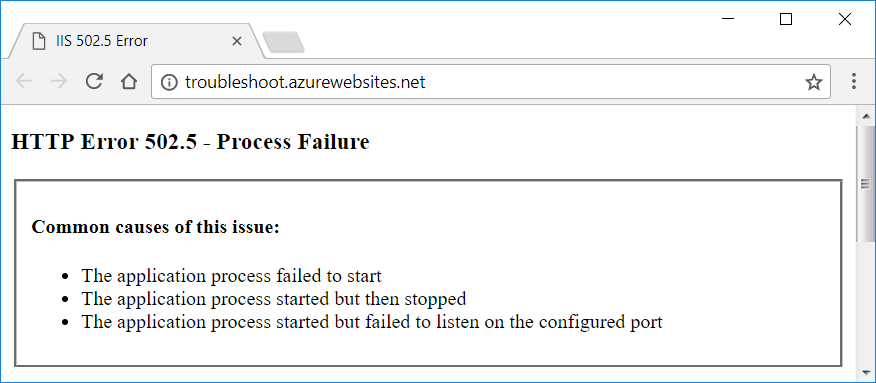

# Troubleshoot ASP.NET Core on Azure App Service

By [Luke Latham](https://github.com/guardrex)

[!INCLUDE [Azure App Service Preview Notice](../../includes/azure-apps-preview-notice.md)]

This article provides instructions on how to diagnose an ASP.NET Core app startup issue using Azure App Service's diagnostic tools. For additional troubleshooting advice, see [Azure App Service diagnostics overview](/azure/app-service/app-service-diagnostics) and [How to: Monitor Apps in Azure App Service](/azure/app-service/web-sites-monitor) in the Azure documentation.

## App startup errors

**502.5 Process Failure**  
The worker process fails. The app doesn't start.

The [ASP.NET Core Module](xref:host-and-deploy/aspnet-core-module) attempts to start the worker process but it fails to start. Examining the Application Event Log often helps troubleshoot this type of problem. Accessing the log is explained in the [Application Event Log](#application-event-log) section.

The *502.5 Process Failure* error page is returned when a misconfigured app causes the worker process to fail:

**500 Internal Server Error**  
The app starts, but an error prevents the server from fulfilling the request.

This error occurs within the app's code during startup or while creating a response. The response may contain no content, or the response may appear as a *500 Internal Server Error* in the browser. The Application Event Log usually states that the app started normally. From the server's perspective, that's correct. The app did start, but it can't generate a valid response. [Run the app in the Kudu console](#run-the-app-in-the-kudu-console) or [enable the ASP.NET Core Module stdout log](#aspnet-core-module-stdout-log) to troubleshoot the problem.

**Connection reset**

If an error occurs after the headers are sent, it's too late for the server to send a **500 Internal Server Error** when an error occurs. This often happens when an error occurs during the serialization of complex objects for a response. This type of error appears as a *connection reset* error on the client. [Application logging](xref:fundamentals/logging/index) can help troubleshoot these types of errors.

## Default startup limits

The ASP.NET Core Module is configured with a default *startupTimeLimit* of 120 seconds. When left at the default value, an app may take up to two minutes to start before the module logs a process failure. For information on configuring the module, see [Attributes of the aspNetCore element](xref:host-and-deploy/aspnet-core-module#attributes-of-the-aspnetcore-element).

## Troubleshoot app startup errors

### Application Event Log

To access the Application Event Log, use the **Diagnose and solve problems** blade in the Azure portal :

1. In the Azure portal, open the app's blade in the **App Services** blade.
1. Select the **Diagnose and solve problems** blade.
1. Under **SELECT PROBLEM CATEGORY**, select the **Web App Down** button.
1. Under **Suggested Solutions**, open the pane for **Open Application Event Logs**. Select the **Open Application Event Logs** button.
1. Examine the latest error provided by the *IIS AspNetCoreModule* in the **Source** column.

An alternative to using the **Diagnose and solve problems** blade is to examine the Application Event Log file directly using [Kudu](https://github.com/projectkudu/kudu/wiki):

1. Select the **Advanced Tools** blade in the **DEVELOPMENT TOOLS** area. Select the **Go&rarr;** button. The Kudu console opens in a new browser tab or window.
1. Using the navigation bar at the top of the page, open **Debug console** and select **CMD**.
1. Open the **LogFiles** folder.
1. Select the pencil icon next to the *eventlog.xml* file.
1. Examine the log. Scroll to the bottom of the log to see the most recent events.

### Run the app in the Kudu console

Many startup errors don't produce useful information in the Application Event Log. You can run the app in the [Kudu](https://github.com/projectkudu/kudu/wiki) Remote Execution Console to discover the error:

1. Select the **Advanced Tools** blade in the **DEVELOPMENT TOOLS** area. Select the **Go&rarr;** button. The Kudu console opens in a new browser tab or window.
1. Using the navigation bar at the top of the page, open **Debug console** and select **CMD**.
1. Open the folders to the path **site** > **wwwroot**.
1. In the console, run the app by executing the app's assembly.
   * If the app is a [framework-dependent deployment](/dotnet/core/deploying/#framework-dependent-deployments-fdd), run the app's assembly with *dotnet.exe*. In the following command, substitute the name of the app's assembly for `<assembly_name>`: `dotnet .\<assembly_name>.dll`
   * If the app is a [self-contained deployment](/dotnet/core/deploying/#self-contained-deployments-scd), run the app's executable. In the following command, substitute the name of the app's assembly for `<assembly_name>`: `<assembly_name>.exe`
1. The console output from the app, showing any errors, is piped to the Kudu console.

### ASP.NET Core Module stdout log

The ASP.NET Core Module stdout log often records useful error messages not found in the Application Event Log. To enable and view stdout logs:

1. Navigate to the **Diagnose and solve problems** blade in the Azure portal.
1. Under **SELECT PROBLEM CATEGORY**, select the **Web App Down** button.
1. Under **Suggested Solutions** > **Enable Stdout Log Redirection**, select the button to **Open Kudu Console to edit Web.Config**.
1. In the Kudu **Diagnostic Console**, open the folders to the path **site** > **wwwroot**. Scroll down to reveal the *web.config* file at the bottom of the list.
1. Click the pencil icon next to the *web.config* file.
1. Set **stdoutLogEnabled** to `true` and change the **stdoutLogFile** path to: `\\?\%home%\LogFiles\stdout`.
1. Select **Save** to save the updated *web.config* file.
1. Make a request to the app.
1. Return to the Azure portal. Select the **Advanced Tools** blade in the **DEVELOPMENT TOOLS** area. Select the **Go&rarr;** button. The Kudu console opens in a new browser tab or window.
1. Using the navigation bar at the top of the page, open **Debug console** and select **CMD**.
1. Select the **LogFiles** folder.
1. Inspect the **Modified** column and select the pencil icon to edit the stdout log with the latest modification date.
1. When the log file opens, the error is displayed.

**Important!** Disable stdout logging when troubleshooting is complete.

1. In the Kudu **Diagnostic Console**, return to the path **site** > **wwwroot** to reveal the *web.config* file. Open the **web.config** file again by selecting the pencil icon.
1. Set **stdoutLogEnabled** to `false`.
1. Select **Save** to save the file.

> [!WARNING]
> Failure to disable the stdout log can lead to app or server failure. There's no limit on log file size or the number of log files created. Only use stdout logging to troubleshoot app startup problems.
>
> For general logging in an ASP.NET Core app after startup, use a logging library that limits log file size and rotates logs. For more information, see [third-party logging providers](xref:fundamentals/logging/index#third-party-logging-providers).

## Common startup errors 

See <xref:host-and-deploy/azure-iis-errors-reference>. Most of the common problems that prevent app startup are covered in the reference topic.

## Slow or hanging app

When an app responds slowly or hangs on a request, see [Troubleshoot slow web app performance issues in Azure App Service](/azure/app-service/app-service-web-troubleshoot-performance-degradation) for debugging guidance.

## Remote debugging

See the following topics:

* [Remote debugging web apps section of Troubleshoot a web app in Azure App Service using Visual Studio](/azure/app-service/web-sites-dotnet-troubleshoot-visual-studio#remotedebug) (Azure documentation)
* [Remote Debug ASP.NET Core on IIS in Azure in Visual Studio 2017](/visualstudio/debugger/remote-debugging-azure) (Visual Studio documentation)

## Application Insights

[Application Insights](https://azure.microsoft.com/services/application-insights/) provides telemetry from apps hosted in the Azure App Service, including error logging and reporting features. Application Insights can only report on errors that occur after the app starts when the app's logging features become available. For more information, see [Application Insights for ASP.NET Core](/azure/application-insights/app-insights-asp-net-core).

## Monitoring blades

Monitoring blades provide an alternative troubleshooting experience to the methods described earlier in the topic. These blades can be used to diagnose 500-series errors.

Confirm that the ASP.NET Core Extensions are installed. If the extensions aren't installed, install them manually:

1. In the **DEVELOPMENT TOOLS** blade section, select the **Extensions** blade.
1. The **ASP.NET Core Extensions** should appear in the list.
1. If the extensions aren't installed, select the **Add** button.
1. Choose the **ASP.NET Core Extensions** from the list.
1. Select **OK** to accept the legal terms.
1. Select **OK** on the **Add extension** blade.
1. An informational pop-up message indicates when the extensions are successfully installed.

If stdout logging isn't enabled, follow these steps:

1. In the Azure portal, select the **Advanced Tools** blade in the **DEVELOPMENT TOOLS** area. Select the **Go&rarr;** button. The Kudu console opens in a new browser tab or window.
1. Using the navigation bar at the top of the page, open **Debug console** and select **CMD**.
1. Open the folders to the path **site** > **wwwroot** and scroll down to reveal the *web.config* file at the bottom of the list.
1. Click the pencil icon next to the *web.config* file.
1. Set **stdoutLogEnabled** to `true` and change the **stdoutLogFile** path to: `\\?\%home%\LogFiles\stdout`.
1. Select **Save** to save the updated *web.config* file.

Proceed to activate diagnostic logging:

1. In the Azure portal, select the **Diagnostics logs** blade.
1. Select the **On** switch for **Application Logging (Filesystem)** and **Detailed error messages**. Select the **Save** button at the top of the blade.
1. To include failed request tracing, also known as Failed Request Event Buffering (FREB) logging, select the **On** switch for **Failed request tracing**. 
1. Select the **Log stream** blade, which is listed immediately under the **Diagnostics logs** blade in the portal.
1. Make a request to the app.
1. Within the log stream data, the cause of the error is indicated.

**Important!** Be sure to disable stdout logging when troubleshooting is complete. See the instructions in the [ASP.NET Core Module stdout log](#aspnet-core-module-stdout-log) section.

To view the failed request tracing logs (FREB logs):

1. Navigate to the **Diagnose and solve problems** blade in the Azure portal.
1. Select **Failed Request Tracing Logs** from the **SUPPORT TOOLS** area of the sidebar.

See [Failed request traces section of the Enable diagnostics logging for web apps in Azure App Service topic](/azure/app-service/web-sites-enable-diagnostic-log#failed-request-traces) and the [Application performance FAQs for Web Apps in Azure: How do I turn on failed request tracing?](/azure/app-service/app-service-web-availability-performance-application-issues-faq#how-do-i-turn-on-failed-request-tracing) for more information.

For more information, see [Enable diagnostics logging for web apps in Azure App Service](/azure/app-service/web-sites-enable-diagnostic-log).

> [!WARNING]
> Failure to disable the stdout log can lead to app or server failure. There's no limit on log file size or the number of log files created.
>
> For routine logging in an ASP.NET Core app, use a logging library that limits log file size and rotates logs. For more information, see [third-party logging providers](xref:fundamentals/logging/index#third-party-logging-providers).

## Additional resources

* <xref:fundamentals/error-handling>
* <xref:host-and-deploy/azure-iis-errors-reference>
* [Troubleshoot a web app in Azure App Service using Visual Studio](/azure/app-service/web-sites-dotnet-troubleshoot-visual-studio)
* [Troubleshoot HTTP errors of "502 bad gateway" and "503 service unavailable" in your Azure web apps](/azure/app-service/app-service-web-troubleshoot-http-502-http-503)
* [Troubleshoot slow web app performance issues in Azure App Service](/azure/app-service/app-service-web-troubleshoot-performance-degradation)
* [Application performance FAQs for Web Apps in Azure](/azure/app-service/app-service-web-availability-performance-application-issues-faq)
* [Azure Web App sandbox (App Service runtime execution limitations)](https://github.com/projectkudu/kudu/wiki/Azure-Web-App-sandbox)
* [Azure Friday: Azure App Service Diagnostic and Troubleshooting Experience (12-minute video)](https://channel9.msdn.com/Shows/Azure-Friday/Azure-App-Service-Diagnostic-and-Troubleshooting-Experience)
