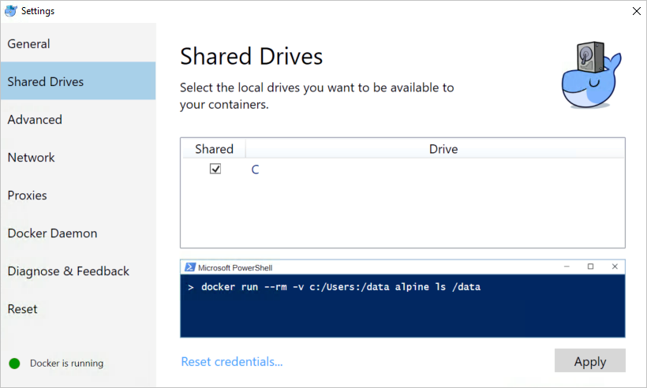
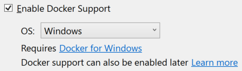

# Visual Studio Container Tools with ASP.NET Core

Visual Studio 2017 and later versions support building, debugging, and running containerized ASP.NET Core apps targeting .NET Core. Both Windows and Linux containers are supported.

[View or download sample code](https://github.com/dotnet/AspNetCore.Docs/tree/main/aspnetcore/host-and-deploy/docker/visual-studio-tools-for-docker/samples) ([how to download](xref:index#how-to-download-a-sample))

## Prerequisites

* [Docker for Windows](https://docs.docker.com/desktop/windows/install/)
* [Visual Studio 2019](https://visualstudio.microsoft.com/downloads/?utm_medium=microsoft&utm_source=docs.microsoft.com&utm_campaign=inline+link&utm_content=download+vs2019) with the **.NET Core cross-platform development** workload

## Installation and setup

For Docker installation, first review the information at [Docker for Windows: What to know before you install](https://docs.docker.com/desktop/windows/install/#what-to-know-before-you-install). Next, install [Docker For Windows](https://docs.docker.com/desktop/windows/install/).

**[Shared Drives](https://docs.docker.com/desktop/windows/#resources)** in Docker for Windows must be configured to support volume mapping and debugging. Right-click the System Tray's Docker icon, select **Settings**, and select **Shared Drives**. Select the drive where Docker stores files. Click **Apply**.



> [!TIP]
> Visual Studio 2017 versions 15.6 and later prompt when **Shared Drives** aren't configured.

## Add a project to a Docker container

To containerize an ASP.NET Core project, the project must target .NET Core. Both Linux and Windows containers are supported.

When adding Docker support to a project, choose either a Windows or a Linux container. The Docker host must be running the same container type. To change the container type in the running Docker instance, right-click the System Tray's Docker icon and choose **Switch to Windows containers...** or **Switch to Linux containers...**.

### New app

When creating a new app with the **ASP.NET Core Web Application** project templates, select the **Enable Docker Support** checkbox:



If the target framework is .NET Core, the **OS** drop-down allows for the selection of a container type.

### Existing app

For ASP.NET Core projects targeting .NET Core, there are two options for adding Docker support via the tooling. Open the project in Visual Studio, and choose one of the following options:

* Select **Docker Support** from the **Project** menu.
* Right-click the project in **Solution Explorer** and select **Add** > **Docker Support**.

The Visual Studio Container Tools don't support adding Docker to an existing ASP.NET Core project targeting .NET Framework.

## Dockerfile overview

A *Dockerfile*, the recipe for creating a final Docker image, is added to the project root. Refer to [Dockerfile reference](https://docs.docker.com/engine/reference/builder/) for an understanding of the commands within it. This particular *Dockerfile* uses a [multi-stage build](https://docs.docker.com/engine/userguide/eng-image/multistage-build/) with four distinct, named build stages:

:::moniker range=">= aspnetcore-2.1"

[!code-dockerfile[](visual-studio-tools-for-docker/samples/2.1/HelloDockerTools/Dockerfile.original?highlight=1,6,14,17)]

The preceding *Dockerfile* is based on the [microsoft/dotnet](https://hub.docker.com/r/microsoft/dotnet/) image. This base image includes the ASP.NET Core runtime and NuGet packages. The packages are just-in-time (JIT) compiled to improve startup performance.

When the new project dialog's **Configure for HTTPS** checkbox is checked, the *Dockerfile* exposes two ports. One port is used for HTTP traffic; the other port is used for HTTPS. If the checkbox isn't checked, a single port (80) is exposed for HTTP traffic.

:::moniker-end

:::moniker range="<= aspnetcore-2.0"

[!code-dockerfile[](visual-studio-tools-for-docker/samples/2.0/HelloDockerTools/Dockerfile?highlight=1,5,13,16)]

The preceding *Dockerfile* is based on the [microsoft/aspnetcore](https://hub.docker.com/r/microsoft/aspnetcore/) image. This base image includes the ASP.NET Core NuGet packages, which are just-in-time (JIT) compiled to improve startup performance.

:::moniker-end

## Add container orchestrator support to an app

Visual Studio 2017 versions 15.7 or earlier support [Docker Compose](https://docs.docker.com/compose/overview/) as the sole container orchestration solution. The Docker Compose artifacts are added via **Add** > **Docker Support**.

Visual Studio 2017 versions 15.8 or later add an orchestration solution only when instructed. Right-click the project in **Solution Explorer** and select **Add** > **Container Orchestrator Support**. The following choices are available: 

* [Docker Compose](#docker-compose)
* [Service Fabric](#service-fabric)
* [Kubernetes/Helm ](https://helm.sh/)

### Docker Compose

The Visual Studio Container Tools add a *docker-compose* project to the solution with the following files:

* *docker-compose.dcproj*: The file representing the project. Includes a `<DockerTargetOS>` element specifying the OS to be used.
* *.dockerignore*: Lists the file and directory patterns to exclude when generating a build context.
* *docker-compose.yml*: The base [Docker Compose](https://docs.docker.com/compose/overview/) file used to define the collection of images built and run with `docker-compose build` and `docker-compose run`, respectively.
* *docker-compose.override.yml*: An optional file, read by Docker Compose, with configuration overrides for services. Visual Studio executes `docker-compose -f "docker-compose.yml" -f "docker-compose.override.yml"` to merge these files.

The *docker-compose.yml* file references the name of the image that's created when the project runs:

[!code-yaml[](visual-studio-tools-for-docker/samples/2.0/docker-compose.yml?highlight=5)]

In the preceding example, `image: hellodockertools` generates the image `hellodockertools:dev` when the app runs in **Debug** mode. The `hellodockertools:latest` image is generated when the app runs in **Release** mode.

Prefix the image name with the [Docker Hub](https://hub.docker.com/) username (for example, `dockerhubusername/hellodockertools`) if the image is pushed to the registry. Alternatively, change the image name to include the private registry URL (for example, `privateregistry.domain.com/hellodockertools`) depending on the configuration.

If you want different behavior based on the build configuration (for example, Debug or Release), add configuration-specific *docker-compose* files. The files should be named according to the build configuration (for example, *docker-compose.vs.debug.yml* and *docker-compose.vs.release.yml*) and placed in the same location as the *docker-compose-override.yml* file. 

Using the configuration-specific override files, you can specify different configuration settings (such as environment variables or entry points) for Debug and Release build configurations.

For Docker Compose to display an option to run in Visual Studio, the docker project must be the startup project.

### Service Fabric

In addition to the base [Prerequisites](#prerequisites), the [Service Fabric](/azure/service-fabric/) orchestration solution demands the following prerequisites:

* [Microsoft Azure Service Fabric SDK](https://www.microsoft.com/web/handlers/webpi.ashx?command=getinstallerredirect&appid=MicrosoftAzure-ServiceFabric-CoreSDK) version 2.6 or later
* Visual Studio's **Azure Development** workload

Service Fabric doesn't support running Linux containers in the local development cluster on Windows. If the project is already using a Linux container, Visual Studio prompts to switch to Windows containers.

The Visual Studio Container Tools do the following tasks:

* Adds a *&lt;project_name&gt;Application* **Service Fabric Application** project to the solution.
* Adds a *Dockerfile* and a *.dockerignore* file to the ASP.NET Core project. If a *Dockerfile* already exists in the ASP.NET Core project, it's renamed to *Dockerfile.original*. A new *Dockerfile*, similar to the following, is created:

    [!code-dockerfile[](visual-studio-tools-for-docker/samples/2.1/HelloDockerTools/Dockerfile)]

* Adds an `<IsServiceFabricServiceProject>` element to the ASP.NET Core project's `.csproj` file:

    [!code-xml[](visual-studio-tools-for-docker/samples/2.1/HelloDockerTools/HelloDockerTools.csproj?name=snippet_IsServiceFabricServiceProject)]

* Adds a *PackageRoot* folder to the ASP.NET Core project. The folder includes the service manifest and settings for the new service.

For more information, see [Deploy a .NET app in a Windows container to Azure Service Fabric](/azure/service-fabric/service-fabric-host-app-in-a-container).

## Debug

Select **Docker** from the debug drop-down in the toolbar, and start debugging the app. The **Docker** view of the **Output** window shows the following actions taking place:

:::moniker range=">= aspnetcore-2.1"

* The *2.1-aspnetcore-runtime* tag of the *microsoft/dotnet* runtime image is acquired (if not already in the cache). The image installs the ASP.NET Core and .NET Core runtimes and associated libraries. It's optimized for running ASP.NET Core apps in production.
* The `ASPNETCORE_ENVIRONMENT` environment variable is set to `Development` within the container.
* Two dynamically assigned ports are exposed: one for HTTP and one for HTTPS. The port assigned to localhost can be queried with the `docker ps` command.
* The app is copied to the container.
* The default browser is launched with the debugger attached to the container using the dynamically assigned port.

The resulting Docker image of the app is tagged as *dev*. The image is based on the *2.1-aspnetcore-runtime* tag of the *microsoft/dotnet* base image. Run the `docker images` command in the **Package Manager Console** (PMC) window. The images on the machine are displayed:

```console
REPOSITORY        TAG                     IMAGE ID      CREATED         SIZE
hellodockertools  dev                     d72ce0f1dfe7  30 seconds ago  255MB
microsoft/dotnet  2.1-aspnetcore-runtime  fcc3887985bb  6 days ago      255MB
```

:::moniker-end

:::moniker range="<= aspnetcore-2.0"

* The *microsoft/aspnetcore* runtime image is acquired (if not already in the cache).
* The `ASPNETCORE_ENVIRONMENT` environment variable is set to `Development` within the container.
* Port 80 is exposed and mapped to a dynamically assigned port for localhost. The port is determined by the Docker host and can be queried with the `docker ps` command.
* The app is copied to the container.
* The default browser is launched with the debugger attached to the container using the dynamically assigned port.

The resulting Docker image of the app is tagged as *dev*. The image is based on the *microsoft/aspnetcore* base image. Run the `docker images` command in the **Package Manager Console** (PMC) window. The images on the machine are displayed:

```console
REPOSITORY            TAG  IMAGE ID      CREATED        SIZE
hellodockertools      dev  5fafe5d1ad5b  4 minutes ago  347MB
microsoft/aspnetcore  2.0  c69d39472da9  13 days ago    347MB
```

:::moniker-end

> [!NOTE]
> The *dev* image lacks the app contents, as **Debug** configurations use volume mounting to provide the iterative experience. To push an image, use the **Release** configuration.

Run the `docker ps` command in PMC. Notice the app is running using the container:

```console
CONTAINER ID        IMAGE                  COMMAND                   CREATED             STATUS              PORTS                   NAMES
baf9a678c88d        hellodockertools:dev   "C:\\remote_debugge..."   21 seconds ago      Up 19 seconds       0.0.0.0:37630->80/tcp   dockercompose4642749010770307127_hellodockertools_1
```

## Edit and continue

Changes to static files and Razor views are automatically updated without the need for a compilation step. Make the change, save, and refresh the browser to view the update.

Code file modifications require compilation and a restart of Kestrel within the container. After making the change, use `CTRL+F5` to perform the process and start the app within the container. The Docker container isn't rebuilt or stopped. Run the `docker ps` command in PMC. Notice the original container is still running as of 10 minutes ago:

```console
CONTAINER ID        IMAGE                  COMMAND                   CREATED             STATUS              PORTS                   NAMES
baf9a678c88d        hellodockertools:dev   "C:\\remote_debugge..."   10 minutes ago      Up 10 minutes       0.0.0.0:37630->80/tcp   dockercompose4642749010770307127_hellodockertools_1
```

## Publish Docker images

Once the develop and debug cycle of the app is completed, the Visual Studio Container Tools assist in creating the production image of the app. Change the configuration drop-down to **Release** and build the app. The tooling acquires the compile/publish image from Docker Hub (if not already in the cache). An image is produced with the *latest* tag, which can be pushed to the private registry or Docker Hub.

Run the `docker images` command in PMC to see the list of images. Output similar to the following is displayed:

:::moniker range=">= aspnetcore-2.1"

```console
REPOSITORY        TAG                     IMAGE ID      CREATED             SIZE
hellodockertools  latest                  e3984a64230c  About a minute ago  258MB
hellodockertools  dev                     d72ce0f1dfe7  4 minutes ago       255MB
microsoft/dotnet  2.1-sdk                 9e243db15f91  6 days ago          1.7GB
microsoft/dotnet  2.1-aspnetcore-runtime  fcc3887985bb  6 days ago          255MB
```

:::moniker-end

:::moniker range="<= aspnetcore-2.0"

```console
REPOSITORY                  TAG     IMAGE ID      CREATED         SIZE
hellodockertools            latest  cd28f0d4abbd  12 seconds ago  349MB
hellodockertools            dev     5fafe5d1ad5b  23 minutes ago  347MB
microsoft/aspnetcore-build  2.0     7fed40fbb647  13 days ago     2.02GB
microsoft/aspnetcore        2.0     c69d39472da9  13 days ago     347MB
```

The `microsoft/aspnetcore-build` and `microsoft/aspnetcore` images listed in the preceding output are replaced with `microsoft/dotnet` images as of .NET Core 2.1. For more information, see [the Docker repositories migration announcement](https://github.com/aspnet/Announcements/issues/298).

:::moniker-end

> [!NOTE]
> The `docker images` command returns intermediary images with repository names and tags identified as *\<none>* (not listed above). These unnamed images are produced by the [multi-stage build](https://docs.docker.com/engine/userguide/eng-image/multistage-build/) *Dockerfile*. They improve the efficiency of building the final image&mdash;only the necessary layers are rebuilt when changes occur. When the intermediary images are no longer needed, delete them using the [docker rmi](https://docs.docker.com/engine/reference/commandline/rmi/) command.

There may be an expectation for the production or release image to be smaller in size by comparison to the *dev* image. Because of the volume mapping, the debugger and app were running from the local machine and not within the container. The *latest* image has packaged the necessary app code to run the app on a host machine. Therefore, the delta is the size of the app code.

## Additional resources

* [Container development with Visual Studio](/visualstudio/containers)
* [Azure Service Fabric: Prepare your development environment](/azure/service-fabric/service-fabric-get-started)
* [Deploy a .NET app in a Windows container to Azure Service Fabric](/azure/service-fabric/service-fabric-host-app-in-a-container)
* [Troubleshoot Visual Studio development with Docker](/azure/vs-azure-tools-docker-troubleshooting-docker-errors)
* [Visual Studio Container Tools GitHub repository](https://github.com/Microsoft/DockerTools)
* [GC using Docker and small containers](xref:performance/memory#sc)
